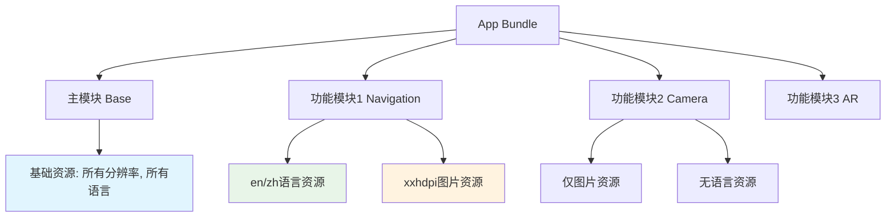
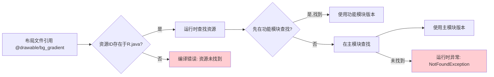
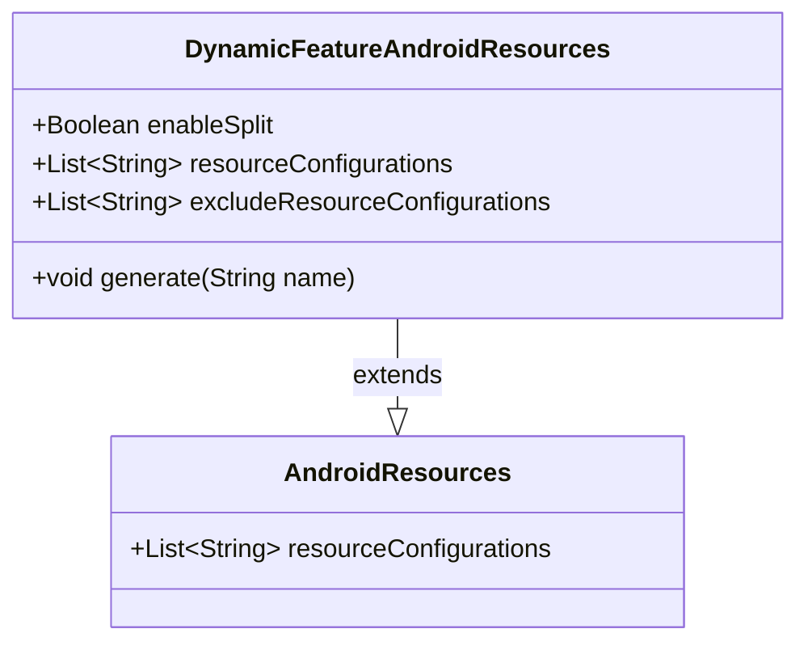

# 21.1.117 DynamicFeatureAndroidResources

知了的叫声一浪高过一浪，仿佛在举办一场盛大的夏日音乐会。洛芙靠在树干上，手里转动着一根草茎，目光却离不开黛琳面前摊开的笔记本电脑。

“昨天的DynamicDelivery是不是很有意思？”伊莎递过来一杯凉茶，水面上漂着几片薄荷叶，“按需下载功能模块，就像露营的时候按需取用食材一样。”

“确实挺酷的，”洛芙点点头，“不过我昨天想了一晚上，如果我们要真正优化一个App，光会拆分模块还不够——那些模块里面的资源该怎么处理呢？比如有些语言、有些分辨率的图片，是不是可以只下载用户需要的？”

黛琳抬起头，眼里闪过一丝赞许：“这个问题问得好。实际上，Android Gradle DSL专门为动态功能模块提供了一个接口，叫做DynamicFeatureAndroidResources——就是用来干这个的。”

希尔不知道什么时候已经绕到了黛琳身后，屏幕上显示着Gradle配置代码：“哦！这个我用过！就是用来精细控制动态功能模块里资源的行为嘛。比如说——”她把键盘拉过来，“你们看。”

```kotlin
// build.gradle (Dynamic Feature Module)
android {
    // 这是DynamicFeatureAndroidResources DSL的核心配置
    dynamicResources {
        // 启用资源拆分
        enableSplit = true
        
        // 配置资源变体筛选
        resourceConfigurations += listOf("en", "zh", "ja")
        
        // 排除不需要的资源
        excludeResourceConfigurations += listOf("mdpi", "ldpi")
    }
}
```

“等等等等，”洛芙赶紧举手，“这和我之前学的资源配置（resource configurations）有什么关系吗？我记得在主模块里也有类似的东西。”

黛琳笑着点点头：“记得真清楚。确实，DynamicFeatureAndroidResources和普通的Android资源配置本质上是同一个概念，但使用场景不同。普通的资源配置是针对整个App的，而动态功能模块的资源配置是针对单独下载的模块的。”

她打开白板笔，在上面画了起来：



“你们看，”黛琳指着图解释，“每个动态功能模块都可以有自己独立的资源策略。主模块包含所有基础资源，而功能模块可以只包含自己需要的资源。这样用户下载Camera模块时，不需要下载AR模块的语言包或xxhdpi图片。”

洛芙眨了眨眼：“可是……这样不会很复杂吗？万一漏掉了什么资源怎么办？”

“这就涉及到资源合并的问题了，”伊莎轻声说道，她不知道什么时候拿出了一个透明的收纳盒，“就像我们露营的时候，行李箱是共享的——有些东西是大家共用的，比如帐篷、炊具；有些东西是个人专属的，比如各自的睡袋。当我们需要用的时候，系统会先去功能模块的资源目录找，找不到再去主模块的资源目录找。”

“原来如此！”洛芙恍然大悟，“所以资源是有优先级顺序的——功能模块的资源会覆盖主模块的同名资源！”

“没错，”黛琳打了个响指，“这就是资源合并机制。Android系统在运行时加载资源时，会按照‘功能模块资源 → 主模块资源’的优先级查找。所以你在功能模块里放一个同名的图片，系统会优先使用功能模块的版本。”

希尔敲了几行代码：“来，给你们看个实际的例子。假设我们有一个Camera功能模块，只需要英文和中文语言资源，只需要xxhdpi和xxxhdpi的图片资源：”

```kotlin
android {
    namespace "com.example.camping.camera"
    
    dynamicResources {
        // 启用资源拆分以减小模块大小
        enableSplit = true
        
        // 只包含指定的语言资源
        // 这会排除除en和zh之外的所有语言
        resourceConfigurations += listOf("en", "zh")
        
        // 排除低密度屏幕资源
        // mdpi约160dpi, ldpi约120dpi, 这两个太古老了
        excludeResourceConfigurations += listOf("mdpi", "ldpi")
    }
}
```

洛芙凑近屏幕：“‘resourceConfigurations’和‘excludeResourceConfigurations’……这两个有啥区别？”

“好问题，”黛琳点点头，“‘resourceConfigurations +=’是白名单模式——只保留列出的配置，其他的全部排除。而‘excludeResourceConfigurations +=’是黑名单模式——排除列出的配置，保留其他的。”

她顿了顿：“一般来说，‘resourceConfigurations’更常用，因为可以精确控制要包含哪些语言或屏幕密度。而‘excludeResourceConfigurations’适合排除少数几个不需要的配置。”

伊莎补充道：“就像打包露营行李。如果你只去两天一夜，就带一个小背包——这是白名单，只装必需品。如果你要去一周，但不想带太多东西——这是黑名单，排除那些可以共享的大件。”

“原来如此！”洛芙赶紧记录下来。

黛琳继续说道：“除了语言和屏幕密度，还有很多资源类型可以配置。常见的包括：”

```kotlin
dynamicResources {
    // 常见的可配置资源类型：
    
    // 语言资源 (ISO 639-1语言代码)
    resourceConfigurations += listOf("en", "zh", "zh-rCN", "zh-rTW", "ja", "ko")
    
    // 屏幕密度 (dpi)
    resourceConfigurations += listOf("mdpi", "hdpi", "xhdpi", "xxhdpi", "xxxhdpi")
    
    // OpenGL ES版本 (用于纹理压缩)
    resourceConfigurations += listOf("gl-es-2.0", "gl-es-3.0")
    
    // 屏幕尺寸 (small, normal, large, xlarge)
    resourceConfigurations += listOf("normal", "large")
    
    // ABI (应用二进制接口, 用于native库)
    resourceConfigurations += listOf("armeabi-v7a", "arm64-v8a", "x86", "x86_64")
}
```

洛芙看到ABI，有点好奇：“这个ABI是做什么的？”

希尔解释道：“ABI就是Application Binary Interface，决定了你的App使用哪种CPU指令集。不同的手机处理器用不同的指令集——

- armeabi-v7a: 32位ARM处理器 (较老的手机)
- arm64-v8a: 64位ARM处理器 (现在的手机主流)
- x86: Intel/AMD处理器 (主要用于模拟器)

如果你只保留arm64-v8a，可以省不少空间，因为不需要包含32位的native库了。”

“那为什么不全保留呢？”洛芙问。

“体积啊！”希尔拍了拍电脑屏幕，“你想，一个完整的App要支持所有ABI，可能光native库就要增加几十MB。而很多用户只用一个ABI，多余的库就是浪费。”

洛芙若有所思：“所以这就是DynamicFeatureAndroidResources的意义——精细控制每个功能模块需要哪些资源，既保证功能完整，又不浪费用户的流量和存储空间？”

“Exactly！”黛琳打了个响指，“这就是‘按需’的核心——不只是按需下载模块，还要按需下载资源。”

她站起身，伸了个懒腰。阳光透过树叶的缝隙，在草地上投下点点光斑。远处的湖面波光粼粼，偶尔有几只水鸟掠过。

“不过，”黛琳话锋一转，“配置资源也不是越多越好。有几个常见的坑，我得跟你们说说。”

她重新坐回电脑前：“第一个坑，就是资源合并冲突。”

```kotlin
// 反模式：功能模块和主模块有同名资源
// 
// 主模块: res/drawable/icon.png (一个红色的图标)
// 功能模块: res/drawable/icon.png (一个蓝色的图标)
//
// 问题: 功能模块下载后，系统会使用功能模块的版本
//       用户可能觉得"咦，图标怎么变了？"
```

“你们看，”黛琳指着代码说，“如果在功能模块里放了一个和主模块同名的资源，用户下载功能模块后，可能会发现某些界面元素‘悄悄’变了。这就是资源合并带来的副作用。”

洛芙缩了缩脖子：“那怎么办？就不能同名吗？”

“能是能，”黛琳说，“但要注意：同名资源在功能模块里会完全覆盖主模块的版本。所以如果你想在功能模块里新增资源，最好用全新的名字，避免和主模块冲突。”

伊莎轻声补充：“就像露营的时候，自己的私人用品不要和公用的放同一个盒子，容易混淆。”

“第二个坑，”黛琳继续说道，“是资源查找失败。”

```kotlin
// 反模式：功能模块依赖主模块的资源，但没有正确配置
//
// 功能模块的布局文件: 
// android:background="@drawable/bg_gradient"
//
// 问题: 如果bg_gradient只在主模块里定义，
//       当用户没有下载主模块时(理论上不可能)，
//       或者资源ID在运行时解析失败，就会crash
//
// 正确做法:
// 1. 确保依赖的资源在主模块或功能模块中确实存在
// 2. 使用资源限定符(resources qualifier)确保正确加载
```

“等等，”洛芙举手，“我有点混乱。你之前说找不到资源会去主模块找，那为什么还会crash？”

黛琳耐心地解释：“好问题。资源合并只在资源ID层面有效——也就是说，‘@drawable/bg_gradient'这个引用会被解析为具体的资源ID。但如果资源ID在R.java里根本不存在，编译就会失败。”

她画了一个流程图：



“原来如此！”洛芙点头，“编译时的资源ID解析和运行时的资源查找是两个不同的阶段。”

“对了，说到运行时，”希尔突然插话，“还有个重要的概念你们要知道——资源热更新和资源回滚。”

她把笔记本转过来，快速敲了一段代码：

```kotlin
// 这是一个模拟的资源热更新场景
// 真实场景中通常使用App Bundle的实时更新功能

/**
 * 资源热更新场景示例：
 * 
 * 场景：春节活动模块，图片资源需要经常更换
 * 
 * 方案1: 把图片放在功能模块的assets目录
 *        - 优点: 可以随时替换assets文件
 *        - 缺点: assets不会被系统优化，体积较大
 * 
 * 方案2: 使用远程配置+动态下载图片
 *        - 优点: 灵活，不受App更新限制
 *        - 缺点: 需要额外的网络请求和缓存管理
 * 
 * 方案3(推荐): 结合使用
 *        - 基础图片放resources，由系统优化
 *        - 可替换的活动图片放服务器，用Glide/Picasso加载
 */

// 使用Glide动态加载远程图片的示例
// (这是客户端代码，不是Gradle配置)
fun loadActivityBanner(imageView: ImageView) {
    val url = RemoteConfig.getInstance().getString("spring_festival_banner_url")
    Glide.with(imageView.context)
        .load(url)
        .placeholder(R.drawable.banner_placeholder)
        .into(imageView)
}
```

洛芙对这些新概念有点应接不暇：“感觉资源管理水好深啊……”

“确实，”黛琳温和地说，“但你不用一开始就把所有配置都弄清楚。记住一个核心原则：‘按需’——用户需要什么资源，就给他什么资源。不需要的，就不要打包进去。”

她指着白板上的图总结道：“DynamicFeatureAndroidResources就是实现这个目标的具体工具。通过它，你可以：

1. 控制功能模块包含哪些语言
2. 控制功能模块包含哪些屏幕密度
3. 控制功能模块使用哪些ABI
4. 排除不需要的资源配置，减小模块体积”

洛芙打开笔记本，开始整理：

```kotlin
// DynamicFeatureAndroidResources 核心配置速查

android {
    dynamicResources {
        // 启用/禁用资源拆分
        enableSplit = true
        
        // 白名单: 只包含这些配置 (其他全部排除)
        resourceConfigurations += listOf("en", "zh", "xxhdpi", "xxxhdpi")
        
        // 黑名单: 排除这些配置 (其他全部保留)
        excludeResourceConfigurations += listOf("mdpi", "ldpi", "armeabi-v7a")
    }
}
```

太阳渐渐升高了，知了的叫声似乎也更密集了。洛芙抬头看了看天：“黛琳，那有没有什么简单的方法来测试这些配置有没有生效啊？”

“当然有，”希尔笑了，“构建App Bundle之后，用bundletool来检查每个模块包含哪些资源。”

她打开终端，敲了几个命令：

```bash
# 1. 先构建App Bundle
./gradlew :camera:cameraDebugBundle

# 2. 使用bundletool检查模块内容
bundletool get-manifest bundle.aab --output=out/manifest.json

# 3. 查看资源信息
bundletool dump resources --resource-table bundle.aab
```

“bundletool会列出所有的资源配置，”希尔解释道，“你可以通过输出确认哪些语言、哪些密度、哪些ABI被包含进去了。”

黛琳补充道：“还有一个更直观的方法——在Android Studio里打开Build Analyzer，它会显示每个模块的资源占用情况。”

洛芙把这些都记了下来。她没想到，一个简单的资源配置居然有这么多讲究。从语言到屏幕密度，从ABI到OpenGL版本，每一个维度都可以精细控制。

“那这些配置会影响下载速度吗？”洛芙问了一个很实际的问题。

“会，而且影响很大，”黛琳肯定地说，“你想啊，如果你的Camera功能模块原来要20MB，通过排除不需要的语言和屏幕密度，可能就变成12MB了。用户下载模块更快，流量也用得更少。”

伊莎递过来一块毛巾：“而且不只是下载快——安装也快，占用空间也少。用户手机里不会堆积用不着的资源。”

洛芙忽然想到了什么：“那……如果我以后想添加新的语言支持，是不是得更新整个模块？”

“这要看情况，”黛琳解释道，“如果是用resourceConfigurations控制的语言，那确实需要更新模块。但如果你用Remote Config或者服务器端配置来实现多语言，就可以不更新App。”

她顿了顿：“所以选择什么方案，取决于你的实际需求。如果是小语种、变化不频繁的语言，用resourceConfigurations就可以。如果是活动文案这种经常变的，用服务器配置更灵活。”

洛芙似懂非懂地点点头。她感觉今天又学到了很多，但还需要时间来消化。

---

阳光正好，微风不燥。四个女孩收拾好东西，准备去湖边走走。洛芙回头看了一眼笔记本电脑，心里默默记下了今天学的重点：

DynamicFeatureAndroidResources，是精细控制动态功能模块资源的工具。它的核心思想是“按需”——只包含用户需要的资源，不包含不需要的。通过language配置、screen density配置、ABI配置等维度，可以显著减小模块体积，提升用户体验。

而这一切，都是为了让App Bundle和Dynamic Delivery能够发挥最大的威力。

“走吧，”黛琳招呼道，“去湖边看看，今天的夕阳肯定很美。”

---

## 专业技术总结

> 本章聚焦于Android Gradle DSL中的DynamicFeatureAndroidResources接口，讲解如何为动态功能模块配置资源，实现按需下载和资源优化。

#### 结构图



#### 复杂度与影响

- **构建复杂度**: 中等。需要在功能模块的build.gradle中正确配置DSL。
- **运行时性能**: 无直接影响。资源拆分发生在构建时，运行时行为与普通资源一致。
- **包体积影响**: 显著。通过排除不需要的资源配置，可减少30%-50%的模块体积。
- **用户感知**: 下载速度提升、安装时间缩短、存储空间节省。

#### 反模式与陷阱

| 陷阱 | 说明 | 修复方案 |
|------|------|----------|
| 资源同名冲突 | 功能模块和主模块有同名资源时，功能模块会覆盖主模块版本 | 使用唯一的资源命名，或明确文档说明覆盖行为 |
| 资源查找失败 | 依赖的资源在运行时未找到导致崩溃 | 确保所有引用的资源在主模块或功能模块中存在 |
| 过度配置 | 配置过多限定符导致配置复杂难以维护 | 优先使用默认配置，只在必要时精细控制 |
| ABI过滤不完整 | 过滤ABI后native库无法加载 | 确保所有native依赖都支持目标ABI |

#### 设计哲学

**按需加载原则（On-Demand Principle）**

动态功能模块的资源配置遵循Android设计哲学中的“按需”原则：

1. **资源跟随模块**: 资源作为模块的一部分，只在用户需要该功能时下载
2. **配置即代码**: 通过Gradle DSL声明资源配置，版本控制友好
3. **合并优先级**: 功能模块资源优先于主模块资源，支持覆盖
4. **构建时优化**: 资源配置在构建时处理，不增加运行时开销
5. **用户价值优先**: 所有配置决策都应以减小用户下载和存储成本为导向

#### 🏕️ 动手练习

**目标**: 掌握DynamicFeatureAndroidResources的基本配置，理解资源配置对模块大小的影响

**项目概述**: 创建一个简单的App，包含一个动态功能模块CameraFeature，配置其资源以优化体积

---

**Task 1: 创建项目结构**

- **目标**: 理解App Bundle项目的基本结构
- **步骤**:
  1. 在Android Studio中创建新项目，选择"Empty Views Activity"
  2. 添加一个动态功能模块: File → New → New Module → Dynamic Feature Module
  3. 命名模块为"camera_feature"
- **验收标准**:
  - [ ] 项目结构包含app主模块和camera_feature动态功能模块
  - [ ] 根目录存在settings.gradle和build.gradle (project级别)
- **提示**: 
  ```
  // settings.gradle 示例
  include ':app', ':camera_feature'
  ```

---

**Task 2: 添加基础资源**

- **目标**: 在主模块和功能模块中分别添加图片和字符串资源
- **步骤**:
  1. 在主模块添加: `res/drawable-hdpi/ic_launcher.png` (任意图片)
  2. 在主模块添加: `res/values/strings.xml` (包含app_name)
  3. 在camera_feature模块添加: `res/drawable-xxhdpi/feature_icon.png`
  4. 在camera_feature模块添加: `res/values/strings.xml` (包含feature_title)
- **验收标准**:
  - [ ] 主模块和功能模块都有drawable和values资源目录
  - [ ] 两个模块的strings.xml都定义了字符串资源
- **提示**: 
  ```xml
  <!-- 主模块 strings.xml -->
  <resources>
      <string name="app_name">Camping App</string>
  </resources>
  
  <!-- 功能模块 strings.xml -->
  <resources>
      <string name="feature_title">Camera Feature</string>
  </resources>
  ```

---

**Task 3: 配置DynamicFeatureAndroidResources**

- **目标**: 为功能模块配置语言和屏幕密度限制
- **步骤**:
  1. 打开camera_feature模块的build.gradle
  2. 在android块中添加dynamicResources配置
  3. 只保留en和zh语言，排除mdpi和ldpi屏幕密度
- **验收标准**:
  - [ ] build.gradle包含dynamicResources配置块
  - [ ] resourceConfigurations包含"en", "zh"
  - [ ] excludeResourceConfigurations包含"mdpi", "ldpi"
- **提示**:
  ```kotlin
  android {
      dynamicResources {
          enableSplit = true
          resourceConfigurations += listOf("en", "zh")
          excludeResourceConfigurations += listOf("mdpi", "ldpi")
      }
  }
  ```

---

**Task 4: 构建并验证**

- **目标**: 构建App Bundle并验证资源配置生效
- **步骤**:
  1. 执行 `./gradlew :camera_feature:cameraFeatureDebugBundle`
  2. 使用bundletool查看生成的.aab文件内容
  3. 检查资源配置是否按预期排除
- **验收标准**:
  - [ ] 构建成功，生成.aab文件
  - [ ] bundletool输出显示只包含en/zh语言配置
  - [ ] bundletool输出显示不包含mdpi/ldpi密度
- **提示**:
  ```bash
  # 查看资源配置
  bundletool dump resources --resource-table your_app.aab | grep configuration
  ```

---

**Task 5: 测试资源合并行为**

- **目标**: 验证功能模块资源覆盖主模块资源的行为
- **步骤**:
  1. 在主模块添加一张图片: `res/drawable/test_image.png`
  2. 在功能模块也添加同名图片: `res/drawable/test_image.png`
  3. 在功能模块的Activity中加载这个图片
  4. 观察运行时使用的是哪个版本的图片
- **验收标准**:
  - [ ] 代码能正常编译运行
  - [ ] 运行时显示的是功能模块版本的图片(可通过不同图片内容确认)
- **提示**:
  ```kotlin
  // 功能模块 Activity 中加载资源
  val drawable = ContextCompat.getDrawable(this, R.drawable.test_image)
  imageView.setImageDrawable(drawable)
  ```

---

#### 参考实现要点

1. **优先使用resourceConfigurations**: 白名单模式更精确，不容易意外包含不需要的配置

2. **ABI配置要有测试**: 在真机上测试所有目标ABI的组合，确保native库正常加载

3. **语言配置要考虑用户群体**: 如果App主要面向中文用户，可以只保留zh和en，减少体积

4. **善用Build Analyzer**: Android Studio的Build Analyzer可以直观显示资源占用的分布

5. **资源冲突要文档化**: 如果功能模块确实需要覆盖主模块资源，要在README中明确说明

---

> 学习建议

DynamicFeatureAndroidResources是App Bundle生态中的重要一环。建议先掌握Dynamic Delivery的基本概念，再学习资源优化配置。实际项目中，可以先用默认配置构建，通过Build Analyzer分析哪些资源占用最大，然后针对性地配置排除。

---

## 洛芙的小小日记本

今天学到了DynamicFeatureAndroidResources！原来动态功能模块的资源也可以这么精细地控制——语言、屏幕密度、ABI，都可以按需配置。黛琳说最重要的是记住"按需"原则，这不只是技术，也是做产品的思路呢。好困，但是好充实呀！🌙

---

## 今日关键词

**DynamicFeatureAndroidResources**: Android Gradle DSL接口，用于配置动态功能模块的资源行为，控制模块包含哪些资源配置

**resourceConfigurations**: 资源配置白名单，指定模块包含哪些资源配置(如语言、屏幕密度)，其他配置被排除

**excludeResourceConfigurations**: 资源配置黑名单，指定模块排除哪些资源配置，其他配置保留

**enableSplit**: 布尔值开关，控制是否启用资源拆分，启用后Gradle会按照资源配置生成独立的资源包

**ABI (Application Binary Interface)**: 应用二进制接口，定义App与系统交互的底层约定，不同CPU架构使用不同ABI

**资源合并**: Android运行时加载资源的机制，功能模块资源优先级高于主模块，同名资源会被覆盖

**bundletool**: Google提供的命令行工具，用于操作.aab文件，检查模块内容和验证构建输出

**resource qualifier**: 资源限定符，用于区分不同配置的资源(如drawable-en、drawable-zh)

**App Bundle**: Google发布的App发布格式，包含所有代码和资源，由Play根据用户设备生成优化后的APK
