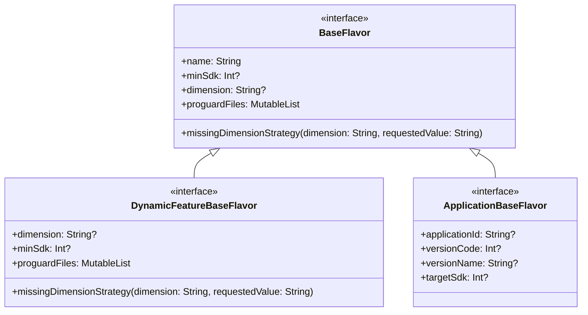
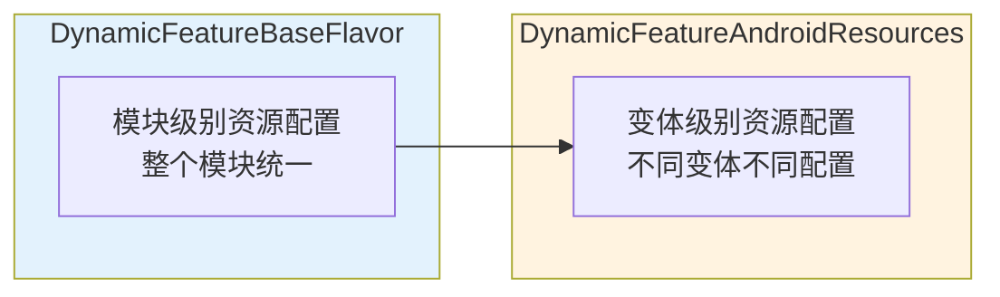

# 21.1.118 DynamicFeatureBaseFlavor

太阳渐渐升高，阳光穿过稠密的树叶，在地上投下一个个圆形的金色光斑。洛芙抬手遮挡了一下刺眼的阳光，感受着夏日的炙热。

“黛琳姐姐，”洛芙喝了一口水，“刚才学的DynamicFeatureAndroidResources好棒啊！能精细控制每个功能模块的资源。可是……如果我想让不同的功能模块有不同的配置呢？比如有些模块需要高版本SDK，有些模块可以支持更老的手机？”

黛琳抬起头，嘴角浮现一丝微笑：“你问到点子上了。这就是我们接下来要学的——DynamicFeatureBaseFlavor。”

“BaseFlavor？”洛芙回想起之前学过的BaseFlavor，“是不是和之前学的那个‘基味’差不多？”

“本质上是一样的，但作用域不同。”黛琳打开笔记本电脑，“之前的BaseFlavor是给主App模块用的，而DynamicFeatureBaseFlavor是专门给动态功能模块用的产品风味基类。”

她调出一张架构图：



“你们看，”黛琳指着图解释，“DynamicFeatureBaseFlavor继承自BaseFlavor，但它不需要applicationId和versionCode这些应用级别的属性。为什么呢？因为动态功能模块不是独立的App，它寄生在主App里。这些属性由主App统一管理。”

洛芙似懂非懂地点点头：“也就是说，功能模块只管自己的那一部分，不需要操心‘我是哪个App’这种问题？”

“完全正确，”希尔在旁边补充道，“动态功能模块就像公司里的一个部门——部门不需要有自己的公司营业执照，那是总公司的事。模块的minSdk、dimension这些‘营业执照’细节，都由主App统一决定。”

伊莎轻声笑道：“就像露营团队~每个小组有自己的分工~但对外是一个整体~”

---

黛琳打开一个示例配置文件：

```kotlin
// build.gradle (Dynamic Feature Module)
android {
    // DynamicFeatureBaseFlavor 配置
    
    // 1. 设置风味维度
    // 风味维度用于将不同的产品风味分组
    dimension = "function"
    
    // 2. 设置最小SDK版本
    // 这个功能模块需要的最低Android版本
    minSdk = 21
    
    // 3. 缺失维度策略
    // 当主App没有定义某个维度时，如何处理
    missingDimensionStrategy = "function", "camera"
    
    // 4. ProGuard/R8 混淆规则文件
    proguardFiles += "proguard-rules.pro"
}
```

“先从最简单的说起——dimension。”黛琳敲了敲屏幕上的那一行，“风味维度就像给产品风味贴的标签。你可以把不同的功能模块分到不同的‘部门’，比如‘camera’部门、‘navigation’部门、‘ar’部门。”

“为什么需要分部门？”洛芙不解地问。

“为了组合，”希尔抢着回答，“你想啊，如果主App有两个维度——‘version’（免费版/付费版）和‘function’（camera/navigation/ar），那理论上就可以组合出2×3=6种变体。但有些组合可能没意义，比如‘免费版+AR模块’。通过dimension，你可以控制哪些功能模块属于哪个部门。”

黛琳点点头：“没错。而且dimension还有一个重要作用——配合missingDimensionStrategy。”

她调出另一段代码：

```kotlin
// 主App的 build.gradle
android {
    // 定义风味维度
    flavorDimensions += "version"
    flavorDimensions += "function"
    
    productFlavors {
        create("free") {
            dimension = "version"
            // 免费版配置
        }
        create("premium") {
            dimension = "version"
            // 付费版配置
        }
    }
}

// 动态功能模块的 build.gradle
android {
    // 这个模块属于 "function" 维度
    dimension = "function"
    
    // 如果主App没有定义 "function" 维度，
    // 默认使用 "camera"
    missingDimensionStrategy = "function", "camera"
}
```

洛芙盯着代码看了半天：“这个missingDimensionStrategy到底是啥意思？”

黛琳笑了笑：“简单来说，就是‘如果主App没有定义这个维度，怎么办？’”

她打了个比方：“就像你要去一个露营地点，但不知道那边有什么地形。你提前准备了一个默认方案——如果森林，就带砍刀；如果湖泊，就带钓鱼竿。missingDimensionStrategy就是这个‘默认方案’。”

“原来是备用方案！”洛芙恍然大悟。

---

太阳已经移到正上方，树下投射出笔直的树影。伊莎从背包里拿出几块小点心分给大家。

“休息一下，”伊莎笑着说，“吃完再继续~”

洛芙接过一块饼干，咬了一口：“对了黛琳，我刚才在想一个问题——如果功能模块的minSdk比主App的minSdk高，会怎么样？”

黛琳表情变得认真起来：“这是个很重要的问题。实际上，动态功能模块的minSdk必须大于等于主App的minSdk。”

她打开一段代码演示：

```kotlin
// 主App的 minSdk = 21
// android {
//     defaultConfig {
//         minSdk = 21
//     }
// }

// 功能模块A的 minSdk = 21 (合法)
// android {
//     minSdk = 21
// }

// 功能模块B的 minSdk = 26 (合法，但有限制)
// android {
//     minSdk = 26
// }

// 功能模块C的 minSdk = 19 (非法！)
// android {
//     minSdk = 19  // 编译错误！
// }
```

“为什么minSdk不能比主App低？”洛芙问。

“你想啊，”希尔解释道，“主App支持的最低版本是Android 5.0（API 21），那它肯定调用不了API 26才有的功能。如果功能模块说我只需要API 19，那是不可能的——因为主App本身就不支持API 19。”

黛琳补充道：“反过来，功能模块可以把minSdk设得比主App高。比如主App支持API 21+，但某个相机模块需要API 26才能工作（因为用到了Camera2的新特性）。这样只有API 26+的设备才能下载这个相机模块，API 21-25的用户看不到这个模块。”

洛芙赶紧记下来：“所以功能模块的minSdk可以是主App的minSdk，也可以更高，但不能更低！”

“没错，”黛琳打了个响指，“这就是DynamicFeatureBaseFlavor的核心约束之一。”

---

吃完点心，黛琳继续讲解。

“除了minSdk，还有一个重要的配置——proguardFiles。”

她调出代码：

```kotlin
android {
    // ProGuard/R8 混淆规则
    proguardFiles += "proguard-rules.pro"
    
    // 也可以添加多个规则文件
    proguardFiles += getDefaultProguardFile("proguard-android-optimize.txt")
    
    // 还可以添加模块特定的规则
    proguardFiles += "rules/camera-proguard.pro"
}
```

“为什么要给功能模块配置ProGuard规则？”洛芙问。

“和主App一样——保护代码安全，减小体积。”希尔解释道，“虽然功能模块是单独下载的，但它也是App的一部分。如果不混淆，反编译后可能泄露业务逻辑。”

黛琳补充道：“不过功能模块的ProGuard规则和主App略有不同。你需要确保模块之间的依赖关系正确，否则可能会出现找不到类的问题。”

她调出一个常见的反模式：

```kotlin
// 反模式：功能模块的ProGuard规则不完整
//
// 问题描述：
// 功能模块A使用了模块B的类，但ProGuard没有正确配置keep规则
// 导致打包时B的类被错误地混淆或移除
//
// 症状：运行时ClassNotFoundException 或 NoClassDefFoundError

// 错误的配置：
proguardFiles += "proguard-rules.pro"
// 缺少对模块间依赖的保护

// 正确的配置：
proguardFiles += "proguard-rules.pro"

// 在proguard-rules.pro中添加：
-keep class com.example.shared.** { *; }  // 保护共享类
-keep class com.example.moduleb.** { *; }  // 保护模块B的类
```

洛芙缩了缩脖子：“好可怕……那怎么避免这种问题？”

“有几个建议，”黛琳说道，“第一，尽量把被多个模块共享的代码放在主App或单独的library模块里；第二，为每个模块单独配置ProGuard规则，明确列出需要保护的类；第三，在发布前用bundleDebug之类的命令测试，确保没有问题。”

---

伊莎抬头看了看天：“太阳好大~我们去那边树荫下继续吧~”

大家收拾了一下，挪到更浓密的树荫下。湖风吹过来，带来一丝凉意。

“接下来还有什么配置？”洛芙问。

“还有一个很强大的功能——resourceConfigurations，但这个我们在上一章已经详细讲过了。”黛琳说道，“DynamicFeatureBaseFlavor还有一个特性，就是它可以继承主App的部分配置。”

她调出最后一组代码：

```kotlin
// 主App配置
android {
    defaultConfig {
        // 主App的资源配置：包含所有语言和屏幕密度
        resourceConfigurations += listOf("en", "zh", "ja", "ko", "fr", "de")
        resourceConfigurations += listOf("mdpi", "hdpi", "xhdpi", "xxhdpi", "xxxhdpi")
    }
}

// 动态功能模块配置
android {
    // 继承主App的配置，但进一步限制
    // 功能模块只需要英文和中文，以及高清屏幕
    resourceConfigurations += listOf("en", "zh")
    resourceConfigurations += listOf("xhdpi", "xxhdpi", "xxxhdpi")
}
```

洛芙好奇地问：“这里的resourceConfigurations和上一章的DynamicFeatureAndroidResources有什么区别？”

黛琳笑着解释：“本质上是同一个概念，但在不同层面配置。DynamicFeatureBaseFlavor的resourceConfigurations是模块级别的粗粒度控制，而DynamicFeatureAndroidResources可以做到更精细的控制——比如针对不同的构建变体使用不同的资源配置。”

她画了一张对比图：



“简单来说，”伊莎总结道，“BaseFlavor就像露营的总计划~去几天、带什么东西~而AndroidResources就像每天的具体安排~根据天气情况调整~”

“原来如此！”洛芙兴奋地说，“两者配合使用，就能达到最优化！”

---

黛琳最后总结道：“DynamicFeatureBaseFlavor是配置动态功能模块的基石。它决定了模块属于哪个维度、需要多高的Android版本、如何处理缺失维度、以及使用哪些ProGuard规则。掌握这些，你就能精细控制每个功能模块的行为。”

她顿了顿：“不过要记住，功能模块的配置最终还是要和主App协调一致。如果两边配置冲突，以主App为准。”

洛芙若有所思地点点头：“感觉Dynamic Feature的水好深啊……每一个概念都和其他概念有关系。”

“就是这样，”希尔笑着说，“慢慢来，多实践就懂了。露营也是同理嘛——第一次搭帐篷手忙脚乱，多搭几次就熟练了。”

洛芙笑了起来：“那我们什么时候再搭一次帐篷？”

“你先把今天的知识消化完再说！”希尔开玩笑地回应。

湖面上波光粼粼，几只水鸟悠然掠过。太阳渐渐偏西，树影慢慢拉长。洛芙翻开笔记本，看着满屏的代码和笔记，心里充满了成就感。

---

> 学习建议：DynamicFeatureBaseFlavor是动态功能模块配置的核心，理解minSdk约束、风味维度和missingDimensionStrategy是掌握模块化开发的关键。建议在实际项目中尝试创建简单的动态功能模块，观察不同配置对构建结果的影响。

## 洛芙的小小日记本

今天学了DynamicFeatureBaseFlavor~原来功能模块也有自己的"口味"设置！黛琳说minSdk不能比主App低，就像我不能比团队里最矮的人还高（不对，应该是不能比最高的人还高？）。Anyway，理解了维度、缺失策略这些概念，露营队的分工和这个超级像！下午去湖边洗东西凉快一下~

---

## 今日关键词

**DynamicFeatureBaseFlavor** - 动态功能模块的基础风味配置接口，定义模块的维度、最小SDK版本、ProGuard规则等核心属性

**dimension** - 风味维度，用于将产品风味分组，控制功能模块与主App构建变体的组合

**minSdk** - 动态功能模块要求的最低Android版本，必须大于等于主App的minSdk

**missingDimensionStrategy** - 缺失维度策略，当主App未定义某维度时的默认处理方式

**proguardFiles** - ProGuard/R8混淆规则文件列表，用于代码混淆和安全保护

**resourceConfigurations** - 资源配置列表，控制模块包含哪些语言、屏幕密度等资源

**Flavor Dimension** - 产品风味维度，用于组织和组合不同的产品风味

**Dynamic Delivery** - 动态交付，Android App Bundle的核心特性，支持按需下载功能模块
