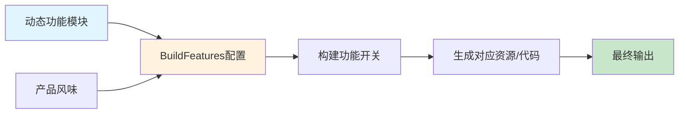
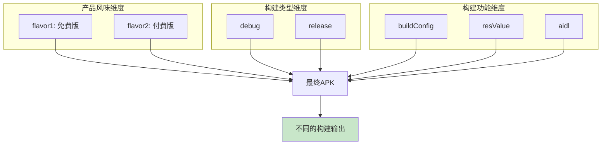
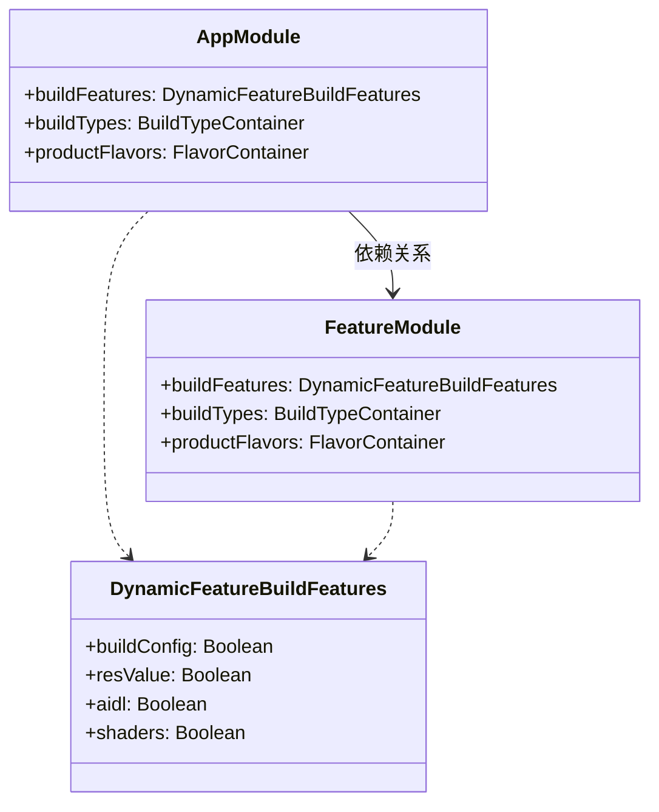
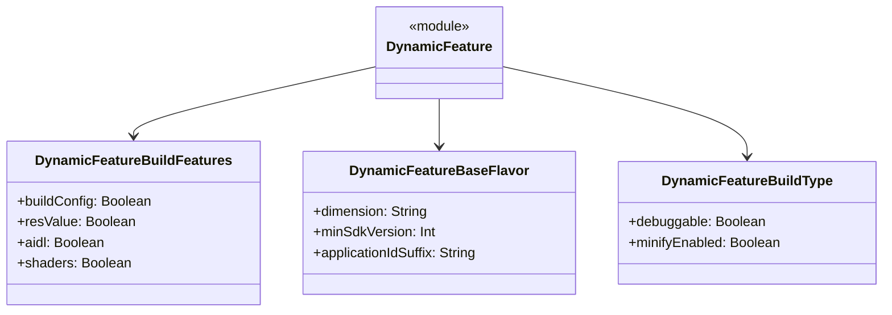

# 21.1.119 DynamicFeatureBuildFeatures

午后的阳光透过茂密的树叶，在地面上投下斑驳的光影。洛芙靠在树干上，手里拿着黛琳的笔记本，目光却忍不住飘向湖面——那里，几只水鸟正在悠闲地游弋，时不时扎个猛子，再浮上来时嘴里已经衔着一条小鱼。

“在看什么呢？”希尔端着一杯凉茶走过来，顺着洛芙的视线望去，“那几只水鸟？从上午就在那儿了。”

“在想我们刚才学的，”洛芙接过杯子，“DynamicFeatureBaseFlavor……你说得对，产品风味确实很重要。但我总觉得缺了点什么。”

“缺了什么？”希尔在她旁边坐下。

“就像是……我们知道怎么配置风味，但这些风味最后怎么变成真正的构建？总不能只是写个配置就完事了吧？”

黛琳抬起头，白板笔在指尖转了一圈：“洛芙问得很好。产品风味只是配置，真正的构建还需要构建功能（BuildFeatures）来实现。希尔，去把那个拿过来。”

“什么？”希尔一时没反应过来。

“就是我们上午收起来那个——DynamicFeatureBuildFeatures的示例工程。”黛琳指的是她们之前准备的Android模块化项目，里面包含了主模块和几个动态功能模块。

希尔很快从背包里翻出一个笔记本电脑，打开一个项目结构图。屏幕上显示的是模块间的依赖关系图——主app模块在顶层，下面挂着几个动态功能模块，每个都有独立的build.gradle.kts配置。

“在动态功能模块里，”黛琳指着屏幕说，“构建功能决定了模块在构建时会产生什么样的输出。DynamicFeatureBuildFeatures就是用来配置这些功能的DSL接口。”

伊莎凑过来看地图：“听起来像是……给每个动态功能模块发一张‘施工许可证’？”

“施工许可证？”洛芙眨眨眼，“这个比喻有趣。”

“确实很像，”黛琳微微一笑，“产品风味告诉你‘要建成什么样的房子’，而构建功能告诉构建系统‘需要哪些工具和工序’。两者配合，才能把配置变成可安装的APK。”

黛琳在白板上画了一个简单的流程图：



“让我们来看看具体的配置，”黛琳调出build.gradle.kts的代码片段，“DynamicFeatureBuildFeatures里有几个关键属性。”

她指向屏幕上的代码：

```kotlin
android {
    ...
    buildFeatures {
        // 启用/禁用各项构建功能
        buildConfig = true
        resValue = true
        aidl = true
        shaders = true
    }
    ...
}
```

“这个buildFeatures块就是DynamicFeatureBuildFeatures的DSL表现，”黛琳解释道，“每个属性对应一个构建功能。”

洛芙拿出笔记本准备记录：“能详细讲讲每个功能吗？”

“首先是buildConfig，”黛琳说，“它决定是否生成BuildConfig类。这个类包含了构建时生成的版本信息、版本代码等常量。”

“我知道！”希尔兴奋地说，“就像我们在主模块里用的那个VERSION_NAME，每次打不同渠道包时会自动变成对应的值。在动态功能模块里也可以用！”

“对，”黛琳点头，“但要注意，动态功能模块的BuildConfig默认是禁用的。如果你想在模块里直接用版本信息，需要显式开启。”

“为什么默认禁用？”洛芙问。

“因为动态功能模块通常是比较小的功能模块，不需要包含完整的构建配置信息。而且启用会增加编译时间——每次构建都要生成新的BuildConfig类。”

伊莎想了想：“就像露营时，轻装上阵总比背个大背包轻松？”

“完全正确，”黛琳笑了，“动态功能模块本来就追求轻量化，默认不启用这些功能是合理的。”

接下来黛琳讲到了resValue：“这个功能允许动态功能模块直接定义资源值，而不需要依赖主模块。”

“在主模块里我们不是可以直接写res/values/strings.xml吗？”洛芙问。

“在主模块当然可以，但在动态功能模块里，默认情况下资源是封闭的——模块只能用自己的资源，不能直接定义新的资源ID。”黛琳调出另一个示例，“启用resValue后，模块就可以像这样定义自己的字符串资源：”

```kotlin
android {
    buildFeatures {
        resValue = true
    }
}

android.defaultConfig {
    resValue("string", "feature_name", "我的动态功能")
}
```

“这样模块就拥有了自己的资源定义能力，”黛琳补充道，“但同样，这会带来命名空间冲突的风险，所以要谨慎使用。”

洛芙若有所思：“感觉每个功能都是把双刃剑——给你能力，但也带来复杂度。”

“没错，”黛琳点头，“这就是为什么Android默认采用保守策略——先给你最基础的能力，想要更多就自己开启。”

接下来黛琳讲到了aidl和shaders这两个功能。

“AIDL是用来做进程间通信的，”黛琳说，“如果你需要跨进程调用动态功能模块的服务，就需要启用aidl。”

“跨进程？”洛芙对这个概念还有些模糊。

“简单说，就是两个不同的应用进程之间互相传递数据，”希尔插嘴道，“比如你的主应用需要调用动态功能模块里的某个服务来执行任务。”

“那shaders呢？”洛芙问。

“shaders是着色器，”伊莎说，“用于自定义渲染效果。如果你的动态功能模块里有OpenGL相关的图形功能，就需要启用它。”

黛琳总结道：“这些功能不是每个模块都需要开启的。基本原则是——按需启用，不要为了‘万一以后用到’而提前开启，这会增加不必要的构建复杂度。”

洛芙突然想到一个问题：“那这些构建功能和之前学的DynamicFeatureBaseFlavor是什么关系？产品风味和构建功能，它们是怎么配合工作的？”

黛琳在空中画了一个十字：“产品风味（Flavor）决定‘构建什么版本’，构建功能（BuildFeatures）决定‘构建时包含哪些能力’。它们是正交的维度，可以自由组合。”

她画出第二个图来解释：



“想象一下，”黛琳说，“你要构建一个付费版的debug APK。那么系统会：1）应用付费版的产品风味配置；2）应用debug构建类型；3）应用所有启用的构建功能。三者叠加，生成最终的APK。”

洛芙茅塞顿开：“所以它们是分工合作的！产品风味决定内容，构建功能决定能力，构建类型决定优化程度！”

“Exactly（正是如此）！”希尔打了个响指，“我现在给你看一个反模式的例子——有些新手会这样写：”

```kotlin
// ❌ 反模式：过度配置
android {
    buildFeatures {
        buildConfig = true
        resValue = true
        aidl = true
        shaders = true
        // 甚至还有其他开关
        viewBinding = true
        dataBinding = true
    }
}
```

“虽然功能都能工作，”希尔继续说，“但问题是——你的动态功能模块真的需要这些吗？每个开关都意味着额外的构建时间和维护成本。如果模块只是一个简单的功能模块，这些配置就是过度工程。”

黛琳补充：“正确的做法是只启用模块真正需要的功能，像这样：”

```kotlin
// ✅ 推荐配置：按需启用
android {
    buildFeatures {
        // 只启用模块需要的那个功能
        buildConfig = true
        // 其他功能默认false，不需要显式写
    }
}
```

洛芙好奇地问：“那如果我需要conditional的构建功能呢？比如某些渠道需要，某些渠道不需要？”

黛琳赞许地点头：“好问题。对于这种情况，我们通常在flavor维度处理，而不是在buildFeatures里做条件判断。”

她举了一个实际的例子：

```kotlin
// 在flavor维度处理条件需求
productFlavors {
    create("free") {
        // 免费版：不需要buildConfig，因为不需要版本信息
        buildConfigField("Boolean", "IS_PREMIUM", "false")
    }
    create("premium") {
        // 付费版：需要启用buildConfig
        buildConfigField("Boolean", "IS_PREMIUM", "true")
    }
}

buildFeatures {
    buildConfig = true  // 在风味层面控制，而不是在功能层面
}
```

“这样一来，”黛琳总结道，“构建功能是统一开关，具体哪些版本生效，由产品风味决定。这种分层设计让配置更清晰，也更容易维护。”

伊莎轻轻点了点头：“就像露营时的装备清单——基础装备是每个人都要带的，但有些额外装备只有特定的人才会用到。清单上写清楚，谁需要什么一目了然。”

“对，”黛琳微笑着说，“而且不会有人背着一堆用不上的东西爬山，累得半死。”

洛芙突然想起一个问题：“那动态功能模块和主模块之间的构建功能配置有关系吗？主模块的配置会影响子模块吗？”

“问得好，”黛琳调出模块依赖图，“默认情况下，动态功能模块的配置是独立的。但有几个关键点需要记住。”

她在屏幕上画出第三个图：



“首先，子模块可以继承父模块的部分配置，比如Android SDK版本、编译工具版本等，”黛琳解释道，“但buildFeatures是独立的，子模块可以有自己的配置，不受主模块限制。”

“那如果我想让子模块的配置和主模块一样呢？”洛芙问。

“可以通过配置继承来实现，”希尔说，“比如在主模块的ext块里定义一些共享变量，子模块可以引用这些变量。”

黛琳补充：“但通常不建议这样做。动态功能模块本身就是独立发布的单元，保持配置独立性更好——这样模块可以独立构建和测试，不需要依赖主模块的完整配置。”

时间悄悄流逝，午后的阳光开始变得柔和。湖面上倒映着金色的波光，偶尔有鱼儿跃出水面，激起一圈圈涟漪。

洛芙伸了个懒腰：“今天学的真多……产品风味、构建功能，还有它们之间的配合。”

“还有最重要的一点，”黛琳收起白板，“DynamicFeatureBuildFeatures不仅仅是配置开关，它还反映了Android模块化的核心理念——按需加载，最小化包体积。每个功能都有成本，启用前要想清楚是否真的需要。”

伊莎看向湖面：“就像我们露营时带的每一样东西——不是越多越好，而是要刚好够用。”

“对了，”希尔突然想起什么，“我还有个实际案例要给你们看。上次我帮一个项目做模块化重构，他们原来把很多共用代码塞在主模块里，导致包体积很大。后来我们把功能拆成动态模块，按需加载，包体积直接缩小了30%。”

“这么有效？”洛芙惊讶地问。

“因为动态功能模块只在用户需要时才下载安装，”希尔解释道，“不用的功能不会占用用户的设备空间。”

黛琳点头：“这就是Google Play Feature Delivery的核心价值。DynamicFeatureBuildFeatures是实现这个目标的基础配置之一。”

洛芙若有所思地点点头。她拿起笔记本，看着上面记录的各种配置选项，突然觉得它们不再只是枯燥的代码，而是像露营装备清单一样，每一项都有其存在的意义。

“谢谢你们，”洛芙认真地说，“我现在对动态功能模块的构建配置有了完整的理解。”

黛琳温柔地笑了：“不客气。记住，技术只是工具，用好工具才能让产品更优秀。走吧，我们去看看今晚的露营地点选哪里——听说有个更好的观测点，可以看到完整的星空。”

---

## 专业技术总结

**DynamicFeatureBuildFeatures** 是 Android Gradle Plugin 提供的 DSL 接口，用于配置动态功能模块（Dynamic Feature Module）在构建时的各项功能开关。它决定了模块在编译阶段会生成哪些资源、代码和配置。

#### 结构图



#### 复杂度与影响

- **buildConfig**：启用时每次构建都会生成新类，增加轻微编译时间（<1秒）
- **resValue**：可能产生资源ID冲突，需要做好命名空间管理
- **aidl**：启用AIDL会增加IPC复杂度，不建议在简单模块中使用
- **shaders**：仅在需要OpenGL渲染时才需要启用

#### 反模式与陷阱

1. **过度启用构建功能**：启用所有功能会增加编译时间和包体积，违背动态模块的轻量化原则。解决：按需启用，只开启模块真正需要的功能。

2. **在buildFeatures中做条件判断**：试图通过buildFeatures实现渠道差异化配置。解决：使用productFlavors处理配置差异，buildFeatures只做功能开关。

3. **子模块配置与主模块强耦合**：导致模块无法独立构建和测试。解决：保持配置独立性，必要时使用共享变量而非直接继承。

#### 设计哲学

**最小化原则（Principle of Minimum）**：动态功能模块的设计目标是按需加载，因此构建功能默认保守，只启用必要的功能。这符合以下工程实践：
- 奥卡姆剃刀：如无必要，勿增实体
- 单一职责：每个模块只负责自己需要的功能
- 可组合性：模块间配置正交，可自由组合

#### 🏕️ 动手练习

**目标**：掌握为动态功能模块配置buildFeatures的技能

**项目背景**：创建一个简单的动态功能模块，模拟"用户反馈"功能的独立模块

**任务**：

1. **创建动态功能模块**
   - 在Android项目中添加新的dynamic feature模块
   - 配置模块的build.gradle.kts文件

2. **理解默认配置**
   - 运行构建，观察默认情况下的buildFeatures表现
   - 记录哪些功能是默认启用的

3. **按需启用功能**
   - 根据模块需求启用buildConfig
   - 观察启用前后的构建差异

4. **对比错误配置**
   - 尝试过度启用所有功能，观察构建日志
   - 分析哪些警告和错误是由于配置不当导致的

5. **实现条件配置**
   - 使用productFlavors实现不同渠道的配置差异化
   - 验证配置的实际效果

6. **测试模块独立性**
   - 单独构建动态功能模块（不使用assembleDebug）
   - 验证模块是否可以独立构建

**验收标准**：
- [ ] 成功创建动态功能模块
- [ ] 能够解释默认配置下哪些buildFeatures启用
- [ ] 能够按需启用buildConfig
- [ ] 能够使用productFlavors实现配置差异化
- [ ] 模块可以独立构建成功

**参考实现要点**：
- 动态功能模块需要在settings.gradle.kts中声明
- 使用`dynamicFeature`块创建模块
- buildFeatures配置遵循"按需启用"原则

> 学习建议：理解DynamicFeatureBuildFeatures的最佳方式是实际配置一个动态模块并观察构建过程。推荐从最小配置开始，逐步增加功能，观察每一步的变化。记住，技术选型要以实际需求为导向，不要为了"功能全"而过度配置。

---

洛芙的小小日记本

今天黛琳教了我动态功能模块的构建功能配置，原来每个功能开关都是有成本的！就像露营时背多少东西要根据自己的体力来，模块配置也是同理——够用就好，不需要塞得满满的。希尔说的那个案例让我印象深刻，模块化真的可以明显缩小包体积，我也要把学到的用起来！

---

今日关键词

- **DynamicFeatureBuildFeatures**：Android Gradle Plugin的DSL接口，用于配置动态功能模块的构建功能开关
- **buildConfig**：构建配置开关，启用后生成BuildConfig类，包含版本信息等常量
- **resValue**：资源值定义开关，允许模块直接定义字符串、颜色等资源
- **aidl**：进程间通信接口定义开关，用于跨进程调用
- **shaders**：着色器开关，用于OpenGL渲染功能
- **动态功能模块**：Google Play Feature Delivery的核心组件，支持按需下载和安装
- **模块化**：将应用拆分成独立模块的架构方式，提高可维护性和包体积优化
- **产品风味（Flavor）**：用于创建不同版本应用的配置维度
- **构建类型（Build Type）**：debug或release等构建变体
- **命名空间**：资源或代码的所属范围，用于避免冲突