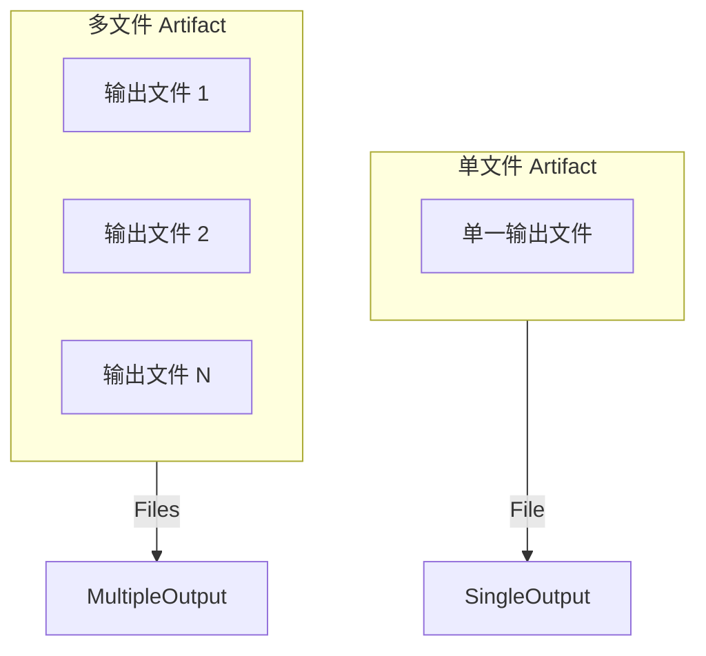
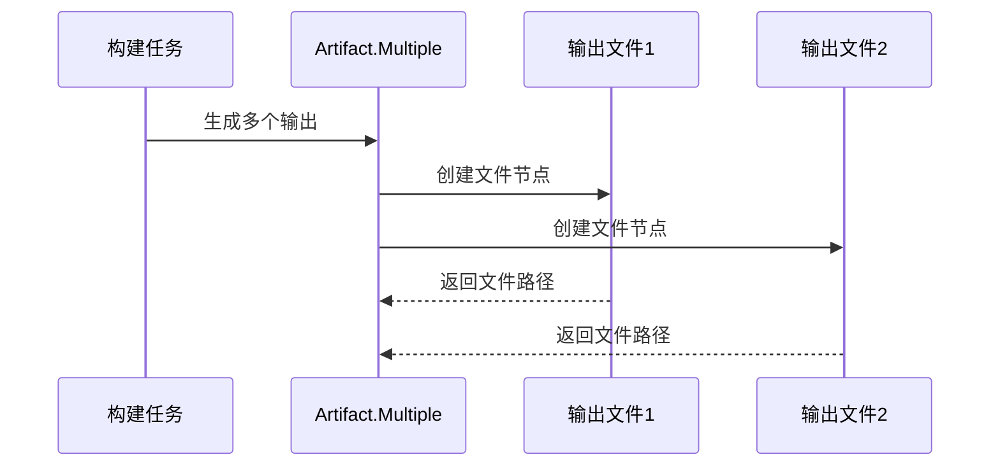
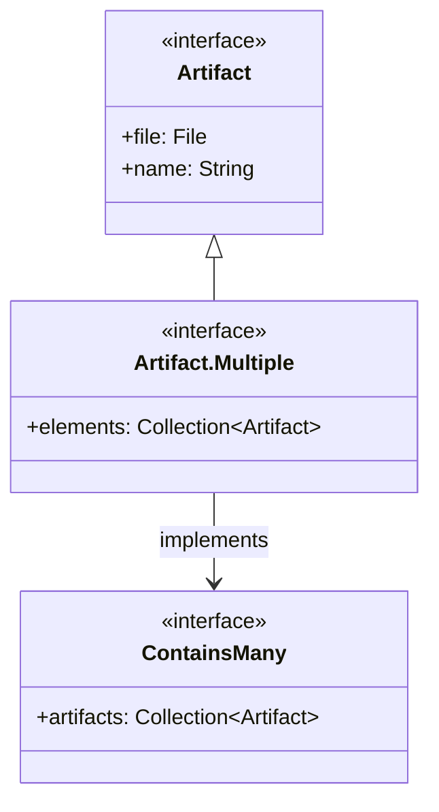

# 21.1.12 Artifact.Multiple

太阳已经开始西斜，把天空染成了橘红色。洛芙把帐篷的门帘掀开，让傍晚的风透进来。远处山坡上的草丛在风中轻轻摇曳，像海浪一样一波一波地涌向远处。

“今天的夕阳真美啊。”伊莎双手托腮，眯着眼睛看向远方。

“别陶醉了，”黛琳拍了拍身边的草地，“趁着天还没黑，我们把早上没讲完的东西说完吧。”

洛芙正想追问早上讲了什么，忽然看到希尔从背包里掏出一沓打印纸，放在大家中间。

“这是什么？”洛芙好奇地问。

“早上我们不是讲了 ContainsMany 吗？”希尔笑了笑，“现在我来给你看一个更厉害的东西——Artifact.Multiple。”

“Multiple……多个？”洛芙眨了眨眼，“就是包含很多文件的那个？”

“差不多，”黛琳点点头，“不过 Artifact.Multiple 不只是‘包含多个文件’那么简单。它是一个专门的接口，用来表示那些在构建过程中会产生多个输出文件的 artifacts。”

洛芙歪着头：“比如哪些东西会产生多个文件啊？”

伊莎捡起一根草茎，在手指间绕来绕去：“比如我们打包 APK 的时候，会生成主 APK，还会生成一些其他的文件——v2 签名、v3 签名、资源表……这些都是构建过程的产物。”

“对！”希尔打了个响指，“再比如 bundle 操作，会生成多个 splits——针对不同 ABI 的 so 库、针对不同屏幕密度的资源。每一种这样的输出，都可以用 Artifact.Multiple 来表示。”

黛琳从地上捡起一块小石头，在地上画了起来。她画了一个方框，然后在方框里画了几个小格子。

“你们看，”她用树枝指着图，“这是一个普通的单文件 artifact，它只有一个输出。而 Multiple 呢——”

她在旁边又画了一个大方框，里面分成了好几个区域：“它可能有多个输出文件，每个文件都有自己的路径和内容。”



“那它和 ContainsMany 有什么关系啊？”洛芙问。

“问得好，”黛琳微微一笑，“ContainsMany 是一个接口，表示‘我可以提供多个文件’。而 Artifact.Multiple 是一个具体的类型，表示‘我就是一个包含多个文件的 artifact’。你可以理解为——”

伊莎接话道：“ContainsMany 是能力，Artifact.Multiple 是身份。就像一个人有‘会弹吉他’这个能力，但‘音乐家’是一个职业身份。”

“原来如此！”洛芙眼睛亮了起来，“所以一个 artifact 可以既是 Multiple，又实现了 ContainsMany？”

“对，就是这样。”希尔点点头，打开电脑，“让我给你们看代码更清楚。”

她噼里啪啦敲了一段代码，然后转过屏幕给大家看：

```kotlin
// 获取一个多文件类型的 artifact
// ArtifactType.MULTIPLE 用来获取属于 MULTIPLE 类别的 artifact
val multipleArtifacts = project.layout.artifacts
    .use(artifactHandler)
    .getBuiltArtifacts(ArtifactType.MULTIPLE)
    
// 遍历所有输出文件
multipleArtifacts.elements.forEach { artifact ->
    println("文件: ${artifact.name}")
    println("路径: ${artifact.file}")
}

// 检查是否实现了 ContainsMany 接口
if (multipleArtifacts is ContainsMany) {
    println("这个 artifact 包含 ${multipleArtifacts.artifacts.size} 个文件")
}
```

“这里有个关键点，”黛琳指着代码说，“我们用 `ArtifactType.MULTIPLE` 来筛选出所有多文件类型的 artifact。然后通过 `elements` 属性可以遍历每一个文件。”

洛芙凑近屏幕：“那这些文件是怎么来的啊？”

“通常是构建任务产生的，”希尔解释道，“比如我们之前提到的 bundleDebug、bundleRelease 这些 task，会生成多个输出文件——每个 ABI 一个 APK split，再加上主 APK。”

黛琳在地上又画了起来，这次她画了一个流程图：



“你们看，”黛琳说，“构建任务执行的时候，会创建多个文件节点。每个节点都有自己的名字、路径、大小等信息。Artifact.Multiple 就是这些节点的集合。”

伊莎轻轻拨了拨耳边被风吹乱的头发：“那它主要用在什么场景呢？”

“用途还挺多的，”希尔想了想，“比如你想获取某个 bundle task 生成的所有 splits，你可以用 ArtifactType.MULTIPLE 来获取。再比如你想获取合并后的资源文件，或者获取所有生成的 dex 文件……”

“等等，”洛芙突然想到什么，“我们之前讲的那些 artifact 类型—— ApkManifest、Apk、Bundle——它们都是单文件的吗？”

“大部分是，但也不绝对，”黛琳回答，“比如 Apk 类型在某些情况下也会包含多个文件（主 APK + 签名文件）。这就是为什么会有 ArtifactType.MULTIPLE 这个类别——它把所有多文件的 artifact 归为一类，方便统一处理。”

洛芙似懂非懂地点点头：“那……如果我想具体操作某一个文件怎么办？”

“这是个好问题，”希尔笑着又在电脑上敲了一段代码，“你可以用 filter 来筛选特定的 artifact，或者直接遍历 elements 找到你想要的那个文件。”

```kotlin
// 筛选特定的文件
val specificArtifact = project.layout.artifacts
    .use(artifactHandler)
    .getBuiltArtifacts(ArtifactType.MULTIPLE)
    .elements
    .firstOrNull { it.name.endsWith(".apk") && it.name.contains("arm64-v8a") }

specificArtifact?.let {
    println("找到 arm64-v8a APK: ${it.file}")
}

// 另一种方式：获取所有文件并按条件过滤
val allFiles = project.layout.artifacts
    .use(artifactHandler)
    .getBuiltArtifacts(ArtifactType.MULTIPLE)
    .elements

val apkFiles = allFiles.filter { it.file.extension == "apk" }
println("共找到 ${apkFiles.size} 个 APK 文件")
```

“天哪……”洛芙看着代码感叹，“原来可以这么灵活地操作。”

“这还没完呢，”黛琳笑着说，“Artifact.Multiple 还支持一些高级操作，比如——”

“比如什么？”洛芙好奇地问。

“比如你可以获取所有文件的总大小，”希尔接话，“或者检查某个特定文件是否存在，甚至可以获取文件的元数据。”

她边说边演示：

```kotlin
// 获取所有文件的总大小
val totalSize = project.layout.artifacts
    .use(artifactHandler)
    .getBuiltArtifacts(ArtifactType.MULTIPLE)
    .elements
    .sumOf { it.file.length() }

println("所有文件总大小: ${totalSize / 1024} KB")

// 检查特定文件是否存在
val hasDebugSymbols = project.layout.artifacts
    .use(artifactHandler)
    .getBuiltArtifacts(ArtifactType.MULTIPLE)
    .elements
    .any { it.name.contains("debug-symbols") }

if (hasDebugSymbols) {
    println("找到调试符号文件")
}

// 获取文件元数据
val metadata = project.layout.artifacts
    .use(artifactHandler)
    .getBuiltArtifacts(ArtifactType.MULTIPLE)
    .elements
    .map { element ->
        mapOf(
            "name" to element.name,
            "path" to element.file.absolutePath,
            "size" to element.file.length(),
            "lastModified" to element.file.lastModified()
        )
    }

metadata.forEach { println(it) }
```

洛芙看得目瞪口呆：“这也太强了吧……感觉像是有了一个超级工具箱。”

“确实很方便，”伊莎温柔地说，“不过呢，有时候我们不需要这么复杂。如果只是简单地获取某个 task 的输出，直接用 task 的 outputFiles 或者 outputFile 就够了。”

“对，”黛琳补充道，“ArtifactType.MULTIPLE 主要用在需要统一处理多种多文件 artifact 的场景，或者是需要动态查询构建产物的场景。日常开发中，直接用具体的 artifact 类型更直接。”

洛芙若有所思地点点头：“那…… Artifact.Multiple 和 ContainsMany 到底谁是爹谁是儿子啊？”

这个问题把大家都逗笑了。

“从接口设计来说，”黛琳耐心解释，“ContainsMany 是一个更通用的接口——它只要求实现类提供‘可以返回多个文件’的能力。而 Artifact.Multiple 是一个具体的类型，它本身就可以作为 artifact 使用。”

她在地上画了一个简单的类图来说明关系：



“你们看，”黛琳指着图解释，“Artifact.Multiple 继承自 Artifact，同时实现了 ContainsMany 接口。所以它既是一个 artifact，又具备提供多个文件的能力。”

“原来是这样！”洛芙恍然大悟，“那我的理解就是——”

她捡起地上的小石子，在手里抛了抛：“Artifact.Multiple 就像是一个多功能盒子，它既是一个盒子（Artifact），又告诉你里面东西很多（ContainsMany）。”

“很好的比喻！”伊莎笑着说。

希尔看了看天色，夕阳已经快要完全沉入地平线了，只剩下一抹红色的余晖挂在天边。

“时候不早了，”她说，“我们今天就讲到这里吧。总结一下——”

“Artifact.Multiple 是用来表示包含多个文件的 artifact 的类型，”洛芙抢着说，“它用 ArtifactType.MULTIPLE 来获取，可以遍历所有文件，还可以筛选、计算大小……”

“对了，”黛琳最后补充一点，“它和 ContainsMany 是好朋友——Multiple 本身就实现了 ContainsMany，所以你可以用 ContainsMany 的方法来操作它。”

伊莎轻轻拍了拍洛芙的肩膀：“今天表现不错哦！”

洛芙不好意思地笑了。她抬起头，看到天边最后一抹晚霞正在慢慢消散，星星开始一颗一颗地冒出来。

“明天又会是大晴天吧。”她轻声说。

---

> 学习建议：Artifact.Multiple 是处理多文件 artifact 的核心类型，建议与 ContainsMany 接口一起学习，理解二者的关系。在实际项目中，可以尝试用 ArtifactType.MULTIPLE 来查询构建产物，体验其灵活性。

## 洛芙的小小日记本

今天黛琳和希尔讲完 Artifact.Multiple，我感觉自己对 Gradle 的了解又深了一层。原来那些看起来很复杂的构建产物，也可以这么优雅地处理。伊莎说的对——工具箱里的工具多了，解决问题就更顺手啦！✨

---

## 今日关键词

**Artifact.Multiple**：Android Gradle Plugin API 中的一个接口，表示包含多个文件的 artifact 类型。它继承自 Artifact 并实现了 ContainsMany 接口，可以通过 ArtifactType.MULTIPLE 获取。

**ArtifactType.MULTIPLE**：用于筛选多文件 artifact 的类型标识符。

**ContainsMany**：接口，表示 artifact 可以提供多个文件作为输出。

**elements**：Artifact.Multiple 的属性，返回所有文件节点的集合。

**artifactHandler**：Gradle 中用于管理 artifact 的处理器。
