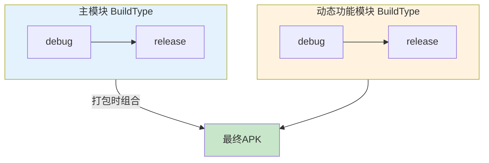
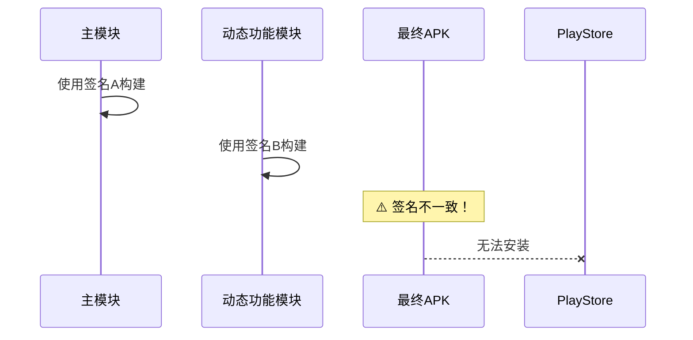
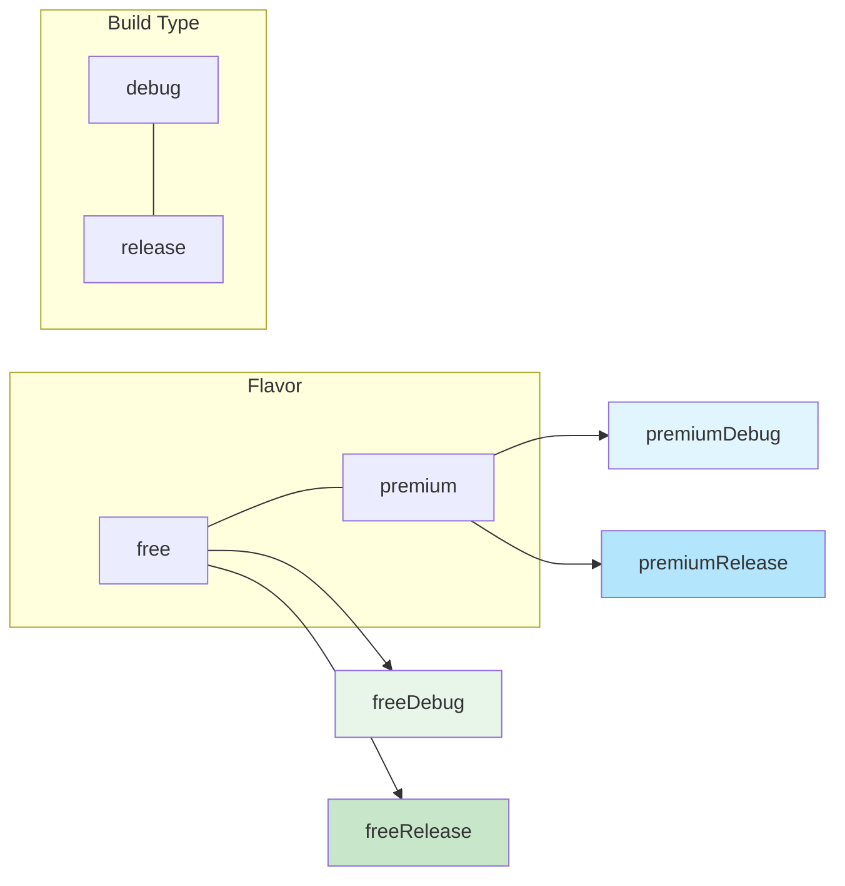
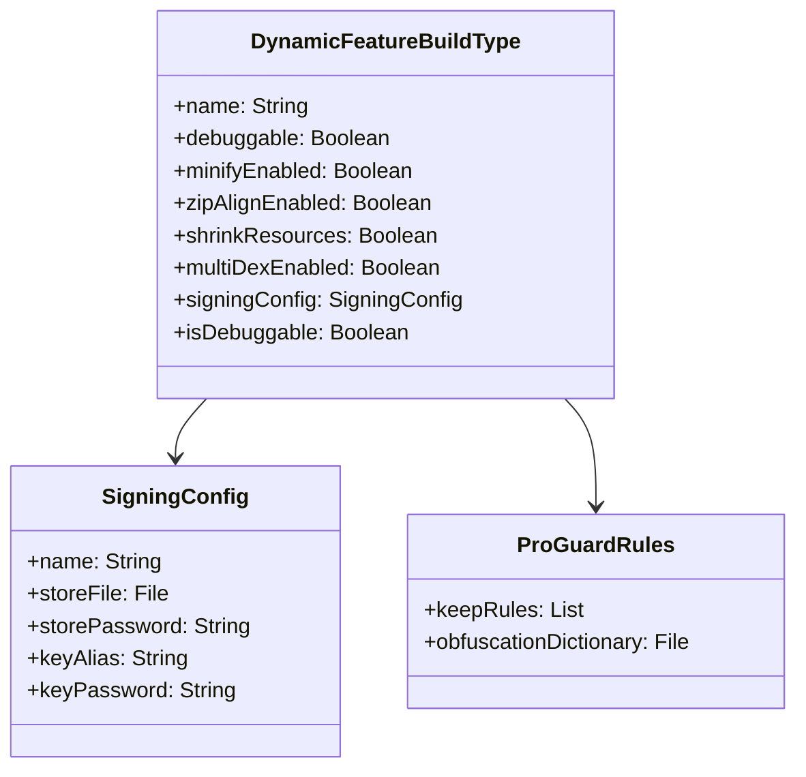

# 21.1.120 DynamicFeatureBuildType

太阳像一个大大的咸蛋黄，慢慢沉入远方的山脊线以下。天空从金色变成橘红，再到淡淡的海棠色，洛芙托着腮帮子，看着这变化莫测的晚霞，眼睛里映着波光粼粼的湖面。

“今天收获好多啊，”她伸了个懒腰，骨头发出轻微的咔咔声，“产品风味、构建功能……感觉Module这个大家庭的成员都认识了个遍。”

希尔正在收拾笔记本，闻言抬起头来：“怎么，这就满足了？我们还有一块硬骨头没啃呢。”

“还有？”洛芙眨巴着眼睛。

黛琳从白板那边走过来，手里拿着一支红笔——这是她标记重点用的。“洛芙，记得今天上午我们提到的构建类型吗？”

“记得，BuildType嘛，debug和release，”洛芙点头，“难道Dynamic Feature Module还有自己的BuildType？”

“对咯，”希尔打了个响指，“就是今天的主角——DynamicFeatureBuildType！”

伊莎把散落在草地上的草茎一根根捡起来，编成一个小小的花环：“听起来像是……给不同的探险路线准备不同的装备？”

“伊莎的比喻一贯这么精准，”黛琳笑着接过花环，随手戴在洛芙头上，“确实如此。构建类型决定了你的模块以什么样的方式构建——是可以被调试的debug版本，还是经过优化压缩的release版本。”

洛芙扶了一下头顶的花环：“那……DynamicFeatureBuildType和普通的BuildType有什么区别吗？”

黛琳指了指白板上还未擦掉的上节课内容：“还记得我们画的模块关系图吗？主模块有BuildType，动态功能模块也有自己的BuildType。但两者的使用场景和配置方式不太一样。”

她重新拿起白板笔，在白板上画了一个新的图：



“看到没有？”黛琳讲解道，“主模块和动态功能模块各有自己的构建类型。当我们构建APK时，它们会分别以各自的BuildType构建，然后组合在一起。”

“那它们必须一致吗？”洛芙问。

“不一定，”希尔插嘴道，“但通常建议保持一致。如果你主模块用debug，动态功能模块用release，可能会出现一些奇怪的兼容性问题。”

“为什么？”洛芙不解。

“因为debug版本和release版本的代码优化程度不同，”黛琳解释道，“debug版本包含调试符号，信息更详细；release版本经过混淆、压缩、优化。如果两者混用，可能会出现方法签名不匹配、混淆规则冲突等问题。”

洛芙似懂非懂地点点头：“那……DynamicFeatureBuildType具体能配置些什么？”

黛琳调出笔记本电脑，屏幕上显示着Build Type的配置代码。她指着屏幕说：“动态功能模块的BuildType和主模块基本一致，同样支持debuggable、minifyEnabled、zipAlignEnabled这些属性。”

她列举着关键属性：

“首先是debuggable，决定模块是否可以调试。如果是debug类型，这个属性默认是true；如果是release类型，默认是false。”

“调试？”洛芙的眼睛亮了一下，“就是可以打断点那个？”

“对，”黛琳笑了，“在debug模式下，你可以在Android Studio里设置断点，查看变量值，单步执行代码。这对开发过程非常重要。”

伊莎好奇地问：“那如果我想在release模式下也能调试呢？”

“可以实现，但通常不推荐，”黛琳摇头，“release模式默认关闭调试是为了安全——调试信息会暴露很多代码细节，不适合发布版本。”

希尔补充道：“不过有些公司会保留release的调试能力，用reLEASE时仍然可以attach调试器。这需要在buildType里显式设置debuggable = true。”

黛琳点头：“但这会带来安全风险，生产环境不建议这样做。”

接下来她讲到了minifyEnabled：“这是另一个核心属性，控制是否启用代码混淆和压缩。”

“代码混淆？”洛芙歪着头，“是把代码变得面目全非的意思？”

“对，”黛琳解释，“ProGuard或R8会重命名类、方法、变量，让逆向工程变得困难。同时它还会移除未使用的代码，减小APK体积。”

“那在动态功能模块里，这个属性是开还是关？”洛芙问。

黛琳调出配置示例：

```kotlin
android {
    buildTypes {
        release {
            // 启用代码压缩和混淆
            minifyEnabled = true
            // 配置混淆规则文件
            proguardFiles(
                getDefaultProguardFile("proguard-android-optimize.txt"),
                "proguard-rules.pro"
            )
        }
        debug {
            // debug版本不需要混淆
            minifyEnabled = false
            debuggable = true
        }
    }
}
```

“在release构建类型里，minifyEnabled默认是false，”黛琳说，“你需要显式设置为true才能启用混淆。”

“为什么默认是false？”洛芙觉得奇怪，“不应该默认保护代码吗？

“是为了开发体验，”希尔朝她眨眨眼，“混淆后的代码调试起来很困难——堆栈信息会变成a.b.c这种无意义的名称。每次改完代码都要重新混淆，会拖慢开发节奏。”

洛芙理解了：“所以debug用未混淆版本快速迭代，release再用混淆版本保护代码并减小体积。”

“Exactly！”希尔打了个响指。

黛琳继续讲zipAlignEnabled：“这个属性控制是否启用ZIP对齐。启用后，APK内的资源文件会按照4字节边界对齐，这样可以减少内存占用，加载速度也会更快。”

“这个是必须开启的吗？”洛芙问。

“在release类型中，默认为true，”黛琳说，“而且Google Play要求APK必须进行ZIP对齐，不对齐的包会上传失败。”

“那debug类型呢？”

“debug类型默认也是true，”黛琳回答，“因为即使在开发阶段，我们也不希望APK有任何性能问题。”

洛芙在本子上记录着这些要点。夕阳已经完全沉入山后，天空变成了深蓝色，第一批星星开始眨眼睛。

“还有几个重要属性，”黛琳说，“shrinkResources开启资源缩减，会自动移除APK中未使用的资源文件；multiDexEnabled启用多dex支持，解决单个DEX文件65K方法数限制的问题。”

“多DEX？”洛芙抬起头，“是不是因为Android的方法数有上限？”

“对，”黛琳解释，“早期Android的单个DEX文件只能包含65536个方法，超过这个数字就会编译失败。使用multiDex可以把代码分散到多个DEX文件中。”

“那动态功能模块也需要开启吗？”洛芙问。

“通常不需要，”黛琳说，“动态功能模块本来就追求轻量化，代码量不会太多。如果真的达到了方法数上限，应该考虑重构代码，而不是直接开multiDex。”

伊莎轻声说：“就像我们的背包——如果东西太多，应该考虑丢一些不必要的，而不是换一个更大的背包。”

“这个比喻好，”黛琳笑了，“技术选型也是一个道理——优先优化架构，而不是依赖特性来弥补设计缺陷。”

接下来黛琳讲到了signingConfig——签名配置。

“每个BuildType都需要关联一个签名配置，”黛琳调出配置代码，“debug类型默认使用debug签名，release类型需要你手动配置签名信息。”

```kotlin
android {
    signingConfigs {
        create("releaseConfig") {
            storeFile = file("release.keystore")
            storePassword = System.getenv("KEYSTORE_PASSWORD")
            keyAlias = "myappkey"
            keyPassword = System.getenv("KEY_PASSWORD")
        }
    }
    
    buildTypes {
        debug {
            // debug默认使用debug签名
            debuggable = true
            minifyEnabled = false
        }
        release {
            // release使用自定义签名
            minifyEnabled = true
            signingConfig = signingConfigs.getByName("releaseConfig")
            zipAlignEnabled = true
        }
    }
}
```

“这里有一个安全最佳实践，”黛琳特别强调，“不要把密码明文写在build.gradle里。像这样使用环境变量更好。”

洛颁布头写着：“System.getenv……这是从系统环境读取？”

“对，”黛琳点头，“你可以在系统环境变量里设置KEYSTORE_PASSWORD和KEY_PASSWORD，这样密码就不会出现在代码仓库里。”

“如果不用环境变量呢？”希尔问，“还有什么其他方案？”

“常见做法还有：从外部配置文件读取、使用CI/CD系统的secret管理、或者使用Android的Credential API，”黛琳说，“具体看团队的安全要求。”

洛芙突然想到一个问题：“那我主模块和动态功能模块的签名需要一致吗？”

“这是一个好问题，”黛琳赞赏地点头，“答案是——需要。它们必须使用相同的签名，否则安装会失败。”

她画了一个图来说明：



“所以如果主模块用签名A，动态功能模块也必须用签名A，”黛琳总结道，“否则用户无法把split APK安装在一起。”

洛芙拍了拍脑袋：“还好问了，不然可能会踩大坑。”

天色已经完全暗下来，湖面上倒映着星星，像是撒了一把钻石。伊莎轻声说：“真美啊……”

“对了，”希尔突然说，“还有最后一个重要概念要讲——BuildType的变体组合。”

黛琳点头：“对，我们之前讲过Product Flavor可以和Build Type组合。动态功能模块也支持这个。”

她列出公式：

```
动态功能模块的最终变体 = Flavor维度 × Build Type维度
```

“比如你有免费版和付费版两个flavor，又有debug和release两个buildType，那就组合出四种变体：”



“那每个变体可以有不同的BuildType配置吗？”洛芙问。

“可以的，”黛琳说，“你可以在每个flavor里单独配置buildTypes，覆盖默认配置。比如免费版的release不需要混淆，付费版的release需要最强保护。”

她给出示例：

```kotlin
productFlavors {
    free {
        // 免费版的release配置
        buildTypes {
            release {
                minifyEnabled = false  // 不混淆，减小纠纷
            }
        }
    }
    premium {
        // 付费版的release配置
        buildTypes {
            release {
                minifyEnabled = true   // 最强保护
                proguardFiles.add("premium-proguard-rules.pro")
            }
        }
    }
}
```

洛芙惊叹：“原来可以这么灵活！”

“但要小心，”黛琳提醒，“过度灵活的代价是复杂性升高，维护成本增加。通常建议保持配置简单，只有真正需要时才使用变体。”

伊莎接口道：“就像露营——带太多装备会增加负担，但完全不带又无法应对突发情况。关键在于找到平衡点。”

“说得好，”黛琳说，“技术选型也是一样的道理。”

洛芙看着笔记本上满满当当的记录，有一种充实感。她抬头看看星空，星星比在城市里看到的亮得多，也密得多。

“谢谢你们，”她轻声说，“今天学到了好多。感觉Module的世界越来越清晰了。”

希尔笑着拍了拍她的肩膀：“这才哪到哪？不过是buildType的基础知识而已。不过说实话，理解了这个，你对动态模块的理解就差不多到位了。”

黛琳站起来，拍了拍裤子上的草屑：“好了，今天就到这里吧。回去好好休息，明天我们继续。”

洛芙最后看了一眼湖面——星星的倒影还在轻轻晃动，像是夜空在对她眨眼。她收拾好笔记本，跟着姐妹们朝帐篷走去。

今晚，一定是个美好的夜晚。

---

## 专业技术总结

**DynamicFeatureBuildType** 是 Android Gradle Plugin 提供的 DSL 接口，用于配置动态功能模块（Dynamic Feature Module）的构建类型。它决定了模块以什么方式构建——是可供调试的 debug 版本，还是经过优化的 release 版本。

#### 结构图



#### 复杂度与影响

- **debuggable**：调试时需要设为true，会增加包体积但便于开发
- **minifyEnabled**：启用R8混淆，可减小包体积但增加编译时间
- **zipAlignEnabled**：默认启用，对性能和兼容性有好处
- **signingConfig**：release类型必须配置，否则无法发布

#### 反模式与陷阱

1. **主模块与动态模块签名不一致**：导致split APK无法安装。解决：确保使用相同签名配置。

2. **release类型忘记配置signing**：导致发布失败。解决：在release buildType中显式配置signingConfig。

3. **debug类型启用minify**：拖慢开发迭代速度。解决：debug类型保持minifyEnabled=false。

4. **在BuildType中硬编码密码**：带来安全风险。解决：使用环境变量或外部secret管理。

#### 设计哲学

**开发体验与安全性的平衡**：BuildType的设计体现了软件开发中的基本矛盾——开发时需要快速迭代和丰富信息，生产时需要安全性和最小体积。通过区分debug和release两种类型，开发者可以用同一套代码满足两个场景的需求。

#### 🏕️ 动手练习

**目标**：掌握为动态功能模块配置BuildType的完整流程

**项目背景**：为"用户反馈"动态功能模块配置完整的构建类型

**任务**：

1. **基础配置**
   - 在动态功能模块的build.gradle.kts中创建debug和release构建类型
   - 配置debuggable、minifyEnabled等基本属性

2. **签名配置**
   - 创建自定义签名配置
   - 在release类型中关联签名配置

3. **混淆规则**
   - 创建proguard-rules.pro文件
   - 配置keep规则防止关键代码被混淆

4. **变体组合**
   - 创建free和premium两个flavor
   - 在不同flavor中覆盖buildType配置

5. **验证构建**
   - 执行assembleFreeDebug、assemblePremiumRelease等任务
   - 观察不同变体的构建输出差异

**验收标准**：
- [ ] 成功创建debug和release两种BuildType
- [ ] debug版本可正常调试
- [ ] release版本使用自定义签名
- [ ] 混淆规则正确保护关键代码
- [ ] 不同flavor的BuildType配置被正确应用
- [ ] 变体组合构建成功

> 学习建议：DynamicFeatureBuildType是模块化开发中的重要配置，理解它才能更好地控制动态功能模块的构建行为。实践中建议从简单配置开始，逐步增加复杂度。记住，生产环境的release配置一定要仔细审核，安全无小事。

---

洛芙的小小日记本

今天学会了DynamicFeatureBuildType！原来Module也有自己的debug和release模式，和主模块一样但又独立。黛琳说签名必须一致，不然无法安装——这个一定要记住。伊莎的背包比喻让我印象很深：技术选型就像带装备，不是越多越好，是要刚刚好够用。现在的星空好美啊，满足～

---

今日关键词

- **DynamicFeatureBuildType**：动态功能模块的构建类型配置接口
- **Build Type**：构建类型，debug或release，用于控制构建方式
- **debuggable**：调试开关，控制模块是否可调试
- **minifyEnabled**：混淆开关，控制是否启用代码混淆压缩
- **zipAlignEnabled**：ZIP对齐开关，用于优化资源加载
- **shrinkResources**：资源缩减开关，移除未使用资源
- **multiDexEnabled**：多DEX开关，解决方法数限制
- **signingConfig**：签名配置，定义APK签名方式
- **ProGuard/R8**：代码混淆工具，用于保护代码和减小体积
- **变体组合**：Flavor与Build Type的笛卡尔积