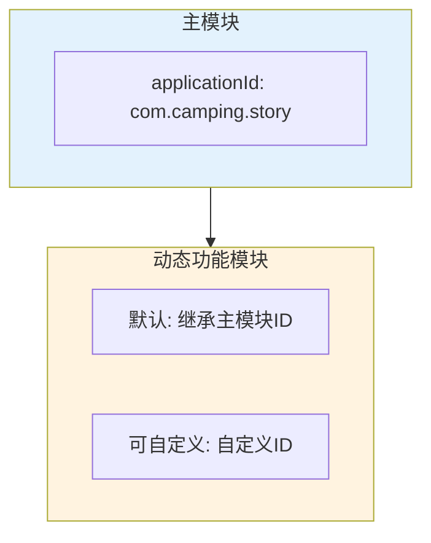
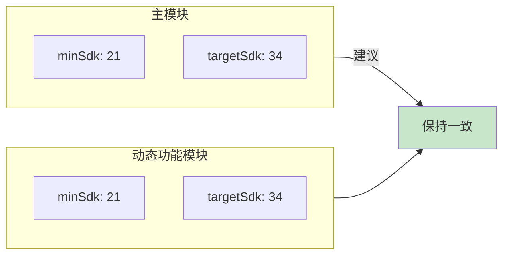
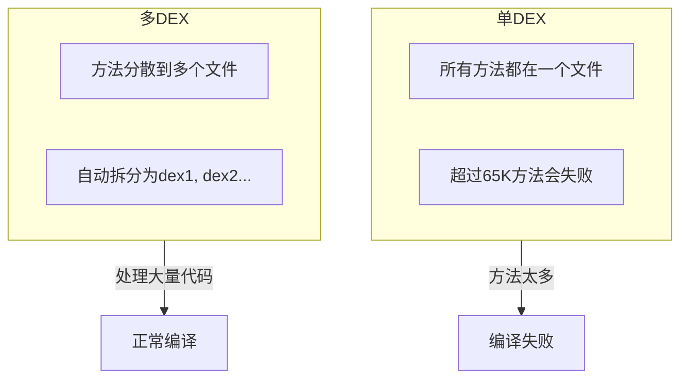
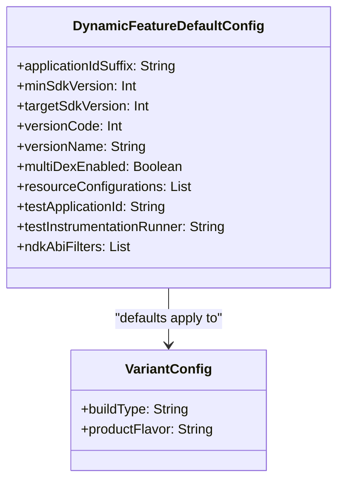

# 21.1.121 DynamicFeatureDefaultConfig

夜色渐浓。

第一颗星星亮起来的时候，洛芙还沉浸在上一章的收获里。她坐在大树下，背靠着粗糙的树皮，仰头看着天空从深蓝慢慢变成近乎黑色的蓝。湖面如同一面镜子，把星星的倒影轻轻托住，偶尔有微风拂过，倒影便轻轻颤动，像在眨眼睛。

“今天的内容好扎实啊，”她感慨道，“BuildType、Flavor、BuildFeatures……感觉Module的世界前所未有的清晰。”

希尔正在帐篷里翻找着什么，闻言探出头来：“可别高兴太早，今天还有个大家伙要学。”

“还有？”洛芙缩了缩脖子。

黛琳从背包里抽出一本小册子——那是她平时画架构图用的速写本。她翻开新的一页，在上面写下几个大字：DynamicFeatureDefaultConfig。

“还记得我们之前学的模块配置吗？”黛琳盘腿坐下，把册子放在膝盖上，“Product Flavor、BuildType、BuildFeatures……这些都是针对特定的变体进行配置的。”

洛芙点头：“对，每个变体都有自己的设置嘛。”

“但有时候，”黛琳继续说，“我们希望某些配置对所有变体都生效——不管你选的是debug还是release，免费版还是付费版。”

伊莎抱着一杯热可可凑过来：“听起来像是……营地的基本规则？不管什么小队来露营，都需要遵守的基本规定？”

“伊莎的比喻总是这么贴切，”黛琳笑了，“没错，DefaultConfig就是这样的存在——它是动态功能模块的默认配置，给所有变体提供基础设置。”

希尔从帐篷里钻出来，手里拿着一台笔记本电脑：“说得好听不如看得明白。让我来给你们展示一下 DefaultConfig 到底能配置些什么。”

她把电脑放在草地上，屏幕发出的蓝光在暮色中格外显眼。黛琳调出配置示例：

```kotlin
android {
    defaultConfig {
        applicationIdSuffix ".example"
        minSdkVersion 21
        targetSdkVersion 34
        versionCode 1
        versionName "1.0.0"
        multiDexEnabled true
    }
}
```

“这些就是我们今天要学的内容，”黛琳指着屏幕说，“每一个属性，都作用于这个动态功能模块的所有变体。”

洛芙仔细看着这些配置：“applicationIdSuffix……这是给应用ID加后缀？”

“对，”黛琳点头，“你记得主模块的applicationId吗？”

“记得，我们的露营App是com.camping.story嘛。”

“那如果是动态功能模块呢？”黛琳问，“它的ID是什么？”

洛芙思考了一下：“应该是……主模块ID加上模块名？”

“不完全是，”希尔插入解释，“动态功能模块默认继承主模块的applicationId。你可以显式设置不同的ID，但这样会有一些限制。”

黛琳在速写本上画了一个图来说明：



“默认情况下，动态功能模块的applicationId会自动加上模块名作为后缀，”黛琳解释，“比如主模块是com.camping.story，动态功能模块是map-navigation，那最终的applicationId就是com.camping.story.map-navigation。”

“自动加的？”洛芙觉得神奇，“这样就不会冲突了？”

“对，这是Android的安全机制之一，”黛琳说，“每个安装在设备上的应用都必须有唯一的applicationId。如果不然后果很严重——新安装会覆盖旧安装，用户的数据会丢失。”

伊莎轻声问：“那如果我想让它和主模块用完全相同的ID呢？”

“可以，”黛琳回答，“使用applicationIdSuffix = ''（空字符串）就可以取消后缀。”

她补充道：“但通常不建议这样做。不同的applicationId可以让你在设备上同时安装主App和动态功能模块的测试版本，互不干扰。”

接下来黛琳讲到了minSdkVersion和targetSdkVersion。

“这两个属性你应该不陌生了，”黛琳说，“minSdkVersion决定模块支持的最低Android版本，targetSdkVersion指定针对哪个版本进行优化。”

洛芙举手：“那动态功能模块的SDK版本一定要和主模块一样吗？”

“这是一个很重要的问题，”黛琳点头，“答案是——最好保持一致。”

她在白板上画了一个示意：



“如果主模块的targetSdk是34，动态功能模块的targetSdk是23，”黛琳解释，“那系统会以哪个版本为准？答案是主模块的版本。但这会导致一些API兼容性问题——你在动态功能模块里用了高版本API，在低版本设备上运行会崩溃。”

“那dynamic feature可以设置比主模块更高的targetSdk吗？”洛芙问。

“技术上可以，但没必要，”希尔说，“而且很容易造成混乱。建议动态功能模块的SDK版本和主模块保持一致。”

洛芙在本子上记录着。湖面上吹来一阵凉风，把她的刘海轻轻拂起。

“接下来是versionCode和versionName，”黛琳继续说，“这两个分别代表版本号和版本名。”

洛芙问：“这两个有什么区别？”

“versionCode是一个整数，每次发布必须递增，”黛琳解释，“Google Play用这个来判断哪个版本更新。versionName是给用户看的字符串，可以随意命名。”

“那如果我不小心把versionCode改小了会怎样？”洛芙好奇。

“Play Store会拒绝上传，”希尔插嘴，“而且如果用户已经安装了新版，你用旧版本Code覆盖，会导致升级失败。”

黛琳补充：“所以versionCode的管理要非常谨慎。很多团队会用自动化的方式来生成versionCode，比如基于构建时间戳或Git提交数。”

她举例说明：

```kotlin
def getVersionCode() {
    // 基于Git提交数生成versionCode
    def count = Integer.parseInt('git rev-list --count HEAD'.execute().text.trim())
    return count
}

android {
    defaultConfig {
        versionCode getVersionCode()
        versionName "1.0.0"
    }
}
```

“好自动化！”洛芙惊叹。

“现代开发的标准操作而已，”希尔耸耸肩，“手动管理版本号很容易出错。”

接下来黛琳讲到了multiDexEnabled。

“这个属性我们之前提到过，”黛琳说，“它用来启用MultiDex支持，解决单个DEX文件65K方法数限制的问题。”

洛芙问：“动态功能模块也需要开启吗？”

“通常不需要，”黛琳回答，“动态功能模块本身就追求轻量化，代码量不会太多。但如果你的模块确实很大，也可以开启。”

她在速写本上画了一个简单的对比：



“在Android 5.0之前，MultiDex有额外的限制，”黛琳补充，“需要使用MultiDexApplication或在应用初始化时调用MultiDex.install()。但现在基本不需要考虑这个问题了。”

伊莎好奇地问：“那在动态功能模块里开启MultiDex，会有什么特别的吗？”

“没有什么特别的，”黛琳说，“和主模块一样的行为。但还是那句话——动态功能模块本身就应该是轻量级的，如果需要开MultiDex，说明模块设计有问题，应该考虑拆分。”

洛芙似懂非懂地点头。她抬头看看星空，星星比刚才更多了，像撒了一把盐在黑色的绸布上。

“还有一个重要的配置，”黛琳说，“就是resourceConfigurations——指定模块支持的语言和资源配置。”

她调出代码示例：

```kotlin
android {
    defaultConfig {
        // 只包含中文和英文资源
        resourceConfigurations += ['en', 'zh-rCN']
        // 排除特定资源配置
        resourceConfigurations += ['xxhdpi', 'xxxhdpi']
    }
}
```

“这个配置可以显著减小APK体积，”黛琳解释，“比如你只支持中文和英文，就可以用resourceConfigurations过滤掉其他语言的资源文件。”

“动态功能模块用这个特别合适，”希尔补充，“模块本来就小，每一点体积优化都很重要。”

洛芙问：“那如果用户设备是法语怎么办？会怎样？”

“系统会 fallback 到主模块的资源，”黛琳解释，“如果主模块包含法语资源，用户就能看到法语界面。如果主模块也没有，就用默认语言。”

接下来黛琳讲到了testApplicationId和testInstrumentationRunner。

“这两个是用于测试的配置，”黛琳说，“testApplicationId用来指定测试App的ID，testInstrumentationRunner指定测试运行器的类名。”

```kotlin
android {
    defaultConfig {
        testApplicationId ".test"
        testInstrumentationRunner "androidx.test.runner.AndroidJUnitRunner"
    }
}
```

洛芙歪着头：“测试还需要单独的applicationId？”

“对，”黛琳解释，“这样你可以同时安装主App和测试App，互不干扰。测试App的ID会自动加上.test后缀。”

“那testInstrumentationRunner是做什么的？”伊莎问。

“这个是用来运行Instrumentation测试的，”黛琳说，“比如UI测试。你需要指定一个测试运行器类，最常用的是AndroidJUnitRunner。”

希尔补充：“如果你们要做UI自动化测试，这个配置是必须的。不配置的话，instrumentation测试会无法运行。”

黛琳环顾四周，夜色已经很浓了。湖面上倒映的星星越来越多，像是夜空在用水晶做成的镜子自恋地照着自己。

“对了，还有最后一个重要配置，”黛琳说，“就是ndkABIFilters。”

“这个是做什么的？”洛芙问。

“用来指定NDK支持的CPU架构，”黛琳回答，“比如你想让模块只支持arm64-v8a架构，不支持armeabi-v7a，就可以用这个配置。”

她给出示例：

```kotlin
android {
    defaultConfig {
        ndk {
            abiFilters 'arm64-v8a', 'x86_64'
        }
    }
}
```

“为什么要过滤架构？”伊莎问。

“为了减小APK体积，”黛琳解释，“每个架构的Native库都会占用空间。如果你的App只需要在主流设备上运行，可以过滤掉老旧架构，节省空间。”

“那动态功能模块应该怎么处理NDK？”洛芙问。

“和主模块一样，”黛琳说，“但动态功能模块本身不应该包含太多Native代码。如果需要用NDK，建议放在主模块里。”

洛芙把这些知识点都记录下来。她看着笔记本上满满当当的记录，有一种沉甸甸的满足感。

“今天的知识好全面啊，”她伸了个懒腰，“defaultConfig就像……给整个模块定下的基本规则。”

“对，”黛琳点头，“不管你选择哪个变体，这些默认配置都会生效。这是动态功能模块的基础配置层。”

伊莎轻声说：“就像露营的基本规则——不管什么天气、什么地形，这些规则都是不变的。”

“说得好，”希尔说，“好了，今天就到这里吧。回去好好休息，明天我们继续探索Module的世界。”

洛芙最后看了一眼湖面。星星的倒影还在轻轻晃动，夜空深蓝而宁静。她收拾好笔记本，跟着姐妹们朝帐篷走去。

今晚，一定是个美好的夜晚。

---

## 专业技术总结

**DynamicFeatureDefaultConfig** 是 Android Gradle Plugin 提供的 DSL 接口，用于配置动态功能模块（Dynamic Feature Module）的默认配置。这些配置会应用于模块的所有变体（Variants），除非被特定变体的配置覆盖。

#### 结构图



#### 复杂度与影响

- **applicationIdSuffix**：动态功能模块的默认applicationId为主模块ID加模块名作为后缀，可自定义或清空
- **minSdkVersion/targetSdkVersion**：建议与主模块保持一致，避免兼容性问题
- **versionCode**：每次发布必须递增，用于版本判断
- **multiDexEnabled**：动态功能模块通常不需要开启，除非代码量确实很大
- **resourceConfigurations**：可显著减小APK体积，过滤不需要的语言和资源配置
- **ndkAbiFilters**：用于减少Native库体积，过滤不需要的CPU架构

#### 反模式与陷阱

1. **动态功能模块SDK版本与主模块不一致**：会导致API兼容性问题，高版本API在低版本设备上崩溃。修复：保持与主模块一致的minSdkVersion和targetSdkVersion。

2. **versionCode未递增就发布**：Play Store会拒绝上传。修复：使用自动化方式管理versionCode，如基于Git提交数或构建时间戳。

3. **在动态功能模块中开启multiDex**：动态功能模块追求轻量化，开启multiDex说明模块设计不合理。修复：考虑拆分模块或重构代码，而非依赖multiDex。

4. **未过滤不需要的resourceConfigurations**：导致APK体积不必要增大。修复：显式指定需要的语言和资源配置。

#### 设计哲学

动态功能模块的核心设计思想是**轻量化、按需加载**。DefaultConfig的配置应该体现这一思想：

1. **保持最小化**：只配置必要的属性，避免过度配置
2. **与主模块协调**：SDK版本等关键配置应与主模块保持一致
3. **体积优化优先**：利用resourceConfigurations、ndkAbiFilters等配置减小APK体积
4. **测试配置完整**：确保testApplicationId和testInstrumentationRunner正确配置，以便进行自动化测试

#### 🏕️ 动手练习

**目标**：掌握DynamicFeatureDefaultConfig的核心配置，能够正确设置动态功能模块的默认属性。

**Task 1：基础配置练习**

1. 创建一个新的Dynamic Feature Module（如果还没有）
2. 在模块的build.gradle中找到defaultConfig块
3. 添加以下配置：
   - applicationIdSuffix设置为".feature"
   - minSdkVersion设为24
   - targetSdkVersion设为34
   - versionCode设为1
   - versionName设为"1.0.0-feature"

**Task 2：资源过滤练习**

1. 在defaultConfig中添加resourceConfigurations
2. 配置只保留中文和英文：resourceConfigurations += ['en', 'zh-rCN']
3. 观察APK体积变化

**Task 3：版本自动化练习**

1. 在defaultConfig中实现自动versionCode
2. 基于Git提交数生成versionCode
3. 验证构建输出中的versionCode是否正确递增

**验收标准**：

- [ ] 能够在build.gradle中找到并编辑defaultConfig块
- [ ] 配置的applicationIdSuffix正确生效
- [ ] minSdkVersion和targetSdkVersion与主模块保持一致
- [ ] resourceConfigurations能够过滤不需要的资源
- [ ] 理解每个配置项的作用和影响

**提示代码**：

```kotlin
android {
    defaultConfig {
        applicationIdSuffix ".feature"
        minSdkVersion 24
        targetSdkVersion 34
        versionCode 1
        versionName "1.0.0-feature"
        
        resourceConfigurations += ['en', 'zh-rCN']
        
        // 自动化versionCode示例
        versionCode = Integer.parseInt(
            'git rev-list --count HEAD'.execute().text.trim()
        )
    }
}
```

#### 面试热身

1. 解释DynamicFeatureDefaultConfig的作用，以及它与BuildType、ProductFlavor的区别
2. 动态功能模块的applicationId是如何确定的？如何自定义？
3. 为什么建议动态功能模块的SDK版本与主模块保持一致？
4. 如何使用resourceConfigurations来优化APK体积？
5. 动态功能模块是否需要开启multiDex？为什么？

#### 参考实现要点

1. **默认配置优先**：defaultConfig中的设置会作为默认值，被变体特定配置覆盖
2. **保持简洁**：dynamic feature追求轻量化，配置也应该保持最小化
3. **SDK版本一致**：动态功能模块的minSdkVersion和targetSdkVersion应与主模块保持一致，避免兼容性问题
4. **资源过滤**：使用resourceConfigurations过滤不需要的语言和资源配置，减少APK体积
5. **版本管理**：使用自动化方式管理versionCode，避免手动管理导致的错误

---

> 学习建议：DynamicFeatureDefaultConfig是动态功能模块的基础配置层。理解它的作用对于掌握动态功能模块的开发至关重要。建议动手实践这些配置，观察它们如何影响模块的构建和APK输出。记住，动态功能模块的设计原则是轻量化——配置也应该体现这一思想。

## 洛芙的小小日记本

今天学到了DynamicFeatureDefaultConfig！原来模块的基本规则都在这里——应用ID、版本号、SDK版本……就像是露营前制定的基本手册，不管什么天气都要遵守。黛琳说配置要保持简洁，这和Module追求轻量化的理念是一样的。继续加油！

---

## 今日关键词

- **DynamicFeatureDefaultConfig**：Android Gradle Plugin提供的DSL接口，用于配置动态功能模块的默认配置
- **applicationId**：应用的唯一标识符，动态功能模块默认会加上模块名作为后缀
- **applicationIdSuffix**：给applicationId添加的后缀，可自定义或清空
- **minSdkVersion**：模块支持的最低Android版本
- **targetSdkVersion**：模块针对优化的Android版本
- **versionCode**：用于版本判断的整数，每次发布必须递增
- **versionName**：展示给用户的版本字符串
- **multiDexEnabled**：是否启用多DEX支持，解决65K方法数限制
- **resourceConfigurations**：指定模块支持的语言和资源配置，用于减小APK体积
- **testApplicationId**：测试App的应用ID
- **testInstrumentationRunner**：测试运行器的类名
- **ndkAbiFilters**：指定NDK支持的CPU架构，用于减少Native库体积
- **Variant**：构建变体，由Flavor和BuildType组合而成
- **DEX**：Dalvik Executable，Android应用的字节码文件格式
- **Instrumentation**：Android的测试框架，用于UI自动化测试
