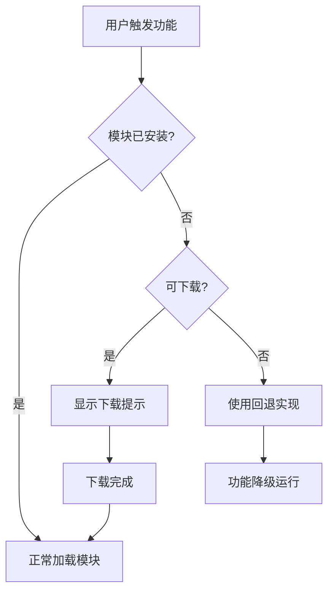
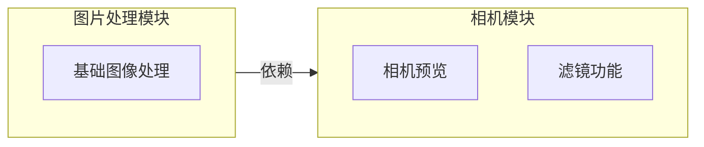
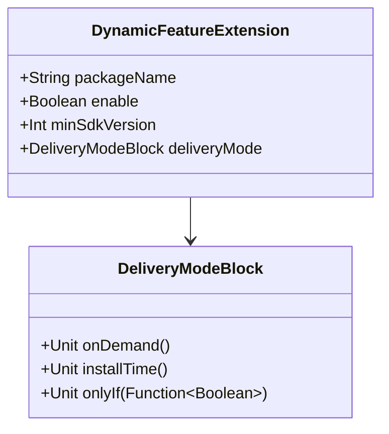

# 21.1.122 DynamicFeatureExtension

星星在头顶闪烁，像撒在黑色天鹅绒上的碎钻。湖面平静如镜，倒映着银河的光带，偶尔有一条鱼跃出水面，搅碎一池星光，又很快恢复平静。

洛芙裹紧了自己的外套，夜风比傍晚更凉了。她盘腿坐在草坪上，笔记本电脑放在腿上，屏幕的光映在她眼里，亮晶晶的。

“黛琳，”她指着屏幕上的代码片段，“昨天学的 DynamicFeatureDefaultConfig 是默认配置，那今天要学的 DynamicFeatureExtension 是什么呢？”

黛琳正在整理她们的学习笔记。她把一缕碎发别到耳后，抬头看向洛芙的屏幕。

“如果说 DynamicFeatureDefaultConfig 是给动态功能模块准备的‘默认名片’，”她想了想，“那 DynamicFeatureExtension 就是你要在这张名片上填写的内容——告诉构建系统你这个模块具体怎么配置。”

“名片还要填内容的吗？”洛芙歪着头。

“当然呀，”伊莎笑着插话，她正用树枝在地上画着星星的图案，“就好比你写明信片，总要写收件人地址和寄件人姓名吧？DynamicFeatureExtension 就是让你填写这些信息的地方。”

希尔在旁边敲代码，键盘发出清脆的“哒哒”声。她头也不抬地说：“简单来说，DynamicFeatureExtension 是 Gradle 里用来配置动态功能模块的 DSL 扩展。你可以把它理解成 build.gradle 文件里那个 dynamicFeatures { } 代码块的‘详细说明书’。”

“这么一说我就明白了！”洛芙眼睛一亮，“昨天我们学了默认配置，今天学具体配置。对了，这个 Extension 里面都有什么可以配置的呢？”

黛琳从背包里拿出她的白板笔，在草地上铺开一个小巧的折叠白板。“来，我们一个一个说。”

---

## 包名与模块标识

黛琳在白板上画了一个方框，在里面写下 `packageName`。

“在 DynamicFeatureExtension 里，第一个也是最重要的配置，就是 `packageName`——也就是你动态功能模块的包名。”

她转过身，用白板笔敲了敲方框：“你想象一下，如果你的主应用是一个露营地，那每个动态功能模块就是露营地里的不同帐篷。你怎么区分这些帐篷？当然是靠名字啦！而 `packageName` 就是帐篷的名字。”

“哇，这个比喻好！”洛芙掏出小本本开始记笔记。

伊莎补充道：“而且这个包名必须是唯一的哦。就像露营地里的帐篷，如果两顶帐篷都叫‘二号帐篷’，那来住宿的客人该住哪一顶呢？系统也会困惑的。”

黛琳点点头，继续说：“在代码里配置很简单。希尔，给她演示一下？”

希尔把笔记本转过来，屏幕上是她刚写好的代码：

```kotlin
// DynamicFeatureExtension 配置示例
dynamicFeatures {
    create("feature_video") {
        // 设置动态功能模块的包名
        // 这必须与 AndroidManifest.xml 中的 package 属性一致
        packageName = "com.example.campingapp.feature.video"
    }
}
```

“看到没？”希尔指着代码说，“`packageName` 就是这么配置的。不过要注意，这个包名必须和你的动态功能模块里的 AndroidManifest.xml 中的 package 属性完全一致，否则构建的时候会报错——就像你说你要去‘二号帐篷’，结果到了发现那顶帐篷挂的牌子是‘三号帐篷’，当然会找不到啦。”

洛芙认真地点头，在笔记上写：*packageName 必须和 AndroidManifest.xml 一致，否则构建报错。*

---

## 交付模式：按需还是安装时

黛琳又在白板上画了两种图案——一个是水滴，一个是包裹。

“接下来要介绍的，是动态功能模块最核心的概念——交付模式。”

她在水滴下面写下“onDemand”（按需），在包裹下面写下“installTime”（安装时）。

“在 Google Play 分发应用的时候，动态功能模块可以有两种‘送货方式’。一种是‘按需’——就像你叫外卖，食物在你点的时候才送来；另一种是‘安装时’——就像买手机自带的预装软件，从一开始就跟着你。”

洛芙举手：“那这两种有什么区别呢？”

“区别大了去了，”黛琳说，“按需加载的模块，用户第一次打开应用时不会下载，只有当你需要用那个功能时，Play 才会去下载。这样用户的安装包会很小，省流量省空间。而安装时加载的模块，会在用户安装应用的时候一起下载下来，占用用户的设备空间，但好处是——用的时候不需要再等下载。”

伊莎温柔地补充：“而且有些功能是必须在安装时就有的，比如一些底层的基础功能。如果没有这些，核心功能可能都无法运行，那就必须用 installTime 模式。”

希尔又在敲代码了：

```kotlin
dynamicFeatures {
    create("feature_camera") {
        packageName = "com.example.campingapp.feature.camera"
        
        // deliveryMode 配置决定模块何时下载
        // onDemand(): 按需下载——用户需要时才从 Play 下载
        // installTime(): 安装时下载——随应用一起下载
        // onlyIf(): 条件下载——满足条件才下载
        
        deliveryMode {
            onDemand()
            // installTime() 和 onDemand() 互斥
            // onlyIf(func: () -> Boolean) 用于条件下载
        }
    }
    
    create("feature_core") {
        packageName = "com.example.campingapp.feature.core"
        
        // 核心基础功能使用安装时加载
        deliveryMode {
            installTime()
        }
    }
}
```

“你们看，”希尔解释道，“`deliveryMode` 里面可以调三种方法。`onDemand()` 是按需加载，用户点开拍照功能时才下载相机模块；`installTime()` 是安装时加载，核心功能必须用这个；还有一个 `onlyIf()` 是条件下载，比如只在用户设备支持某个特性时才下载对应的模块。”

“感觉好像在选快递方式，”洛芙说，“有当日达、次日达，还有必须一起买的捆绑包。”

“对，就是这个意思！”黛琳笑了，“不过要注意，同一个模块不能同时设置 onDemand 和 installTime，系统会糊涂的。”

---

## 启用与禁用：模块的开关

夜风吹过树梢，树叶沙沙作响。洛芙缩了缩脖子，又继续盯着屏幕。

“还有一个很实用的配置，”黛琳说，“就是 `enable` 属性——相当于给每个动态功能模块装一个开关。”

她在白板上画了一个电源按钮的符号。

“你可以想象一下，”黛琳解释，“露营地里有好几顶帐篷，但有些时候你不想对外开放某一顶——可能是因为里面在修缮，或者暂时不需要。这时候，你就可以用 `enable = false` 来‘关闭’这个模块。”

希尔快速敲出一段代码：

```kotlin
dynamicFeatures {
    // 基础功能模块，始终启用
    create("feature_base") {
        packageName = "com.example.campingapp.feature.base"
        enable = true
    }
    
    // 实验性功能，默认禁用
    create("feature_experimental") {
        packageName = "com.example.campingapp.feature.experimental"
        enable = false  // 设为 false 可禁用此模块
    }
}
```

“这里有个坑要注意，”黛琳特别强调，“`enable = false` 不会让这个模块从应用中消失，它只是告诉构建系统‘这个模块现在不参与构建’。如果你的代码里还在引用这个模块的功能，编译的时候会报错的——就像你说‘这顶帐篷不开放’，但还是在给客人指路去那顶帐篷，当然会迷路啦。”

洛芙赶紧记下来：*enable = false 只是不参与构建，代码引用会报错。*

---

## 熔断与回退：容错处理

伊莎在地上画的星星图案已经快绕成一个圆了。她抬起头，眼神温柔。

“还有一件很重要的事情——当用户设备无法下载或安装某个动态功能模块时，你应该怎么处理？”

洛芙思考了一下：“呃……报错？”

“那可不行，”伊莎摇头，“用户体验会很差的。你想象一下，客人兴冲冲地来露营，结果你说‘抱歉，帐篷还没准备好，你回家吧’——这也太伤人了吧？”

“所以要有回退机制，”黛琳接口道，“当动态功能模块无法获取时，应用需要优雅地处理这种情况，而不是直接崩溃。”

她在白板上画了一个流程图：



“这就是一个典型的回退处理流程，”黛琳说，“当模块不存在时，先尝试下载；如果下载不了（比如网络不好，或者设备不支持），就使用主应用里的备用实现——虽然功能可能没那么完整，但至少不会崩溃。”

希尔补充了一段代码示例：

```kotlin
// 使用 SplitInstallManager 检查和请求模块
class FeatureManager(private val context: Context) {
    
    private val splitInstallManager = SplitInstallManagerFactory.create(context)
    
    // 检查模块是否已安装
    fun isModuleInstalled(moduleName: String): Boolean {
        val installedModules = splitInstallManager.installedModules
        return installedModules.contains(moduleName)
    }
    
    // 请求下载并加载模块
    fun requestModule(moduleName: String, onSuccess: () -> Unit, onFailure: (Throwable) -> Unit) {
        val request = SplitInstallRequest.newBuilder()
            .addModule(moduleName)
            .build()
        
        splitInstallManager.startSafeDeferral(request)
            .addOnSuccessListener { _ -> 
                // 模块下载成功
                onSuccess()
            }
            .addOnFailureListener { exception ->
                // 下载失败，使用回退方案
                onFailure(exception)
            }
    }
    
    // 回退实现示例
    fun getFeatureWithFallback(moduleName: String, fallback: () -> Unit): String? {
        return if (isModuleInstalled(moduleName)) {
            // 模块已安装，加载真实功能
            loadFeatureFromModule(moduleName)
        } else {
            // 模块未安装，尝试下载
            requestModule(
                moduleName,
                onSuccess = { loadFeatureFromModule(moduleName) },
                onFailure = { fallback() }
            )
            null
        }
    }
}
```

“洛芙你看，”希尔指着代码说，“这里用了 `SplitInstallManager` 来管理动态模块的安装状态。`isModuleInstalled()` 检查模块是否已经在设备上，`requestModule()` 发起下载请求。如果下载失败，就调用 `fallback()` ——这就像是说‘对不起，这顶帐篷暂时进不去，我带你去另一顶一样的’。”

洛芙若有所思：“感觉像是在照顾客人的感受一样……就算东西没有，也要让客人觉得被照顾到了。”

“对，就是这个道理，”伊莎微笑着说，“好的应用应该让用户即使在功能不完整的时候，也觉得‘嗯，还可以’。”

---

## 版本控制与模块依赖

夜已经很深了。北斗七星高悬天际，像是指引方向的灯塔。

“还有最后两个概念，”黛琳说，声音在夜风里显得格外清晰，“一个是 `minSdkVersion`，一个是模块间的依赖关系。”

她先在白板上写下 `minSdkVersion`：

“有时候，某些动态功能模块需要更高的系统版本才能运行。比如你要用某个相机的新功能，它可能要求 Android 10 以上。那你就可以在模块配置里设置 `minSdkVersion`，低于这个版本的设备就不会下载这个模块。”

希尔又敲代码了：

```kotlin
dynamicFeatures {
    create("feature_advanced_camera") {
        packageName = "com.example.campingapp.feature.advanced.camera"
        
        // 这个模块需要 Android 10 及以上
        minSdkVersion = 29
        
        // 只有满足 minSdkVersion 的设备才会下载这个模块
    }
}
```

“这样配置之后，”希尔解释，“如果用户的手机是 Android 9，系统就根本不会尝试下载这个模块——因为下载了也装不上，装不上还要报错，多麻烦呀。”

黛琳接着说：“最后是模块间的依赖关系。动态功能模块之间可能有依赖——比如拍照模块需要图片处理模块，那它们就必须一起加载。”

她在白板上画了两个相交的圆：



“相机模块依赖图片处理模块，”黛琳说，“所以当用户要使用相机功能时，系统会先检查图片处理模块是否已安装。如果没有，即使相机模块已安装，系统也会先下载图片处理模块。”

洛芙好奇地问：“那如果不依赖呢？”

“不依赖的话，”伊莎说，“就像露营地的两顶帐篷——它们可以独立开放，互不影响。用户可以选择只去其中一顶，另一顶不开也没关系。”

---

## 应用场景与最佳实践

夜空中划过一颗流星，洛芙赶紧闭眼睛许愿。希尔在旁边笑她：“你许了什么愿？”

“希望我能学会动态功能模块的配置！”洛芙认真地说。

“行，那我们来总结一下，”黛琳重新整理白板，“DynamicFeatureExtension 的核心配置项就这些：”

她在白板上列了个清单：

- **packageName** - 模块的唯一标识，必须和 AndroidManifest.xml 一致
- **deliveryMode** - 交付模式：onDemand（按需）、installTime（安装时）、onlyIf（条件）
- **enable** - 模块开关，false 时不参与构建
- **minSdkVersion** - 最低系统版本要求
- **依赖关系** - 模块间的依赖配置

“你们发现没有，”伊莎轻声说，“这些配置项其实都是在回答三个问题：”

她在地上用树枝写下三个词：

> 这是什么模块？（packageName）
> 什么时候下载？（deliveryMode）
> 给谁下载？（minSdkVersion + enable）

“对哦！”洛芙拍手，“就像寄快递一样——寄的是什么（packageName）、什么时候寄（deliveryMode）、寄给谁（minSdkVersion 和 enable）。”

“Exactly!”希尔打了个响指，“DynamicFeatureExtension 就是你填写快递单的地方。”

---

## 专业技术总结

> **DynamicFeatureExtension** — Android Gradle DSL 中用于配置动态功能模块（Dynamic Feature Module）的扩展类。它允许开发者精细控制模块的包名、交付模式、启用状态、最小 SDK 版本等核心属性，是实现 Play Feature Delivery（Play 功能分发）的关键配置接口。

---

#### 结构图



---

#### 复杂度与影响

| 配置项 | 性能影响 | 可维护性影响 |
|--------|----------|--------------|
| packageName | 无 | 包名必须唯一，变更需同步 AndroidManifest |
| deliveryMode.onDemand | 按需下载减小初始包体积 | 需要处理下载失败场景 |
| deliveryMode.installTime | 增加初始下载时间 | 适合核心功能，无需错误处理 |
| enable | 禁用时不参与构建 | 代码引用禁用模块会编译失败 |
| minSdkVersion | 高版本设备不下载低版本模块 | 需测试多版本兼容性 |

---

#### 反模式与陷阱

1. **packageName 与 AndroidManifest 不匹配** → 编译时报错 "Package name does not match"
2. **同时设置 onDemand() 和 installTime()** → 构建失败 "Delivery modes are mutually exclusive"
3. **disable 后代码仍引用该模块** → 编译失败 "Unresolved reference"
4. **未处理模块下载失败场景** → 用户点击功能时应用崩溃
5. **minSdkVersion 设置过高** → 目标用户群大幅缩减

---

#### 设计哲学

Play Feature Delivery 的核心设计思想是**按需分发**，通过将应用拆分为多个模块，让用户只下载真正需要的功能。这体现了：

1. **用户体验优先** — 减少初始下载量和存储占用
2. **渐进增强** — 基础功能先行，高级功能按需加载
3. **兼容性兜底** — 通过 minSdkVersion 确保设备兼容性
4. **容错机制** — 优雅处理下载失败，而非直接崩溃

---

#### 🏕️ 动手练习

**项目目标**：构建一个支持动态功能分发的露营指南应用，核心功能随应用安装，特色功能按需下载。

**Task 1：创建动态功能模块骨架**

> **目标**：在项目中创建两个动态功能模块：feature_weather（天气查询）和 feature_map（地图导航）

- 在 Android Studio 中使用 "File → New → New Module → Dynamic Feature Module"
- 模块名分别设为 `feature_weather` 和 `feature_map`
- 确保两个模块都生成了 AndroidManifest.xml

**Task 2：配置 DynamicFeatureExtension**

> **目标**：为两个模块配置 packageName 和 deliveryMode

- 在 app/build.gradle 的 dynamicFeatures 代码块中配置两个模块
- feature_weather: onDemand() 模式
- feature_map: installTime() 模式（地图是核心功能）
- packageName 必须与对应模块的 AndroidManifest.xml 中的 package 一致

**Task 3：实现模块状态检查**

> **目标**：在主应用中实现检查动态模块是否已安装的逻辑

```kotlin
// 使用 SplitInstallManager 检查模块安装状态
val splitInstallManager = SplitInstallManagerFactory.create(context)
val installedModules = splitInstallManager.installedModules

val isWeatherInstalled = installedModules.contains("feature_weather")
val isMapInstalled = installedModules.contains("feature_map")
```

**Task 4：实现按需下载功能**

> **目标**：实现点击功能时自动下载对应模块

```kotlin
fun requestModuleDownload(moduleName: String, onComplete: () -> Unit) {
    val request = SplitInstallRequest.newBuilder()
        .addModule(moduleName)
        .build()
    
    splitInstallManager.startSafeDeferral(request)
        .addOnCompleteListener { result ->
            when (result.status) {
                SplitInstallSessionStatus.INSTALLED -> onComplete()
                SplitInstallSessionStatus.FAILED -> {
                    Log.e("Feature", "Download failed: ${result.errorCode}")
                }
            }
        }
}
```

**Task 5：实现回退逻辑**

> **目标**：当模块下载失败时，提供替代功能或友好提示

- 创建简单的本地数据作为回退
- 显示 "功能准备中，请检查网络连接" 等提示
- 记录失败事件用于后续分析

**验收标准**：
- [ ] 创建了 feature_weather 和 feature_map 两个动态功能模块
- [ ] 两个模块的 packageName 与 AndroidManifest.xml 一致
- [ ] weather 模块配置为 onDemand，map 模块配置为 installTime
- [ ] 主应用可以检查模块安装状态
- [ ] 点击未安装模块时触发下载流程
- [ ] 下载失败时有友好的回退处理

---

#### 参考实现要点

1. **包名一致性**：dynamicFeatures 中的 packageName 必须与模块的 AndroidManifest.xml package 属性一致
2. **交付模式选择**：核心功能用 installTime，拓展功能用 onDemand
3. **minSdkVersion 配置**：过高会限制用户群，过低可能无法使用某些 API
4. **错误处理**：务必处理下载失败场景，避免应用崩溃
5. **测试覆盖**：在多台不同 SDK 版本的设备上测试模块分发逻辑

---

> 学习建议：DynamicFeatureExtension 的配置是 Play Feature Delivery 的核心。从小模块开始实验，先熟悉 onDemand 模式，再尝试更复杂的条件下载和回退机制。建议先用简单的工具类模块练手，等熟悉了再迁移到复杂的业务模块。

---

## 洛芙的小小日记本

今晚好充实！学会了 DynamicFeatureExtension——原来动态功能模块的快递单是这么填的：packageName是收件人，deliveryMode是快递方式，minSdkVersion是收货条件。希尔说的对，学会这个就能像搭积木一样组装应用了！明天还要继续研究模块下载失败的处理方式，感觉会很有趣~ ✨

---

## 今日关键词

- **DynamicFeatureExtension** — Gradle DSL 中配置动态功能模块的扩展类，用于设置包名、交付模式、启用状态等
- **packageName** — 动态功能模块的唯一标识，必须与 AndroidManifest.xml 的 package 属性一致
- **deliveryMode** — 模块的交付模式，包含 onDemand()、installTime()、onlyIf() 三种方式
- **onDemand** — 按需下载模式，用户需要时才从 Google Play 下载模块
- **installTime** — 安装时下载模式，随应用一起下载模块
- **onlyIf** — 条件下载模式，满足指定条件时才下载模块
- **enable** — 模块启用开关，false 时不参与构建
- **minSdkVersion** — 模块要求的最低系统版本
- **SplitInstallManager** — 用于管理动态模块安装的 Android API
- **SplitInstallRequest** — 表示一次模块安装请求
- **SplitInstallSessionStatus** — 模块安装会话的状态枚举
- **Play Feature Delivery** — Google Play 提供的动态功能分发技术
- **Dynamic Feature Module** — 可独立分发的功能模块
