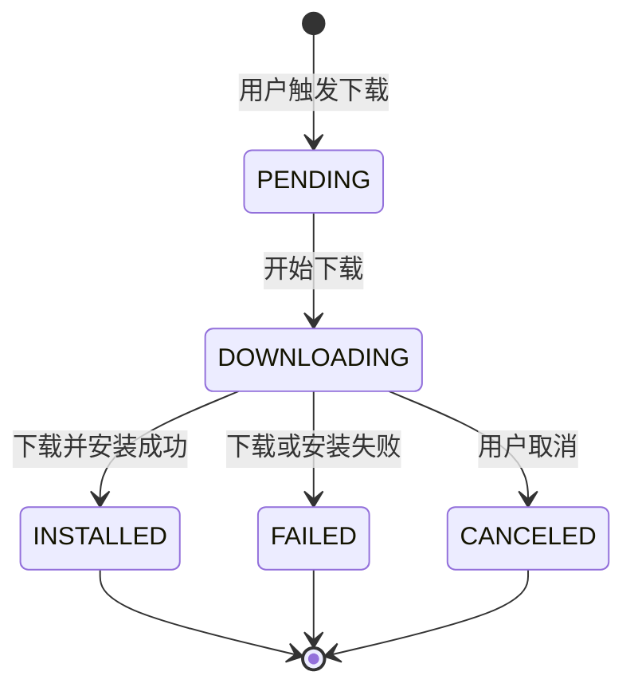
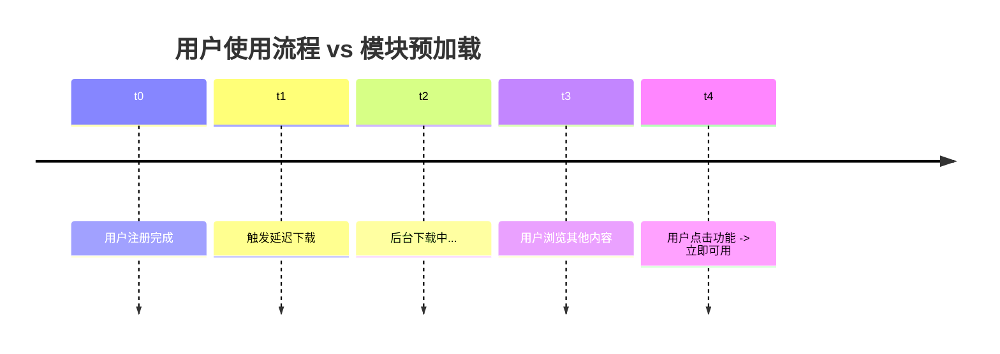
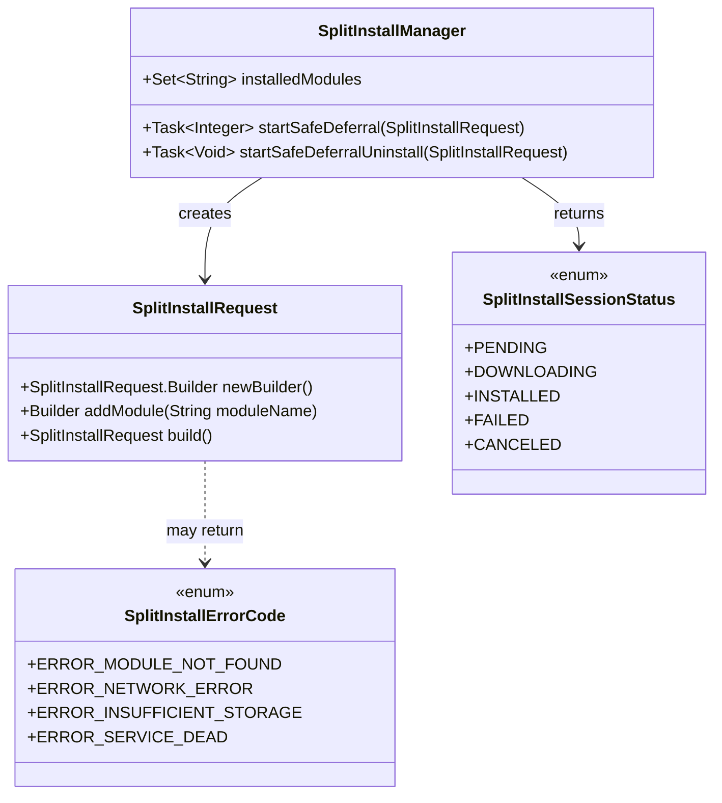

# 21.1.123 DynamicFeatureInstallation

东方的天际开始泛起一丝淡淡的金色，像是有人在那边的画布上悄悄涂了一层水彩。北斗七星的星光变得稀薄了，只有最亮的那颗还坚持着不肯睡去。

洛芙打了个哈欠，眼角沁出一点泪花。她揉了揉眼睛，看向黛琳：“昨天我们学了怎么配置 DynamicFeatureExtension，快递单填好了——那快递怎么送过来呢？”

黛琳微微一笑，从口袋里掏出一枚小小的金属徽章，上面刻着齿轮的图案。“问得好。配置是填单子，今天我们要学的，是怎么把‘快递’送到用户手里——也就是 DynamicFeatureInstallation，动态功能安装。”

“听起来好像物流公司哦，”伊莎轻声笑着说，“昨天是发货站填单子，今天是快递员送货。”

希尔已经打开了笔记本，屏幕上是满满当当的 API 文档。“ DynamicFeatureInstallation 呢，不是单独的类，而是一套关于‘怎么安装’的 API 体系。核心是 SplitInstallManager——就是那个帮你管理动态模块安装的‘快递员’。”

洛芙凑近屏幕：“那具体怎么操作呢？”

“先别急，”黛琳按住她的肩膀，“我们从头说起——你知道当你点击一个功能按钮，到模块加载完成，这中间发生了什么吗？”

---

## 拆开快递的第一步：SplitInstallManager

黛琳又在白板上画了起来。她画了一个大大的信封，信封上写着“feature_camera”。

“想象一下，用户在应用里点击了‘拍照’按钮。但拍照功能在一个动态模块里，还没下载。此时，应用需要做三件事。”

她在信封旁边写下数字：

> 第一步：检查模块是否已安装
> 第二步：如果没有，发起下载请求
> 第三步：监听下载状态，完成后加载模块

“整个过程，就是由 SplitInstallManager 来协调的，”黛琳说，“你可以把它想象成一个全能管家——它帮你查快递、催快递、收快递。”

希尔把笔记本转过来，屏幕上是一段初始化代码：

```kotlin
// 创建 SplitInstallManager 实例
// 这个实例是应用级别的，一个应用只需要一个
val splitInstallManager = SplitInstallManagerFactory.create(context)

// 获取已安装的模块列表
val installedModules: Set<String> = splitInstallManager.installedModules

// 判断某个模块是否已安装
val isCameraInstalled = installedModules.contains("feature_camera")
```

“看到没？”希尔指着代码说，“`SplitInstallManagerFactory.create()` 是创建管家的方法。拿到管家之后，你就可以问它：‘有哪些模块已经安装好了？’——`installedModules` 会返回一个模块名的集合。”

洛芙举手：“那如果我想查某个具体的模块呢？”

“用 `contains()` 就行，”黛琳说，“就像查快递单号一样——告诉管家单号，它告诉你‘已签收’还是‘运输中’。”

---

## 发起请求：SplitInstallRequest

天边的金色越来越浓了。湖面上还残留着星光的倒影，但已经开始被朝霞染成淡淡的橘色。

“如果模块没安装呢？”洛芙问，“那就要发起下载请求了。”

“对，”黛琳点点头，“这时候需要创建 `SplitInstallRequest`——就像你填快递单，要把收货地址、物品名称都写清楚。”

希尔又敲了一段代码：

```kotlin
// 创建模块安装请求
// 就像填写快递单：要从哪个仓库（模块名）提货
val request = SplitInstallRequest.newBuilder()
    .addModule("feature_camera")  // 要下载的模块名
    // .addModule("feature_album")  // 可以一次请求多个模块
    .build()

// 发起请求
val task = splitInstallManager.startSafeDeferral(request)
```

“这里有个关键点，”黛琳强调，“`addModule()` 的参数必须是模块名，不是包名。模块名是你在 `dynamicFeatures` 代码块里创建的那个名字，比如 `'feature_camera'`——而不是包名 `'com.example.app.feature.camera'`。”

洛芙赶紧记下来：*请求的是模块名，不是包名！*

“为什么不能一次把所有模块都下载？”伊莎好奇地问。

“傻呀，”希尔笑着说，“下载要流量要时间的当然是有需要再下载啊！一次性全下载，那和没拆包有什么区别？Play Feature Delivery 的核心就是‘按需’——用户需要什么功能，再下载什么功能。”

---

## 监听状态：安装不是一秒钟的事

朝霞已经完全铺开了。东方的天空变成了淡淡的橙粉色，几只早起的鸟从树梢飞过，发出清脆的鸣叫。

“可下载需要时间呀，”洛芙说，“总不能让我一直等着，什么反馈都没有吧？”

“所以需要监听状态，”黛琳说，“SplitInstallRequest 发出去之后，会返回一个 Task，你可以给这个 Task 添加监听器，就像——”

“就像查快递物流信息！”伊莎接口道，“快递到哪了、是不是在派送中，都能实时看到。”

希尔点点头，在键盘上敲了起来：

```kotlin
// 发起请求后，返回一个 Task
val task = splitInstallManager.startSafeDeferral(request)

// 添加状态监听器
task.addOnSuccessListener { sessionId ->
    // 下载成功！sessionId 是这次下载会话的 ID
    Log.d("Install", "模块开始下载，会话 ID: $sessionId")
}

task.addOnFailureListener { error ->
    // 下载失败
    Log.e("Install", "下载失败: ${error.message}")
}

// 或者用更详细的状态监听
task.addOnCompleteListener { result ->
    when (result.status) {
        SplitInstallSessionStatus.INSTALLED -> {
            // 模块已安装完成，可以使用了
            Log.d("Install", "模块安装成功！")
        }
        SplitInstallSessionStatus.FAILED -> {
            // 安装失败
            Log.e("Install", "安装失败，错误码: ${result.errorCode}")
        }
        else -> {
            Log.d("Install", "当前状态: ${result.status}")
        }
    }
}
```

黛琳在白板上画了一个状态流程图：



“这就是模块安装的完整生命周期，”黛琳说，“从 PENDING（待处理）开始，然后 DOWNLOADING（下载中），最后要么 INSTALLED（安装成功），要么 FAILED（失败）。”

“原来下载一个模块这么复杂呀，”洛芙感叹道，“比我等外卖久多了。”

“那是因为外卖是现成的，”伊莎温柔地说，“但动态模块需要从服务器下载当然需要时间呀。不过正因为这样，应用的初始包才能那么小——用户不需要为一个可能用不到的功能买单。”

---

## 进阶API：更多玩法

太阳已经完全升起来了。金色的阳光洒在湖面上，碎金点点。远处的山轮廓清晰，山脚下的树林里弥漫着淡淡的雾气。

“除了最基本的下载，”黛琳说，“还有几个进阶功能你也应该知道。”

她在白板上写下三个词：

> 批量安装
> 延迟安装
> 卸载模块

“批量安装？”洛芙问，“就是一次下载好几个模块？”

“对，”黛琳说，“比如你的应用有个‘新手引导’功能，需要同时用到相机模块和相册模块那你就可以一次请求两个模块。”

希尔快速敲出一段代码：

```kotlin
// 批量安装请求
val request = SplitInstallRequest.newBuilder()
    .addModule("feature_camera")    // 相机模块
    .addModule("feature_album")     // 相册模块
    .addModule("feature_editor")    // 编辑器模块
    .build()

splitInstallManager.startSafeDeferral(request)
    .addOnSuccessListener {
        Log.d("Install", "所有模块下载成功！")
    }
```

“那延迟安装呢？”伊莎问。

“延迟安装适合那些‘不急用但最好提前准备好’的功能，”黛琳解释，“比如用户刚注册完，你知道他接下来大概率会用某个功能，就可以让系统在后台预先下载——等用户真的要点的时候，就不用等了。”

她在白板上画了一个时间线：



“最后是卸载模块，”黛琳说，“有些功能用户可能不再需要了，你就可以允许他们卸载——释放设备空间。”

```kotlin
// 请求卸载模块
val uninstallRequest = SplitInstallRequest.newBuilder()
    .addModule("feature_experimental")  // 要卸载的模块名
    .build()

splitInstallManager.startSafeDeferral(uninstallRequest)
    .addOnSuccessListener {
        Log.d("Install", "模块已卸载")
    }
```

洛芙眨眨眼：“那用户删掉模块后，再想用怎么办？”

“再下载一遍呗，”希尔说，“模块是‘可拆卸’的，不是‘一锤子买卖’。”

---

## 反模式：那些年我们踩过的坑

日头渐渐升高了。阳光开始变得有些刺眼，黛琳把白板收起来，撑开一把小伞。

“最后要说的是——哪些事情不该做，”黛琳的表情变得认真起来，“这是最容易被忽略，但踩坑最多的地方。”

她在白板上写下四个红色的词：

> ❌ 不检查状态直接加载
> ❌ 不处理失败场景
> ❌ 在主线程等待下载
> ❌ 忽略版本兼容性

“第一条，”黛琳说，“绝对不要在没确认模块已安装的情况下就直接使用它。”

她画了一个错误的代码示例：

```kotlin
// ❌ 错误示例：直接使用模块，不检查是否安装
class CameraService {
    fun openCamera() {
        // 假设模块一定已安装——这是错误的！
        val intent = Intent().setClassName(
            "com.example.app",
            "com.example.app.feature.camera.CameraActivity"
        )
        startActivity(intent)
        // 如果模块没安装，这里会崩溃！
    }
}
```

“正确做法是——”

她在旁边写出修正后的代码：

```kotlin
// ✅ 正确示例：先检查，再使用
class CameraService(private val context: Context) {
    
    private val splitInstallManager = SplitInstallManagerFactory.create(context)
    
    fun openCamera() {
        // 第一步：检查模块是否已安装
        val installedModules = splitInstallManager.installedModules
        if (installedModules.contains("feature_camera")) {
            // 已安装，直接打开
            val intent = Intent().setClassName(
                "com.example.app",
                "com.example.app.feature.camera.CameraActivity"
            )
            context.startActivity(intent)
        } else {
            // 未安装，提示用户或发起下载
            showDownloadPrompt()
        }
    }
    
    private fun showDownloadPrompt() {
        // 展示下载提示对话框
        Log.d("Camera", "相机模块未安装，请先下载")
    }
}
```

洛芙看着对比，连连点头：“好像在保险箱前加了一道锁——先确认锁开了，再开门。”

“第二条，”黛琳继续说，“一定要处理失败场景。用户可能在下载过程中网络断开，可能磁盘空间不足——应用不能说崩就崩。”

她在白板上写下失败的错误码：

```kotlin
splitInstallManager.startSafeDeferral(request)
    .addOnFailureListener { error ->
        // 根据错误码给出不同的提示
        when (error.errorCode) {
            SplitInstallErrorCode.ERROR_MODULE_NOT_FOUND -> {
                // 模块名不存在
                Log.e("Install", "模块不存在，请检查模块名")
            }
            SplitInstallErrorCode.ERROR_NETWORK_ERROR -> {
                // 网络问题
                Log.e("Install", "网络连接失败，请检查网络")
            }
            SplitInstallErrorCode.ERROR_INSUFFICIENT_STORAGE -> {
                // 存储空间不足
                Log.e("Install", "设备空间不足，请清理后再试")
            }
            SplitInstallErrorCode.ERROR_SERVICE_DEAD -> {
                // Play 服务挂了
                Log.e("Install", "Google Play 服务异常，请更新 Play 服务")
            }
            else -> {
                Log.e("Install", "未知错误: ${error.message}")
            }
        }
    }
```

伊莎轻声说：“好像一个贴心的服务员——客人点的菜没了，不是说‘没有了’就完事了，而是说‘这道菜暂时没有，但我们有类似的X菜，您要不要试试？’”

“第三条，”黛琳说，“绝对不要在主线程同步等待下载完成。下载是异步的，你不能——”

“就像等快递的时候不能一直站在门口不走吧？”洛芙插嘴道，“得做别的事情，快递到了再去取。”

“对极了，”黛琳笑了，“要用回调或者协程来处理异步结果，而不是卡住主线程。”

最后一条是版本兼容性。黛琳说得很简洁：“有些设备可能不支持动态模块——可能是老版本的 Play 服务，或者系统版本太低。你的应用要能优雅降级，而不是在这些设备上直接报错。”

---

## 完整实战：洛芙的露营应用

太阳已经很高了。湖面上波光粼粼，偶尔有一条鱼跃出水面，溅起一片水花。

“我们来完整地写一个例子，”希尔说，“就当是今天的小练习——做一个露营应用的动态功能管理器。”

她打开一个新文件，开始敲代码：

```kotlin
/**
 * 露营应用动态功能管理器
 * 负责检查、下载、加载动态功能模块
 */
class CampingFeatureManager(private val context: Context) {
    
    private val splitInstallManager = SplitInstallManagerFactory.create(context)
    
    // 已定义的所有动态模块
    enum class FeatureModule(val moduleName: String) {
        CAMERA("feature_camera"),
        MAP("feature_map"),
        WEATHER("feature_weather"),
        AR("feature_ar_camping")
    }
    
    /**
     * 检查指定模块是否已安装
     */
    fun isModuleInstalled(module: FeatureModule): Boolean {
        return splitInstallManager.installedModules.contains(module.moduleName)
    }
    
    /**
     * 获取所有已安装的模块
     */
    fun getInstalledModules(): Set<String> {
        return splitInstallManager.installedModules
    }
    
    /**
     * 请求下载并安装模块
     * @param module 要安装的模块
     * @param onComplete 下载完成后的回调
     */
    fun installModule(
        module: FeatureModule,
        onComplete: () -> Unit,
        onFailure: (String) -> Unit
    ) {
        // 先检查是否已安装
        if (isModuleInstalled(module)) {
            Log.d("CampingFeature", "${module.moduleName} 已安装")
            onComplete()
            return
        }
        
        // 创建安装请求
        val request = SplitInstallRequest.newBuilder()
            .addModule(module.moduleName)
            .build()
        
        // 发起请求并监听状态
        splitInstallManager.startSafeDeferral(request)
            .addOnCompleteListener { result ->
                when (result.status) {
                    SplitInstallSessionStatus.INSTALLED -> {
                        Log.d("CampingFeature", "${module.moduleName} 安装成功")
                        onComplete()
                    }
                    SplitInstallSessionStatus.FAILED -> {
                        val errorMsg = "安装失败，错误码: ${result.errorCode}"
                        Log.e("CampingFeature", errorMsg)
                        onFailure(errorMsg)
                    }
                    else -> {
                        Log.d("CampingFeature", "当前状态: ${result.status}")
                    }
                }
            }
    }
    
    /**
     * 带回退的模块加载
     * 如果模块不存在，调用 fallback
     */
    fun loadFeatureWithFallback(
        module: FeatureModule,
        onSuccess: () -> Unit,
        onFallback: () -> Unit
    ) {
        if (isModuleInstalled(module)) {
            onSuccess()
        } else {
            // 模块未安装，尝试安装
            installModule(
                module = module,
                onComplete = onSuccess,
                onFailure = { error ->
                    Log.w("CampingFeature", "模块安装失败，使用回退: $error")
                    onFallback()
                }
            )
        }
    }
    
    /**
     * 卸载不再需要的模块
     */
    fun uninstallModule(
        module: FeatureModule,
        onComplete: () -> Unit
    ) {
        val request = SplitInstallRequest.newBuilder()
            .addModule(module.moduleName)
            .build()
        
        splitInstallManager.startSafeDeferral(request)
            .addOnCompleteListener { result ->
                when (result.status) {
                    SplitInstallSessionStatus.INSTALLED -> {
                        // 注意：INSTALLED 在卸载请求中表示"已移除"
                        Log.d("CampingFeature", "${module.moduleName} 已卸载")
                        onComplete()
                    }
                    SplitInstallSessionStatus.FAILED -> {
                        Log.e("CampingFeature", "卸载失败")
                    }
                }
            }
    }
}
```

“希尔这段代码好完整呀！”洛芙说，“既有安装，又有检查，还有回退。”

“这就是一个生产级的模块管理器该有的样子，”黛琳说，“从检查到安装到失败处理，全部考虑到。用户点击按钮到看到功能，中间每一步都要有交代。”

---

## 黎明时分的学习总结

太阳已经完全升起来了。金色的光芒洒在整个露营地上，草叶上的露珠闪闪发亮。远处的山峦轮廓清晰，山脚下传来鸟儿清脆的歌声。

洛芙伸了个懒腰，打了个哈欠：“原来安装一个动态模块这么复杂，又要检查、又要请求、还要监听状态……”

“但是正因为复杂，”伊莎轻声说，“用户才能享受到‘按需’的体验——不需要为了一个可能用不到的功能等很久，也不需要占用太多空间。”

黛琳把白板收好，总结道：“今天学的 DynamicFeatureInstallation，核心就是三个问题：”

她在草地上用树枝写了三行字：

> 怎么知道模块有没有？（SplitInstallManager.installedModules）
> 怎么下载模块？（SplitInstallManager.startSafeDeferral + SplitInstallRequest）
> 怎么知道下载成功了？（Task 回调 + SplitInstallSessionStatus）

“对哦！”洛芙拍手，“就是查物流、取快递、收包裹！”

“Exactly!”希尔打了个响指，“DynamicFeatureInstallation 就是这么回事。”

---

## 专业技术总结

> **DynamicFeatureInstallation** — Android Gradle DSL 中与动态功能模块安装相关的 API 体系。核心是 `SplitInstallManager` 用于管理模块的安装、查询、卸载，配合 `SplitInstallRequest` 发起下载请求，通过 `SplitInstallSessionStatus` 监听安装状态，实现完整的 Play Feature Delivery 运行时安装流程。

---

#### 结构图



---

#### 复杂度与影响

| 操作 | 性能影响 | 可维护性影响 |
|------|----------|--------------|
| 检查已安装模块 | 即时返回，无开销 | 需维护模块名列表 |
| 发起下载请求 | 异步执行，不阻塞主线程 | 需处理网络状态 |
| 批量下载 | 一次下载多模块节省时间 | 需处理部分失败场景 |
| 状态监听 | 实时回调，有一定回调开销 | 需区分多种状态处理 |

---

#### 反模式与陷阱

1. **不检查模块是否安装就直接使用** → 应用崩溃 → 先用 `installedModules.contains()` 检查
2. **不处理下载失败场景** → 用户看到无意义报错 → 添加 `addOnFailureListener` 并给出友好提示
3. **在主线程同步等待下载完成** → ANR → 使用回调或协程处理异步结果
4. **混淆模块名和包名** → 请求失败 → `addModule()` 用模块名，不是包名
5. **忽略版本兼容性** → 老设备崩溃 → 检查 Play 服务可用性，必要时降级
6. **不处理用户取消下载** → 状态卡住 → 监听 `CANCELED` 状态
7. **不处理存储空间不足** → 下载失败 → 监听 `ERROR_INSUFFICIENT_STORAGE`

---

#### 设计哲学

动态功能安装的核心设计思想是**运行时按需加载**，通过 SplitInstallManager API 实现模块的安装查询、下载请求、状态监听、卸载管理。这体现了：

1. **用户体验优先** — 按需下载减少初始包体积和等待时间
2. **渐进增强** — 基础功能先行，高级功能按需加载
3. **优雅降级** — 通过状态监听和错误处理提供友好的失败体验
4. **资源管理** — 支持模块卸载，释放设备空间

---

#### 🏕️ 动手练习

**项目目标**：为露营指南应用实现完整的动态功能安装管理器

**Task 1：创建 SplitInstallManager 封装类**

> **目标**：创建 FeatureManager 类封装 SplitInstallManager 的常用操作

- 创建 FeatureManager 类，构造函数传入 Context
- 初始化 SplitInstallManagerFactory.create(context)
- 实现 isModuleInstalled(moduleName: String): Boolean 方法

**Task 2：实现模块安装方法**

> **目标**：实现异步安装模块的功能

```kotlin
fun installModule(
    moduleName: String,
    onSuccess: () -> Unit,
    onFailure: (Int) -> Unit  // 错误码
) {
    val request = SplitInstallRequest.newBuilder()
        .addModule(moduleName)
        .build()
    
    splitInstallManager.startSafeDeferral(request)
        .addOnCompleteListener { result ->
            if (result.status == SplitInstallSessionStatus.INSTALLED) {
                onSuccess()
            } else {
                onFailure(result.errorCode)
            }
        }
}
```

**Task 3：实现带 UI 反馈的下载流程**

> **目标**：在 Activity 中展示下载进度和状态

- 创建 DownloadProgressDialog 显示下载状态
- 监听 SplitInstallSessionStatus 状态变化
- 显示下载进度或失败提示

**Task 4：实现回退逻辑**

> **目标**：当模块下载失败时，提供替代功能

- 创建本地默认实现作为回退
- 记录下载失败事件用于分析
- 提供重试按钮

**Task 5：实现批量安装**

> **目标**：一次请求安装多个相关模块

```kotlin
val request = SplitInstallRequest.newBuilder()
    .addModule("feature_camera")
    .addModule("feature_album")
    .build()
```

**Task 6：实现模块卸载**

> **目标**：允许用户卸载不需要的模块释放空间

```kotlin
val uninstallRequest = SplitInstallRequest.newBuilder()
    .addModule("feature_experimental")
    .build()

splitInstallManager.startSafeDeferral(uninstallRequest)
    .addOnCompleteListener { ... }
```

**验收标准**：
- [ ] FeatureManager 可以检查指定模块是否已安装
- [ ] 点击未安装模块时触发下载流程
- [ ] 下载过程中显示进度/状态提示
- [ ] 下载失败时展示友好错误信息
- [ ] 模块安装成功后可以正常打开功能
- [ ] 可以卸载已安装的模块

---

#### 参考实现要点

1. **先检查再安装**：使用 `installedModules.contains()` 确认模块状态，避免重复下载
2. **alwaysUpdateJobId**：需要更新已安装模块时使用，确保下载最新版本
3. **网络状态检查**：下载前检查网络可用性，提示用户使用 WiFi
4. **存储空间检查**：下载前检查设备空间，避免下载到一半失败
5. **Play 服务检查**：在老旧设备上检查 Play 服务是否可用，必要时降级
6. **批量操作**：相关模块可以批量下载，一次网络请求完成
7. **回调与协程**：推荐使用 Kotlin 协程简化异步代码

---

> 学习建议：DynamicFeatureInstallation 是 Play Feature Delivery 实战的核心。先从最简单的单模块下载开始，熟悉完整的流程（检查→请求→监听→加载），再尝试批量安装和错误处理。推荐阅读官方 Sample：dynamic-features，参照 Google 官方的最佳实践实现。

---

## 洛芙的小小日记本

好累好充实的一个晚上！从深夜学到天亮终于搞懂了动态功能安装——原来模块快递员是这么工作的：先查物流（检查安装状态），再填快递单（发起请求），最后等收货（监听状态）。黛琳说的对，用户体验就是由这些看不见的细节决定的。虽然有点困，但学会了这个超有成就感！☀️

---

## 今日关键词

- **DynamicFeatureInstallation** — 动态功能安装相关 API 体系
- **SplitInstallManager** — Android API，用于管理动态模块的安装、查询、卸载
- **SplitInstallManagerFactory** — 创建 SplitInstallManager 的工厂类
- **SplitInstallRequest** — 表示一次模块安装请求
- **SplitInstallSessionStatus** — 模块安装会话状态枚举（PENDING, DOWNLOADING, INSTALLED, FAILED, CANCELED）
- **SplitInstallErrorCode** — 模块安装错误码枚举
- **SplitInstallErrorCode.ERROR_NETWORK_ERROR** — 网络错误
- **SplitInstallErrorCode.ERROR_INSUFFICIENT_STORAGE** — 存储空间不足
- **SplitInstallErrorCode.ERROR_MODULE_NOT_FOUND** — 模块不存在
- **SplitInstallErrorCode.ERROR_SERVICE_DEAD** — Play 服务异常
- **Play Feature Delivery** — Google Play 提供的动态功能分发技术
- **onDemand** — 按需下载模式
- **installTime** — 安装时下载模式
- **模块名（module name）** — dynamicFeatures 代码块中定义的模块标识
- **包名（package name）** — AndroidManifest.xml 中的包名标识
