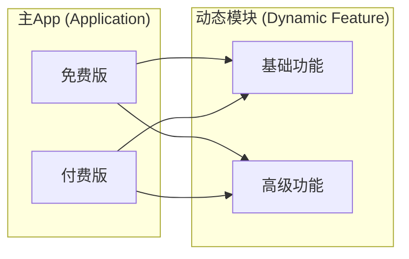
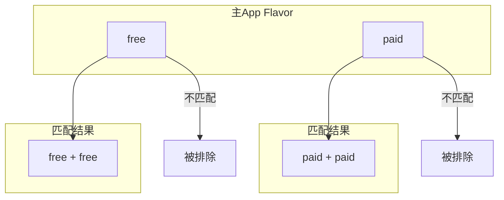
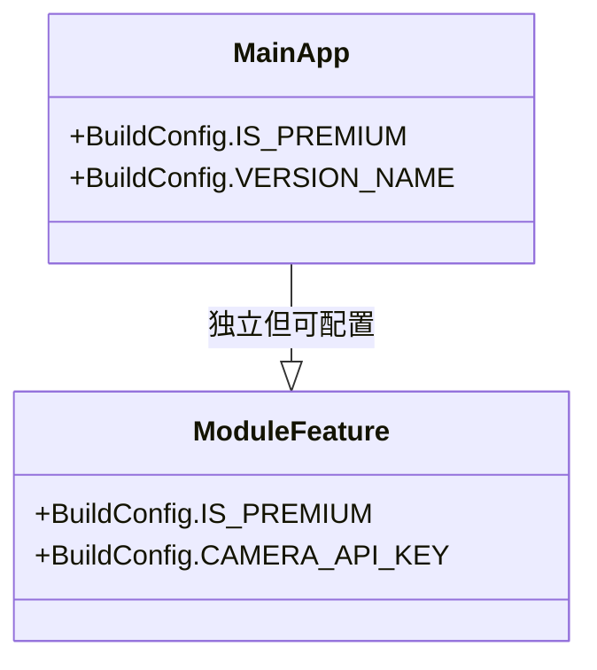
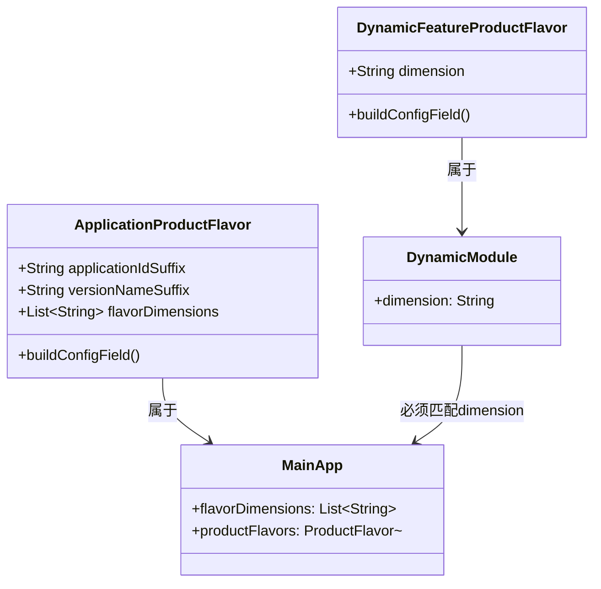

# 21.1.124 DynamicFeatureProductFlavor

清晨的第一缕阳光穿透树梢，在草地上投下斑驳的光影。露珠还挂在草叶上，晶莹剔透，像一颗颗小小的宝石。

洛芙揉了揉眼睛，看着天边的朝霞从淡粉变成金黄。她打了个哈欠，总结一般地说：“昨天学到半夜，总算把DynamicFeatureInstallation搞明白了——怎么检查模块、怎么请求下载、怎么监听状态。”

“现在该学点新了吧？”希尔的精神倒是一如既往地好，她已经打开笔记本，屏幕上是满满的Gradle代码。

黛琳微微一笑，从背包里掏出一本小册子：“昨天学的是‘怎么发货’，今天我们要学的是‘怎么给货物贴标签’——DynamicFeatureProductFlavor，动态特征产品风味。”

“产品风味？”洛芙眨眨眼，“就是给动态模块用的ProductFlavor？”

“对，”黛琳点点头，“之前的章节里我们学过ApplicationProductFlavor——给主App配置不同版本。但动态功能模块也需要有不同的版本，这时候就要用DynamicFeatureProductFlavor了。”

伊莎轻声说：“就像露营的时候，主帐篷是一个版本，但有的用户需要豪华版，有的用户需要轻量版…….dynamic module也能这样吗？”

---

## 为什么动态模块也需要产品风味

黛琳在白板上画了两个圈，左边写着“主App”，右边写着“动态模块”。

“之前我们学ProductFlavor，是为了给App创建不同的版本——免费版、付费版、国内版、海外版，”黛琳解释道，“但动态模块作为主App的一部分，也可能有不同的版本需求。”

她画了一个更详细的对比图：



洛芙看着图若有所思：“也就是说，主App是免费版还是付费版，跟动态模块是基础版还是高级版，是可以独立配置的？”

“对，就是这个意思，”黛琳说，“比如你的主App有免费版和付费版，但其中的相机模块也分‘基础相机’和‘专业相机’——这两个维度的组合，就可以用产品风味来实现。”

希尔补充道：“还有一个重要的区别——动态模块的产品风味需要和主App的productFlavor匹配。这个后面会详细说。”

---

## 第一个DynamicFeatureProductFlavor配置

黛琳打开代码编辑器，开始写第一个示例：

```kotlin
android {
    // 主App的产品风味配置
    flavorDimensions += "version"
    
    productFlavors {
        create("free") {
            dimension = "version"
            applicationIdSuffix = ".free"
            buildConfigField("Boolean", "IS_PREMIUM", "false")
        }
        
        create("paid") {
            dimension = "version"
            applicationIdSuffix = ".paid"
            buildConfigField("Boolean", "IS_PREMIUM", "true")
        }
    }
}

// 动态功能模块配置
androidFeatures {
    create("feature_camera") {
        // 动态模块的产品风味
        // 这里的风味和主App的风味是对应的
        dimension = "version"
        
        // 可以配置模块级别的buildConfigField
        buildConfigField("Boolean", "IS_AD_ENABLED", "true")
    }
}
```

洛芙认真看着代码：“这个dynamicFeatures里面的flavor和主App的flavor是什么关系呀？”

“问得好，”黛琳说，“动态模块的flavor必须和主App的flavor有交集。系统会把主App的flavor和模块的flavor做匹配，只有匹配成功的模块才会被构建。”

她在白板上画了一个匹配示意图：



“如果模块只配置了free风味，”黛琳解释说，“那它只会出现在free版本的主App中，paid版本的主App不会包含这个模块。”

---

## 多维度产品风味配置

洛芙举手：“那如果我想让模块同时支持free和paid呢？”

“那就需要配置多个维度，或者不指定dimension，”黛琳说，“我们来看几种不同的写法。”

她切换到下一个代码示例：

```kotlin
// 方式一：不指定dimension（默认匹配所有）
androidFeatures {
    create("feature_analytics") {
        // 不写dimension，默认这个模块会出现在所有主App版本中
        buildConfigField("String", "ANALYTICS_KEY", "\"default_key\"")
    }
}

// 方式二：指定固定的dimension值
androidFeatures {
    create("feature_premium_editor") {
        dimension = "version"
        
        // 只有当主App的flavor也是"paid"时，这个模块才会被包含
        // 如果主App是free版本，这个模块不会构建
    }
}

// 方式三：使用*匹配所有
androidFeatures {
    create("feature_base") {
        // 明确表示匹配所有维度
        dimension = "*"
        buildConfigField("Boolean", "REQUIRES_PERMISSION", "false")
    }
}
```

伊莎歪着头：“是不是可以这样理解——如果我想让某个模块只在特定版本出现，就指定具体的dimension和值；如果想让模块在所有版本都出现，就不写dimension或者写*？”

“完全正确，”黛琳笑了，“这就是动态模块风味的精髓——你可以通过配置，决定每个模块出现在哪些版本的主App里。”

---

## 模块级别的buildConfigField

希尔把笔记本转过来，指着屏幕说：“DynamicFeatureProductFlavor和普通ProductFlavor一样，也可以设置buildConfigField——但这个字段是在模块内部的代码中使用的。”

她写了一段示例代码：

```kotlin
androidFeatures {
    create("feature_camera") {
        dimension = "version"
        
        // 模块级别的buildConfigField
        // 在模块的代码中可以通过 BuildConfig.IS_PREMIUM 访问
        buildConfigField("Boolean", "IS_PREMIUM", "false")
        
        // 模块也可以有自己的配置
        buildConfigField("String", "CAMERA_API_KEY", "\"abc123\"")
    }
}
```

然后她又在模块的代码里展示了如何读取这个字段：

```kotlin
// 在动态模块的代码中
class CameraConfig {
    fun init() {
        // 读取模块自己的buildConfigField
        val isPremium = BuildConfig.IS_PREMIUM
        val apiKey = BuildConfig.CAMERA_API_KEY
        
        if (isPremium) {
            // 付费版功能
            enableProFeatures()
        } else {
            // 免费版功能
            enableBasicFeatures()
        }
    }
}
```

洛芙好奇地问：“那模块的BuildConfig和主App的BuildConfig是同一个吗？”

“不是同一个，”黛琳说，“模块有自己的BuildConfig类，和主App的是分开的。但它们都来自于Gradle的构建配置，只是作用域不同。”

她在白板上画了一个说明图：



---

## 动态模块风味的特殊约束

希尔的表情变得认真起来：“动态模块的产品风味有一些特殊的约束，和主App不太一样。”

她在白板上写了几个要点：

> 1. dimension必须和主App的flavorDimensions匹配
> 2. 模块不能添加新的dimension（只能使用主App已有的）
> 3. 模块的flavor值必须是主App对应dimension的子集

“我们来实际看一下容易犯的错误，”黛琳说。

她在编辑器里写了一个错误的示例：

```kotlin
// ❌ 错误示例：模块使用了主App没有的dimension
android {
    flavorDimensions += "version"  // 主App只有version维度
}

androidFeatures {
    create("feature_new") {
        dimension = "region"  // 错误！主App没有region维度
    }
}
```

“这样的配置会报错，”黛琳说“因为模块不能使用主App不存在的dimension。”

然后她展示了正确的写法：

```kotlin
// ✅ 正确示例：模块使用主App已有的dimension
android {
    flavorDimensions += "version"
    flavorDimensions += "distribution"
}

androidFeatures {
    create("feature_camera") {
        dimension = "version"  // 主App有这个维度
    }
    
    create("feature_map") {
        dimension = "distribution"  // 主App有这个维度
    }
}
```

洛芙赶紧记下来：*模块用维度，必须是主App已有的！*

---

## 应用场景：洛斯特的露营应用

太阳已经升高了。湖面上的薄雾渐渐散去，露出波光粼粼的水面。几只水鸟掠过，留下一串涟漪。

“我们来做一个实际场景的练习，”希尔说，“洛芙，假设你要做一个露营应用，有一些动态模块需要配置风味——你会怎么设计？”

洛芙想了想：“嗯……主App有免费版和付费版，相机模块也可以分基础版和专业版？”

“棒！”希尔打了个响指，“我们就把这个需求实现出来。”

她开始写配置代码：

```kotlin
// 主App build.gradle
android {
    flavorDimensions += "version"
    
    productFlavors {
        create("free") {
            dimension = "version"
            applicationIdSuffix = ".free"
            versionNameSuffix = "-free"
            buildConfigField("Boolean", "IS_PREMIUM", "false")
        }
        
        create("pro") {
            dimension = "version"
            applicationIdSuffix = ".pro"
            versionNameSuffix = "-pro"
            buildConfigField("Boolean", "IS_PREMIUM", "true")
        }
    }
}

// 动态模块的build.gradle
androidFeatures {
    // 基础相机模块 - 免费版和付费版都需要
    create("feature_camera_basic") {
        dimension = "*"  // 匹配所有主App版本
        buildConfigField("Boolean", "HAS_ADS", "true")
    }
    
    // 专业版相机功能 - 只有付费版才有
    create("feature_camera_pro") {
        dimension = "version"  // 匹配主App的version维度
        // 默认会匹配所有值？不对，要具体指定
    }
}
```

“等等，”黛琳突然出声，“这里的写法有问题。”

希尔挠挠头：“对，我写快了。实际上如果想让它只在pro版本出现，需要改一下。”

她重新写了一个正确的版本：

```kotlin
androidFeatures {
    // 基础相机模块 - 所有版本都需要
    create("feature_camera_basic") {
        dimension = "*"  // 匹配所有主App版本
        buildConfigField("Boolean", "HAS_ADS", "true")
    }
    
    // 专业版相机功能 - 只有pro版才有
    create("feature_camera_pro") {
        // 通过设置特定的dimension值
        // 但在DSL中不能直接设值，需要通过主App的ProductFlavor组合来决定
    }
}
```

“其实正确的方式是这样，”黛琳接过键盘，写道：

```kotlin
// 主App
productFlavors {
    create("free") {
        dimension = "version"
        // 免费版不包含pro相机模块
    }
    
    create("pro") {
        dimension = "version"
        // 付费版包含pro相机模块
    }
}

// 动态模块 - 让模块“选择”出现在哪个版本
androidFeatures {
    create("feature_camera_basic") {
        // 所有版本都有，不指定dimension或用*
    }
    
    create("feature_camera_pro") {
        // 通过主App的productFlavor配置决定包含关系
        // free版本不包含这个模块，pro版本包含
    }
}
```

洛芙看着代码，有些困惑：“可是这样还是没说清楚怎么让模块只在pro版出现呀……”

黛琳笑了：“这个问题问到点子上了。其实动态模块默认会匹配所有flavor值，如果想限制，需要用不同的方法。”

她切换到一种更精确的配置方式：

```kotlin
// 主App - 使用维度组合
flavorDimensions += "version"
flavorDimensions += "tier"

productFlavors {
    create("freeGoogle") {
        dimension = "version"
        dimension = "tier"  // 注意：这样会覆盖上面的！
    }
    
    // 正确的方式：使用不同的flavor组合
    create("free") {
        dimension = "version"
    }
    
    create("pro") {
        dimension = "version"
    }
}

// 更好的做法：使用source set
androidFeatures {
    create("feature_camera_pro") {
        // 模块级别只能在dimension层面配置
        // 值的限制通过主App的source set实现
    }
}
```

希尔耸耸肩：“好吧，看来这个知识点比想象的复杂。我们换个思路——”

她重新组织了一下：

```kotlin
// 实际上最常见的做法是：
// 1. 主App配置flavorDimensions
// 2. 模块配置dimension让其出现在某些版本
// 3. 通过source set添加不同版本特有的模块

// 主App
productFlavors {
    create("free") { ... }
    create("pro") { ... }
}

// 模块 - 让模块可以在所有版本使用
androidFeatures {
    create("feature_premium_content") {
        dimension = "*"
    }
}

// 在有条件的情况下，可以通过主App的sourceSets控制
sourceSets {
    pro {
        java.srcDirs += 'src/pro/java'
        // pro版本特有的代码
    }
}
```

洛芙似懂非懂地点点头：“所以……模块级别的风味限制，其实更多是通过模块出现在哪些主App版本来决定的？”

“对，”黛琳总结道，“这就是动态模块风味的精髓——不在模块级别指定具体值，而是让模块‘参与’主App的风味组合。”

---

## 反模式：那些年我们踩过的坑

阳光越来越强烈了。女孩们移到一棵大树的阴凉下，继续学习。

“最后要说的是常见错误，”黛琳的表情变得严肃，“这些坑我以前都踩过。”

她在白板上写了几个红色的错误示例：

> ❌ 模块使用主App没有的dimension
> ❌ 模块的flavor值和主App无法匹配
> ❌ 在模块中创建新的flavorDimensions
> ❌ 忘记同步模块和主App的配置

“第一个错误我们刚才说过了，”黛琳道，“模块使用的dimension必须在主App中定义。”

她继续解释第二个错误：

```kotlin
// ❌ 错误示例：模块的flavor值主App没有
// 主App: flavorDimensions = ["version"], flavors = ["free", "paid"]
// 模块:
androidFeatures {
    create("feature_test") {
        dimension = "version"
        // 这里如果尝试设置value = "premium" 但主App没有premium flavor
        // 就会导致匹配失败
    }
}
```

“第三个错误是新手特别容易犯的，”希尔补充道，“有人在模块的build.gradle里写flavorDimensions——这是不行的，维度只能在主App中定义。”

```kotlin
// ❌ 错误：在动态模块中定义flavorDimensions
android {
    flavorDimensions += "tier"  // 不能在模块中定义！
}

// ✅ 正确：模块只引用主App已有的维度
androidFeatures {
    create("feature_premium") {
        dimension = "tier"  // 引用主App的tier维度
    }
}
```

黛琳补充最后一个错误：“忘记同步配置是最隐蔽的。有时候你修改了主App的flavor，但忘了更新模块的dimension匹配，导致模块突然不出现在某些版本中。”

---

## 完整示例：洛芙的露营应用风味料

希尔伸了个懒腰，把笔记本拉过来：“我们来做最后一个完整的练习——给洛芙的露营应用配置一套完整的风味系统。”

她开始写完整的配置：

```kotlin
// ==================== 主App build.gradle ====================
android {
    // 定义风味维度
    flavorDimensions += "version"
    flavorDimensions += "distribution"
    
    productFlavors {
        // 版本维度：免费版和付费版
        create("free") {
            dimension = "version"
            applicationIdSuffix = ".free"
            buildConfigField("Boolean", "IS_PREMIUM", "false")
        }
        
        create("pro") {
            dimension = "version"
            applicationIdSuffix = ".pro"
            buildConfigField("Boolean", "IS_PREMIUM", "true")
        }
        
        // 渠道维度：Google Play和Amazon
        create("google") {
            dimension = "distribution"
            applicationIdSuffix += ".google"
        }
        
        create("amazon") {
            dimension = "distribution"
            applicationIdSuffix += ".amazon"
        }
    }
}

// ==================== 动态模块 build.gradle ====================
androidFeatures {
    // 基础功能模块 - 所有版本都有
    create("feature_camping_basics") {
        dimension = "*"
        buildConfigField("Boolean", "HAS_ADS", "true")
    }
    
    // 相机模块 - 只在pro版本有高级功能
    create("feature_camera_pro") {
        dimension = "version"  // 匹配version维度
    }
    
    // 地图模块 - 只在Google Play版本有
    create("feature_google_maps") {
        dimension = "distribution"  // 匹配distribution维度
    }
}
```

洛芙看着这些配置，眼睛亮了起来：“这样搭配起来，就会有很多种组合——free+google、free+amazon、pro+google、pro+amazon……”

“对的，”黛琳说，“而且每个组合包含的模块可能不同。这就是产品风味的强大之处——一套代码，多种体验。”

---

## 清晨的学习总结

太阳已经完全升起来了。湖面上闪耀着金色的光芒，远处的山峦轮廓清晰。鸟儿在树梢唱着歌，空气里弥漫着青草和泥土的清香。

洛芙总结道：“今天学的是DynamicFeatureProductFlavor——动态功能模块的产品风味配置。核心要点是：”

她在草地上用树枝写了三行：

> 1. 模块的dimension必须来自主App的flavorDimensions
> 2. 模块可以通过dimension = "*"匹配所有主App版本
> 3. 模块不的自己不能定义围，必须使用主App已有的维度

“对！”希尔笑着说，“第三条你总结得最到位。”

伊莎轻声说：“产品风味就像调味料——同样的食材（代码），不同的调味料（flavor），做出不同口味的菜（App版本）。”

---

## 专业技术总结

> **DynamicFeatureProductFlavor** — Android Gradle DSL中用于配置动态功能模块产品风味的接口。允许为动态模块定义dimension、buildConfigField等属性，实现模块级别的多版本配置。动态模块的风味必须与主App的flavorDimensions匹配，这是与ApplicationProductFlavor最核心的区别。

---

#### 结构图



---

#### 复杂度与影响

| 配置方式 | 构建复杂度 | 包体积影响 | 维护成本 |
|----------|------------|------------|----------|
| dimension = "*" | 简单，所有版本构建 | 模块出现在所有版本 | 低 |
| dimension = "version" | 中等，按version构建 | version维度决定包含 | 中 |
| 多维度组合 | 复杂，交叉组合 | 多种组合分别打包 | 高 |

---

#### 反模式与陷阱

1. **模块定义新的flavorDimensions** → 构建报错 → flavorDimensions只能在主App定义
2. **模块使用主App没有的dimension** → 构建失败 → 必须使用主App已有的维度
3. **忘记同步模块和主App的dimension配置** → 模块突然不出现 → 每次修改主App flavor后检查模块配置
4. **在模块中重复定义已存在于主App的字段** → 可能产生冲突 → 使用不同字段名
5. **混淆模块BuildConfig和主App BuildConfig** → 引用错误 → 注意作用域
6. **过度使用多维度组合** → 构建变体爆炸 → 合理规划维度数量

---

#### 设计哲学

DynamicFeatureProductFlavor的设计体现了模块化开发的核心理念：

1. **从属关系** — 动态模块从属于主App，其配置必须与主App协调一致
2. **灵活匹配** — 通过dimension配置决定模块出现在哪些版本
3. **作用域清晰** — 模块BuildConfig和主App BuildConfig独立，各司其职
4. **可组合性** — 多维度组合创造丰富的版本体验

---

#### 🏕️ 动手练习

**项目目标**：为洛芙的露营指南应用配置完整的产品风味系统

**Task 1：理解模块与主App维度的关系**

> **目标**：理解DynamicFeatureProductFlavor的dimension必须匹配主App的flavorDimensions

- 在主App中定义`flavorDimensions += "tier"`
- 在模块中尝试使用`dimension = "tier"`（应该成功）
- 在模块中尝试使用`dimension = "nonexistent"`（应该失败）

**Task 2：创建一个通用模块**

> **目标**：创建一个在所有主App版本中都出现的动态模块

```kotlin
androidFeatures {
    create("feature_camping_basics") {
        dimension = "*"  // 匹配所有主App版本
    }
}
```

**Task 3：创建一个版本专属模块**

> **目标**：创建一个只在付费版主App中出现的动态模块

- 在主App定义`productFlavors { create("free") ... create("pro") ... }`
- 在模块中配置`dimension = "tier"`，通过主App source set控制包含关系

**Task 4：为模块添加buildConfigField**

> **目标**：在动态模块中定义只在模块内部使用的配置字段

```kotlin
androidFeatures {
    create("feature_premium_analytics") {
        dimension = "version"
        buildConfigField("String", "ANALYTICS_KEY", "\"module_key_123\"")
    }
}
```

**Task 5：构建并验证**

> **目标**：构建不同flavor变体，检查模块包含情况

```bash
./gradlew assembleFreeGoogleDebug
./gradlew assembleProGoogleDebug
# 检查build/outputs/apk/目录下的APK内容
```

**验收标准**：
- [ ] dimension在主App中定义的维度内，构建成功
- [ ] dimension设置为"*"，模块出现在所有主App版本中
- [ ] 模块的buildConfigField可以在模块代码中正确访问
- [ ] 构建free版本和pro版本，检查模块包含情况符合预期

---

#### 参考实现要点

1. **维度定义在主App**：flavorDimensions只能在主App的build.gradle中定义
2. **模块引用现有维度**：动态模块的dimension必须来自主App已定义的flavorDimensions
3. ***通配符**：使用`dimension = "*"`让模块匹配所有主App版本
4. **BuildConfig隔离**：模块的BuildConfig类独立于主App，注意作用域
5. **sourceSet补充**：复杂的版本控制可以通过sourceSet实现
6. **变体爆炸**：合理规划维度数量，避免过多flavor组合导致构建变体过多

---

> 学习建议：DynamicFeatureProductFlavor是实现精细化模块分发的基础。先从简单的一维风味开始，掌握dimension匹配规则，再尝试多维度组合。推荐阅读Google官方的dynamic-features示例，了解实际项目中的最佳实践。

---

## 洛芙的小小日记本

又是充实的一个上午！从深夜学到清晨，又从清晨学到中午，总算搞懂了动态模块的产品风味——原来模块也有自己的“口味”，而且必须和主App的“口味”搭配好才能生效。黛琳说的对，理解了从属关系就不难了——模块是主App的“小弟”，大哥吃什么，小弟就跟着吃什么。好困但是好满足！🌙➡️☀️

---

## 今日关键词

- **DynamicFeatureProductFlavor** — Gradle DSL中用于动态模块的产品风味配置接口
- **flavorDimensions** — 产品风味维度定义，需在主App中定义
- **dimension** — 动态模块的风味维度属性，必须匹配主App的flavorDimensions
- **ApplicationProductFlavor** — 主App的产品风味配置（与DynamicFeatureProductFlavor对比）
- **BuildConfig** — Gradle生成的构建配置类，模块级别独立于主App
- **dimension = "*** — 通配符配置，让模块匹配所有主Appflavor值
- **source set** — 源代码集，可用于控制特定flavor的模块包含关系
- **productFlavor** — 产品风味具体值，如free、paid、pro
- **变体爆炸** — flavor维度组合过多导致构建变体数量爆炸的问题
- **Play Feature Delivery** — Google Play的动态功能分发技术