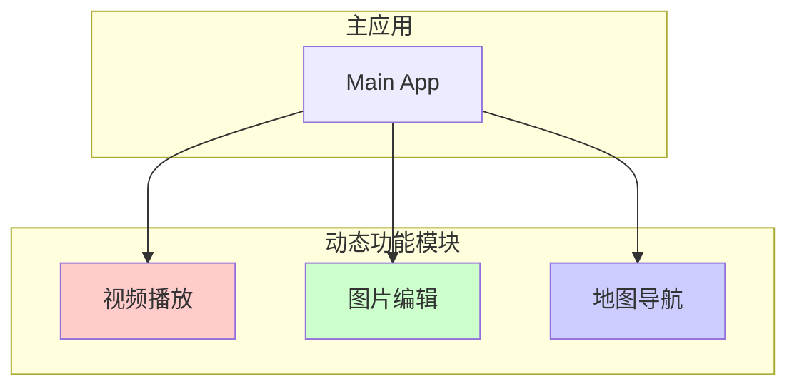
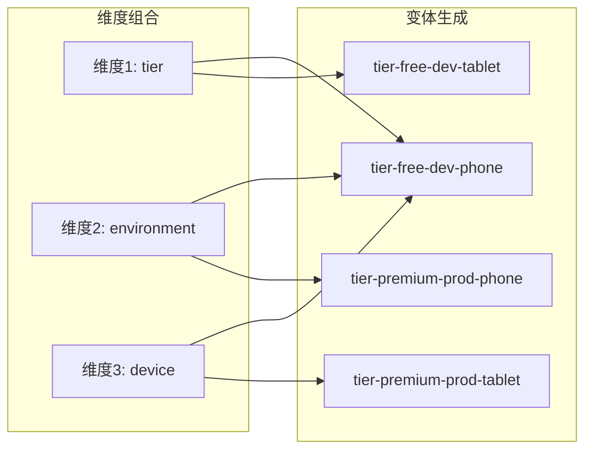
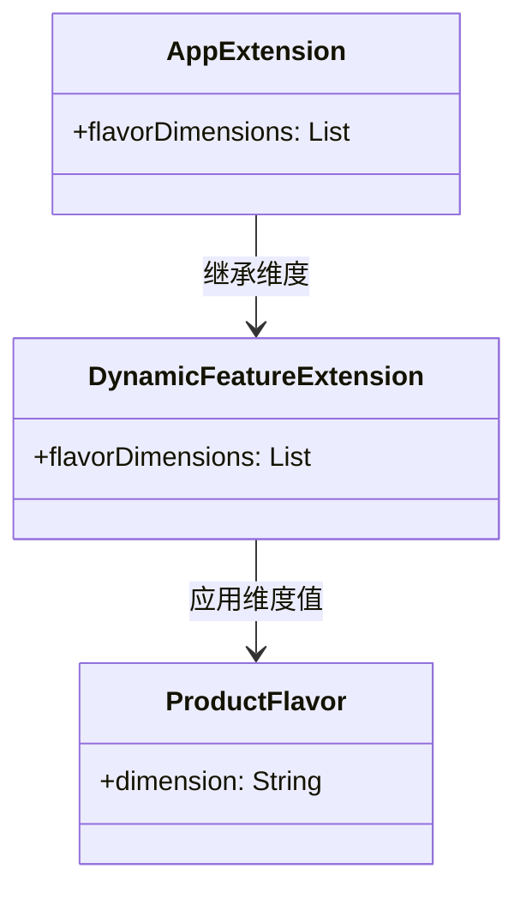

# 21.1.125 动态特征变体维度

清晨的阳光像金色的纱帘，从大树枝叶的缝隙中轻柔地洒下来。洛芙坐在一块光滑的石头上，手里捧着一杯还冒着热气的可可，眼睛却盯着黛琳面前铺开的笔记本电脑。

“昨天我们学会了给动态功能模块设置产品风味，”黛琳指着屏幕上的一段配置说，“但如果我想让不同的风味组合应用到动态功能上，应该怎么办？”

洛芙眨了眨眼：“产品风味本身就是维度吗？”

“不完全是，”黛琳微微一笑，“产品风味是维度的值。维度本身——也就是我们说的‘变体维度’——是更基础的东西。今天我们要学的DynamicFeatureVariantDimension，就是用来配置这些维度的。”

伊莎从帐篷里钻出来，手里拿着一把刚摘的野花，她把花放在鼻子下面轻轻嗅了嗅：“听起来像是给动态功能模块穿上不同风格的衣服之前，先要决定它有几层可以换装的空间？”

“有点接近了，”希尔已经打开了她的代码编辑器，“维度就是那几层可以换装的空间，每一层代表一个你可以自定义的方向——比如付费版本、免费版本，或者针对不同设备的版本。”

---

## 变体维度的本质

黛琳把笔记本转向大家，白板上的画面是一个三层的盒子，每一层都有不同的颜色标签。

“你们看，”她开始解释，“想象我们有一个动态功能模块，它负责处理视频播放。如果我们有‘environment’维度和‘level’维度，那么我们可以组合出四种变体——”

她在白板上画了一个表格：

```
┌─────────────┬─────────────┬─────────────────┐
│  维度       │   值        │   组合结果      │
├─────────────┼─────────────┼─────────────────┤
│ environment │ development │ video-dev      │
│ environment │ production  │ video-prod     │
│ level       │ basic        │ video-basic    │
│ level       │ premium     │ video-premium  │
└─────────────┴─────────────┴─────────────────┘
```

“但是，”黛琳故意停顿了一下，“如果我们没有先定义这些维度，这些组合就都不存在。DynamicFeatureVariantDimension就是用来声明——我们要用哪些维度来构建变体。”

洛芙皱起眉头：“所以我们得先说清楚要‘哪几层衣服’，然后才能给每件衣服设计不同的款式？”

“完全正确，”黛琳笑着点头，“这是理解变体维度最关键的一点。维度是抽象的概念定义，具体的产品风味是维度的值。”

---

## 在动态功能模块中配置维度

希尔把代码编辑器调整到全屏，她要演示如何在Gradle配置中使用DynamicFeatureVariantDimension。

```kotlin
// 在 dynamicFeature 模块的 build.gradle.kts 中

android {
    // 启用动态功能
    dynamicFeatures += ":video-player-feature"

    // 为主应用配置变体维度
    defaultConfig {
        // ...
    }

    // 定义变体维度
    flavorDimensions += "environment"
    flavorDimensions += "level"
}

// 为动态功能模块单独配置维度
android {
    // 针对特定动态功能模块的配置
    bundle {
        language {
            enableSplit = true
        }
        density {
            enableSplit = true
        }
        abi {
            enableSplit = true
        }
    }
}
```

希尔敲完这段代码，转向洛芙：“注意到没有？我们有两个地方可以配置维度——一个是在主应用的build.gradle中定义全局的flavorDimensions，另一个是在动态功能模块中独立配置它的打包策略。”

洛芙凑近屏幕看：“那个flavorDimensions加号后面的字符串，是随便起的名字吗？”

“不是随便的，”黛琳解释道，“维度的名字代表了它的用途和分组逻辑。通常我们会用有意义的名称，比如'region'、'version'、'tier'、'environment'。同一个维度在不同模块之间共享同名的话，它们就会被自动关联起来。”

---

## 维度与产品风味的协作

伊莎摘下一片草叶，在指尖轻轻转动：“我想到了一个比喻——”

她把草叶举到眼前，透过阳光看叶脉：“维度就像是不同的抽屉柜。每个抽屉柜有自己的名字，比如‘夏季衣物’、‘冬季衣物’。而产品风味呢，就是具体放进每个抽屉里的东西——T恤、短裤、羽绒服、棉袄。”

希尔立刻明白了：“所以DynamicFeatureVariantDimension就是决定——这个动态功能模块有几层抽屉，每层抽屉叫什么名字？”

“对，”伊莎点点头，“而DynamicFeatureProductFlavor——我们昨天学的——就是决定每个抽屉里放什么具体的衣服。”

洛芙两手一拍：“我懂了！维度是‘几层’，风味是‘每层装什么’。先有层，才能往里面装东西！”

黛琳露出赞许的微笑：“而且关键在于，动态功能模块的维度可以与主应用不同。你可以让主应用有三个维度（environment、tier、device），而视频播放动态功能只有两个维度（level、region）。这样可以简化某些不需要那么多变体的功能模块。”

---

## 变体维度的实际应用场景

希尔打开了一个新标签页，展示一个真实的项目结构。她移动鼠标指着屏幕上的模块图：



“这个项目有三个动态功能，”希尔解释道，“视频播放需要根据‘level’维度区分基础版和高级版；图片编辑需要根据‘region’区分不同地区的内容；地图导航需要根据‘device’区分手机和平板。”

她在编辑器中继续写配置：

```kotlin
// 主应用 build.gradle.kts
android {
    flavorDimensions += listOf("tier", "environment")
    
    productFlavors {
        create("free") {
            dimension = "tier"
            applicationIdSuffix = ".free"
        }
        create("premium") {
            dimension = "tier"
            applicationIdSuffix = ".premium"
        }
        create("dev") {
            dimension = "environment"
            applicationIdSuffix = ".dev"
        }
        create("prod") {
            dimension = "environment"
        }
    }
}

// 视频播放动态功能 build.gradle.kts
android {
    // 只继承 tier 维度
    flavorDimensions += "tier"
    
    productFlavors {
        create("free") {
            dimension = "tier"
        }
        create("premium") {
            dimension = "tier"
        }
    }
}
```

“你们看，”希尔指着代码解释，“视频播放模块只继承了主应用的‘tier’维度，所以它只有free和premium两种变体。它不关心dev还是prod，因为那个维度对视频功能来说没有意义。”

洛芙若有所思：“这样每个动态功能可以用自己需要的维度，不会被不需要的变体组合污染？”

“对，这就是变体维度分离的精髓，”黛琳补充道，“主应用定义的维度是全局的，但每个动态功能可以按需继承。这既保持了灵活性，又避免了不必要的构建复杂度。”

---

## 维度的优先级与组合逻辑

黛琳打开了一张图，展示了维度组合时的优先级规则：



“当有多个维度时，它们会交叉生成所有的可能组合，”黛琳用教鞭点点图中的连线，“三个维度就产生2×2×2等于8种变体。如果维度太多，构建时间会指数级增长。”

伊莎轻声说：“所以不能滥用维度，要像整理房间一样，只保留需要的抽屉？”

“Exactly（正是如此），”希尔打了个响指，“很多团队一开始设置了五六个维度，结果构建时间爆炸，后来不得不简化。通常两到三个维度就足够了。”

---

## 维度与构建类型的关系

洛芙举起手：“那build type呢？debug和release算不算维度？”

黛琳摇摇头：“build type不算维度，它是独立于维度之外的另一层变体。维度处理的是业务层面的差异（比如免费版还是付费版），build type处理的是技术层面的差异（比如调试版还是发布版）。”

她在白板上画了一个完整的变体矩阵：

```
                    Debug              Release
                ┌──────────┐        ┌──────────┐
free-dev      │ 变体1   │        │ 变体2   │
              └──────────┘        └──────────┘
                ┌──────────┐        ┌──────────┐
free-prod     │ 变体3   │        │ 变体4   │
              └──────────┘        └──────────┘
                ┌──────────┐        ┌──────────┐
premium-dev   │ 变体5   │        │ 变体6   │
              └──────────┘        └──────────┘
                ┌──────────┐        ┌──────────┐
premium-prod  │ 变体7   │        │ 变体8   │
              └──────────┘        └──────────┘
```

“维度乘积是横向的，build type是纵向的，”黛琳解释，“最终变体数量 = 维度1的值数 × 维度2的值数 × … × build type的数量。”

---

## 反模式：维度滥用与缺失

希尔突然表情严肃起来：“我要讲一个很多人会犯的错误——”

她在屏幕上展示了两种糟糕的配置：

**反模式一：维度缺失**

```kotlin
// 主应用
android {
    flavorDimensions += "tier"
    
    productFlavors {
        create("free") { dimension = "tier" }
        create("premium") { dimension = "tier" }
    }
}

// 动态功能
android {
    // ❌ 没有声明维度！
    // 这会导致动态功能无法应用主应用的风味
}
```

“这会导致什么问题？”希尔问。

洛芙想了想：“是不是动态功能只能看到主应用的整体构建结果，无法单独按风味区分？”

“对的，”希尔点头，“动态功能会使用主应用的默认变体，无法享受到针对不同风味的优化。更糟糕的是，某些需要特定风味资源的动态功能会找不到它们。”

**反模式二：维度冗余**

```kotlin
android {
    // ❌ 定义了太多无关维度
    flavorDimensions += listOf(
        "tier", 
        "environment", 
        "device", 
        "region", 
        "language",
        "screen"
    )
    
    // 产生 2×2×2×2×2×2 = 64 种变体！
    // 构建时间会非常长
}
```

黛琳补充：“另一个常见问题是混淆维度和维度值。维度是抽象的‘抽屉’，维度值是具体放进抽屉里的‘衣服’。很多人把维度名字起成具体的值，这会导致维护困难。”

**正确做法：**

```kotlin
android {
    // ✅ 定义清晰、有限的维度
    flavorDimensions += listOf("tier", "environment")
    
    productFlavors {
        // 维度名（tier）是抽象的
        // 风味名（free/premium）是具体的值
        create("free") {
            dimension = "tier"
            // free 就是 tier 维度的具体值
        }
        create("premium") {
            dimension = "tier"
        }
    }
}
```

---

## 动态功能中的维度继承

伊莎提出了一个问题：“如果主应用有三个维度，动态功能只继承两个，那缺少的那个维度会怎么样？”

这是个很好的问题。黛琳打开了一个测试项目来演示：

```kotlin
// 主应用 build.gradle.kts
android {
    flavorDimensions += listOf("tier", "environment", "device")
}

// 动态功能 build.gradle.kts
android {
    // 显式继承主应用的部分维度
    flavorDimensions += listOf("tier", "environment")
    // device 维度被忽略
    
    productFlavors {
        create("free") { dimension = "tier" }
        create("premium") { dimension = "tier" }
        
        create("dev") { dimension = "environment" }
        create("prod") { dimension = "environment" }
    }
}
```

“在构建时，”黛琳解释说，“动态功能的变体会自动过滤——只有它在flavorDimensions中声明的维度才会影响它的变体组合。device维度的值由主应用决定，但动态功能不会为此生成额外的变体。”

希尔补充了一个实际案例：“我们之前做一个大型App，地图功能是动态下载的。地图功能只需要按地区区分（region维度），不需要按付费等级区分（tier维度）。如果让地图功能也继承tier维度，就会产生不必要的变体组合，增加包体积。”

---

## 维度配置的最佳实践

黛琳把白板笔放下，总结道：“关于变体维度，有几个最佳实践需要记住：”

1. **维度数量控制在2-3个**：太多的维度会导致变体爆炸，增加构建时间和维护成本。

2. **维度命名要有意义**：使用描述性的名称，如"tier"（等级）、"region"（地区）、"environment"（环境），而不是"abc"或"option1"。

3. **动态功能按需继承**：不是所有动态功能都需要继承主应用的全部维度，只继承它需要的。

4. **避免维度值重复**：同一个维度下的不同风味值应该代表不同的产品方向，而不是仅仅为了生成更多变体。

5. **定期审查维度配置**：随着App功能演进，原来需要的维度可能变得不再必要，需要及时简化。

---

洛芙把这些要点记在了笔记本上。她抬起头，看到阳光已经完全升高，周围的树影开始移动。

“原来变体维度就像给不同的动态功能模块分配不同的抽屉柜，”洛芙总结道，“有的模块需要三层抽屉，有的只需要两层。既不能没有抽屉，也不能给每个模块都配上七层抽屉。”

黛琳微笑着点头：“这就是平衡的艺术。好啦，今天的内容就到这里。下午我们要不要去湖边走走？”

“好呀！”希尔立刻响应，“我刚好想试试用手机拍摄湖面的反光效果。上次学的CameraX还没实践过呢。”

伊莎整理了一下裙摆：“那我们现在把东西收好吧。黛琳，今天谢谢你的讲解，感觉清晰多了。”

四个女孩开始收拾东西，阳光透过树叶的缝隙，在草地上投下斑驳的光影。湖面上升起了细微的波纹，倒映着天空中的白云。这是一个美好的夏日早晨。

---

## 专业技术总结

### DynamicFeatureVariantDimension 定义

DynamicFeatureVariantDimension是Android Gradle DSL中的配置类，用于声明动态功能模块使用的变体维度。它定义了动态功能模块可以按哪些抽象方向（如tier、environment、region）进行变体分化，从而实现差异化的功能配置和资源优化。

#### 结构图



#### 复杂度与影响

- **构建复杂度**：每增加一个维度，变体数量呈指数增长（2^n）。建议最多3个维度。
- **包体积影响**：每个变体生成独立的APK或bundle，可能增加总包体积。
- **维护成本**：维度越多，测试用例越多，维护成本越高。

#### 反模式与陷阱

1. **维度缺失**：动态功能未声明维度，导致无法应用主应用的风味差异。修复：显式添加flavorDimensions声明。

2. **维度冗余**：定义了超过实际需要的维度，导致变体爆炸。修复：移除不需要的维度，定期审查。

3. **维度值冲突**：同一维度下不同风味值没有实际业务差异。修复：确保每个风味值对应不同的产品策略。

4. **混淆维度与风味**：将维度名起成具体值（如"freeTier"而非"tier"）。修复：维度名使用抽象命名，风味名使用具体值。

5. **动态功能与主应用维度不同步**：主应用添加新维度但动态功能未更新。修复：使用版本控制管理Gradle配置，确保同步更新。

#### 设计哲学

**维度分离原则**：动态功能模块应只继承需要的维度，而非全部继承。这体现了"单一职责"和"最小化依赖"的设计思想。

**按需变体原则**：变体的数量应服务于实际的业务需求，而非为了变体而变体。过度设计维度会导致构建和测试成本的增加。

**渐进式复杂度原则**：从2个维度开始，根据实际需要逐步增加，而非一次性设计复杂的维度体系。

#### 动手练习

**练习目标**：掌握DynamicFeatureVariantDimension的配置方法，能够为动态功能模块正确配置变体维度。

**目标**：为模拟的"图片编辑器"动态功能模块配置变体维度，理解维度继承机制。

**步骤**：

1. 在Android Studio中创建一个新的App项目（名为CampingPhotoEditor）
2. 在项目中添加一个动态功能模块（:photo-filter-feature）
3. 在主应用的build.gradle.kts中定义两个维度："tier"和"environment"
4. 为主应用配置4个产品风味（free/dev、free/prod、premium/dev、premium/prod）
5. 在photo-filter-feature模块中，只继承"tier"维度
6. 为动态功能配置2个风味（free、premium）
7. 执行./gradlew tasks查看生成的变体任务
8. 验证主应用有4个变体，动态功能只有2个变体

**验收标准**：

- [ ] 主应用有4个产品风味变体
- [ ] 动态功能模块只有2个风味变体（不包含environment维度）
- [ ] 执行构建命令验证变体任务存在
- [ ] 理解维度继承的工作机制

**提示代码**：

```kotlin
// 主应用 build.gradle.kts
android {
    flavorDimensions += listOf("tier", "environment")
    
    productFlavors {
        create("free") { dimension = "tier" }
        create("premium") { dimension = "tier" }
    }
}

// 动态功能 build.gradle.kts  
android {
    // 继承 tier 维度，忽略 environment
    flavorDimensions += "tier"
    
    productFlavors {
        create("free") { dimension = "tier" }
        create("premium") { dimension = "tier" }
    }
}
```

#### 参考实现要点

1. 维度命名应具有描述性，使用业务相关的术语（tier、region、environment）。
2. 动态功能模块应明确声明需要的维度，不继承无关维度。
3. 定期运行./gradlew dependencies分析依赖关系，确保维度配置合理。
4. 使用variantFilter在特定条件下禁用不需要的变体。
5. 维度的添加顺序会影响最终变体命名，建议按重要性排序。

---

> 学习建议：在实际项目中，建议从2个维度开始，逐步根据业务需求增加。每次添加新维度时，都要评估是否真的需要该维度产生的变体差异。动态功能的维度配置应独立于主应用，按需继承。

## 洛芙的小小日记本

今天学会了变体维度！黛琳说维度像是抽屉柜，风味像是抽屉里的具体东西。我们给动态功能分配需要的维度，不是越多越好。下午去湖边拍照片，用CameraX试试～

## 今日关键词

- **DynamicFeatureVariantDimension**：Android Gradle DSL类，用于声明动态功能模块的变体维度。
- **flavorDimensions**：Gradle配置属性，定义可用维度的列表。
- **ProductFlavor**：产品风味配置，代表维度的一个具体值。
- **Build Type**：构建类型（debug/release），独立于维度之外的变体层。
- **维度继承**：动态功能模块从主应用继承部分或全部维度的机制。
- **变体爆炸**：维度过多导致变体数量指数级增长的现象。
- **动态功能模块**：可按需下载的App模块，支持差异化配置。
- **维度分离原则**：动态功能只继承需要的维度的设计原则。