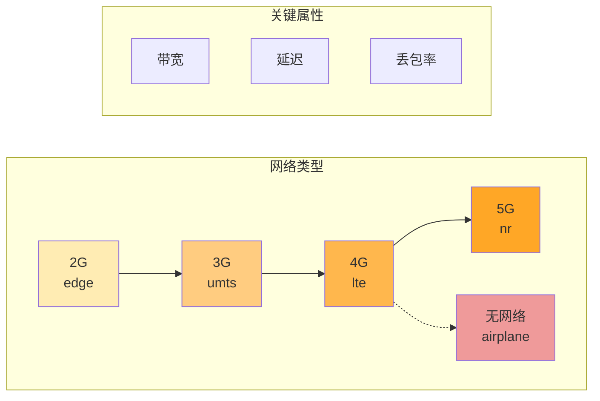
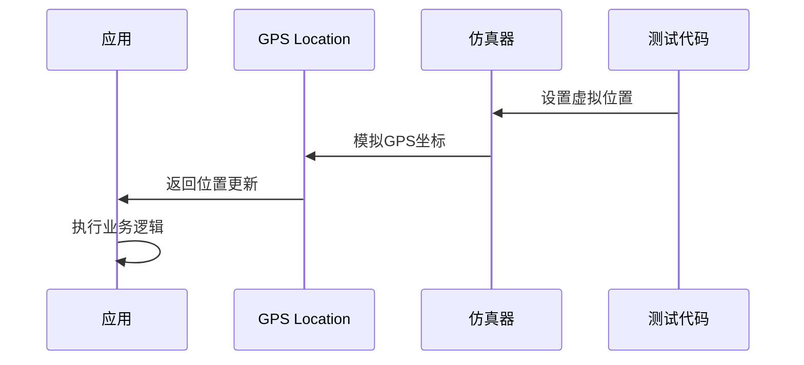
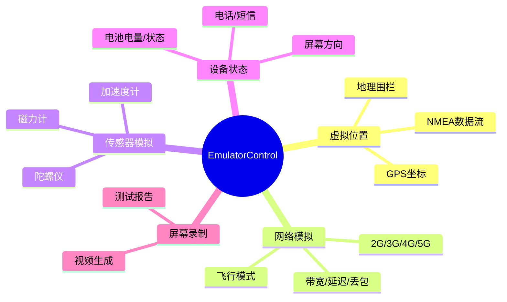

# 21.1.126 EmulatorControl

太阳已经爬到头顶，露营地笼罩在明晃晃的阳光里。洛芙摘下遮阳帽扇了扇风，额头上沁出细细的汗珠。湖面被照得闪闪发亮，像铺了一层碎金。

“昨天学的变体维度已经让我头晕了，”洛芙嘟囔着从背包里掏出一瓶冰水，“今天又要学什么？”

希尔正把笔记本架在一块平整的石头上，屏幕被太阳照得有些反光。她用手掌搭成凉棚罩在屏幕上：“今天这个很有趣——EmulatorControl，专门控制仿真器的。”

“仿真器？”洛芙眼睛一亮，“就是我们在电脑上运行的那个Android手机模拟器？”

“对，就是它，”黛琳从帐篷里钻出来，手里拿着一把便携小风扇，“不过今天我们不是学习怎么操作仿真器界面，而是学习怎么在Gradle构建时配置仿真器的行为。”

伊莎把野餐垫铺在大树下，找了个舒服的姿势坐下来：“听起来像是……给仿真器预设各种场景？比如让它以为自己在地铁里、或者信号不好？”

“差不多是这个意思！”希尔打了个响指，“EmulatorControl就是用来做这些的——虚拟传感器数据、网络模拟、屏幕录制……这些都是自动化测试里非常有用的功能。”

---

## 仿真器控制是什么

黛琳捡起一根树枝，在地面上画了一个简单的示意图。她画了一个手机形状的框，旁边写着各种功能标签。

“EmulatorControl是Android Gradle API中的一个DSL对象，”她解释道，“它允许你在构建配置中预设仿真器的各种状态。这样当你运行测试时，仿真器会自动处于你想要的配置下。”

洛芙凑过去看：“具体能控制哪些方面？”

“很多，”希尔调出笔记本电脑上的文档，“比如——虚拟的GPS位置、模拟的网络状况、虚拟传感器数据、电话状态、短信接收、屏幕录制……基本上你在仿真器上手动能做到的，都可以通过EmulatorControl自动化配置。”

她在白板上列了一个清单：

```
EmulatorControl 可配置的功能：
├── 虚拟位置（GPS）
├── 网络状况（2G/3G/4G/5G/无网络）
├── 虚拟传感器（加速度、陀螺仪等）
├── 电话状态（信号强度、运营商）
├── 短信接收
├── 屏幕旋转
├── 电池电量
└── 屏幕录制
```

“这些都是自动化测试的利器，”希尔补充道，“想象一下——你要测试应用在GPS信号弱的地方是否正常工作，难道要带着真手机去地下室？有了EmulatorControl，直接配置一个虚拟的弱GPS信号就可以了。”

---

## 基本配置语法

黛琳在地上画完了示意图，希尔开始演示具体的代码配置。她打开Android Studio的示例项目，指着build.gradle文件。

“在Android Test或Instrumented Test的配置中，你可以这样使用EmulatorControl，”她敲着键盘，“不过这个功能主要通过Gradle的任务参数来使用，而不是在build.gradle中直接写DSL。”

```kotlin
// androidTestOptions 是 TestOptions 的子节点
android {
    testOptions {
        unitTests {
            // 单元测试相关配置
            includeAndroidResources = true
        }
        
        // 关键：EmulatorControl 的使用方式
        // 通常通过命令行参数或 Gradle 任务属性配置
        // 而不是在 build.gradle 中直接 DSL 配置
    }
}

// 通过 adb 命令行配置仿真器
// 这些命令可以在运行测试前执行
tasks.withType<Test> {
    // 在测试前配置仿真器环境
    doFirst {
        // 设置虚拟位置为东京
        exec {
            workingDir = projectDir
            commandLine = 'adb', 'emulator', '-geo', '35.6762,139.6503'
        }
    }
}
```

洛芙歪着头看代码：“所以EmulatorControl不是直接写在Gradle文件里的？”

“严格来说，EmulatorControl这个DSL对象在最新的Gradle API中更像是一个概念，而不是一个具体的类，”黛琳解释道，“它的功能是通过多种方式实现的——命令行参数、Gradle任务属性、环境配置等。”

“那……为什么会有这个API呢？”洛芙不解。

“因为它定义了统一的配置接口，”希尔解释，“即使具体实现方式不同，概念上是统一的——你可以通过Gradle配置来控制仿真器的各种行为。”

---

## 虚拟传感器配置

伊莎从草地上摘了一朵野花，放在手指间转着玩。她突然开口：“你们说的虚拟传感器……是不是就像游戏手柄里的重力感应？”

“对！就是这个意思，”希尔点头，“很多应用依赖加速度计、陀螺仪这些传感器。如果你要测试这类应用，总不能每次都摇晃手机吧？”

她在代码编辑器里敲出一个示例：

```kotlin
// 通过 adb 命令模拟传感器数据
// 加速度计模拟
// 参数：x轴加速度, y轴加速度, z轴加速度（单位：m/s²）
adb shell sensors simulate acceleration \
    --accel-x 0.0 \
    --accel-y 0.0 \
    --accel-z 9.8

// 陀螺仪模拟
// 参数：x, y, z 轴旋转速度（单位：rad/s）
adb shell sensors simulate gyroscope \
    --gyro-x 0.0 \
    --gyro-y 0.0 \
    --gyro-z 0.01745329252

// 磁力计模拟
adb shell sensors simulate magnetometer \
    --mag-x -25.0 \
    --mag-y 10.0 \
    --mag-z 45.0
```

“这些都是直接在命令行执行的，”希尔说，“在真实的自动化测试中，你会把这些命令封装成一个Gradle任务或者测试fixture。”

洛芙看着这些命令：“感觉好像在给仿真器发号施令一样。”

“没错，”黛琳微笑，“这就是自动化的魅力——你不需要手动在仿真器上点来点去，一切都预先配置好，测试跑起来自动进入想要的场景。”

---

## 网络状况模拟

伊莎把转玩的野花插在头发上：“如果我想测试应用在网络不好的时候的行为，怎么办？”

“这就要用到网络状况模拟了，”希尔回答，“EmulatorControl的一个重要功能就是模拟各种网络环境。”

她在白板上画了一个网络类型的表格：



“在仿真器中，你可以模拟不同的网络环境，”希尔继续讲解，“从快速的5G到几乎没有网络，甚至可以设置具体的带宽、延迟和丢包率。”

```kotlin
// 通过 adb 命令模拟网络环境
// 设置为 2G 网络（edge）
adb shell netsim traffic edge

// 设置为 3G 网络
adb shell netsim traffic umts

// 设置为 4G 网络
adb shell netsim traffic lte

// 开启飞行模式
adb shell settings put global airplane_mode_on 1
adb shell am broadcast -a android.intent.action.AIRPLANE_MODE_CHANGED --ez state true

// 自定义网络条件
// 设置延迟 300ms，丢包率 5%
adb shell netsim traffic set --latency 300 --packet-loss 5
```

“这些命令在测试网络相关的应用时特别有用，”黛琳补充道，“比如你要测试应用在地铁里信号不好的情况下是否还能正常显示缓存内容，或者超时处理是否得当。”

洛芙若有所思：“那如果我想测试应用在5G下的表现，也可以模拟咯？”

“完全正确，”希尔笑着说，“甚至可以模拟网络从5G突然掉到无网络的场景，测试应用的恢复能力。”

---

## 位置模拟与地理围栏测试

洛芙突然举手：“我知道一个很实用的场景！如果有应用需要根据用户位置显示不同内容，怎么测试？”

“问得好，”黛琳点头，“位置模拟是EmulatorControl最常用的功能之一。”

她在白板上画了一个地图示意图：



“当你设置虚拟位置后，应用的Location Manager会收到你设定的坐标，就像真的一样，”黛琳解释，“你可以测试各种位置相关的场景——从东京到纽约，从室内到室外。”

```kotlin
// 位置模拟示例
// 设置当前位置为东京塔
adb shell geo fix 139.745433 35.658580

// 或使用更精确的 GPS 坐标（经度、纬度、海拔）
adb emu geo fix 139.745433 35.658580 0

// 模拟 NMEA GPS 数据流（更高级）
adb shell geo nmea $GPGGA,123519,4807.038,N,01131.000,E,1,08,0.9,545.4,M,47.0,M,,*47

// 地理围栏测试 - 预设多个位置点
val fenceLocations = listOf(
    Location("Tokyo Tower").apply {
        latitude = 35.658580
        longitude = 139.745433
    },
    Location("Shibuya").apply {
        latitude = 35.659493
        longitude = 139.700409
    },
    Location("Shinjuku").apply {
        latitude = 35.689487
        longitude = 139.691711
    }
)

// 测试进入地理围栏时的行为
@Test
fun testGeofenceEnter() {
    // 设置第一个位置（东京塔）
    setEmulatorLocation(35.658580, 139.745433)
    
    // 等待位置更新
    Thread.sleep(1000)
    
    // 移动到涩谷（触发围栏）
    setEmulatorLocation(35.659493, 139.700409)
    
    // 验证地理围栏回调被触发
    verify(geofenceCallback).onEnterFence(any())
}
```

洛芙看着代码感叹：“这样就可以测试应用在世界各地的表现了！甚至可以模拟用户坐新干线从东京到大阪，测试位置更新的连续性。”

“没错，”希尔说，“这就是自动化的力量——你不需要真的带着手机坐新干线。”

---

## 屏幕录制与自动化测试

伊莎一直安静地听着，这时突然插话：“之前说的屏幕录制……是做什么用的？”

“屏幕录制在测试中有两个主要用途，”希尔解释，“一是生成测试报告的视觉证据，二是录制回归测试的对比视频。”

```kotlin
// 屏幕录制配置
// 开始录制
adb shell screenrecord /sdcard/test_recording.mp4

// 指定录制参数
// --size: 分辨率
// --bit-rate: 比特率
// --time-limit: 时长限制（秒）
adb shell screenrecord --size 720x1280 --bit-rate 6000000 --time-limit 30 /sdcard/test_video.mp4

// 录制完成后拉取文件
adb pull /sdcard/test_video.mp4 ./test-results/

// 在测试框架中使用（Espresso 示例）
@Test
fun testRecording() {
    // 开始录制
    startScreenRecording()
    
    // 执行测试操作
    onView(withId(R.id.submit_button)).perform(click())
    
    // 等待动画完成
    Thread.sleep(500)
    
    // 停止录制并保存
    stopScreenRecording("test_submit_flow.mp4")
    
    // 验证视频文件存在
    assert(videoFile.exists())
}
```

“有些团队会把每次失败的测试自动录制下来，”黛琳补充道，“这样开发人员可以直接看到测试失败时的界面，不需要自己手动复现。”

洛芙想象了一下：“就像录屏一样……那不是可以做出很酷的测试报告？”

“确实可以，”希尔笑着说，“很多CI/CD流水线现在都会自动生成测试报告视频。”

---

## 反模式：过度依赖仿真器配置

黛琳突然严肃起来：“不过我要提醒一个常见的反模式——过度依赖仿真器配置。”

她在白板上写了两个对比：

```kotlin
// ❌ 反模式：把测试写成"仿真器表演"
@Test
fun testLocationBasedFeature() {
    // 设置复杂的位置序列
    setEmulatorLocation(35.658580, 139.745433)
    Thread.sleep(2000)
    setEmulatorLocation(35.659493, 139.700409)
    Thread.sleep(2000)
    setEmulatorLocation(35.689487, 139.691711)
    Thread.sleep(2000)
    
    // 验证结果
    verify(viewModel).updateLocation(any())
    // 问题：这种测试在真机上可能完全失败
}

// ✅ 正确方式：使用 Mock 或 Fake
@Test
fun testLocationBasedFeature() {
    // 使用 FakeLocationProvider 替代真实位置
    val fakeLocationProvider = FakeLocationProvider()
    locationManager.addProvider(fakeLocationProvider)
    
    // 注入测试位置
    fakeLocationProvider.setLocation(testLocation)
    
    // 验证业务逻辑
    verify(viewModel).updateLocation(testLocation)
    // 优点：不依赖仿真器，真机也能跑
}
```

“为什么仿真器测试会有问题？”洛芙问。

“仿真器的行为和真机不完全一致，”黛琳解释，“传感器精度、GPS响应时间、电池管理……这些在仿真器和真机上可能有差异。过度依赖仿真器配置的测试，在真机上可能失败。”

希尔补充：“最佳实践是——用Mock/Fake对象测试核心逻辑，只在必要的集成测试中使用仿真器配置。”

---

## 综合配置示例

最后，希尔展示了一个综合的配置示例，把各种EmulatorControl功能组合在一起：

```kotlin
// 在 build.gradle.kts 中配置测试环境
android {
    testOptions {
        unitTests {
            includeAndroidResources = true
        }
    }
}

// 创建一个辅助任务来配置仿真器
tasks.register<Exec>("configureEmulatorForTest") {
    group = "verification"
    description = "Configure emulator with test scenarios"
    
    // 1. 设置虚拟位置
    doFirst {
        exec {
            commandLine("adb", "shell", "geo", "fix", "35.658580", "139.745433")
        }
    }
    
    // 2. 设置网络环境
    doFirst {
        exec {
            commandLine("adb", "shell", "netsim", "traffic", "lte")
        }
    }
    
    // 3. 设置电池状态
    doFirst {
        exec {
            commandLine("adb", "shell", "battery", "set", "status", "charging")
            exec {
                commandLine("adb", "shell", "battery", "set", "level", "80")
            }
        }
    }
}

// 让测试任务依赖配置任务
tasks.withType<Test> {
    dependsOn("configureEmulatorForTest")
    
    // 测试完成后清理
    doLast {
        exec {
            commandLine("adb", "shell", "settings", "put", "global", "airplane_mode_on", "0")
        }
    }
}
```

“这样的配置确保每次测试都在一个确定的环境中运行，”希尔解释，“位置、网络、电池状态都是预设的，测试结果更可靠。”

洛芙伸了个懒腰：“今天学的太多了……仿真器原来可以这么强大！”

“它是我们测试的得力助手，”黛琳笑着说，“但记住——仿真器是辅助，真机测试才是最终验证。”

---

## 专业技术总结

> **EmulatorControl** — Android Gradle 构建系统中用于配置 Android 仿真器行为的 API 集合，通过命令行参数和 Gradle 任务属性实现虚拟传感器、网络状况、地理位置、屏幕录制等功能的自动化控制，是 Android 自动化测试的重要基础设施。

---

#### 结构图



#### 复杂度与影响

| 功能 | 配置复杂度 | 测试价值 | 建议 |
|------|-----------|---------|------|
| 虚拟位置 | 低 | 高 | 常规使用 |
| 网络模拟 | 中 | 高 | 集成测试必用 |
| 传感器 | 中 | 中 | 按需使用 |
| 屏幕录制 | 低 | 中 | 调试用 |

#### 反模式与陷阱

1. **过度依赖仿真器配置** — 核心逻辑应使用 Mock/Fake 测试，仿真器仅用于集成验证
2. **忽视真机差异** — 仿真器行为与真机存在差异，主要功能必须真机测试
3. **配置未清理** — 测试后未恢复仿真器状态，影响后续测试

#### 设计哲学

EmulatorControl 的设计体现了以下工程思想：

1. **环境即代码** — 仿真器配置作为构建的一部分，版本控制可追溯
2. **可重复性** — 相同的配置确保测试结果可重复
3. **测试隔离** — 每个测试前配置独立环境，避免相互影响
4. **按需模拟** — 只模拟测试所需的特性，不过度配置

#### 🏕️ 动手练习

**目标**：掌握 Android 仿真器的基本配置，能够编写自动化测试环境设置脚本。

**Task 1：基础位置模拟**

1. 启动 Android 仿真器
2. 使用 adb 命令设置虚拟位置为任意城市坐标
3. 验证位置生效（打开 Google Maps 或使用获取位置的测试 App）

**Task 2：网络环境切换**

1. 使用 netsim 命令将仿真器网络切换为 2G
2. 运行一个需要网络的应用，观察行为
3. 切换回 4G/5G，观察恢复

**Task 3：自动化测试脚本**

1. 编写一个 Gradle task，在运行测试前自动配置仿真器
2. 包括：设置位置 + 设置网络 + 设置电池
3. 测试完成后自动恢复默认状态

**验收标准**：
- [ ] Task 1：位置成功设置并生效
- [ ] Task 2：网络切换成功，应用行为符合预期
- [ ] Task 3：脚本可执行，测试在预设环境中运行

**提示代码**：

```kotlin
// Task 3 提示
tasks.register<Exec>("setupTestEnvironment") {
    commandLine("adb", "shell", "geo", "fix", "35.658580", "139.745433")
}
```

---

#### 参考实现要点

1. 优先使用 Mock/Fake 替代仿真器配置测试核心逻辑
2. 仿真器配置仅用于集成测试和端到端测试
3. 测试前后显式管理仿真器状态，避免测试间污染
4. 将常用配置封装为 Gradle 任务或 shell 脚本，提高复用性
5. CI/CD 流水线中确保仿真器配置与真机测试结果一致

---

> 技术知识需要在实践中巩固。多尝试不同的仿真器配置组合，找到最适合你项目测试需求的方案。

## 🍹洛芙的小小日记本

今天学到了EmulatorControl！原来在电脑上运行的仿真器可以这么智能——模拟GPS、切换网络、虚拟传感器……希尔说这是自动化测试的神器。不过黛琳提醒我，仿真器终究是仿真器，核心逻辑还是要用Mock来测，不能太依赖它。回去要把这些命令整理成脚本，下次测试就不用手忙脚乱了！

---

#### 今日关键词

- **EmulatorControl**：Android Gradle API 中用于配置仿真器行为的 DSL 概念集合
- **虚拟传感器**：通过软件模拟的设备传感器数据，如加速度计、陀螺仪
- **网络模拟**：仿真器中模拟不同网络环境（2G/3G/4G/5G/无网络）的功能
- **位置模拟**：通过 adb 命令或代码预设仿真器的 GPS 坐标
- **地理围栏**：基于位置的触发区域，进入或离开时触发特定动作
- **屏幕录制**：录制仿真器画面的功能，用于测试报告和调试
- **自动化测试环境**：预先配置好的测试所需的环境状态
- **Mock/Fake**：测试中用于替代真实依赖的模拟对象
- **集成测试**：在真实或模拟环境中测试多个组件协同工作的测试
- **CI/CD 流水线**：持续集成/持续部署的自动化流程
