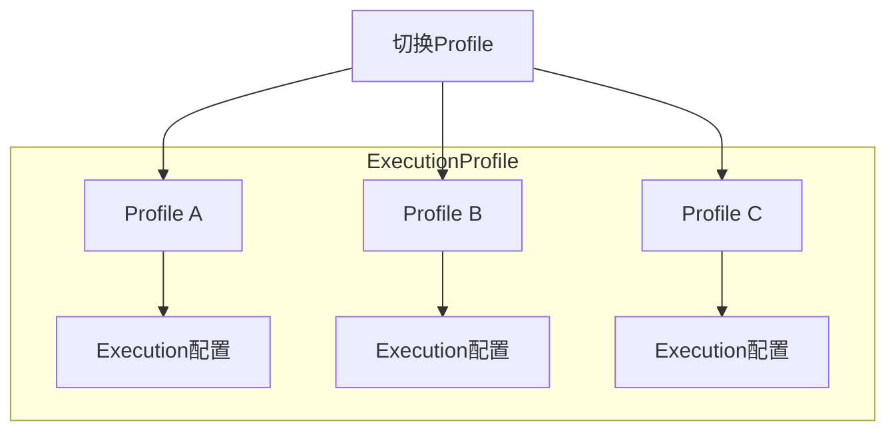
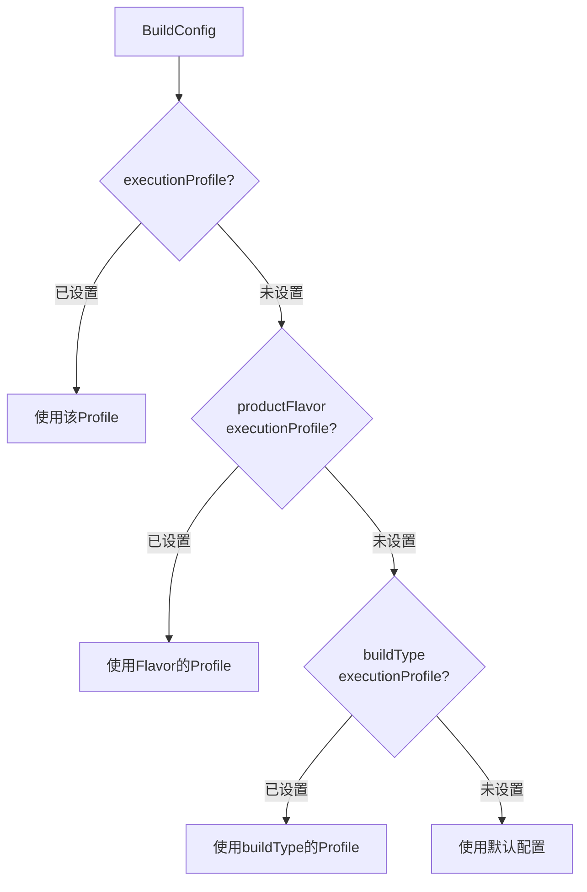

# 执行配置文件

午后的阳光依旧热烈，但相比正午的刺眼，此刻的光线变得更为明亮而通透。洛芙一行人并没有立即回帐篷，而是继续围坐在大树下，享受着饱餐一顿后的慵懒时光。

黛琳从背包里取出那枚已经有些历史的U盘，在指尖轻轻转了转：“昨天我们学了Execution——怎么执行构建任务。今天来看它的'兄弟'——ExecutionProfile。”

“执行……配置文件？”洛芙把这个名字在嘴里念了一遍，“听起来像是把之前的配置保存起来？”

“差不多是这个意思。”黛琳微笑着点头，“不过比你想象的更灵活。先想想你手机里的场景——”

“我知道！”希尔抢着说，“就是省电模式和性能模式的区别嘛！省电模式会限制CPU频率、降低亮度，性能模式则放开手脚让手机跑满血。”

“Exactly。”黛琳打了个响指，“ExecutionProfile也是这个思路。你可以为不同的使用场景预设不同的执行策略，然后根据当前需求切换使用。”

伊莎好奇地问：“那……它和Execution是什么关系？”

“Execution是具体的'怎么做'，Profile是'用哪套怎么做'。”黛琳在草地上捡起一根树枝，在湿润的地面上画了起来。她先画了一个小圆圈代表Execution，然后在旁边画了一个更大的圆圈把Execution包进去。



“Execution是具体的参数集合，而Profile是一个容器，可以装进去一套完整的Execution配置。”黛琳解释道，“你可以创建多个Profile，然后告诉构建系统：现在用Profile A，下次用Profile B。”

洛芙似懂非懂地点点头：“那……具体怎么用呢？”

“这就要从Gradle DSL说起了。”黛琳把树枝扔到一边，拍了拍手上的泥土，“在AGP 9.0里，ExecutionProfile是通过android.executionProfiles这个块来配置的。看——”

她打开笔记本，屏幕上出现了一段代码：

```kotlin
android {
    // 定义执行配置文件
    executionProfiles {
        // 性能模式 - 全力构建
        performance {
            // 并行构建，最大化资源使用
            maxWorkers = Runtime.getRuntime().availableProcessors()
            
            // 启用构建缓存
            enableBuildCache = true
            
            // 启用并行执行
            parallel = true
            
            // 编译器优化
            compilerOptions {
                // Kotlin编译器优化
                kotlinOptions {
                    allWarningsAsErrors = false
                    optimize = true
                }
            }
        }
        
        // 省电模式 - 资源受限
        powerSaving {
            // 减少并行度
            maxWorkers = 2
            
            // 禁用构建缓存（节省磁盘IO）
            enableBuildCache = false
            
            // 禁用并行执行
            parallel = false
            
            // 降低编译优化以加快编译速度
            compilerOptions {
                kotlinOptions {
                    allWarningsAsErrors = false
                    optimize = false
                }
            }
        }
        
        // CI模式 - 针对持续集成环境优化
        ci {
            maxWorkers = 4
            enableBuildCache = true
            parallel = true
            
            // CI环境通常不需要增量构建的优化
            // 每次都做完整构建以确保干净
        }
    }
}
```

洛芙眼睛瞪得大大的：“这些配置……看起来比之前的Execution要宏观得多？”

“对。”希尔插话道，“ExecutionProfile控制的是整个构建过程的宏观行为——用多少线程、要不要缓存、要不要并行。而Execution控制的是具体的编译参数——用什么flag、加什么define。”

黛琳补充道：“而且Profile可以继承。这才是它真正强大的地方。”

“继承？”伊莎眨眨眼。

“就像类可以继承一样，Profile也可以基于另一个Profile来创建。”黛琳重新打开笔记本，“比如这样——”

```kotlin
executionProfiles {
    // 基础配置 - 所有的Profile都继承这个
    base {
        maxWorkers = 2
        enableBuildCache = true
    }
    
    // 继承base，并覆盖一些设置
    debug {
        // 继承自base的所有配置
        inheritsFrom = 'base'
        
        // debug模式需要快速编译，所以禁用一些优化
        compilerOptions {
            kotlinOptions {
                optimize = false
            }
        }
    }
    
    // 另一个继承示例
    release {
        inheritsFrom = 'base'
        
        // release模式需要最大化性能
        maxWorkers = Runtime.getRuntime().availableProcessors()
        parallel = true
        
        compilerOptions {
            kotlinOptions {
                optimize = true
                allWarningsAsErrors = true
            }
        }
    }
}
```

洛芙若有所思：“这……好像面向对象编程啊。”

“没错。”黛琳露出赞许的微笑，“Gradle的DSL本身就是基于Groovy的，而Groovy原生支持面向对象。所以Profile的继承机制和OOP里的类继承是一个道理——子类可以继承父类的属性，也可以覆盖或扩展它们。”

伊莎轻声说：“那……实际开发中，这个功能有什么用呢？”

“用处大了。”希尔掰着手指数起来，“你想——开发的时候，你需要一个快速编译的Profile；测试的时候，你需要一个能复现问题的Profile；发布的时候，你需要一个最优化的Profile。有了ExecutionProfile，你只需要切换一行配置，就能切换整个构建策略。”

她顿了顿，又补充道：“而且团队里每个人的电脑配置不一样。性能好的用performanceProfile，配置低的用powerSavingProfile，大家都能高效工作。”

洛芙兴奋地说：“那……我们可以试试吗？”

“当然可以。”黛琳把笔记本转过来，“不过在真机上试之前，我先给你展示一个更实际的例子——如何在不同buildVariant中激活不同的Profile。”

```kotlin
android {
    executionProfiles {
        // 开发环境 - 快速编译优先
        dev {
            maxWorkers = 2
            enableBuildCache = true
            parallel = true
        }
        
        // 测试环境 - 需要完整且可复现的构建
        test {
            maxWorkers = 4
            enableBuildCache = true
            parallel = false  // 测试时通常禁用并行，保证构建可复现
        }
        
        // 生产环境 - 最优性能
        prod {
            maxWorkers = Runtime.getRuntime().availableProcessors()
            enableBuildCache = true
            parallel = true
        }
    }
    
    buildTypes {
        debug {
            // debug构建使用dev Profile
            executionProfile = 'dev'
        }
        
        release {
            // release构建使用prod Profile
            executionProfile = 'prod'
        }
    }
    
    flavorDimensions += "environment"
    
    productFlavors {
        create("dev") {
            dimension = "environment"
            // 开发版本使用dev Profile
            executionProfile = 'dev'
        }
        
        create("staging") {
            dimension = "environment"
            // 测试版本使用test Profile
            executionProfile = 'test'
        }
        
        create("prod") {
            dimension = "environment"
            // 生产版本使用prod Profile
            executionProfile = 'prod'
        }
    }
}
```

洛芙认真地看着代码：“所以……executionProfile这个属性就是用来指定使用哪个Profile的？”

“对。”黛琳点头，“你可以直接在buildType或productFlavor里设置executionProfile属性，构建系统会自动应用对应的配置。”

希尔补充道：“而且还有一个更灵活的用法——可以通过命令行参数动态切换Profile。”

她快速敲了一段代码：

```kotlin
// 在build.gradle中读取命令行参数
def profileName = project.hasProperty('executionProfile') 
    ? project.property('executionProfile') 
    : 'dev'

android {
    executionProfiles {
        dev { /* ... */ }
        test { /* ... */ }
        prod { /* ... */ }
    }
    
    // 动态应用Profile
    defaultConfig {
        // 可以根据命令行参数调整配置
        if (profileName == 'prod') {
            // 生产环境特有的配置
        }
    }
}
```

“现在你可以在命令行这么用——”希尔抬起头，“`./gradlew assembleDebug -PexecutionProfile=prod`，这样即使debug构建也会使用prod的Profile配置。”

洛芙惊叹道：“这也太灵活了吧！那……如果我同时设置了buildType和productFlavor的executionProfile，会发生什么？”

“好问题。”黛琳走到白板前，画了一个简单的优先级图：



“优先级是这样的——buildConfig中显式设置的executionProfile优先级最高，其次是productFlavor，再次是buildType，都没有的话就使用默认配置。”

伊莎轻轻“哇”了一声：“这听起来……有点像CSS的层叠规则？”

“没错，就是层叠（Cascading）的思想。”黛琳点头，“这也是为什么叫'Profile'而不是单纯的'Config'——它继承了这种层叠的特性。”

洛芙好奇地问：“那……如果我想在代码里读取当前激活的Profile，该怎么做？”

“这个也很简单。”希尔又敲了一段代码：

```kotlin
// 在Gradle任务中获取当前Profile
tasks.withType<com.android.build.gradle.internal.tasks.AndroidBuildTask>().configureEach {
    doFirst {
        val profile = project.extensions.findByType<com.android.build.gradle.BaseExtension>()
            ?.executionProfiles
            ?.find { it.name == project.property("executionProfile") }
        
        logger.lifecycle("当前使用的ExecutionProfile: ${profile?.name}")
        profile?.let {
            logger.lifecycle("  - maxWorkers: ${it.maxWorkers}")
            logger.lifecycle("  - enableBuildCache: ${it.enableBuildCache}")
            logger.lifecycle("  - parallel: ${it.parallel}")
        }
    }
}
```

洛芙看着这段代码，有些似懂非懂：“这……看起来好复杂。”

“对于初学者来说，暂时不需要自己写这种任务。”黛琳安慰道，“你只需要知道Profile是可以被读取和使用的就够了。真正开发中，大部分时候你只需要在buildType或Flavor里设置executionProfile属性，其他的系统会自动帮你处理。”

伊莎抬头看了看天空：“那……Profile有没有什么最佳实践之类的？”

“有几个常见的反模式值得注意。”黛琳重新回到笔记本前，“第一个就是——”

她在屏幕上打出了“反模式”三个大字，然后列出了一个常见的错误配置：

```kotlin
// ❌ 反模式：为每个buildVariant都写一个完全独立的Profile
executionProfiles {
    debugDev {
        maxWorkers = 2
        enableBuildCache = true
        parallel = true
    }
    
    debugStaging {
        maxWorkers = 2
        enableBuildCache = true
        parallel = true
    }
    
    debugProd {
        maxWorkers = 2
        enableBuildCache = true
        parallel = true
    }
    
    // ... 然后为release也写一套
    releaseDev { /* ... */ }
    releaseStaging { /* ... */ }
    releaseProd { /* ... */ }
}
```

“这有什么问题？”洛芙歪着头问。

“配置重复。”希尔抢答，“你看看debugDev、debugStaging、debugProd——它们的核心配置是不是一样的？都是maxWorkers=2、enableBuildCache=true、parallel=true。唯一的区别可能就是applicationIdSuffix之类的，但这些不应该在Profile里处理。”

伊莎问：“那……正确的做法是？”

“用继承。”黛琳把重构后的代码展示出来：

```kotlin
// ✅ 正确做法：用继承避免重复
executionProfiles {
    // 基础Profile
    base {
        maxWorkers = 2
        enableBuildCache = true
    }
    
    // debug系列继承base
    debug {
        inheritsFrom = 'base'
        parallel = true
    }
    
    // release系列继承base
    release {
        inheritsFrom = 'base'
        maxWorkers = Runtime.getRuntime().availableProcessors()
        parallel = true
    }
}

// 然后在buildType里引用
buildTypes {
    debug {
        executionProfile = 'debug'
    }
    release {
        executionProfile = 'release'
    }
}
```

洛芙点点头：“这样清晰多了！第二个反模式呢？”

“第二个是——Profile配置与实际需求不匹配。”

黛琳又列出一个例子：

```kotlin
// ❌ 反模式：在CI环境使用省电Profile
executionProfiles {
    ci {
        maxWorkers = 1          // CI机器通常很强大，这里浪费了
        enableBuildCache = false // CI通常需要缓存加速重复构建
        parallel = false        // CI环境应该并行构建
    }
}
```

“很多团队会在CI服务器上使用'省电'配置，觉得省资源。但实际上CI环境通常需要尽可能快地完成构建，所以反而应该用'性能'配置。”

希尔补充道：“还有一个常见的误区是——在debug构建时禁用所有优化，只追求速度。但这有时候会掩盖问题——比如有些性能问题只在优化开启时才会出现。”

她列出了一个更好的实践：

```kotlin
// ✅ 推荐：debug也保持合理的优化级别
executionProfiles {
    debug {
        // debug也需要并行构建，否则太慢
        parallel = true
        
        // 但可以禁用一些耗时的优化
        compilerOptions {
            kotlinOptions {
                // XXXXXX 警告当作错误在debug时关闭，否则影响开发体验
                allWarningsAsErrors = false
            }
        }
    }
    
    release {
        // release开启完整优化
        parallel = true
        maxWorkers = Runtime.getRuntime().availableProcessors()
        
        compilerOptions {
            kotlinOptions {
                allWarningsAsErrors = true
                optimize = true
            }
        }
    }
}
```

洛芙把这些都记录下来：“我还有最后一个问题——Profile可以在模块级别设置吗？”

“可以，而且这是第三个最佳实践。”黛琳点头，“多模块项目中，不同模块可以有自己独立的Profile配置。比如——”

```kotlin
// 在app/build.gradle中
android {
    executionProfiles {
        appPerformance {
            maxWorkers = 4
            // 针对app模块的特殊配置
        }
    }
}

// 在library/build.gradle中  
android {
    executionProfiles {
        libPerformance {
            maxWorkers = 2
            // 库模块通常编译更快，不需要那么多worker
        }
    }
}
```

黛琳补充道：“而且模块级别的Profile优先级更高，会覆盖项目级别的Profile。这让你可以为不同模块精细调控构建策略。”

伊莎伸了个懒腰：“说了这么多……我们能不能实际试试？”

“当然。”希尔把笔记本转向大家，“不过在真机上试之前，我先给你看一个更直观的东西——Profile切换对构建时间的影响。”

她在命令行里输入了一串命令：

```bash
# 使用powerSaving Profile构建
./gradlew assembleDebug -PexecutionProfile=powerSaving
# 输出示例：
# BUILD SUCCESSFUL in 3m 24s

# 使用performance Profile构建
./gradlew assembleDebug -PexecutionProfile=performance  
# 输出示例：
# BUILD SUCCESSFUL in 1m 48s
```

“看，同样一个项目，用performance比用powerSaving快了将近一半。”希尔说，“当然，具体差异取决于你的电脑配置和项目复杂度。”

洛芙惊叹道：“快这么多！那开发的时候一直用performance不就行了？”

“也不是一直都行。”黛琳解释道，“performance模式会占用大量系统资源——CPU跑满、内存吃紧。如果你的电脑同时还要跑其他服务，或者要同时开模拟器开发，那就可能会卡顿。”

“所以最佳实践是——开发时用dev Profile（中等性能），发布时用prod Profile（最高性能）。”希尔总结道，“或者用命令行参数动态切换。”

洛芙把这些要点都记录下来：

```
ExecutionProfile
├─ 定义：预设的构建执行策略容器
├─ 核心属性：maxWorkers / enableBuildCache / parallel
├─ 继承机制：inheritsFrom 实现配置复用
├─ 激活方式：buildType.executionProfile / productFlavor.executionProfile
├─ 命令行切换：-PexecutionProfile=<name>
└─ 最佳实践：开发用dev，发布用prod，CI用CI专用配置
```

收好笔记本，洛芙抬头看向湖面。下午的阳光开始变得柔和，不再那么炙热烤人。湖面上波光粼粼，远处的山峦还笼罩在一层薄薄的雾霭中。

“今天学完了吧？”伊莎轻声问。

黛琳点点头：“Execution和ExecutionProfile——一个管具体怎么执行，一个管用哪套配置执行。两者配合，就能精细控制整个构建过程。”

洛芙伸了个懒腰，感受着午后微风的轻抚：“原来构建也有这么多门道……我还以为就是点个按钮的事呢。”

“点按钮是结果，过程才是门道。”黛琳笑着说，“而且这些只是Gradle DSL的冰山一角。等你们以后深入了，还有更多可以探索的。”

希尔已经开始收拾笔记本：“明天我们干什么？”

“明天啊……”黛琳想了想，“来点更实际的——我们来讲讲持续集成和自动化构建。”

洛芙好奇地问：“就是那个CI/CD？”

“对，就是它。”黛琳把背包拉链拉好，“你们不是一直想知道，怎么让代码自动跑测试、自动打包吗？”

“那今天早点休息，明天早点起来！”希尔兴奋地说。

四人收拾好东西，准备回帐篷休息。傍晚的阳光把她们的影子拉得很长，湖面上倒映着渐渐西斜的太阳，一切都显得那么宁静而美好。

---

> **学习建议**
> 
> ExecutionProfile是Android Gradle Plugin中管理构建策略的核心DSL。建议从自己项目中的buildType入手，先尝试为debug和release分别设置不同的Profile，观察构建时间的变化。重点关注maxWorkers和parallel这两个属性的效果——它们对构建性能的影响最直观。记住：开发阶段优先考虑编译速度，发布阶段优先考虑优化程度。

## 洛芙的小小日记本

今天学会了ExecutionProfile！原来构建也可以像手机一样切换「省电模式」和「性能模式」。黛琳说Profile可以继承，这样就不需要为每个buildVariant都写一遍配置。最好的实践是开发时用dev Profile（中等性能，省资源），发布时用prod Profile（最高性能）。而且还能通过命令行参数 -PexecutionProfile=dynamic 动态切换，真是太灵活了！明天好像要学CI/CD，期待！

---

## 今日关键词

**ExecutionProfile** — Android Gradle Plugin中用于预设和切换构建执行策略的DSL，可以定义多套配置并在不同场景下切换使用。

**Profile继承** — ExecutionProfile可以通过inheritsFrom属性继承另一个Profile的配置，实现配置复用和层叠。

**maxWorkers** — ExecutionProfile属性，指定构建过程使用的最大工作线程数。

**enableBuildCache** — ExecutionProfile属性，控制是否启用Gradle构建缓存。

**parallel** — ExecutionProfile属性，控制是否启用并行构建。

**buildType** — Android构建类型，通常指debug、release等。

**productFlavors** — Android产品风味，用于创建同一应用的不同版本（如免费版/付费版）。

**CI（持续集成）** — 一种软件开发实践，代码提交后自动进行构建和测试。

**命令行参数** — Gradle可以通过-P参数接收自定义属性，如-PexecutionProfile=xxx。

**Gradle DSL** — Gradle的领域特定语言，用于在build.gradle中声明式配置构建逻辑。
