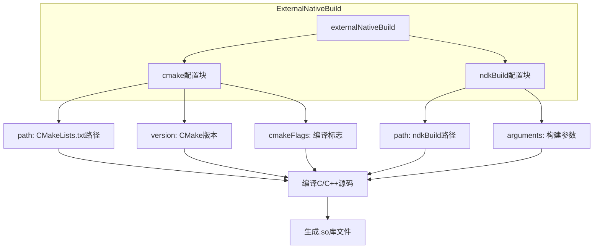
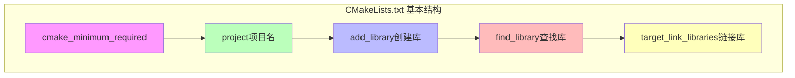
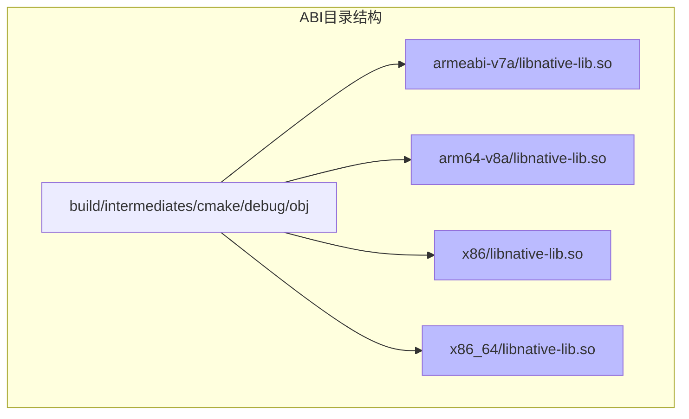

# 外部本地构建

夕阳一点点沉入远处的山脊线，天空从金黄过渡到橘红，再到淡淡的紫蓝。湖畔的温度开始下降，微风带来了湖水特有的凉意，吹得篝火苗头轻轻摇晃。

洛芙把外套裹紧了一些，目光却离不开黛琳手中翻开的笔记本——，下午的学习让她对构建系统产生了浓厚的兴趣。

“黛琳，”洛芙凑近了一些，“昨天我们学的Profile是用来控制构建怎么执行的。那……如果我想让App能调用C或者C++写的代码，该怎么配置？”

黛琳抬起头，嘴角微微上扬：“你问到点子上了。今天我们要学的，就是**ExternalNativeBuild**——外部本地构建。”

“外部？”伊莎眨了眨眼，“是说Gradle之外的构建工具吗？”

“对，”黛琳点点头，“Android原生开发最常用的两套外部构建系统是CMake和ndk-build。CMake更现代，ndk-build则是老牌选手。”她指了指篝火边上摆着的一个小小指南针，“就像露营时的导航——你可以用指南针，也可以用GPS，它们都能帮你找到方向。”

希尔不知道什么时候已经打开了电脑，屏幕上显示着Gradle的配置文档：“CMake和ndk-build都能帮我们把C/C++代码编译成Android能用的Native库。ExternalNativeBuild DSL就是用来配置它们的。”



“听起来像是我们之前学的CMakeFlags的'兄弟’？”洛芙问道。

“血缘关系很近，”黛琳笑着说，“CMakeFlags是用来配置CMake的编译选项，而ExternalNativeBuild是来**启动**CMake或者ndk-build的。你可以把它理解为'在Gradle里调用外部构建工具的开关'。”

洛芙若有所思地点点头：“那……具体怎么写？”

希尔把屏幕转过来，让大家都看得见：“看，这是最基本的配置写法。”

```kotlin
android {
    // 启用外部本地构建
    externalNativeBuild {
        // 配置CMake构建
        cmake {
            // CMakeLists.txt 文件的路径（相对于build.gradle所在目录）
            path = file("src/main/cpp/CMakeLists.txt")
            
            // 指定CMake版本（建议使用最新稳定版）
            version = "3.22.1"
            
            // CMake编译标志（之前学过的）
            cmakeFlags += listOf(
                "-DCMAKE_BUILD_TYPE=Release",
                "-DANDROID_TOOLCHAIN=clang"
            )
        }
        
        // 或者配置ndk-build
        // ndkBuild {
        //     path = file("src/main/cpp/Android.mk")
        //     arguments += "-NDK_DEBUG=1"
        // }
    }
    
    // 配置NDK版本
    ndkVersion = "25.1.8937393"
    
    // 指定要生成的ABI（CPU架构）
    defaultConfig {
        ndk {
            abiFilters += listOf("armeabi-v7a", "arm64-v8a", "x86", "x86_64")
        }
    }
}
```

“等一下，”洛芙打断了希尔，指着path字段问，“这个path是放CMakeLists.txt的路径？那如果没有这个文件会怎样？”

“那CMake就不会运行，”黛琳回答，“path是必填项。你需要先准备好CMakeLists.txt文件，告诉CMake要编译哪些源文件、生成什么库。”

“就像露营时要先搭好帐篷才能住一样？”伊莎打着比方。

“差不离，”黛琳点头，“ExternalNativeBuild只是**触发**构建，真正的编译指令都在CMakeLists.txt里。”

洛芙皱起眉头：“那……CMakeLists.txt该怎么写？我完全不会C++诶。”

“没关系，我们先看看它的基本结构，”黛琳从笔记本里翻出一张折起来的纸，“希尔，帮我在白板上画一下？”

希尔会意地调出白板APP，在屏幕上画了起来：



“第一个是cmake_minimum_required，”希尔指着白板说，“指定最低CMake版本，就像我们在build.gradle里写compileSdkVersion差不多。”

“第二个project是项目名，就像我们的App名字，”黛琳补充道。

“add_library最重要，”希尔继续说，“它告诉CMake要生成什么库。比如我们要生成一个叫native-lib的库：”

```cmake
# CMakeLists.txt 示例

# 指定最低CMake版本
cmake_minimum_required(VERSION 3.18.1)

# 项目名称
project("MyNativeApp")

# 创建原生库
# 参数1: 库名称（生成libnative-lib.so）
# 参数2: 库类型（STATIC/SHARED/MODULE）
# 参数3: 源文件列表
add_library(native-lib SHARED native-lib.cpp)

# 查找系统库（比如log库，用于Android日志）
find_library(log-lib log)

# 链接库
target_link_libraries(native-lib ${log-lib})
```

洛芙眼睛亮了起来：“这个看起来比我想的简单！原来就是在说'把native-lib.cpp编译成so库，然后链接log库'嘛。”

“对了，”黛琳微笑着说，“CMake的语法其实很直观。add_library就是'添加库'，find_library就是'找库'，target_link_libraries就是'把库链接起来'。”

“那ndk-build呢？”伊莎好奇地问，“和CMake有什么不同？”

希尔切换到另一页文档：“ndk-build是Google早期推出的构建系统，用的是Android.mk和Application.mk文件。虽然官方推荐CMake，但有些老项目还在用ndk-build。”

```makefile
# Android.mk 示例
LOCAL_PATH := $(call my-dir)

include $(CLEAR_VARS)
LOCAL_MODULE    := native-lib
LOCAL_SRC_FILES := native-lib.c
LOCAL_LDLIBS    := -llog
include $(BUILD_SHARED_LIBRARY)
```

“看起来两种方式都能达成目标，”洛芙总结道，“CMake更现代，ndk-build是老的。那……怎么选？”

“官方推荐CMake，”黛琳回答，“因为CMake是跨平台的工业标准，很多开源库都提供CMake支持。但如果你维护的是老项目，或者遇到CMake解决不了的问题，ndk-build也是可行的方案。”

“有没有办法让两种方式都能工作？”希尔提出了一个问题。

黛琳想了想：“可以同时配置cmake和ndkBuild块，但同一时间只能激活一个。你可以用productFlavors或者buildTypes来区分。”

```kotlin
android {
    externalNativeBuild {
        cmake {
            path = file("src/main/cpp/CMakeLists.txt")
            version = "3.22.1"
        }
    }
    
    buildTypes {
        debug {
            // Debug构建时使用CMake
            externalNativeBuild {
                cmake {
                    cmakeFlags += "-DCMAKE_BUILD_TYPE=Debug"
                }
            }
        }
        release {
            // Release构建时使用CMake
            externalNativeBuild {
                cmake {
                    cmakeFlags += "-DCMAKE_BUILD_TYPE=Release"
                }
            }
        }
    }
}
```

洛芙托着腮帮子，看着篝火出神：“那……我编译出来的.so文件会放在哪里？”

“会在build目录下生成，”希尔回答，“具体路径是app/build/intermediates/cmake/&lt;variant&gt;/obj/。生成的库文件名是lib&lt;你指定的库名&gt;.so。”

“对了，还有ABI的问题，”黛琳补充道，“之前我们配置abiFilters，编译出来的库会按CPU架构分开存放。比如arm64-v8a的库在armeabi-v7a的库在另一个文件夹。”



伊莎好奇地问：“一定要支持所有这些架构吗？好像会很占空间？”

“对，可以根据需要筛选，”黛琳解释，“像现在很多新设备都只支持arm64-v8a了，你可以只配置这个ABI，能显著减少APK体积。当然，如果你的App需要兼容老设备，那就得多配置几个。”

洛芙忽然想到一个问题：“那如果我在Mac上编译，会生成Mac的库吗？”

“不会，”希尔笑着说，“ExternalNativeBuild会根据ANDROID_NDK_HOME和CMake的交叉编译功能，在当前机器上生成目标平台为Android的库。不管你用的是Mac、Windows还是Linux，产出的都是Android能用的.so文件。”

“这也太神奇了吧！”洛芙感叹道，“那我们怎么在代码里调用这些C++函数？”

黛琳翻开笔记本的新一页：“这就涉及到**JNI**——Java Native Interface。简单说，就是Java/Kotlin和C/C++之间的桥梁。”

```kotlin
// Kotlin中声明native方法
class NativeLib {
    
    // 关键字external表示这个方法的实现不在Kotlin里
    external fun stringFromNative(): String
    
    companion object {
        // 加载生成的so库
        init {
            System.loadLibrary("native-lib")
        }
    }
}

// 使用
val lib = NativeLib()
// 调用C++实现的stringFromNative方法
val result = lib.stringFromNative()
```

“C++那边需要实现对应的函数，”希尔补充，“函数名有特定规则，比如Java_com_example_mynativeapp_NativeLib_stringFromNative。”

洛芙忍不住吐槽：“这函数名也太长了吧！”

“习惯就好，”黛琳笑着说，“不过现在有个更方便的方法——使用**JNA**或者Android官方推荐的**C++/Kotlin互操作**，能简化很多样板代码。”

夜风渐凉，篝火的红光在每个人脸上跳动。洛芙看着笔记本上的代码，感觉既熟悉又陌生。

“黛琳，”洛芙轻声说，“那我学会了ExternalNativeBuild，是不是就能写出有C++核心代码的App了？”

“理论上是这样，”黛琳点点头，“不过实际项目中，更常见的是用CMake来集成一些现成的C++库——比如图像处理的OpenCV、或者音视频处理的FFmpeg。很少需要自己从头写C++。”

“那为什么还要学这个？”洛芙歪着头问。

“因为**理解**和**集成**是两回事，”黛琳认真地说，“当你需要把一个C++库集成到Android App里时，你会发现CMakeLists.txt怎么写、ExternalNativeBuild怎么配置，这些知识点都是基础。掌握了这些，你才能真正驾驭Native开发。”

伊莎打了个哈欠：“说的也是……就像我们露营，搭帐篷的方法知道了，才能去更远的地方。”

“对！”黛琳笑着点头，“今天我们学了ExternalNativeBuild的基本配置，下一次我们可以深入看看CMakeLists.txt的高级用法——比如怎么链接预编译库、怎么设置编译选项、怎么管理多模块项目。”

洛芙伸了个懒腰，看着天边已经升起的星星：“感觉又掌握了一门'黑科技'呢。”

“那就把它记到你的小本本上吧，”希尔打趣道，“下次面试人家问你'怎么在Gradle里配置CMake'，你就可以巴拉巴拉说一堆了。”

篝火噼啪作响，火星缓缓上升，消散在夜空中。湖面上倒映着星光，仿佛整个宇宙都装进了这个小小的湖畔。

---

> **学习建议**
> - ExternalNativeBuild是Android Gradle插件提供的DSL，用于配置CMake或ndk-build进行原生代码编译
> - CMakeLists.txt是CMake的构建脚本，定义了源文件、编译选项、链接库等信息
> - ndk-build使用Android.mk和Application.mk文件，是较老的构建方案，官方推荐CMake
> - ABI筛选可以通过abiFilters配置，减少不必要的架构库能显著减小APK体积
> - JNI是Java/Kotlin与C/C++互操作的桥梁，需要注意函数命名规则

---

## 洛芙的小小日记本

今天学了ExternalNativeBuild！原来在Gradle里配置CMake就可以编译C++代码了~黛琳说CMakeLists.txt就像露营的装备清单，要先准备好才能开始编译。希尔帮我写了Demo，感觉Native开发也没有那么神秘嘛！不过函数名好长好长……明天还要继续学CMake的高级用法，期待！

---

## 今日关键词

- **ExternalNativeBuild**: Android Gradle插件提供的DSL，用于配置外部本地构建系统（CMake/ndk-build）
- **CMake**: 跨平台的构建系统，用于编译C/C++代码，是Android官方推荐的Native构建工具
- **ndk-build**: Google早期的Native构建工具，使用Android.mk文件，现已不推荐新项目使用
- **CMakeLists.txt**: CMake的配置文件，定义了项目结构、源文件、编译选项等
- **Android.mk**: ndk-build的配置文件，定义模块和构建规则
- **JNI (Java Native Interface)**: Java/Kotlin与C/C++之间的接口规范
- **ABI (Application Binary Interface)**: 应用二进制接口，不同CPU架构对应不同的ABI
- **abiFilters**: 用于筛选要编译的ABI类型，减少APK体积
- **.so库**: Linux/Unix的共享库文件，Android通过JNI调用
- **交叉编译**: 在一种平台上生成另一种平台的可执行文件
- **find_library**: CMake中查找系统或第三方库的指令
- **target_link_libraries**: CMake中链接库的指令
- **add_library**: CMake中创建库的指令
- **cmakeFlags**: CMake编译标志，用于传递编译选项
- **ndkVersion**: 指定使用的NDK版本
- **LOCAL_PATH**: ndk-build中的当前目录路径
- **LOCAL_MODULE**: ndk-build中定义的模块名
- **LOCAL_SRC_FILES**: ndk-build中定义的源文件列表
