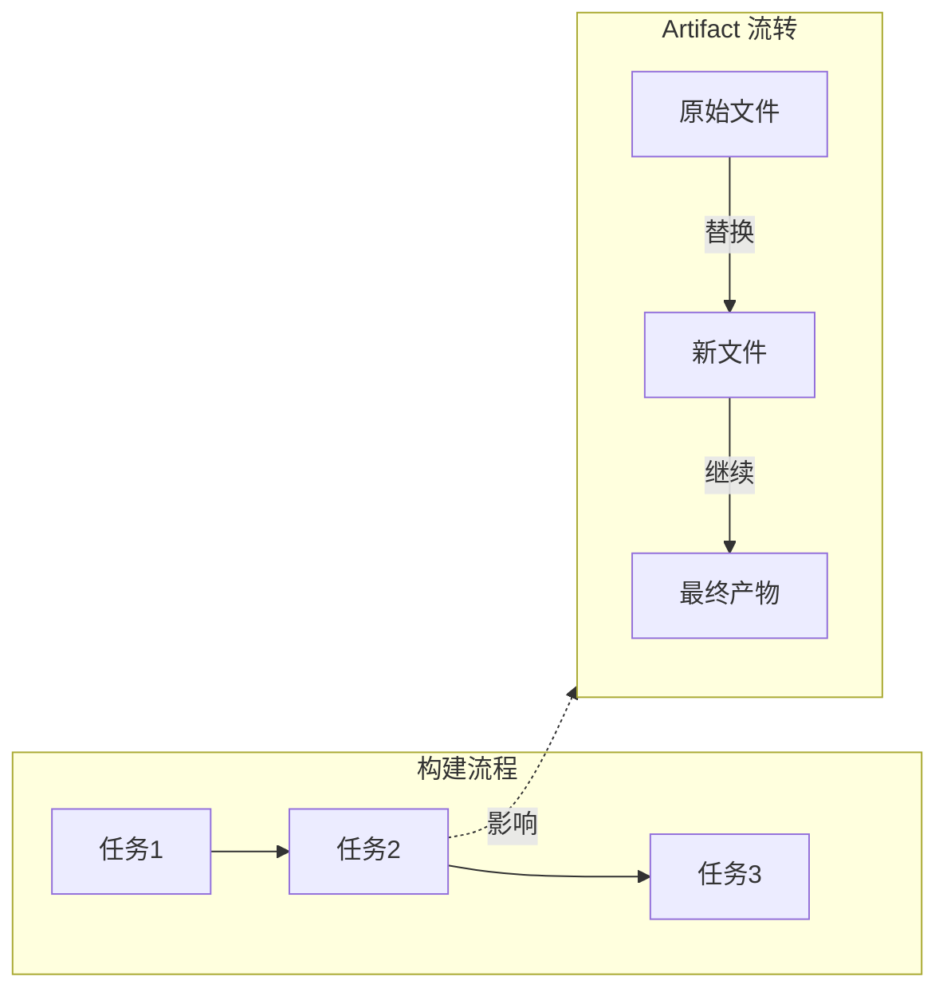
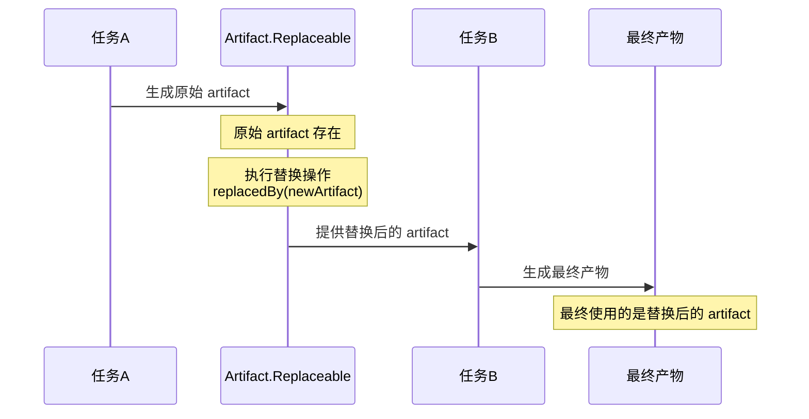
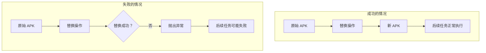

# 21.1.13 Artifact.Replaceable

天色已经完全暗下来了。

最后一抹晚霞像融化的蜂蜜一样挂在天边，没过多久就被深蓝色的夜幕完全吞没。帐篷里的小夜灯散发出温暖的橙黄色光芒，在草地上投下一圈一圈柔和的光晕。远处的草丛里，偶尔传来几声虫鸣，像是有人在轻轻敲打夜空的鼓点。

“哇，天黑得好快啊。”洛芙裹紧了自己的外套，虽然是夏天，但夜晚的山里还是有几分凉意。

伊莎笑着递过来一个保温杯：“喝点热的吧，暖暖身子。今天晚上可是有好玩的东西哦。”

“什么好玩的东西？”洛芙接过杯子，眼睛立刻亮了起来。

黛琳正在整理她的小白板，听到这话抬起头来：“今天我们要讲一个很特别的 Artifact——叫 Artifact.Replaceable。”

“Replaceable……可替换？”洛芙眨了眨眼，“是说可以换掉的意思吗？”

“对了一半，”希尔不知道什么时候已经把笔记本打开了，屏幕上显示着满满的代码，“确切地说，Artifact.Replaceable 是指那些可以在构建过程中被‘替换’的 artifact。”

洛芙更迷惑了：“artifact 还能被替换？之前讲的那些 artifact 不都是固定的吗？”

黛琳笑着拍了拍身边的草地示意洛芙坐过来：“问得好。你还记得上次我们讲的 Artifact.Appendable 吗？那种是可以‘追加’——在原有的基础上多加东西。而 Replaceable 呢——是直接‘替换’。”

她在地上捡起一块小石头，给洛芙演示：“想象你在玩一个拼图游戏。Appendable 就像是你往拼图板上多加几块碎片；而 Replaceable 呢——是直接把某一块拼图换成另一块。”

“原来如此！”洛芙眼睛一亮，“那……哪些 artifact 是可以替换的呢？”

希尔想了想：“最常见的就是——处理后的资源、合并后的清单文件、还有……嗯，APK 本身也是可以替换的。”

“APK 也能替换？”洛芙惊呼，“那不是很危险？万一不小心把正确的 APK 换成错误的了怎么办？”

“所以才需要小心使用嘛，”黛琳笑着说，“不过这个特性非常有用。比如你想在打包后对 APK 进行二次签名，或者想在发布前添加一些额外的元数据——这些时候就需要用到 Replaceable artifact。”

伊莎轻轻拨了拨耳边被夜风吹乱的头发：“我记得之前讲过，构建过程就像一条流水线。Artifact.Replaceable 就像是流水线上的某个工位，你可以把原来的‘产品’拿走，换上另一个‘产品’。”

“这个比喻好！”洛芙拍着手说。

黛琳在地上画了一个简单的流程图：



“你们看，”黛琳指着图解释，“在构建过程中的某个节点，你完全可以把原来的 artifact 替换成另一个。这不会影响后续的任务，因为后续任务只会‘看到’最终的那个 artifact。”

洛芙似懂非懂地点点头：“那……具体该怎么用呢？”

希尔把笔记本转过来，指着屏幕上的代码：“看好了——”

```kotlin
// 使用 Artifact.Replaceable 的例子
android.applicationVariants.all { variant ->
    variant.artifacts.use { artifacts ->
        // 获取一个可替换的 APK artifact
        // 这代表了最终的 APK 输出
        artifacts.get(ArtifactType.APK)
            .replacedBy(project.layout.buildDirectory.file("output/custom.apk"))
    }
}
```

“这里有个关键点，”黛琳补充道，“用 `replacedBy()` 方法可以指定新的 artifact 来替换原来的。替换之后，后续的任务都会使用新的 artifact。”

洛芙好奇地问：“那原来的 artifact 呢？会被丢掉吗？”

“不会完全丢掉，”希尔解释道，“替换只是改变了‘引用’。原来的 artifact 对象还在，但后续的任务不会再使用它了。你可以理解为——就像你把一个文件夹里的文件换成了另一个，但原来的文件其实还在某个地方。”

黛琳又在地上画了起来，这次她画了一个更详细的图：



“你们看，”黛琳指着图解释，“替换操作发生在任务之间。原始 artifact 生成后，被替换成新的，然后下游任务使用新的 artifact 来生成最终产物。”

洛芙举手提问：“那……如果我想在替换之前做一些处理，该怎么做？”

“好问题！”希尔打了个响指，“你可以在替换之前先获取原始 artifact，做一些处理，然后再替换回去。”

她在电脑上敲出另一段代码：

```kotlin
// 在替换前处理原始 artifact
android.applicationVariants.all { variant ->
    variant.artifacts.use { artifacts ->
        // 先获取原始 artifact
        val originalApk = artifacts.get(ArtifactType.APK)
        
        // 对原始 APK 进行处理（比如重新签名）
        val processedApk = processApk(originalApk)
        
        // 用处理后的 APK 替换原始 APK
        artifacts.get(ArtifactType.APK)
            .replacedBy(processedApk)
    }
}

// 模拟 APK 处理函数
fun processApk(original: File): Provider<File> {
    // 这里可以对 APK 进行各种处理
    // 比如：重新签名、添加元数据、压缩等
    return project.layout.buildDirectory.map { dir ->
        val processed = dir.file("processed/processed.apk")
        // 处理逻辑...
        processed.get().asFile
    }
}
```

洛芙看着这段代码，感叹道：“原来可以这样……感觉像是有了一把万能钥匙。”

“确实很强大，”伊莎温柔地说，“不过也要小心使用。过度使用替换功能可能会让构建流程变得难以理解。”

黛琳点点头：“没错。Replaceable artifact 最大的用途是在一些特殊的构建场景中——比如动态修改构建产物、集成第三方签名工具、或者在发布前做最后的处理。”

她掰着手指如数家珍：

“**第一个常见场景是自定义签名。** 有些公司有自己的签名流程，需要在 Gradle 打包完成后，用自己的签名工具重新签名。这时候就可以用 Replaceable 把原始 APK 替换成签名后的 APK。”

“**第二个场景是添加元数据。** 比如你想在 APK 里添加一些构建信息、版本标签之类的额外数据，就可以在打包后替换原始 APK。”

“**第三个场景是调试和测试。** 在开发过程中，你可能想用某个特定的 APK（比如某个已知可用的版本）来替换当前的构建产物，以便快速测试。”

洛芙若有所思地点点头：“听起来 Replaceable 就像是一个‘后门’，可以在最后时刻改变一切。”

“这个比喻有意思，”希尔笑着说，“不过这个‘后门’是需要权限的。不是所有的 artifact 都可以替换，只有那些被标记为 Replaceable 的才可以。”

“那怎么知道哪些可以替换呢？”洛芙问。

黛琳在地上的白板写下一个列表：

“常见的可替换 artifact 包括——”

“**APK**（最终安装包）：这个最常用，你可以替换成任何符合规范的 APK。”

“**Bundle**（App Bundle）：和 APK 类似，Bundle 也是可以被替换的。”

“**合并后的清单文件**（Merged Manifest）：如果你想修改最终的 AndroidManifest.xml，可以替换它。”

“**处理后的资源**（Processed Resources）：如果你想在资源最终打包前做修改，可以替换这个。”

洛芙把这些都记了下来。

希尔看了看手表：“时候不早了，我再给你们看一个实用的例子——如何检查一个 artifact 是否可替换。”

```kotlin
// 检查 artifact 是否可替换
android.applicationVariants.all { variant ->
    variant.artifacts.use { artifacts ->
        // 获取 APK artifact
        val apkArtifact = artifacts.get(ArtifactType.APK)
        
        // 检查是否可替换
        if (apkArtifact is Artifact.Replaceable) {
            println("APK artifact 可以被替换！")
            
            // 执行替换
            apkArtifact.replacedBy(project.layout.buildDirectory.file("custom/custom.apk"))
        } else {
            println("这个 artifact 不能被替换")
        }
    }
}

// 另一种方式：直接在获取时处理
android.applicationVariants.all { variant ->
    variant.artifacts.use { artifacts ->
        try {
            // 尝试替换
            artifacts.get(ArtifactType.APK)
                .replacedBy(project.layout.buildDirectory.file("debug/debug.apk"))
        } catch (e: Exception) {
            // 如果不可替换，会抛出异常
            println("替换失败: ${e.message}")
        }
    }
}
```

洛芙看完这段代码，有些担心地问：“如果替换失败了会怎样？”

“通常会抛出异常，”黛琳回答，“因为替换操作是要更新整个构建图的。如果替换失败，后续任务可能无法正常执行。所以在生产环境中使用时，最好加上错误处理。”

她在地上又画了一幅图，解释替换失败的情况：



“原来是这样，”洛芙长舒一口气，“感觉像是在走钢丝。”

“技术都是这样的，”伊莎温柔地说，“强大的能力往往伴随着风险。关键是要理解什么时候该用，什么时候不该用。”

黛琳最后总结道：“记住——Artifact.Replaceable 是一个强大的特性，但不应该滥用。大多数情况下，使用普通的 artifact 就足够了。只有在真正需要动态修改构建产物的时候，才考虑使用替换功能。”

洛芙点点头，抬头看向帐篷外。星星已经布满了天空，一闪一闪地像是有人在打招呼。

“今天的露营也要结束了吗？”她轻声说。

希尔笑着收起了笔记本：“是啊，时间不早了。明天我们继续讲 Artifact.Single——单个文件的 artifact。”

“哇，还有更多啊！”洛芙吐了吐舌头，“感觉Artifacts 的世界好大啊。”

“那是当然，”黛琳笑着说，“Gradle 的 artifact 系统可是非常强大的。慢慢学，不着急。”

夜风吹过帐篷，带来一丝丝凉意。洛芙裹紧外套，心里却暖暖的。今天又学到了新东西，这种感觉真好啊。

---

> 学习建议：Artifact.Replaceable 提供了在构建过程中替换 artifact 的能力，适用于自定义签名、添加元数据、调试测试等场景。使用时需注意错误处理，并确保替换后的 artifact 符合规范。

## 洛芙的小小日记本

今天学到了 Artifact.Replaceable！原来构建产物也可以在中途被替换，感觉好像有魔法一样。不过黛琳说得对，这种强大的能力要谨慎使用。伊莎说得也很好——技术都是双刃剑，要学会在合适的时候用合适的方法。今天又是收获满满的一天呀～🌙

---

## 今日关键词

**Artifact.Replaceable**：Android Gradle Plugin API 中的一个接口，表示可被替换的 artifact 类型。它允许在构建过程中用新的 artifact 替换原始 artifact，后续任务将使用替换后的版本。

**replacedBy()**：Artifact.Replaceable 的方法，用于指定新的 artifact 来替换原来的。

**ArtifactType.APK**：表示最终 APK 安装包的 artifact 类型。

**ArtifactType.Bundle**：表示 App Bundle 的 artifact 类型。

**处理后的资源（Processed Resources）**：经过 Gradle 处理后的 Android 资源，可以被替换。
