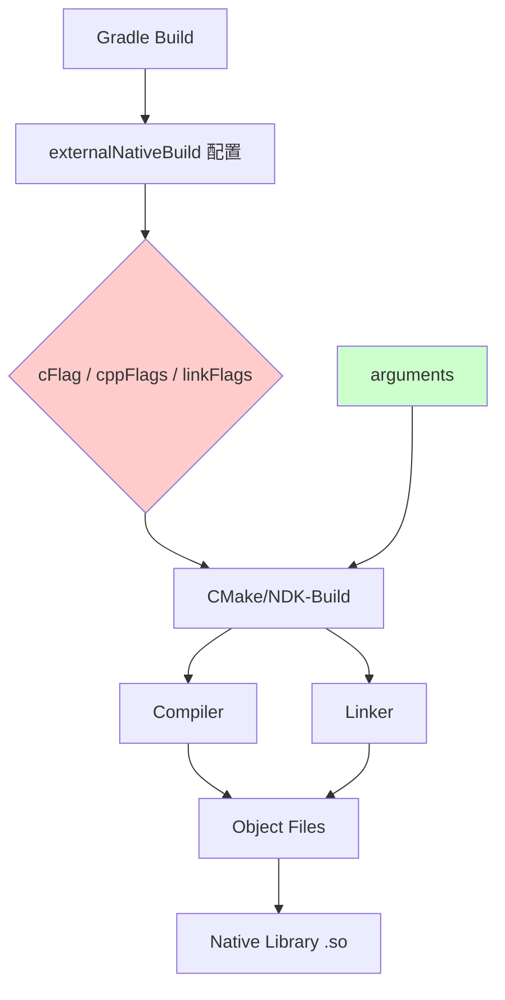
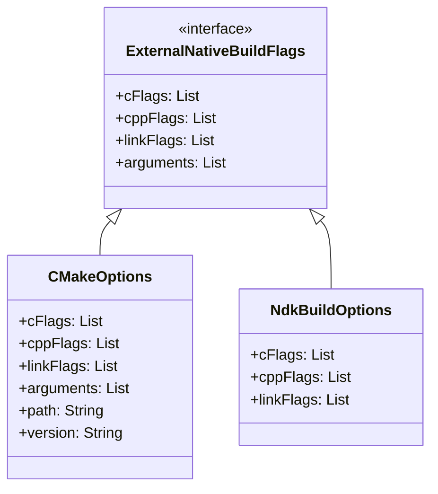

# 21.1.130 ExternalNativeBuildFlags

夜深了。

确切地说，是从傍晚那场关于CMake和ndk-build的讨论结束后，时间悄然滑过了两三个小时。湖边的蝉鸣不知什么时候已经停了，只有夜风偶尔吹过帐篷顶，发出轻微的沙沙声。

洛芙躺在睡袋里，双手枕在脑袋下面，盯着帐篷顶发呆。希尔还在旁边敲笔记本电脑，键盘的嗒嗒声在安静的夜里格外清晰。

"希尔......"洛芙轻声说，"你说我们白天学的那些CMake配置，如果在编译的时候需要传递一些特殊的参数该怎么办呀？比如我想定义一些宏，或者指定一些编译选项......"

希尔的手指停在键盘上。她抬起头，看了一眼旁边的黛琳和伊莎——她们也还没睡，黛琳在整理白板，伊莎在翻看白天的笔记。

"哟，问到点子上了。"希尔 grinned（露出灿烂的笑容），把电脑转过来给洛芙看，"看见没？这就是ExternalNativeBuildFlags——外部本地构建标志。我们白天学的cmake {}是配置构建系统本身，而这个是配置构建时的各种flag——编译标志、链接标志、预处理器定义......"

黛琳放下白板笔，爬过来盘腿坐好。"这个很重要。很多时候 native 代码行为不对，不是代码问题，而是编译时的 flag 配错了。"

伊莎歪着头，像一只好奇的小猫："那它都管哪些flag呀？"

"好问题。"希尔调出一个代码窗口，"看好了——"

```kotlin
android {
    externalNativeBuild {
        cmake {
            // 编译 C 文件时的 flag
            cFlags "-DDEBUG", "-Wall"
            // 编译 C++ 文件时的 flag
            cppFlags "-std=c++17", "-frtti", "-fexceptions"
            // 链接时的 flag
            linkFlags "-lz", "-llog"
            // 预定义宏
            arguments "-DCMAKE_BUILD_TYPE=Debug"
        }
        ndkBuild {
            cFlags "-DDEBUG", "-Wall"
            cppFlags "-std=c++17"
            linkFlags "-lz"
        }
    }
}
```

洛芙眨眨眼："这些flag......都是什么意思呀？"

"别急，一个一个来。"黛琳拿过白板，在上面画了几个圈，"先从最常用的说起——预处理器定义。"

## 预处理器定义：构建时的开关

"你写过 C 代码吗？"黛琳问。

"嗯......在学校里学过一点C。"洛芙点点头。

"好。那你记得 `#ifdef DEBUG` 这种东西吗？"

"记得！用来判断是不是调试模式。"

"对。"黛琳在白板上写下 `-D` 符号，"在 Gradle 里，我们用 `cFlags` 或 `cppFlags` 加上 `-D` 前缀来定义宏。比如："

```kotlin
cmake {
    cppFlags "-DMY_VERSION=1", "-DUSE_LOGGING", "-DENABLE_FEATURE_X"
}
```

"这些 `-D` 开头的东西，会在编译时传给编译器，相当于在每个源文件开头自动加了："

```cpp
#define MY_VERSION 1
#define USE_LOGGING
#define ENABLE_FEATURE_X
```

洛芙若有所思："所以我可以在代码里写 `#ifdef USE_LOGGING`，编译时决定是否包含某些功能？"

"正是如此。"黛琳微笑，"这在开发中非常有用。比如："

```cpp
#ifdef DEBUG
    __android_log_print(ANDROID_LOG_DEBUG, "MyApp", "Debug info: %s", msg);
#endif
```

"发布版本时，把 `-DDEBUG` 去掉，这些调试日志就不会编译进去，性能会更好。"希尔补充道，"很多团队用这种办法实现调试/发布两套代码。"

伊莎托着腮："就像露营时的'夜间模式'和'日间模式'一样——白天不需要开灯，晚上才点亮，是不是？？"

"伊莎的比喻总是这么贴切。"黛琳轻笑。

## 编译标志：告诉编译器怎么做

"接下来是编译标志。"希尔重新接管电脑，"这些 flag 告诉编译器怎么编译代码。"

她在屏幕上打出一行行说明：

```kotlin
cmake {
    // C++ 相关
    cppFlags "-std=c++17"        // 使用 C++17 标准
    cppFlags "-frtti"            // 启用运行时类型信息
    cppFlags "-fexceptions"      // 启用异常支持
    
    // 通用
    cFlags "-Wall"              // 开启所有警告
    cFlags "-Werror"            // 把警告当作错误
    cFlags "-O2"                // 优化级别 2
    cFlags "-g"                 // 包含调试信息
}
```

洛芙指着 `-std=c++17` 问："这个是一定要写的吗？"

"不一定有默认值，但最好明确指定。"黛琳说，"Android NDK 默认可能不是最新的 C++ 标准。如果你需要 C++17 的特性（比如 structured bindings、optional），就必须显式指定。"

"那 `-Wall` 和 `-Werror` 呢？"

" `-Wall` 开启大多数常见警告，帮助你发现潜在问题。 `-Werror` 更严格，直接把警告变成编译错误——这在 CI/CD 里很有用，防止 warning 堆积。"

希尔点点头："我建议开发时加 `-Werror`，CI 构建也加 `-Werror`。但发布版本可以只开 `-Wall`，避免突然有新的 warning 导致构建失败。"

洛芙记了下来，又问：" `-O2` 和 `-g` 是干嘛的？"

"这是两个互斥的场景。"希尔解释，" `-O2` 是优化选项，编译出的代码更快更小； `-g` 是调试选项，生成的二进制包含调试符号，体积大但可以调试。在 debug build 中我们通常用 `-O0 -g`，release 用 `-O2 -g`。"

"不对呀，"洛芙歪头，"release 也要调试符号？"

"通常 release 也要保留符号，这样崩溃时能解析 stack trace。"黛琳说，"很多团队用 `-O2 -g` 做 release，既能优化性能，又能调试。"

伊莎好奇地问："那 `-O3` 呢？比 `-O2` 还强？"

"理论上 `-O3` 会做更多优化，但实际上在 Android 上往往和 `-O2` 差不多，有时反而会因为过度优化导致奇怪的 bug。"希尔耸耸肩，"我建议先用 `-O2`，除非 profiling 显示确实需要更激进的优化。"

## 链接标志：把库拼在一起

"编译完目标文件，最后一步是链接。"黛琳在白板上画了一条线，"链接标志告诉链接器怎么处理库文件。"

```kotlin
cmake {
    linkFlags "-lz"         // 链接 zlib 压缩库
    linkFlags "-llog"       // 链接 Android log 库
    linkFlags "-ljnigraphics" // 链接 JNI 图形库
    linkFlags "-landroid"  // 链接 Android 基础库
    linkFlags "-Wl,--gc-sections" // 链接器优化，丢弃未使用的代码
}
```

"这些 `-l` 开头的，是链接系统库。"希尔说，"Android NDK 已经自带了很多库：libz、liblog、libandroid、libOpenSLES......需要什么就加什么。"

洛芙注意到还有个特殊的：`Wl,--gc-sections`。

"这个啊，"希尔解释道，" `Wl,` 的意思是'把这些参数传给链接器'。 `--gc-sections` 会让链接器丢弃没有被引用的代码段（section），可以显著减小 APK 体积。特别是 native 代码多的应用，这个很有用。"

"不过要注意，"黛琳补充，"如果用了反射或者动态加载，`--gc-sections` 可能会误删你需要的代码。那时候需要用 `-Wl,--undefined=symbol_name` 来保留特定的符号。"

伊莎好奇："那如果我想链接自己写的 so 库呢？"

"那个不是通过 linkFlags 做的。"希尔摇头，"自定义库是通过 target_link_libraries() 在 CMake 脚本里处理的。linkFlags 主要用于系统库和外部预编译库。"

## arguments：给 CMake 的额外参数

"对了，还有 arguments。"希尔突然想起什么，"CMake 特有的，可以传递任意参数给 CMake。"

```kotlin
cmake {
    arguments "-DCMAKE_BUILD_TYPE=Debug",
              "-DCMAKE_TOOLCHAIN_FILE=${cmakeToolchainFile}",
              "-DANDROID_PLATFORM=android-26",
              "-DANDROID_ABI=arm64-v8a"
}
```

黛琳在一旁解释："这些是 CMake 特有的变量。 CMAKE_BUILD_TYPE 控制是 Debug 还是 Release。 CMAKE_TOOLCHAIN_file 是 NDK 提供的工具链文件——你基本不需要改它，但需要传递这个变量。"

" ANDROID_PLATFORM 指定目标 API 级别，"希尔补充，" ANDROID_ABI 指定 CPU 架构。这里可以写多个 ABI，用逗号分隔。"

洛芙问："这些和 cFlags、cppFlags 有什么区别？"

"cFlags、cppFlags 是传给编译器的，arguments 是传给 CMake 系统的。"黛琳说，"CMake 会把 arguments 里以 `-D` 开头的存成变量，你的 CMake 脚本可以读取这些变量来做条件判断。"

"比如？"洛芙追问。

"比如你在 CMakeLists.txt 里可以写："

```cmake
if(CMAKE_BUILD_TYPE STREQUAL "Debug")
    add_definitions(-DENABLE_VERBOSE_LOG)
endif()
```

"这样就能根据 Gradle 里的配置动态决定编译行为。"希尔 grins（露出灿烂的笑容），"很灵活吧？"

## 反模式：常见错误与修复

黛琳的表情突然严肃起来："说完了正常用法，说说常见错误。"

她在白板上写下几个"不要"：

**错误1：flag 里写了引号**

```kotlin
// ❌ 错误
cppFlags "-std=c++17"  // 编译器会收到 "-std=c++17" 而不是 -std=c++17
```

"有些同学怕参数里有空格，习惯加引号。"黛琳说，"但 Gradle DSL 会自动处理引号，你再加引号反而可能出问题。正确写法就是："

```kotlin
// ✅ 正确
cppFlags "-std=c++17"  // 正确
```

**错误2：ABI 和 platform 混用**

```kotlin
// ❌ 错误：arguments 里的 ABI 和 externalNativeBuild 的 abiFilters 不一致
arguments "-DANDROID_ABI=armeabi-v7a"
ndk {
    abiFilters "arm64-v8a"
}
```

"这两种配置必须一致，否则会出现奇怪的链接错误。"黛琳强调，"要么都用 arguments 配置，要么都用 ndk.abiFilters，别混着来。"

**错误3：链接了不存在的库**

```kotlin
// ❌ 错误：链接了一个不存在的库
linkFlags "-lnonexistent_lib"
```

"编译时不会报错，因为链接器只是'找不到这个库'的警告。"希尔说，"但运行时会发生 UnsatisfiedLinkError。所以一定要确认库确实存在。"

**错误4：release 时忘记关闭调试 flag**

```kotlin
// ❌ 错误：debug flag 在 release 里还在
cmake {
    release {
        cFlags "-g"  // release 不应该有调试符号
    }
}
```

"这是一个很隐蔽的问题。"黛琳说，"release 版本的 native 库不应该包含调试信息，否则会暴露代码，也影响性能。正确做法是："

```kotlin
cmake {
    // debug build 包含调试信息
    debug {
        cFlags "-g"
        cppFlags "-g"
    }
    // release build 优化但不等于完全不带符号（用于崩溃解析）
    release {
        cFlags "-O2"
        cppFlags "-O2"
    }
}
```

洛芙连连点头："原来有这么多坑啊......"

"所以才要好好学这个。"希尔说，"flag 配置对了，native 代码才能按预期工作。"

## 可视化：构建流程中的位置

黛琳在白板上画了一幅图，展示这些 flag 在构建流程中的位置：



"cFlags、cppFlags、linkFlags 在编译和链接阶段起作用，"黛琳解释，"arguments 在 CMake 初始化阶段起作用，决定整个构建的配置方向。"

"原来是这样。"洛芙点头，"它们作用在不同阶段，所以能影响不同的东西。"

## 实际案例：配置一个日志库

希尔决定给洛芙展示一个完整的实战例子："来，我们来配置一个真实的场景——添加一个 native 日志库。"

她在电脑上敲出配置：

```kotlin
android {
    defaultConfig {
        ndk {
            abiFilters "arm64-v8a", "x86_64"
        }
    }
    
    externalNativeBuild {
        cmake {
            path "src/main/cpp/CMakeLists.txt"
            version "3.22.1"
            
            // 预定义宏：版本号和特性开关
            cppFlags "-DAPP_VERSION=1", "-DENABLE_NATIVE_LOG"
            
            // C++ 标准
            cppFlags "-std=c++17"
            
            // 链接必要的库
            linkFlags "-llog", "-lz", "-landroid"
            
            // 传给 CMake 的变量
            arguments "-DCMAKE_BUILD_TYPE=Release",
                      "-DANDROID_PLATFORM=android-26"
        }
    }
}
```

"这里我们配置了：版本号宏、启用日志的开关、C++17 标准、链接 log/z/android 三个库，还有 CMake 的构建类型和目标平台。"希尔一项一项指给洛芙看。

"CMakeLists.txt 里就可以用这些变量："希尔切换到另一个窗口：

```cmake
cmake_minimum_required(VERSION 3.22.1)

project("NativeLogger")

# 读取 Gradle 传进来的变量
if(ENABLE_NATIVE_LOG)
    message(STATUS "Native logging enabled")
    add_definitions(-DENABLE_NATIVE_LOG)
endif()

add_library(native-logger SHARED native_logger.cpp)
target_link_libraries(native-logger log android)
```

"看到了吗？Gradle 的 cppFlags 定义了 ENABLE_NATIVE_LOG，CMake 脚本读取这个变量，决定是否启用日志功能。"希尔说，"这是 gradle 和 cmake 协作的典型模式。"

洛芙眼睛亮亮的："这样我就可以在 Gradle 这一层控制 native 代码的行为了！"

"对的。"黛琳微笑，"这就是 ExternalNativeBuildFlags 的核心价值——它是 Gradle 和 native 构建系统之间的桥梁。"

## 运行验证：看看 flag 生效了吗

希尔现场演示了一下如何验证 flag 配置是否生效："当你执行 ./gradlew assembleDebug 时，Gradle 会输出详细的构建信息。"

她在终端里敲了一行：

```
./gradlew :app:externalNativeBuildDebug --info | grep -E "(cFlags|linkFlags|CMAKE_)"
```

"这个命令会过滤出构建过程中和 flag 相关的日志。"希尔解释，"如果配置正确，你会看到类似这样的输出："

```
> Configure project :app
> CMake Warning:
>   CMAKE_BUILD_TYPE not set, defaulting to Debug
>   CMake Error:...
>   CMAKE_TOOLCHAIN_FILE: .../android-ndk/cmake/toolchain.cmake
>   ANDROID_PLATFORM: android-26
>   ANDROID_ABI: arm64-v8a
```

"如果有错误，这里会显示出来。"希尔说，"另外，CMake 生成的 build.gradle.cache 里也保存了最终解析的 flag 值。"

黛琳补充："还有一个有用的技巧——查看 app/build/intermediates/cmake 目录下的生成文件，那里有 CMake 实际收到的完整参数列表。"

## 深夜的讨论：构建系统的哲学

伊莎突然感叹："说到底，这套系统就是为了让 Java/Kotlin 代码和 native 代码能和平共处呀。"

"不只是和平共处，"黛琳说，"是让两边能互相通信、共享配置。Android 开发发展了这么多年，从最初的全 native，到后来的纯 Java，再到现在的混编时代，build system 也在进化。"

"就像露营一样，"伊莎轻笑，"以前大家都是背包客，现在有了各种装备，可以更舒服地亲近自然了。"

希尔被这个比喻逗笑了："那 ExternalNativeBuildFlags 就是露营装备的说明书——告诉系统怎么组装这些装备。"

洛芙看着窗外的星空："我现在有点明白了。白天学的 cmake {} 像是选定要用的炉具，现在的 flags 就是调节火候、选择燃料......一步一步，才能做好一顿饭。"

"这个比喻可以！"希尔 grinning（露出灿烂的笑容），"做饭这个比喻很贴切。做饭需要火候，做 native 开发也需要合适的编译选项——多了不行，少了也不行。"

夜更深了。帐篷外的篝火只剩下零星的火星，天上的星星倒是越来越亮。偶尔有一只夜鸟从远处飞过，发出低沉的叫声。

"好了，今天就到这里吧。"黛琳打了个哈欠，"这些 flag 配置看起来简单，但真正用起来会有很多细节。明天我们再讲讲不同 ABI 的差异处理。"

"还有 ABI 啊？"洛芙好奇。

"对，"希尔说，"不同 CPU 架构需要的 flag 可能不一样，这个我们明天详细说。"

洛芙躺在睡袋里，闭上眼睛。脑海里还在回放刚才学的那些 flag：-D 开头的宏、-std=c++17、-llog、-Wl,--gc-sections......它们就像露营时的各种工具，每样都有特定的用途。

"原来 native 开发也不全是代码呀......"她轻声自言自语，然后嘴角上扬，睡着了。

---

## 专业技术总结

> ExternalNativeBuildFlags 是 Android Gradle DSL 中用于配置外部本地构建系统（CMake、ndk-build）编译和链接参数的接口。通过 cFlags、cppFlags、linkFlags 和 arguments 等属性，开发者可以控制编译器行为、定义预处理器宏、链接系统库以及传递自定义变量给 CMake 系统。

### 结构图



### 反模式与陷阱

1. **在 flag 值中额外添加引号**：Gradle DSL 会自动处理引号，手动添加可能导致参数解析错误
2. **ABI 配置不一致**：arguments 中的 ANDROID_ABI 与 ndk.abiFilters 必须保持一致
3. **链接不存在的库**：编译时仅警告，运行时触发 UnsatisfiedLinkError
4. **release 版本未移除调试 flag**：导致性能下降和代码暴露
5. **混淆 cFlags 和 cppFlags**：cFlags 仅作用于 C 文件，cppFlags 仅作用于 C++ 文件

### 设计哲学

1. **构建配置分层**：Gradle 负责整体配置，CMake 负责具体构建逻辑
2. **预处理器驱动开发**：通过宏定义实现调试/发布环境的切换
3. **链接器优化**：使用 --gc-sections 减小二进制体积
4. **ABI 兼容性**：通过 abiFilters 控制支持的 CPU 架构
5. **版本明确性**：显式指定 C++ 标准版本，避免隐式默认值

### 动手练习

**目标**：配置一个支持调试和发布的 native 模块，正确设置编译和链接 flag。

**你需要做的事**：

1. 创建一个新的 Android 项目，添加 native 支持（CMake）
2. 在 build.gradle 的 externalNativeBuild.cmake 中配置：
   - cppFlags：设置 C++17、启用异常和 RTTI
   - linkFlags：链接 log 和 z 库
   - arguments：设置 CMAKE_BUILD_TYPE 为变量
3. 创建简单的 native 方法，添加条件编译日志
4. 分别构建 debug 和 release variant，观察日志输出的差异

**验收标准**：

- [ ] CMake 配置能成功解析，无警告
- [ ] debug build 包含调试符号和调试日志
- [ ] release build 优化后不包含调试日志
- [ ] APK 大小明显小于未优化的版本

**提示**：

```kotlin
cmake {
    debug {
        cppFlags "-g", "-O0"
    }
    release {
        cppFlags "-O2"
        cppFlags "-DENABLE_NATIVE_LOG=0"  // release 关闭日志
    }
}
```

### 面试热身

1. 解释 cppFlags 和 arguments 的区别，它们分别作用于构建的哪个阶段？
2. 如何在 CMakeLists.txt 中读取 Gradle 传递的自定义变量？
3. 为什么 release build 应该关闭调试 flag？会有什么影响？
4. 链接 flag 中的 -Wl,--gc-sections 是什么作用？使用时需要注意什么？
5. 如果遇到 UnsatisfiedLinkError，应该从哪些方面排查？

### 参考实现要点

1. 始终显式指定 C++ 标准版本（如 -std=c++17）
2. 开发环境开启 -Werror，将警告视为错误
3. release 版本保留 -g 用于崩溃解析，但关闭调试日志宏
4. 使用 arguments 传递变量，CMake 脚本通过 if() 判断使用
5. 定期检查 ndk.abiFilters 和 arguments 中的 ABI 是否一致

> 学习建议：ExternalNativeBuildFlags 是控制 native 构建细节的核心接口，建议在实际项目中逐步尝试不同的 flag 配置，观察构建日志和产物变化。初期可以从简单的预定义宏开始，逐步掌握更复杂的链接器优化选项。

## 洛芙的小小日记本

今天学的是 ExternalNativeBuildFlags——编译器和链接器的各种参数开关。白天我们学会了怎么配置 CMake，现在学的是怎么给它传"小纸条"——告诉它要用什么标准编译、链接哪些库、定义哪些宏。

黛琳说，很多 native 代码的问题不是代码本身，而是编译时的 flag 配错了。我要记住这个！

明天还要学不同 CPU 架构（ABI）的差异处理...... native 开发真的好细致啊。(๑•̀ㅂ•́)و✧

---

## 今日关键词

- **ExternalNativeBuildFlags**：Android Gradle DSL 中配置外部本地构建（CMake/ndk-build）编译和链接参数的接口
- **cFlags**：传递给 C 编译器的编译参数，使用 -D 前缀定义宏
- **cppFlags**：传递给 C++ 编译器的编译参数，可指定 C++ 标准（如 -std=c++17）
- **linkFlags**：传递给链接器的参数，用于指定需要链接的系统库（如 -llog）
- **arguments**：传递给 CMake 的自定义变量，可在 CMakeLists.txt 中读取
- **预处理器定义**：编译前由预处理器处理的宏定义，控制条件编译
- **链接器优化**：通过 --gc-sections 等参数减小二进制体积
- **CMAKE_BUILD_TYPE**：CMake 变量，控制 Debug 或 Release 构建类型
- **ANDROID_ABI**：CMake 变量，指定目标 CPU 架构
- **UnsatisfiedLinkError**：运行时错误，表示找不到 native 库或方法
- **abiFilters**：NDK 配置，指定支持的 CPU 架构列表
- **RTTI**：运行时类型信息（Run-Time Type Information），C++ 特性之一
- **CI/CD**：持续集成/持续部署，开发流程中的自动化构建系统