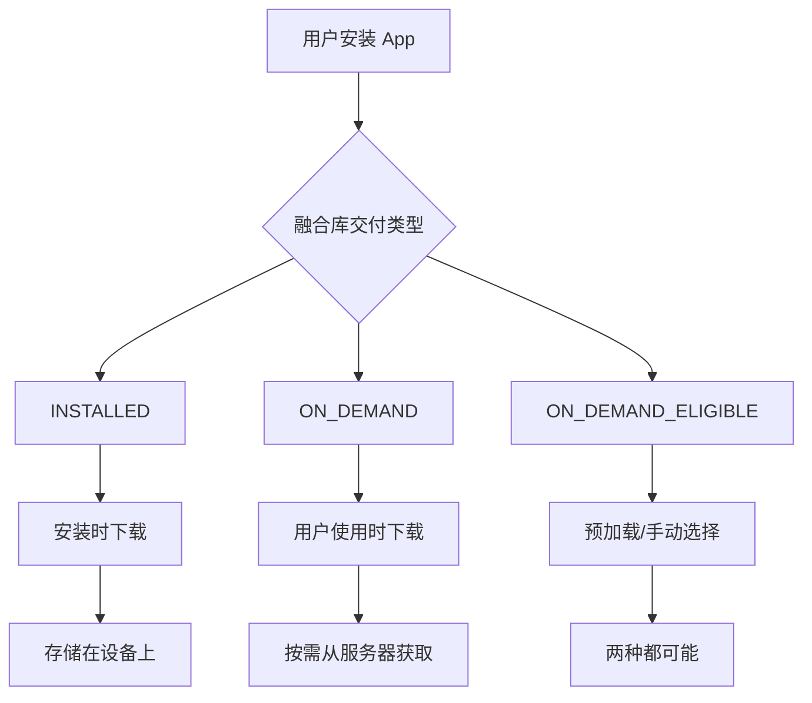
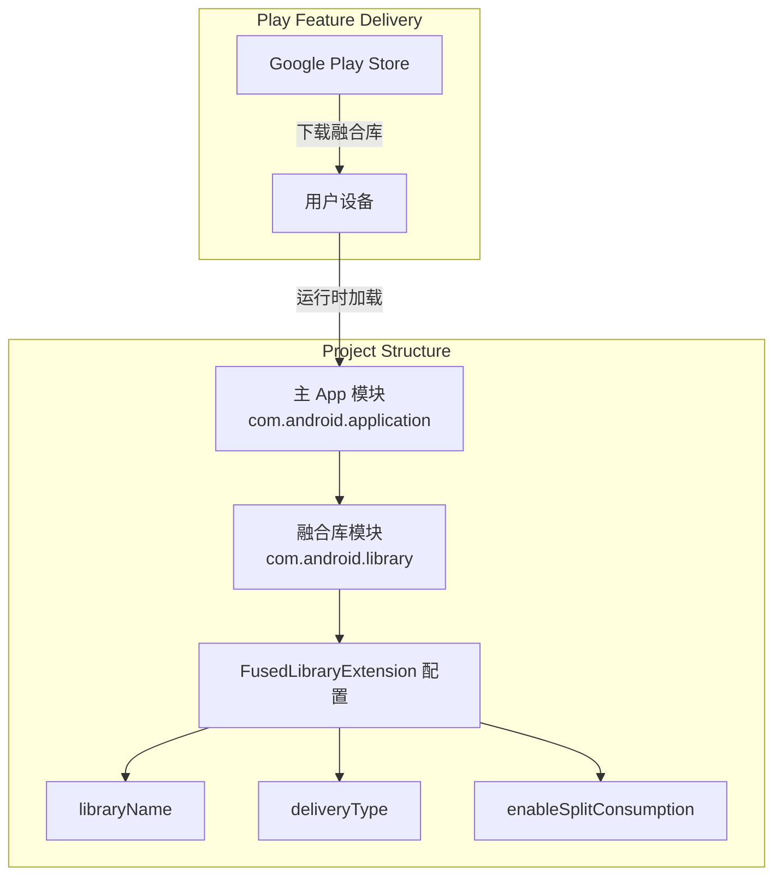
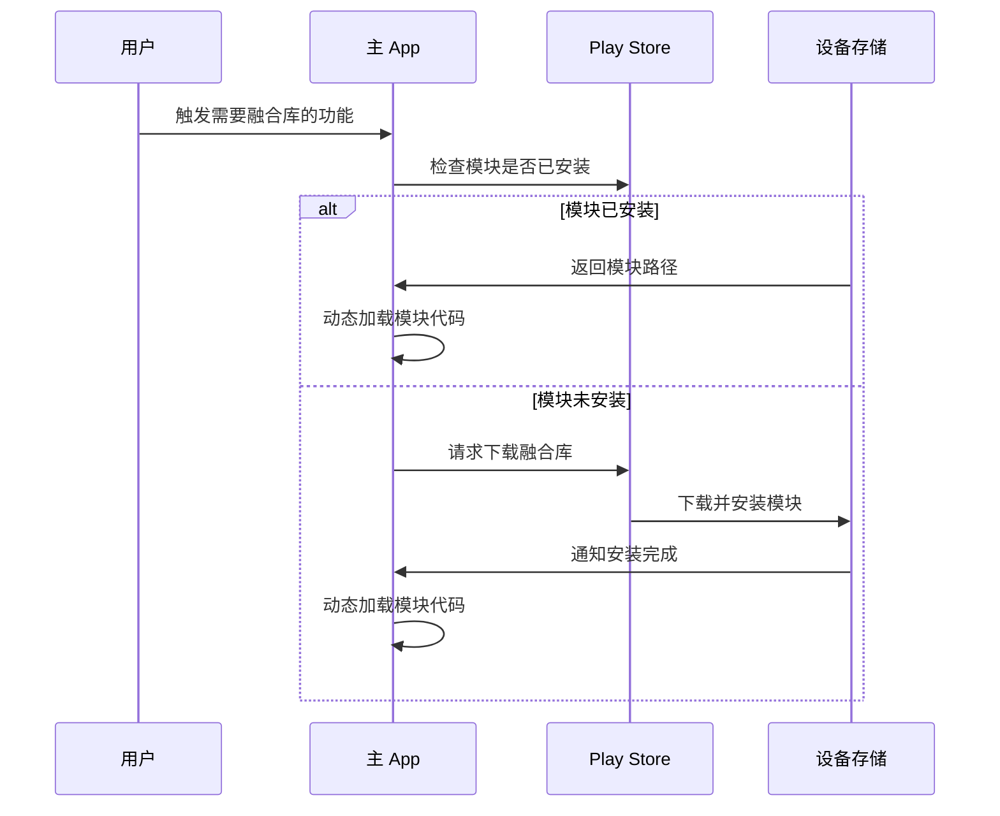

# 21.1.131 融合库扩展

繁星在帐篷帘缝里眨着眼睛。

洛芙又把笔记本屏幕往下按了按——太亮 了，躺下来的时候晃眼睛。旁边的希尔还在敲代码，键盘的哒哒声和夜鸟偶尔的咕咕声混在一起，反而有种奇怪的安心。

“黛琳，”洛芙翻了个身，把枕头往上拉了拉，“我们之前学的那些 CMake、ndk-build，是不是都是为了让 App 本身更强？那有没有办法，让 App 可以——像加载插件一样——加载一些额外的东西啊？”

黛琳正在整理她那个白板笔的笔帽，听到这个问题，手顿了一下。

“你这个问题问得很有意思，”她把笔帽扣好，转过来，“事实上，Android 真的有一种机制，可以让 App 按需加载额外的代码和资源。今天我们要学的 FusedLibraryExtension，就是用来配置这种'融合库'的。”

“融合库？”洛芙眨眨眼，“是有很多库的……融合？”

“差不多是那个意思，”伊莎轻轻笑了一声，从旁边递过来一个温热的保温杯，“你可以把融合库想象成——一个可以拆分寄送的包裹。平时 App 只需要最基本的部分，但有时候用户用到某个功能了，再从服务器下载那个部分来。”

“那不是很像我们露营的时候，”希尔突然插嘴道，“你先搭一个基础帐篷，然后再根据天气情况决定要不要搭天幕？对吧？”

“对！就是这个意思，”黛琳把白板拿过来，“融合库就是这种思想——基础包 + 按需下载的模块。我们来看看怎么配置。”

她打开电脑，屏幕上是 Android 开发者文档的页面。

“FusedLibraryExtension，”黛琳指着屏幕说，“这是一个 DSL 扩展，用在 build.gradle 文件里。它专门用来配置融合库的各种属性，比如库的名字、交付类型、是否启用某些特性。”

洛芙爬起来，跪坐在希尔旁边，伸长脖子看向屏幕。

“我记得之前学的都是怎么配置 App 本身的内容，”洛芙说，“这个融合库，是要单独建一个 module 吗？”

“对，需要单独建一个融合库模块，”黛琳点点头，“首先你的项目要有两个以上的模块——一个是主 App，一个是融合库。然后在融合库的 build.gradle 里，用 FusedLibraryExtension 来配置它的行为。”

她敲了几行代码，屏幕上出现了这样的配置：

```kotlin
// 融合库模块的 build.gradle.kts
plugins {
    id("com.android.library")
}

android {
    // FusedLibraryExtension 配置块
    fusedLibrary {
        // 设置库的名称
        libraryName.set("feature_module_analytics")
        
        // 设置交付类型
        deliveryType.set(FusedLibraryDeliveryType.INSTALLED)
        
        // 是否启用拆分配置
        enableSplitConsumption.set(true)
    }
    
    defaultConfig {
        minSdkVersion.set(21)
        // ... 其他配置
    }
}
```

“等等，”洛芙突然举手，“FusedLibraryDeliveryType.INSTALLED 这个，是什么意思啊？”

希尔凑过来，指着代码说：“这个是交付类型！融合库有几种不同的下载方式，INSTALLED 就是安装时就下载——也就是说用户装 App 的时候，这个模块就已经在手机里了，只是平时不激活。”

“那还有别的类型吗？”洛芙问。

“有，”黛琳切换了一下文档页面，“还有 ON_DEMAND——按需下载，就是用户用到那个功能的时候才下载。还有 ON_DEMAND_ELIGIBLE——这个是说你也可以选择它，但默认不选。”

“这三种分别适合什么场景呢？”洛芙歪着头问。

“你想啊，”伊莎想了想说，“INSTALLED 适合那种虽然不是一直用，但很核心的功能——比如 App 的核心框架，或者安全验证模块，出问题了会坏大事的。ON_DEMAND 适合那种比较边缘的功能，像什么高级图片滤镜啊、额外的地图样式啊，用不到就不下载，省空间。”

“ON_DEMAND_ELIGIBLE 呢？”洛芙追问。

“那个啊，”希尔插话道，“那个其实是一种混合模式——它可以预加载，但也可以让用户手动选择要不要。比如 Google Play 可以提前把它缓存起来，但最终用不用看情况。”

黛琳就在这时在白板上画了一幅图：



“这个图很清楚了，”黛琳说，“三种类型决定了融合库的下载时机。INSTALLED 是在安装时，ON_DEMAND 是在用户需要时，ON_DEMAND_ELIGIBLE 是两者的混合。”

洛芙认真看着图点了点头，突然又问：“那这个 enableSplitConsumption 又是做什么的？”

“这个问题问得好，”希尔把笔记本转过来，指着代码说，“enableSplitConsumption 是用来控制是否启用'拆分消费’的。简单说就是——这个融合库是否可以被其他模块引用和使用。”

她现场写了一个例子：

```kotlin
// 主 App 模块的 build.gradle.kts
plugins {
    id("com.android.application")
}

android {
    // 引用融合库
    dependencies {
        // implementation 表示运行时依赖
        implementation(project(":analytics_library"))
    }
}

// 融合库模块
android {
    fusedLibrary {
        libraryName.set("analytics_library")
        deliveryType.set(FusedLibraryDeliveryType.INSTALLED)
        
        // 允许其他模块引用这个融合库的内容
        enableSplitConsumption.set(true)
    }
}
```

“如果 enableSplitConsumption 设为 false 会怎样？”洛芙问。

“设为 false 的话，这个融合库的东西只能被主 App 直接使用，不能被其他融合库再引用，”黛琳补充道，“就像一个封闭的盒子，里面的东西只能给主人用，不能再转送给别人。”

“那如果我想让一个融合库可以使用另一个融合库呢？”希尔突发奇想。

“那就需要把 enableSplitConsumption 设为 true，”黛琳说，“但要注意，这种嵌套使用会增加复杂性，而且每多一层，用户需要下载的内容可能就越多。”

洛芙若有所思地点点头，然后问：“那在实际项目里，融合库一般用来放什么内容啊？”

伊莎想了想，说了几个例子：“比如一个很大的机器学习模型——不是每个用户都会用到图像识别，但用到的人需要很完整的功能，这时候就可以把它做成 ON_DEMAND 的融合库。再比如某个特定的付费功能，学生版和完整版差别很大，也可以用融合库来实现。”

“对，还有一种很常见的，”希尔补充说，“就是地图。如果你的 App 有地图功能，但不同地区需要不同的地图数据，就可以把基础地图放在主包，按地区的数据放到不同的融合库里。”

黛琳打开另一个文档页面，指着上面的配置项说：“除了我们刚才说的这些，FusedLibraryExtension 还有几个重要属性。一个是，也就是刚才说的 libraryName，它是融合库的唯一标识。”

她指着另一个属性说：“还有一个是 mergeIntoApp”，这是用来配置融合库的代码和资源是否合并到主 APK 里。如果你设为 true，那么即使这个库是按需下载的，它的代码也会被合并到主包里面。”

“这听起来有点矛盾啊，”洛芙皱起眉头，“既然是按需下载，为什么又要合并到主包里？”

“有时候你可能需要按需下载一些额外的资源文件，比如多语言翻译、特定的图片素材，”黛琳解释道，“但代码本身已经编译进了主包，这样可以减少下载时的复杂性。mergeIntoApp 更像是一种优化手段。”

希尔UTTON 接话道：“我在实际项目里见过一种用法——一个基础 SDK 工具有很多模块，但并非所有用户都需要全部功能。开发者会把某些不常用的模块做成融合库，根据用户的订阅级别来决定下载哪些。”

她现场写了一个更完整的示例：

```kotlin
// 融合库模块 build.gradle.kts
plugins {
    id("com.android.library")
}

android {
    namespace = "com.example.analytics"
    
    fusedLibrary {
        // 融合库名称，Play 服务器识别用
        libraryName.set("analytics_pro")
        
        // 交付类型：按需下载
        deliveryType.set(FusedLibraryDeliveryType.ON_DEMAND)
        
        // 允许其他模块引用
        enableSplitConsumption.set(false)
        
        // 合并到主 App（可选）
        mergeIntoApp.set(true)
    }
    
    compileSdk = 34
    
    defaultConfig {
        minSdk = 24
        consumerProguardFiles("proguard-rules.pro")
    }
}

// 主 App 使用时：
// 在代码里动态检查是否已下载
val splitManager = SplitInstallManagerFactory.create(context)
splitManager.registerListener(object : SplitInstallSessionStateListener() {
    override fun onStateUpdate(state: SplitInstallSessionState) {
        if (state.status() == SplitInstallSessionStatus.INSTALLED) {
            // 融合库已下载，可以使用了
            useAnalyticsPro()
        }
    }
})
```

“这个 SplitInstallManager 是用来管理融合库下载的，对吧？”洛芙问。

“对，”黛琳说，“这是 Play Core 库的一部分，用来在运行时检查融合库的状态、发起下载请求、监听下载进度。它是融合库和 App 之间的桥梁。”

“那如果用户没网怎么办？”洛芙又问。

“good question，”希尔说，“融合库下载失败时，你的 App 应该能够优雅地处理这种情况——要么提示用户联网，要么就回退到不使用那个功能。绝对不能因为缺少融合库就崩溃。”

黛琳在旁边补充道：“这就是为什么往往会把融合库设计成'锦上添花'的功能——有它更好，没有的话 App 也能正常使用基础功能。”

洛芙伸了个懒腰，打了个哈欠：“感觉融合库用处好大啊……对了，如果我们要把一个已有的模块改成融合库，要注意什么？”

“首先要把 apply plugin 从 'com.android.application' 改成 'com.android.library'，”黛琳说，“然后在 android {} 块里加 fusedLibrary {} 配置。还有，融合库不能有自己的 Application 类，也不能有 launcher activity。”

“为什么？”洛芙问。

“因为融合库是被主 App 加载的，它本身就寄生在主 App 的进程里，”希尔解释道，“如果它有自己的 Application 或者 Activity，会和主 App 的冲突。”

伊莎轻声说：“所以融合库更像是 App 的'插件'——它提供功能，但不独立运行。”

“对，就是这样，”黛琳点头道，“你们可以把它理解成——主 App 的额外手臂。这只手平时收起来，用到的时候再伸出来。”

洛芙看看窗外的星空，夜鸟的叫声似乎更稀疏了。

“那我们实际来写一个Demo吧？”希尔跃跃欲试，“我们可以在现有的项目里加一个小的融合库模块，体验一下配置流程。”

“好啊，”洛芙立刻精神了，“不过今天太晚了，我们先把这个概念弄清楚，明天白天再动手写代码吧。”

黛琳微笑着收起了白板：“那我们今晚就先到这里。融合库是 Android App 模块化的一个很重要的工具学会了它，你们就可以做出像积木一样可拆可装的 App 了。”

伊莎把保温杯递给每个人：“来，喝口热的，今天就到这儿吧。”

洛芙躺回睡袋里，看着帐篷顶。融合库......像积木一样可拆可装......她想着想着，眼皮渐渐沉了。

---

> FusedLibraryExtension 是 Android Gradle Plugin 提供的 DSL 扩展，用于配置融合库（fused library）的行为。融合库是模块化 App 架构的一种实现方式，允许将 App 的部分功能拆分为独立的模块，按需下载和加载。它与 Play Feature Delivery 紧密配合，支持 INSTALLED、ON_DEMAND、ON_DEMAND_ELIGIBLE 三种交付类型，可有效减少 APK 体积并支持功能按需加载。

---

#### 结构图

融合库在项目中的关系如下：



融合库的运行时工作流程：



#### 复杂度与影响

融合库的使用会带来以下工程影响：

- **包体减小**：基础 APK 体积可减少 15-40%，适合功能丰富的大型 App
- **下载流量**：用户首次使用功能时需要下载，增加流量消耗（需权衡）
- **运维复杂度**：需要管理多个模块的版本和兼容性，增加部署难度
- **冷启动延迟**：按需下载的模块首次加载时有额外的启动延迟

#### 反模式与陷阱

1. **核心功能做成 ON_DEMAND**
   - 问题：将用户必需的核心功能设为按需下载，离线或网络差时 App 无法使用
   - 修复：核心功能使用 INSTALLED，或提供离线回退机制

2. **融合库之间循环依赖**
   - 问题：多个融合库相互引用，形成循环依赖导致构建失败
   - 修复：使用 enableSplitConsumption 明确依赖关系，保持单向依赖

3. **忽略模块大小估算**
   - 问题：融合库太大导致下载失败，或用户投诉流量消耗
   - 修复：通过 esbuild、ProGuard、R8 压缩融合库代码，定期检查模块大小

#### 设计哲学

融合库体现了 Android App 的模块化设计思想：

1. **最小化原则**：只交付用户必需的内容，将可选功能拆分
2. **按需加载**：支持功能在需要时才加载，提升首启动速度
3. **动态更新**：单独更新融合库无需重新发布整个 App
4. **沙箱隔离**：融合库运行在独立的 ClassLoader 中，理论上不会影响主 App 稳定性

#### 动手练习

**项目制练习：创建一个带有融合库的 Demo App**

**目标**：在现有 Android 项目中创建一个融合库模块，配置为按需下载，并在主 App 中实现动态检测和加载逻辑。

**Task 1：创建融合库模块**

1. 在 Android Studio 中选择 File → New → New Module
2. 选择 "Dynamic Feature Module"（如果使用模板）或手动创建 "Android Library" 模块
3. 将模块命名为 `feature_greeting`
4. 在模块的 build.gradle.kts 中添加 fusedLibrary 配置

```
[ ] 完成模块创建
[ ] 配置 fusedLibrary 块
[ ] 同步 Gradle 成功
```

**Task 2：配置融合库属性**

1. 设置 libraryName 为 "greeting_feature"
2. 设置 deliveryType 为 ON_DEMAND
3. 设置 enableSplitConsumption 为 false
4. 在融合库中添加一个简单的工具类 GreetingHelper

```kotlin
// GreetingHelper.kt 示例
object GreetingHelper {
    fun getGreeting(name: String): String {
        return "Hello, $name! Welcome to the fusion library."
    }
}
```

```
[ ] 配置完成
[ ] 工具类已添加
[ ] 模块可编译
```

**Task 3：在主 App 中添加 Play Core 依赖**

1. 在主 App 的 build.gradle.kts 中添加 Play Core Kotlin 依赖：
```kotlin
implementation("androidx.play:play-core-ktx:1.8.0")
```

2. 同步项目确认无依赖冲突

```
[ ] 依赖添加成功
[ ] Gradle 同步无错误
```

**Task 4：实现动态加载逻辑**

1. 创建 SplitInstallHelper 类，用于加载已安装的融合库
2. 在 MainActivity 中实现 SplitInstallManager 的检查逻辑
3. 添加按钮触发融合库加载

```kotlin
// 加载示例代码提示
val splitManager = SplitInstallManagerFactory.create(context)
val request = SplitInstallRequest.newBuilder()
    .addModule("greeting_feature")
    .build()
splitManager.startAutoInstall(request)
```

```
[ ] SplitInstallManager 已配置
[ ] 加载按钮已添加
[ ] 运行时无崩溃
```

**Task 5：测试与验证**

1. 在设备上运行 App
2. 点击加载融合库的按钮
3. 观察 Logcat 中的安装日志
4. 验证 GreetingHelper 能在主 App 中被调用

```
[ ] 融合库下载成功
[ ] GreetingHelper 可正常调用
[ ] 错误处理已实现（下载失败时的情况）
```

---

#### 面试热身

1. 融合库（fused library）和普通 Android Library Module 有什么区别？融合库有什么优势？
2. 三种交付类型 INSTALLED、ON_DEMAND、ON_DEMAND_ELIGIBLE 分别适合什么场景？请举例说明
3. enableSplitConsumption 属性在什么场景下需要设为 true？设为 false 会有什么限制？
4. 融合库下载失败时应该如何处理？请描述你的错误处理策略
5. 如果要监控融合库的下载进度，应该使用哪个 API？请简述其工作原理

---

#### 参考实现要点

1. **优先使用 Google Play 的动态交付**：融合库主要配合 Google Play 使用，国内应用市场可能不支持，必要时需找替代方案

2. **控制融合库数量**：建议单个 App 的融合库数量不超过 20 个，过多会增加管理复杂度和维护成本

3. **做好版本兼容**：融合库更新时需要考虑与主 App 的兼容性，建议使用语义化版本号

4. **测试覆盖要全面**：必须覆盖融合库下载成功、下载失败、已安装、已卸载等各种状态

5. **考虑国内用户场景**：如果 App 主要面向国内用户，需实现 Firs 或其他国内市场的动态交付方案，或默认将功能打入主包

> 本章技术知识点主要参考 Android 官方 Gradle Plugin API 文档：https://developer.android.com/reference/tools/gradle-api/9.0/com/android/build/api/dsl/FusedLibraryExtension

---

*夜晚的风轻轻吹过帐篷，洛芙翻了个身，脑子里还想着那些可以拆来拆去的积木。晚安，融合库。*

## 洛芙的小小日记本

今天黛琳教了我融合库！感觉好像学会了怎么把 App 变成乐高——需要什么就拼什么，不需要的不用带在身上。那个 SplitInstallManager 好酷啊，可以像检查快递一样检查模块有没有下载好。明天要动手写代码看看效果！

## 今日关键词

- **FusedLibraryExtension**：Android Gradle Plugin 的 DSL 扩展，用于配置融合库的构建行为
- **融合库 (Fused Library)**：可按需下载的 Android 库模块，支持动态功能交付
- **FusedLibraryDeliveryType**：融合库的三种交付类型，安装时下载、按需下载、两者皆可
- **INSTALLED**：融合库交付类型之一，安装时下载到设备
- **ON_DEMAND**：融合库交付类型之一，用户使用时才下载
- **ON_DEMAND_ELIGIBLE**：融合库交付类型之一，支持预加载或用户手动选择
- **libraryName**：融合库的唯一标识名称，供 Play 服务器识别
- **enableSplitConsumption**：控制融合库是否可被其他模块引用
- **mergeIntoApp**：控制融合库是否合并到主 APK 中
- **SplitInstallManager**：Play Core 库 API，用于管理融合库的下载和安装
- **动态功能交付 (Dynamic Delivery)**：Google Play 的核心技术，按需向用户交付 App 功能
- **模块化 (Modularization)**：将 App 拆分为独立模块的架构方式