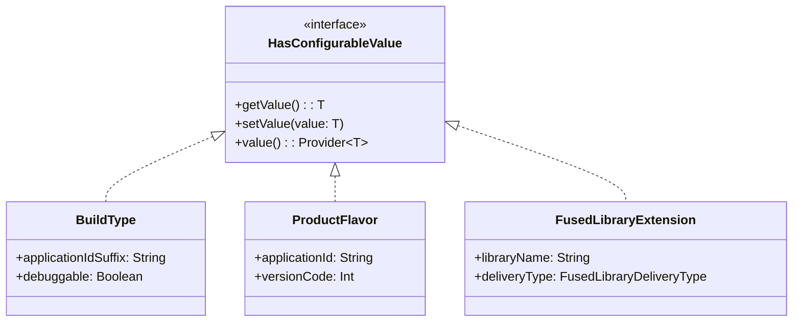
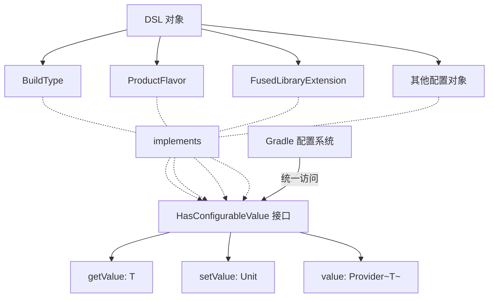
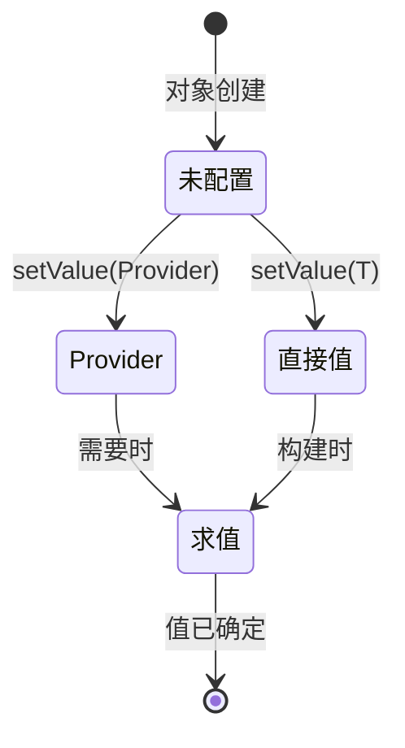

# 21.1.132 HasConfigurableValue

清晨的第一缕阳光透过帐篷的纱窗帘子溜进来，在洛芙的脸上投下细碎的光斑。

她迷迷糊糊地翻了个身，发现旁边的希尔已经醒了，正盘腿坐在睡袋里，膝盖上放着一台笔记本电脑，屏幕的光映在她的眼睛里。

“希尔......这么早你在看什么？”洛芙揉了揉眼睛，声音还带着刚睡醒的黏糊。

“在看我们昨天学的融合库代码呢，”希尔轻声说生怕吵醒其他人，“我想把它改造成可以动态配置的版本——你知道吗，有些属性我想让用户可以在构建时自己调整。”

黛琳也被她们的对话吵醒了，撑着手臂坐起来：“动态配置？那个思路挺对的，正好我们今天要学的就是这个——HasConfigurableValue。”

“谁？”洛芙一下子清醒了，“Has什么？”

“HasConfigurableValue，”黛琳重复了一遍，看看窗外的晨光，“这是一个接口——可以说是 Android Gradle Plugin 里所有可配置对象的‘妈妈’。几乎所有可以配置的 DSL 对象，都 implements 它。”

伊莎也被吵醒了，她揉了揉眼睛，轻声说：“就像......露营餐具里的基础套餐？不管你带什么其他的，筷子勺子总是基础的、必须的？”

“对，这个比喻很贴切，”黛琳微笑着说，“HasConfigurableValue 就是所有可配置对象的‘基础套餐’。它定义了一套统一的 API，让你可以读取和设置各种配置值。”

---

## 什么是 HasConfigurableValue

希尔把笔记本转到三个人都能看到的方向，屏幕上是一个接口定义的简化版：

```kotlin
/**
 * 代表具有可配置值的对象接口
 */
interface HasConfigurableValue<T> {
    // 获取当前配置值
    fun getValue(): T
    
    // 设置配置值
    fun setValue(value: T)
    
    // 以 provider 形式获取值（延迟计算）
    fun value(): Provider<T>
    
    // 设置为一个固定值
    fun setValue(value: Provider<out T>)
}
```

“看起来好简洁啊，”洛芙说，“就这几个方法？”

“表面上是这几个方法，但背后涉及到 Gradle 的配置延迟求值机制，”黛琳解释说，“你会发现很多 DSL 对象都实现了这个接口——比如我们之前学过的 BuildType、ProductFlavor、FusedLibraryExtension 等等。”

“为什么需要这么一层接口呢？”洛芙有点不解，“直接给每个类写 getter setter 不也行吗？”

“好问题，”伊莎想了想，“你想啊——如果每个类都自己写一套 getter setter，那 Gradle 的构建系统要理解它们就很麻烦了。但有了这个统一接口，Gradle 可以用同样的方式访问任意可配置对象的值。”

希尔在白板上画了一幅简图：



“你看，”黛琳指着图说，“所有这些 DSL 对象都实现了 HasConfigurableValue 接口。Gradle 可以统一地通过这个接口来访问它们的值。”

---

## 配置值的两种形式：直接值与 Provider

“还有一个很重要的概念，”黛琳说，“就是配置值可以有两种形式——直接值，和 Provider。”

“Provider？”洛芙眨眨眼，“是那种‘供应商’的意思？”

“对，你可以把它想象成一个‘值的供应商’，”希尔解释道，“直接值是你直接给它一个具体的数，而 Provider 是你给它一个以后会产出值的工厂。”

她在屏幕上敲了一个对比示例：

```kotlin
// 方式一：直接值
android {
    defaultConfig {
        // 直接给一个具体的数字
        applicationId.set("com.example.myapp")
        versionCode.set(1)
    }
}

// 方式二：Provider（延迟求值）
android {
    defaultConfig {
        // 用 Provider 包装，延迟计算
        applicationId.set(project.provider { "com.example.${project.name}" })
        versionCode.set(project.provider { 
            // 复杂的版本计算逻辑
            val major = 1
            val minor = project.hasProperty("minor") 
                .let { if (it) project.property("minor").toString().toInt() else 0 }
            major * 1000 + minor
        })
    }
}
```

“两种方式有什么区别呢？”洛芙问。

“简单说，”伊莎轻声解释，“直接值就像你在露营前直接打包好所有东西——出发前就知道带的是什么。Provider 呢，就像你说‘到了营地我再根据天气决定带什么’——值是到了构建的时候才计算出来的。”

“这样啊，”洛芙若有所思，“那 Provider 有什么好处？”

“好处大了，”希尔说，“最大的好处是可以实现‘延迟求值’——值不到真正需要的时候不计算。这在大型项目里很重要，因为有些值可能依赖其他任务的完成，你不能一开始就确定它。”

黛琳补充道：“而且 Provider 之间可以组合——你可以把一个 Provider 的输出作为另一个 Provider 的输入，形成流水线式的计算图。”

她在白板上画了一个流程图：

```mermaid
flowchart LR
    A[项目属性<br/>project.name] --> B[Provider~String~]
    B --> C[字符串拼接<br/>"com.example.{name}"]
    C --> D[Provider~String~]
    D --> E[applicationId]
    
    F[版本计算任务] --> G[Provider~Int~]
    G --> H[versionCode]
```

“这个图展示了 Provider 的组合方式，”黛琳说，“项目名经过 Provider 转换后变成 applicationId，版本计算任务的结果变成 versionCode。”

---

## 实际的配置场景

“我们来看一个真实的配置场景，”希尔说，“假设我们要配置一个 App 的多个构建变体，每个变体有不同的 package name 和 versionCode。”

她在电脑上敲出了一个更完整的示例：

```kotlin
// build.gradle.kts (Module: app)

android {
    // 配置默认配置
    defaultConfig {
        applicationId.set("com.example.camping")
        versionCode.set(1)
        versionName.set("1.0.0")
    }
    
    // 配置构建类型
    buildTypes {
        debug {
            // setValue 接受直接值
            applicationIdSuffix.set(".debug")
            debuggable.set(true)
            // 也可以接受 Provider
            versionName.set(project.provider { "debug-${project.version}" })
        }
        release {
            applicationIdSuffix.set(null)  // 不添加后缀
            debuggable.set(false)
            minifyEnabled.set(true)
            versionName.set(project.provider { project.version.toString() })
        }
    }
    
    // 配置产品风味
    flavorDimensions += "environment"
    productFlavors {
        create("dev") {
            dimension = "environment"
            applicationIdSuffix.set(".dev")
            versionCode.increment()  // 动态增加版本号
        }
        create("prod") {
            dimension = "environment"
            // 生产环境不添加后缀
        }
    }
}
```

“等等，”洛芙突然问，“我在 debug 那个地方看到 applicationIdSuffix.set(null)，这也可以？把值设为 null？”

“对，这是 HasConfigurableValue 的一个特点，”黛琳解释说，“它允许你把值设为 null，表示‘不使用这个配置’或者‘使用默认值’。这在某些场景下很重要——比如你想覆盖一个从其他地方继承来的默认值，把它改回默认状态。”

希尔补充道：“还有一个常用的场景——条件配置。比如你可能想根据某些条件来决定是否启用某个配置：

```kotlin
// 根据项目属性动态决定配置
android {
    defaultConfig {
        // 如果项目有 'enableAnalytics' 属性且为 true 才配置
        if (project.hasProperty("enableAnalytics") 
            && project.property("enableAnalytics").toString().toBoolean()) {
            applicationId.set("com.example.camping.analytics")
        }
        
        // 使用 Provider 实现更复杂的条件逻辑
        val useProGuard = project.provider {
            project.hasProperty("useProGuard")?.let {
                project.property("useProGuard").toString().toBoolean()
            } ?: false
        }
        minifyEnabled.set(useProGuard)
    }
}
```

---

## 值的变化监听与回调

“还有一个很实用的功能，”黛琳说，“就是监听配置值的变化。”

“在构建过程中，如果某个值被修改了，你可能想做一些事情，”她继续说，“比如打印日志、触发重新配置、或者清理缓存。”

希尔调出了一个监听器示例：

```kotlin
// 监听配置值的变化
android {
    defaultConfig {
        val versionCodeProp = versionCode
        
        // 使用 afterEvaluate 在所有配置解析完成后监听
        project.afterEvaluate {
            versionCodeProp.observe { oldValue, newValue ->
                logger.quiet("versionCode changed: $oldValue -> $newValue")
            }
        }
    }
    
    // 对于 BuildType 等对象，也可以直接监听
    buildTypes {
        getByName("debug") {
            val debuggableProp = debuggable
            debuggableProp.observe { wasChanged, isNow ->
                println("debuggable changed: $wasChanged -> $isNow")
            }
        }
    }
}
```

“observe 方法来自 HasConfigurableValue 的扩展？”洛芙问。

“对，”黛琳点头说，“这是一个扩展函数。它内部使用了 Gradle 的监听机制，当值真正发生变化时会触发回调。注意这个监听是在构建配置阶段触发的，不是在运行时。”

伊莎轻声说：“这种监听机制在大型项目里很有用——比如你想确保某个关键配置被正确设置，或者想在不同配置之间做联动。”

---

## 实际项目中的使用模式

“我们来看几个实际项目中常见的使用模式，”希尔说，“第一个是‘继承加覆盖’。”

她在屏幕上敲出了示例：

```kotlin
// 模式一：基础配置 + 变体覆盖
android {
    defaultConfig {
        // 基础配置
        minSdkVersion.set(21)
        targetSdkVersion.set(34)
    }
    
    // 在特定构建类型中覆盖
    buildTypes {
        getByName("debug") {
            // 覆盖默认值
            minSdkVersion.set(23)  // debug 版本要求更高
            applicationIdSuffix.set(".debug")
        }
    }
}

// 模式二：多模块继承
// 在 library 模块
android {
    defaultConfig {
        minSdkVersion.set(21)
    }
}

// 在 app 模块继承 library 的配置并加强
android {
    defaultConfig {
        minSdkVersion.set(24)  // 覆盖为更高的值
    }
}
```

“还有一种常见模式是‘动态计算’，”黛琳补充说，“比如根据 Git 提交数自动生成 versionCode：

```kotlin
// 动态计算版本号
android {
    defaultConfig {
        // 从 Git 获取提交数作为 versionCode
        versionCode.set(project.provider {
            try {
                val result =exec {
                    workingDir(project.rootDir)
                    commandLine("git", "rev-list", "--count", "HEAD")
                    standardOutput = PipedOutputStream()
                }
                result.output.trim().toInt()
            } catch (e: Exception) {
                1  // 获取失败时默认值为 1
            }
        })
    }
}
```

洛芙看着这些代码，有点惊叹：“感觉可以做很多事情啊......那有没有什么需要注意的坑？”

“问得好，”黛琳严肃起来，“最大的坑是在配置阶段过早访问值。”

她画了一个时间线图：

```mermaid
gantt
    title Gradle 构建阶段与配置值访问时机
    dateFormat X
    axisFormat %s
    
    section settings 阶段
    settings.gradle 解析: 0, 5
    
    section 配置阶段
    build.gradle 解析: 5, 20
    DSL 对象创建: 10, 15
    
    section 执行阶段
    task 执行: 20, 80
    
    section 运行时
    APK 安装与执行: 80, 100
    
    section ⚠ 常见错误
    过早访问值: crit, 12, 18
```



“比如你在创建对象时就直接调用 getValue()，”黛琳解释说，“但这时候配置阶段还没结束，其他配置可能还没应用上去。你应该等到配置完成后再用 Provider 去获取值。”

希尔补充了一个反面教材：

```kotlin
// ❌ 错误示例：在配置阶段过早访问
android {
    defaultConfig {
        // 这个值可能还不是最终的
        val currentVersionCode = versionCode.get()  // 可能还是不正确的中间值
        versionCode.set(currentVersionCode + 1)
    }
}

// ✅ 正确示例：使用 Provider 延迟访问
android {
    defaultConfig {
        // Provider 会在需要时求值
        val nextVersionCode = versionCode.map { it + 1 }
        versionCode.set(nextVersionCode)
    }
}
```

---

## 与 DSL 对象的协作

“我们已经把 HasConfigurableValue 的基本概念差不多讲完了，”黛琳总结道，“现在你们知道为什么几乎所有 DSL 对象都实现这个接口了吧？”

洛芙点头：“因为这样 Gradle 可以用统一的方式配置它们！不管你是 BuildType 还是 ProductFlavor 还是其他什么，都用同样的 API。”

“对了，”希尔突然想起什么，“我们之前学的 FusedLibraryExtension 也实现了这个接口。要不要看看它具体是怎么用的？”

她调出了 FusedLibraryExtension 的定义片段：

```kotlin
/**
 * 融合库扩展
 * 实现了 HasConfigurableValue 接口
 */
abstract class FusedLibraryExtension : HasConfigurableValue<FusedLibraryExtension> {
    // 库名称
    abstract val libraryName: Property<String>
    
    // 交付类型
    abstract val deliveryType: Property<FusedLibraryDeliveryType>
    
    // 是否启用拆分消费
    abstract val enableSplitConsumption: Property<Boolean>
    
    // 是否合并到主 App
    abstract val mergeIntoApp: Property<Boolean>
}
```

“你看，”黛琳指着代码说，“FusedLibraryExtension 实现了 HasConfigurableValue，提供了几个 Property 对象。每个 Property 本身也实现了类似的接口，你可以用相同的方式来配置它们。”

伊莎轻声说：“这就像露营时的装备清单——不管你要打包什么，都用同一种方式来决定带不带、带多少。”

---

帐篷外的阳光越来越亮了，鸟叫声也变得更加清脆。洛芙钻出帐篷，深深吸了一口气——清晨的空气带着露水和青草的清香，让人精神振奋。

“我们在回去的路上再整理一下今天的内容吧，”黛琳收起白板说，“HasConfigurableValue 虽然只是一个小小的接口，但它贯穿了整个 Android Gradle 的配置系统。理解了它，你们以后看任何 DSL 对象都不会觉得陌生了。”

希尔把电脑收进包里：“走吧，我们去找个地方吃早餐然后返程。今天学的东西要是在实际操作一下，可能会理解得更深。”

洛芙最后回头看了一眼昨晚篝火的地方，余温还在，露水在晨光中闪烁。

HasConfigurableValue......她默默记住这个名字。也许以后配置 Gradle 构建时，会经常和它打交道呢。

---

> HasConfigurableValue 是 Android Gradle Plugin DSL API 中的核心接口，定义了可配置值对象的基本行为规范。它提供了 getValue()、setValue()、value() 等方法，用于读取和设置配置值。所有 DSL 配置对象（如 BuildType、ProductFlavor、ProductFlavorDimension 等）都实现了该接口，使得 Gradle 可以用统一的方式访问和操作各种配置属性。

---

#### 结构图

HasConfigurableValue 接口在 DSL 系统中的位置：



配置值的生命周期：



#### 复杂度与影响

- **接口简化**：统一 API 降低学习成本
- **延迟求值**：Provider 机制提升大型项目构建性能
- **类型安全**：Generic 泛型提供编译时检查

#### 反模式与陷阱

1. **过早调用 getValue()**
   - 问题：在配置阶段调用 getValue() 可能获取不到最终值
   - 修复：使用 Provider延迟访问，或在 afterEvaluate 回调中访问

2. **Provider 与直接值混用导致混淆**
   - 问题：代码中混合使用 Provider 和直接赋值，难以追踪最终值
   - 修复：统一使用一种方式，或明确标注混合使用的场景

3. **null 值处理不当**
   - 问题：有些配置项不支持 null，不做判断直接 setValue(null) 导致构建失败
   - 修复：先判断对象是否支持 null，使用 requireNotNull 或默认值处理

4. **忽略 Provider 链式调用**
   - 问题：手动计算值而不利用 Provider.map/flatMap 组合
   - 修复：掌握 Provider 的组合方法，构建更灵活的配置逻辑

#### 设计哲学

HasConfigurableValue 接口体现了以下设计思想：

1. **统一接口**：不同类型的配置对象使用相同 API，降低复杂度
2. **延迟求值**：值不到需要时不计算，提升大规模项目的配置效率
3. **声明式**：配置即为代码，DSL 对象可直接赋值
4. **可观测性**：Provider 支持观察者模式，可在值变化时触发回调

#### 动手练习

**项目制练习：配置可动态调整的构建变体**

**目标**：创建一个 Demo 项目，实践使用 HasConfigurableValue 接口配置不同的构建变体。

**Task 1：创建项目并配置基础构建类型**

1. 在 Android Studio 创建新项目
2. 在 build.gradle.kts 中添加 debug 和 release 两种构建类型
3. 为每种构建类型配置不同的 applicationIdSuffix 和 versionName

```
[ ] 项目创建成功
[ ] debug 类型配置 applicationIdSuffix = ".debug"
[ ] release 类型关闭 debuggable
```

**Task 2：使用 Provider 实现动态 versionCode**

1. 在 defaultConfig 中使用 Provider 动态生成 versionCode
2. 尝试从项目属性或系统属性读取版本信息

```kotlin
// 提示代码
versionCode.set(project.provider {
    val base = 1000
    val buildNumber = project.hasProperty("buildNumber")
        .let { if (it) project.property("buildNumber").toString().toInt() else 0 }
    base + buildNumber
})
```

```
[ ] Provider 配置成功
[ ] Gradle 同步无错误
[ ] 可以在命令行覆盖构建号
```

**Task 3：实现配置监听**

1. 添加 afterEvaluate 回调监听 versionCode 变化
2. 打印日志观察配置求值时机

```kotlin
// 提示代码
project.afterEvaluate {
    val versionCodeProp = android.defaultConfig.versionCode
    versionCodeProp.observe { old, new ->
        logger.quiet("versionCode changed: $old -> $new")
    }
}
```

```
[ ] 监听器已添加
[ ] 构建时能看到日志输出
```

**Task 4：创建自定义 DSL 对象**

1. 创建一个实现 HasConfigurableValue 的自定义配置类
2. 在项目中使用该配置对象

```kotlin
// 提示代码
interface MyConfig : HasConfigurableValue<MyConfig> {
    val featureEnabled: Property<Boolean>
    val featureName: Property<String>
}
```

```
[ ] 自定义 DSL 已实现
[ ] 可以在 build.gradle 中使用
```

---

#### 面试热身

1. HasConfigurableValue 接口的主要作用是什么？它与具体的 DSL 对象（如 BuildType）是什么关系？
2. 解释一下 Provider 的概念。为什么在 Gradle 配置中使用 Provider 比直接赋值更好？
3. 什么是延迟求值（Lazy Evaluation）？它在大型项目的 Gradle 构建中有什么优势？
4. 如果在配置阶段过早调用 getValue() 会发生什么？如何避免这个问题？
5. 你如何在实际项目中使用 HasConfigurableValue 或 Provider 来实现动态配置？

---

#### 参考实现要点

1. **优先使用 Provider**：对于可能变化的值，使用 Provider 而不是直接赋值，可以获得更好的构建性能和配置灵活性

2. **理解求值时机**：getValue() 会在配置阶段求值，value().get() 会在真正需要时求值，不要混淆

3. **注意 null 处理**：并非所有属性都支持 null，查阅文档确认后再使用 setValue(null)

4. **利用 afterEvaluate**：需要确保所有配置完成后再访问值时，使用 afterEvaluate 回调

5. **构建缓存友好**：使用 Provider 可以更好地利用 Gradle 构建缓存，因为配置结果可以缓存

> 本章技术知识点主要参考 Android 官方 Gradle Plugin API 文档：https://developer.android.com/reference/tools/gradle-api/9.0/com/android/build/api/dsl/HasConfigurableValue

---

*清晨的阳光渐渐强烈起来，洛芙最后看了一眼湖面——波光粼粼，像撒了一把碎金子。她们收拾好帐篷，踏上了回家的路。HasConfigurableValue 这个名字，在洛芙脑海里慢慢沉淀下来。也许下次再配置 Gradle 的时候，她会想起这个清晨的学习。*

## 洛芙的小小日记本

今天早上学的 HasConfigurableValue 好像我们露营时的基础装备套餐——不管你要配置什么 BuildType 还是 ProductFlavor都用它！Provider 很特别，像是延迟满足的魔法，等真正需要时才算出值。黛琳说过段时间等我们熟练了，就可以自己写 DSL 对象了诶！好期待！

## 今日关键词

- **HasConfigurableValue**：Android Gradle Plugin DSL API 中的接口，定义可配置值对象的基本行为
- **Provider**：Gradle 中的延迟求值容器，包装可能变化的计算结果
- **getValue()**：获取当前配置的直接值
- **setValue()**：设置配置值（可接受直接值或 Provider）
- **Property**：继承自 Provider 的可写属性接口
- **延迟求值 (Lazy Evaluation)**：值不到需要时不计算的机制
- **DSL (Domain Specific Language)**：领域特定语言，Gradle 使用 DSL 定义构建配置
- **buildTypes**：构建类型配置块（debug、release）
- **productFlavors**：产品风味配置块
- **defaultConfig**：默认配置块
- **afterEvaluate**：Gradle 回调，在所有项目配置评估完成后执行