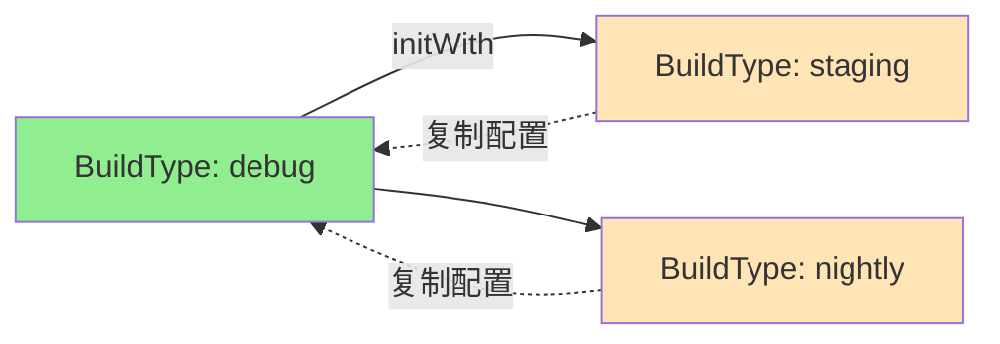
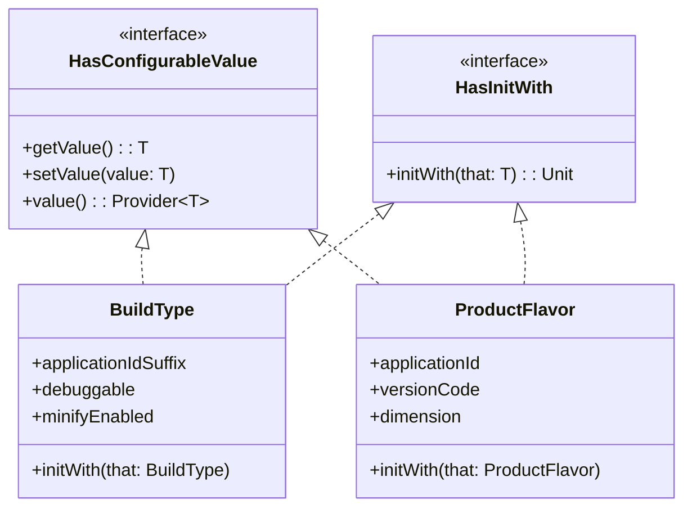
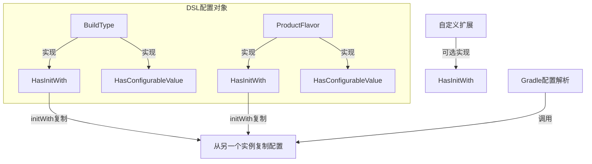
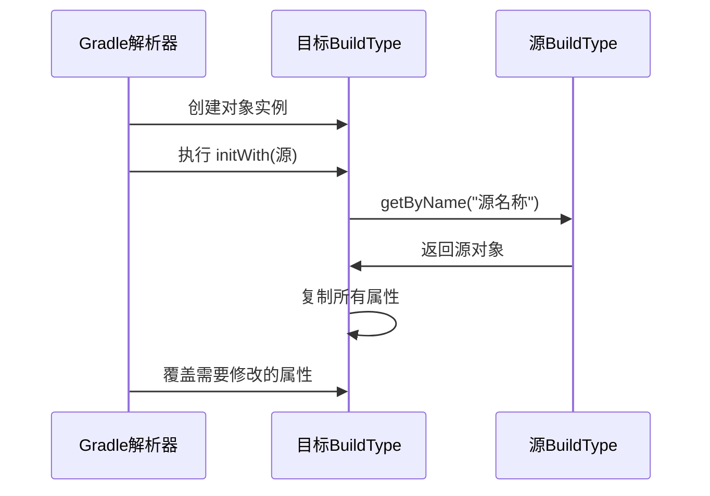

# 21.1.133 HasInitWith

上午的阳光透过帐篷帘子照进来，比清晨更加明亮。洛芙发现希尔已经在整理她的笔记本电脑了，屏幕上是满满的 build.gradle.kts 代码。

“希尔，你在干什么？”洛芙凑过去看。

“我在想能不能把 debug 类型的配置复制到另一个测试用的构建类型上，”希尔解释说，“它们大部分配置都一样，只有一点点不同。要是可以直接复制就不用写两遍了。”

“那是不是就是我们刚才学的那个什么......HasConfigurableValue 的进阶？”洛芙问。

黛琳正好醒了，听到这话笑着说：“你记得挺快的。不过今天要学的更具体一些——HasInitWith，专门用来复制配置的接口。”

伊莎也坐了起来，她的头发睡得有点乱：“复制配置？就像......把一个背包里的东西直接拷贝到另一个背包里？”

“差不多是这个意思，”黛琳点点头，“而且是 Android Gradle Plugin 7.1 才加入的新功能。”

---

## 什么是 HasInitWith

希尔把笔记本转到大家面前，屏幕上是一个接口定义的简化版：

```kotlin
/**
 * 允许从另一个实例复制配置的接口
 * Added in Android Gradle Plugin 7.1.0
 */
interface HasInitWith<T : Any> {
    /**
     * 将另一个构建类型、产品风味或自定义扩展的配置复制到这个对象
     * @param that 来源对象
     * @return Unit
     */
    fun initWith(that: T): Unit
}
```

“就这么简单？”洛芙有点意外，“只有一个方法？”

“对，就一个 initWith，”黛琳说，“但它做的事很实用——复制另一个对象的全部属性。”

她画了一幅简图来说明：



“你看，”黛琳指着图说，“这三个构建类型，debug 是基础配置，staging 和 nightly 都可以从 debug 复制，然后在上面做一点点修改。这样就不用每次都从头写配置了。”

---

## 用在哪里：BuildType 和 ProductFlavor

“HasInitWith 主要用在 BuildType 和 ProductFlavor 上，”希尔说，“我们来看看具体例子。”

她在电脑上敲出了一个完整的 build.gradle.kts 示例：

```kotlin
android {
    // 定义基础构建类型
    buildTypes {
        debug {
            applicationIdSuffix = ".debug"
            debuggable = true
            minifyEnabled = false
            
            // 打印构建信息
            val buildTime = System.currentTimeMillis()
            println("Debug build time: $buildTime")
        }
        
        // 从 debug 复制配置到 release
        release {
            initWith(getByName("debug"))
            // 覆盖部分配置
            applicationIdSuffix = null  // 移除 debug 后缀
            debuggable = false
            minifyEnabled = true
            // release 特有的配置
            isCrunchPngs = true
        }
    }
    
    // 产品风味也可以这样用
    flavorDimensions += "environment"
    productFlavors {
        create("dev") {
            dimension = "environment"
            applicationIdSuffix = ".dev"
            versionCode = 1
            buildConfigField("String", "API_URL", "\"https://dev-api.example.com\"")
        }
        
        // 从 dev 复制到 staging
        create("staging") {
            initWith(getByName("dev"))
            applicationIdSuffix = ".staging"
            buildConfigField("String", "API_URL", "\"https://staging-api.example.com\"")
        }
        
        // 从 staging 复制到 prod
        create("prod") {
            initWith(getByName("staging"))
            applicationIdSuffix = null
            buildConfigField("String", "API_URL", "\"https://api.example.com\"")
        }
    }
}
```

“等等，”洛芙突然问，“initWith 是把配置整个复制过来，还是只复制一部分？”

“全部复制，”黛琳解释说，“initWith 会把来源对象的所有可配置属性都复制过来。然后你在后面可以覆盖任何想要改的。”

希尔补充道：“这就像你有一份基础装备清单，复制到新清单上后再勾掉几个、加上几个。”

---

## initWith 的执行时机

“还有一个很重要的问题，”黛琳说，“initWith 是什么时候执行的？”

她在白板上画了一个时间线：

```mermaid
gantt
    title Gradle 构建阶段的 initWith 执行时机
    dateFormat X
    axisFormat %s
    
    section 配置阶段
    buildTypes 块解析: 0, 10
    initWith 执行: 10, 15
    覆盖配置: 15, 18
    
    section 执行阶段
    task 执行: 20, 80
    
    section 关键点
    initWith 在对象创建后立即执行: crit, 12, 14
```



“initWith 是在 buildTypes 块解析的时候执行的，”黛琳解释说，“也就是说，在同一个 buildTypes {} 块内，initWith 会按顺序执行。”

伊莎轻声说：“这意味着你要特别注意复制的顺序——被复制的对象必须在前面定义。”

希尔写了一个会出错的例子：

```kotlin
android {
    buildTypes {
        // ❌ 错误：release 在 debug 之前定义，但试图从 debug 复制
        release {
            initWith(getByName("debug"))  // 这时候 debug 还没定义！
            applicationIdSuffix = ".release"
        }
        
        debug {
            applicationIdSuffix = ".debug"
        }
    }
}

// 错误信息：
// > Could not find method getByName('debug')
// 因为 debug 在 release 之后才定义
```

“正确的顺序应该是这样，”黛琳展示正确的例子：

```kotlin
android {
    buildTypes {
        // ✅ 正确：先定义被复制的对象
        debug {
            applicationIdSuffix = ".debug"
            debuggable = true
            minifyEnabled = false
        }
        
        // ✅ 正确：后定义复制来源
        release {
            initWith(getByName("debug"))
            applicationIdSuffix = null
            debuggable = false
            minifyEnabled = true
        }
        
        // ✅ 继续从 release 复制（release 已经在上面定义好了）
        staging {
            initWith(getByName("release"))
            applicationIdSuffix = ".staging"
            // staging 还可以添加自己的配置
        }
    }
}
```

洛芙看着这些代码，若有所思：“那如果我想从一个已经定义好的类型复制多次呢？”

“没问题，”希尔说，“你可以连续复制。只要记住被复制的对象必须在使用前定义好。”

---

## 常见使用场景

黛琳说：“我们来看几个实际项目中常见的使用场景。”

### 场景一：多环境构建变体

希尔展示了第一个场景：

```kotlin
android {
    buildTypes {
        // 基础：开发环境
        debug {
            applicationIdSuffix = ".debug"
            debuggable = true
            buildConfigField("String", "ENV_NAME", "\"development\"")
        }
        
        // 测试环境：从 debug 复制
        debugTest {
            initWith(getByName("debug"))
            applicationIdSuffix = ".debug.test"
            buildConfigField("String", "ENV_NAME", "\"testing\"")
        }
        
        // 预发布环境：从 debugTest 复制
        debugStaging {
            initWith(getByName("debugTest"))
            applicationIdSuffix = ".debug.staging"
            buildConfigField("String", "ENV_NAME", "\"staging\"")
        }
        
        // 生产环境
        release {
            applicationIdSuffix = null
            debuggable = false
            buildConfigField("String", "ENV_NAME", "\"production\"")
        }
    }
}
```

“在大型项目里，开发、测试、预发布、生产环境需要不同的配置，”黛琳解释说，“用 initWith 可以避免重复写很多相同的配置。”

### 场景二：产品风味继承

第二个场景展示了产品风味的用法：

```kotlin
android {
    flavorDimensions += "version"
    productFlavors {
        // 基础风味：免费版
        free {
            dimension = "version"
            applicationIdSuffix = ".free"
            buildConfigField("Boolean", "IS_PREMIUM", "false")
            buildConfigField("Int", "MAX_FEATURES", "5")
        }
        
        // 付费版：从免费版复制
        premium {
            initWith(getByName("free"))
            applicationIdSuffix = ".premium"
            buildConfigField("Boolean", "IS_PREMIUM", "true")
            buildConfigField("Int", "MAX_FEATURES", "999")
        }
        
        // 企业版：从付费版复制
        enterprise {
            initWith(getByName("premium"))
            applicationIdSuffix = ".enterprise"
            buildConfigField("Boolean", "IS_ENTERPRISE", "true")
        }
    }
}
```

“这里还有另一个小技巧，”希尔指出，“你可以链式复制——从 free 到 premium，再从 premium 到 enterprise。”

### 场景三：自定义扩展的初始化

“如果自定义扩展附加在 buildType 或 productFlavor 上，也应该实现 HasInitWith 接口，”黛琳说，“这样当 buildType 或 productFlavor 使用 initWith 时，你的自定义扩展也能被复制。”

```kotlin
// 自定义扩展
interface MyCustomExtension : HasInitWith<MyCustomExtension> {
    val featureAEnabled: Property<Boolean>
    val featureBEnabled: Property<Boolean>
    val customVersion: Property<String>
}

// 实现接口
abstract class DefaultCustomExtension : MyCustomExtension {
    override val featureAEnabled: Property<Boolean> = objectFactory.property(Boolean::class.java)
    override val featureBEnabled: Property<Boolean> = objectFactory.property(Boolean::class.java)
    override val customVersion: Property<String> = objectFactory.property(String::class.java)
    
    override fun initWith(that: MyCustomExtension) {
        featureAEnabled.set(that.featureAEnabled)
        featureBEnabled.set(that.featureBEnabled)
        customVersion.set(that.customVersion)
    }
}

// 在 buildType 中使用
buildTypes {
    debug {
        extensions.create<DefaultCustomExtension>("myExtension").apply {
            featureAEnabled.set(true)
            featureBEnabled.set(false)
            customVersion.set("1.0.0")
        }
    }
    
    release {
        // 由于 MyCustomExtension 实现了 HasInitWith
        // 这里的扩展也会被自动复制
        // 你可以覆盖部分配置
        extensions.getByType<DefaultCustomExtension>().apply {
            customVersion.set("1.0.0-release")
        }
    }
}
```

洛芙看着这些代码，有点惊讶：“原来自定义扩展也可以这样用！”

“对，”黛琳说，“这让整个配置系统更加灵活。不过要注意，只有 Android Gradle Plugin 7.1 及以上版本才支持这个功能。旧版本里 initWith 不会有任何效果。”

---

## 反面例子：过度复用

伊莎轻声说：“虽然 initWith 很好用，但也不要过度使用哦。”

“什么意思？”洛芙问。

“有些情况下，两个构建类型/风味之间差异很大，这时候强行用 initWith 反而会让代码更难懂，”伊莎解释说，“就像如果你想复制整个背包的东西到另一个背包，结果发现需要把大部分东西都换成新的，那就不如直接从头开始打包。”

希尔同意地点点头：“对，我见过一些反面例子——为了用 initWith 而把配置弄得很复杂，反而不如直接写。”

```kotlin
// ❌ 反面例子：过度使用 initWith
buildTypes {
    debug {
        applicationIdSuffix = ".debug"
        debuggable = true
        minifyEnabled = false
        // 各种 debug 特有的配置
    }
    
    release {
        // release 和 debug 差异很大
        // 但为了用 initWith 而勉强复制
        initWith(getByName("debug"))
        
        // 然后覆盖几乎所有属性
        applicationIdSuffix = null
        debuggable = false
        minifyEnabled = true
        // 又写了大量覆盖
    }
}

// ✅ 正面例子：差异大时直接写
buildTypes {
    debug {
        applicationIdSuffix = ".debug"
        debuggable = true
        minifyEnabled = false
    }
    
    release {
        // 直接写 release 的配置，清晰明了
        applicationIdSuffix = null
        debuggable = false
        minifyEnabled = true
        isMinifyEnabled = true
        proguardFiles(
            getDefaultProguardFile("proguard-android-optimize.txt"),
            "proguard-rules.pro"
        )
    }
}
```

洛芙明白了：“所以 initWith 主要用于那些大部分配置相同、只有少量不同的场景。”

“没错，”黛琳微笑着说，“这是代码的可读性和复用之间的平衡。”

---

## 与 HasConfigurableValue 的关系

聊到这里，洛芙突然好奇起来：“黛琳，HasInitWith 和我们昨天学的 HasConfigurableValue 有什么关系？”

“好问题！”黛琳说，“它们是互补的。”

她在白板上画了一幅关系图：



“HasConfigurableValue 负责单个属性值的读写，”黛琳解释说，“HasInitWith 负责一次性复制多个属性。两者配合使用，构成了完整的配置系统。”

希尔补充道：“一个负责读写的细节，一个负责复制的宏观，两者互不冲突。”

---

帐篷外的阳光已经完全变成了上午的明亮日光。洛芙走出帐篷伸了个懒腰，湖面上波光粼粼，像是撒了一把碎金。

“我们差不多该收拾东西了，”黛琳说，“今天学的 HasInitWith 虽然只是一个小小的接口，但在实际项目中会很常用。特别是当你需要管理很多构建变体的时候。”

希尔已经把电脑收好了：“对了，这个接口只有在 AGP 7.1 以上的项目才能用。如果你们维护旧版本的项目，这部分可以跳过。”

洛芙最后看了一眼湖面能把 HasInitWith 这个名字和「复制配置」这个功能对应起来。也许下次配置 Gradle 构建变体时，会想起今天的学习吧。

---

> HasInitWith 是 Android Gradle Plugin DSL API 中的接口，用于在 BuildType、ProductFlavor 或自定义扩展之间复制配置。它只定义了一个方法 initWith(from T)，将来源对象的全部属性复制到当前对象。适用于多个构建变体之间大部分配置相同、只有少量差异的场景。需要 Android Gradle Plugin 7.1 及以上版本。

---

#### 结构图

HasInitWith 在 DSL 系统中的位置：



initWith 执行流程：



#### 复杂度与影响

- **简化配置**：减少重复代码，尤其适用于多环境构建
- **链式复制**：支持层层递进的复制（A→B→C）
- **版本限制**：需要 AGP 7.1+，旧版本无效果

#### 反模式与陷阱

1. **顺序错误**
   - 问题：在被复制对象定义前调用 initWith
   - 修复：确保被复制的对象在前面定义，或使用 `getByName()` 显式引用

2. **过度复用**
   - 问题：两个变体差异很大时强行用 initWith，代码更难懂
   - 修复：直接写出每个变体的配置，不要为了用而用

3. **遗漏覆盖**
   - 问题：initWith 复制了所有属性，但忘记覆盖需要不同的部分
   - 修复：在 initWith 后明确列出需要修改的配置

4. **自定义扩展未实现**
   - 问题：自定义扩展附加到 buildType，但未实现 HasInitWith，导致复制不完整
   - 修复：自定义扩展实现 HasInitWith 接口

#### 设计哲学

HasInitWith 接口体现了以下设计思想：

1. **配置复用**：通过复制而不是重写来定义相似配置
2. **声明式定义**：先定义基础配置，再声明差异化部分
3. **链式扩展**：支持层层递进的配置继承
4. **兼容性**：旧版本插件无效果但不报错，平滑升级

#### 动手练习

**项目制练习：构建多环境配置系统**

**目标**：创建一个 Demo 项目，实践使用 HasInitWith 配置多个构建变体。

**Task 1：创建基础项目并配置 debug 和 release**

1. 创建新的 Android 项目
2. 在 build.gradle.kts 中配置 debug 和 release 两种构建类型
3. 为每种类型配置不同的 applicationIdSuffix

```
[ ] 项目创建成功
[ ] debug 配置 applicationIdSuffix = ".debug"
[ ] release 配置 applicationIdSuffix = null
```

**Task 2：从 debug 复制到测试构建类型**

1. 添加一个 debugTest 构建类型
2. 使用 initWith 从 debug 复制配置
3. 修改 applicationIdSuffix 为 ".debug.test"

```kotlin
// 提示代码
create("debugTest") {
    initWith(getByName("debug"))
    applicationIdSuffix = ".debug.test"
}
```

```
[ ] debugTest 构建类型已添加
[ ] 从 debug 复制成功
[ ] 自定义配置生效
```

**Task 3：创建相似的产品风味**

1. 在项目中添加两个产品风味：free 和 premium
2. 使用 initWith 让 premium 从 free 复制
3. 覆盖必要的配置

```kotlin
// 提示代码
flavorDimensions += "version"
productFlavors {
    create("free") {
        dimension = "version"
        applicationIdSuffix = ".free"
        buildConfigField("Boolean", "IS_PREMIUM", "false")
    }
    create("premium") {
        initWith(getByName("free"))
        applicationIdSuffix = ".premium"
        buildConfigField("Boolean", "IS_PREMIUM", "true")
    }
}
```

```
[ ] free 风味已配置
[ ] premium 从 free 复制成功
[ ] 两个风味都可以构建
```

**Task 4：实现链式复制**

1. 添加第三个风味 enterprise
2. 让它从 premium 复制
3. 验证链式复制正常工作

```
[ ] enterprise 风味已创建
[ ] 链式复制正常工作
[ ] 构建产物验证通过
```

**Task 5：验证复制时机**

1. 在 initWith 前后添加日志打印
2. 观察 Gradle 构建输出

```kotlin
// 提示代码
beforeVariants {
    println("Variant \${it.name} being configured")
}
```

```
[ ] 日志输出正常
[ ] 理解配置执行顺序
```

---

#### 面试热身

1. HasInitWith 接口的作用是什么？它和 HasConfigurableValue 有什么区别？
2. initWith 方法是在什么时候执行的？如果在被复制对象定义之前调用会怎样？
3. 在实际项目中，哪些场景适合使用 initWith？哪些场景不适合？
4. 如何让自定义扩展支持 initWith？需要注意什么？
5. HasInitWith 支持哪些版本的 Android Gradle Plugin？旧版本使用会怎样？

---

#### 参考实现要点

1. **注意顺序**：被复制的对象必须在使用前定义好
2. **不要过度使用**：差异大时直接写配置，不要强行用 initWith
3. **覆盖必须属性**：initWith 后记得覆盖需要不同的配置
4. **链式复制**：可以利用链式复制层层递进，但不要链条过长
5. **版本检查**：项目使用 AGP 7.1 以下版本，initWith 不会生效

> 本章技术知识点主要参考 Android 官方 Gradle Plugin API 文档：https://developer.android.com/reference/tools/gradle-api/9.0/com/android/build/api/dsl/HasInitWith

---

*上午的阳光越来越强烈，洛芙她们收拾好帐篷准备离开。HasInitWith 这个名字在她脑海里慢慢沉淀下来——原来配置也可以像复制粘贴一样简单。下次管理多环境构建时，应该会想起这个湖畔的上午吧。*

## 洛芙的小小日记本

今天学的 HasInitWith 超实用！可以把 debug 的配置复制到 staging、nightly 之类的构建类型，不用重复写代码辽~不过黛琳说不要过度用，不然代码会变乱。感觉跟昨天学的 HasConfigurableValue 配合起来，配置管理就变得更方便惹！

## 今日关键词

- **HasInitWith**：Android Gradle Plugin DSL API 中的接口，用于在构建类型和产品风味之间复制配置
- **initWith()**：HasInitWith 接口的唯一方法，复制另一个对象的全部属性
- **BuildType**：构建类型配置对象（如 debug、release）
- **ProductFlavor**：产品风味配置对象（如 free、premium）
- **getByName()**：Gradle 方法，通过名称获取已定义的 DSL 对象
- **链式复制**：从 A 复制到 B，再从 B 复制到 C 的方式
- **AGP 7.1**：Android Gradle Plugin 7.1 版本，首次引入 HasInitWith
- **DSL (Domain Specific Language)**：领域特定语言
- **自定义扩展**：用户自行定义的 DSL 扩展，可实现 HasInitWith 接口