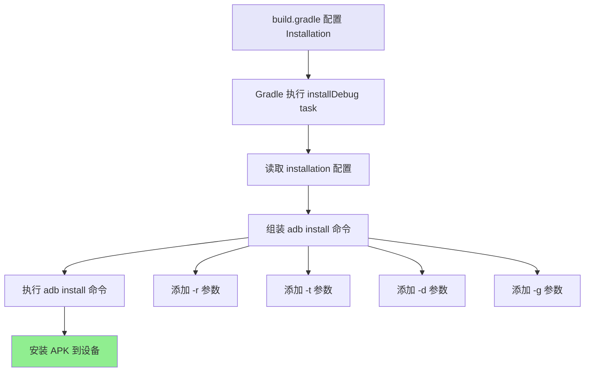
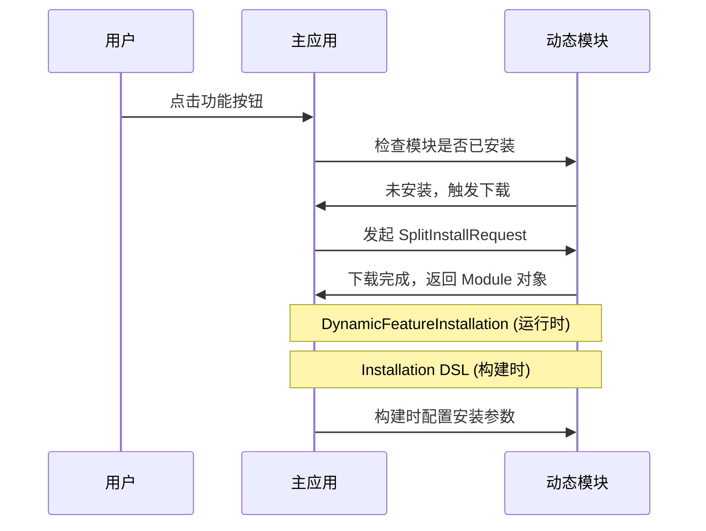

# 21.1.134 Installation

阳光渐渐升高，透过帐篷帘子和树叶的缝隙，在草地上画出无数金色的小光点。洛芙伸了个懒腰，感觉肚子开始咕咕叫了。

“差不多该吃午饭了吧？”洛芙揉着肚子说。

希尔正蹲在一棵大树下，她的笔记本电脑放在一块平整的石头上，屏幕上是一堆 Gradle 配置代码。“先别急，洛芙，”她头也不抬地说，“刚才黛琳讲的 HasInitWith 学会了没？学会了我们就继续下一个——Installation 安装配置。”

伊莎从帐篷里钻出来，手里拿着一小盒水果切块。她坐到树荫下，把盒子打开：“这是昨天剩下的水果，快尝尝鲜。”

黛琳理了理头发，在伊莎旁边坐下：“希尔说的对，今天上午我们学了配置复制，下午或者明天再继续别的话题。现在先把 Installation 讲完——这个很重要的。”

“安装配置？”洛芙拿起一块西瓜，“我们之前学 ApplicationInstallation 的时候不是讲过安装吗？”

“那时候讲的是应用安装的基本流程，”黛琳解释说，“今天要学的 Installation DSL 接口更具体——它是用来配置构建产物（比如 APK、AAB）安装到设备时的具体选项。”

---

## 树荫下的Installation课堂

黛琳找了一根树枝，在地面上画了几个圈，代表不同的安装选项。

“你有没有想过，”她看向洛芙，“当你运行 ./gradlew installDebug 时，Gradle 是怎么知道要把 APK 安装到哪个设备的？安装的过程中可以有哪些自定义行为？”

洛芙歪着脑袋想了想：“是不是和 adb 命令的参数有关？”

“对的，”黛琳点点头，“Installation DSL 就是让你在 build.gradle 中配置这些选项，而不需要每次都手动敲命令。”

希尔把笔记本转过来，屏幕上是一个典型的 Installation 配置示例：

```kotlin
android {
    // Application 安装配置
    application {
        // 模拟器安装选项
        installConfigs {
            // 为特定设备变体配置安装行为
            forDevice("emulator-5554") {
                // 安装时grant所有运行时权限
                installFlags += "grant-permissions"
                // 模拟器上静默安装（跳过确认对话框）
                installOptions += "-r"      // 替换已安装的应用
                installOptions += "-t"      // 允许测试包
                installOptions += "-d"      // 允许降级
            }
            
            // USB设备配置
            forDevice("-usb:") {
                installOptions += "-r"
                installOptions += "-g"      // 授予所有运行时权限
            }
        }
    }
}
```

“这个是示例代码，”希尔补充说，“实际上 Installation DSL 的具体 API 会根据 Android Gradle Plugin 版本有所不同，但核心思路是一样的——让你在构建配置中定义安装行为。”

---

## 核心概念：InstallOptions 和 InstallFlags

伊莎放下水果盒，好奇地问：“这些 -r、-t、-d、-g 都是什么呀？”

“这些都是 adb install 的参数，”黛琳拿起树枝在地上写起来：

> -r：replace，替换已安装的应用（安装新版本时必须）
> -t：allow test packages，允许安装测试包
> -d：allow version downgrade，允许降级安装
> -g：grant all permissions，安装时授予所有运行时权限

“原来如此！”洛芙恍然大悟，“平时我们手动安装的时候，都要一个个参数输入，现在在 Gradle 里可以直接配置好。”

“对的，”黛琳说，“这就是 Installation DSL 的好处——一次配置，每次构建自动生效。”

她画了一幅图来说明配置流程：



---

## 配置的作用域：Application 和 Dynamic Feature

“Installation 配置可以在不同作用域使用，”黛琳继续说，“最常见的是 Application 级别和 Dynamic Feature 级别。”

她在屏幕上展示了两种配置的对比：

```kotlin
android {
    // 1. Application 级别安装配置
    application {
        // 为整个应用配置安装行为
        installConfigs {
            forDevice("emulator-5554") {
                installOptions += "-r"
                installOptions += "-g"
            }
        }
    }
    
    // 2. 在 defaultConfig 中也可以配置
    defaultConfig {
        // 应用默认安装配置
    }
    
    // 3. Dynamic Feature 模块也可以有自己的安装配置
    // 在 dynamicFeatures 代码块内
    dynamicFeatures {
        create("feature_camera") {
            // 动态功能模块的安装配置
            installation {
                // 是否在主应用安装后自动下载
                // 这是一个逻辑配置，不直接映射到 adb 参数
            }
        }
    }
}

android.application {
    // 在 androidExtensions 中也可以声明安装配置
    // 具体取决于使用的插件版本
}
```

洛芙注意到一个问题：“黛琳，我有点晕……application {} 和 defaultConfig {} 不都是配置应用的吗？有什么区别？”

“问得好，”黛琳笑着点头，“简单来说：

> application {} 块配置的是**应用整体的安装行为**，比如安装到哪个设备、安装参数等
> defaultConfig {} 配置的是**应用的基础属性**，比如 applicationId、minSdkVersion 等

“Installation DSL 主要用在 application {} 块，或者在某些场景下用于配置动态模块的安装方式。”

---

## 实际使用示例

希尔打开了 Android Studio，给大家展示一个真实的项目配置。她创建了一个小型演示项目：

```kotlin
// build.gradle.kts (App Module)
plugins {
    id("com.android.application")
    id("org.jetbrains.kotlin.android")
}

android {
    namespace = "com.example.camping"
    compileSdk = 34

    defaultConfig {
        applicationId = "com.example.camping"
        minSdk = 24
        targetSdk = 34
        versionCode = 1
        versionName = "1.0"
    }

    buildTypes {
        release {
            isMinifyEnabled = false
            proguardFiles(
                getDefaultProguardFile("proguard-android-optimize.txt"),
                "proguard-rules.pro"
            )
        }
        debug {
            isDebuggable = true
            applicationIdSuffix = ".debug"
        }
    }

    // Application 级别安装配置
    application {
        // 为不同设备类型配置不同的安装行为
        installConfigs {
            // 模拟器配置
            forDeviceMatching({ it.device.startsWith("emulator") }) {
                installOptions.add("-r")
                installOptions.add("-t")
                installOptions.add("-g")
            }
            
            // USB 设备配置
            forDeviceMatching({ it.device.startsWith("usb:") }) {
                installOptions.add("-r")
                installOptions.add("-g")
            }
            
            // WiFi 设备配置
            forDeviceMatching({ it.device.startsWith("wireless:") }) {
                installOptions.add("-r")
            }
        }
    }
}

dependencies {
    implementation("androidx.core:core-ktx:1.12.0")
    implementation("androidx.appcompat:appcompat:1.6.1")
}
```

“这段配置，”希尔指着屏幕说，“根据不同的连接类型（模拟器、USB、WiFi），自动配置不同的安装参数。模拟器和 USB 需要 -g 授予权限，但 WiFi 连接的时候可能不需要。”

“原来可以这样智能！”洛芙惊叹道，“那如果我想针对特定的设备序列号配置呢？”

黛琳说：“可以实现 forDevice() 方法，传入设备序列号或者匹配器。Android Gradle Plugin 会自动检测已连接的设备，选择对应的配置。”

---

## 动态模块的安装配置

伊莎好奇地问：“那动态功能模块的安装配置呢？之前我们学的 DynamicFeatureInstallation 和这个有关系吗？”

“有的，”黛琳点点头，“DynamicFeatureInstallation 主要是运行时安装的 API，而 Installation DSL 是构建时的安装配置。两者配合使用。”

她画了一幅图来说明两者的关系：



“简单的说，”黛琳总结道，“Installation DSL 负责的是‘构建完成后怎么安装到设备’，而 DynamicFeatureInstallation 负责的是‘运行中怎么下载和加载动态模块’。前者发生在开发阶段，后者发生在用户使用阶段。”

---

## 反模式与最佳实践

洛芙突然举手：“黛琳，我在想……如果我把所有的安装参数都配成 -r -t -d -g，是不是就最方便了？”

“绝对不行！”希尔赶紧摇头，“这是典型的反模式。”

她打开了一个名为"反模式"的代码错误示例：

```kotlin
// ❌ 反模式：过度配置的安装参数
android {
    application {
        installConfigs {
            forDeviceMatching({ true }) {  // 匹配所有设备
                installOptions += "-r"
                installOptions += "-t"
                installOptions += "-d"
                installOptions += "-g"
            }
        }
    }
}
```

“这样做的风险是，”希尔解释说，“-d 允许降级，如果不小心安装了旧版本，可能导致数据丢失或应用崩溃；-g 授予所有权限，在正式版发布时可能会被 Google Play 审核拒绝。”

黛琳补充了最佳实践：

```kotlin
// ✅ 最佳实践：针对不同场景配置安装参数
android {
    application {
        // Debug 构建：需要各种权限方便调试
        buildTypes {
            debug {
                installConfigs {
                    forDeviceMatching({ true }) {
                        installOptions.add("-r")
                        installOptions.add("-t")
                        installOptions.add("-g")
                    }
                }
            }
        }
        
        // Release 构建：不做特殊配置
        buildTypes {
            release {
                // Release 版本不添加任何特殊的安装参数
                // 保持和用户实际使用一样的行为
            }
        }
    }
}
```

“如果你的应用有多个风味，”伊莎补充说，“也可以针对不同风味做不同配置——开发风味可以多配置一些参数，生产风味保持最小权限。”

---

## 洛芙动手实验

洛芙迫不及待地打开自己的笔记本，按照刚才学的知识开始写配置。她创建了一个测试项目：

```kotlin
// 洛芙的实验代码
android {
    application {
        // 示例：根据设备类型自动选择配置
        installConfigs {
            // 使用 forDevice 方法针对特定设备
            // 参数是设备序列号或设备描述符
            forDevice("emulator-5554") {
                // 添加安装参数
                installOptions.add("-r")
                installOptions.add("-t")
                installOptions.add("-g")
            }
            
            // 也可以使用 forDeviceMatching 匹配多台设备
            forDeviceMatching { descriptor ->
                // 判断设备是否以 "emulator" 开头
                descriptor.device.startsWith("emulator")
            } apply {
                installOptions.add("-r")
                installOptions.add("-g")
            }
        }
    }
}
```

希尔看着洛芙的代码，点了点头：“基本思路是对的。不过具体 API 可能会因为你使用的 Android Gradle Plugin 版本不同而有差别。现在主流用的是 8.x，可能 API 写法会有少许差异。”

“那要是配置文件报错了怎么办？”洛芙问。

“先看报错信息，”希尔说，“Gradle 的报错一般会提示你哪个配置项不支持。另外可以查看官方文档确认对应的 Plugin 版本支持哪些 API。”

---

## 知识点小总结

黛琳看了一下时间，已经是中午了。她快速总结了今天学到的知识点：

1. **Installation DSL**：用于在构建时配置应用安装到设备的选项
2. **核心参数**：
   - -r：替换已安装的应用
   - -t：允许测试包
   - -d：允许降级
   - -g：授予所有运行时权限
3. **作用域**：可以在 application 级别配置，也可以针对不同 buildType 配置
4. **最佳实践**：Debug 构建可以配置更多参数方便调试，Release 构建保持默认行为
5. **与 DynamicFeatureInstallation 的关系**：前者是构建时安装，后者是运行时动态模块安装

伊莎站起来，伸了个懒腰：“好了好了，学习告一段落——现在该吃午饭啦！”

洛芙也收起笔记本，看向湖边的方向：“我想吃烤鱼……昨天那种~”

“好好好，”希尔合上电脑，“吃饱了下午再继续。今天还有别的要学呢。”

四个女孩收拾好东西，朝着露营地的另一边走去。阳光穿过树叶，在她们身上投下斑驳的光影，微风吹过带来了湖水的清凉气息。

---

> 学习建议：Installation DSL 是开发阶段非常实用的配置，建议先在 Debug 构建中尝试，理解各个参数的作用后再应用到项目中。注意 Release 版本不要滥用权限授予参数，以免影响应用商店审核。

## 洛芙的小小日记本

今天学会了 Installation DSL！原来 ./gradlew installDebug 背后有这么多可以配置的选项。黛琳说不要在 Release 版本乱用 -g 参数，不然 Play 审核会出问题。我要在日记本上记下来——调试用 Debug，发布用 Release，配置要分开！

## 今日关键词

**Installation DSL**：Android Gradle Plugin 提供的用于在构建时配置应用安装选项的 DSL 接口，定义在 com.android.build.api.dsl.Installation 包中。

**installOptions**：安装参数集合，对应 adb install 命令行参数，如 -r（替换）、-t（测试包）、-d（降级）、-g（授予权限）。

**installFlags**：安装标志，用于控制安装过程的特殊行为，如静默安装、跳过确认对话框等。

**BuildType**：构建类型，定义不同的构建变体，如 debug、release，不同类型可以有不同的 Installation 配置。

**DynamicFeatureInstallation**：动态功能安装的运行时 API，与 Installation DSL（构建时配置）配合使用，一个管构建安装，一个管运行时下载。