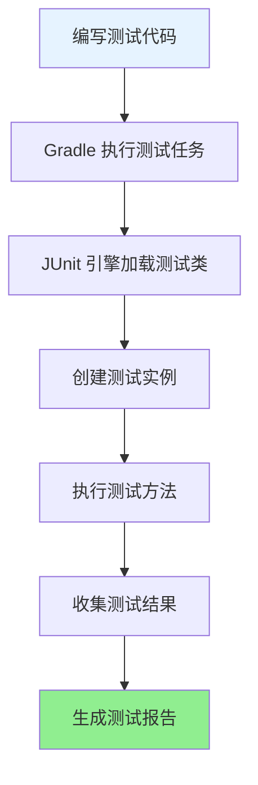
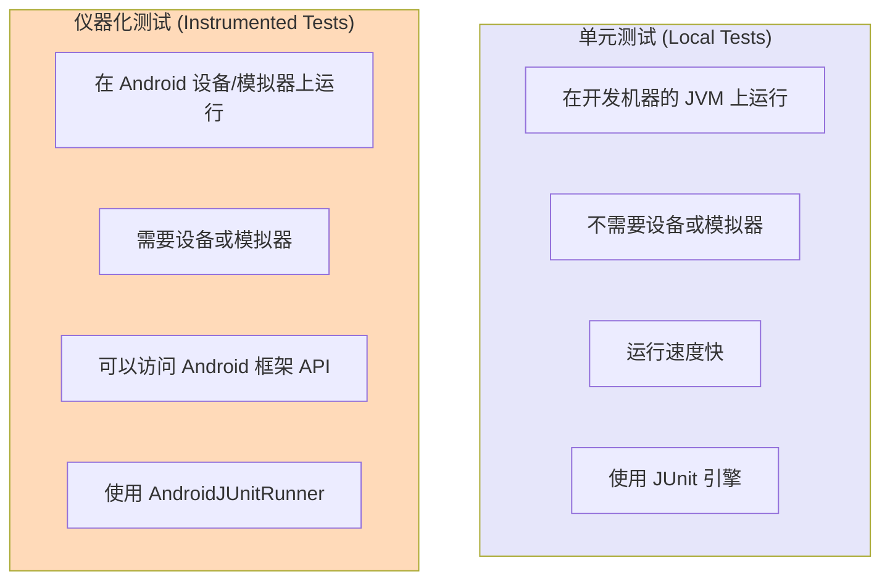

# 21.1.135 JUnit引擎规范

午餐时间刚过，露营地的树荫下，四个女孩围坐在野餐垫上。洛芙靠着树干，用手扇着风。刚才的烤鱼很好吃，但她现在更想弄清楚上午没搞明白的那些配置。

“黛琳，”洛芙把水杯放下，“上午说的 Installation 我差不多懂了，那接下来我们要学什么？”

黛琳正在整理她的小白板，听见洛芙的问话，转过身来：“下午我们学点新东西——JUnit引擎规范。”

“Jun什么？”洛芙眨了眨眼。

“JUnit，”希尔抢着说，“就是咱们写单元测试的时候用的那个测试框架。你不会忘了吧？”

洛芙吐了吐舌头：“没忘没忘……就是测试那个。那这个'引擎规范'又是干什么的？”

伊莎笑了笑，递过来一块切好的桃子：“黛琳的意思是，JUnit引擎规范是帮我们配置测试运行方式的——比如用哪个版本的JUnit引擎、怎么运行测试、测试结果的格式之类的。”

“原来是这样！”洛芙接过桃子，“那我们开始吧——早点学会早点休息，这太阳太大了。”

---

## 树荫下的JUnit引擎课堂

黛琳把小白板架好，画了一个简单的框架图：“在Android开发中，测试是一个很重要的环节。而JUnit引擎就是负责实际执行测试的'引擎'。”

她画了一个简单的图来说明测试执行流程：



“简单来说，”黛琳解释道，“当你运行 ./gradlew testDebugUnitTest 时，Gradle 会调用 JUnit 引擎来执行你的测试代码。JUnit 引擎规范就是让你告诉 Gradle：要用哪个版本的 JUnit 引擎、怎么运行这些测试。”

洛芙举手提问：“黛琳，我之前写过一些测试，用的是 JUnit 4。那个和现在说的引擎是一回事吗？”

“问得好，”黛琳点点头，“JUnit 4 是最经典的版本，但现在也有 JUnit 5——也叫 Jupiter。配置不同的引擎，就会用不同的方式来运行你的测试。”

---

## JUnitEngineSpec 的核心配置

希尔打开她的笔记本，调出一个配置示例：“我们来看代码会更清楚。”

```kotlin
android {
    // Application 测试配置
    application {
        // 配置测试引擎
        defaultConfig {
            // 设置要使用的测试引擎
            // 可以是 JUnit4 或 JUnit5
            testInstrumentationRunner = "androidx.test.runner.AndroidJUnitRunner"
        }
        
        // 配置 JUnit 引擎规范
        testOptions {
            // 单元测试配置
            unitTests {
                // 是否启用 jacoco 代码覆盖率
                includeAndroidResources = true
                
                // 配置默认的测试框架
                // 可以指定使用 JUnit4 或其他框架
                defaults {
                    // 设置默认的测试 runner
                    testRunner = "androidx.test.runner.AndroidJUnitRunner"
                }
            }
            
            // 设备测试（仪器化测试）配置
            unitTests {
                // 为设备测试配置 JUnit 引擎
                // 这里可以配置更多选项
            }
        }
    }
}
```

“这个是简化版的配置，”希尔补充道，“实际上 JUnitEngineSpec 允许你更细粒度地控制测试运行的行为。”

伊莎好奇地问：“那 JUnit 4 和 JUnit 5 有什么区别？一定要选一个吗？”

黛琳解释说：“JUnit 4 是老牌版本，API 稳定，几乎所有 Android 测试库都支持。JUnit 5 是新版本，提供了更现代的 API、更强大的功能，比如参数化测试、嵌套测试、动态测试等。”

她画了一幅对比图：

```mermaid
flowchart LR
    subgraph JUnit4["JUnit 4 (Classic)"]
        A1[@Test 注解]
        A2[Assert 方法]
        A3[Expected 异常]
    end
    
    subgraph JUnit5["JUnit 5 (Jupiter)"]
        B1[@Test 注解]
        B2[Assertions 类]
        B3[AssertThrows]
        B4[参数化测试]
        B5[嵌套测试]
    end
    
    JUnit4 -->|迁移| JUnit5
    
    style JUnit4 fill:#FFE4B5
    style JUnit5 fill:#98FB98
```

“如果你想用 JUnit 5 的新特性，”黛琳继续说，“需要在 build.gradle 中添加 JUnit 5 的依赖和配置。”

---

## 配置 JUnit 5 引擎

希尔切换到一个新的代码示例：“我们来看看怎么配置 JUnit 5。”

```kotlin
// build.gradle.kts (App Module)
plugins {
    id("com.android.application")
    id("org.jetbrains.kotlin.android")
}

android {
    namespace = "com.example.camping"
    compileSdk = 34

    defaultConfig {
        applicationId = "com.example.camping"
        minSdk = 24
        targetSdk = 34
        
        // 使用 AndroidJUnitRunner，它同时支持 JUnit 4 和 JUnit 5
        testInstrumentationRunner = "androidx.test.runner.AndroidJUnitRunner"
    }

    // 测试选项配置
    testOptions {
        // 单元测试配置
        unitTests {
            // 启用 Android 资源
            includeAndroidResources = true
            
            // 配置测试框架
            defaults {
                testRunner = "androidx.test.runner.AndroidJUnitRunner"
            }
        }
    }
}

// 添加测试依赖
dependencies {
    // AndroidX Test - 核心测试库
    testImplementation("androidx.test:core-ktx:1.5.0")
    testImplementation("androidx.test.ext:junit-ktx:1.1.5")
    
    // JUnit 4 (如果你主要用 JUnit 4)
    testImplementation("junit:junit:4.13.2")
    
    // JUnit 5 (如果要用 JUnit 5)
    testImplementation("org.junit.jupiter:junit-jupiter-api:5.10.0")
    testRuntimeOnly("org.junit.jupiter:junit-jupiter-engine:5.10.0")
    
    // 你也可以两个都加，测试时会自动选择
}
```

“等等，”洛芙举手说，“我看到这里有两个 JUnit 依赖——junit:junit 是 4，org.junit.jupiter 是 5。那到底用哪个？”

希尔笑着解释：“这就是关键所在！Android 默认使用 AndroidJUnitRunner，它可以自动检测你的测试是用 JUnit 4 还是 JUnit 5 编写的，然后调用相应的引擎来执行。”

“那如果我混着用呢？”洛芙又问。

“不建议混用，”黛琳摇头说，“最好选择一个版本，然后统一使用那个版本的 API 和注解。”

---

## 引擎配置的实际例子

伊莎提议说：“与其一直讲理论，不如我们来写一个实际的测试例子？”

“好啊！”洛芙跃跃欲试，“我来写一个简单的测试，用 JUnit 4 的方式。”

她打开笔记本，开始敲代码：

```kotlin
// 示例：使用 JUnit 4 编写的测试
package com.example.camping

import org.junit.Assert.assertEquals
import org.junit.Before
import org.junit.Test

class CalculatorTest {
    
    private lateinit var calculator: Calculator
    
    @Before
    fun setup() {
        calculator = Calculator()
    }
    
    @Test
    fun testAddition() {
        val result = calculator.add(2, 3)
        assertEquals(5, result, 0.0)
    }
    
    @Test
    fun testSubtraction() {
        val result = calculator.subtract(5, 3)
        assertEquals(2, result, 0.0)
    }
    
    @Test(expected = ArithmeticException::class)
    fun testDivisionByZero() {
        calculator.divide(1, 0)
    }
}
```

希尔看完后点点头：“很好，这是标准的 JUnit 4 写法。现在我们来改成 JUnit 5 的版本，看看有什么区别。”

```kotlin
// 示例：使用 JUnit 5 编写的测试
package com.example.camping

import org.junit.jupiter.api.Assertions.assertEquals
import org.junit.jupiter.api.BeforeEach
import org.junit.jupiter.api.Test
import org.junit.jupiter.api.assertThrows

class CalculatorTestJ5 {
    
    private lateinit var calculator: Calculator
    
    @BeforeEach
    fun setup() {
        calculator = Calculator()
    }
    
    @Test
    fun testAddition() {
        val result = calculator.add(2, 3)
        assertEquals(5.0, result, 0.0)
    }
    
    @Test
    fun testSubtraction() {
        val result = calculator.subtract(5, 3)
        assertEquals(2.0, result, 0.0)
    }
    
    @Test
    fun testDivisionByZero() {
        assertThrows<ArithmeticException> {
            calculator.divide(1, 0)
        }
    }
}
```

洛芙对比着看了两段代码：“我看到区别了！JUnit 5 用 @BeforeEach 而不是 @Before，assertThrows 而不是 expected 属性……还有 assertEquals 的参数顺序好像也变了？”

“观察得很仔细，”黛琳笑着说，“不过核心思路是一样的——都是 @Test 标记测试方法，@Before/@BeforeEach 做初始化，然后用 assert 系列方法验证结果。”

---

## 设备测试与单元测试的配置差异

伊莎突然想到一个问题：“黛琳，我们之前学的都是单元测试，那仪器化测试（设备测试）怎么配置引擎？”

“好问题，”黛琳说，“单元测试运行在本地 JVM 上，而仪器化测试需要安装到真机或模拟器上运行。两者配置引擎的方式不太一样。”

她画了一幅图来说明区别：



“在配置中，”黛琳继续说，“你需要分别指定这两种测试的引擎。”

```kotlin
android {
    // 仪器化测试配置
    defaultConfig {
        // 这是仪器化测试的 runner
        testInstrumentationRunner = "androidx.test.runner.AndroidJUnitRunner"
    }
    
    // 测试选项
    testOptions {
        // 单元测试配置
        unitTests {
            includeAndroidResources = true
            defaults {
                // 单元测试的默认 runner
                testRunner = "androidx.test.runner.AndroidJUnitRunner"
            }
        }
    }
}
```

洛芙有点晕：“两种测试要用不同的 runner 吗？”

“实际上都用的是 AndroidJUnitRunner，”希尔解释说，“它是一个统一的入口，会自动根据测试类型选择合适的引擎。单元测试用 JUnit 引擎，仪器化测试用 AndroidJUnitRunner。”

---

## 常见的引擎配置问题与解决

伊莎问：“如果配置错了会出现什么问题？”

“会很典型的一些错误，”黛琳说，“比如你用了 JUnit 5 的 API 但只加了 JUnit 4 的依赖，运行测试时会报错说找不到方法。”

她列了几个常见的反模式和对应的正确做法：

```kotlin
// ❌ 反模式 1：同时混用 JUnit 4 和 JUnit 5 的注解
class MixedTest {
    @Test  // 这是 JUnit 4 的注解
    fun testWithJunit4() { ... }
    
    @Test  // 这也是 JUnit 4 的注解，虽然 JUnit 5 也支持
    fun testAlsoJunit4() { ... }
}

// ✅ 正确做法：选择一个版本并统一使用
class Junit4Test {
    @Test
    fun testWithJunit4() { ... }
}

class Junit5Test {
    @Test
    fun testWithJunit5() { ... }
}
```

```kotlin
// ❌ 反模式 2：依赖版本冲突导致引擎无法加载
dependencies {
    // 混用不同版本的 JUnit
    testImplementation("junit:junit:4.12")
    testImplementation("org.junit.jupiter:junit-jupiter-api:5.9.0")
    // 但忘记加 JUnit 5 的引擎依赖
}

// ✅ 正确做法：同时添加引擎依赖
dependencies {
    testImplementation("junit:junit:4.13.2")
    testImplementation("org.junit.jupiter:junit-jupiter-api:5.10.0")
    testRuntimeOnly("org.junit.jupiter:junit-jupiter-engine:5.10.0")
}
```

```kotlin
// ❌ 反模式 3：测试目录配置错误
// 在 src/test/java 放 JUnit 5 测试
// 但 Gradle 配置中指定了 JUnit 4 引擎

// ✅ 正确做法：确保测试框架和目录对应
// 默认配置下，Gradle 会自动检测使用哪个引擎
// 但如果手动指定了 runner，要确保匹配
android {
    defaultConfig {
        testInstrumentationRunner = "androidx.test.runner.AndroidJUnitRunner"
    }
}
```

---

## 运行测试与查看结果

希尔演示了如何运行测试：“在 Android Studio 中，你可以直接右键点击测试类或测试方法，选择 'Run' 来运行。也可以用命令行。”

```bash
# 运行所有单元测试
./gradlew testDebugUnitTest

# 运行特定模块的单元测试
./gradlew :app:testDebugUnitTest

# 运行仪器化测试
./gradlew connectedDebugAndroidTest

# 运行特定测试类
./gradlew testDebugUnitTest --tests="com.example.camping.CalculatorTest"
```

“测试运行完成后，”希尔继续说，“会在 build/reports/tests/ 目录下生成测试报告。”

黛琳补充说：“如果你用的是 JUnit 5，还可以在测试报告中看到更详细的信息，比如测试的持续时间、失败的原因等。”

洛芙好奇地问：“那如果我想看看测试覆盖率呢？”

“需要配置 Jacoco，”希尔说，“这也是 JUnitEngineSpec 支持的一个功能——代码覆盖率分析。”

```kotlin
android {
    testOptions {
        unitTests {
            // 启用 Jacoco 代码覆盖率
            includeAndroidResources = true
        }
    }
}

// 然后在 build.gradle 中添加插件
plugins {
    id("jacoco")
}

jacoco {
    toolVersion = "0.8.10"
}
```

“代码覆盖率是个很大的话题，”黛琳说，“今天我们先点到为止，有兴趣以后可以深入研究。”

---

## 知识点小总结

眼看太阳开始偏西，黛琳快速总结了今天学到的内容：

1. **JUnit引擎规范**：用于配置测试运行引擎的 DSL 接口
2. **JUnit 4 vs JUnit 5**：
   - JUnit 4 是经典版本，API 稳定
   - JUnit 5 是新版本，特性更丰富
3. **AndroidJUnitRunner**：Android 官方的测试 runner，统一支持两种 JUnit 版本
4. **单元测试 vs 仪器化测试**：运行环境不同，但都用 AndroidJUnitRunner
5. **常见问题**：版本混用、依赖缺失、runner 配置错误

伊莎伸了个懒腰：“好了，今天学的够多了——我们休息一下吧！”

洛芙收起笔记本，看着湖面：“明天我们学什么？”

“明天啊，”黛琳笑了笑，“明天我们继续看 Gradle DSL 的其他接口——看看还有什么能配置的。”

四个女孩收拾好东西，准备在湖边走走，消消食。午后的阳光透过树叶间隙，在水面上洒下点点金光。

---

> 学习建议：JUnit 引擎配置是 Android 测试的基础，建议先从 JUnit 4 入手，熟悉基本写法后再尝试 JUnit 5 的新特性。注意保持依赖版本的一致性，避免混用导致的兼容性问题。

## 洛芙的小小日记本

今天学会了JUnit引擎规范！原来测试有这么多可以配置的东东。希尔说JUnit 5有参数化测试听起来很厉害，但黛琳建议我先从JUnit 4开始，打好基础再说。明天继续加油！

## 今日关键词

**JUnitEngineSpec**：JUnit 引擎规范，Android Gradle Plugin 提供的用于配置 JUnit 测试运行引擎的 DSL 接口，定义在 com.android.build.api.dsl 包中。

**JUnit 4**：经典的 Java 单元测试框架，使用 @Test、@Before、@After 等注解，API 稳定，兼容性最好。

**JUnit 5**：新一代 Java 测试框架，也叫 Jupiter，支持参数化测试、嵌套测试、动态测试等新特性。

**AndroidJUnitRunner**：Android 官方的测试运行器，继承自 JUnit Runner，同时支持 JUnit 4 和 JUnit 5 编写的测试。

**单元测试 (Unit Tests)**：在本地 JVM 上运行的测试，不需要 Android 设备或模拟器，执行速度快。

**仪器化测试 (Instrumented Tests)**：需要在真机或模拟器上运行的测试，可以访问 Android 框架 API。

**testInstrumentationRunner**：配置仪器化测试的运行器，默认为 AndroidJUnitRunner。

**Jacoco**：Java 代码覆盖率分析工具，可以集成到 Android 测试中生成覆盖率报告。
