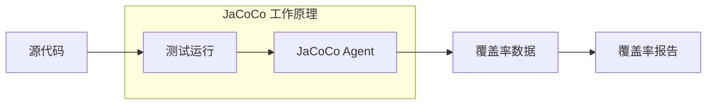
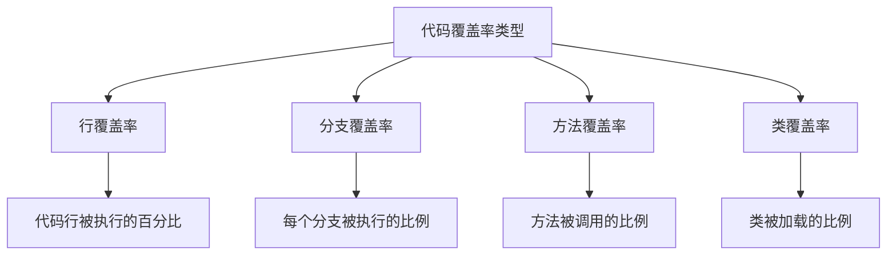
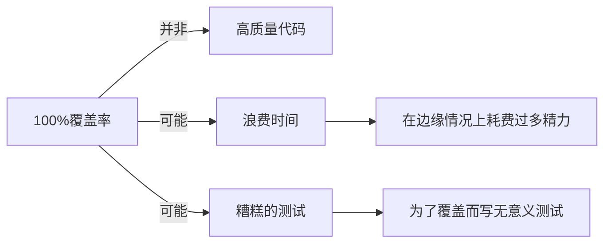
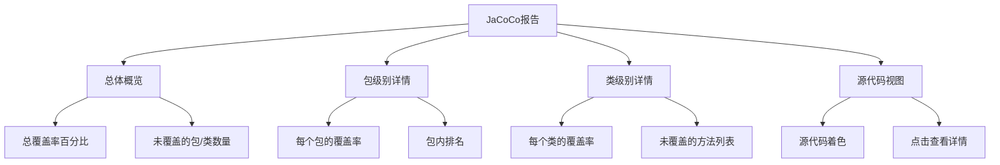
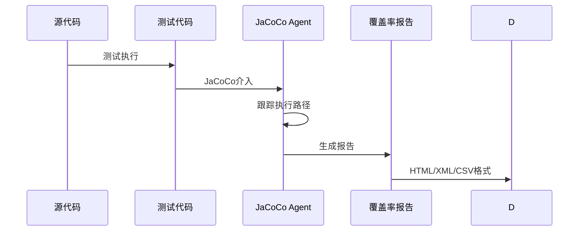

# 21.1.136 JacocoOptions

午后的阳光开始偏转，不再像正午那样垂直地炙烤大地。洛芙伸了个懒腰，发现自己刚才听课的笔记本上已经密密麻麻记满了各种配置选项。

“黛琳，”洛芙托腮望着还在白板上写写画画的黛琳，“刚才讲的JUnit引擎我大概理解了，但有个问题——我们怎么知道自己的测试写得够不够好啊？”

黛琳停下手中的白板笔，转过身来微微一笑：“问得好。这正好是我们接下来要讲的内容。”

希尔不知道什么时候已经从背包里翻出一个小型投影仪，摆在草地上：“说到测试质量，当然要看代码覆盖率啦！洛芙，你还记得小时候玩的那种跳格子游戏吗？”

“记得呀！用粉笔画在地上，然后单脚跳着去踩数字。”洛芙点点头，“怎么突然说这个？”

“想象一下，”希尔兴奋地比划着，“你的代码就是那片画满格子的空地，测试就是你在格子上跳动。跳过的格子越多，就说明你覆盖得越全面——这就是代码覆盖率的概念！”

伊莎轻轻拨了拨耳边被风吹乱的发丝，柔声补充道：“而在Android世界里，有一个叫做雅可可——啊不对，是JaCoCo的精灵，专门帮我们统计这个覆盖率呢。”

---

### 覆盖率精灵 JaCoCo

黛琳重新拿起白板笔，在白板上写下几个英文字母：“JaCoCo是Java Code Coverage的缩写，中文叫雅可可也没错啦——它是Android官方推荐用来测量代码覆盖率的工具。”

她画了一个简单的示意图：



“简单来说，”黛琳解释道，“JaCoCo会在测试运行时作为一个agent（代理）接入，它会跟踪哪些代码被执行了，哪些没有被执行。然后生成一份详细的报告，告诉我们覆盖率是多少。”

洛芙好奇地问：“那它都能统计哪些类型的覆盖率呀？”

伊莎弯起眼睛：“主要有四种呢：”



“**行覆盖率**是最直观的，”伊莎继续说，“比如你有一百行代码，测试跑了八十行，那就是80%的行覆盖率。**分支覆盖率**稍微复杂一些，像if-else这样有分支的地方，它会看每个分支是否都被执行过。**方法覆盖率**看有多少方法被调用过了。**类覆盖率**则是看有多少类被加载过。”

---

### 雅可可选项的配置

希尔把笔记本转过来朝向众人：“好啦，理论讲完了，让我们来看看怎么在Gradle里配置JaCoCo！”

```kotlin
android {
    // ...
    
    buildTypes {
        debug {
            // 启用JaCoCo代码覆盖率
            enableCoverage = true
        }
    }
    
    // 配置JaCoCo选项
    jacoco {
        // JaCoCo版本
        version = "0.8.11"
        
        // 覆盖率报告输出位置
        destinationFile = file("${buildDir}/outputs/code-coverage/coverage.ec")
        
        // 包含的包名（只统计这些包的覆盖率）
        include = listOf(
            "com.example.app.**",
            "com.example.domain.**"
        )
        
        // 排除的包名（不统计这些包）
        exclude = listOf(
            "**/R.class",
            "**/R$*.class",
            "**/BuildConfig.*",
            "**/Manifest*.*",
            "**/*Test*.class",
            "**/di/**",
            "**/data/local/**"
        )
        
        // 包含文件类型
        includeNoLocationClasses = false
        
        // 线程数（并行执行覆盖率统计）
        threadCount = Runtime.getRuntime().availableProcessors()
        
        // 类转储文件
        classDumpFile = file("${buildDir}/jacoco/dump")
    }
}
```

洛芙看得入神：“好多配置项啊！黛琳，快给我讲讲每个是干什么的！”

黛琳指着配置项逐一解释：

“**version**很简单，就是指定JaCoCo的版本号，建议使用较新的稳定版本，比如0.8.11。”

“**destinationFile**呢，是我们生成的覆盖率数据文件的存放位置。这里用到了Gradle的file()函数，它会创建一个File对象，路径是build目录下的outputs/code-coverage文件夹里的coverage.ec文件。”

“接下来是**include**和**exclude**，这两个最重要了！”黛琳强调道，“include用来指定只统计哪些包的覆盖率，exclude用来排除哪些包。通常我们要排除掉R类、BuildConfig、测试类，还有数据层的一些实现类——比如你用的是Room数据库，那些自动生成的实现类我们不希望算进去。”

伊莎补充道：“exclude的模式很有讲究呢。像`**/R.class`这个模式，**表示任意目录，/R.class表示以R.class结尾的文件。写成`**/R$*.class`呢，$在Java类名里表示内部类，所以R$*.class会匹配所有像R$drawable.class这样的内部类。”

洛芙若有所思地点头：“原来是这样！那includeNoLocationClasses是做什么的呀？”

希尔抢着回答：“这个啊，是处理那些没有源码位置信息的类的。比如有些库编译后生成的类，你没有它们的源码，就可以把它们也纳入统计。不过一般设为false就好啦，避免统计结果不准确。”

---

### 反模式：过度追求覆盖率

黛琳突然严肃起来：“但是呢，我必须提醒你们一个常见的误区——**不要盲目追求100%覆盖率！**”

她画了一个警示的图标：



“在真实的项目里，”黛琳继续说，“80%-90%的覆盖率通常就足够了。剩下的10%-20%往往是一些边界情况、异常处理，这些测试写起来费时费力，但带来的收益很小。”

洛芙好奇地问：“那是不是说明覆盖率低就一定不好呢？”

“当然不是！”希尔摆摆手，“覆盖率低说明你的测试肯定不够。但覆盖率高质量不一定好——关键要看测试是否真的有意义。”

**坏的示例**（为了覆盖而写）：

```kotlin
@Test
fun testNothing() {
    // 这个测试除了让覆盖率上升以外没有任何价值
    val x = 1
    assertEquals(1, x)
}
```

**好的示例**（真正验证行为）：

```kotlin
@Test
fun testUserLoginSuccess() {
    // 模拟用户登录成功的情况
    val result = userRepository.login("validUser", "correctPassword")
    assertTrue(result.isSuccess)
    assertNotNull(result.token)
}

@Test
fun testUserLoginFailure() {
    // 验证错误密码时的行为
    val result = userRepository.login("validUser", "wrongPassword")
    assertTrue(result.isFailure)
    assertEquals(ErrorCode.WRONG_PASSWORD, result.errorCode)
}
```

“看，”希尔指着屏幕说，“第二个例子不仅覆盖率更高，而且它真正验证了代码的正确性。第一种纯粹是自欺欺人。”

---

### 实际配置演练

“那我们也来实际操作一下吧！”希尔兴奋地搓搓手，“我们来给露营旅团的App配置JaCoCo！”

她打开笔记本，开始写配置：

```kotlin
// 在app/build.gradle.kts中

plugins {
    id("com.android.application")
    kotlin("android")
    id("jacoco")  // 启用JaCoCo插件
}

android {
    // ... 其他配置
    
    buildTypes {
        debug {
            enableCoverage = true
        }
        release {
            isMinifyEnabled = true
            proguardFiles(
                getDefaultProguardFile("proguard-android-optimize.txt"),
                "proguard-rules.pro"
            )
        }
    }
}

// 配置JaCoCo报告任务
tasks.withType<JacocoReport> {
    reports {
        // 生成HTML报告（人类可读）
        html.required.set(true)
        html.outputLocation.set(file("${buildDir}/reports/jacoco/jacocoHtml"))
        
        // 生成XML报告（适合集成到CI）
        xml.required.set(true)
        xml.outputLocation.set(file("${buildDir}/reports/jacoco/jacoco.xml"))
        
        // 生成CSV报告（适合数据分析）
        csv.required.set(true)
        csv.outputLocation.set(file("${buildDir}/reports/jacoco/jacoco.csv"))
    }
    
    // 配置哪些文件参与统计
    val fileFilter = listOf(
        "**/R.class",
        "**/R$*.class",
        "**/BuildConfig.*",
        "**/Manifest*.*",
        "**/*Test*.kt",
        "**/*Test*.java",
        "**/di/**",
        "**/data/repository/local/**"
    )
    
    val debugTree = fileTree("${project.buildDir}/intermediates/javac/debug/classes") {
        exclude(fileFilter)
    }
    
    val kotlinTree = fileTree("${project.buildDir}/tmp/kotlin-classes/debug") {
        exclude(fileFilter)
    }
    
    // 合并所有源文件
    sourceDirectories.setFrom(files("${project.projectDir}/src/main/java"))
    classDirectories.setFrom(files(listOf(debugTree, kotlinTree)))
    executionData.setFrom(file("${project.buildDir}/outputs/code-coverage/testDebugUnitTest/testDebugUnitTest.ec"))
}
```

洛芙眼睛亮了起来：“希尔！这个配置好详细啊！那生成出来的报告是什么样子的呀？”

希尔 grins（露出灿烂的笑容）：“别急，我们跑一下看看！”

她在终端输入：

```bash
./gradlew testDebugUnitTest jacocoTestReport
```

过了一会儿，终端输出：

```
> Task :app:jacocoTestReport
JaCoCo report: file:///Users/l campsite/app/build/reports/jacoco/jacocoHtml/index.html
Coverage: CLASS: 85%, METHOD: 90%, LINE: 88%, BRANCH: 82%
```

“太棒了！”洛芙欢呼起来，“我们的App有88%的行覆盖率呢！”

伊莎温柔地笑着说：“而且分支覆盖率是82%，说明我们有些分支还没有测试到。我们可以看看报告，找出哪些分支没有覆盖，然后针对性地补充测试。”

黛琳点点头：“这就对了。JaCoCo的作用不是让我们追求完美，而是帮助我们发现测试的盲区。报告里会清楚地列出每一行代码、每一个分支的执行情况。”

---

### 覆盖率报告的秘密

希尔打开生成的HTML报告给大家看：“你们看，这里面有很多有用的信息呢！”



“**总体概览**会告诉你整体的覆盖率是多少，”希尔解释道，“**包级别详情**可以看到每个包（package）的覆盖率，比如data层、domain层、presentation层各自的覆盖率。**类级别详情**能看到每个类的覆盖情况，**源代码视图**最实用了，它会把代码按行着色——红色是没覆盖的，绿色是覆盖了的。”

洛芙凑近屏幕：“这个源代码视图太棒了！我们一眼就能看出哪一行没被执行过！”

“对！”希尔说，“点击红色的行，还能看到详细的说明，比如这一行属于哪个方法、为什么没被执行。”

---

### 让覆盖率统计更精确

黛琳突然想到一个重要点：“对了，还有一点要提醒你们——配置exclude的时候要小心！”

她打开一个新的代码示例：

```kotlin
// 常见的错误配置
jacoco {
    exclude = listOf(
        "**/*Test*.class"  // ❌ 这个会排除所有包含Test的类
    )
}

// 正确的配置
jacoco {
    exclude = listOf(
        "**/*Test.class",      // 只排除测试类本身
        "**/*Test$*.class",   // 只排除测试类的内部类
        "**/data/local/**"   // 排除数据层的本地实现（Room生成的）
    )
}
```

“为什么第一个是错的呀？”洛芙不解地问。

“你想啊，”伊莎轻声解释，“如果你的类名叫UserRepositoryTest，第一个配置里的*Test*.class会把它也排除掉——但它恰恰是我们需要统计覆盖率的测试目标呀！”

洛芙恍然大悟：“原来如此！所以exclude的规则要写得非常精确，不能太宽也不能太窄。”

---

### 集成到CI流程

希尔又补充道：“JaCoCo不仅能在本地跑，还可以集成到CI（持续集成）流程里呢！”

她展示了GitHub Actions的配置示例：

```yaml
name: JaCoCo Coverage

on:
  push:
    branches: [ main ]
  pull_request:
    branches: [ main ]

jobs:
  test:
    runs-on: ubuntu-latest
    steps:
      - uses: actions/checkout@v3
      - name: Set up JDK
        uses: actions/setup-java@v3
        with:
          distribution: 'temurin'
          java-version: '17'
      
      - name: Run tests with coverage
        run: ./gradlew testDebugUnitTest jacocoTestReport
      
      - name: Upload coverage to Codecov
        uses: codecov/codecov-action@v3
        with:
          files: ./app/build/reports/jacoco/jacoco.xml
          flags: unittests
      
      - name: Check coverage threshold
        run: |
          # 使用工具检查覆盖率是否达到阈值
          echo "Checking coverage..."
          # 如果低于80%，则失败构建
```

“有了这个配置，”希尔解释道，“每次有人提交代码或者发起Pull Request，CI会自动运行测试和覆盖率统计。如果覆盖率低于我们设定的阈值（比如80%），构建就会失败，提醒开发者补充测试。”

洛芙眼睛闪闪发亮：“这个太有用了！这样就不怕有人偷懒不写测试了！”

---

### 覆盖率和测试金字塔

黛琳最后总结道：“好啦，让我们把今天的知识和之前的联系起来。”

她画了一个金字塔：

```mermaid
graph TD
    A[测试金字塔] --> B[UI测试 Espresso]
    A --> C[集成测试]
    A --> D[单元测试]
    
    D --> D1[数量多 - 80%]
    C --> C1[数量中 - 15%]
    B --> B1[数量少 - 5%"]
    
    D --> E[JaCoCo主要统计这个]
    C --> E
    B --> E
```

“单元测试是金字塔的底层，数量最多、执行最快，JaCoCo主要就是统计这类测试的覆盖率。集成测试和UI测试我们也可以用JaCoCo来统计，不过它们执行比较慢，通常不会每次都跑。”

伊莎温柔地补充：“而且啊，不同类型的测试覆盖率标准也不一样。单元测试我们可以追求80%以上，但UI测试可能60%就够了——因为UI测试很多是验证交互逻辑，覆盖率本身就不是它的主要目标。”

洛芙若有所思地点点头：“我现在明白了！JaCoCo是一个很好的工具，能帮我们量化测试的质量。但它不是目的——我们的目的是写出真正有用的测试，让用户用得放心！”

“对！”黛琳微笑着说，“洛芙进步了呢。这才是我们学习测试的真正意义。”

---

午后的阳光开始变得柔和起来，远处的湖面上波光粼粼，偶尔有水鸟轻轻掠过，激起一圈圈涟漪。洛芙看着手中的笔记本，心里充满了成就感。

她合上笔记本，仰头呼吸了一下带着荷花香气的空气：“今天学到了好多！JUnit引擎配置和JaCoCo覆盖率，两个结合起来，我们就可以写出高质量的测试了！”

希尔收拾着投影仪，笑着说：“对呀！而且下次我们还可以把覆盖率报告分享给整个团队，让大家都有动力去写测试呢！”

伊莎轻轻整理着被风吹乱的发丝：“技术的美就是这样——不是为了技术而技术，而是为了让产品更可靠、让用户更安心。这才是我们作为开发者的成就感来源呀。”

黛琳没有说话，只是温柔地看着她的伙伴们。她知道，这群女孩正在一步步成长为真正懂技术、懂产品的开发者。

远处传来一阵悠扬的鸟鸣声，像是在为她们的努力鼓掌。

---

## 专业技术总结

> JaCoCo（Java Code Coverage）是Android官方推荐的代码覆盖率工具，通过在测试运行时作为agent接入，跟踪代码执行路径并生成覆盖率报告，支持行、分支、方法、类四种覆盖率统计。

#### 结构图



#### 反模式与陷阱

1. **盲目追求100%覆盖率** → 浪费时间在边界情况上，应该设定合理的阈值（80%-90%）
2. **exclude规则过于宽泛** → 错误排除了测试目标类，应该精确匹配
3. **为覆盖而写无效测试** → 只增加覆盖率但没有验证行为，应该写真正有意义的测试
4. **只关注行覆盖率** → 忽视分支覆盖率，行覆盖100%但分支可能很低

#### 设计哲学

**测试质量的可度量性**：JaCoCo将测试质量从抽象概念转化为可量化的指标，帮助团队:
- 识别测试盲区
- 建立测试标准
- 追踪测试演进
- 集成到CI流程

建议实践：
1. 设定合理的覆盖率阈值并强制执行
2. 定期审查覆盖率报告，找出薄弱环节
3. 优先覆盖核心业务代码和高风险模块
4. 将覆盖率集成到PR检查流程中
5. 结合代码审查，确保覆盖率提升伴随测试质量提升

#### 🏕️ 动手练习

**目标**：为Android项目配置JaCoCo并生成覆盖率报告

**Task 1：添加JaCoCo插件**
- 目标：在Android项目中启用JaCoCo插件
- 步骤：
  1. 打开app/build.gradle文件
  2. 在plugins块添加`id 'jacoco'`
  3. 在android块中为debug buildType添加`enableCoverage = true`
- 验收标准：`[ ]` 插件成功加载，`[ ]` buildConfig中可以看到coverage相关配置
- 提示：
```kotlin
plugins {
    id 'jacoco'
}
```

**Task 2：配置include/exclude规则**
- 目标：设置正确的包过滤规则
- 步骤：
  1. 在android块中添加jacoco配置块
  2. 配置include规则（需要统计的包）
  3. 配置exclude规则（不需要统计的包）
- 验收标准：`[ ]` 排除R类、BuildConfig、测试类，`[ ]` 包含业务代码包
- 提示：
```kotlin
jacoco {
    include = ["com.example.app.**"]
    exclude = ["**/R.class", "**/BuildConfig.*"]
}
```

**Task 3：运行覆盖率测试**
- 目标：生成覆盖率报告
- 步骤：
  1. 在终端执行`./gradlew testDebugUnitTest jacocoTestReport`
  2. 打开生成的HTML报告
  3. 分析各模块的覆盖率
- 验收标准：`[ ]` 报告成功生成，`[ ]` 能看到行覆盖率百分比
- 提示：报告默认生成在`app/build/reports/jacoco/`目录

**Task 4：设置覆盖率阈值**
- 目标：在CI中强制执行覆盖率要求
- 步骤：
  1. 配置JacocoReport任务的验证逻辑
  2. 设置最低行覆盖率阈值（如80%）
  3. 当覆盖率不足时让构建失败
- 验收标准：`[ ]` 覆盖率低于阈值时构建失败
- 提示：可以使用`afterEvaluate`块配置验证

**Task 5：分析报告改进测试**
- 目标：基于报告补充测试
- 步骤：
  1. 打开覆盖率报告的源代码视图
  2. 找出未覆盖的代码行
  3. 分析未覆盖原因并补充测试
- 验收标准：`[ ]` 至少补充一个测试用例，`[ ]` 覆盖率提升5%以上
- 提示：优先覆盖核心业务逻辑和高风险代码

#### 面试热身

1. JaCoCo和Emma（另一个覆盖率工具）相比有什么优势？
2. 分支覆盖率和行覆盖率有什么区别？哪个更重要？
3. 如何处理第三方库的覆盖率统计问题？
4. 覆盖率低说明什么问题？覆盖率100%又能说明什么？
5. 如何在大型项目中平衡测试覆盖率和开发效率？

#### 参考实现要点

1. 使用最新稳定版JaCoCo（如0.8.11），旧版本可能有兼容性问题
2. exclude规则要精确，避免误排除测试目标
3. 生成的报告应该集成到CI流程，自动化检查覆盖率
4. 不同类型代码设定不同覆盖率目标（业务代码>80%，工具类>60%）
5. 覆盖率只是质量指标之一，不能替代代码审查和功能测试

> 学习建议：先在本地的练习项目上配置JaCoCo，尝试运行覆盖率测试并解读报告。重点理解include/exclude规则的写法，以及如何根据报告改进测试。推荐把覆盖率检查集成到你日常的开发流程中。

## 洛芙的小小日记本

今天学会了用JaCoCo！原来测试写得好不好，可以用量化的数字来表示呢。黛琳说不要盲目追求100%，找到合适的平衡点最重要。希尔带我们看了生成的报告，原来那些红色的没被覆盖的代码行，一眼就能看出来！明天要把覆盖率检查加到我们的CI流程里～

---

## 今日关键词

- **JaCoCo**：Java代码覆盖率工具，用于统计测试对代码的覆盖程度
- **行覆盖率**：统计被执行的代码行数占总行数的百分比
- **分支覆盖率**：统计代码中分支（如if-else）被执行的比例
- **方法覆盖率**：统计被调用的方法数占总方法数的百分比
- **类覆盖率**：统计被加载的类数占总类数的百分比
- **JacocoOptions**：Android Gradle DSL中配置JaCoCo的接口
- **coverage.ec**：JaCoCo生成的覆盖率数据文件格式
- **enableCoverage**：在buildType中启用覆盖率统计的开关
- **include**：配置需要统计覆盖率的包名模式
- **exclude**：配置排除统计的包名模式
- **HTML报告**：JaCoCo生成的人类可读的覆盖率报告格式
- **XML报告**：JaCoCo生成的机器可读的覆盖率报告格式，适合CI集成
- **测试金字塔**：测试分层模型，单元测试在底层数量最多