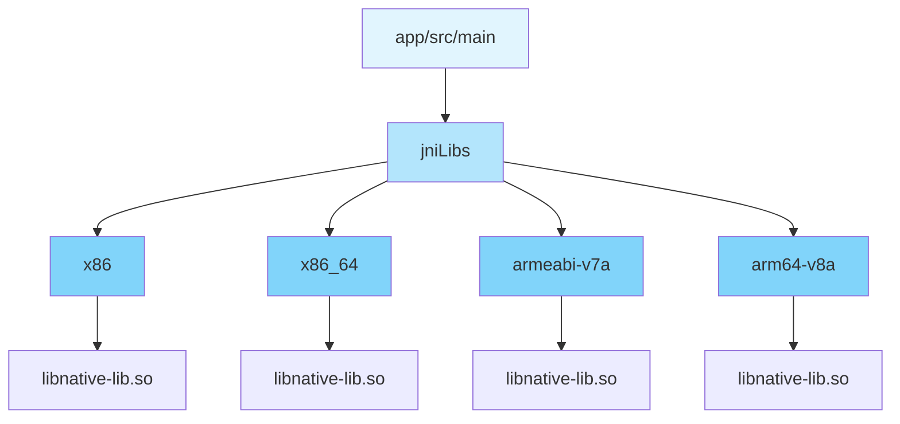
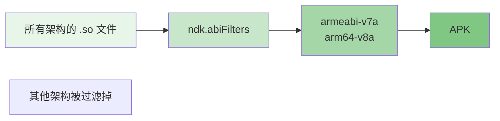
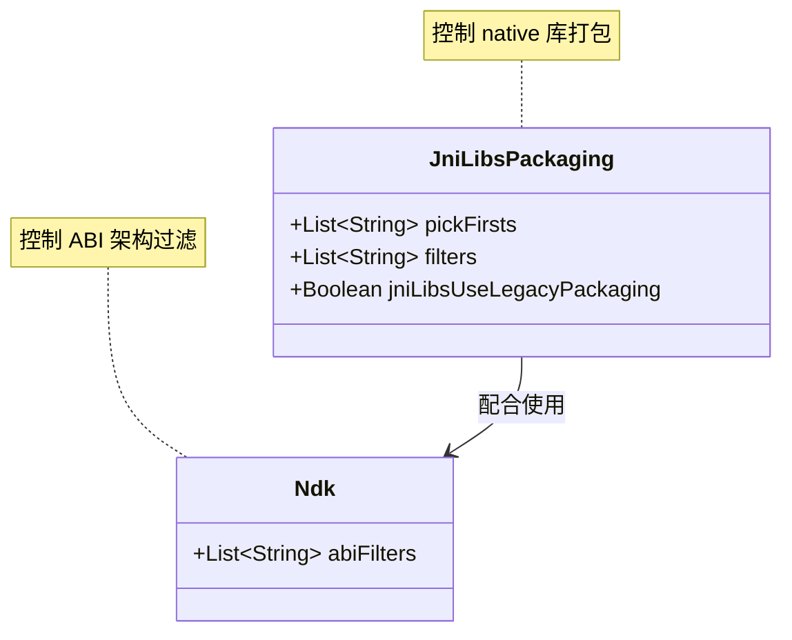

# 21.1.137 JniLibs打包

太阳像一枚煮熟的蛋黄，慢慢地向山的那头沉下去。湖面上倒映着橘红色的晚霞，偶尔有几只水鸟悠然划过，留下一道道涟漪。

洛芙盘腿坐在帐篷前的草地上，手边放着一杯还在冒热气的可可。她的笔记本电脑屏幕上是今天下午刚跑完的 JaCoCo 覆盖率报告——绿色的百分比数字看得她心情很好。

“覆盖率 78%了呢！”她伸了个懒腰，满足地叹了口气。

希尔从湖边走回来，手里晃着一根刚摘的草茎：“是不错，不过你们有没有想过，如果我们的应用要用到 native 代码——比如 C++ 写的算法库，或者某个图像处理的.so 文件——该怎么打包进 APK？”

洛芙眨了眨眼：“直接放进去不就行了？”

“哪有那么简单。”黛琳在火堆旁坐下，从背包里掏出一个文件夹——里面是今天她收集的各种技术资料，“来，今天我们来聊聊 JniLibs 打包的事情。”

伊莎凑过来，轻轻拨弄着篝火：“是说那些 .so 文件吗？我记得之前项目里好像见过 lib 文件夹。”

“对，就是它们。”黛琳翻开一页资料，“Android 应用可以用 JNI 调用 native 代码，这些 native 库文件通常是以 .so 为后缀的。我们需要把它们正确地打包进 APK，这个过程就涉及到 JniLibs 打包配置。”

---

## 湖边的神秘箱子

希尔在地上一拍手掌：“这么说吧——想象你的 APK 是一个大集装箱，要运到用户的手机上去。native 库文件就是集装箱里的特殊货物，需要特殊的打包方式。”

洛芙歪着头：“那我们需要配置什么？”

“主要是三个方面。”黛琳比划着手指，“第一，哪些 native 库要放进去；第二，如果有重复的库该怎么选；第三，怎么处理不同架构的库。”

她从口袋里掏出一张折叠的纸，摊开来看是手绘的示意图：“看，这是 Android 项目的 jniLibs 目录结构。”



洛芙凑近看了又看：“每个架构都有一个文件夹？那不是说一个库会复制四份？”

“对，这正是问题所在。”黛琳点头，“默认情况下，Gradle 会把每个架构的 .so 文件都打包进去。如果你有四个架构的库，APK 体积就会变成四倍。”

“那怎么优化？”洛芙问。

“这就要用到 JniLibsPackaging 的配置了。”黛琳翻开另一页资料，“比如 pickFirsts 可以用来解决重复库的问题——当多个目录有同名的 .so 文件时，只选择第一个。”

```kotlin
android {
    packaging {
        jniLibs {
            // 当多个目录存在同名 .so 文件时，只选择第一个
            pickFirsts += "libnative-lib.so"
            pickFirsts += "libimage-processor.so"
            
            // 排除某些不需要的库
            filters += "libdebug-utils.so"
            
            // 使用 legacy 打包方式（兼容旧项目）
            jniLibsUseLegacyPackaging = false
        }
    }
}
```

---

## 选择困难症的解决方案

伊莎把一根木柴丢进火堆，火星噼里啪啦地跳了一下：“能不能说得更具体一点？比如我们实际项目里会怎么用？”

“好问题。”希尔打开自己的笔记本，“我之前做过一个图像处理的 App，用到了 OpenCV 的 native 库。让我给你们看看我的配置文件。”

她在键盘上敲了几下，调出一个 build.gradle.kts 文件：

```kotlin
android {
    namespace = "com.example.imageapp"
    compileSdk = 34

    defaultConfig {
        applicationId = "com.example.imageapp"
        minSdk = 24
        targetSdk = 34
    }

    packaging {
        jniLibs {
            // 解决库冲突：多个模块可能提供同名的 .so 文件
            pickFirsts.add("libopencv_java.so")
            pickFirsts.add("libc++_shared.so")
            
            // 排除调试版本的库（发布时不需要）
            filters.add("libdebug-render.so")
            
            // 不使用 legacy 打包，使用新的方式
            jniLibsUseLegacyPackaging = false
        }
    }
}
```

洛芙看着屏幕：“这个 pickFirsts 是怎么工作的？它怎么知道哪个是'第一个'？”

希尔笑着解释：“这个'第一个'是按照 Gradle 的依赖顺序来确定的。比如你的主模块依赖了模块 A 和模块 B，它们都有 libfoo.so，那 pickFirsts 就会选择依赖链中先出现的那个。”

“那如果我想指定特定的架构呢？”洛芙又问。

“这时候可以用 filters。”希尔调出另一段配置，“比如我们只想要 arm64-v8a 架构的库，其他的都排除掉。”

```kotlin
android {
    packaging {
        jniLibs {
            // 只保留特定架构的库
            // 注意：这种配置需要配合 sourceSets 使用
        }
    }
}

android.sourceSets {
    getByName("main") {
        // 只包含 arm64-v8a 架构的 native 库
        jniLibs.srcDirs += listOf("src/main/lib/arm64-v8a")
    }
}
```

---

## 湖面上升起的星星

黛琳看着远处的湖面，忽然说：“其实还有一种更常见的场景——ndk.abiFilters。”

她站起来，在地上找了一根小树枝，在地面上画着图示：“这是在 defaultConfig 里用的，专门用来指定最终 APK 要包含哪些架构的 native 库。”



“在 defaultConfig 里这样写，”黛琳边写边说：

```kotlin
android {
    defaultConfig {
        ndk {
            // 只打包这两个架构的库
            abiFilters += "armeabi-v7a"
            abiFilters += "arm64-v8a"
        }
    }
}
```

洛芙赶紧把这个记下来：“那这个和 jniLibs 的 filters 有什么区别？”

“abiFilters 是从源头过滤——Gradle 在打包时就不把其他架构的库放进去。而 jniLibs.filters 是在打包之后排除某些特定的库。”黛琳用树枝在地上画了个圈，“简单说，abiFilters 效率更高，因为它直接从源头上减少了要处理的文件数量。”

---

## 萤火虫与打包策略

天色已经完全暗下来了。草丛里开始有萤火虫闪烁，像是谁不小心撒落的小星星。

伊莎轻轻拍手：“真美啊……不过说真的，我之前被这个问题坑过。”

“什么？”希尔问。

“那时候我做一个音乐播放器，用到了一个音频库的 native 库。结果调试的时候一直报 UnsatisfiedLinkError，折腾了好久。”伊莎抱着膝盖，“后来发现是 jniLibsUseLegacyPackaging 这个配置的问题。”

“这个配置是做什么的？”洛芙问。

“简单说，它决定了 .so 文件放在 APK 的哪个路径下面。”伊莎解释，“旧的打包方式会把 native 库放在 lib/ 目录下，新的方式是放在 lib/{abi}/ 目录下。有些老版本的系统只能识别旧的方式。”

黛琳补充：“所以 Google 现在的默认设置是 false，使用新的打包方式。但如果你的应用需要兼容很老的设备，可能需要把 jniLibsUseLegacyPackaging 设为 true。”

```kotlin
android {
    packaging {
        jniLibs {
            // 设为 true 以兼容旧版 Android 系统
            jniLibsUseLegacyPackaging = true
        }
    }
}
```

---

## 篝火边的代码实验

希尔把笔记本放在膝盖上：“我来跑一下，给你们看看实际的打包结果。”

她快速写了一个测试项目，配置了简单的 jniLibs 选项，然后运行 assembleDebug 任务。

“来看打包后的 APK 结构。”希尔指着屏幕上的输出，“这是解压后的目录结构——”

```
app/build/outputs/apk/debug/
└── app-debug.apk (解压后)
    ├── lib/
    │   ├── arm64-v8a/
    │   │   └── libnative-lib.so
    │   └── armeabi-v7a/
    │       └── libnative-lib.so
    └── ...
```

“如果我们加上 abiFilters 限制只用 arm64-v8a，”希尔调整了配置重新打包，“就会变成这样——”

```
app/build/outputs/apk/debug/
└── app-debug.apk (解压后)
    ├── lib/
    │   └── arm64-v8a/
    │       └── libnative-lib.so
    └── ...
```

洛芙对比着两个输出：“APK 体积明显变小了呢！”

“对，这正是优化的关键。”黛琳说，“现在主流设备大部分是 arm64-v8a 了，如果你的应用不需要支持很老的设备，可以只保留这个架构，能省下不少空间。”

---

## 湖边的夜话

夜风轻轻吹过，湖面上泛起点点银光。萤火虫在草丛间飞舞，像是在举办一场安静的灯光秀。

“说到底，JniLibs 打包就是为了解决三个问题。”伊莎总结道，“第一是库冲突，第二是 APK 体积，第三是兼容性。”

黛琳点头：“核心的配置就是这三个：pickFirsts 处理冲突，abiFilters 控制架构，jniLibsUseLegacyPackaging 处理兼容性。”

洛芙看着远处的湖面，忽然想到一个问题：“那如果我自己写 native 代码，用 Android Studio 的模板自动生成项目，还需要配置这些吗？”

“一般来说，Android Studio 的 CMake 或 ndkBuild 模板会自动帮你处理好大部分事情。”希尔说，“但了解这些配置能让你在遇到特殊需求时知道怎么调整。”

她停顿了一下：“比如你想用某个预编译的 .so 库，或者需要优化 APK 体积，或者要兼容特定的老设备——这些时候就需要手动配置了。”

---

## 专业技术总结

> JniLibsPackaging 是 Android Gradle Plugin 中用于配置 native 库（JNI 库）打包行为的 DSL。通过它可以控制 .so 文件在 APK 中的存放方式、架构过滤和冲突处理。

#### 结构图



#### 复杂度与影响

- **APK 体积**：每个架构的 .so 文件约占用 1-5MB，过滤不必要的架构可显著减小 APK 体积
- **打包时间**：大量 .so 文件会延长打包时间，合理使用 abiFilters 可优化
- **兼容性**：旧版 Android 系统可能需要 legacy 打包方式

#### 反模式与陷阱

1. **不指定 abiFilters 导致 APK 过大**：默认打包所有架构 → 修复：使用 ndk.abiFilters 只保留必要的架构
2. **忽略库冲突导致运行时崩溃**：多个模块提供同名 .so 文件 → 修复：使用 pickFirsts 指定优先使用哪个
3. **legacy 打包方式导致兼容性问题**：在新的 Android 版本上找不到库 → 修复：默认使用 false，或根据实际测试决定

#### 设计哲学

- **按需打包**：只包含目标设备需要的架构，避免无用体积
- **明确优先**：通过 pickFirsts 明确解决库冲突的规则
- **向后兼容**：通过 jniLibsUseLegacyPackaging 兼顾老设备

#### 动手练习

**目标**：掌握 JniLibs 打包配置，能够根据项目需求正确配置 native 库打包。

**Task 1：配置基本 JniLibs 选项**

- 目标：创建一个包含 native 库的项目，并配置基本的打包选项
- 步骤：
  1. 在 Android Studio 创建新项目，勾选 "Include C++ support"
  2. 在 build.gradle 中找到 packaging.jniLibs 块
  3. 添加 pickFirsts 配置，处理可能的库冲突
  4. 运行 assembleDebug，检查 APK 中的 lib 目录结构
- 验收标准：
  - [ ] 项目能正常编译
  - [ ] APK 解压后能看到 lib/{abi}/xxx.so 文件结构
  - [ ] 配置了 pickFirsts 并理解其作用

**Task 2：使用 abiFilters 优化 APK 体积**

- 目标：通过限制架构来减小 APK 体积
- 步骤：
  1. 在 defaultConfig.ndk 块中添加 abiFilters
  2. 只保留 "arm64-v8a" 架构
  3. 重新编译，对比 APK 大小变化
- 验收标准：
  - [ ] 配置 abiFilters 后 APK 体积明显减小
  - [ ] 应用能在 arm64 设备上正常运行
  - [ ] 理解什么时候该用、什么时候不该用这个配置

**Task 3：处理库冲突**

- 目标：学习解决多个模块提供同名 .so 文件的问题
- 步骤：
  1. 创建两个库模块，都包含同名的 .so 文件
  2. 主模块依赖这两个库
  3. 使用 pickFirsts 指定使用哪个库
  4. 运行验证实际打包的是哪个
- 验收标准：
  - [ ] 理解 pickFirsts 的优先级机制
  - [ ] 能根据实际需求选择正确的库
  - [ ] 了解如何调试库冲突问题

**Task 4：兼容旧设备**

- 目标：了解 jniLibsUseLegacyPackaging 的作用
- 步骤：
  1. 设置 jniLibsUseLegacyPackaging = true
  2. 打包并检查 APK 中 .so 文件的存放位置
  3. 设置 false 再打包，对比差异
- 验收标准：
  - [ ] 理解 legacy 和非 legacy 打包方式的区别
  - [ ] 能根据目标设备选择合适的配置
  - [ ] 了解可能遇到的兼容性问题

#### 面试热身

1. 请解释 Android APK 中 native 库的默认存放位置是什么？
2. 如果你发现 APK 体积过大，会从哪些方面考虑优化？
3. 讲述一次你解决 native 库冲突的经历。
4. ndi.abiFilters 和 jniLibs.filters 有什么区别？分别用在什么场景？
5. jniLibsUseLegacyPackaging 什么时候应该设为 true？

#### 参考实现要点

1. 优先使用 ndk.abiFilters 过滤架构，比 jniLibs.filters 更高效
2. pickFirsts 是按照 Gradle 依赖顺序选择的，不是字面意义的"第一个"
3. 现代 Android 项目推荐使用 jniLibsUseLegacyPackaging = false
4. 调试 native 库问题时，优先检查 APK 中的 lib 目录结构
5. 发布到 Google Play 的应用建议使用 App Bundle，让 Play 自动优化架构

> 学习建议：JniLibs 打包配置是处理 native 库时的必备技能。建议先在测试项目中尝试各种配置，打包后解压 APK 检查实际结果，这样能更直观地理解每个选项的作用。如果项目中有 native 代码，可以尝试移除某些架构，看看对 APK 体积的影响。

## 洛芙的小小日记本

今天学了 JniLibs 打包！以前看到 lib 文件夹里的 .so 文件就头大，现在终于知道它们是怎么进到 APK 里的了。 pickFirsts 解决冲突，abiFilters 控制体积，legacy 包装兼容老设备——三个配置器各司其职，感觉像篝火一样把知识串起来了。明天去试试看！

---

## 今日关键词

- **JniLibsPackaging**：Android Gradle Plugin 中用于配置 native 库打包行为的 DSL
- **.so 文件**：Linux/Unix 系统上的共享库文件，Android 中的 native 库格式
- **ABI**：Application Binary Interface，应用二进制接口，不同 CPU 架构使用不同的 ABI
- **pickFirsts**：JniLibs 配置项，用于解决多个同名 .so 文件的冲突
- **filters**：JniLibs 配置项，用于排除特定的库文件
- **jniLibsUseLegacyPackaging**：控制是否使用旧的库打包方式
- **ndk.abiFilters**：NDK 配置项，用于过滤要打包的架构
- **JNI**：Java Native Interface，Java 和 native 代码之间的接口
- **App Bundle**：Google Play 推荐的应用分发格式，可以自动优化架构