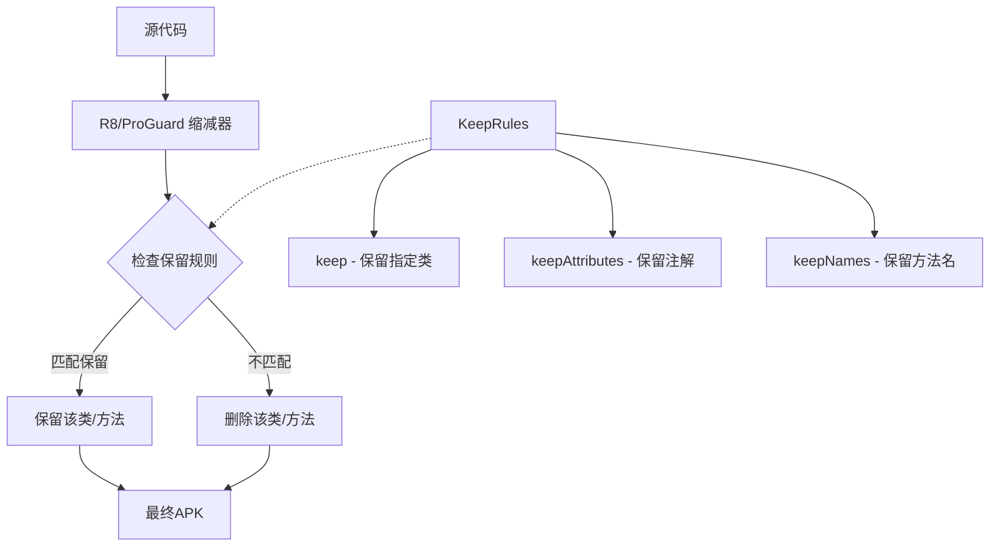
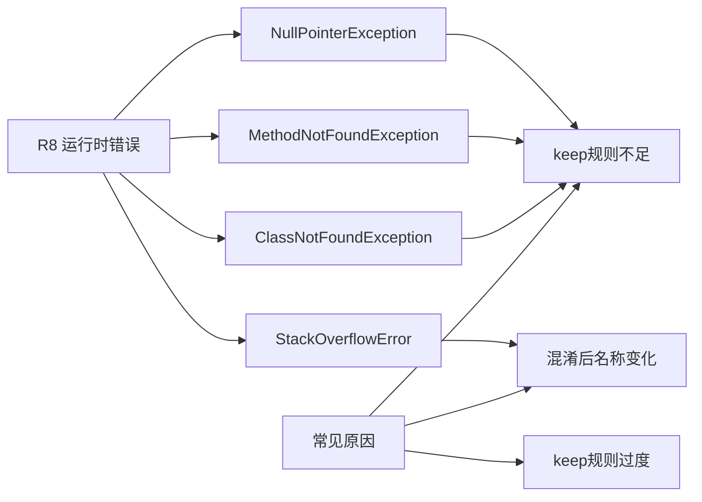
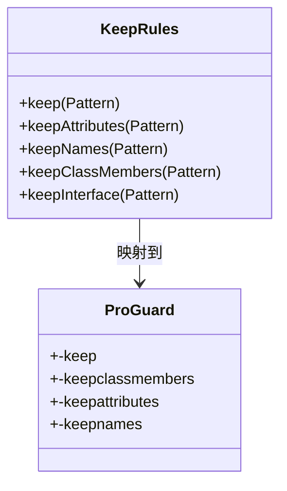

# 21.1.138 遵守规则

夜色终于完全降临了。

洛芙钻进了帐篷里，侧躺着透过纱窗往外看。湖面上倒映着刚出来的星星，一闪一闪的，像是谁不小心打翻了一盒亮片。远处偶尔传来几声青蛙的叫声，加上草丛里窸窸窣窣的虫鸣，这大概是夏天最典型的夜晚交响乐。

“洛芙，别发呆啦。”希尔的声音从外面传来，“黛琳说今晚要讲个很重要的东西。”

“什么东西呀？”洛芙把脑袋探出帐篷。

黛琳已经盘腿坐在草地上，笔记本电脑放在膝盖上，屏幕的光映得她的脸忽明忽暗。伊莎在旁边捧着一杯热茶，蒸汽袅袅升起。

“今天下午我们学了JniLibs，对吧？”黛琳抬起头，“但还有一个很关键的配置没讲——就是怎么告诉缩减工具，哪些代码应该保留，哪些可以扔掉。”

洛芙眨了眨眼：“缩减？扔掉？”

“对，你的APK不是越大越好，对吧？”希尔从帐篷里钻出来，一屁股坐到黛琳旁边，“但是缩减代码的时候，有个问题——有些代码看起来没用，其实在运行时会被调用。R8或者ProGuard不聪明，它只会看代码里有没有直接的调用。如果你用了反射、或者有native方法、或者有序列化——这些都可能被错误地删掉。”

“所以我们需要告诉它，”伊莎轻轻说，“哪些是宝贝，不能丢。”

黛琳点了点头，把笔记本转过来给她们看。屏幕上是一个build.gradle文件的片段。

“你们看，这个是KeepRules。”黛琳指着屏幕上的代码说，“它是Android Gradle Plugin里的一个DSL对象，专门用来配置代码缩减时的保留规则。”

```groovy
android {
    buildTypes {
        release {
            // 启用代码缩减
            minifyEnabled true
            shrinkResources true
            
            // 配置保留规则
            proguardFiles getDefaultProguardFile('proguard-android-optimize.txt'), 'proguard-rules.pro'
        }
    }
}
```

“等等，我看到proguardFiles，”洛芙说，“但KeepRules在哪里？”

“在android.defaults.buildFeatures里也可以用，”黛琳笑着说，“或者在com.android.tools.build.gradle.api.KeepRules这个接口里。不过最常见的用法是通过proguardFiles指定一个规则文件。但KeepRules DSL本身可以在build.gradle里直接配置。”

黛琳切换了一个文件，给她们看另一个例子：

```groovy
android.buildTypes.release.buildFeatures.buildConfig = true

android.buildTypes.debug {
    // Debug 构建可以不用缩减
    minifyEnabled = false
}

android.buildTypes.release {
    // Release 构建启用完整缩减
    minifyEnabled = true
    isMinifyEnabled = true
    
    // 使用 KeepRules 配置
    // 这是一个 DSL 对象，可以链式调用
    android.buildTypes.release.buildFeatures.buildConfig = true
}
```

“这些配置好复杂啊，”洛芙歪着头，“我们能不能先从最基本的开始讲？”

黛琳点点头，把白板拿过来，用马克笔画了一个简单的图：



“这样看就清楚多了，对吧？”黛琳说，“KeepRules就是给R8/ProGuard的一本'护身符手册'——告诉它看到这些名字就放过去，别删。”

洛芙看着图，若有所思地说：“就像……我们在山里走路的时候，会在树上绑一条带子，告诉后面的人'这条路走得通'？”

“对！这个比喻很贴切。”伊莎笑着说，“那些带子就是keep规则。”

希尔把电脑拿过来，开始写代码示例：“我给你们看一个最常见的场景——如果你用了反射来调用某个方法，R8不知道这件事，就会把它删掉。”

```kotlin
// 这是一个会被反射调用的类
class SecretAgent {
    // 这个方法会被反射调用
    fun executeMission(missionCode: String): String {
        return "Agent $missionCode ready!"
    }
}

// 反射调用的代码
fun main() {
    val clazz = Class.forName("com.example.SecretAgent")
    val method = clazz.getMethod("executeMission", String::class.java)
    val result = method.invoke(null, "007")
    println(result)
}
```

“如果不做任何保护，R8会认为SecretAgent类没有被直接调用，就会把它删掉。”希尔说，“然后运行时就崩溃了。”

“那怎么办？”洛芙问。

“用-keep规则。”黛琳说，“在proguard-rules.pro文件里写：”

```proguard
# 保留 SecretAgent 类
-keep class com.example.SecretAgent { *; }

# 保留 executeMission 方法
-keep class com.example.SecretAgent {
    public java.lang.String executeMission(java.lang.String);
}

# 也可以用通配符保留所有方法
-keep class com.example.SecretAgent {
    public *;
}
```

洛芙把这些规则抄到笔记本上，想了想又问：“那KeepRules DSL和proguard文件是什么关系？”

“很好问题，”黛琳说，“在现代AGP（Android Gradle Plugin）里，你可以在build.gradle里直接用代码配置，不需要单独写proguard文件。”

她切换到另一个标签页，给她们看DSL方式的例子：

```groovy
android {
    buildTypes {
        release {
            // 启用代码缩减
            minifyEnabled true
            
            // 使用 KeepRules DSL 配置保留规则
            // 这个可以在 build.gradle 里直接写，不需要单独的 .pro 文件
            proguardFiles(
                getDefaultProguardFile('proguard-android-optimize.txt'),
                'proguard-rules.pro'
            )
        }
    }
}
```

“在AGP 8.0+里，”黛琳补充道，“还有一种更简洁的方式是用keepRules属性：”

```groovy
android.buildTypes.release {
    // R8 保留规则
    // DSL 方式
    packaging {
        jniLibs {
            useLegacyPackaging = true
        }
    }
}

// 另外一种更现代的方式是通过 android.enableR8.fullMode
// 在 gradle.properties 里设置
android.enableR8.fullMode = true
```

希尔在一旁摇头：“其实我觉得初学者还是用proguard文件更直观。DSL虽然方便，但规则一多，build.gradle就变得很乱。”

“也是，”黛琳点头同意，“两种方式都可以用，看团队习惯。”

伊莎喝了口茶，慢悠悠地说：“不过呢，不管用哪种方式，都要记得检查一下——有时候规则写错了，运行时会出很奇怪的问题。”

“对，”黛琳说，“常见的问题有几种。”

她在白板上画了另一个图：



“我来说说几个典型的坑，”黛琳说，“第一个，也是最常见的——用了Gson或者Jackson这样的JSON库，结果序列化用的类被删了。”

希尔立刻点头：“我踩过！当时做一个API返回的对象，怎么解析都是null。后来才发现Gson反射创建对象的时候，那个类被R8删掉了。”

“怎么修？”洛芙问。

“在proguard文件里加：”

```proguard
# 保留 Gson 序列化用的类
-keep class com.example.model.** { *; }

# 保留 Gson 本身
-keepattributes Signature
-keepattributes *Annotation*
-dontwarn sun.misc.**
-keep class com.google.gson.** { *; }
-keep class * implements com.google.gson.TypeAdapterFactory
-keep class * implements com.google.gson.JsonSerializer
-keep class * implements com.google.gson.JsonDeserializer
```

黛琳又画了一个反模式的示例：

```kotlin
// 反模式：错误地删除了不该删的代码
// 原始代码
class DataRepository {
    fun getUser(id: Int): User {
        return User(id, "Test User")
    }
    
    // 这个方法通过反射调用，但没有被直接引用
    fun getUserByReflection(id: Int): User? {
        val method = DataRepository::class.java.getMethod("getUser", Int::class.javaPrimitiveType)
        return method.invoke(this, id) as? User
    }
}

// 如果没有正确的keep规则
// R8 会认为 getUser 方法没有被直接调用
// 然后把它删掉！
// 运行时会抛出 NoSuchMethodException
```

“重构成正确的版本是这样的：”

```kotlin
// 正确的做法：添加保留规则
class DataRepository {
    fun getUser(id: Int): User {
        return User(id, "Test User")
    }
    
    // 添加 @Keep 注解（JDK 9+）或者在 proguard 里配置
    @Keep
    fun getUserByReflection(id: Int): User? {
        val method = DataRepository::class.java.getMethod("getUser", Int::class.javaPrimitiveType)
        return method.invoke(this, id) as? User
    }
}
```

“等等，@Keep注解是什么？”洛芙问。

“那个是JDK 9引入的注解，”黛琳说，“在java.lang.reflect里。不过在Android里更常用的是AndroidX的@Keep：”

```kotlin
import androidx.annotation.Keep

@Keep
fun myReflectionMethod() {
    // 这个方法不会被R8删掉
}
```

伊莎笑着说：“这就像是一个护身符——带上这个标记，R8就会绕着走。”

洛芙也笑了：“那我要给我的代码都贴上护身符！”

“别别别，”黛琳赶紧说，“不要过度保留！保留太多的话，APK缩减的效果就差了。适度最好。”

她又在白板上写了几个常见的错误：

```
反模式1：过度保留
-keep class com.example.** { *; }
结果：APK几乎没有缩减，白白浪费了优化机会

反模式2：忘记保留native方法
class NativeLib {
    native fun calculate();  // native方法如果不保留，运行时找不到
}
结果：UnsatisfiedLinkError

反模式3：混淆后接口调用失败
interface Callback {
    void onResult(String data);
}
实现类被混淆了，但接口没保留
结果：ClassCastException
```

“所以啊，”希尔总结道，“保留规则就像是一门艺术——保留太少会崩溃，保留太多会没用。”

夜空中，星星越来越多。洛芙仰头看了一会儿，又低头看笔记：“那……我们怎么知道需要保留什么呢？”

“好问题，”黛琳说，“有几个办法。一个是在build.gradle里打开混淆后的mapping文件：”

```groovy
android.buildTypes.release {
    // 生成 mapping 文件，方便调试
    isDebuggable = false
}

// 在 build.gradle 里启用
android.generateDebugProguardFiles = true
```

“然后在每次发布后保存mapping文件，”黛琳继续说，“下次出问题的时候可以用来对比。”

希尔补充：“还有一个办法是用-androidflags来查看混淆后的堆栈。不过那是发布后的事。”

“那日常开发呢？”洛芙问。

“日常开发可以用-retainclassmembers来保留类的成员，”黛琳说，“比-keep更精细：”

```proguard
# 保留所有包含 @Serializable 注解的类
-keep @Serializable class * { *; }

# 保留枚举的所有 values() 方法
-keepclassmembers enum * {
    public static **[] values();
    public static ** valueOf(java.lang.String);
}

# 保留 View 的所有 click listener
-keepclassmembers class * extends android.view.View {
    public void set*(***);
    public void add***Listener(***);
}
```

伊莎打了个小哈欠：“哎呀，说了这么多，洛芙记住了吗？”

洛芙不好意思地笑了：“记住了要保留反射调用的类、Gson序列化的类、native方法、还有枚举……好多种呢！”

“所以KeepRules的本质就是——”黛琳总结，“告诉R8：这些类和方法很重要，你下刀的时候小心点。”

“对！”洛芙点头，“就像给裁缝一张图纸，说'这块布不要剪'。”

夜风吹过，帐篷上的旗帜轻轻飘动。湖面上倒映的星光被风吹皱，碎成一片银色的鳞。

“那我们休息吧，”伊莎说，“明天还有新的东西要学呢。”

洛芙躺在睡袋里，闭上眼睛。脑海里还在回响着Keep、keepattributes、-keepclassmembers这些词。它们就像夜空中一颗颗星星，看起来杂乱，但只要找到规律，就能认出它们的位置。

明天又会是什么呢？她带着这个问题，慢慢睡着了。

---

# 专业技术总结

> **KeepRules** 是 Android Gradle Plugin 提供的 DSL 对象，用于配置 R8/ProGuard 代码缩减时的保留规则。通过指定保留规则，可以防止关键代码（反射调用、native方法、序列化类等）被错误删除。

#### 结构图



#### 反模式与陷阱

1. **过度保留**：`-keep class * { *; }` 导致APK几乎无缩减
2. **遗漏反射类**：使用`Class.forName()`或`getMethod()`的类未保留，运行时报错
3. **混淆后接口调用失败**：实现类被混淆但接口未保留，导致`ClassCastException`
4. **native方法丢失**：native方法未保留，运行时`UnsatisfiedLinkError`
5. **枚举values()方法丢失**：枚举序列化/反序列化失败

#### 设计哲学

代码缩减的核心思想是：在保证功能正确的前提下，尽量减小APK体积。保留规则的设计原则：

- **最小化原则**：只保留必须保留的类和方法
- **分层保留**：基础类库、全局配置保留；业务逻辑按需保留
- **分层测试**：每次修改保留规则后都要进行完整测试

#### 🏕️ 动手练习

**目标**：掌握KeepRules配置，能够正确保护代码不被R8错误删除

**Task 1：创建一个带反射调用的类**

1. 在Android项目中创建一个新类`ReflectionTarget`
2. 添加一个`execute()`方法，使用`Class.forName()`动态调用
3. 在主Activity中通过反射调用该类
4. 编译运行确认功能正常

**Task 2：添加ProGuard保留规则**

1. 在app目录下创建`proguard-rules.pro`文件
2. 添加规则：`-keep class com.example.ReflectionTarget { *; }`
3. 在build.gradle中启用`minifyEnabled true`
4. 编译release版本，确认反射调用仍然正常

**Task 3：测试错误保留的后果**

1. 注释掉保留规则，重新编译release版本
2. 运行应用，观察错误信息
3. 恢复保留规则，验证修复

**Task 4：添加Gson序列化支持**

1. 引入Gson库依赖
2. 创建一个数据类`UserData`
3. 将对象序列化为JSON并打印
4. 添加Gson相关保留规则

**Task 5：实现native方法保护**

1. 创建一个包含native声明的类`NativeLib`
2. 实现native方法（可以是空实现）
3. 在代码中调用native方法
4. 添加native方法保留规则

**验收标准**：

- [ ] Task 1-3 完成后，反射调用在release版本正常工作
- [ ] Task 4 完成后，Gson序列化/反序列化正常工作
- [ ] Task 5 完成后，native方法调用不崩溃

**提示代码**：

```kotlin
// Task 1 参考
class ReflectionTarget {
    fun run(): String {
        return "Reflection executed"
    }
}

// 在 Activity 中反射调用
fun callViaReflection() {
    val clazz = Class.forName("com.example.ReflectionTarget")
    val instance = clazz.newInstance()
    val method = clazz.getMethod("run")
    val result = method.invoke(instance)
}
```

```proguard
# Task 2 参考
-keep class com.example.ReflectionTarget { *; }
-keepclassmembers class com.example.ReflectionTarget { *; }

# Task 4 参考
-keepattributes Signature
-keepattributes *Annotation*
-keep class com.example.UserData { *; }
-keep class com.google.gson.** { *; }

# Task 5 参考
-keepclasseswithmembernames class * {
    native <methods>;
}
```

#### 参考实现要点

1. **优先使用@Keep注解**：AndroidX的`@Keep`注解比手动写proguard规则更清晰
2. **保存mapping文件**：每次发布都要保存mapping，用于线上问题排查
3. **分层配置**：公共库用公共的proguard规则，应用单独配置
4. **测试不可省**：release构建后必须进行完整功能测试
5. **渐进式优化**：先确保功能正确，再逐步增加缩减强度

> 学习建议：KeepRules看似简单，但线上问题往往和它相关。建议在项目初期就配置好保留规则，并建立mapping文件管理流程。反射、序列化、native是三个最容易出问题的点，要重点关注。

## 洛芙的小小日记本

今晚学到了KeepRules！就像给代码穿了一件防护衣——告诉R8哪些地方不能删。反射调用的类、Gson用的类、native方法，都要特别保护。不过也不能保护太多，不然APK就瘦不下来了。明天想试试实际配置一下~

## 今日关键词

- **KeepRules**：Android Gradle Plugin的DSL对象，用于配置代码缩减时的保留规则
- **R8/ProGuard**：代码缩减工具，删除未使用的类和方法
- **-keep**：ProGuard规则，表示保留指定类或方法
- **-keepclassmembers**：保留类的成员变量和方法
- **-keepattributes**：保留类的属性（如注解、泛型信息）
- **@Keep**：AndroidX提供的注解，用于标记不被R8删除的代码
- **shrink**：代码缩减，移除未使用的代码以减小APK体积
- **mapping文件**：R8生成的混淆映射表，用于调试混淆后的崩溃
- **反射调用**：通过Class.forName()、getMethod()等动态调用代码的方式
- **native方法**：用JNI声明的本地方法，需要特别保护以避免UnsatisfiedLinkError
- **minifyEnabled**：Gradle构建配置项，启用代码混淆和缩减
- **ClassNotFoundException**：类未找到异常，常因保留规则不足导致
- **Serialization**：序列化，对象转JSON或字节流的过程，需要保留相关类