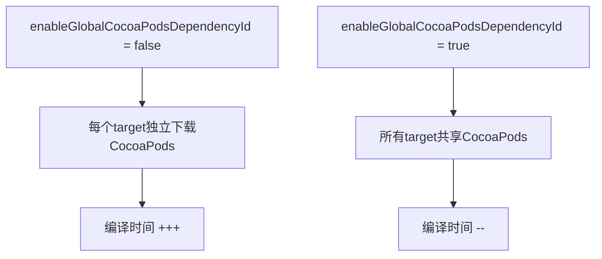
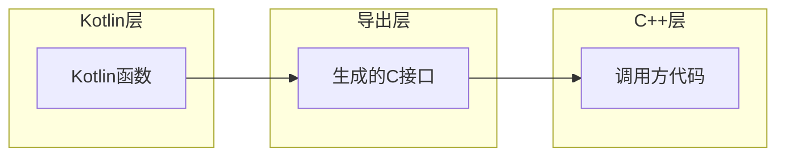

# 21.1.139 Kmp优化

星光在帐篷的透明窗上投下细碎的光斑，洛芙盘腿坐在睡袋上，笔记本电脑放在膝盖上，屏幕的光映得她脸上一片蓝盈盈的。

“等等，黛琳，”洛芙指着屏幕上的一行配置，“这个optimizer { }块是做什么的？我看官方文档说是KmpOptimization，可具体要配置些什么啊？”

黛琳正靠在帐篷壁上翻着一本厚厚的Gradle文档，听见洛芙的问题，她放下书，凑过去看了看屏幕。

“问得好，”黛琳说，“这个是我们今天要讲的重点——Kotlin Multiplatform项目的优化配置。说起来，上一晚我们不是学了KeepRules嘛，今天这个是另一把钥匙。”

伊莎正在旁边用手指卷着一缕头发丝玩，听见这话来了兴趣：“又是规则？KeepRules是保留规则，这个是优化规则，是不是像露营时候篝火的温度调节？火太大了要调小，太小了又要把木头加进去？”

“差不多是这个意思，”希尔操作性最强，立刻把电脑拿了过去，“KmpOptimization就是控制KMP编译时各种优化开关的。走，我们来实战一下。”

她快速在键盘上敲了几下，屏幕上出现了一段build.gradle.kts配置。

“你们看，”希尔指着屏幕说，“这是一个典型的KMP项目android块里的配置。optimizer { }这个块里可以填好几个选项——enableGlobalCocoaPodsDependencyId = true/false啦，enableExportToCpp = true/false啦，还有enableStabi = true/false之类的。”

洛芙凑近屏幕：“这些选项都是干什么的？能不能举个例子？”

黛琳微微笑了笑，从背包里掏出一张叠得四四方方的白纸，铺在帐篷的地垫上。她不知什么时候画的，上面画着一个简易的表格。

“这样吧，我们先从最常用的开始讲，”黛琳用指尖点点白纸，“你们知道KMP项目编译的时候，最头疼的问题是什么吗？”

“编译慢？”洛芙不确定地说。

“编译慢是一个，”黛琳点头，“但更具体来说，是当你有多个target——比如Android、iOS、Desktop、JVM——的时候，每个target都要各自编译一份代码。有很多代码其实是共同的，但我们没有告诉编译器这一点，它就会傻傻地每个平台都编译一遍。”

伊莎轻轻“啊”了一声：“就像我们在露营的时候，如果每个人都要自己从头搭一个帐篷，那多浪费时间啊。但如果我们提前把通用的帐篷骨架搭好，再根据不同人的需求加上不同的外布，是不是就快多了？”

“就是这个理，”希尔接过话头，“KmpOptimization里有个很重要的选项叫enableStabi——Enable Stable Abstractions，启用稳定抽象层。这个一旦打开，编译器就会自动识别哪些是平台无关的公共代码，只编译一次，然后所有平台共享。”

她说着，又在电脑上敲了一行代码：

```kotlin
kotlin {
    android {
        compilerOptions {
            // 启用稳定抽象层优化
            freeCompilerArgs.add("-Xenable-stabi")
        }
    }
}
```

“等等，”洛芙举手，“这和optimizer块里的设置是一样的吗？我有点搞混了。”

“问得好，”黛琳耐心地解释，“这个freeCompilerArgs是Kotlin编译器自己的参数，针对的是Kotlin编译器本身。而optimizer块是Android Gradle Plugin提供的，是更高层的配置，专门用来控制Gradle构建过程中的优化行为。”

她顿了顿，又补充道：“简单说，一个是编译时的优化，一个是构建时的优化。两者可以配合使用，但作用层面不同。”

洛芙似懂非懂地点点头：“那optimizer块具体能控制哪些优化呢？我记得官方文档里提到了一个enableGlobalCocoaPodsDependencyId？”

“对，说到这个，”希尔来劲了，她把电脑转过来让大家都看清屏幕，“这个选项是针对iOS相关的。如果你在做KMP项目需要用到CocoaPods，启用这个可以让所有的CocoaPods依赖共享同一个ID，避免重复下载和编译。”

她在屏幕上画了一个简单的示意图：



“看到没有，”希尔说，“如果不开这个选项，你的iOS Main和iOS Test会各自下载一份CocoaPods依赖，编译时间翻倍。开启之后，只要下载一次，所有target都能用。”

“那这个选项是默认开启的吗？”洛芙问。

“不是，默认是false，”黛琳的回答很干脆，“因为这个功能相对较新，有些项目可能依赖旧的配置方式。所以需要手动开启。”

伊莎若有所思地玩着头发：“也就是说，要根据项目的实际情况来选择开还是不开。就像露营的时候，要不要开篝火，要看天气冷不冷、有没有防火规定一样。”

“没错，”黛琳表示同意，“KmpOptimization的核心理念就是这样——不是一股脑儿把所有的优化都打开，而是根据项目的具体需求，选择性地启用。”

洛芙忽然想到了什么：“那……如果我不知道该项目需要哪些优化怎么办？有没有什么办法能自动检测？”

希尔打了个响指：“问得好！其实有一个很实用的技巧——Gradle提供了build scan功能，可以分析你的构建过程，找出哪些地方最耗时。”

她说着，打开了Android Studio的Build窗口，指着上面的Gradle图标说：“你们看这个，这里有个'Run with --scan'选项。跑一次带scan的构建，生成的报告中会明确告诉你哪一步最慢、哪一步可以优化。”

黛琳点点头：“不仅是build scan，Android Studio的Profiler也能看到Kotlin编译的时间分布。关键是要有数据支撑，而不是凭感觉优化。”

帐篷外的萤火虫又亮了起来，洛芙抬头看了一眼星空：“对了，我还想问一下——刚才说的enableStabi和这个optimizer块里的stableAbiThreshold之类的参数，是什么关系？”

“问得很深入了，”黛琳赞许地看了洛芙一眼，“stableAbiThreshold是用来设置一个阈值的，只有当公共代码的比例超过这个阈值时，stable ABI优化才会生效。这个阈值默认是0.5，也就是50%。”

她在白纸上画了一个简单的公式：


“如果你的项目公共代码占比不高，强行开启stable ABI反而可能带来额外的适配成本，”黛琳补充道，“所以这个阈值是个保险阀。”

伊莎把白纸拿过来看了又看：“原来是这样……那这个阈值一般设置多少比较合适呢？”

“这个没有标准答案，”希尔说，“一般来说是0.3到0.7之间。如果你的项目是那种跨平台代码占比很高的——比如业务逻辑大部分都是共享的，只有UI层各平台各写各的——那可以设低一点，比如0.3，让优化尽早生效。”

“反过来说，”黛琳接口道，“如果你的项目各平台代码差异很大，只有少量工具类是共享的，那就设高一点，比如0.6或0.7，省得白费功夫。”

洛芙若有所思地点点头：“感觉好像在调一个天平——左边是编译速度，右边是适配复杂度。”

“这个比喻很贴切，”黛琳笑了，“做工程就是这样，没有绝对的最优解，只有最适合当前情况的选择。”

希尔忽然想起什么，拍了拍手：“对了对了，还有一点忘了说——KmpOptimization不仅仅是编译速度的优化，还涉及到产物的优化。”

她重新调出一个配置示例：

```kotlin
android {
    kotlin {
        compilerOptions {
            // 优化产物大小
            freeCompilerArgs.add("-Xsize-optimizer")
        }
    }
    
    // 这里是Android Gradle Plugin的KMP优化配置
    kmpOptimization {
        // 启用产物大小优化
        enableSizeOptimization = true
        // 启用代码混淆
        enableCode obfuscation = true
    }
}
```

洛芙的眼睛一下子瞪大了：“代码混淆？！那我辛辛苦苦写的代码还能看吗？”

“别紧张，”希尔笑着解释，“这里的混淆是可选的，而且混淆的是发布版本，不是调试版本。混淆的好处是别人无法轻易反编译你的代码看明白你的逻辑，就像——”

“就像把露营地的地图用密码画一样，”伊莎轻声补充，“只有知道密码的人才能看懂。”

洛芙拍了拍胸口：“那就好那就好，我还以为要变成天书了呢。”

“对了，还有一个很重要的选项，”黛琳的声音变得认真了一些，“enableExportToCpp。如果你想把Kotlin代码导出给C++层调用，就要开启这个。这个在做一些底层native开发的时候很有用，但不是默认开启的。”

“为什么不是默认的呢？”洛芙问。

“因为这个涉及到ABI的稳定性问题，”黛琳解释道，“一旦开启导C++，就意味着你的Kotlin代码结构不能随便改了，否则会导致C++层调用出错。所以这是一个需要慎重对待的选项。”

希尔补充道：“开启这个之后，Gradle会生成一个.c文件和.h文件，C++代码可以通过这些文件来调用Kotlin的函数和类。”

她说着，在屏幕上画了一个简单的调用关系图：



“这样就明白了，”洛芙说，“相当于在Kotlin和C++之间架了一座桥。”

“对，”黛琳点头，“而且这座桥一旦架好，就不能随便拆了重搭——这就是为什么不是默认开启的原因。”

帐篷里安静了一会儿，只有键盘偶尔的敲击声。洛芙看着屏幕上的配置，若有所思。

“那……有没有什么最佳实践之类的？”洛芙问，“比如项目刚开始的时候怎么配置，等项目做大了又要怎么调整？”

希尔和黛琳对视一眼笑了笑。

“有，”希尔说，“一般来说，项目初期不建议开太多优化，先保证功能跑通。等项目进入稳定期，需要发版交付了，再考虑开启各种优化选项。”

“还有个原则，”黛琳补充道，“优先优化最耗时的部分。用build scan跑一次，看看哪个环节最慢，就重点优化哪个。不要凭感觉盲目的优化。”

伊莎把玩着头发轻声说：“就像整理行李一样——出发前先把最重要的东西装进去，至于怎么摆放得更整齐，那是到了营地之后才要考虑的事情。”

“伊莎这个比喻越来越到位了，”希尔笑道，“总结一下今天学的：KmpOptimization是用来配置KMP项目编译优化的，主要包括编译速度优化和产物优化两大块。具体选项有enableGlobalCocoaPodsDependencyId、enableExportToCpp、enableStabi，还有size优化和代码混淆等等。”

洛芙认真地在脑海里过了一遍：“感觉信息量好大……不过核心思想我抓住了：按需配置，用数据说话。”

“对，就是这样，”黛琳表示赞许，“工程没有银弹，只有最适合当前情况的选择。”

---

> 学习建议：KmpOptimization是Kotlin Multiplatform项目的重要优化工具，建议先从enableGlobalCocoaPodsDependencyId和enableStabi这两个最常用的选项开始实验。使用Gradle Build Scan分析项目构建时间，有针对性地选择需要开启的优化选项。

## 洛芙的小小日记本

今天学会了KMP的优化配置！黛琳说不是把所有选项都打开就是好的，要根据项目实际情况来。希尔教我用build scan看哪里最慢再优化。伊莎说就像露营时要先保证火能生起来，再考虑怎么把火调旺——是这个道理！

## 今日关键词

- **KmpOptimization**：Kotlin Multiplatform项目的Gradle构建优化配置块，用于控制编译速度、产物大小、代码混淆等
- **enableGlobalCocoaPodsDependencyId**：KMP iOS目标的优化选项，启用后所有target共享CocoaPods依赖，减少重复下载
- **enableExportToCpp**：将Kotlin代码导出给C++层调用的开关，开启后生成C接口文件
- **enableStabi / stableAbiThreshold**：稳定抽象层优化及其生效阈值，用于识别并优化跨平台公共代码
- **enableSizeOptimization**：产物大小优化选项，用于缩减最终APK/AAB的体积
- **Gradle Build Scan**：Gradle提供的构建分析工具，可生成详细的构建报告，找出耗时环节
- **Kotlin Compiler Options**：Kotlin编译器参数配置，通过freeCompilerArgs添加编译选项
- **ABI稳定性**：应用程序二进制接口的稳定性，一旦导出给C++调用就不能随意修改结构
