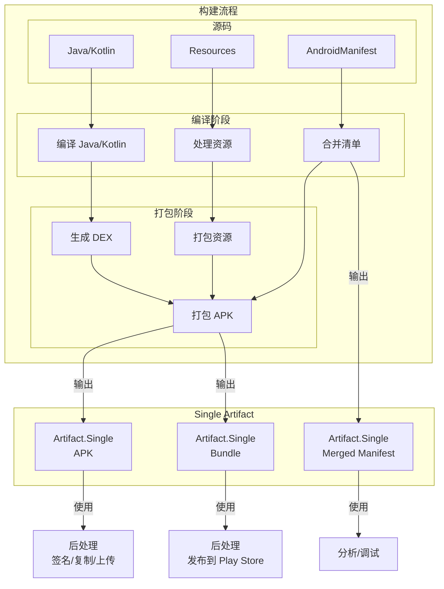
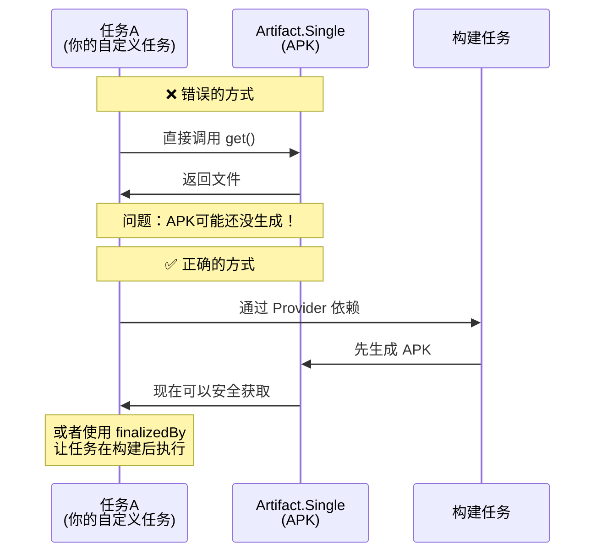

# 21.1.14 Artifact.Single

夜色渐浓。

帐篷外面，偶尔有几只萤火虫提着小灯笼一闪一闪地飞过，像是夜空散落在草丛里的星星。露水开始在草叶尖上凝结，每一滴都映着帐篷里透出来的微弱光芒，像是一颗颗小小的水晶珠。

洛芙靠在折叠枕头上，手里捧着一杯还温热的可可。白天在山间走了一天，此刻的她有点昏昏欲睡，但一听到黛琳说“今天要讲Artifact.Single”，立刻又精神了起来。

“昨天的Replaceable好厉害，”洛芙打了个小哈欠，“今天的Single又是什么呀？”

黛琳把小白板支好，夜风吹得她的发梢轻轻晃动：“昨天我们讲了可以‘替换’的artifact——Replaceable。今天要讲的呢，是最基础的一种——Single。”

“ Single……单独？”洛芙眨了眨眼，“是说它只能单独存在吗？”

“对了一半，”希尔正在调试笔记本，屏幕的蓝光映在她的脸上，“Single呢，就是‘单个’的意思。它不像Appendable那样可以‘追加’一堆东西，也不像Replaceable那样可以‘替换’。它就是一个——独一无二的产出物。”

伊莎轻轻笑了笑，从背包里拿出一个小盒子：“我有个比喻——Single就像是什么呢……就像是你烤了一份小点心，只能装在唯一一个盒子里，不能拆分，也不能替换。”

“哇，这个比喻好！”洛芙立刻明白了，“那哪些artifact是Single类型的呢？”

黛琳在地上的白板写了起来：“最常见的有——APK、Bundle、还有合并后的清单文件。这些都是Single——一个项目最终只会有一个APK，一个Bundle，对吧？”

“对哦，”洛芙点点头，“总不可能一个项目跑出来两个APK吧？”

“正常情况下不会，”希尔说，“不过世事无绝对哦。 有些特殊情况下，你可能需要生成多个APK——比如针对不同ABI的分割APK。那时候就会用到不同的机制了。”

“那Single artifact该怎么用呢？”洛芙迫不及待地问。

希尔把笔记本转过来：“看好了——”

```kotlin
// 使用 Artifact.Single 的例子
android.applicationVariants.all { variant ->
    variant.artifacts.use { artifacts ->
        // 获取单个 APK artifact
        // 这是一个 Artifact.Single 类型
        val apk: Provider<File> = artifacts.get(ArtifactType.APK)
        
        // 获取单个 Bundle artifact
        val bundle: Provider<File> = artifacts.get(ArtifactType.BUNDLE)
        
        // 获取合并后的清单文件
        val manifest: Provider<File> = artifacts.get(ArtifactType.MERGED_MANIFEST)
    }
}
```

“你们看，”希尔指着代码解释，“`artifacts.get(ArtifactType.XXX)` 返回的是一个 `Provider<File>` ——也就是说，它不是直接给你一个文件，而是一个‘提供者’，等你真正需要的时候再去拿。”

洛芙歪着头问：“为什么要这么麻烦？直接给文件不行吗？”

“好问题，”黛琳接过话题，“这就要讲到Gradle的一个核心概念了——Lazy Evaluation，延迟求值。”

“延迟……求值？”洛芙对这个词有点陌生。

“想象一下，”伊莎轻声说，“你在家里有很多箱子，但不是每个箱子都需要马上打开。有些箱子你可能暂时用不上，但如果每个箱子都提前打开——会很累，对吧？延迟求值就是按需打开箱子。”

黛琳补充道：“在构建过程中也是这样。artifact可能还没有真正生成，但如果每个任务都要等所有artifact都就绪才开始，那整个构建会非常慢。Provider就是这样一个‘承诺’——我承诺以后会给你这个文件，但现在先给你一个凭证。”

洛芙似懂非懂地点点头：“好像明白了……那这个Provider怎么用呢？”

希尔又在电脑上敲了起来：

```kotlin
// 使用 Provider 获取实际文件
android.applicationVariants.all { variant ->
    variant.artifacts.use { artifacts ->
        // 获取 APK provider
        val apkProvider: Provider<File> = artifacts.get(ArtifactType.APK)
        
        // 方法1：使用 get() 获取文件（同步方式）
        // 注意：这会阻塞等待 artifact 生成
        val apkFile: File = apkProvider.get()
        println("APK 路径: ${apkFile.absolutePath}")
        
        // 方法2：使用 map() 转换（延迟方式）
        // 不会立刻执行，而是在真正需要时执行
        val apkSize: Provider<Long> = apkProvider.map { file ->
            file.length()
        }
        
        // 方法3：使用 flatMap() 展开（用于需要进一步处理的情况）
        val apkDir: Provider<File> = apkProvider.flatMap { file ->
            project.layout.buildDirectory.map { dir ->
                dir.dir("apk_info").apply { asFile.get().mkdirs() }.get()
            }
        }
        
        // 注册回调：当 artifact 可用时执行某些操作
        apkProvider.present {
            println("APK 已生成，大小: ${it.length()} bytes")
        }
    }
}
```

洛芙看得眼睛都直了：“原来Provider还有这么多用法……”

“这只是冰山一角，”黛琳笑着说，“Gradle的Provider API非常强大，可以组合、转换、展平……就像乐高积木一样。”

伊莎插话道：“不过呢，Single类型的artifact最常用的场景，还是直接获取最终产物。比如你想在构建完成后，对APK做点什么——”

“比如签名！”洛芙立刻想到了昨天的内容。

“对，”黛琳点点头，“或者你想把APK复制到某个特定的目录，或者上传到服务器……这些时候，你都需要先获取Single artifact。”

她在地上画了一幅图，解释Single artifact在整个构建流程中的位置：



“你们看，”黛琳指着图解释，“Single artifact通常出现在构建流程的‘末端’。它们是最终的产出物——APK、Bundle、合并后的清单……这些都是构建完成后，你真正能用到的东西。”

洛芙举手提问：“那……Single artifact可以和其他类型的artifact一起用吗？比如和Replaceable？”

“好问题！”希尔眼睛一亮，“当然可以！而且这正是Gradle强大之处——你可以组合使用不同的artifact类型。”

她在电脑上敲出另一个例子：

```kotlin
// 组合使用 Single 和 Replaceable
android.applicationVariants.all { variant ->
    variant.artifacts.use { artifacts ->
        // 首先，获取 Single 类型的 APK
        val apkProvider: Provider<File> = artifacts.get(ArtifactType.APK)
        
        // 可以在获取后进行替换（变成 Replaceable）
        // 这时候 APK 从 Single 变成了可替换的
        artifacts.get(ArtifactType.APK)
            .replacedBy(apkProvider.map { apk ->
                // 对 APK 进行一些处理
                processApk(apk)
            })
    }
}

// 处理 APK 的函数
fun processApk(originalApk: File): Provider<File> {
    return project.layout.buildDirectory.map { dir ->
        val processed = dir.file("processed/signed.apk")
        // 这里可以进行签名、添加元数据等操作
        // 返回处理后的文件
        processed.get().asFile
    }
}
```

洛芙看完惊呼：“原来可以这样！那……Single是不是也可以变成Appendable？”

黛琳笑着摇头：“这个就不行了。Single就是Single，它只能是一个单独的文件。你不能把一个单独的文件‘拆分’成多个——那是自然规律的范畴，不是代码的范畴。”

“噗……”伊莎忍不住笑了出来，“黛琳这个比喻好有哲学意味。”

众人都笑了起来。夜空中的星星仿佛也受到了感染，眨眼睛的速度都加快了几分。

笑过之后，洛芙又问：“那……Single artifact有没有什么需要注意的地方？比如容易犯的错误？”

希尔认真地点点头：“问得好！最大的坑就是——不要在任务还没完成的时候就去获取artifact。”

“啥意思？”洛芙没听懂。

黛琳解释道：“我举个例子——比如你在一个任务里，想获取同一次构建的APK，然后做点处理。如果你直接调用 `apkProvider.get()` ——”

“会怎么样？”洛芙追问。

“可能会死循环，或者获取到旧版本，”希尔说，“因为Gradle的任务执行是有依赖顺序的。如果你在任务A里获取任务B的artifact，但任务B还没开始——就会出问题。”

“那该怎么办？”洛芙紧张地问。

“答案就是——使用Provider的延迟特性，”黛琳说，“不要立刻调用 `get()` ，而是通过 `dependsOn()` 或者 `finalizedBy()` 来明确任务之间的依赖关系。”

她在白板上画了一幅图，解释这个问题：



“你们看，”黛琳指着图解释，“正确的方式是通过Provider的依赖机制，让Gradle自动处理先后顺序。这样就不会出现artifact还没生成就去获取的尴尬情况。”

洛芙长舒一口气：“原来还有这么多讲究……”

伊莎温柔地说：“这就是为什么我们要学这些底层机制。很多时候，代码能跑不等于代码写对了——只有理解背后的原理，才能写出真正可靠的代码。”

时间已经很晚了。帐篷外的萤火虫渐渐少了，夜风变得更凉，草丛里的虫鸣也变得稀疏——它们也要休息了。

黛琳打了个小哈欠：“今天就到这里吧。Single artifact是Gradle artifact系统的基础，理解了它之后，再学其他类型就容易多了。”

洛芙点点头，看向帐篷外。星空璀璨，像撒在天鹅绒上的钻石。

“明天还会讲什么呀？”她好奇地问。

“明天讲Artifact的迭代器——怎么遍历artifact集合，”希尔笑着说，“保管让你大开眼界！”

“哇，期待！”洛芙的眼睛里闪着光，“感觉Gradle的artifact系统好像一个宝库，越挖越多宝贝。”

“这就是开源世界的魅力，”伊莎轻声说，“每一次深入，都有新的发现。”

夜深了。

露水更重了，草叶上挂满了晶莹的水珠。帐篷里，四个女孩相继钻进了睡袋，小夜灯被调得更暗了。

“晚安，洛芙。”伊莎的声音轻轻的，像夜风一样柔和。

“晚安！”洛芙轻声回应。

闭上眼睛，她还在想着那些Single artifact——那些独一无二的产出物，就像每一颗星星都是独一无二的一样。

---

> 学习建议：Artifact.Single是Gradle artifact系统中最基础的类型，代表单个产出物如APK、Bundle等。使用时要注意Provider的延迟求值特性，通过正确的任务依赖来处理artifact，避免在artifact生成前就尝试获取。

## 洛芙的小小日记本

今天学到了Artifact.Single！原来APK、Bundle这些最终产物都是Single类型的——独一无二的产出物。伊莎说得对，技术世界和自然世界一样，每个东西都有自己的位置和角色。用好Single artifact，关键是要理解Provider的延迟特性——不能急，要等它准备好。今天也是充实的一天呀～✨

---

## 今日关键词

**Artifact.Single**：Android Gradle Plugin API中的接口，表示单个、不可分割的artifact类型。与Appendable（可追加）和Replaceable（可替换）相对应。

**Provider<File>**：Gradle提供的延迟求值容器，封装了对文件的访问。它不会立刻执行文件操作，而是提供一个“承诺”，在实际需要时才去获取文件。

**get()**：Provider的方法，用于同步获取实际值。注意：这会阻塞等待artifact生成。

**map()**：Provider的转换方法，用于在延迟模式下转换Provider的内容。

**flatMap()**：Provider的展开方法，用于处理需要进一步创建Provider的情况。

**ArtifactType.APK**：表示最终APK安装包的artifact类型，属于Single类型。

**ArtifactType.Bundle**：表示App Bundle的artifact类型，属于Single类型。

**ArtifactType.MERGED_MANIFEST**：表示合并后的AndroidManifest.xml，属于Single类型。

**延迟求值（Lazy Evaluation）**：Gradle的核心特性之一，只有在真正需要时才计算结果，可以提高构建性能。
