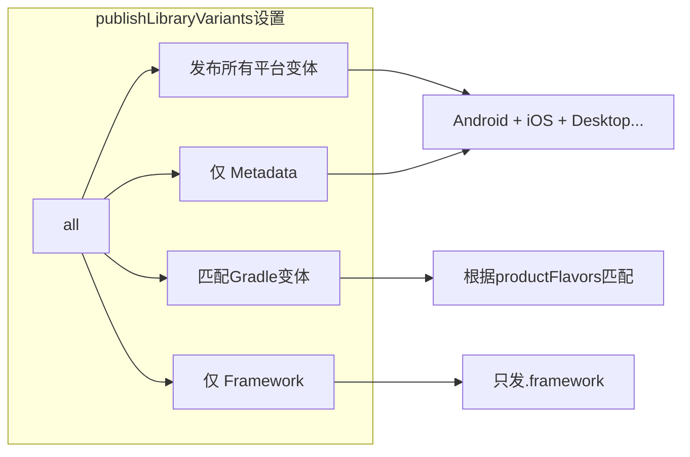
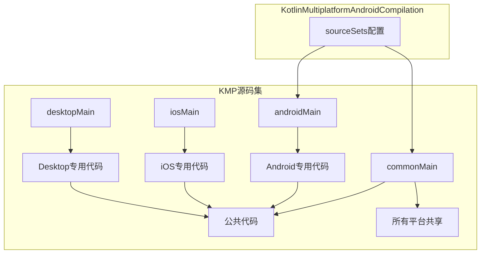
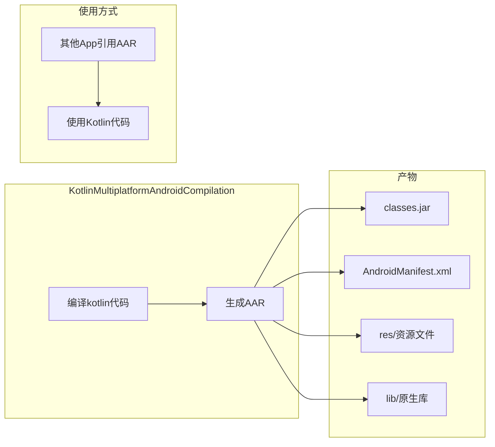

# 21.1.140 Kotlin多平台Android编译

星光透过帐篷的纱窗洒进来，在笔记本键盘上投下细碎的光点。洛芙揉了揉眼睛，看完刚才那段KmpOptimization的配置，她感觉自己像是在解密一张藏宝图。

“黛琳，”洛芙把笔记本转过去一点，指着屏幕上方的另一个配置块，“这个android { }块里还有这么多东西……刚才optimizer是优化，这个android块是做什么的？”

黛琳正把白纸叠成一个小纸船，听见问题就把纸船放在掌心托着给洛芙看：“问得好。你看这个纸船——optimizer是让船跑得更快的帆，那这个android块呢，就是船本身的设计图纸。”

“这么比喻的话……”洛芙若有所思，“是决定船能装多少货物、怎么组装的那部分？”

“差不离，”希尔从旁边探过头来，屏幕上是一个典型的KMP项目build.gradle.kts，“KotlinMultiplatformAndroidCompilation——名字很长，但它的作用很简单，就是配置Kotlin代码在Android平台上怎么编译。”

伊莎靠在帐篷壁上，手里拿着一根草茎在指尖绕来绕去：“也就是说，之前学的优化是让编译跑得更快，而这个是决定编译什么东西？”

“完全正确，”黛琳轻轻拍了拍手，“我们今天就来讲讲这个——Kotlin Multiplatform项目里的Android编译配置。”

她说着，从背包里抽出那本Gradle API文档，翻到其中一页。纸上打印着KotlinMultiplatformAndroidCompilation的结构图，只是帐篷里光线暗，看不太清楚。

“希尔，”黛琳说，“能不能把这个结构画到白板上？这样更清楚。”

希尔立刻行动起来，她把白板架好，先画了一个简单的框图：

```mermaid
flowchart TB
    subgraph KMP项目
        A[kotlin { } 块] --> B[android { } 块]
        B --> C[KotlinMultiplatformAndroidCompilation]
    end
    
    subgraph 配置内容
        C --> D[compilerOptions]
        C --> E[sourceSets]
        C --> F[dependencies]
        C --> G[publishLibraryVariants]
    end
```

“你们看，”希尔用白板笔点点这个图，“KotlinMultiplatformAndroidCompilation就是android { }块里的核心对象。它管的事情挺多的，但最常用的就这几个。”

洛芙掏出随身带的小本子，开始记录：“compilerOptions是编译器选项，sourceSets是源码集……那这个publishLibraryVariants是做什么的？”

“这个很关键，”黛琳的重要性提到了嗓子眼里，“publishLibraryVariants决定了你的KMP库发布的时候，哪些平台变体会被发布出去。”

她说着，在白板上补充了一个更详细的图：



“这个选项特别重要，”黛琳强调，“如果你做的是一个给其他App用的KMP库，publishLibraryVariants的设置直接决定了别人引用你的库时能看到哪些平台的二进制。”

洛芙想起来之前看到过一些开源的KMP库：“那……是不是说设成'all'就最好了？别人想用哪个平台就用哪个？”

“理论上是这样的，”希尔摇摇头，“但实际没那么简单。设成'all'意味着你要为每个平台都准备编译产物，这会让你的库体积变大。而且有些平台可能还没完全支持，发布出去反而会造成兼容性问题。”

伊莎把草茎编成一个简单的小环：“就像露营带的工具一样——不是带越多越好，而是要带最合适当前情况的东西。”

“对，”黛琳点头表示同意，“一般建议是先用'matchDefault'（匹配Gradle默认变体），这样Gradle会自动根据当前构建类型来选择合适的变体。等项目稳定了，再根据实际需要调整。”

洛芙在本子上记了一笔，又问：“那compilerOptions呢？这个是不是和之前学的freeCompilerArgs有关系？”

“问得好，”黛琳来了精神，“compilerOptions确实是KotlinMultiplatformAndroidCompilation里最重要的部分之一。它直接控制Kotlin编译器怎么编译你的代码。”

她把笔记本接过来，在屏幕上敲了一段代码：

```kotlin
kotlin {
    android {
        compilerOptions {
            // 设置Java目标版本
            jvmTarget.set(JvmTarget.JVM_17)
            
            // 添加编译器参数
            freeCompilerArgs.addAll(
                "-Xexpect-actual-classes",
                "-Xno-call-assertions"
            )
            
            // 启用实验性特性
            languageVersion.set(KotlinVersion.KOTLIN_2_0)
            
            // 开启渐进式模式
            progressiveMode.set(true)
        }
    }
}
```

“你们看，”黛琳指着代码说，“compilerOptions里最常用的就是这几个——jvmTarget设置Java目标版本，freeCompilerArgs添加额外的编译器参数，languageVersion指定Kotlin版本，还有progressiveMode开启渐进式模式。”

洛芙注意到一个细节：“等一下，这个jvmTarget是JVM_17……可是Android不是用Dalvik/ART吗？为什么是JVM版本？”

“好问题，”希尔接过话题，“这个问题很多人都会困惑。Android虽然不运行JVM字节码，但Kotlin编译器后端还是基于JVM的。设置jvmTarget主要是告诉编译器要兼容到什么程度的Java特性。”

她打了个比方：“就像你要建一个露营帐篷——虽然最后搭出来的是帐篷样式，但施工图纸还是要用标准的建筑语言。jvmTarget就是那个建筑标准的版本号。”

黛琳补充道：“现在主流都是JVM_17了，因为Java 17提供了很多新特性，而且性能也比之前的版本好。不过要注意，如果你的项目需要兼容比较老的Android设备，可能需要设成JVM_11或者JVM_8。”

“为什么？”洛芙问，“老设备不能用新特性吗？”

“不是老设备不能用，”黛琳耐心解释，“而是Kotlin编译器在编译成Android字节码的时候，需要做一些转换。比如Java 17的一些特性在转换成Android能用的代码时，可能会有些差异或者需要额外的polyfill。为了保险起见，有些项目会保守一点，设成JVM_11。”

伊莎轻声说：“就像给不同年龄的人写信——给小朋友写信用简单的词句，给大人写信可以用复杂的句子。jvmTarget就是告诉编译器用多复杂的'词句'。”

“这个比喻好，”黛琳笑了，“总的来说，现在新项目建议直接用JVM_17，没问题的。”

洛芙在本子上记好，又指向下一个问题：“那个freeCompilerArgs……之前学KmpOptimization的时候也见过这个，现在是同一个东西吗？”

“问得很仔细，”黛琳表示赞许，“是的，它们是同一个freeCompilerArgs。Kotlin的编译器参数是统一的，不管你配在哪个块里，效果都一样。”

她画了一个简单的图来说明：

```mermaid
flowchart TB
    subgraph freeCompilerArgs位置
        A[kotlin { } 块的 compilerOptions]
        B[android { } 块的 compilerOptions]
        C[其他平台的 compilerOptions]
    end
    
    subgraph 效果
        A --> D[统一的Kotlin编译器参数]
        B --> D
        C --> D
    end
    
    D --> E[编译时生效]
```

“但是，”黛琳话锋一转，“虽然参数是统一的，放在不同的块里有不同的作用域。比如放在android块里，那就只对Android目标生效；放在顶层kotlin { }块里，则对所有平台生效。”

洛芙明白了：“所以如果我想让某个参数只对Android生效，就放在android块的compilerOptions里？”

“对，就是这样，”希尔插嘴道，“比如你有一些Android特有的编译器参数，就可以这样单独配置。”

她说着，又敲了一段代码作为示例：

```kotlin
kotlin {
    // 顶层配置 - 对所有平台生效
    compilerOptions {
        languageVersion.set(KotlinVersion.KOTLIN_2_0)
    }
    
    // Android平台配置
    android {
        compilerOptions {
            // 只对Android生效的参数
            freeCompilerArgs.add("-Xopt-in=kotlin.RequiresOptInAnnotation")
        }
    }
    
    // iOS平台配置
    iosArm64 {
        compilerOptions {
            // 只对iOS生效的参数
            freeCompilerArgs.add("-Xopt-in=kotlin.experimental.KotlinNativeReflection")
        }
    }
}
```

洛芙看着这段代码若有所思：“原来是这样……那这个sourceSets呢？刚才你画的图里也有这个。”

“sourceSets可有意思了，”希尔来劲了，“sourceSets控制哪些源码属于这个编译目标。在KMP项目里，你可以有公共代码(commonMain)、Android专用代码(androidMain)、iOS专用代码(iosMain)等等。”

她画了一个更直观的图：



“正常情况下你不需要手动配置sourceSets，”黛琳补充道，“Gradle会根据你的目录结构自动识别。但有时候你想让Android编译目标包含一些额外的源码，或者排除某些源码，就可以在这里配置。”

洛芙好奇地问：“什么时候会需要排除源码？”

“有几种情况，”希尔说，“比如你在commonMain里写了一段代码，但这段代码在Android上有更好的替代方案，你就可以在androidMain里写一个新的，然后通过sourceSets配置让Android编译时用androidMain的版本。”

“这就叫'多态'对吧？”洛芙想到一个词。

“对，就是这个意思，”黛琳点头，“KMP的核心思想就是'write once, run anywhere'，但实际项目中多多少少会有一些平台特定的差异需要处理。sourceSets就是用来管理这些差异的。”

帐篷外传来一阵蟋蟀的叫声，洛芙抬头看了一眼星空，又低头看屏幕。

“对了，”洛芙突然想到一个问题，“刚才说的这些都是配置方面的……那编译出来的产物呢？Android编译会输出什么东西？”

黛琳和希尔对视一眼，这个问题问到了点子上。

“你这个问题很重要，”黛琳说，“KotlinMultiplatformAndroidCompilation编译出来的东西，不是普通的APK，而是一个AAR库。”

“AAR？”洛芙重复了一遍，“就是Android Library？”

“对，AAR就是Android Library的格式，”希尔说，“KMP的Android目标本质上是一个库，其他App可以引用这个库来使用你写的Kotlin代码。”

她在屏幕上画了一个流程图：



“你们看，”希尔指着图说，“AAR里面包含编译好的Kotlin字节码(classes.jar)、AndroidManifest清单、资源文件，还有如果有原生代码的话会包含so库。”

洛芙忽然想到一个问题：“那……KMP编译出来的AAR，和纯Android写的库有什么区别？”

“区别挺大的，”黛琳说，“纯Android库是Java/Kotlin直接写的，而KMP库是你用Kotlin写的跨平台代码编译出来的。KMP库的好处是代码只需要写一次，多个平台都能用。坏处是——”

“坏处是会有一些额外的开销，”希尔接过话头，“Kotlin的运行时库会被打进去，还有KMP的一些底层桥接代码。如果你只是做一个简单的工具类，可能直接写Android原生代码更划算。”

伊莎轻声说：“就像露营时候是自己带食材做饭，还是叫外卖——自己带需要前期准备，但更符合自己的口味；叫外卖快，但选择有限。”

“伊莎这个比喻太到位了，”洛芙笑着说，“那……有没有办法知道我的项目用KMP是不是合适？”

“有几个判断标准，”黛琳扳着手指说，“第一，你的代码是否需要跨平台？如果只是做Android App，那没必要用KMP。第二，你的核心业务逻辑是否相对独立？如果业务逻辑和平台耦合很深，KMP的收益也不大。第三，你的团队是否有跨平台需求？如果将来可能要做iOS或Desktop，那KMP就很合适。”

希尔补充道：“还有一点——如果你正在维护一个现有的Android库，想让它也能被iOS或Desktop项目使用，那把它转成KMP就是个不错的选择。”

洛芙把这些要点都记了下来，想了一想又问：“那……配置方面有什么最佳实践吗？比如刚才说的publishLibraryVariants设成什么好？”

“一般来说，”黛琳说，“如果是做开源库，建议设成'all'，这样使用者可以根据自己的需求选择平台。但如果是你自己的项目内部使用，设成'matchDefault'就够了，省心省力。”

“还有一个要注意的，”希尔说，“compilerOptions里的jvmTarget设成JVM_17就可以了，除非有特殊需求不要随便改。还有progressiveMode，现在Kotlin 2.0已经默认开启了，不需要手动设。”

洛芙把这些要点都记好：“感觉今天学的这个和之前的KmpOptimization是两个层面的东西——一个是优化，一个是配置。”

“对，它们是互补的，”黛琳点头，“KotlinMultiplatformAndroidCompilation管的是'编译什么'和'怎么编译'，KmpOptimization管的是'怎么让编译更快更省'。两者配合使用，才能打造一个高效的KMP项目。”

帐篷里的灯光忽明忽暗，洛芙打了个哈欠，看看时间已经不早了。

“黛琳，”洛芙揉了揉眼睛，“今天学的这些……感觉信息量好大啊。能不能总结一下？”

“当然可以，”黛琳把白板收起来，“KotlinMultiplatformAndroidCompilation是KMP项目中配置Android平台编译的核心DSL对象。它主要管这几件事：compilerOptions控制编译器参数，sourceSets管理源码集，dependencies管理依赖，publishLibraryVariants决定发布哪些变体。”

希尔补充道：“编译产物是AAR格式，可以被其他Android项目引用。jvmTarget建议用JVM_17，freeCompilerArgs是统一的编译器参数可以复用。”

伊莎把手里编好的草环放在帐篷角上：“就像搭帐篷一样——要先把支架搭好（compilerOptions），再想怎么装饰（sourceSets），最后决定带不带走（publishLibraryVariants）。”

“有伊莎帮忙总结，我就放心了，”洛芙笑了，“今天真的学到很多，感觉对KMP项目的理解又深了一层。”

夜深了，帐篷外的萤火虫仍在闪烁，像是在给她们的学习之旅打着小小的灯笼。

---

> 学习建议：KotlinMultiplatformAndroidCompilation是KMP项目中Android平台配置的核心。compilerOptions建议从jvmTarget和freeCompilerArgs开始学习。publishLibraryVariants根据项目需求选择'all'或'matchDefault'。使用KMP库时注意产物是AAR格式，需要评估是否真的需要跨平台。

## 洛芙的小小日记本

今天学了KotlinMultiplatformAndroidCompilation！黛琳说这个是决定KMP项目编译什么东西的，而KmpOptimization是决定怎么编译得更快。希尔教我看compilerOptions的配置，jvmTarget要设成JVM_17。伊莎说就像搭帐篷要先搭支架一样——配置是基础，优化是加速器。晚安～

## 今日关键词

- **KotlinMultiplatformAndroidCompilation**：KMP项目中配置Android平台编译的DSL对象
- **compilerOptions**：编译器选项配置，控制Kotlin编译器的行为
- **jvmTarget**：Java目标版本，建议JVM_17
- **freeCompilerArgs**：Kotlin编译器的额外参数
- **languageVersion**：Kotlin语言版本
- **progressiveMode**：渐进式编译模式
- **sourceSets**：源码集配置，管理不同平台的代码
- **commonMain**：KMP公共代码源码集
- **androidMain**：Android专用代码源码集
- **publishLibraryVariants**：库发布变体配置
- **AAR**：Android Archive库格式，KMP Android目标的编译产物
- **Kotlin Multiplatform**：Kotlin多平台项目，让代码跨Android、iOS、Desktop等平台运行
- **productFlavors**：Gradle产品风味，用于区分不同版本的构建配置
