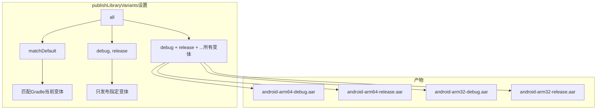
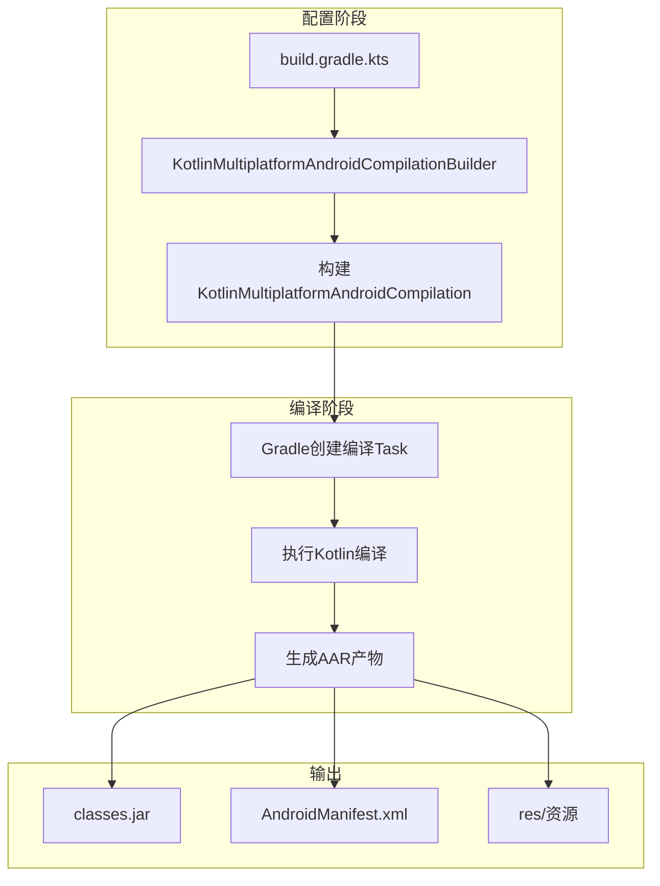

# 21.1.141 Kotlin多平台AndroidCompilationBuilder

洛芙是被清晨的阳光痒醒的。

她睁开眼，帐篷的纱窗上映着金色的光斑，外头已经有鸟叫声了。她揉了揉眼睛，发现旁边的睡袋里黛琳已经不见了，只留下折好的毯子。

“黛琳呢？”洛芙推开帐篷的门帘往外看。

湖边，黛琳正坐在一块大石头上，膝盖上放着笔记本。晨雾还没完全散去，她的背影在水气中显得模模糊糊的。

洛芙钻出帐篷走过去，清晨的空气凉凉的，带着青草和泥土的气息。

“黛琳姐姐，这么早就起来了？”

“洛芙？”黛琳回头笑了笑，“睡醒了？昨天不是问了很多关于KotlinMultiplatformAndroidCompilation的问题吗，我发现还有一个很重要的没讲到——就是那个配置是怎么build出来的。”

“build出来？”洛芙眨眨眼，“你是说……怎么创建那个配置对象？”

“对，”黛琳拍了拍身边的石头让她坐下，“昨天我们学的KotlinMultiplatformAndroidCompilation是一个配置结果，但怎么配置出这个结果呢？这就要靠它的Builder——KotlinMultiplatformAndroidCompilationBuilder。”

希尔和伊莎也从帐篷里出来了。希尔伸了个大大的懒腰，伊莎则捧着一杯刚冲好的热可可。

“早上好，”伊莎把杯子递给洛芙，“黛琳在讲Builder模式吗？这个很重要哦。”

“Builder？”洛芙接过杯子，热气扑面而来，“就是那个建造者模式？”

“没错，”黛琳把笔记本转过来给她看，“你看，在Gradle的DSL里，所有的配置都是通过Builder来构建的。比如你要配置compilerOptions，不是直接 new 一个CompilerOptions对象，而是通过builder.xxx()这样的链式调用来设置。”

她在屏幕上敲了一段代码：

```kotlin
kotlin {
    android {
        // 这里就是在调用 KotlinMultiplatformAndroidCompilationBuilder
        compilerOptions {
            // builder 的链式调用
            jvmTarget.set(JvmTarget.JVM_17)
            freeCompilerArgs.addAll("-Xopt-in=kotlin.RequiresOptIn")
            languageVersion.set(KotlinVersion.KOTLIN_2_0)
        }
        
        sourceSets {
            getByName("androidMain") {
                kotlin.srcDirs("src/androidMain/kotlin")
            }
        }
        
        publishLibraryVariants.set("all")
    }
}
```

“你们看，”黛琳指着代码说，“android { } 块里面的这些配置——compilerOptions、sourceSets、publishLibraryVariants——这些都是通过KotlinMultiplatformAndroidCompilationBuilder来设置的。”

希尔凑过来看：“这个Builder模式……是不是就像拼乐高？一块一块拼上去，最后拼出一个完整的配置？”

“很好的比喻，”黛琳点头，“Builder模式的核心就是链式调用——每一个方法都返回builder本身，这样就可以一直调用下去，直到最后build()一下，就生成了真正的配置对象。”

她画了一个简单的图来说明这个过程：

```mermaid
flowchart LR
    subgraph Builder链式调用
        A[kotlin { }] --> B[android { }]
        B --> C[compilerOptions { }]
        C --> D[jvmTarget.set()]
        C --> E[freeCompilerArgs.addAll()]
        C --> F[languageVersion.set()]
    end
    
    subgraph 构建结果
        D --> G[KotlinMultiplatformAndroidCompilation]
        E --> G
        F --> G
    end
```

洛芙似懂非懂地点点头：“那……这个Builder是谁提供的？是我们写的代码吗？”

“不是，”希尔说，“这个Builder是Gradle和Kotlin插件自动提供的。你写的android { }块，Gradle会在内部创建对应的Builder，然后你通过Builder的方法来配置。”

伊莎轻声说：“就像你去餐厅点菜——菜单是餐厅提供的（Builder），你只需要告诉服务员要什么（调用方法），厨房就会做好你要的菜（生成配置对象）。”

“这个比喻好，”洛芙笑了，“那Builder里面都有哪些方法可以调用？”

“很多，”黛琳说，“我们一个个来看。”

她把笔记本接回来，调出了KotlinMultiplatformAndroidCompilationBuilder的主要接口：

```kotlin
interface KotlinMultiplatformAndroidCompilationBuilder {
    // 编译器选项
    fun compilerOptions(configure: KotlinCommonCompilerOptions.() -> Unit)
    
    // 源码集配置
    fun sourceSets(configure: KotlinAndroidSourceSetBuilder.() -> Unit)
    
    // 发布变体
    fun publishLibraryVariants.set(variants: String)
    fun publishLibraryVariants.set(variants: Iterable<String>)
    
    // 命名
    fun moduleName.set(name: String)
    
    // 覆盖率配置
    fun enableCoverage.set(enabled: Boolean)
}
```

“首先是最常用的compilerOptions，”黛琳说，“这个我们在上一章已经讲过了，它配置Kotlin编译器的各种参数。”

她展开compilerOptions的部分：

```kotlin
compilerOptions {
    // JVM目标版本
    jvmTarget.set(JvmTarget.JVM_17)
    
    // Kotlin语言版本
    languageVersion.set(KotlinVersion.KOTLIN_2_0)
    
    // 编译器参数列表
    freeCompilerArgs.addAll(
        "-Xopt-in=kotlin.RequiresOptIn",
        "-Xexpect-actual-classes"
    )
    
    // 是否启用渐进式编译
    progressiveMode.set(true)
    
    // 优化级别
    optimizationThreshold.set(3)
}
```

洛芙注意到一个新东西：“等一下，这个optimizationThreshold是什么？上一章好像没讲到。”

“好问题，”希尔说，“optimizationThreshold是控制编译器优化级别的。数值越高，优化程度越高，但编译时间也会相应变长。”

她打了个比方：“就像开车——省油模式（低优化）开得慢但省油，运动模式（高优化）开得快但费油。一般开发阶段用低优化，发布的时候用高优化。”

黛琳补充道：“不过这个选项不是所有版本都有，建议先查一下文档再用。”

洛芙记下一笔，又问：“那sourceSets呢？这个 Builder 怎么配置？”

“sourceSets的配置也很有意思，”黛琳说，“通过Builder可以精细控制每个源码集。”

她敲了一段代码：

```kotlin
sourceSets {
    // 配置androidMain源码集
    getByName("androidMain") {
        // 添加额外的源码目录
        kotlin.srcDirs("src/androidMain/kotlin")
        kotlin.srcDirs("src/androidMain/shared")
        
        // 配置资源目录
        resources.srcDirs("src/androidMain/resources")
        
        // 排除某些文件
        exclude("**/*Test.kt")
    }
    
    // 创建新的源码集
    register("androidMainDebug") {
        kotlin.srcDirs("src/androidMainDebug/kotlin")
    }
}
```

“你们看，”黛琳指着代码说，“通过sourceSets的Builder，你可以——给源码集添加额外的源码目录、配置资源目录、排除不需要的文件，甚至创建全新的源码集。”

洛芙眼睛亮了起来：“创建新源码集！那是不是说我可以给debug版本和release版本分别创建不同的源码集？”

“对，就是这样，”希尔说，“比如你可以在debug源码集里放一些测试专用的代码，release版本就不会包含这些代码。”

伊莎把喝完的可可杯放在地上：“就像露营的时候——白天用的东西和晚上用的东西放在不同的包里，需要的时候拿对应的包就行。”

“这个比喻恰当，”黛琳笑了，“sourceSets就是帮你把不同用途的代码分开管理。”

洛芙想了想，又问：“那publishLibraryVariants呢？这个在Builder里怎么配置？”

“publishLibraryVariants的配置很直接，”黛琳说，“就是告诉Builder你要发布哪些变体。”

她敲了几种不同的配置方式：

```kotlin
// 方式一：发布所有变体
publishLibraryVariants.set("all")

// 方式二：发布指定的变体列表
publishLibraryVariants.set(listOf("debug", "release"))

// 方式三：匹配Gradle默认变体
publishLibraryVariants.set("matchDefault")

// 方式四：只发布release变体
publishLibraryVariants.set("release")
```

“这几种方式适用不同的场景，”黛琳解释说，“'all'适合开源库，让使用者自己选择。'matchDefault'适合内部项目，省心。指定列表则给你最大的控制权。”

她画了一个图来说明不同设置的输出：



洛芙看着图若有所思：“那如果我设成'all'，编译时间会不会很长？毕竟要编译所有变体。”

“会的，”希尔说，“所以很多项目在开发阶段会设成'matchDefault'，只编译当前需要的变体。等要发布的时候再改成'all'，一次性编译所有变体。”

黛琳补充道：“还有一个常用的选项——moduleName。这个可以给你的编译模块起个名字。”

她敲了一段代码：

```kotlin
kotlin {
    android {
        // 设置模块名称
        moduleName.set("my-awesome-library")
        
        compilerOptions {
            jvmTarget.set(JvmTarget.JVM_17)
        }
    }
}
```

“这个moduleName在某些场景下很有用，”黛琳说，“比如你想让生成的AAR文件有一个特定的名字，或者在多模块项目里避免名字冲突。”

洛芙把这些都记了下来，清晨的阳光渐渐强烈起来，雾气也散得差不多了。

“黛琳，”洛芙伸了个懒腰，“那这个Builder模式……有没有什么最佳实践？”

“有几个，”黛琳扳着手指说，“第一，compilerOptions的配置尽量放在顶层，这样所有平台都能用到公共的配置。第二，平台特有的配置放在各自的块里，比如android { }里只放Android特有的配置。第三，publishLibraryVariants根据项目需求来，开发阶段用'matchDefault'，发布阶段用'all'。”

希尔补充道：“还有一点——不要在Builder里做太复杂的逻辑。Builder应该是纯粹的配置，如果需要复杂的处理逻辑，应该放在task里做。”

伊莎把地上的可可杯收好：“就像搭帐篷一样——Builder是按照说明书一步步组装，组装好了帐篷就能用了。如果组装过程中还要做很多额外的加工，那说明说明书可能有问题。”

“对，伊莎说得对，”黛琳点头，“好的配置应该是简单明了的。如果发现配置变得很复杂，可能需要重新思考项目结构。”

洛芙看着湖面，阳光在波光粼粼的水面上跳舞。远处有几只水鸟掠过，激起一圈圈涟漪。

“对了，”洛芙突然想到一个问题，“刚才说的都是DSL的配置……那实际编译的时候，这些配置是怎么起作用的？”

黛琳和希尔对视一眼，这个问题问到了关键。

“你问得很深入，”黛琳说，“实际上，当你执行gradle assembleDebug或assembleRelease的时候，Gradle会——”

她画了一个流程图：



“首先，你的DSL配置会被Builder解析，”黛琳指着图说，“Builder根据你的配置创建出KotlinMultiplatformAndroidCompilation对象。然后Gradle会根据这个配置对象创建对应的编译Task。最后这些Task执行编译，生成AAR产物。”

“也就是说，”洛芙若有所思，“我们写的那些配置——compilerOptions啦、sourceSets啦——最后都会变成编译时候的参数？”

“对，就是这样，”希尔说，“你设置的jvmTarget会变成编译器的参数，你配置的sourceSets会决定哪些文件会被编译，你选的publishLibraryVariants会决定生成哪些AAR。”

黛琳补充道：“这也是为什么理解Builder很重要——你得知道自己在配置什么，才能调出想要的结果。”

洛芙把这些要点都记好了，看看时间已经不早。

“黛琳，”洛芙说，“能不能帮我总结一下今天学的这个Builder？”

“当然可以，”黛琳把笔记本收起来，“KotlinMultiplatformAndroidCompilationBuilder是Gradle DSL中用于构建KotlinMultiplatformAndroidCompilation的接口。它通过链式调用让你可以配置compilerOptions（编译器选项）、sourceSets（源码集）、publishLibraryVariants（发布变体）等。”

希尔补充道：“Builder模式的好处是代码简洁、可读性强。你不需要知道内部是怎么实现的，只需要按照DSL的语法来配置就行。”

伊莎把草茎编成的小环递给大家：“就像乐高积木——Builder就是拼装说明书，照着拼就能搭出你想要的样子。”

“有伊莎帮忙总结，我就放心了，”洛芙笑了，“今天学了这个Builder，感觉对KMP的配置方式理解得更透彻了。”

晨风轻轻吹过，湖面上的光斑晃动着，像是在给她们的学习打着节拍。

---

> 学习建议：KotlinMultiplatformAndroidCompilationBuilder是Gradle DSL中用于配置KMP Android编译的核心接口。通过chain式调用配置compilerOptions、sourceSets、publishLibraryVariants等。开发阶段建议使用'matchDefault'，发布阶段使用'all'。Builder模式让配置代码简洁易读，是Gradle DSL的标志性设计模式。

## 洛芙的小小日记本

今天学了KotlinMultiplatformAndroidCompilationBuilder！黛琳说这个是帮我们拼装配置的Builder，用链式调用的方式设置compilerOptions、sourceSets什么的。希尔说就像乐高积木，按说明书拼就能搭出想要的形状。伊莎说配置要简洁，复杂的话就要重新思考结构了。早上好精神！

## 今日关键词

- **KotlinMultiplatformAndroidCompilationBuilder**：Gradle DSL中用于构建KotlinMultiplatformAndroidCompilation的Builder接口
- **Builder模式**：链式调用的设计模式，通过一系列方法调用构建最终对象
- **compilerOptions**：编译器选项配置
- **jvmTarget**：Java目标版本
- **freeCompilerArgs**：Kotlin编译器额外参数
- **languageVersion**：Kotlin语言版本
- **progressiveMode**：渐进式编译模式
- **optimizationThreshold**：编译器优化级别
- **sourceSets**：源码集配置
- **kotlin.srcDirs**：Kotlin源码目录配置
- **resources.srcDirs**：资源目录配置
- **exclude**：排除文件配置
- **register**：注册新的源码集
- **publishLibraryVariants**：库发布变体配置
- **moduleName**：模块名称配置
- **KotlinAndroidSourceSetBuilder**：Android源码集的Builder接口
- **KotlinCommonCompilerOptions**：通用编译器选项Builder
- **链式调用**：返回builder本身的方法调用，可连续调用
- **AAR**：Android Archive库格式
