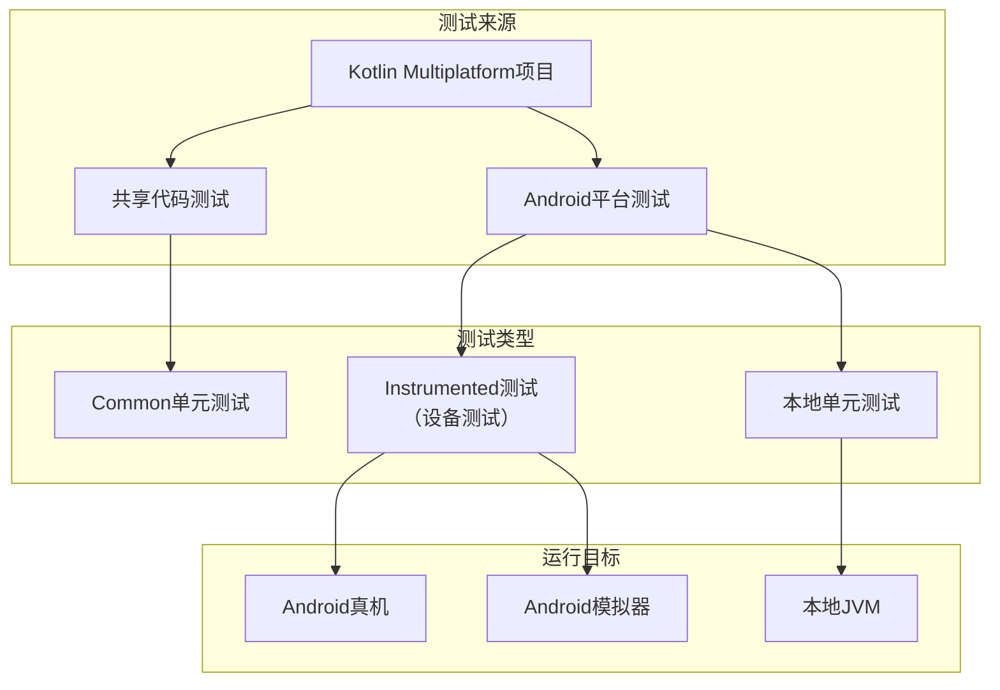
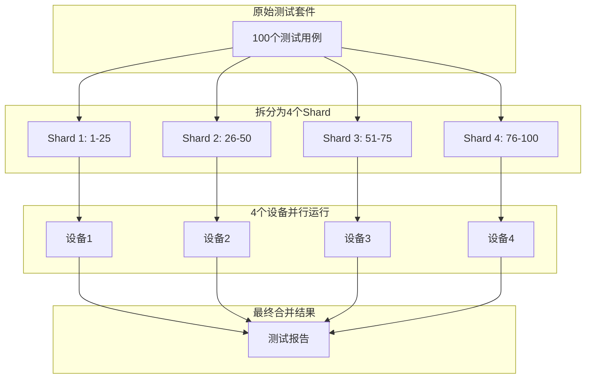
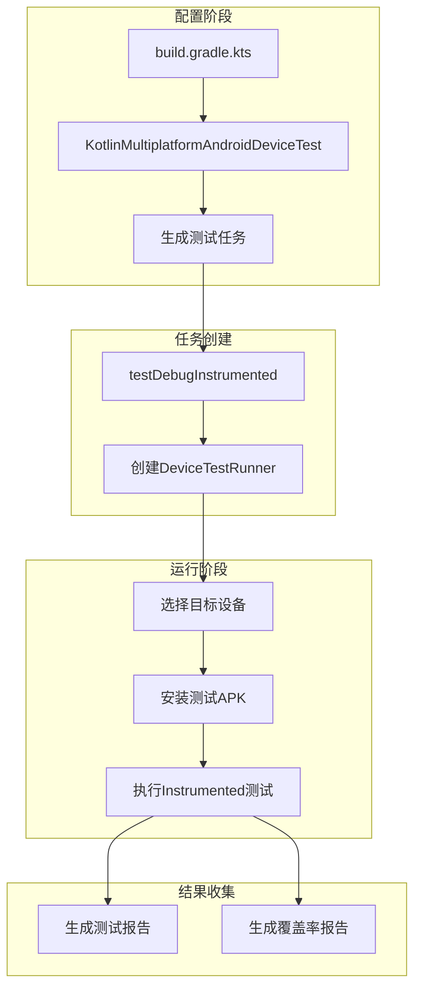

# 21.1.142 Kotlin多平台AndroidDeviceTest

太阳已经完全升起来了。

洛芙眯着眼睛从帐篷里钻出来，湖面被阳光照得明晃晃的，有点刺眼。她用手遮挡了一下，看到黛琳、希尔和伊莎已经坐在湖边的一块大石头平台上了——那是她们昨天发现的好地方，正好可以俯视整个湖面。

“洛芙！快来！”希尔朝她挥手，“黛琳说今天要讲一个很有意思的东西！”

“什么呀？”洛芙跑过去，在石头平台上找了个位置坐下。清晨的石头被太阳晒得温温的，坐上去很舒服。

黛琳把笔记本放在膝盖上：“昨天我们学了CompilationBuilder——就是怎么构建编译配置。今天我们要学另一个很重要的东西——怎么配置测试。”

“测试？”洛芙眨眨眼，“就是那种写单元测试的测试？”

“对，但不止是单元测试，”黛琳笑着说，“今天要讲的是设备测试——在真机或模拟器上运行的测试。”

、设备测试？”洛芙歪着头，“是不是就像我们在手机上一边操作App一边看它有没有bug？”

“差不多就是这个意思，”希尔说，“不过设备测试更专业——它会帮你自动运行测试用例，自动截图，自动记录结果，比人工测试高效一百倍。”

伊莎把一瓶水递给洛芙：“就像有一个看不见的精灵，在手机里帮你检查所有的功能是不是正常工作。”

“这个比喻好，”洛芙明白了，“那这个KotlinMultiplatformAndroidDeviceTest……是专门给Kotlin多平台用的？”

“对，”黛琳点头，“它是专门配置Kotlin多平台项目中Android端测试的接口。你可以通过它来——选择用什么设备运行测试、配置测试运行器、设置测试覆盖率选项等等。”

她在屏幕上画了一个简单的图来说明KMP测试的整体架构：



“你们看，”黛琳指着图说，“Kotlin多平台的测试分成几类——共享代码的测试在Common里，Android特有的测试在androidTest里。还有一种是Instrumented测试，它需要运行在真机或模拟器上。”

洛芙问：“ Instrumented……是不是就是我们在设备上跑的测试？”

“对，Instrumented测试就是需要在设备上运行的测试，”黛琳说，“因为有些功能只有设备上有——比如相机、传感器、GPS之类。这些功能没法在JVM上模拟，必须用真机或模拟器来测。”

希尔补充道：“而且有些功能需要看真实的UI表现，比如按钮点击、页面跳转、动画效果——这些在模拟器上跑最合适。”

黛琳点点头，打开笔记本上的代码示例：“而KotlinMultiplatformAndroidDeviceTest，就是帮你配置这些Instrumented测试的。”

她在屏幕上敲了一段代码：

```kotlin
kotlin {
    android {
        // 这是Android目标配置
        instrumentTest {
            // 这里配置DeviceTest
        }
    }
}
```

“你们看，”黛琳说，“在android { }块里面，可以通过instrumentTest { }来配置测试。”

伊莎问：“instrumentTest……就是Instrumented Test的意思？”

“对，就是设备测试的别称，”黛琳说，“有些人喜欢叫Instrumented Test，有些人叫DeviceTest，指的都是同一回事——需要在真机或模拟器上跑的测试。”

洛芙看着代码问：“那……这个instrumentTest里面能配置什么？”

“很多，”黛琳说，“我们一个个来看。”

她展开了instrumentTest的配置：

```kotlin
kotlin {
    android {
        instrumentTest {
            // 配置测试运行的设备
            devices {
                // 运行在所有可用的设备上
                all()
                
                // 指定使用Pixel 7模拟器
                Pixel7()
                
                // 指定使用特定配置
                pixel6Api34 {
                    // API级别
                    apiLevel = 34
                    // 屏幕密度
                    density = 420
                }
            }
            
            // 配置测试覆盖率
            enableCoverage.set(true)
            
            // 配置测试runner参数
            runner {
                // 每次测试前清理数据
                clearPackageDataBeforeRun.set(true)
                
                // 测试失败时保留测试数据
                keepData.set(true)
            }
        }
    }
}
```

洛芙眼睛亮了起来：“devices! 这个是不是可以让我们选择用什么手机来跑测试？”

“对，这就是deviceTest的核心功能之一，”黛琳说，“你可以指定具体用哪款手机，也可以让系统自动选择所有可用的设备。”

她详细解释了devices的配置方式：

```kotlin
devices {
    // 方式一：all() - 运行在所有可用设备上
    all()
    
    // 方式二：指定具体设备型号
    Pixel7()
    Pixel6()
    SamsungGalaxyS23()
    
    // 方式三：使用预定义的设备配置
    pixel6Api34 {}
    pixel7Api33 {}
    
    // 方式四：自定义设备配置
    create("my-custom-device") {
        // 设备名称
        displayName = "自定义测试机"
        // API级别
        apiLevel.set(34)
        // 屏幕尺寸
        screenOrientation = Landscape
        // 屏幕密度
        density.set(420)
    }
}
```

希尔插话说：“不过all()要小心——如果同时跑太多设备，测试时间会很长，而且可能会冲突。”

“有道理，”洛芙说，“那一般用什么方式比较多？”

“通常有两种策略，”黛琳分析道，“一是用特定设备——比如团队统一用Pixel系列，这样测试结果稳定。另一种是用all()——适合做兼容性测试，确保App在各种设备上都能正常工作。”

她画了一个图来说明两种策略的区别：

```mermaid
flowchart LR
    subgraph 策略一：特定设备
        A1[Pixel 7] --> B1[测试稳定]
        A1 --> C1[调试方便]
        A1 --> D1[可能遗漏兼容性问题]
    end
    
    subgraph 策略二：所有设备
        A2[all()] --> B2[覆盖全面]
        A2 --> C2[发现更多问题]
        A2 --> D2[测试时间长]
    end
```

洛芙若有所思：“听起来各有利弊……实际项目中怎么选？”

“通常的做法是——CI上用all()跑全面测试，本地开发时用特定设备跑快速验证，”希尔说，“这样既保证质量，又不耽误开发速度。”

黛琳补充道：“还有一种常见做法是分阶段——白天开发用特定设备跑，晚上用all()跑全量测试。”

伊莎把垂到眼前的头发拨到耳后：“就像露营——白天大家分工合作，晚上一起围坐在篝火边盘点成果。”

“这个比喻好，”洛芙笑了，“那……刚才说的enableCoverage是什么？”

“测试覆盖率，”黛琳说，“开启后可以生成覆盖率报告，告诉 你哪些代码被测试覆盖了，哪些还没测到。”

她展开coverage的配置：

```kotlin
// 开启测试覆盖率
enableCoverage.set(true)

// 或者用更详细的配置
coverage {
    // 包含哪些类（正则表达式）
    includeClasses.set("com.example.myapp.**")
    
    // 排除哪些类
    excludeClasses.set("com.example.myapp.Generated*")
    
    // 输出格式
    outputFormat = CoverageOutputFormat.EMMA
}
```

洛芙问：“这个覆盖率……是不是越高越好？”

“不一定，”希尔说，“覆盖率只是衡量测试质量的一个指标。100%覆盖率不等于没有bug，但覆盖率太低肯定说明测试不够。”

她举了个例子：“就像考试——做了100%的题目不一定能拿100分，但只做了50%的题目肯定拿不到高分。”

黛琳补充道：“而且有些代码是不需要测试的——比如UI布局文件、生成的代码、第三方库。这些不应该计入覆盖率。”

洛芙明白了：“所以覆盖率要理性看待——它是帮助发现问题的工具，但不是唯一的标准。”

“对，就是这样，”黛琳说，“现在我们来看runner配置。”

她敲了一段runner的代码：

```kotlin
runner {
    // 每次运行前清理应用数据
    clearPackageDataBeforeRun.set(true)
    
    // 测试失败时保留测试数据（方便调试）
    keepDataOnRetries.set(true)
    
    // 启用测试切片（Test Sharding）
    numShards.set(4)
    
    // 禁用测试的自动屏幕锁定
    disableAnalytics.set(false)
    
    // 测试结果保存目录
    resultsDir.set(file("$buildDir/test-results"))
}
```

洛芙看到numShards：“这个切片是什么？”

“Test Sharding，”希尔说，“可以把一个大的测试套件拆成多个小块，分别在不同的设备上同时跑。”

她画了个图来说明：



“这个在CI里特别有用，”黛琳说，“假设你要跑100个测试用例——如果用一台设备，可能要跑30分钟。但如果拆成4个Shard，用4台设备同时跑，7-8分钟就完成了。”

洛芙惊叹：“这么快！那，岂不是可以省很多时间？”

“对，这就是自动化的力量，”希尔说，“而且很多CI系统已经帮你整合好了，你只需要配置numShards就行。”

黛琳继续说：“不过Shard有个注意点——测试必须是相互独立的。如果测试之间有依赖关系，拆开后可能会失败。”

洛芙问：“那……怎么判断测试是否独立？”

“很简单，”希尔说，“如果你把测试打乱顺序跑，结果还是一样，那就是独立的。如果必须按特定顺序跑，那就是有依赖的。”

伊莎轻声说：“就像露营食材——如果是独立的调料，怎么混都行。但如果是一道菜，先放盐和先放糖味道就不一样了。”

“这个比喻很恰当，”黛琳笑了，“测试也是一样的道理——最好是独立的，这样Shard才能正常工作。”

洛芙把这些要点都记了下来，看看湖面，阳光已经在水面上跳起了舞。

“黛琳，”洛芙突然想到一个问题，“刚才说的都是配置……那实际跑测试的时候，这些配置是怎么起作用的？”

黛琳和希尔对视一眼——这个问题问到了核心。

“你问得很深入，”黛琳说，“实际上，当你执行gradle testDebugInstrumented的时候——”

她画了一个流程图：



“首先，你的DeviceTest配置会被Gradle解析，”黛琳指着图说，“然后Gradle会根据配置生成对应的测试任务。这个任务会——选择你配置的设备、安装测试APK、执行测试，最后生成报告。”

“如果配置了devices.all()，”希尔补充说，“任务会遍历所有可用的设备，一个一个跑。如果配置了特定设备，就只跑那些设备。”

“如果有coverage配置呢？”洛芙问。

“覆盖率报告会额外生成，”黛琳说，“在build/reports/coverage/目录下可以看到。”

洛芙对这些流程有了清晰的理解，又问：“那……有没有什么常见的坑？我们需要注意什么？”

“有几个，”黛琳扳着手指说，“第一，设备要提前打开，不能只是配置了但不启动设备。第二，测试时间不要太长，否则会影响CI的通过率。第三，注意测试之间的独立性，不要有隐藏的依赖。”

希尔补充道：“还有——不要在测试里做网络请求的mock，容易出问题。如果需要网络测试数据，最好用Fake Server。”

伊莎说：“就像露营时不要随意丢弃垃圾——测试也要保持干净，不要留下副作用。”

“对，伊莎说得对，”黛琳点头，“好的测试应该是 idempotent 的——跑多少次结果都一样。”

洛芙看着湖面，偶尔有鱼跳出水面，溅起一朵小小的水花。

“黛琳，”洛芙说，“能不能帮我总结一下今天学的这个DeviceTest？”

“当然可以，”黛琳把笔记本收起来，“KotlinMultiplatformAndroidDeviceTest是Gradle DSL中用于配置Kotlin多平台Android设备测试的接口。它可以配置devices（运行设备）、enableCoverage（测试覆盖率）、runner（测试运行器）等。”

希尔补充道：“DeviceTest让你可以选择在哪些设备上跑测试，是本地开发还是CI批量跑，要不要开启覆盖率——这是保证KMP Android代码质量的重要工具。”

伊莎把水瓶盖好：“就像露营时的检查清单——DeviceTest帮你列清楚要在哪些设备上检查哪些功能，确保没有任何遗漏。”

“有伊莎帮忙总结，我就放心了，”洛芙笑了，“今天学了DeviceTest，感觉对KMP的测试配置理解得更完整了。”

上午的阳光越来越强烈，湖水被照得波光粼粼的，像撒了一把碎金子。远处的山依然清晰，只是轮廓显得更加分明了。

---

> 学习建议：KotlinMultiplatformAndroidDeviceTest是Gradle DSL中用于配置KMP Android设备测试的核心接口。通过配置devices可以选择运行测试的设备（all()或具体型号），enableCoverage用于生成测试覆盖率报告，runner用于配置测试运行参数。开发阶段建议用特定设备快速验证，CI阶段可用all()做全面兼容性测试。犟调测试的独立性和幂等性，避免测试之间的依赖导致Shard失败。

## 洛芙的小小日记本

今天学了KotlinMultiplatformAndroidDeviceTest！黛琳说这个是配置设备测试的，可以选择用哪些手机跑测试、要不要开覆盖率。希尔说可以用numShards把测试拆成几块并行跑，大大节省时间，伊莎说要保持测试干净，不能有依赖。上午的湖面好漂亮，阳光像金子一样！

## 今日关键词

- **KotlinMultiplatformAndroidDeviceTest**：Gradle DSL中用于配置Kotlin多平台Android设备测试的接口
- **Instrumented测试**：需要在真机或模拟器上运行的测试
- **设备配置（devices）**：选择测试运行目标设备的配置项
- **all()**：运行所有可用设备的配置方式
- **测试覆盖率（enableCoverage）**：衡量测试代码覆盖范围的指标
- **Test Runner**：执行测试的工具
- **clearPackageDataBeforeRun**：每次运行前清理应用数据的选项
- **Test Sharding**：将大测试套件拆分并行运行的机制
- **numShards**：测试分片的数量配置
- **CoverageOutputFormat**：覆盖率报告的输出格式
- **idempotent**：幂等的，重复执行结果一致
- **设备型号配置**：Pixel7、Pixel6等具体设备选择
- **API级别（apiLevel）**：Android设备的系统版本
- **屏幕密度（density）**：设备的屏幕像素密度
- **测试报告**：测试执行结果的汇总输出
- **Instrumented测试runner**：运行设备测试的Runner配置