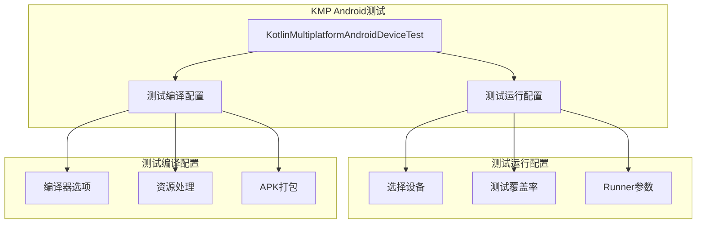
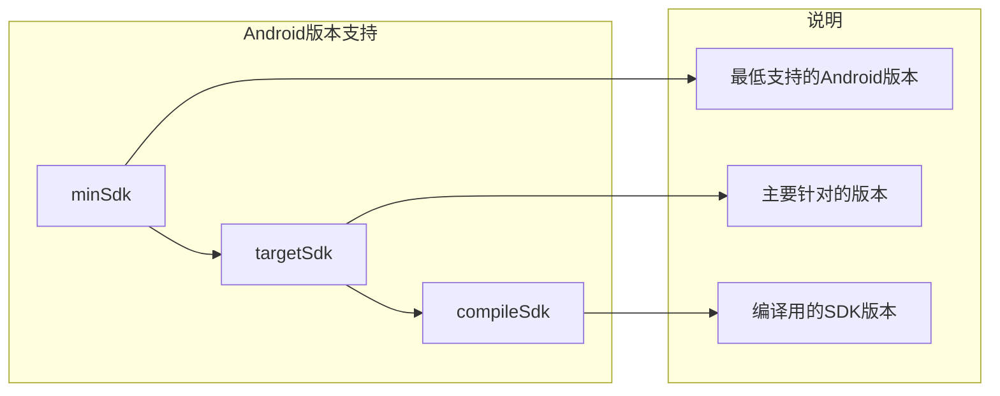
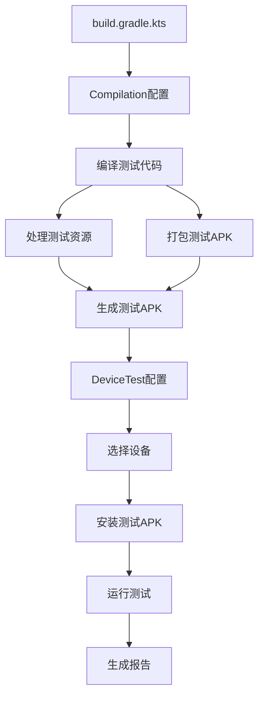

# 21.1.143 Kotlin多平台AndroidDeviceTestCompilation

太阳逐渐升高，蝉鸣声变得密集起来。

洛芙跟着黛琳她们从湖边的石头平台转移到了树荫下——那里凉爽一些。希尔找了一棵枝叶茂密的大树，把野餐垫铺好，四个人围坐下来。

“刚才我们学了怎么选择测试设备，”黛琳打开笔记本，“现在我们要学另一个重要的东西——怎么配置测试的编译过程。”

“编译过程？”洛芙眨眨眼，“就是怎么把测试代码变成可以运行的APK？”

“对，就是这个意思，”希尔说，“就像做菜——不但要选好食材，还要知道怎么火候、怎么调味。测试编译也是一样的道理。”

伊莎笑着说：“那今天学的就是烹饪的功夫？”

“比方说很恰当，”黛琳笑了，“配置好编译选项，就是掌握好火候——能让测试跑得更快、结果更准确。”

她在屏幕上展示了今天的重点——KotlinMultiplatformAndroidDeviceTestCompilation。

“你们看，”黛琳指着一个代码块说，“有了DeviceTest配置设备，我们还需要Compilation来配置怎么编译这些测试。”

洛芙问：“DeviceTest和Compilation……是什么关系？”

黛琳画了一个图来解释：



“简单来说，”黛琳解释道，“DeviceTest管的是'在哪跑'，Compilation管的是'怎么编译'。两者配合，才能完成整个测试流程。”

洛芙明白了：“那今天我们要学的就是怎么配置'怎么编译'？”

“对，”黛琳点头，“具体来说，包括——怎么设置编译器选项、怎么处理测试资源、怎么打包测试APK。”

她开始展示具体的配置代码：

```kotlin
kotlin {
    android {
        instrumentTest {
            compilation {
                // 在这里配置编译选项
            }
        }
    }
}
```

伊莎问：“compilation……就是编译的意思？”

“对，compilation就是编译，”黛琳说，“在这个块里可以配置各种编译相关的选项。”

她展开compilation的主要配置：

```kotlin
compilation {
    // 1. 编译器选项
    compilerOptions {
        // Java版本
        jvmTarget.set(JvmTarget.JAVA_17)
        
        // Kotlin编译器选项
        freeCompilerArgs.addAll(
            "-Xno-call-assertions",
            "-Xno-param-assertions"
        )
    }
    
    // 2. 源文件集配置
    sourceSet {
        // 或者手动指定源文件
        kotlin.srcDirs += file("src/androidInstrumentTest/kotlin")
    }
    
    // 3. 资源处理
    resources {
        // 包含的资源
        includes += "**/*.json"
        excludes += "**/test-data/*"
    }
    
    // 4. APK打包选项
    packaging {
        // 打包选项
        jniLibs {
            // JNI库配置
            useLegacyPackaging.set(false)
        }
        
        // 资源压缩
        resources {
            excludes += "/META-INF/{AL2.0,LGPL2.1}"
        }
    }
}
```

洛芙看到这么多配置，有点晕：“这么多……要从哪个开始学？”

“我们从最重要的开始，”黛琳说，“第一个是compilerOptions——编译器选项。”

她详细解释了compilerOptions的含义：

```kotlin
compilerOptions {
    // JVM目标版本
    // 决定编译出的字节码兼容什么版本的Java
    jvmTarget.set(JvmTarget.JAVA_17)
    
    // Kotlin编译器参数
    // -Xno-call-assertions: 关闭函数调用断言
    // -Xno-param-assertions: 关闭参数断言
    freeCompilerArgs.addAll(
        "-Xno-call-assertions",
        "-Xno-param-assertions"
    )
    
    // 源代码编码
    sourceCompatibility.set(JavaVersion.VERSION_17)
    targetCompatibility.set(JavaVersion.VERSION_17)
}
```

洛芙问：“jvmTarget……是不是就像选多用多大的锅做饭？”

“有点类似，”希尔忍不住笑了，“JVM目标版本决定了编译出的代码要在什么环境运行。JAVA_17就是要求至少Java 17以上。”

“如果设置成JAVA_11呢？”洛芙问。

“那编译出的代码可以在Java 11以上的环境运行，”希尔说，“但不能用Java 17的新特性。”

黛琳补充道：“通常和你项目的minSdk配合——如果minSdk是24，就不能用JAVA 17的新特性，因为Android 7.0不支持。”

“那岂不是要在两个之间找平衡？”洛芙问。

“对，这就是配置的学问，”黛琳说，“通常建议——compileSdk用最新版本，minSdk看市场覆盖，targetSdk用稳定版本。”

她画了一个图说明版本之间的关系：



希尔补充：“配置好版本，可以避免很多奇怪的兼容性问题。”

洛芙把这些记下来，继续看下一个配置：“刚才那个sourceSet是什么？”

“源文件集，”黛琳说，“就是告诉编译器去哪些目录找代码。”

她展开说明了sourceSet的配置：

```kotlin
sourceSets {
    // 主源集
    getByName("main") {
        // 主代码目录（默认）
        kotlin.srcDirs += file("src/main/kotlin")
    }
    
    // Android仪器测试源集
    getByName("androidInstrumentTest") {
        // 测试代码目录
        kotlin.srcDirs += file("src/androidInstrumentTest/kotlin")
        
        // 测试资源目录
        resources.srcDirs += file("src/androidInstrumentTest/resources")
    }
}
```

洛芙问：“如果不配置……会怎样？”

“默认就会用标准的目录结构，”黛琳说，“比如androidTest/kotlin/、androidTest/resources/这些目录。”

“标准目录？”洛芙歪着头。

“Android项目的约定，”希尔说，“放在标准目录，Gradle会自动识别，不需要额外配置。”

伊莎轻声说：“就像露营的约定俗成——帐篷搭在哪儿、篝火生在哪儿，大家都知道。”

“那为什么还要配置？”洛芙问。

“有时候你想用自定义的目录结构，”黛琳说，“或者多个模块共享测试代码，就需要配置。”

接下来看resources配置：

```kotlin
resources {
    // 包含哪些资源文件
    includes += "**/*.json"
    includes += "**/test-fixtures/**"
    
    // 排除哪些资源文件
    excludes += "**/test-data/*"
    excludes += "**/*.log"
}
```

洛芙问：“这些资源……是测试用的数据？”

“对，比如测试用的JSON文件、测试用的图片、测试用的配置文件，”黛琳说，“都可以放在resources里。”

她补充道：“includes和exclusions可以用来筛选——只包含需要的，排除不需要的。”

希尔举了个例子：“比如你有100个测试数据文件，但只需要5个，就可以用includes只包含那5个，加快编译速度。”

“这个我懂！”洛芙说，“就像打包行李——只带要用的，不用都装进去。”

“Exactly（正是如此），”希尔笑了，“编译也是一样的道理——不需要的文件不要编译，省时间。”

接下来是最重要的packaging配置：

```kotlin
packaging {
    // JNI库打包选项
    jniLibs {
        // 使用新的打包格式
        useLegacyPackaging.set(false)
        
        // 包含的ABI
        includeSupportLibraryPrefixes += "com.example.native"
    }
    
    // 资源压缩选项
    resources {
        // 排除不需要的资源
        excludes += "/META-INF/*.kotlin_module"
        excludes += "/META-INF/DEPENDENCIES"
    }
    
    // Java资源
    java {
        // 包含的Files
        excludes += "**/*.proto"
    }
}
```

洛芙看到jniLibs：“这是处理本地代码的？”

“对，JNI库就是用C/C++写的本地代码，”黛琳说，“比如有些性能关键的代码会用本地代码实现。”

useLegacyPackaging是做什么的？”

“这个是打包格式的选择，”希尔说，“设为false会使用新的打包格式，更高效。但有些老项目可能需要legacy格式保持兼容。”

黛琳补充道：“如果你的测试APK需要加载本地库，这点很重要。”

洛芙似懂非懂地点点头，又问：“resources里的excludes……是不是就是不打包那些文件？”

“对，excludes就是排除某些文件，”黛琳说，“比如META-INF里的文件，通常不需要打进APK。”

她详细说明了常见的排除项：

```kotlin
resources {
    // 排除META-INF下的文件
    excludes += "/META-INF/*.kotlin_module"
    excludes += "/META-INF/DEPENDENCIES"
    excludes += "/META-INF/LICENSE"
    excludes += "/META-INF/LICENSE.txt"
    excludes += "/META-INF/license.txt"
    excludes += "/META-INF/NOTICE"
    excludes += "/META-INF/NOTICE.txt"
    excludes += "/META-INF/notice.txt"
    
    // 排除其他不需要的文件
    excludes += "**/*.kotlin_module"
    excludes += "**/*.RSA"
    excludes += "**/*.SF"
}
```

“为什么排除这些？”洛芙问。

“这些是Maven或Gradle自动生成的文件，打进APK也没用，还会让APK变大，”希尔说，“而且可能引起签名问题。”

洛芙明白了：“所以要排除，省空间，也省麻烦。”

接下来看一个更完整的示例：

```kotlin
kotlin {
    android {
        instrumentTest {
            compilation {
                // 编译选项
                compilerOptions {
                    jvmTarget.set(JvmTarget.JAVA_17)
                    freeCompilerArgs.addAll(
                        "-Xno-call-assertions",
                        "-Xno-param-assertions"
                    )
                }
                
                // 源文件
                sourceSets {
                    getByName("androidInstrumentTest") {
                        kotlin.srcDirs += file("src/testInstrumented/kotlin")
                    }
                }
                
                // 资源
                resources {
                    includes += "**/*.json"
                    excludes += "**/debug/**"
                }
                
                // 打包
                packaging {
                    jniLibs {
                        useLegacyPackaging.set(false)
                    }
                    resources {
                        excludes += "/META-INF/*"
                    }
                }
            }
            
            // 设备选择
            devices {
                Pixel7()
            }
            
            // 覆盖率
            enableCoverage.set(true)
        }
    }
}
```

黛琳让洛芙看这个完整的例子：“这一段代码，涵盖了测试配置的各个方面——怎么编译、选什么设备、开不开覆盖率。”

洛芙数了数：“compilerOptions、sourceSets、resources、packaging……还有devices、enableCoverage。”

“对，这就是完整的测试配置，”黛琳说，“ compilation管编译，其他管运行。”

希尔问：“洛芙，还记得我们之前说的测试流程吗？”

洛芙回忆了一下：“DeviceTest是配置'在哪跑'，Compilation是配置'怎么编译'？”

“记得很清楚，”希尔笑了，“那你能说出来，整体流程是什么？”

洛芙试着画了一下：



黛琳鼓掌：“完全正确！Compilation负责编译打包，DeviceTest负责运行测试。”

洛芙很高兴，又问：“那……有没有什么常见的坑要注意？”

“有几个，”黛琳扳着手指说，“第一，jvmTarget要配合minSdk和targetSdk，别用太高的版本。第二，资源文件要确认在正确的目录，否则找不到。第三，packaging的排除项要看情况，不是所有项目都适用。”

希尔补充：“还有——compilation配置会影响最终的测试APK大小和启动速度。”

伊莎说：“就像打包行李——带多了重，带少了怕漏。找到平衡最重要。”

“对，就是这个理，”黛琳说，“配置也是一样的——找到适合项目的平衡点。”

洛芙看着树荫外，阳光透过树叶洒下来，蝉鸣声一阵接一阵。

“黛琳，”洛芙说，“能不能帮我总结一下今天学的Compilation？”

“当然可以，”黛琳把笔记本收起来，“KotlinMultiplatformAndroidDeviceTestCompilation是Gradle DSL中用于配置Kotlin多平台Android设备测试编译的接口。它可以配置compilerOptions（编译器选项）、sourceSets（源文件集）、resources（资源处理）和packaging（APK打包选项）。”

希尔补充：“通过Compilation配置，你可以控制测试代码的编译版本、资源如何打包、最终APK的构成——这是构建高质量测试APK的关键。”

伊莎把水杯拿起来喝了一口：“就像烹饪时的火候和配料——Compilation管的就是这些，让测试APK能以最优的方式跑起来。”

“有你们帮忙总结，我就放心了，”洛芙笑了，“感觉对KMP测试的理解又深入了一层。”

午后的阳光正好，树荫下很凉爽。偶尔有风吹过，树叶沙沙作响，远处的湖面上波光粼粼。

---

> 学习建议：KotlinMultiplatformAndroidDeviceTestCompilation和KotlinMultiplatformAndroidDeviceTest配合使用，Compilation管编译（compilerOptions、resources、packaging），DeviceTest管运行（devices、enableCoverage、runner）。配置时注意jvmTarget与minSdk/targetSdk的配合，resources的includes/excludes要精确，packaging的排除项要按需设置。编译配置直接影响测试APK的大小和构建速度，建议在开发时用最小配置，在CI上用完整配置。

## 洛芙的小小日记本

今天学了KotlinMultiplatformAndroidDeviceTestCompilation！黛琳说这个是配置测试编译的——compilerOptions管编译器选项，resources管资源处理，packaging管APK打包。加上昨天的DeviceTest（管设备选择和覆盖率），整个测试配置就全了！伊莎说就像烹饪的火候和配料，要找到平衡。下午继续加油！

## 今日关键词

- **KotlinMultiplatformAndroidDeviceTestCompilation**：Gradle DSL中用于配置Kotlin多平台Android设备测试编译的接口
- **compilerOptions**：编译器选项配置块
- **jvmTarget**：JVM目标版本配置
- **freeCompilerArgs**：Kotlin编译器额外参数
- **sourceSets**：源文件集配置
- **resources**：资源处理配置
- **includes**：资源包含规则
- **excludes**：资源排除规则
- **packaging**：APK打包选项
- **jniLibs**：本地代码库配置
- **useLegacyPackaging**：是否使用旧打包格式
- **Instrumented测试编译**：在设备上运行的测试的编译过程
- **测试APK**：包含测试代码的特殊APK
- **minSdk**：最小SDK版本
- **targetSdk**：目标SDK版本
- **compileSdk**：编译SDK版本