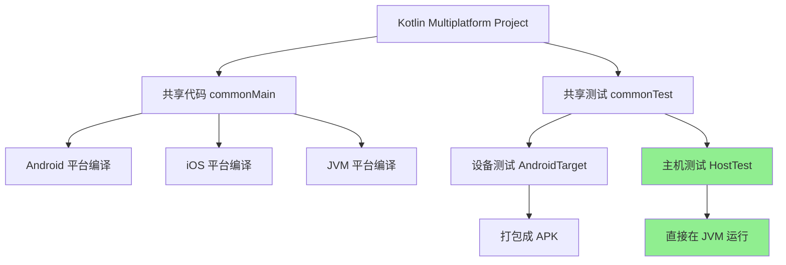
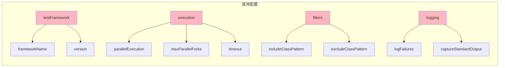
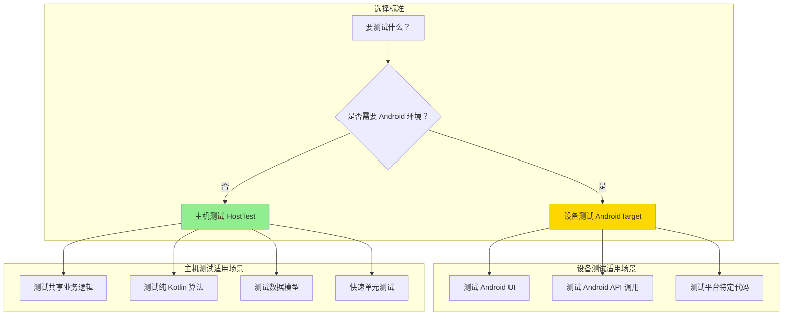
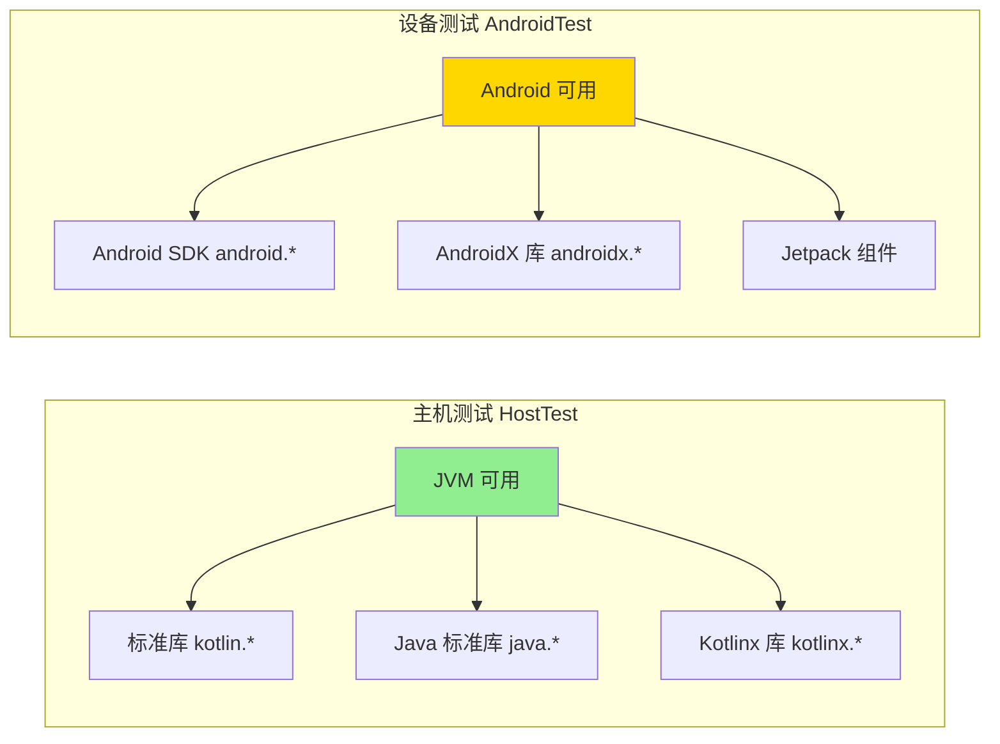

# 21.1.144 Kotlin多平台AndroidHostTest

午后的阳光懒洋洋地铺洒在湖面上，像撒了一把碎金子。洛芙靠在树干上，手里摆弄着一根草茎，心里还在回味上午学的设备测试编译配置。

“洛芙，发什么呆呢？”希尔的声音从旁边传来，她正把笔记本放在膝盖上，噼里啪啦地敲着代码。

“在想上午学的那个设备测试编译……”洛芙老实回答，“说是配置APK打包的，那主机测试又是怎么回事？”

黛琳抬起头，从白板前走过来。“问得好。其实很多测试不需要跑在真机上——比如测试业务逻辑、测试纯 Kotlin 编写的共享代码，这些在主机上就能跑。”

“主机？”洛芙眨眨眼，“就是我们的电脑？”

“对。”黛琳点点头，在洛芙旁边的草地上坐下，“在 Kotlin Multiplatform 项目里，测试分两种：一种是设备测试（device test），需要打包成 APK 安装到 Android 设备或模拟器上跑；另一种是主机测试（host test），直接在 JVM 上运行。”

伊莎在一旁补充道：“就像露营也分两种——在山里露营需要全套装备，而在营地的帐篷里休息，就只需要睡袋和毯子。设备测试就像进山，要准备齐全；主机测试就像在营地，更轻便。”

洛芙“哇”了一声：“那主机测试能测什么？”

“能测的东西很多呢。”希尔把电脑转过来，指着屏幕上的代码说，“比如你的 shared module——也就是所有平台共享的业务逻辑代码，完全可以写成单元测试，在主机上跑。”

她新建了一个 Kotlin 文件，开始演示：

```kotlin
// shared/src/commonTest/kotlin/com/example/AppTest.kt
package com.example

import kotlin.test.Test
import kotlin.test.assertEquals

class AppTest {
    @Test
    fun testAddition() {
        val calculator = Calculator()
        assertEquals(4, calculator.add(2, 2))
    }
    
    @Test
    fun testStringProcessing() {
        val processor = StringProcessor()
        assertEquals("HELLO", processor.toUpperCase("hello"))
    }
}
```

洛芙凑近看：“这个测试……看起来就是普通的 Kotlin 测试嘛。”

“没错！”希尔打了个响指，“这就是主机测试的精髓——它本质上是普通的 Kotlin/JVM 测试，用的是 kotlin-test 框架。Android Gradle 插件只是提供了一个 DSL 来配置这些测试的编译和运行方式。”

黛琳站起来，走到大白板前，画了一个简单的架构图：



“看到这个绿颜色的部分了吗？”黛琳用笔点点主机测试的部分，“这就是我们今天要学的 KotlinMultiplatformAndroidHostTest 配置的对象。它负责配置这些在 JVM 上跑的测试。”

洛芙歪着头问：“那这个 DSL 接口到底能配置什么？”

“问得好。”黛琳回到笔记本前，调出 Gradle 配置代码，“来，我们看看典型的配置长什么样。”

希尔切换到 build.gradle.kts 文件，指着代码说：

```kotlin
android {
    kotlin {
        androidTarget {
            compilations.all {
                compileKotlinTasks.forEach {
                    it.kotlinOptions {
                        jvmTarget = "17"
                    }
                }
            }
        }
        
        // 主机测试配置
        hostTestTask<JvmTestExecution> {
            // 配置测试框架
            testFramework {
                frameworkName.set(TestFrameworkName.KOTLIN_TEST)
                version.set("1.9.22")
            }
            
            // 配置测试运行参数
            execution {
                // 并行运行测试
                parallelExecution.set(true)
                
                // 每个测试类的最大并行数
                maxParallelForks.set(4)
                
                // 测试超时时间
                testTask {
                    timeout.set(10.minutes)
                }
            }
            
            // 配置测试过滤器
            filters {
                // 包含特定测试类
                includeClassPattern("com.example.**.*Test")
                
                // 排除特定测试类
                excludeClassPattern("com.example.integration.**.*Test")
                
                // 包含特定注解的测试
                includeAnnotation("com.example.SlowTest")
            }
            
            // 配置日志输出
            logging {
                // 测试开始时输出
                logStart.set(true)
                
                // 测试失败时输出详细堆栈
                logFailures.set(true)
                
                // 输出标准输出
                captureStandardOutput.set(true)
                
                // 输出标准错误
                captureStandardError.set(true)
            }
        }
    }
}
```

洛芙看着这一长串配置，有点晕：“这么多配置……到底哪些是常用的？”

伊莎笑着递过来一杯水：“别急着全部记住，就像学做饭，不用一下子把所有调料都搞清楚。先记住最常用的几个就行。”

希尔点点头：“我给你划重点。”

她找出几个最常用的配置，用不同颜色的笔在白板上列出：



“第一个是 testFramework。”希尔指着白板说，“决定用什么测试框架。常用的是 KOTLIN_TEST、JUNIT4、JUNIT5。Kotlin 1.9 之后推荐用 KOTLIN_TEST，它会自动选择对应的框架。”

“第二个是 execution 里的并行配置。”她继续说，“parallelExecution 和 maxParallelForks 用来控制测试是否并行跑、同时跑几个。测试多的时候，开并行能快很多。”

洛芙举手提问：“那如果测试之间有依赖关系呢？比如一个测试要等另一个测试完成？”

“好问题！”希尔说，“这种情况下不能开并行，要设成 false。或者用 dependsOn 明确指定依赖关系。”

她现场写了一个示例：

```kotlin
hostTestTask<JvmTestExecution> {
    execution {
        parallelExecution.set(false)  // 串行执行
        
        // 或者使用测试依赖配置
        testTask {
            // 显式指定测试类执行顺序
            testClassesDirs.set(
                files("${project.buildDir}/classes/kotlin/jvm/test")
            )
        }
    }
}
```

黛琳补充道：“第三个常用的是 filters。实际项目中，不是所有测试都要跑——比如集成测试慢，可以只跑单元测试。”

她演示了一个实际场景：

```kotlin
hostTestTask<JvmTestExecution> {
    filters {
        // 只跑单元测试，不跑集成测试
        includeClassPattern("com.example.unit.**.*Test")
        excludeClassPattern("com.example.integration.**.*Test")
        
        // 只跑标记为 @Fast 的测试
        includeAnnotation("com.example.FastTest")
        
        // 排除特定的测试方法
        excludeMethodPattern(".*testWithDatabase.*")
    }
}
```

洛芙突然想到一个问题：“那这些主机测试和设备测试之间……怎么选择？”

伊莎指了指远处的湖面：“就像钓鱼——有些鱼要用专门的钓具去深水区钓（设备测试），有些鱼在岸边就能钓到（主机测试）。关键是看你要测什么。”

黛琳总结道：



洛芙看着这幅图若有所思：“也就是说，如果我要测试 shared module 里的逻辑，就用主机测试？”

“对了！”希尔高兴地说，“来，我们实战一下。假设我们有一个共享的日期处理模块，想写单元测试。”

她在电脑上敲起来：

```kotlin
// shared/src/commonMain/kotlin/com/example/DateUtils.kt
package com.example

object DateUtils {
    fun formatDate(timestamp: Long): String {
        val instant = java.time.Instant.ofEpochMilli(timestamp)
        val date = java.time.LocalDateTime.ofInstant(instant, java.time.ZoneId.systemDefault())
        return "${date.year}-${date.monthValue.toString().padStart(2, '0')}-${date.dayOfMonth.toString().padStart(2, '0')}"
    }
    
    fun isToday(timestamp: Long): Boolean {
        val instant = java.time.Instant.ofEpochMilli(timestamp)
        val date = java.time.LocalDateTime.ofInstant(instant, java.time.ZoneId.systemDefault())
        val today = java.time.LocalDate.now()
        return date.toLocalDate() == today
    }
}
```

然后是测试代码：

```kotlin
// shared/src/commonTest/kotlin/com/example/DateUtilsTest.kt
package com.example

import kotlin.test.Test
import kotlin.test.assertEquals
import kotlin.test.assertTrue
import kotlin.test.assertFalse

class DateUtilsTest {
    @Test
    fun testFormatDate() {
        // 2024-01-15 00:00:00 UTC
        val timestamp = 1705276800000L
        val result = DateUtils.formatDate(timestamp)
        assertEquals("2024-01-15", result)
    }
    
    @Test
    fun testIsToday() {
        val today = java.time.LocalDate.now()
        val todayTimestamp = today.atStartOfDay(java.time.ZoneId.systemDefault())
            .toInstant().toEpochMilli()
        
        assertTrue(DateUtils.isToday(todayTimestamp))
        
        val yesterdayTimestamp = today.minusDays(1)
            .atStartOfDay(java.time.ZoneId.systemDefault())
            .toInstant().toEpochMilli()
        
        assertFalse(DateUtils.isToday(yesterdayTimestamp))
    }
}
```

希尔运行了这个测试，输出结果：

```
> Task :shared:jvmTest
DateUtilsTest > testFormatDate PASSED
DateUtilsTest > testIsToday PASSED

BUILD SUCCESSFUL in 1.234s
2 tests, 0 failures
```

洛芙欢呼起来：“成功了！那如果我想在 Android 设备上也跑同样的测试呢？”

“这就到了设备测试上场的时候。”黛琳说，“同样的测试代码，可以配置成设备测试，在 APK 里跑。”

她展示了设备测试版本的配置：

```kotlin
android {
    kotlin {
        androidTarget {
            // 设备测试配置（上一章学的）
            deviceTestTask<AndroidTestExecution> {
                instrumentation {
                    packageName.set("com.example.test")
                    testPackageName.set("com.example.test")
                    
                    // 测试运行器
                    testRunnerClass.set("androidx.test.runner.AndroidJUnitRunner")
                }
                
                // APK 安装配置
                installer {
                    installTimeout.set(60.seconds)
                    installFlags.add("-r")  // 重新安装
                }
            }
        }
    }
}
```

洛芙对比着看：“设备测试的配置好复杂……要配置 APK 打包、测试运行器、安装参数。主机测试就简单多了。”

“对，这就是轻便和齐全的区别。”伊莎说，“主机测试快，设备测试全。根据你的测试需求来选。”

黛琳补充了一个重要的点：“还有一个关键区别——主机测试可以直接访问 JVM 库，而设备测试只能访问 Android SDK 提供的 API。”

她在白板上画了一个对比：



洛芙看着这幅图，想了想：“那如果我的共享代码里用了 Android 特有的 API……怎么办？”

“好问题。”黛琳说，“Kotlin Multiplatform 的解决办法是——用 expect/actual 模式。”

她解释起来：

```kotlin
// commonMain - expect 声明
expect class DateFormatter {
    fun format(timestamp: Long): String
}

// androidMain - actual 实现
actual class DateFormatter {
    actual fun format(timestamp: Long): String {
        val sdf = java.text.SimpleDateFormat("yyyy-MM-dd", java.util.Locale.getDefault())
        return sdf.format(java.util.Date(timestamp))
    }
}

// jvmMain - actual 实现（JVM 平台）
actual class DateFormatter {
    actual fun format(timestamp: Long): String {
        val instant = java.time.Instant.ofEpochMilli(timestamp)
        val date = java.time.LocalDateTime.ofInstant(instant, java.time.ZoneId.systemDefault())
        return "${date.year}-${date.monthValue}-${date.dayOfMonth}"
    }
}
```

希尔说：“这样，测试代码只需要写一次——在 commonTest 里写，然后在不同平台分别跑主机测试和设备测试。”

洛芙似懂非懂地点点头：“也就是说，测试代码是共享的，只是运行时跑的地方不同？”

“对了！”希尔打了个响指，“这就是 Kotlin Multiplatform 强大的地方——一次编写，多平台运行测试。”

太阳慢慢偏西，阳光从树叶的间隙洒下来，在草地上投下斑驳的光影。湖面上波光粼粼，偶尔有几只水鸟掠过，激起一圈圈涟漪。

洛芙伸了个懒腰，总结道：“所以今天学的是……主机测试就是在电脑上跑的测试，用来测不需要 Android 环境的代码。设备测试就是装到 APK 里在真机或模拟器上跑的测试，用来测需要 Android 环境的代码。”

伊莎微笑着说：“还有一点——主机测试快，设备测试慢。开发阶段先跑主机测试确保逻辑正确，最后再用设备测试验证 Android 平台兼容性。”

黛琳补充：“配置上，主机测试用 KotlinMultiplatformAndroidHostTest DSL，设备测试用 KotlinMultiplatformAndroidDeviceTest DSL。两者都是 Android Gradle 插件提供的。”

洛芙把这些要点在脑海里过了一遍，发现自己对 Kotlin Multiplatform 的测试体系有了更清晰的认识。

---

> **学习建议**：主机测试和设备测试是 Kotlin Multiplatform 测试体系的两个支柱。开发阶段优先使用主机测试（快速反馈），最后用设备测试验证平台兼容性。掌握 expect/actual 模式可以让你写出真正跨平台的测试代码。

---

## 洛芙的小小日记本

今天学到了主机测试！原来测试也分地方——在电脑上跑的（主机测试）和在真机/模拟器上跑的（设备测试）。希尔说开发阶段先跑主机测试，最后再跑设备测试，这样快很多。看来露营也是这个道理——先在营地休息好，再进山探（设备测试需要更多准备）。黛琳说的expect/actual模式好有意思，同样的测试代码在不同平台跑，就像同一首歌用不同乐器演奏~

---

## 今日关键词

**KotlinMultiplatformAndroidHostTest**：用于配置 Kotlin Multiplatform 项目中 Android 主机测试的 DSL 接口，提供测试框架配置、并行执行控制、测试过滤和日志输出等功能。

**HostTest（主机测试）**：在 JVM 上运行的测试，用于测试不需要 Android 环境的共享代码，如纯 Kotlin 业务逻辑、算法、数据模型等。

**DeviceTest（设备测试）**：需要打包成 APK 在 Android 设备或模拟器上运行的测试，用于测试需要 Android API 或 UI 的代码。

**TestFrameworkName**：测试框架名称枚举，常见值包括 KOTLIN_TEST、JUNIT4、JUNIT5，用于指定主机测试使用的测试框架。

**parallelExecution**：控制测试是否并行执行的配置项，true 表示并行，false 表示串行。

**maxParallelForks**：设置并行执行测试时的最大进程数，用于控制资源占用。

**includeClassPattern**：测试过滤器配置项，用于指定需要包含的测试类匹配模式。

**excludeClassPattern**：测试过滤器配置项，用于指定需要排除的测试类匹配模式。

**expect/actual 模式**：Kotlin Multiplatform 的跨平台代码模式，expect 声明通用接口，actual 提供各平台的具体实现，使同一份测试代码可以在不同平台运行。

**kotlin-test**：Kotlin 官方提供的测试框架，提供 @Test、assertEquals 等基础测试 API。
