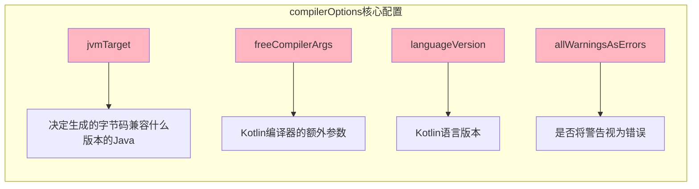
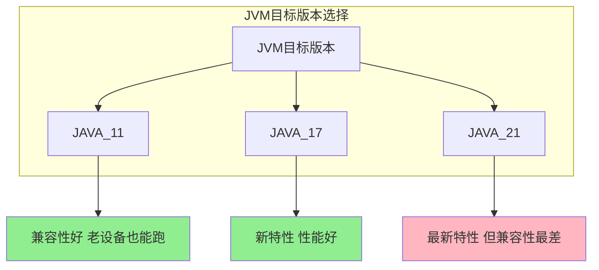
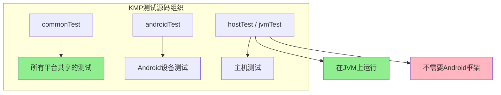
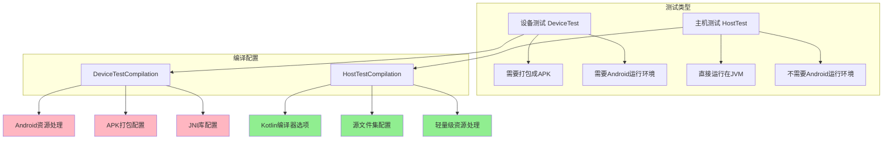
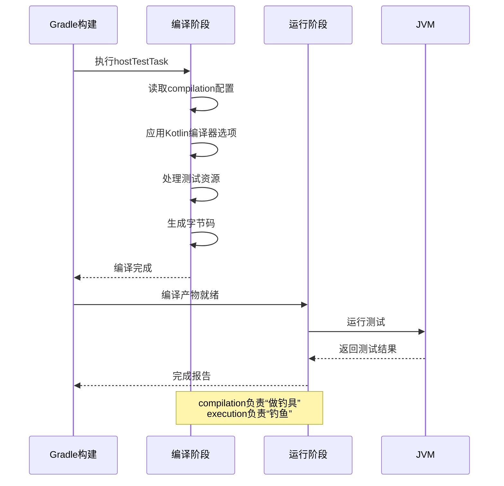
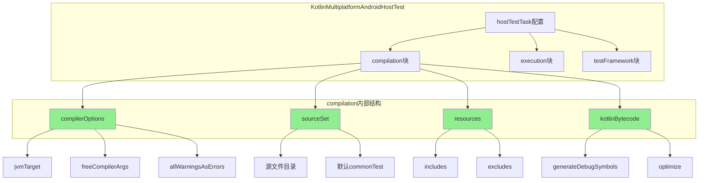

# 21.1.145 Kotlin多平台AndroidHostTestCompilation

太阳很低了，金红色的余晖铺在湖面上，像撒了一把燃烧的星星。洛芙靠在树干上，看着水面发呆，忽然意识到一个问题。

“黛琳，”她转过头，“上午我们学了怎么配置主机测试运行时，下午又学了怎么选设备和配置运行参数，那……测试代码本身是怎么变成可执行的呢？”

希尔正在收拾笔记本，听到这话停下来：“好问题！就像做菜——选好食材（设备测试配置）、准备好厨房（运行参数），还得知道怎么开火（编译）。今天傍晚学的就是这个。”

“编译？”洛芙眨眨眼，“主机测试不是在JVM上跑吗？直接运行不就行了？”

“那是运行时的概念，”黛琳走过来，夕阳把她的影子拉得很长，“编译是把源代码变成字节码的过程。没有编译，就没办法把测试交给JVM执行。”

伊莎指着远处的湖面：“就像钓鱼——你得先甩出鱼钩（运行），但还得先做好鱼竿和鱼线（编译）。主机测试的编译，就是制作钓具的过程。”

洛芙“噗嗤”一笑：“这个比喻好！那今天我们要学怎么‘制作钓具’？”

“对，”黛琳点点头，打开笔记本，“今天要学的是KotlinMultiplatformAndroidHostTestCompilation——配置主机测试编译的DSL接口。”

她在屏幕上展示了一个典型的配置结构：

```kotlin
kotlin {
    android {
        hostTestTask<JvmTestExecution> {
            compilation {
                // 这里配置编译选项
            }
        }
    }
}
```

洛芙问：“compilation……就是编译？”

“对，compilation就是编译的意思，”希尔说，“在这个块里可以配置各种编译相关的选项——Kotlin编译器参数、字节码版本、资源处理等等。”

黛琳调出详细的配置内容：

```kotlin
hostTestTask<JvmTestExecution> {
    compilation {
        // 1. Kotlin编译器选项
        compilerOptions {
            // JVM目标版本
            jvmTarget.set(JvmTarget.JAVA_17)
            
            // 自由编译器参数
            freeCompilerArgs.addAll(
                "-Xno-call-assertions",
                "-Xno-param-assertions",
                "-Xinline-functions"
            )
            
            // 是否启用断言
            allWarningsAsErrors.set(false)
            
            // 语言版本
            languageVersion.set(KotlinVersion("1.9"))
        }
        
        // 2. 源文件集配置
        sourceSet {
            // 指定测试源码目录
            kotlin.srcDirs += file("src/hostTest/kotlin")
            
            // 或者使用默认的commonTest
        }
        
        // 3. 资源处理
        resources {
            // 包含的资源文件
            includes += "**/*.json"
            includes += "**/*.txt"
            
            // 排除的资源文件
            excludes += "**/test-data/*"
        }
        
        // 4. 字节码处理
        kotlinBytecode {
            // 生成调试信息
            generateDebugSymbols.set(true)
            
            // 优化字节码
            optimize.set(false)
        }
    }
}
```

洛芙看着这一长串配置，有点晕：“这么多……到底哪些最重要？”

伊莎笑着递过来一块饼干：“别担心，我们一个一个来。最核心的是compilerOptions——编译器选项。”

她指向白板，开始详细解释：



“第一个是jvmTarget，”伊莎说，“它决定生成的字节码兼容什么版本的Java。”

洛芙问：“为什么要配置这个？用默认的不行吗？”

“用默认的也行，”黛琳解释道，“但显式指定是更好的实践。比如你设成JAVA_17，就可以使用Java 17的新特性，比如密封类升级、模式匹配这些。设成JAVA_11则兼容性更好。”

她画了一个简单的对比图：



希尔补充道：“一般来说，开发阶段用JAVA_17比较平衡——既能用到新特性，兼容性也不错。发布时再根据实际情况调整。”

洛芙点头：“那freeCompilerArgs呢？这个是干嘛的？”

“freeCompilerArgs是Kotlin编译器的额外参数，”希尔打开一个代码示例，“可以在这里加一些编译器选项，比如禁用断言、检查内联函数等等。”

```kotlin
compilerOptions {
    freeCompilerArgs.addAll(
        // 不生成调用断言检查
        "-Xno-call-assertions",
        // 不生成参数断言检查
        "-Xno-param-assertions",
        // 启用函数内联
        "-Xinline-functions",
        // 启用实验性协程
        "-Xexperimental-coroutines"
    )
}
```

伊莎问：“这些参数……是必须的吗？”

“不是必须的，”希尔说，“但了解这些参数可以帮助你优化编译过程。比如-Xno-call-assertions可以减小生成的字节码大小，提高运行性能。”

洛芙“喔”了一声：“那allWarningsAsErrors呢？”

“这个啊，”黛琳说，“如果设成true，编译器会把所有警告都当作错误，编译会失败。适合追求高质量代码的项目。”

她在白板上写下：

```kotlin
// 开发阶段可以设成false
allWarningsAsErrors.set(false)

// 上线前可以设成true
allWarningsAsErrors.set(true)
```

希尔说：“我们一般开发阶段设false，上线前设true。这样不会因为一些小的警告卡住开发节奏，又能保证发布时的代码质量。”

洛芙若有所思：“那接下来是什么呢？sourceSet？”

“对，”黛琳点头，“sourceSet配置测试源码的目录。”

她展示了一个sourceSet的配置示例：

```kotlin
sourceSet {
    // 方式1：添加额外的源码目录
    kotlin.srcDirs += file("src/hostTest/kotlin")
    
    // 方式2：使用默认的commonTest
    // 默认情况下，主机测试代码放在 commonTest 源集
    // 路径：src/commonTest/kotlin/
    
    // 方式3：自定义源集
    sourceSets.getByName("hostTest") {
        kotlin.srcDirs += file("src/customHostTest/kotlin")
    }
}
```

伊莎问：“这些方式……有什么区别？”

“区别在于代码的组织方式，”黛琳解释道，“方式1和3是添加额外的源码目录，方式2是使用默认的commonTest源集。”

她画了一个图来说明：



洛芙明白了：“也就是说，如果测试代码是所有平台都能用的，就放commonTest；只有主机测试用的，就放hostTest或jvmTest？”

“对，就是这样，”希尔说，“这个设计很清晰。”

黛琳继续说：“接下来是resources配置——处理测试资源文件。”

她展示了资源处理的配置：

```kotlin
resources {
    // 包含的资源文件
    includes += "**/*.json"
    includes += "**/*.txt"
    includes += "**/*.xml"
    
    // 排除的资源文件
    excludes += "**/test-data/*"
    excludes += "**/large-files/**"
}
```

洛芙问：“测试也需要资源文件？”

“需要的，”伊莎说，“比如测试用的JSON数据、测试配置文件、测试图片等等。”

她举了一个例子：

```kotlin
// 假设测试代码需要读取一个配置文件
// src/commonTest/resources/test-config.json

// 测试代码
@Test
fun testLoadConfig() {
    val config = loadConfigFromResources("test-config.json")
    assertEquals("expected", config.value)
}
```

希尔补充道：“resources配置就是告诉编译器哪些文件需要包含在测试classpath里，哪些需要排除。”

黛琳说：“最后一个是kotlinBytecode——字节码生成配置。”

她展示了这个配置：

```kotlin
kotlinBytecode {
    // 是否生成调试符号
    // 设为true时，可以在调试时看到变量名、源代码行号等信息
    generateDebugSymbols.set(true)
    
    // 是否优化字节码
    // 优化可能会使调试更困难，但生成的文件更小、运行更快
    optimize.set(false)
    
    // 字节码版本
    bytecodeVersion.set(51) // 对应Java 7
}
```

洛芙问：“generateDebugSymbols……调试符号是什么？”

“简单来说，”希尔解释道，“就是编译时额外生成的一些信息，比如变量名、源代码行号、函数参数名等等。有这些信息，调试器才能准确显示变量值、定位到源代码行。”

```kotlin
// 启用调试符号时的效果
// 源代码：
fun calculate(a: Int, b: Int): Int = a + b

// 生成的字节码中会包含参数名 a, b
// 调试时可以看到变量名，而不只是 arg0, arg1
```

“不启用调试符号的话，”希尔继续说，“编译出来的字节码会更小、运行更快，但调试时就只能看到arg0、arg1这样的参数名。”

伊莎问：“那开发的时候应该怎么选？”

“我建议是这样，”黛琳总结道，“开发阶段设true，方便调试；发布阶段设false，提高性能。”

洛芙点头表示理解：“那我们整个配置下来，就是这样子的吗？”

她把整个流程整理了一下：

```kotlin
kotlin {
    android {
        hostTestTask<JvmTestExecution> {
            compilation {
                // 1. Kotlin编译器选项
                compilerOptions {
                    jvmTarget.set(JvmTarget.JAVA_17)
                    freeCompilerArgs.addAll(
                        "-Xno-call-assertions",
                        "-Xno-param-assertions"
                    )
                    allWarningsAsErrors.set(false)
                }
                
                // 2. 源文件集
                // 通常使用默认的 commonTest，不需要额外配置
                
                // 3. 资源处理
                resources {
                    includes += "**/*.json"
                    excludes += "**/test-data/*"
                }
                
                // 4. 字节码配置
                kotlinBytecode {
                    generateDebugSymbols.set(true)
                    optimize.set(false)
                }
            }
        }
    }
}
```

希尔打了个响指：“完美！这就是一个完整的主机测试编译配置。”

洛芙问：“那这个和之前的DeviceTestCompilation有什么区别？”

“好问题！”黛琳说，“我们来做个对比。”



黛琳解释说：“设备测试编译需要处理Android资源、打包APK、配置JNI库这些Android特有的东西，因为最终要安装到设备上运行。主机测试编译就简单多了——只需要配置Kotlin编译器选项，处理普通的资源文件就好，因为是跑在JVM上的。”

伊莎补充道：“所以HostTestCompilation比DeviceTestCompilation的配置要轻量很多。”

洛芙“原来如此”地点点头。

希尔说：“来，我们实战一下，搭建一个完整的主机测试配置。”

她在笔记本上创建一个完整的build.gradle.kts文件：

```kotlin
plugins {
    kotlin("multiplatform") version "1.9.22"
    id("com.android.library") version "8.2.0"
}

kotlin {
    android {
        // 主应用编译配置
        compilations.all {
            compileKotlinTasks.forEach {
                it.kotlinOptions {
                    jvmTarget = "17"
                }
            }
        }
        
        // 主机测试编译配置
        hostTestTask<JvmTestExecution> {
            compilation {
                // Kotlin编译器选项
                compilerOptions {
                    jvmTarget.set(JvmTarget.JAVA_17)
                    freeCompilerArgs.addAll(
                        "-Xno-call-assertions"
                    )
                    allWarningsAsErrors.set(false)
                }
                
                // 资源处理
                resources {
                    includes += "**/*.json"
                    excludes += "**/test-data/large/*"
                }
                
                // 字节码配置
                kotlinBytecode {
                    generateDebugSymbols.set(true)
                    optimize.set(false)
                }
            }
            
            // 运行配置（从上一章学到的）
            execution {
                parallelExecution.set(true)
                maxParallelForks.set(4)
            }
            
            // 测试框架配置
            testFramework {
                frameworkName.set(TestFrameworkName.KOTLIN_TEST)
                version.set("1.9.22")
            }
        }
    }
    
    // 共享代码
    sourceSets {
        val commonMain by getting
        val commonTest by getting
    }
}
```

洛芙看着这个配置：“感觉好完整啊！那运行测试的时候，编译和运行是怎么配合的？”

黛琳画了一个流程图：



“这个图很清楚，”伊莎说，“compilation就是准备钓具，execution就是甩杆钓鱼。两个阶段配合，才能完成整个测试流程。”

洛芙 integrales知识点：“所以总结下来，KotlinMultiplatformAndroidHostTestCompilation主要配置的就是编译阶段的东西——Kotlin编译器选项、源文件集、资源处理、字节码生成。而KotlinMultiplatformAndroidHostTest配置的是运行阶段的东西——测试框架、运行的参数等等。”

“对，完全正确！”希尔说，“你现在理解得很透彻了。”

天色渐渐暗下来，湖对面的山已经完全变成了剪影。露营地四周亮起了几盏小夜灯，萤火虫也开始闪闪烁烁地飞起来。

黛琳收拾好笔记本：“今天的知识就到这里。我们回去休息吧，明天还有新的内容。”

洛芙点点头帮忙收拾东西。她看着湖面上的萤火虫倒影，心里暗暗记下了今天学的编译配置要点。

---

> 本章核心技术机制定义：KotlinMultiplatformAndroidHostTestCompilation -- Android Gradle插件提供的DSL接口，用于配置Kotlin多平台项目中主机测试（host test/JVM test）的编译选项，包括Kotlin编译器参数（jvmTarget、freeCompilerArgs等）、测试源文件集配置、测试资源处理和调试符号生成等，是主机测试编译过程的核心配置入口。

---

#### 结构图



#### 复杂度与影响

- HostTestCompilation比DeviceTestCompilation配置更轻量，因为不需要处理Android资源和APK打包
- jvmTarget设置越高，可使用的Java特性越多，但兼容性越差；建议开发阶段使用JAVA_17
- generateDebugSymbols在开发时建议开启，便于调试；发布时可关闭以提升性能

#### 反模式与陷阱

1. **jvmTarget设置过低** -- 设成JAVA_8但使用了JAVA 11+的特性（如var关键字），会导致编译失败。建议显式设置与代码特性匹配的版本
2. **freeCompilerArgs使用错误参数** -- 乱加参数可能导致编译失败或行为异常。建议查阅官方文档确认参数含义后再使用
3. **resources excludes模式过于宽泛** -- 过度排除可能导致测试需要的资源文件丢失。建议精确排除不需要的文件

#### 名词小传

- KotlinMultiplatformAndroidHostTestCompilation：Android Gradle插件8.0+引入的DSL接口，专门用于配置Kotlin多平台项目的JVM/主机测试编译选项
- jvmTarget：Kotlin编译器参数，决定生成的字节码兼容的Java版本

#### 设计哲学或设计思想

**编译与运行分离**：
- Android Gradle插件将测试的"编译"和"运行"分为两个独立配置块（compilation vs execution）
- 编译配置关注代码如何变成可执行字节码，运行配置关注测试如何执行
- 这种分离设计让配置更清晰，也便于独立优化两个阶段

**实践建议**：
1. 显式设置jvmTarget，避免依赖默认版本
2. 开发阶段启用调试符号，发布阶段可关闭优化性能
3. 资源文件的includes/excludes要精确定义，避免遗漏或过度排除
4. 编译器参数（freeCompilerArgs）使用前需确认其作用

#### 🏕️ 动手练习

**项目目标**：为一个Kotlin Multiplatform项目配置完整的主机测试编译和运行环境

---

**Task 1：创建KMP项目结构**

- **目标**：搭建一个最小可运行的KMP项目，包含共享代码和测试代码
- **你需要做的事**：
  1. 创建`settings.gradle.kts`文件，添加Kotlin Multiplatform插件
  2. 创建`build.gradle.kts`配置项目
  3. 在`src/commonMain/kotlin`下创建共享代码`Calculator.kt`
  4. 在`src/commonTest/kotlin`下创建测试代码`CalculatorTest.kt`
- **验收标准**：
  - [ ] 项目可以执行`./gradlew build`
  - [ ] `Calculator.kt`包含基本的加法方法
  - [ ] `CalculatorTest.kt`包含至少一个测试用例
- **提示**：
  ```kotlin
  // Calculator.kt
  class Calculator {
      fun add(a: Int, b: Int): Int = a + b
  }
  
  // CalculatorTest.kt
  import kotlin.test.Test
  import kotlin.test.assertEquals
  
  class CalculatorTest {
      @Test
      fun testAdd() {
          assertEquals(4, Calculator().add(2, 2))
      }
  }
  ```

---

**Task 2：配置HostTestCompilation编译选项**

- **目标**：为项目配置Kotlin编译器选项和字节码生成配置
- **你需要做的事**：
  1. 在`build.gradle.kts`中添加android块和hostTestTask配置
  2. 配置`compilerOptions`的jvmTarget为JAVA_17
  3. 配置`kotlinBytecode`的generateDebugSymbols为true
- **验收标准**：
  - [ ] 配置生效后可以执行`./gradlew :compileHostTestKotlin`成功
  - [ ] 生成的字节码包含调试信息（可用javap验证）
- **提示**：
  ```kotlin
  android {
      hostTestTask<JvmTestExecution> {
          compilation {
              compilerOptions {
                  jvmTarget.set(JvmTarget.JAVA_17)
              }
              kotlinBytecode {
                  generateDebugSymbols.set(true)
              }
          }
      }
  }
  ```

---

**Task 3：配置测试资源文件**

- **目标**：让测试可以读取资源文件
- **你需要做的事**：
  1. 在`src/commonTest/resources`下创建`test-data.json`文件
  2. 在compilation块中配置resources includes
  3. 修改测试代码，读取并验证资源文件内容
- **验收标准**：
  - [ ] 测试可以成功读取test-data.json
  - [ ] 资源文件被正确打包到测试classpath
- **提示**：
  ```kotlin
  // test-data.json
  {"key": "value", "number": 42}
  
  // resources配置
  resources {
      includes += "**/*.json"
  }
  
  // 测试代码
  @Test
  fun testLoadResource() {
      val json = {}::class.java.getResource("/test-data.json")
      // 读取并解析JSON
  }
  ```

---

**Task 4：配置并行执行和运行参数**

- **目标**：优化测试运行速度
- **你需要做的事**：
  在hostTestTask中配置execution块，设置parallelExecution和maxParallelForks
- **验收标准**：
  - [ ] 配置后测试可以并行执行
  - [ ] 可以用`--tests`过滤器运行特定测试
- **提示**：
  ```kotlin
  execution {
      parallelExecution.set(true)
      maxParallelForks.set(4)
  }
  
  // 运行特定测试
  // ./gradlew :hostTest --tests "com.example.CalculatorTest.testAdd"
  ```

---

**Task 5：完整配置整合**

- **目标**：整合所有配置，形成完整的build.gradle.kts
- **你需要做的事**：
  1. 将Task 1-4的配置整合到一个完整的build.gradle.kts
  2. 确保编译和运行配置都正确
- **验收标准**：
  - [ ] 项目可以执行`./gradlew :hostTest`成功
  - [ ] 测试结果在build/reports/tests中可见
- **提示**：参考本章正文中的完整配置示例

---

#### 面试热身

1. **Q1: 请解释KotlinMultiplatformAndroidHostTest和KotlinMultiplatformAndroidHostTestCompilation的区别**
   - 参考：前者配置测试运行（execution、testFramework），后者配置测试编译（compilerOptions、resources、kotlinBytecode）

2. **Q2: jvmTarget设置成JAVA_17和JAVA_11有什么区别？**
   - 参考：JAVA_17可以使用更新的Java特性（如密封类、记录类），字节码版本更高；JAVA_11兼容性更好，但不能用Java 12+的特性

3. **Q3: generateDebugSymbols设为true和false有什么区别？**
   - 参考：true生成调试符号，字节码更大但便于调试；false不生成调试符号，字节码更小但调试困难

4. **Q4: 为什么主机测试比设备测试的编译配置更简单？**
   - 参考：主机测试运行在JVM上，不需要Android资源、APK打包、JNI库等Android特有的处理

5. **Q5: 请描述Kotlin Multiplatform项目中测试代码的组织方式**
   - 参考：commonTest放所有平台共享测试，androidTest放设备测试，hostTest/jvmTest放主机专用测试

#### 参考实现要点

1. 建议显式设置jvmTarget，避免依赖插件默认值
2. 开发环境启用调试符号提高可调试性，生产环境可关闭优化性能
3. 资源文件的includes要精确，避免遗漏必要文件或包含不需要的大文件
4. freeCompilerArgs使用前需确认参数含义，错误参数会导致编译失败
5. compilation配置修改后需要重新运行编译任务才能生效

---

> 学习建议：在Kotlin Multiplatform项目中，编译配置和运行配置是两个独立的关注点。理解这两者的区别有助于更好地调试测试问题——如果测试跑不起来，先看运行配置；如果编译报错，看编译配置。建议在开发过程中循序渐进地添加配置项，而不是一次性配置所有选项。

---

## 洛芙的小小日记本

傍晚的湖边好平静啊今天的编译配置终于是搞明白了！原来测试也要“做钓具”才能“钓鱼”——compilation准备字节码，execution负责运行。黛琳说分离设计更清晰，我觉得真是这样回去了还要再整理一下笔记~

---

## 今日关键词

- **KotlinMultiplatformAndroidHostTestCompilation**：配置Kotlin多平台项目主机测试编译的DSL接口
- **compilerOptions**：Kotlin编译器选项配置块
- **jvmTarget**：Kotlin编译器参数，指定生成的字节码兼容的Java版本
- **freeCompilerArgs**：Kotlin编译器的额外参数列表
- **allWarningsAsErrors**：编译选项，是否将警告视为错误
- **sourceSet**：测试源文件集配置
- **resources**：测试资源文件处理配置
- **includes**：资源包含模式
- **excludes**：资源排除模式
- **kotlinBytecode**：字节码生成配置
- **generateDebugSymbols**：是否生成调试符号
- **optimize**：是否优化字节码
- **hostTestTask**：配置主机测试任务的入口函数
- **JvmTestExecution**：JVM测试执行配置类型
- **TestFrameworkName**：测试框架名称枚举
- **KOTLIN_TEST**：Kotlin测试框架名称