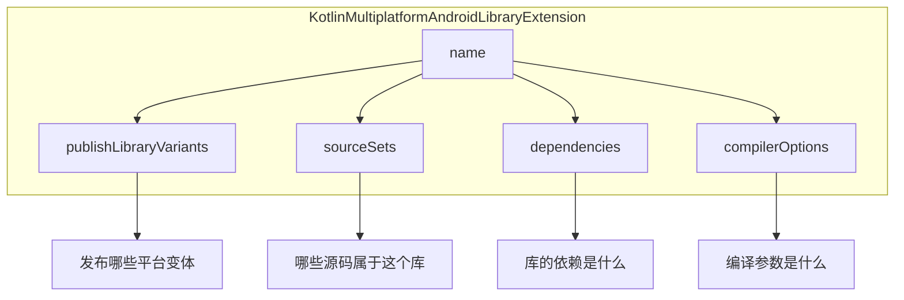
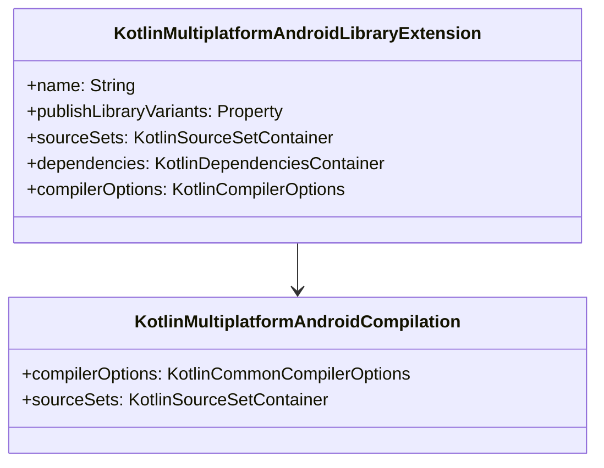

# 21.1.146 Kotlin多平台AndroidLibraryExtension

天色渐渐暗了下来，湖面上倒映的夕阳从金色变成了橙红，最后慢慢褪成灰蓝色。篝火噼啪作响，火星偶尔向上飘起，在夜空中转瞬即逝。

洛芙缩了缩脖子，把外套裹紧了一些。刚才在树荫下学了一下午的HostTestCompilation，太阳西斜后，黛琳说换个地方继续，于是大家把东西收拾到篝火旁边。

“洛芙，烤肠好了。”希尔递过来一根用树枝串着的烤肠，“先吃点东西，待会儿还有个重要的东西要讲。”

“什么重要的？”洛芙接过烤肠，热气腾腾的香味让她的注意力从屏幕上暂时离开。

黛琳在火堆里加了几根松枝，火苗蹿高了一点：“今天下午我们学了HostTestCompilation，那是配置测试的。现在我们要学的是更核心的东西——怎么配置你的KMP库本身。”

“库本身？”洛芙咬了一口烤肠，“是说我们写的那个共享代码库吗？”

“对，”黛琳点点头，把笔记本转过来指着屏幕，“你看这个build.gradle.kts，这是我们上次建的KMP库项目。里面有个android块——”

她指的是这个部分：

```kotlin
kotlin {
    android {
        // 这是什么？
    }
}
```

“这个android块，配置的就是你的库在Android平台上的编译行为，”黛琳解释道，“但光有这个块还不够，你还需要更细粒度的控制——这时候就需要KotlinMultiplatformAndroidLibraryExtension了。”

伊莎往火堆里扔了一颗松果，火光照亮了她的侧脸：“听起来就像是……帐篷外面的防潮垫？光有帐篷可以住，但加上防潮垫会更舒适？”

“差不多是这个意思，”希尔笑了，“android块给你基本配置，KotlinMultiplatformAndroidLibraryExtension给你更专业的控制。”

洛芙把烤肠吃完，用湿巾擦干净手：“那……这个Extension能做什么呢？”

黛琳打开Gradle API文档的页面：“能做的挺多的，我一个一个说。首先是最常用的——配置库名称。”

她在屏幕上敲了一段代码：

```kotlin
kotlin {
    androidLibrary {
        // 配置库名称
        name = "my-awesome-library"
        
        // 这个名称会用在什么地方呢？
    }
}
```

“你们有没有注意到，”黛琳指着代码问，“我刚才写的不是android块，而是androidLibrary块？”

洛芙凑近屏幕仔细看：“哎，真的不一样。android块是直接配置编译，这个是专门给库用的？”

“对，”黛琳点头，“在KMP项目里，如果你要发布一个库供其他项目使用，就要用androidLibrary块。这个块返回的就是KotlinMultiplatformAndroidLibraryExtension对象。”

希尔补充道：“这个是有区别的。如果你只是做一个App，用android块就够了。但如果你要做的是一个要发布到Maven/Gradle仓库的库，那就得用androidLibrary来配置发布相关的属性。”

伊莎轻轻拨动着火堆里的木柴：“那这个name……就是发布到仓库里的库名称吗？”

“对，name就是你的库在Maven/Gradle仓库中的artifact名称，”黛琳说，“比如别人这样引用你的库：”

```kotlin
dependencies {
    implementation("com.example:my-awesome-library:1.0.0")
}
```

“这里的my-awesome-library就是name的值，”她补充道，“所以取个好名字很重要，要简洁、有意义、最好能体现库的功能。”

洛芙在本子上记了一笔，又问：“那……光有名称不够吧？还得有版本号？发布配置？”

“你问到了关键点，”黛琳露出赞许的表情，“name只是其中一个配置。KotlinMultiplatformAndroidLibraryExtension还可以配置发布相关的很多东西。”

她在白板上画了一个图：



“你们看，Extension主要管这几个方面，”黛琳用白板笔点点图，“name我们已经说过了。publishLibraryVariants我们之前在学Compilation的时候也提过，今天再详细讲讲。”

她转向洛芙：“你还记得publishLibraryVariants是什么意思吗？”

“记得一点，”洛芙回忆道，“好像是决定发布哪些平台的变体？”

“没错，”黛琳说，“对于库来说，这个设置特别重要。你需要决定你的库要发布到哪些平台。常见的选项有这几个——”

```kotlin
kotlin {
    androidLibrary {
        // 选项1：发布所有平台
        publishLibraryVariants.set("all")
        
        // 选项2：匹配默认变体
        publishLibraryVariants.set("matchDefault")
        
        // 选项3：只发布框架
        publishLibraryVariants.set("framework")
        
        // 选项4：只发布元数据
        publishLibraryVariants.set("metadata")
    }
}
```

希尔在旁边解释道：“选'all'的话，你的库会为每个平台（Android、iOS、Desktop等）都生成产物。'matchDefault'会根据当前的构建配置自动选择。'framework'主要针对iOS，'metadata'则是KMP的元数据格式。”

伊莎问：“那……一般来说用哪个比较好？”

“这要看你的库的使用场景，”黛琳分析道，“如果是给Android App用的库，用'matchDefault'或者直接不设置就可以了。如果是跨平台库，想让使用者自己选择平台，那就用'all'。”

洛芙似懂非懂地点点头：“那这个sourceSets呢？也是管源码的吗？”

“对，sourceSets在库项目里尤其重要，”黛琳说，“在KMP库里，你可以为不同平台准备不同的代码。比如androidMain放Android特有的实现，commonMain放公共代码。”

她在屏幕上展示了目录结构：

```
src/
├── commonMain/
│   └── kotlin/
│       └── com/example/lib/
│           └── SharedApi.kt    # 公共API
├── androidMain/
│   └── kotlin/
│       └── com/example/lib/
│           └── AndroidImpl.kt # Android实现
└── iosMain/
    └── kotlin/
        └── com/example/lib/
            └── IosImpl.kt      # iOS实现
```

“这样设计的好处是，”黛琳继续说，“commonMain里的代码所有平台都能用，平台特有的实现放在对应的main里。编译的时候，KMP会自动把它们组合起来。”

洛芙好奇地问：“那这个怎么配置到Extension里呢？”

“其实不用特别配置，”希尔说，“KMP会自动识别src目录下的sourceSets。但你可以在Extension里做一些额外的设置，比如添加自定义的sourceSet。”

她演示了一段代码：

```kotlin
kotlin {
    androidLibrary {
        sourceSets {
            // 命名sourceSet的配置
            val androidMain by getting {
                // 可以添加额外的源码目录
            }
            
            // 创建自定义sourceSet
            register("customMain") {
                kotlin.srcDirs("src/custom/kotlin")
            }
        }
    }
}
```

洛芙把这些要点都记了下来，然后又问：“那dependencies呢？库的依赖怎么管理？”

“库的依赖管理也是Extension的重要功能，”黛琳说，“你可以在androidLibrary块里直接添加该库本身的依赖。”

```kotlin
kotlin {
    androidLibrary {
        dependencies {
            // 库自身的依赖
            implementation("androidx.core:core-ktx:1.12.0")
            implementation("org.jetbrains.kotlinx:kotlinx-coroutines-android:1.7.3")
        }
    }
}
```

“注意这里的dependencies是库自身的依赖，不是使用这个库的项目需要添加的依赖，”黛琳强调，“这两者要区分清楚。”

伊莎好奇地问：“那如果我不小心把依赖写错地方了会怎么样？”

“会出问题，”希尔严肃地说，“如果你把库的依赖写到了使用方的build.gradle里，那别人引用你的库时还得手动添加这些依赖，很麻烦。正确的方式是把依赖放在androidLibrary块里，这样别人引用你的库时，依赖会自动传递过去。”

黛琳补充道：“不过要注意，有些依赖是不应该传递的。比如一些只在开发时使用的工具库，应该用implementation而不是api。或者可以用@Deprecated标注为过时的传递依赖。”

洛芙在本子上记好，又问：“compilerOptions呢？这个我们之前学过吧？”

“学过，”黛琳说，“compilerOptions是通用的，用来配置Kotlin编译器的参数。在androidLibrary里也可以用，配置的是编译这个库时的编译器参数。”

```kotlin
kotlin {
    androidLibrary {
        compilerOptions {
            // 设置JVM目标版本
            jvmTarget.set(JvmTarget.JVM_17)
            
            // 添加free compiler args
            freeCompilerArgs.addAll(
                "-Xexpect-actual-classes"
            )
            
            // 启用所有警告
            allWarningsAsErrors.set(true)
        }
    }
}
```

“对于库来说，allWarningsAsErrors这个设置特别有用，”希尔解释道，“库是要发布给别人用的，如果有警告的话可能会影响使用者，所以很多库项目会把这个打开。”

黛琳看着天色已经完全暗下来，星星开始在天空中闪烁：“好了，我们今天学的KotlinMultiplatformAndroidLibraryExtension差不多就是这些。最后我再来总结一下，你们有什么问题吗？”

洛芙举手问：“那……我可以把android块和androidLibrary块一起用吗？”

“这是个好问题，”黛琳思考了一下，“在KMP库项目里，建议只用androidLibrary块。android块是给App用的，androidLibrary是给库用的。如果你两个都写了，可能会产生冲突。”

她画了一个简单的对比图：

```mermaid
flowchart LR
    subgraph App项目
        A[kotlin { android { ... } }] --> B[配置App编译]
    end
    
    subgraph 库项目
        C[kotlin { androidLibrary { ... } }] --> D[配置库发布]
    end
    
    B --> E[生成APK/AAB]
    D --> F[生成AAR]
```

“App用android块生成APK或AAB，库用androidLibrary块生成AAR发布到Maven仓库，”黛琳总结道，“两者的工作方式和使用场景不同。”

伊莎轻声说：“原来是这样……就像露营时要带的工具，App像是完整的露营套装，库像是单独的功能模块。露营套装可以直接用，模块则要整合到其他装备里才能发挥作用。”

“伊莎的比喻总是这么贴切，”黛琳笑了，“没错，就是这个道理。”

希尔打了个哈欠：“今天学的内容挺多的，洛芙你回去好好消化一下。明天我们再来讲库目标的具体构建。”

洛芙看着笔记上密密麻麻的要点，有些兴奋：“今天学的KotlinMultiplatformAndroidLibraryExtension感觉好专业啊……原来发布一个库要考虑这么多东西。”

“慢慢来，”黛琳拍了拍她的肩膀，“先把手头的项目跑通，其他的以后再优化。”

篝火还在燃烧，火光映照着每个人的脸。湖面上倒映着星空，远处的山峦只剩下黑黢黢的轮廓。夜的清香伴随着火焰的温度，让人感到格外宁静。

---

## 专业技术总结

> KotlinMultiplatformAndroidLibraryExtension — Android Gradle DSL中用于配置Kotlin Multiplatform库项目Android平台编译和发布的扩展对象。

#### 结构图



#### 核心配置项

| 配置项 | 类型 | 说明 |
|--------|------|------|
| name | String | 库发布到Maven仓库时的artifact名称 |
| publishLibraryVariants | Property<String> | 控制发布哪些平台变体（all/matchDefault/framework/metadata） |
| sourceSets | KotlinSourceSetContainer | 配置库的源码集（androidMain/commonMain等） |
| dependencies | KotlinDependenciesContainer | 库自身的依赖（自动传递） |
| compilerOptions | KotlinCompilerOptions | Kotlin编译器参数配置 |

#### 反模式与陷阱

1. **混淆android块和androidLibrary块**：App项目用android块生成APK，库项目用androidLibrary块生成AAR。混用会导致构建产物类型错误。

2. **依赖未正确标记传递范围**：需要使用者自动获得的依赖用`api`，仅库内部使用的用`implementation`。错误使用会导致使用方缺少依赖或产生传递依赖膨胀。

3. **publishLibraryVariants设置不当**：对于不需要跨平台的库，设置为'all'会生成不必要的平台产物，增加构建时间和仓库体积。

#### 设计哲学

KMP库的发布配置遵循**最小化传递依赖**和**明确平台边界**的原则：
- 使用`implementation`而非`api`来减少传递依赖
- 明确标注哪些代码属于哪个平台（androidMain vs commonMain）
- publishLibraryVariants应与实际支持的平台匹配

#### 动手练习

**目标**：创建一个简单的KMP库项目，配置androidLibrary块并发布到本地Maven仓库。

**Task 1：创建KMP库项目结构**

```bash
# 创建项目目录
mkdir -p my-library && cd my-library
```

**Task 2：编写build.gradle.kts配置**

```kotlin
// build.gradle.kts
plugins {
    kotlin("multiplatform") version "1.9.22"
    id("maven-publish")
}

kotlin {
    jvm()
    androidLibrary {
        name = "my-sample-library"
        publishLibraryVariants.set("matchDefault")
        
        compilerOptions {
            jvmTarget.set(JvmTarget.JVM_17)
        }
    }
}
```

**Task 3：添加源码**

在`src/commonMain/kotlin/com/example/lib/`下添加公共代码：
```kotlin
package com.example.lib

fun hello(): String = "Hello from library!"
```

**Task 4：构建并发布到本地Maven**

```bash
./gradlew publishToMavenLocal
```

**Task 5：创建使用方项目验证**

创建一个新的App项目，添加本地Maven仓库并引用该库：

```kotlin
// 使用方的build.gradle.kts
repositories {
    mavenLocal()
}

dependencies {
    implementation("com.example:my-sample-library:1.0.0")
}
```

**验收标准**：
- [ ] KMP库项目成功构建生成AAR
- [ ] 发布到本地Maven仓库
- [ ] 使用方项目能成功引用库并调用hello()函数

#### 参考实现要点

1. 库名称(name)应简洁且具有描述性，便于使用者识别
2. 优先使用`implementation`标记内部依赖，只在必要时使用`api`
3. publishLibraryVariants根据实际需要设置，避免发布不必要的平台产物
4. 库项目建议启用`allWarningsAsErrors`以保证代码质量
5. 发布前在本地Maven仓库测试，确认依赖传递正确

---

> 学习建议：KotlinMultiplatformAndroidLibraryExtension是KMP库项目的核心配置对象。建议先掌握App项目的android块，再学习库项目的androidLibrary块。重点理解publishLibraryVariants和依赖传递的概念。

## 洛芙的小小日记本

今天学到了KotlinMultiplatformAndroidLibraryExtension！原来发布一个库要考虑这么多——库名称、发布变体、源码集、依赖传递……黛琳说先不要急，把基础打牢。篝火旁边的星空好美啊，明天继续加油！

## 今日关键词

- **KotlinMultiplatformAndroidLibraryExtension**：Android Gradle DSL中用于配置KMP库项目Android平台编译的扩展对象
- **androidLibrary块**：KMP库项目中专门用于配置库编译和发布的DSL块
- **publishLibraryVariants**：控制库发布时包含哪些平台变体的配置选项
- **artifact**：Maven/Gradle仓库中可发布的构建产物单元
- **sourceSet**：Kotlin项目中管理源码的逻辑单元
- **api vs implementation**：依赖传递范围的标记方式，api会传递，implementation不会
- **AAR**：Android Archive Library，Android库的二进制发布格式
- **maven-publish**：Gradle插件，用于将产物发布到Maven仓库
- **jvmTarget**：Kotlin编译器参数，指定编译目标的Java版本
- **KotlinCompilerOptions**：配置Kotlin编译器行为的选项容器
