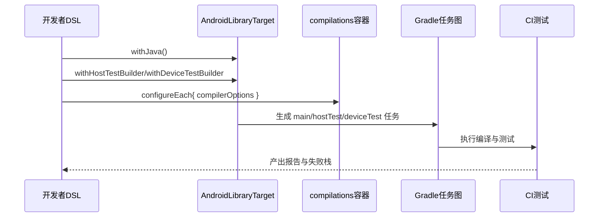
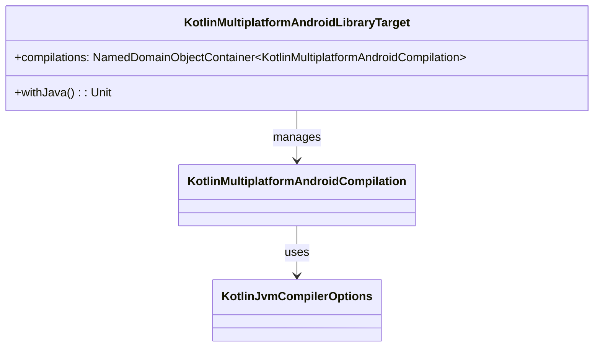

# 21.1.147 KotlinMultiplatformAndroidLibraryTarget

松枝在火里“啪”地裂开时，洛芙刚好把终端里一串红色报错读到最后一行。

“`error: package javax.annotation does not exist`……怎么又是这个。”她把电脑轻轻往前推，像把一盘煎糊的蛋递给大家看。

希尔咬着烤吐司边，凑过来扫了一眼。

“你把`src/androidMain/java`里的旧工具类搬进来了，但目标还没开Java编译。”

洛芙眨眨眼。

“我以为Kotlin多平台默认就能一起编。”

黛琳把保温杯放在折叠桌角，语气一贯平稳。

“今晚我们学的就是这个坑的正解：`KotlinMultiplatformAndroidLibraryTarget`。上一章你学的是扩展层，像是营地总电闸；这一章是目标层，像每一条具体回路的开关和保险丝。”

伊莎把一块热可可饼干掰成两半，塞给洛芙一半。

“你现在遇到的不是‘写错代码’，是‘没有把编译目标讲清楚’。系统听不懂你的意图，就会保持沉默，或者报错。”

洛芙接过饼干，低头看屏幕。

“所以`KotlinMultiplatformAndroidLibraryTarget`到底是什么？”

黛琳在白板本上先写一句极简定义：

“它是KMP里Android库目标的DSL对象，负责这个目标怎么编、编哪些编译单元，以及是否启用Java源码编译。”

“官方这页里最核心就两个成员，”她又写下两行，“`withJava()`，`compilations`。”

希尔打了个响指。

“少，但关键。像帐篷只有两根主杆，搭对了整晚安稳。”

她把电脑转向三人，敲出最小配置。

```kotlin
// build.gradle.kts (module: shared)
plugins {
    kotlin("multiplatform")
    id("com.android.kotlin.multiplatform.library")
}

kotlin {
    androidLibrary {
        namespace = "camp.shared"

        // 章节核心1：启用 Java 源码编译
        withJava()

        // 章节核心2：读取并配置编译单元容器
        compilations.configureEach {
            compilerOptions {
                jvmTarget.set(org.jetbrains.kotlin.gradle.dsl.JvmTarget.JVM_17)
                allWarningsAsErrors.set(false)
            }
        }

        withHostTestBuilder {
            enable = true
        }

        withDeviceTestBuilder {
            enable = true
        }

        androidResources {
            enable = true
        }
    }
}
```

“先看`withJava()`。”黛琳用笔敲了敲那一行，“官方描述很短：启用Java源码编译。意思是，这个Android库目标会把`java/`目录纳入编译图，不再只看Kotlin。”

洛芙点头。

“像给厨房增加一个灶台，本来只能煮面，现在还能炒菜。”

“对。”希尔笑，“但注意，这不是让你‘必须’写Java，只是让目标支持Java源。”

黛琳继续。

“再看`compilations`，它是一个`NamedDomainObjectContainer<KotlinMultiplatformAndroidCompilation>`。别被名字吓到，翻成白话就是：‘一组带名字的编译单元集合’，你可以按名字拿到`main`、`hostTest`、`deviceTest`这些单元，再分别设编译参数。”

伊莎把白板本翻到下一页，画出流程图。

```mermaid
flowchart TD
    A[KotlinMultiplatformAndroidLibraryTarget] --> B[withJava()]
    A --> C[compilations 容器]
    C --> C1[main]
    C --> C2[hostTest]
    C --> C3[deviceTest]
    C1 --> D1[产出 AAR 主代码]
    C2 --> D2[本机 JVM 测试]
    C3 --> D3[设备/模拟器测试]
```

洛芙盯着图看了几秒。

“图1对应上面代码里`withJava()`和`compilations.configureEach`那段，对吧？”

“对，”黛琳点头，“图1对应代码块中从`withJava()`到`compilations.configureEach`的那几行。你要学会把图和DSL一一对上。”

希尔接着演示一个常见坏味道。

“很多人第一次写会这样——”

```kotlin
// 反模式：只在 main 编译设置 jvmTarget，测试编译单元没对齐
kotlin {
    androidLibrary {
        compilations.named("main") {
            compilerOptions {
                jvmTarget.set(org.jetbrains.kotlin.gradle.dsl.JvmTarget.JVM_17)
            }
        }
    }
}
```

“表面没问题，”她说，“但`hostTest`可能默认还是旧目标版本，CI上会出现‘主代码能编，测试挂掉’。”

洛芙苦着脸。

“这就是我上周那个神秘报错……”

“重构很直接。”黛琳写下改进版。

```kotlin
// 重构后：对所有编译单元统一策略，再按需覆写
kotlin {
    androidLibrary {
        compilations.configureEach {
            compilerOptions {
                jvmTarget.set(org.jetbrains.kotlin.gradle.dsl.JvmTarget.JVM_17)
                freeCompilerArgs.add("-Xjsr305=strict")
            }
        }

        compilations.named("hostTest") {
            compilerOptions {
                allWarningsAsErrors.set(true)
            }
        }
    }
}
```

“先统一，再局部加严。”她说，“这是容器DSL最稳的写法。”

夜色更深，帐篷边的小营灯亮成一圈柔黄。

洛芙翻着自己的工程目录，忽然又抬头。

“那`withHostTestBuilder`和`withDeviceTestBuilder`是不是也属于这个目标的编译生态？”

“是，”黛琳回答，“虽然它们在扩展接口上，但你会和`compilations`一起用。你把测试构建器打开，容器里对应测试编译单元就有意义；你再给这些编译单元配置选项，整条测试链路才完整。”

伊莎把另一张图推到中间。



“图2对应代码里测试构建器和`compilations.configureEach`联动那段。”希尔补充，“你不把它们连起来看，就会出现‘有测试目录、没测试任务’或者‘有任务、参数不一致’这种半残状态。”

洛芙吸了口夜风，继续追问。

“我们今天主题是target，但上章的`androidResources`、`compilerOptions`是不是也得在这里落地？”

黛琳笑了一下。

“这就是工程感。API页面虽然主讲`withJava`和`compilations`，但真实项目必须考虑它们与继承来的配置能力协作：`compilerOptions`决定字节码和警告策略，`androidResources`决定资源处理，`experimentalProperties`可做实验特性开关。”

希尔敲了一段更完整、可跑的示例库。

```kotlin
// 依赖：
// plugins { kotlin("multiplatform") ; id("com.android.kotlin.multiplatform.library") }
// 运行：./gradlew :shared:assemble :shared:hostTest

kotlin {
    androidLibrary {
        namespace = "camp.shared"
        compileSdk = 35
        minSdk = 24

        withJava()

        compilerOptions {
            jvmTarget.set(org.jetbrains.kotlin.gradle.dsl.JvmTarget.JVM_17)
            freeCompilerArgs.addAll("-Xjvm-default=all")
        }

        androidResources {
            enable = true
        }

        withHostTestBuilder { enable = true }
        withDeviceTestBuilder { enable = true }

        compilations.configureEach {
            compilerOptions {
                allWarningsAsErrors.set(false)
            }
        }
    }
}
```

“你们看，”她说，“当`withJava()`打开后，我把一个旧Java工具类放进`src/androidMain/java`，Kotlin代码照样能调用。”

她又贴出最小调用样例。

```java
// src/androidMain/java/camp/shared/LegacyFormatter.java
package camp.shared;

public final class LegacyFormatter {
    private LegacyFormatter() {}

    public static String formatTemp(int celsius) {
        return celsius + "°C";
    }
}
```

```kotlin
// src/androidMain/kotlin/camp/shared/WeatherText.kt
package camp.shared

object WeatherText {
    fun tonightTempLabel(value: Int): String {
        return "湖畔夜温 " + LegacyFormatter.formatTemp(value)
    }
}
```

洛芙眼睛亮了。

“这就把旧Java资产接进来了，不用一次性全改Kotlin。”

“正解。”黛琳说，“迁移工程最怕‘大爆破’，target层给你的就是可控迁移路径。”

希尔又打开测试文件。

```kotlin
// src/hostTest/kotlin/camp/shared/WeatherTextTest.kt
package camp.shared

import kotlin.test.Test
import kotlin.test.assertEquals

class WeatherTextTest {
    @Test
    fun label_should_use_legacy_java_formatter() {
        val text = WeatherText.tonightTempLabel(18)
        assertEquals("湖畔夜温 18°C", text)
    }
}
```

她把终端输出投在屏幕上。

```text
> Task :shared:compileHostTestKotlin
> Task :shared:hostTest

BUILD SUCCESSFUL in 4s
18 actionable tasks: 18 executed
```

“这段输出就是你要的‘链路闭环证据’。”她说。

洛芙忽然想起另一个困惑。

“如果我把Room、WorkManager、权限请求、相机定位这些都放进这个库，会不会太重？”

黛琳把问题拆开。

“先按职责分层。`target`管编译组织，不替你做架构决策。你可以把API接口放`commonMain`，把Android实现放`androidMain`。像权限请求、Activity/Fragment生命周期绑定、Service前台通知、CameraX、FusedLocationProvider、Retrofit网络调用，通常都在Android侧实现。”

伊莎接话。

“意思是：地图要画清楚，行李才不会乱塞。”

黛琳在白板上写了一个实际分层样例，专门回应洛芙担心的“知识点很多”。

```kotlin
// commonMain
interface CampSyncRepository {
    suspend fun pullWeather(): String
    suspend fun saveNote(note: String)
}

// androidMain: 绑定 Android 生命周期与系统能力
class CampSyncRepositoryAndroid(
    private val api: CampApi,                // Retrofit
    private val dao: NoteDao,                // Room
    private val prefs: android.content.SharedPreferences
) : CampSyncRepository {
    override suspend fun pullWeather(): String = api.weather()

    override suspend fun saveNote(note: String) {
        dao.insert(NoteEntity(content = note))
        prefs.edit().putLong("last_sync", System.currentTimeMillis()).apply()
    }
}
```

“生命周期怎么处理？”洛芙继续问。

希尔马上接。

“Activity/Fragment里别直接做长耗时。用ViewModel发起，必要时交给WorkManager。前台持续任务才考虑Service。库层提供能力，宿主App决定在哪个生命周期挂钩。”

她给出坏味道与修复。

```kotlin
// 反模式：在 Activity.onCreate 直接网络请求 + 数据库存储
override fun onCreate(savedInstanceState: Bundle?) {
    super.onCreate(savedInstanceState)
    runBlocking {
        val w = repo.pullWeather() // 阻塞主线程
        repo.saveNote(w)
    }
}
```

```kotlin
// 修复：生命周期感知 + 后台任务
class CampViewModel(
    private val repo: CampSyncRepository
) : ViewModel() {
    fun sync() = viewModelScope.launch {
        val w = repo.pullWeather()
        repo.saveNote(w)
    }
}
```

“库并不替代架构，”黛琳强调，“它给你稳定编译和清晰边界。`KotlinMultiplatformAndroidLibraryTarget`就是边界的第一层。”

洛芙把手指压在键盘边缘，慢慢呼了一口气。

“我好像理解了：target是‘这个Android库怎么被制造’，不是‘这个库要解决什么业务’。”

“完全正确。”

黛琳把杯子递过去，让她暖暖手。

“你要把制造流程和业务逻辑分开。制造流程靠DSL：`withJava`、`compilations`、测试构建器、编译选项。业务逻辑靠你在源码集里设计接口与实现。”

湖面吹来一阵更凉的风，篝火被吹得轻轻侧向一边。

伊莎把围巾往上提了提，看着终端绿色的`BUILD SUCCESSFUL`。

“今天这一课像是在学搭桥。桥不是风景，但没有桥，你过不去。”

希尔把最后一口可可喝完，合上电脑。

“明天我们可以继续做发布变体优化。今晚先把这套最小模板抄进你们自己的shared模块，跑通一遍再睡。”

洛芙笑着点头。

“嗯，先让桥稳，再走远路。”

火光在她眼睛里跳了一下，又慢慢安静下来。

---

## 专业技术总结

> KotlinMultiplatformAndroidLibraryTarget（Kotlin 多平台 Android 库目标）是 KMP 中针对 Android Library 目标的 DSL 对象，核心负责启用 Java 源码编译（withJava）与管理目标下编译单元容器（compilations），并与编译选项、测试构建器、资源处理协同形成稳定的构建与测试链路。

#### 结构图（必须）



上图强调两件事：目标对象只暴露少量核心入口，但通过`compilations`容器把多个编译单元统一管理。

#### 复杂度与影响

- 启用`withJava()`会扩大源码扫描与编译范围，构建时间通常略增，但可显著降低“旧Java资产迁移”的一次性风险。
- `compilations.configureEach`统一配置可减少环境漂移，降低“本地可过/CI失败”的概率。
- 测试编译单元（host/device）显式开启后，CI可观察性提升，代价是任务图更大。

#### 反模式与陷阱（≥3 条）

1. 只配置`main`不配置测试编译单元。修复：先`configureEach`统一，再对单个单元覆写。  
2. 混编Java但未调用`withJava()`。修复：在`androidLibrary {}`中显式启用。  
3. 将业务生命周期逻辑塞进构建DSL。修复：DSL只管构建，生命周期在宿主层（ViewModel/WorkManager/Service）处理。  
4. 把权限请求、相机定位直接写进`commonMain`。修复：放到`androidMain`实现，通过接口向`commonMain`暴露能力。  

#### 设计哲学或者设计思想

**把“制造流程”与“业务能力”分离**

1. 构建脚本优先表达“怎么编译”，源码优先表达“做什么业务”。
2. 使用容器DSL统一策略，减少隐式默认值带来的漂移。
3. 测试编译单元与主编译单元保持JVM目标一致。
4. 渐进迁移：先`withJava()`接入旧资产，再分批Kotlin化。
5. 让库保持可组装：公共接口在`commonMain`，平台实现在`androidMain`。

---

#### 🏕️ 动手练习（项目制）

项目概览：实现一个`shared`库，提供“露营天气同步”能力；库支持Kotlin+Java混编，并跑通host/device测试链路。

**Task 1（★）**  
**目标**：创建KMP Android Library基础模块。  
**你需要做的事**：
1. 新建`shared`模块并应用`kotlin("multiplatform")`与Android KMP library插件。
2. 在`kotlin { androidLibrary { ... } }`中设置`namespace/compileSdk/minSdk`。
3. 执行`./gradlew :shared:tasks`确认任务可见。  
**验收标准**：
- [ ] `:shared`模块可识别为KMP模块
- [ ] Android相关任务可列出
- [ ] 无插件冲突报错  
**提示**：
```kotlin
kotlin { androidLibrary { namespace = "camp.shared" } }
```

**Task 2（★）**  
**目标**：启用Java混编能力。  
**你需要做的事**：
1. 在`androidLibrary`里添加`withJava()`。
2. 新建`src/androidMain/java/.../LegacyFormatter.java`。
3. 在Kotlin代码调用Java静态方法。  
**验收标准**：
- [ ] Java类被编译
- [ ] Kotlin可调用Java方法
- [ ] `assemble`成功  
**提示**：
```kotlin
androidLibrary { withJava() }
```

**Task 3（★★）**  
**目标**：理解`compilations`容器。  
**你需要做的事**：
1. 使用`compilations.configureEach`设置统一`jvmTarget`。
2. 仅对`hostTest`附加`allWarningsAsErrors=true`。
3. 观察配置前后构建日志差异。  
**验收标准**：
- [ ] main/hostTest/deviceTest均被命中
- [ ] hostTest有单独覆写
- [ ] CI参数一致性提高  
**提示**：
```kotlin
compilations.named("hostTest") { compilerOptions { allWarningsAsErrors.set(true) } }
```

**Task 4（★★）**  
**目标**：打通主机测试链路。  
**你需要做的事**：
1. 开启`withHostTestBuilder { enable = true }`。
2. 在`src/hostTest`写一个`kotlin.test`用例。
3. 执行`./gradlew :shared:hostTest`。  
**验收标准**：
- [ ] 生成hostTest编译任务
- [ ] 测试执行并产出报告
- [ ] 失败时可看到断言信息  
**提示**：
```kotlin
withHostTestBuilder { enable = true }
```

**Task 5（★★★）**  
**目标**：打通设备测试链路。  
**你需要做的事**：
1. 开启`withDeviceTestBuilder { enable = true }`。
2. 添加简单仪器测试（或预留模板）。
3. 在模拟器上执行设备测试任务。  
**验收标准**：
- [ ] deviceTest任务存在
- [ ] 模拟器可执行测试
- [ ] 失败日志可追踪  
**提示**：
```kotlin
withDeviceTestBuilder { enable = true }
```

**Task 6（★★★）**  
**目标**：接入资源处理。  
**你需要做的事**：
1. 开启`androidResources { enable = true }`。
2. 在`androidMain`添加一个字符串资源。
3. 让Kotlin代码读取该资源（通过Android侧包装）。  
**验收标准**：
- [ ] 资源打包进AAR
- [ ] 运行时可读取
- [ ] 无资源链接错误  
**提示**：
```kotlin
androidResources { enable = true }
```

**Task 7（★★★★）**  
**目标**：实现“网络+存储”最小闭环。  
**你需要做的事**：
1. 定义`CampSyncRepository`接口于`commonMain`。
2. 在`androidMain`实现：Retrofit拉取数据、Room写入、SharedPreferences记录时间戳。
3. 通过hostTest验证格式化逻辑。  
**验收标准**：
- [ ] 接口与实现分层清晰
- [ ] 至少一次成功写入数据库
- [ ] 时间戳持久化成功  
**提示**：
```kotlin
prefs.edit().putLong("last_sync", System.currentTimeMillis()).apply()
```

**Task 8（★★★★★）**  
**目标**：完成生命周期安全集成。  
**你需要做的事**：
1. 在宿主App的Fragment中通过ViewModel触发同步。
2. 后台重试交给WorkManager，不在`onCreate`阻塞。
3. 需要持续通知时再使用前台Service。  
**验收标准**：
- [ ] 主线程无阻塞
- [ ] 后台任务在进程重启后可恢复
- [ ] 生命周期与任务边界明确  
**提示**：
```kotlin
viewModelScope.launch { repo.pullWeather(); repo.saveNote("ok") }
```

**面试热身（Q1-Q5）**
1. 用自己的话解释`withJava()`解决了什么工程问题。  
2. 为什么`compilations.configureEach`比只配`main`更稳？  
3. hostTest与deviceTest分别适合验证什么？  
4. KMP库里，权限/相机/位置相关实现为什么应放`androidMain`？  
5. 构建DSL与业务架构分离，会给团队协作带来什么收益？  

#### 参考实现要点（5 条）

1. 在迁移期优先启用`withJava()`，避免一次性重写导致长分支风险。  
2. 用`configureEach`先做全局一致性，再按编译单元精细化。  
3. host/device测试双通道要早接入，减少后期补链路成本。  
4. 生命周期敏感工作交给ViewModel/WorkManager/Service，不放构建脚本。  
5. `commonMain`只放可跨平台语义，Android系统能力统一封装在`androidMain`。  

---

> 建议你先把“withJava + compilations统一配置 + hostTest跑通”作为本章最小闭环，再逐步加deviceTest与资源处理。每多一层能力，都要用一次可重复命令验证，不靠“感觉应该能跑”。

## 🍹洛芙的小小日记本

今晚终于不怕那串长长的target名字了。原来先把“怎么制造库”讲清楚，业务反而更轻松。先搭桥，再赶路，这句话我要写在明天的便签最上面。

## 今日关键词

- Kotlin Multiplatform (KMP)：一套代码面向多个平台的开发方式。你可以共享业务逻辑，再为不同平台写各自实现。  
- KotlinMultiplatformAndroidLibraryTarget：KMP里Android库目标的DSL对象，核心是`withJava()`和`compilations`。  
- withJava()：启用Java源码编译，让Android目标可混编Kotlin与Java。  
- compilations：编译单元容器，按名称管理`main`、`hostTest`、`deviceTest`等。  
- NamedDomainObjectContainer：Gradle中的“可命名对象集合”，支持按名称查询与批量配置。  
- KotlinMultiplatformAndroidCompilation：Android目标下的单个编译单元对象。  
- compilerOptions：编译器选项配置入口，可设置jvmTarget、警告策略等。  
- jvmTarget：Kotlin编译目标的JVM版本，主代码与测试应尽量一致。  
- freeCompilerArgs：附加编译参数列表，用于启用特定编译行为。  
- withHostTestBuilder：开启主机侧测试编译/执行能力。  
- withDeviceTestBuilder：开启设备/模拟器侧测试能力。  
- androidResources：Android资源处理配置入口，控制资源是否参与打包。  
- hostTest：运行在本机JVM的测试，速度快，适合逻辑验证。  
- deviceTest：运行在设备或模拟器的测试，适合验证Android运行环境行为。  
- AAR：Android Library的二进制产物格式。  
- CI：持续集成系统，用来自动执行构建与测试。  
- commonMain：KMP中放跨平台共享代码的源码集。  
- androidMain：KMP中放Android平台实现代码的源码集。  
- Retrofit：常用HTTP客户端库，便于声明式网络请求。  
- Room：Android官方SQLite对象映射层，简化数据库访问。  
- SharedPreferences：轻量键值存储，适合保存小型配置和时间戳。  
- ViewModel：生命周期感知组件，用于承载UI相关数据与异步任务入口。  
- WorkManager：可延迟、可恢复、可约束的后台任务框架。  
- Service：后台组件；持续且用户可感知任务通常用前台Service。  
- Activity/Fragment生命周期：组件从创建到销毁的回调序列，决定何时安全执行操作。  
- Runtime Permission：运行时权限模型，涉及相机、位置等敏感能力前必须请求。  
- Intent Filter：组件声明可响应的意图规则，用于系统分发匹配。  
- CameraX：Android相机开发库，简化预览、拍照与生命周期绑定。  
- FusedLocationProvider：Google定位能力入口，统一多传感器定位来源。  
- 反模式（Anti-pattern）：看似能跑但长期高风险的写法，应尽快重构。  
- 重构（Refactor）：不改变外部行为前提下改进代码结构与可维护性。