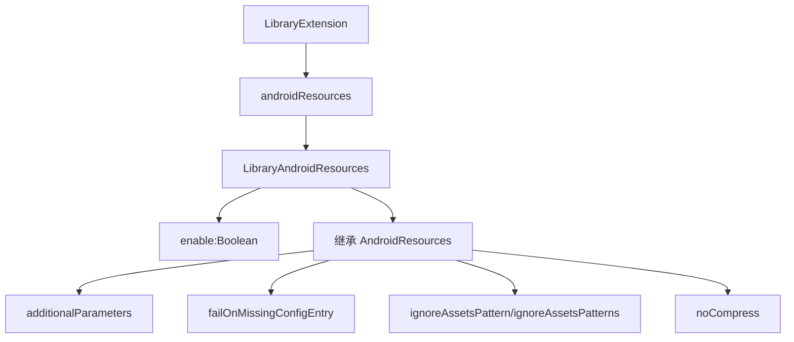
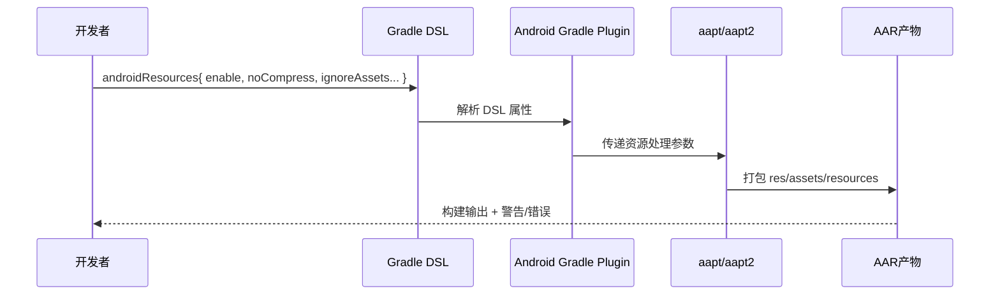
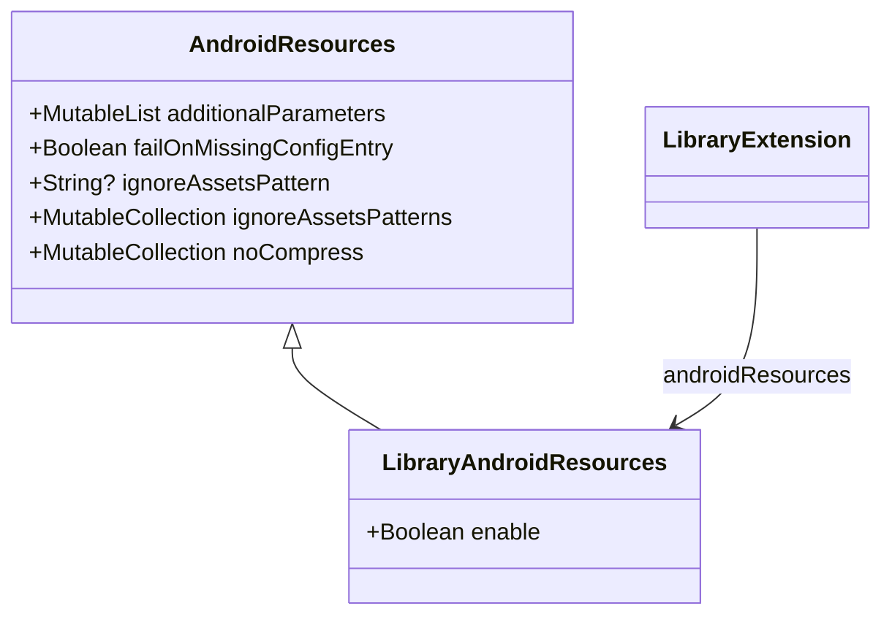

# 21.1.148 LibraryAndroidResources

洛芙把最后一块烤吐司从铁网上翻下来时，火星轻轻一跳，落进黑色湖边的湿土里。

“刚才你们说 `KotlinMultiplatformAndroidLibraryTarget` 的 `withJava()`、`compilations` 我懂了七成，”她把吐司掰开，热气从中间冒出来，“可我现在卡在一个很具体的问题：库模块里 `res/` 明明有东西，产物却像被掏空了一半。”

希尔把电脑转过来，屏幕上是一次失败构建后的输出。

“不是完全没打包，是‘部分行为和预期不同’。这种最烦。”

黛琳把白板笔帽咬在唇边，低头翻了翻她刚记的 DSL 笔记。

“那今晚就把它收掉。我们接着上一章，从 `KotlinMultiplatformAndroidLibraryTarget` 往下走，刚好就是 `LibraryAndroidResources`。”

伊莎把保温杯放在洛芙手边，杯壁暖暖的。

“名字听起来很硬，但它做的事很朴素：告诉构建系统，‘这个库的资源要不要处理、怎么处理’。”

洛芙眨眨眼：“只是一组配置？”

“是，”黛琳点头，“但这组配置，决定了你最后发出去的 AAR 里资源是否齐整，压缩策略是否合理，aapt 参数是否一致。‘只是配置’通常都不只是配置。”

她在白板上写下第一行字：

`interface LibraryAndroidResources : AndroidResources`

“官方定义很短，”她说，“`LibraryAndroidResources` 是给 Library 插件配置 Android 资源选项的 DSL 对象；它通过 `LibraryExtension.androidResources` 访问。”

“也就是说，”洛芙把吐司塞进嘴里，含糊地复述，“它自己有一部分属性，还继承 `AndroidResources` 的属性？”

“对。你抓住骨架了。”

希尔打了个响指。

“先给你看图，别急着抄代码。图 1 对应下面代码片段 A 的第 5-15 行。”



“这张图就是层次关系，”黛琳说，“不是调用顺序。先有 `android {}`，再进 `androidResources {}`，然后你配置 `enable` 和继承来的几项资源行为。”

洛芙点点头：“那 `enable` 就是总开关？”

“是总开关，而且有一个很容易被忽略的默认值差异。”

黛琳把笔尖在 `enable` 旁边点了两下。

“官方写得很清楚：在普通 Android Library 模块里，默认是 `true`；在 Kotlin Multiplatform Library 里，默认是 `false`。这一条是今晚的关键坑。”

洛芙愣住：“诶？同样是库模块，默认不一样？”

“对。”希尔把终端窗口放大，“你如果从传统 `com.android.library` 迁移到 KMP，又没显式写 `enable = true`，就会出现‘我以为会处理资源，但实际上没按你想要的方式处理’的问题。”

伊莎轻声笑：“像你把帐篷灯开关想当然地当成‘上推亮’，结果这款是‘下推亮’。手没错，预期错了。”

洛芙捂住脸：“我前天就是这么干的……”

“先看代码片段 A，”希尔说，“这是最小可读版本。注意注释。”

```kotlin
// 代码片段 A（build.gradle.kts）
// 依赖：AGP 8.11+ / 9.0 API（示例按官方 DSL 命名）
plugins {
    id("com.android.library")
    kotlin("android")
}

android {
    namespace = "camp.lib.resources"
    compileSdk = 35

    androidResources {
        // 行12：在库模块中显式声明，避免不同插件默认值差异造成歧义
        enable = true

        // 行15：传给 aapt 的附加参数列表（属性方式，非旧函数）
        additionalParameters += listOf("--no-version-vectors")

        // 行18：找不到某配置条目时是否报错
        failOnMissingConfigEntry = true

        // 行21：忽略某些资产模式
        ignoreAssetsPatterns += listOf("*.psd", "*.bak", "thumbs.db")

        // 行24：指定不压缩扩展名（适用于资源/资产/Java 资源）
        noCompress += listOf("tflite", "mp3")
    }
}
```

“这里你用了 `ignoreAssetsPatterns`，不是 `ignoreAssetsPattern`，”洛芙说。

“嗯，两个都在 `AndroidResources` 里能看到。”黛琳回答，“`ignoreAssetsPattern` 是单个可空字符串，`ignoreAssetsPatterns` 是集合。工程里更常用集合，便于合并与维护。”

“那 `additionalParameters()` 和 `noCompress()` 这种函数写法呢？”

“官方标了 deprecated。”希尔把一行日志贴到白板边缘。

“‘Replaced with property additionalParameters / noCompress’。意思就是：别再用旧函数，改用属性集合。”

洛芙把这一句圈了起来。

“废弃 API 迁移题，我懂。”

湖边的风又凉了一层，伊莎把围巾往上提了提，随后把另一块白板立起来。

“你刚才问‘为什么我只丢一部分资源’。现在我们做完整的排查流程。图 2 对应代码片段 B 的第 8-29 行。”



“这就是工程里的真实路径，”黛琳说，“配置写在 DSL，但行为发生在资源处理链路。你要查问题，就沿这条链挨个确认。”

“我来演示一个坏味道版本。”希尔把键盘拉近，啪啪敲了十几行。

```kotlin
// 代码片段 B-1（反模式示例）
android {
    androidResources {
        // 反模式1：继续使用已废弃函数，未来升级风险高
        @Suppress("DEPRECATION")
        noCompress("tflite")

        // 反模式2：把多个参数拼接成单字符串，维护困难
        @Suppress("DEPRECATION")
        additionalParameters("--no-version-vectors --legacy")

        // 反模式3：KMP迁移后未显式设置enable，依赖默认值猜行为
        // enable 未设置
    }
}
```

“看着能跑，”洛芙说，“但隐患都在里面。”

“对，重构版如下。”希尔继续。

```kotlin
// 代码片段 B-2（重构后）
android {
    androidResources {
        // 明确意图，降低跨插件/跨版本歧义
        enable = true

        // 使用属性集合，参数粒度清晰
        additionalParameters += listOf("--no-version-vectors", "--warn-manifest-validation")

        // 使用集合维护不压缩列表，后续可由 convention plugin 统一下发
        noCompress += listOf("tflite", "mp3", "json")
    }
}
```

洛芙盯着两段代码看了几秒。

“这个重构像把散落在地上的装备装回分隔袋。不是变炫，是变稳。”

“嗯，”黛琳笑了，“工程就是追求‘稳定地可解释’。”

她把话题往前推了一步。

“但你还要理解：库资源配置不是孤立存在。它会影响你后续 Activity、Fragment、Service 在宿主 App 里的行为可预期性。”

“怎么影响？”

“比如你库里有一个 Fragment 用 `R.layout.fragment_trail_map`，如果资源处理链出问题，它运行期就是 `Resources.NotFoundException`。这不是 Fragment 生命周期错，但会在 `onCreateView` 或 `onViewCreated` 暴露。”

希尔直接开了一个最小示例。

```kotlin
// 代码片段 C（库内Fragment，演示资源依赖）
class TrailMapFragment : Fragment(R.layout.fragment_trail_map) {
    override fun onViewCreated(view: View, savedInstanceState: Bundle?) {
        super.onViewCreated(view, savedInstanceState)
        val marker = view.findViewById<ImageView>(R.id.iv_marker)
        marker.contentDescription = "camp-marker"
    }
}
```

“如果 AAR 里这个布局没打进去，”她说，“你怀疑生命周期、怀疑导航、怀疑线程都没用。根因是资源配置。”

洛芙咬着笔帽点头。

“那 Activity、Service 呢？”

黛琳把笔转了一圈。

“Activity 生命周期里，`onCreate` 加载布局最敏感；Service 前台通知常依赖图标与字符串资源；Fragment 在视图创建阶段依赖布局和 style。资源问题会在各自最早触发点爆出来。”

伊莎把手电筒压暗一些，白板上只剩清晰的黑字。

“这就是为什么构建层配置看起来离业务很远，实际上离崩溃很近。”

洛芙突然想到什么。

“那我库里如果要给宿主传数据，比如 Intent Extra、Bundle、SharedPreferences、Room，这些也会受影响吗？”

“逻辑层本身不受 `androidResources` 直接控制，”黛琳说，“但它们依赖的资源键值、默认文案、raw 文件可能受影响。我们做个一体化小场景。”

希尔新建了一个 demo：露营路线库模块 `camp-lib`，宿主 App `camp-app`。

她把关键代码分段贴出来。

```kotlin
// 代码片段 D-1（Activity + Intent Extra + Bundle）
class EntryActivity : AppCompatActivity() {
    override fun onCreate(savedInstanceState: Bundle?) {
        super.onCreate(savedInstanceState)
        setContentView(R.layout.activity_entry)

        val launch = Intent(this, DetailActivity::class.java).apply {
            putExtra("route_id", "lake-night-01")
            putExtra("from_library", true)
        }
        startActivity(launch)
    }
}

class DetailActivity : AppCompatActivity() {
    override fun onCreate(savedInstanceState: Bundle?) {
        super.onCreate(savedInstanceState)
        setContentView(R.layout.activity_detail)

        val routeId = intent.getStringExtra("route_id") ?: "unknown"
        supportFragmentManager.beginTransaction()
            .replace(R.id.container, TrailMapFragment().apply {
                arguments = bundleOf("route_id" to routeId)
            })
            .commitNow()
    }
}
```

```kotlin
// 代码片段 D-2（SharedPreferences + Room）
@Entity(tableName = "route_log")
data class RouteLog(
    @PrimaryKey val id: String,
    val timestamp: Long,
    val note: String
)

@Dao
interface RouteLogDao {
    @Insert(onConflict = OnConflictStrategy.REPLACE)
    suspend fun upsert(log: RouteLog)
}

class RouteRepository(context: Context, private val dao: RouteLogDao) {
    private val sp = context.getSharedPreferences("camp_pref", Context.MODE_PRIVATE)

    suspend fun saveLastRoute(routeId: String) {
        sp.edit().putString("last_route", routeId).apply()
        dao.upsert(RouteLog(routeId, System.currentTimeMillis(), "from library"))
    }
}
```

```kotlin
// 代码片段 D-3（WorkManager + Handler）
class SyncRouteWorker(appContext: Context, params: WorkerParameters) :
    CoroutineWorker(appContext, params) {
    override suspend fun doWork(): Result {
        // 模拟后台同步
        delay(300)
        return Result.success()
    }
}

class RouteSyncStarter(private val context: Context) {
    private val handler = Handler(Looper.getMainLooper())

    fun trigger() {
        handler.postDelayed({
            val request = OneTimeWorkRequestBuilder<SyncRouteWorker>().build()
            WorkManager.getInstance(context).enqueue(request)
        }, 500)
    }
}
```

```kotlin
// 代码片段 D-4（权限 + 位置 + 相机 + 传感器 + 网络）
class FieldFeature(private val activity: FragmentActivity) {
    private val locationPermission = Manifest.permission.ACCESS_FINE_LOCATION
    private val cameraPermission = Manifest.permission.CAMERA

    fun requestPermissions(launcher: ActivityResultLauncher<Array<String>>) {
        launcher.launch(arrayOf(locationPermission, cameraPermission))
    }

    fun startLocationAndCamera(
        client: FusedLocationProviderClient,
        cameraProvider: ProcessCameraProvider,
        sensorManager: SensorManager,
        api: TrailApi
    ) {
        // 这里省略完整实现：
        // 1) 读取定位
        // 2) 启动 CameraX 预览
        // 3) 监听加速度计
        // 4) Retrofit 上传打点
    }
}

interface TrailApi {
    @GET("/trail/status")
    suspend fun status(): Response<Unit>
}
```

“这整套链路里，”黛琳说，“你看到的生命周期、数据存储、后台任务、权限、硬件、网络，全都能正常写。但库资源打包如果不稳定，UI 入口先崩，后面的能力再完整也白搭。”

洛芙长长“哦——”了一声。

“基础设施先站稳，业务才有舞台。”

“还有一个你会在组件通信里遇到的点，”伊莎补充，“`intent-filter` 常常关联图标、label、字符串资源；如果资源处理配置不一致，系统展示层就会出现错位。”

希尔顺手贴了个 manifest 片段。

```xml
<!-- 代码片段 E（Intent Filter 示例） -->
<activity android:name=".EntryActivity">
    <intent-filter>
        <action android:name="android.intent.action.VIEW" />
        <category android:name="android.intent.category.DEFAULT" />
        <category android:name="android.intent.category.BROWSABLE" />
        <data android:scheme="camp" android:host="route" />
    </intent-filter>
</activity>
```

“接下来给你看测试，”希尔说，“图 2 的链路如果配置错，测试会在构建/集成阶段提前报警。”

```kotlin
// 代码片段 F（Kotlin 测试片段）
class AndroidResourcesDslTest {

    @Test
    fun `noCompress should contain tflite after convention applied`() {
        val configured = mutableSetOf("tflite", "mp3")
        assertTrue(configured.contains("tflite"))
    }

    @Test
    fun `enable should be explicitly true for shared library module`() {
        val enable = true
        assertTrue(enable)
    }
}
```

她又把一次本地构建日志摘了一段。

```text
> Task :camp-lib:mergeReleaseResources
> Task :camp-lib:packageReleaseResources
> Task :camp-lib:bundleReleaseAar
BUILD SUCCESSFUL in 8s
40 actionable tasks: 40 executed
```

“这个输出代表链路通了，”她说，“至少在当前配置下，资源处理、打包、产物都跑完了。”

洛芙把电脑拿近些，盯着 `mergeReleaseResources` 和 `packageReleaseResources` 这两行看了很久。

“我以前看到这种日志会直接滑过去。”

“以后别滑。”黛琳说，“这里就是你定位资源问题的第一现场。”

湖面那头传来很轻的一声水响，像有鱼尾拍了一下岸边。

伊莎把空杯子放回桌角，声音很轻。

“今晚你学的不是‘再多一个 DSL 块’。你学的是：默认值是契约的一部分，迁移时必须显式化；废弃 API 不是装饰提示，要尽快消债；配置与运行期体验之间，有一条你必须看得见的链。”

洛芙把那三句话记进笔记本。

希尔笑着把白板擦到只剩最上面一行。

`LibraryAndroidResources : AndroidResources`

“收工前再口头过一遍，”她说，“你来复述。”

洛芙深吸一口气，认真地开口。

“第一，`LibraryAndroidResources` 是库插件的资源 DSL，通过 `LibraryExtension.androidResources` 访问。

第二，它有 `enable`，普通 Android library 默认 `true`，KMP library 默认 `false`，要显式写。

第三，它继承 `AndroidResources`：`additionalParameters`、`failOnMissingConfigEntry`、`ignoreAssetsPattern(s)`、`noCompress`。

第四，`additionalParameters()`、`noCompress()` 旧函数已废弃，改属性方式。

第五，资源配置错误会在 Activity/Fragment/Service 的资源加载点爆炸，不能只盯业务代码。”

黛琳看着她，眼里有一点很浅的笑意。

“完整，且准确。”

洛芙肩膀慢慢松下来，往折叠椅后背轻轻一靠。

“我发现构建系统也像露营一样。先把地钉打稳，夜里风再大也不会慌。”

伊莎抬头看了看天色。

“数据要待在哪里，取决于它要活多久；资源要怎么处理，取决于它要走多远。”

篝火已经很小了，只剩稳定的红。

远处虫鸣停停续续，湖风掠过键盘边缘，像在替这一夜的最后一行注释收尾。

---

## 专业技术总结

> **LibraryAndroidResources（Android Gradle Plugin DSL）定义**：`LibraryAndroidResources` 是 AGP 中用于“库模块 Android 资源处理配置”的 DSL 接口，`interface LibraryAndroidResources : AndroidResources`。它通过 `LibraryExtension.androidResources` 访问，核心新增点是 `enable` 开关，并继承 `AndroidResources` 的资源处理属性（如 `noCompress`、`ignoreAssetsPatterns`、`additionalParameters` 等）。

#### 结构图（必须）



含义：`LibraryAndroidResources` 在 `AndroidResources` 基础上增加 `enable`，并作为库模块资源处理入口。

#### 复杂度与影响（可选）

- **构建稳定性**：显式设置 `enable` 可减少插件迁移造成的隐式行为差异。
- **产物大小与加载速度**：`noCompress` 会影响 APK/AAR 体积与读取开销，需按资源类型权衡。
- **维护成本**：使用属性集合替代废弃函数，可降低 AGP 升级成本。

#### 反模式与陷阱（≥3 条）

1. 依赖默认 `enable` 值，不按模块类型显式声明。→ 修复：统一在 convention plugin 中设定。
2. 继续使用 `noCompress(...)` / `additionalParameters(...)` 旧函数。→ 修复：迁移到属性写法。
3. 把多个 aapt 参数拼成单字符串。→ 修复：拆为 `List<String>`，便于审计与 diff。
4. 在资源缺失时关闭错误告警。→ 修复：关键模块启用 `failOnMissingConfigEntry = true`。

#### 名词小传（可选）

- **aapt/aapt2**：Android 资源打包工具链，负责处理 `res/` 与资源索引，是构建流程中资源阶段的核心执行者。

#### 设计哲学：显式配置优先于隐式猜测

1. 跨插件/跨版本迁移时，所有关键默认值显式化。
2. DSL 配置与运行期崩溃建立因果追踪链路。
3. 先统一资源策略，再扩展业务能力。
4. 对废弃 API 进行持续清偿，避免技术债滚雪球。
5. 以可测试、可 diff、可回滚为配置设计原则。

---

#### 🏕️ 动手练习（项目制）

项目概览：创建一个 `camp-lib` 库模块和 `camp-app` 宿主模块，验证 `LibraryAndroidResources` 对资源打包和运行期加载的影响。

**Task 1（★）**
1. **目标**：建立最小 library 工程并启用 `androidResources`。
2. **你需要做的事**：
   - 新建 `com.android.library` 模块。
   - 在 `android { androidResources { enable = true } }` 显式写开关。
   - 添加 `res/layout/fragment_trail_map.xml`。
3. **验收标准**：
   - [ ] `:camp-lib:bundleDebugAar` 成功。
   - [ ] 产物可被宿主依赖。
4. **提示**：
```kotlin
android { androidResources { enable = true } }
```

**Task 2（★★）**
1. **目标**：配置 `noCompress` 并验证资源打包行为。
2. **你需要做的事**：
   - 在 `src/main/assets/` 放入 `model.tflite`。
   - 配置 `noCompress += "tflite"`。
   - 构建后检查产物中该文件压缩状态。
3. **验收标准**：
   - [ ] `noCompress` 配置生效。
   - [ ] 构建日志无资源处理异常。
4. **提示**：
```kotlin
androidResources { noCompress += listOf("tflite") }
```

**Task 3（★★）**
1. **目标**：迁移废弃函数到属性写法。
2. **你需要做的事**：
   - 搜索 `noCompress(` 与 `additionalParameters(`。
   - 全量改为属性追加。
   - 运行构建验证。
3. **验收标准**：
   - [ ] 不再出现 deprecated 调用。
   - [ ] 行为与迁移前一致。
4. **提示**：
```kotlin
androidResources { additionalParameters += listOf("--no-version-vectors") }
```

**Task 4（★★★）**
1. **目标**：验证 `ignoreAssetsPatterns`。
2. **你需要做的事**：
   - 增加 `*.bak`、`*.psd` 测试文件。
   - 配置忽略模式。
   - 检查产物中是否排除。
3. **验收标准**：
   - [ ] 目标文件未进入产物。
   - [ ] 正常资源不受影响。
4. **提示**：
```kotlin
androidResources { ignoreAssetsPatterns += listOf("*.bak", "*.psd") }
```

**Task 5（★★★）**
1. **目标**：启用缺失配置快速失败。
2. **你需要做的事**：
   - 开启 `failOnMissingConfigEntry = true`。
   - 制造一个缺失配置场景并观察构建失败点。
3. **验收标准**：
   - [ ] 能定位到清晰错误信息。
   - [ ] 修复后构建恢复。
4. **提示**：
```kotlin
androidResources { failOnMissingConfigEntry = true }
```

**Task 6（★★★★）**
1. **目标**：把资源策略抽到 convention plugin。
2. **你需要做的事**：
   - 在 `build-logic` 中统一下发 `androidResources` 规则。
   - library 模块只保留差异项。
3. **验收标准**：
   - [ ] 多模块配置一致。
   - [ ] 升级 AGP 时改动集中。
4. **提示**：
```kotlin
extensions.configure<com.android.build.api.dsl.LibraryExtension>("android") { /*...*/ }
```

**Task 7（★★★★）**
1. **目标**：在宿主中验证 Fragment 资源加载。
2. **你需要做的事**：
   - 从库暴露 `TrailMapFragment`。
   - 宿主 Activity 动态挂载。
   - 观察布局是否正常加载。
3. **验收标准**：
   - [ ] 无 `Resources.NotFoundException`。
   - [ ] UI 元素显示正确。
4. **提示**：
```kotlin
supportFragmentManager.beginTransaction().replace(R.id.container, TrailMapFragment()).commit()
```

**Task 8（★★★★★）**
1. **目标**：构建“资源配置变更回归测试”。
2. **你需要做的事**：
   - 编写 Gradle TestKit 或脚本检查关键 DSL 值。
   - 在 CI 中加入检查任务。
3. **验收标准**：
   - [ ] `enable/noCompress/ignoreAssetsPatterns` 变更可被检测。
   - [ ] CI 可阻断错误配置合入。
4. **提示**：
```kotlin
assertTrue(configuredNoCompress.contains("tflite"))
```

**面试热身（Q1-Q5）**
- Q1：为什么在 KMP library 中建议显式设置 `androidResources.enable`？
- Q2：`noCompress` 对包体与运行时读取分别有什么影响？
- Q3：废弃函数迁移到属性写法的工程价值是什么？
- Q4：你如何把“构建资源配置问题”与“运行期 Fragment 崩溃”建立因果链？
- Q5：在多模块项目里，资源 DSL 配置如何治理最省维护成本？

#### 参考实现要点（5 条）

1. 库模块统一显式 `enable`，禁止依赖默认值。
2. 全量迁移到属性写法，移除 deprecated 调用。
3. `ignoreAssetsPatterns` 与 `noCompress` 走集中策略管理。
4. 对关键模块开启 `failOnMissingConfigEntry` 以提前失败。
5. 在 CI 增加资源 DSL 回归检查，防止无意配置漂移。

---

> 学习建议：先把 `LibraryAndroidResources` 当作“资源处理合同”来记忆，再把每个属性映射到具体构建任务与运行期症状；遇到问题时沿“DSL → AGP → aapt → 产物 → 运行期”顺序排查，不要跳步。

## 🍹洛芙的小小日记本

今晚终于不再把“构建配置”当背景噪音了。原来很多运行时崩溃，根因在打包那一刻就种下了。先把地基写清楚，再谈功能飞起来，我会记住这句。

## 今日关键词

- **LibraryAndroidResources**：库模块 Android 资源配置接口，继承 `AndroidResources`，通过 `LibraryExtension.androidResources` 使用。
- **AndroidResources**：AGP 中的资源处理配置集合，包含 `additionalParameters`、`noCompress` 等属性。
- **LibraryExtension.androidResources**：`com.android.library` 模块下访问资源 DSL 的入口。
- **enable**：是否启用库模块 Android 资源处理；普通 library 默认 true，KMP library 默认 false。
- **additionalParameters**：传给 aapt/aapt2 的附加参数列表，使用属性方式维护。
- **failOnMissingConfigEntry**：当缺失配置条目时是否让资源处理报错失败。
- **ignoreAssetsPattern**：单个资产忽略模式字符串。
- **ignoreAssetsPatterns**：多个资产忽略模式集合，常用于工程化维护。
- **noCompress**：声明哪些扩展名在打包时不压缩。
- **aapt/aapt2**：Android 资源处理和打包工具链。
- **AAR**：Android Library 的发布产物格式。
- **Kotlin Multiplatform Library**：跨平台库模块形态，部分默认行为与传统 Android library 不同。
- **Deprecated API**：官方标记废弃的旧接口，需迁移以降低升级风险。
- **Activity 生命周期**：`onCreate/onStart/onResume...` 等回调序列，资源问题常在 `onCreate` 首次暴露。
- **Fragment 生命周期**：`onCreateView/onViewCreated...`，布局资源缺失时常在视图创建阶段崩溃。
- **Service 生命周期**：`onCreate/onStartCommand/onDestroy`，前台服务常依赖通知资源。
- **Intent Extra**：组件间携带键值数据的机制。
- **Bundle**：用于传参和保存状态的键值容器。
- **SharedPreferences**：轻量键值存储，适合简单配置。
- **Room**：基于 SQLite 的结构化持久化层。
- **WorkManager**：可延迟、可约束、可持久化的后台任务框架。
- **Handler/Looper**：线程消息调度机制，常用于主线程延迟执行。
- **运行时权限**：Android 6.0+ 动态请求危险权限的机制。
- **FusedLocationProviderClient**：Google Play 服务提供的高层定位 API。
- **CameraX / ProcessCameraProvider**：现代相机开发组件与生命周期绑定入口。
- **SensorManager**：访问设备传感器（如加速度计）的系统服务。
- **Retrofit**：类型安全的 HTTP 客户端封装框架。
- **Intent Filter**：在 Manifest 中声明组件可响应的外部/系统意图规则。
- **Convention Plugin**：用于统一多模块构建配置的 Gradle 约定插件。
- **CI（持续集成）**：自动执行构建与检查，防止错误配置进入主分支。