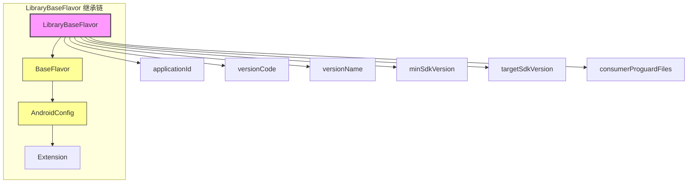
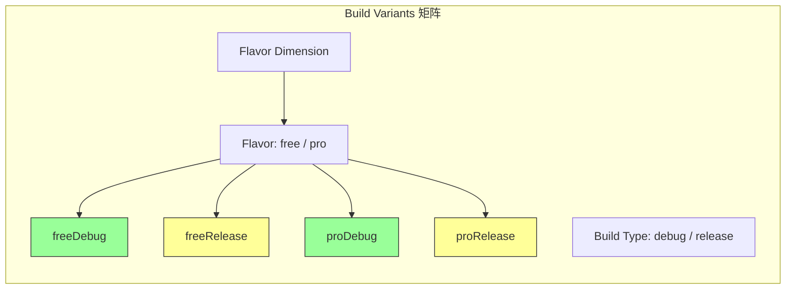
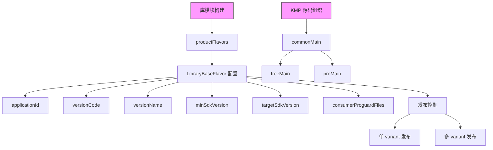
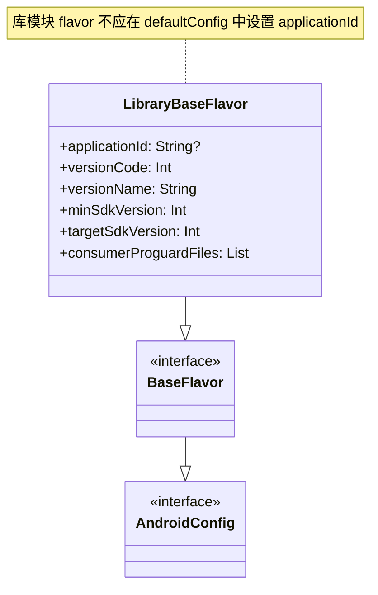

# 21.1.149 LibraryBaseFlavor

篝火已经烧到了稳定的阶段，不再像傍晚那样需要频繁添柴。橙红色的火苗安静地跳动着，把四个人的影子拉长投射到草地上。

洛芙把下巴搁在膝盖上，盯着屏幕发呆。刚才希尔给她看的那段代码——关于库模块资源打包的——她消化了大半，但总觉得自己还站在一扇门前，门槛这边是“你写不写配置”，门槛那边是“你怎么设计变体”。

“总觉得还缺点什么。”她轻声说。

伊莎把热可可的杯壁贴在脸颊上，感受那一点温热。

“缺的是‘如果我想给这个库做多个版本，怎么办’。”

洛芙立刻抬头：“对！就是这个问题。我们做 App 的时候可以有 debug、release、还有不同的 flavor——那库呢？库能不能也有？”

黛琳把笔记本往火堆方向拉了拉，屏幕的光映在她镜片上。

“这个问题问得好。我们今天要学的 `LibraryBaseFlavor`，就是回答它的。”

她调整了一下坐姿，让大家都看清屏幕。

“官方文档里，`LibraryBaseFlavor` 被定义为‘库模块产品风味的配置基接口’。先别被名字绕住——你可以把它想象成：你给一个库模块做‘口味’，每个口味可以有不同的应用 ID、版本号、SDK 版本等等。”

洛芙眨眨眼：“所以它类似于 app 模块的 productFlavor，但是用在 library 上？”

“对，但细节有差异。”黛琳点头，“先看这张图，了解它在 DSL 层级里的位置。图 1 对应代码片段 A 的第 5-20 行。”



“注意这里的关键点：`LibraryBaseFlavor` 继承自 `BaseFlavor`，而不是直接继承 `Extension`。”黛琳用笔尖指着图上的 `BaseFlavor` 说。

“`BaseFlavor` 是产品风味的标准抽象，它定义了所有风味都应该有的共同配置：应用 ID、版本号、SDK 版本、混淆文件、消费规则等等。库模块的风味接口复用这个抽象，所以它不是全新的设计，而是沿着已有的继承链往上加东西。”

希尔把代码片段 A 打开，摆在白板旁边。

```kotlin
// 代码片段 A（build.gradle.kts）
// 章节：LibraryBaseFlavor 基础配置示例

android {
    // 这里的 android {} 指向 LibraryExtension
    // LibraryExtension 内部会暴露 productFlavors {} 容器
    
    defaultConfig {
        // 这是 BaseFlavor 的默认实现
        // 对于库模块，applicationId 默认是 null（库不强制要求）
        // 但如果你要让消费者通过 maven 坐标消费，需要显式设
    }
    
    productFlavors {
        create("free") {
            // 免费版风味配置
            // 这个代码块的类型就是 LibraryBaseFlavor
            applicationId = "camp.lib.free"
            versionCode = 1
            versionName = "1.0.0-free"
            minSdk = 24
            targetSdk = 35
        }
        
        create("pro") {
            // 专业版风味配置
            applicationId = "camp.lib.pro"
            versionCode = 1
            versionName = "1.0.0-pro"
            minSdk = 24
            targetSdk = 35
            // 额外配置：只有 pro 版才有的功能
            consumerProguardFiles += "pro-rules.pro"
        }
    }
}
```

洛芙看了一会儿，提出问题：“库模块的应用 ID……我有点不太懂。库不是不安装到设备上的吗？为什么要应用 ID？”

黛琳嘴角微微上扬。

“问得好。库模块本身不安装，但它的产物——AAR 文件——会被其他 App 依赖。当这个 App 集成你的库时，应用 ID 会在几个地方出现：”

她伸出食指。

“第一，如果你的库需要运行时权限，或者需要声明组件（比如 Service、ContentProvider），这些组件的完整名称会用到应用 ID 作为包名前缀。第二，如果你把库发布到 Maven 仓库，消费者通过 `implementation` 引入时，实际上是引入了一个带有特定坐标的工件——虽然那时候看的是组 ID 和工件 ID，但库内部的 `applicationId` 仍然会影响它生成的资源 R 类的包名。”

伊莎补充道：“还有一点——如果你的库是一个混编库，里面有 Java 和 Kotlin 代码，有些场景下消费者需要知道库的包名结构。”

洛芙“哦”了一声，表示理解。

希尔这时候把笔记本转向大家，屏幕上是一个新写的构建脚本。

“先停一下，我来展示一个常见的错误。”她说，“好多人第一次配库模块 flavor 时会这样写。”

```kotlin
// 反模式示例 - 错误写法
android {
    defaultConfig {
        // 错误：库模块的 defaultConfig 中设置了 applicationId
        // 这在库模块中是不推荐的做法
        applicationId = "camp.lib.default"  // ← 不要这样做
    }
    
    productFlavors {
        create("free") {
            // 问题1：重复设置同样的 minSdkVersion
            minSdk = 21
            // 问题2：没有设置 versionCode 会导致构建警告
            // 问题3：targetSdkVersion 遗漏
        }
        
        create("pro") {
            // 问题4：自由版和专业版的代码没有通过 sourceSets 区分
            // 只是改了 ID 和版本，但实际代码是一样的
        }
    }
}
```

黛琳皱了下眉。

“希尔这个例子列出了四个常见问题。我们一个一个说。”

她从地上捡起一根小树枝，在地上画了四个圈。

“第一，库模块的 `defaultConfig` 里不要设 `applicationId`。库模块没有‘默认应用’这个概念——它被其他 App 消费时，应用 ID 由消费方决定。第二，flavor 里的 `minSdkVersion` 要统一管理，不要每个 flavor 都重复写。第三，每个 flavor 的 `versionCode` 要显式写，否则 AGP 会警告，而且如果你要发布到仓库，版本信息必须清晰。第四——也是最重要的一点——不同 flavor 之间必须有代码上的差异，否则设多个 flavor 就没有意义了。”

洛芙举手：“那代码差异怎么做？在 app 模块里是通过 sourceSets 对吧？库模块也一样吗？”

“对，一样。”黛琳把树枝扔进火堆，火星轻轻跳了一下。

“在库模块里，你可以通过 `sourceSets` 给不同的 flavor 配置不同的源码目录。但更常见的做法是通过 `buildFeature` 控制哪些编译选项开启，或者用 Kotlin Multiplatform 自己的 `sourceSets` 机制——因为我们现在是 KMP 项目，实际上你更可能是用 KMP 的平台特定源码目录，而不是 Android flavor 的 sourceSets。”

她切换到 KMP 项目的写法。

“看代码片段 B，这是我们在 KMP 库项目里配置 flavor 的正确方式。”

```kotlin
// 代码片段 B（build.gradle.kts - KMP 库模块 flavor 配置）
plugins {
    id("com.android.library")
    kotlin("multiplatform")
}

kotlin {
    android {
        // 这是 KotlinMultiplatformAndroidLibraryExtension
        // 继续往里走，才是我们要学的 flavor 配置
    }
    
    // KMP 的 sourceSets 配置
    sourceSets {
        val commonMain by getting
        val androidMain by getting
        
        // 免费版专有源码
        create("freeDebug") {
            dependsOn(androidMain)
        }
        create("freeRelease") {
            dependsOn(androidMain)
        }
        
        // 专业版专有源码
        create("proDebug") {
            dependsOn(androidMain)
        }
        create("proRelease") {
            dependsOn(androidMain)
        }
    }
}

// LibraryBaseFlavor 配置（在 android {} 块内）
android {
    // 这个 productFlavors 块的类型是 DomainObjectSet<LibraryBaseFlavor>
    productFlavors {
        create("free") {
            // 免费版：不需要特殊的 applicationId
            // 库模块的 applicationId 通常设为 null 或留空
            // 让消费方决定
            
            // versionCode 和 versionName 是必须的
            // 如果你不发布到 Maven，可以不关心 versionCode
            // 但如果发布，这两个必须有明确值
            versionName = "1.0.0"
            versionCode = 1
            
            // 最小 SDK 版本
            minSdk = 21
            // 目标 SDK 版本
            targetSdk = 35
            
            // 消费者混淆规则文件
            // 当消费方启用混淆时，这些规则会被应用
            consumerProguardFiles += listOf(
                "free-proguard-rules.pro"
            )
        }
        
        create("pro") {
            versionName = "1.0.0-pro"
            versionCode = 1
            minSdk = 21
            targetSdk = 35
            
            // pro 版可能有额外的混淆规则
            consumerProguardFiles += listOf(
                "pro-proguard-rules.pro"
            )
        }
    }
}
```

洛芙歪着头看了一会儿。

“等一下，我有个疑问。这个 `productFlavors` 是在 `android {}` 里面的，但 KMP 库还有 `kotlin {}` 里的 `android {}`——这两个分别控制什么？”

黛琳露出赞许的表情。

“你问到核心了。`kotlin {}` 里面的 `android {}` 是 `KotlinMultiplatformAndroidLibraryExtension`，它控制的是 KMP 特有的配置：编译目标、发布变体、源码集依赖。而外面这层 `android {}` 是标准的 `LibraryExtension`，它控制的是所有 Android 库都有的配置——包括 flavor、构建类型、签名、压缩策略等等。”

她停顿了一下，整理思路。

“用露营来打比方的话：`kotlin {}` 里的 `android {}` 像是‘我们这次带什么装备去露营’——帐篷、炊具、睡袋。而外面这层 `android {}` 像是‘我们这次露营用什么方式住’——住帐篷、住树屋、还是住酒店。flavor 就是‘住的方式’的不同版本。”

伊莎轻声笑了。

“黛琳的比喻越来越露营化了。”

“因为这样好记啊。”黛琳自己也笑了。

希尔把屏幕往下拉，展示下一个话题。

“说完了配置，再看一下变体维度的组合——这是很多人容易晕的地方。”



“在 Android 构建系统里，一个完整的变体是 Flavor 和 Build Type 的笛卡尔积。”希尔说，“对于我们的 KMP 库来说，product flavor 是 free 和 pro，build type 是 debug 和 release——所以总共会有四个变体：freeDebug、freeRelease、proDebug、proRelease。”

她切换到命令行输出。

“当你执行 `./gradlew assembleFreeRelease` 时，会触发 proRelease 这个变体的构建。构建日志里会显示具体的 variant name。”

```bash
# 构建 freeRelease 变体的日志示例
$ ./gradlew :lib:assembleFreeRelease

> Task :lib:compileFreeReleaseKotlinAndroid
e: Kotlin compiler for freeRelease variant
> Task :lib:bundleFreeReleaseAar
BUILD SUCCESSFUL in 5s
```

洛芙注意到日志里显示的是 `bundleFreeReleaseAar`，而不是 `assemble`。

“对，库模块的输出是 AAR，不是 APK。所以你看到的任务是 `bundle` 系列，而不是 `assemble` 系列。”

黛琳补充道。

“如果你的库有多个 flavor 和 build type，每个组合都会生成一个对应的 AAR 文件。这些 AAR 可以在本地仓库发布，或者通过 Maven 发布到远程仓库。”

“等等，那我怎么指定发布哪个 flavor？”洛芙问。

“这是个好问题。”希尔把一个配置文件展示给大家看。

“在库模块里，默认情况下，Gradle 会把所有的 flavor 都发布。但你可以通过 `publish` 块来控制发布行为。”

```kotlin
// 代码片段 C（控制 flavor 发布策略）
android {
    // ... productFlavors 配置 ...
    
    // 这里是 LibraryPublishingExtension
    // 控制哪些变体被发布到 Maven
    publishing {
        // 单个 flavor 发布配置
        singleVariant("free") {
            // 只发布 free flavor 的 release 版本
            // 避免 debug 版本进入发布仓库
            disable = false
        }
        
        // 或者使用 multipleVariants 发布多个
        multipleVariants {
            // 允许发布多个变体
            // 但注意：Maven 的版本号是唯一的
            // 所以同一个 versionCode/versionName 下
            // 多个 flavor 会导致坐标冲突
        }
    }
}
```

洛芙皱起鼻子。

“坐标冲突……也就是说，如果我想让 free 和 pro 都发布，必须给它们不同的 versionName？”

“对。”黛琳点头，“这就是为什么在代码片段 A 里，我给 free 和 pro 设了不同的 versionName：`1.0.0-free` 和 `1.0.0-pro`。这样在 Maven 仓库里它们是两个独立的版本，消费者可以按需选择。”

伊莎把杯子放下，杯子底部在草地上留下一个小圆圈。

“说了这么多，我帮你们整理一下思路。LibraryBaseFlavor 要学的东西其实很清晰——它就是 Android 库模块的产品风味配置接口，帮你定义库的不同版本。每个版本可以有不同的应用 ID、版本号、SDK 版本、混淆规则等等。库模块的 flavor 配置和 app 模块类似，但因为库是被消费的，所以有一些细微的差别需要注意：不要在 defaultConfig 里设 applicationId，要显式给每个 flavor 设 versionCode 和 versionName，不同 flavor 之间必须有实际的代码差异，还有记得控制发布行为避免版本冲突。”

洛芙长出一口气。

“今天好充实。先是 LibraryAndroidResources 搞定资源打包问题，现在是 LibraryBaseFlavor 搞定多版本问题。我觉得我现在可以去做一个同时有免费版和专业版的库了！”

希尔 grinned（露出灿烂的笑容）。

“别急，还有一个问题你得考虑——不同 flavor 之间共享代码的方式。我们刚才只是展示了基本的 flavor 配置，但实际工程中，你可能会遇到有些代码是免费的、有些是 pro 专有的、还有些是两边都有的。这个代码组织方式才真正考验架构能力。”

她把笔记本转回来，指着屏幕上的一段代码。

“在 KMP 项目里，推荐的做法是用 Kotlin 的可见性修饰符配合 sourceSets 来做这个区分。我们来快速看一下怎么写。”

```kotlin
// 代码片段 D（KMP 库模块中 flavor 代码组织示例）
// 在 build.gradle.kts 中配置 flavor 专属 sourceSets

kotlin {
    sourceSets {
        // 免费版专有代码
        val freeMain by creating {
            dependsOn(commonMain)
        }
        
        // 专业版专有代码
        val proMain by creating {
            dependsOn(commonMain)
        }
        
        // 公共代码已经在 commonMain 里
    }
}

// 在源码目录中组织：
// src/commonMain/kotlin/        → 免费版和专业版都能用
// src/freeMain/kotlin/          → 免费版专有（会自动依赖 commonMain）
// src/proMain/kotlin/           → 专业版专有（会自动依赖 commonMain）
// src/androidMain/kotlin/      → Android 平台代码（免费版和专业版都能用）
```

“这就是 KMP 的优雅之处。”黛琳说，“你不需要在 Java 的 sourceSets 里折腾半天，KMP 的 DSL 把这个过程简化了。commonMain 是基础，freeMain 和 proMain 各自扩展，各取所需。”

洛芙看着这段代码，若有所思。

“那如果我.freeMain 里想用 commonMain 的某个类，但是 proMain 想用一个增强版……怎么处理？”

“两种方式。”希尔回答，“一是通过接口+实现——commonMain 定义接口，freeMain 和 proMain 分别提供不同实现。二是通过 expect/actual 机制——KMP 的跨平台特性让这个更自然。”

她切换到 expect/actual 的示例。

```kotlin
// 代码片段 E（使用 expect/actual 做 flavor 区分）
// src/commonMain/kotlin/
expect class FeatureConfig() {
    fun isProEnabled(): Boolean
    fun getApiEndpoint(): String
}

// src/freeMain/kotlin/
actual class FeatureConfig {
    actual fun isProEnabled() = false
    actual fun getApiEndpoint() = "https://api.campfree.example.com"
}

// src/proMain/kotlin/
actual class FeatureConfig {
    actual fun isProEnabled() = true
    actual fun getApiEndpoint() = "https://api.camppro.example.com"
}
```

“这个写法很干净。”伊莎说，“expect 声明抽象，actual 提供具体。free 和 pro 各有各的实现，编译时自动选对应的那个。”

黛琳把白板翻到新的一页，画了一个简单的总结图。

“来，我们把今晚学的东西串起来。图 3 对应代码片段 B 的第 30-40 行。”



“总结一下今晚的要点。”黛琳说，“`LibraryBaseFlavor` 是库模块的 product flavor 配置接口，它让你可以为库创建不同的版本，每个版本可以有不同的应用 ID、版本号、SDK 版本和混淆规则。在 KMP 项目中，flavor 配置和 KMP 的 sourceSets 机制是分层的，各管各的。不同 flavor 之间的代码差异可以通过 KMP 的 expect/actual 机制来实现。最后，记得控制发布行为，避免版本坐标冲突。”

夜风轻轻吹过，把篝火的热气吹散了一些。洛芙裹紧外套，心里有一种踏实的感觉——今天学的这两个接口，像是给她打开了两扇门：一扇通向库的资源打包，另一扇通向库的多版本发布。

“谢谢大家。”她轻声说，“今晚的 campfire 课堂好充实。”

伊莎笑着揉了揉她的头发。

“还有更充实的在后头呢。库模块的变体配置只是开始，后面还有 dimension、variant filter、publishing more 之类的进阶内容。”

洛芙吐了吐舌头。

“听起来像是无尽模式。”

“对啊。”希尔 grinning（露出灿烂的笑容），“编程本来就是无尽模式。学会一个，还有下一个。露营也是如此——这座山翻过去，还有下一座。”

黛琳把笔记本合上，篝火的光在她眼里跳动。

“但翻过一座山，就会看到不一样的风景。这就是乐趣所在。”

---

## 专业技术总结

> LibraryBaseFlavor 是 Android 库模块中配置产品风味（product flavor）的 DSL 基接口，继承自 BaseFlavor。它定义了库模块不同构建变体的核心配置：applicationId、versionCode、versionName、minSdkVersion、targetSdkVersion、consumerProguardFiles 等。在 KMP（Kotlin Multiplatform）项目中，LibraryBaseFlavor 的配置与 KotlinMultiplatformAndroidLibraryExtension 的 sourceSets 配置分层管理，前者控制 Android 平台的变体配置，后者控制 KMP 特有的编译目标配置。多个 flavor 之间的代码差异可通过 KMP 的 expect/actual 机制或 sourceSets 依赖关系来实现。

---

#### 结构图



---

#### 反模式与陷阱

1. **在 defaultConfig 中设置 applicationId**：库模块的 applicationId 应由消费方决定，或在 flavor 中显式设置，避免在 defaultConfig 中设置导致冲突。

2. **flavor 缺少 versionCode/versionName**：不设置会导致 AGP 警告，且发布到 Maven 时必须明确版本信息。

3. **多个 flavor 发布时版本号相同**：免费版和专业版如果使用相同的 versionName，在 Maven 中会导致坐标冲突。解决方式是为不同 flavor 设置不同的 versionName 后缀。

4. **flavor 之间没有代码差异**：设置多个 flavor 但不区分代码是没有意义的，应通过 sourceSets 或 expect/actual 机制实现实际的代码差异。

---

#### 设计哲学

**产品风味分层管理**：Android 构建系统的 flavor 机制借鉴了软件工程中的“产品线工程”（Product Line Engineering）理念——同一套代码基，通过配置差异生成满足不同市场需求的产品变体。

**库模块的特殊性**：库模块作为被依赖的组件，其 flavor 配置比 app 模块更强调“消费者视角”。库的风味不是为了安装到设备，而是为了发布到不同的分发渠道或满足不同集成方的需求。

**KMP 的分层解耦**：在 KMP 项目中，Android flavor 配置（LibraryBaseFlavor）与 Kotlin 的多平台源码集配置（sourceSets）是正交的——前者负责 Android 平台的构建变体，后者负责跨平台代码的共享与差异。这种分层让架构更清晰，也避免了把“平台差异”和“产品差异”混为一谈。

---

#### 动手练习

**目标**：为 KMP 库模块配置免费版和专业版两个 flavor，并确保它们在代码层面有实际差异。

**你需要做的事**：

1. **创建 KMP 库模块项目**（或使用现有项目），确保已有 `commonMain`、`androidMain` 源码目录。

2. **在 build.gradle.kts 中配置 productFlavors**：
   ```kotlin
   android {
       productFlavors {
           create("free") {
               versionCode = 1
               versionName = "1.0.0-free"
               minSdk = 21
               targetSdk = 35
           }
           create("pro") {
               versionCode = 1
               versionName = "1.0.0-pro"
               minSdk = 24  // pro 版要求更高版本的 SDK
               targetSdk = 35
           }
       }
   }
   ```

3. **通过 sourceSets 实现 flavor 代码差异**：
   ```kotlin
   kotlin {
       sourceSets {
           val freeMain by creating { dependsOn(commonMain) }
           val proMain by creating { dependsOn(commonMain) }
       }
   }
   ```

4. **在 src/freeMain/kotlin/ 下创建免费版专属代码**（例如 `FreeFeature.kt`，包含仅免费版可用的功能或返回 false 的开关）。

5. **在 src/proMain/kotlin/ 下创建专业版专属代码**（例如 `ProFeature.kt`，包含专业版专有功能或返回 true 的开关）。

6. **使用 expect/actual 让公共代码调用 flavor 差异**：
   ```kotlin
   // commonMain
   expect fun isProEnabled(): Boolean
   
   // freeMain
   actual fun isProEnabled() = false
   
   // proMain  
   actual fun isProEnabled() = true
   ```

7. **构建验证**：执行 `./gradlew assembleFreeRelease` 和 `./gradlew assembleProRelease`，确认两个变体都能成功构建，并生成对应的 AAR 文件。

8. **检查产物**：在 `build/outputs/aar/` 目录下确认生成了 `lib-free-release.aar` 和 `lib-pro-release.aar`。

**验收标准**：

- [ ] 在 build.gradle.kts 中正确配置了 free 和 pro 两个 flavor
- [ ] 两个 flavor 的 versionName 不相同（避免发布冲突）
- [ ] 在 src/freeMain/ 和 src/proMain/ 下各有专属代码
- [ ] 使用 expect/actual 机制让 commonMain 代码可以调用 flavor 差异
- [ ] 执行 assembleFreeRelease 和 assembleProRelease 都成功
- [ ] 生成的 AAR 文件名体现了 flavor 区分

**提示**：

```kotlin
// build.gradle.kts 中的关键配置片段
kotlin {
    sourceSets {
        val freeMain by creating { dependsOn(commonMain) }
        val proMain by creating { dependsOn(commonMain) }
    }
}
```

---

#### 参考实现要点

1. 库模块 flavor 的 applicationId 通常设为 null 或留空，由消费方决定，除非有特定组件需要声明。

2. 不同 flavor 的 versionName 应有明确区分后缀（如 `-free`、`-pro`），避免 Maven 发布时版本冲突。

3. KMP 项目的 flavor 代码差异推荐使用 expect/actual 机制，而非传统的 sourceSets 路径映射，更符合 KMP 的设计理念。

4. 发布多个 flavor 时，使用 `publish` 块的 `singleVariant()` 或 `multipleVariants()` 控制发布行为，避免 debug 版本进入正式仓库。

5. flavor 的 minSdkVersion 可以不同（专业版可以要求更高版本），但 targetSdkVersion 应保持一致或合理递增。

---

> 技术是永远学不完的，但每一次学会一点，就能看到更远一点的风景。晚安， campfire 课堂明天继续。

## 🍹洛芙的小小日记本

今天学了两个很实用的东西：LibraryAndroidResources 搞定资源打包，LibraryBaseFlavor 搞定多版本发布。之前总觉得做库好简单，现在发现里面门道好多——flavor、variant、sourceSets、expect/actual……不过希尔说的对，无尽模式就是常态，翻过一座山还有下一座，但风景会越来越好看。晚安！

---

## 今日关键词

- **LibraryBaseFlavor**：Android 库模块的产品风味配置接口，继承自 BaseFlavor，用于定义不同构建变体的应用 ID、版本号、SDK 版本等核心配置。

- **productFlavors**：Gradle 构建系统中的产品风味机制，允许在同一代码基上创建不同配置的应用变体。

- **BaseFlavor**：产品风味的标准抽象基类，定义了所有风味都应该有的共同配置项。

- **applicationId**：应用的唯一标识符，在库模块中通常由消费方决定，或在 flavor 中显式设置。

- **versionCode**：应用的整数版本号，用于版本管理和更新判断。

- **versionName**：应用的字符串版本号，用于用户可见的版本展示。

- **consumerProguardFiles**：混淆规则消费文件，当消费方启用混淆时自动应用。

- **KotlinMultiplatformAndroidLibraryExtension**：KMP 项目的 Android 库目标配置接口，控制 KMP 特有的编译目标、发布变体和源码集。

- **expect/actual**：Kotlin Multiplatform 的条件编译机制，允许在同一代码接口下为不同平台或配置提供不同实现。

- **AAR**：Android Archive，Android 库模块的构建产物格式。

- **Maven 发布**：将库模块的 AAR 发布到 Maven 仓库，供其他项目通过坐标依赖引入。

- **variant**：构建变体，Flavor 和 Build Type 的笛卡尔积组合，如 freeDebug、proRelease。