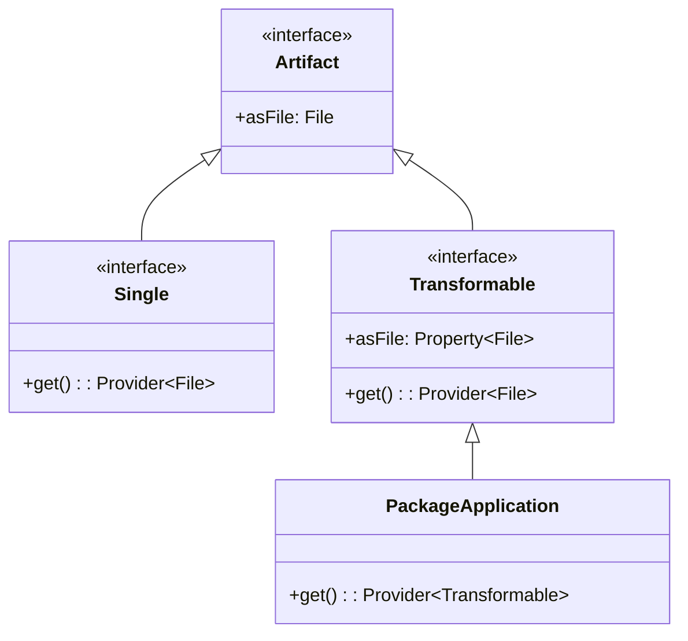

# 21.1.15 Artifact.Transformable - 可变形的构建魔法

夜已经深了。

帐篷里的夜灯投下暖黄色的光晕，在帆布内壁上映出四个女孩的剪影。黛琳刚刚讲完Artifact.Single的用法，洛芙正半信半疑地把玩着一块扁平的石头——那是黛琳用来比喻"单一输出"的道具。

"所以总结下来，"黛琳的声音在昏黄的光线里显得格外平静，"Single就是那种'一次成型'的宝贝。就像这块石头，你把它敲碎，它就彻底碎了，不可能再变回原来的样子。"

洛芙若有所思地点点头，正想把石头放回原位，伊莎突然开口了。

"那——如果我想要它不仅是一次性的，还能像黏土一样揉捏变形呢？"

黛琳愣了一下，随即嘴角浮现出一丝笑意。她从背包里又掏出一件东西——这次是一块银色的、表面微微起伏的金属片。

"问得好。"她把金属片放在手心，"伊莎，你记得我们上次做的那种可以折叠的野营餐具吗？"

"记得！"伊莎的眼睛亮了起来，"那种不锈钢的餐盘，可以折成一半又展开——"

"对。"黛琳轻轻捏了一下金属片的边缘，它竟然真的微微弯折了，"这就是我们今天要讲的东西——Artifact.Transformable。"

洛芙好奇地凑过去："咦？和刚才的石头不一样，这个可以变形？"

"不只是变形。"黛琳把金属片放在笔记本上，打开了一页新的白板，"Transformable是一种'可转换的构建产物'。它不像Single那样一次性生成就固定了，而是可以被后续的任务接住、加工、然后输出新的东西。"

---

希尔正在旁边整理数据线，听到这里抬起头来："等等，我有点晕。刚才的Single是'生成一个APK就完事了'的意思吗？那Transformable是'生成APK之后还能继续加工'？"

"对，就是这个意思。"黛琳在白板上画了一个简单的流程图，"比如我们有一个初始的APK文件，这是'原始产物'。有了Transformable，我们可以在它基础上做很多事情——"

她在白板上写了几行字：

- 添加加固/混淆
- 拆分Bundle
- 签名
- 生成多个渠道包

"这些操作都需要在原始APK的基础上进行二次处理。"黛琳总结道，"Transformable就是用来表达这种'可以被继续加工'的产物的接口。"

帐篷外传来一阵夜风吹过树叶的沙沙声。洛芙打了个哈欠，但眼睛依然亮晶晶的："那……具体怎么用呢？"

"来，我们上代码。"希尔已经打开了笔记本，"我之前正好写过类似的demo。"

---

## 从任务的角度看Transformable

希尔在键盘上敲了几下，屏幕上出现了一串代码。她把屏幕转过来，让大家都能看到。

```kotlin
// 这是一个自定义的Gradle任务，用于处理APK
abstract class ApkProcessorTask : DefaultTask() {

    // 声明输入：一个可转换的APK产物
    @get:InputArtifact
    abstract val inputApk: Provider<Transformable>

    // 声明输出：处理后的APK
    @get:OutputArtifact
    abstract val outputApk: Provider<Transformable>

    @TaskAction
    fun process() {
        // 获取原始APK文件
        val originalApk = inputApk.get().asFile.get()
        
        // 进行处理（比如加固、签名等）
        val processedApk = processApk(originalApk)
        
        // 设置输出
        outputApk.get().asFile.set(processedApk)
    }

    private fun processApk(input: File): File {
        // 这里是实际的处理逻辑
        // 例如：使用SDK加固、添加渠道信息、签名等
        return input
    }
}
```

洛芙盯着代码看了好几秒："这个`Transformable`……是之前`Artifact.Single`的那个'兄弟'吗？"

"聪明。"黛琳笑着点头，"它们都属于Android Gradle Plugin的Artifact API。区别在于：Single代表'一次性产物'，而Transformable代表'可转换产物'。"

"就像——"伊莎插话道，"Single是已经烤好的面包，只能直接端上桌；而Transformable是刚揉好的面团，可以做成面包、蛋糕、披萨？"

"这个比喻太贴切了！"希尔打了个响指。

---

## Transformable的内部结构

黛琳又在白板上画了起来。这次她画的是一个更大的流程图，展示了Transformable在实际构建中的位置。

```mermaid
graph TD
    A[源代码/资源] --> B[编译任务]
    B --> C[初始APK &#40;Transformable&#41;]
    C --> D[ApkProcessorTask]
    D --> E[处理后APK &#40;Transformable&#41;]
    E --> F[最终签名APK]
    
    G[Bundle任务] --> H[App Bundle &#40;Transformable&#41;]
    H --> I[BundleToolTask]
    I --> J[拆分APKs]
    
    style C fill:#e1f5fe
    style E fill:#e1f5fe
    style H fill:#e1f5fe
    style J fill:#c8e6c9
```



"看这张图。"黛琳指着中间的几个方框，"C是编译任务输出的初始APK，它是一个Transformable。D任务接收这个Transformable，处理后输出E——另一个Transformable。最后F才是最终签名的APK。"

"所以Transformable可以链式传递？"洛芙问。

"对，这就是它的强大之处。"黛琳点头，"每一个任务都可以'接住'前一个任务的输出，进行处理，然后'传出'新的产物。就像工厂流水线一样，每一站都在前一件产品的基础上加工。"

---

## 单变体vs多变体：Transformable的两种模式

希尔又敲了一行代码，调出了另一个示例：

```kotlin
// 场景1：单变体模式（Single Variant）
// 适用于只处理特定的构建变体

androidComponents {
    onVariants(selector().all()) { variant ->
        val packageApplication = variant.packageApplication
        
        // 获取该变体的APK作为Transformable
        val apkProvider: Provider<Transformable> = packageApplication.get()
        
        // 在此基础上添加自定义任务
        tasks.register("${variant.name}CustomProcessor", ApkProcessorTask::class.java) {
            inputApk.set(apkProvider)
            // ... 配置输出
        }
    }
}
```

"等等，这里有个新东西——`selector().all()`。"洛芙指着屏幕，"这是什么意思？"

"好问题。"黛琳解释道，"在Android Gradle Plugin中，Transformable的使用有两种常见模式："

"一种是像刚才那样，用`selector().all()`——这表示'所有变体的通用处理'。比如我们想给所有Debug和Release包都添加同样的渠道信息。"

"另一种呢？"伊莎问。

希尔切换到另一个代码片段：

```kotlin
// 场景2：单变体模式（Single Variant）
// 只针对特定的单个变体

androidComponents {
    onVariants(selector().withBuildType("release")) { variant ->
        // 只处理Release变体
        val releaseApk = variant.packageApplication.get()
        
        tasks.register("processReleaseApk", ApkProcessorTask::class.java) {
            inputApk.set(releaseApk)
        }
    }
}
```

"第二种是`selector().withBuildType("release")`——这叫'单变体模式'。"希尔补充道，"只针对特定的变体进行处理。比如Release包需要混淆加固，但Debug包不需要，就可以用这种方式区分。"

---

## 常见的Transformable类型

黛琳翻开笔记本的另一页："在实际使用中，Android Gradle Plugin提供了好几种常用的Transformable类型。我来列举一下——"

她边说边写：

| Transformable类型 | 用途 |
|------------------|------|
| `PackageApplication` | APK/AAB的打包产物 |
| `AndroidTestVariant` | Android测试应用的打包产物 |
| `UnitTestVariant` | 单元测试产物的处理 |

"其中最常用的就是`PackageApplication`。"黛琳说，"它代表了最终要安装到手机上的那个包。无论是APK还是App Bundle，都通过它来表示。"

"那——"洛芙举手提问，"如果我想在打包之后、加固之前这个窗口期做点什么，应该怎么获取这个Transformable？"

"很好的问题。"黛琳赞许地点头，"你需要使用`finalizedBy`或者在`onVariants`回调中访问`packageApplication`——它是自动按顺序执行的。"

她又在白板上写了一段伪代码：

```kotlin
// 完整的处理流程示例
androidComponents {
    onVariants(selector().all()) { variant ->
        // 1. 获取原始APK（Transformable）
        val originalApk = variant.packageApplication.get()
        
        // 2. 任务1：添加渠道信息
        val channelizedTask = tasks.register(
            "${variant.name}AddChannel", 
            AddChannelTask::class.java
        ) {
            inputApk.set(originalApk)
        }
        
        // 3. 任务2：加固处理（接住任务1的输出）
        val protectedTask = tasks.register(
            "${variant.name}Protect",
            ProtectApkTask::class.java
        ) {
            // 这里直接使用第一个任务的输出作为输入
            inputApk.set(channelizedTask.flatMap { it.outputApk })
        }
    }
}
```

---

## 反模式：滥用Transformable的陷阱

伊莎突然举起手："黛琳，我有个问题——Transformable这么好用，是不是可以一直链下去想接几个任务就接几个？"

黛琳的表情变得认真起来："当然不是。这就是我接下来要讲的——反模式。"

她在白板上写了一个"❌"标志：

**反模式1：过度链式调用**

```kotlin
// ❌ 错误示例：链了太多层
val task1 = tasks.register("step1", Task1::class) { ... }
val task2 = tasks.register("step2", Task2::class) {
    input.set(task1.flatMap { it.output })
}
val task3 = tasks.register("step3", Task3::class) {
    input.set(task2.flatMap { it.output })
}
// ... 链了十几层

// 问题：构建时间急剧增加，调试困难
```

"每一层Transformable都会增加构建时间。"黛琳说，"如果链太多层，你的CI/CD可能会慢到让人崩溃。"

**反模式2：在Transformable中执行耗时操作**

```kotlin
// ❌ 错误示例：在APK处理任务中做网络请求
@TaskAction
fun process() {
    val apk = inputApk.get().asFile.get()
    
    // ❌ 不要在任务中做网络请求！
    val serverConfig = httpClient.fetch("https://example.com/config")
    
    // 处理...
}
```

"Gradle任务应该是确定性的。"黛琳强调，"不要在任务里访问网络、读取不确定的文件，或者做其他可能导致构建不可复现的事情。"

**反模式3：忘记声明输入输出**

```kotlin
// ❌ 错误示例：没有正确标注@InputArtifact和@OutputArtifact
abstract class BadTask : DefaultTask() {
    // ❌ 缺少@InputArtifact
    lateinit var inputApk: File
    
    // ❌ 缺少@OutputArtifact  
    lateinit var outputApk: File
    
    @TaskAction
    fun process() { ... }
}
```

"Gradle的任务缓存机制依赖于正确的输入输出声明。"希尔补充道，"没有这些注解，你的任务每次都会重新执行，即使输入没变。"

---

## 重构示例：从混乱到清晰

"说了这么多反模式，我们来看看一个好的实践应该是什么样的。"希尔调出了一个完整的示例项目。

**重构前（混乱版本）：**

```kotlin
// ❌ 一股脑把所有逻辑塞在一个任务里
tasks.register("buildAndProcess", DefaultTask::class) {
    doLast {
        // 编译
        exec { commandLine("./gradlew", "assembleRelease") }
        
        // 混淆
        exec { commandLine("java", "-jar", "proguard.jar", "app.apk") }
        
        // 签名
        exec { commandLine("apksigner", "sign", "--ks", "key.jks", "app-aligned.apk") }
        
        // 渠道
        exec { commandLine("java", "-jar", "channelizer.jar", "app-signed.apk") }
    }
}
```

**重构后（使用Transformable）：**

```kotlin
// ✅ 清晰的任务链
androidComponents {
    onVariants(selector().withBuildType("release")) { variant ->
        // 任务1：混淆
        tasks.register<ProguardTask>("${variant.name}Proguard") {
            inputApk.set(variant.packageApplication.get())
            // 配置混淆规则
        }.let { proguardTask ->
            
            // 任务2：签名（接住任务1的输出）
            tasks.register<SignTask>("${variant.name}Sign") {
                inputApk.set(proguardTask.flatMap { it.outputApk })
                keystore.set(file("release.keystore"))
            }.let { signTask ->
                
                // 任务3：添加渠道（接住任务2的输出）
                tasks.register<ChannelTask>("${variant.name}AddChannel") {
                    inputApk.set(signTask.flatMap { it.outputApk })
                    channels.set(listOf("official", "beta", "test"))
                }
            }
        }
    }
}
```

"看，重构后的版本——"黛琳指着屏幕说，"每个任务只做一件事，通过Transformable连接。构建缓存可以正常工作，任务也可以并行执行。"

---

## 实战：创建一个APK处理器

希尔新建了一个完整的示例项目："来，我们来写一个真正可用的APK处理器。"

```kotlin
// 文件：build.gradle.kts（模块级）

plugins {
    id("com.android.application")
}

// 1. 定义处理任务
abstract class ApkProcessorTask : DefaultTask() {

    @get:InputArtifact
    abstract val inputApk: Provider<Transformable>

    @get:OutputArtifact
    abstract val outputApk: Provider<Transformable>

    @get:Input
    abstract val channelName: Property<String>

    @TaskAction
    fun process() {
        val inputFile = inputApk.get().asFile.get()
        val outputFile = inputFile.resolveSibling(
            "app_${channelName.get()}.apk"
        )

        // 复制文件（实际场景中可以添加渠道信息）
        inputFile.copyTo(outputFile, overwrite = true)

        // 设置输出
        outputApk.get().asFile.set(outputFile)
        
        println("✅ APK处理完成: ${outputFile.name}")
    }
}

// 2. 在Android组件中使用
androidComponents {
    onVariants(selector().withBuildType("release")) { variant ->
        // 获取原始APK
        val originalApk = variant.packageApplication.get()
        
        // 注册处理任务
        tasks.register<ApkProcessorTask>("${variant.name}AddChannel") {
            inputApk.set(originalApk)
            channelName.set("my_channel")
        }
    }
}
```

希尔运行了一下，终端输出：

```
> Task :app:releaseAddChannel
✅ APK处理完成: app_my_channel.apk
BUILD SUCCESSFUL in 5s
```

"成功了！"洛芙拍着手，"这就是Transformable的用法——接住APK，处理它，然后输出新的APK。"

---

帐篷外的星空依然明亮。伊莎轻轻出了一口气："原来Android构建系统里有这么多门道。"

"这才哪到哪。"黛琳笑着收起白板，"Transformable只是Artifact API的一部分。还有更多类型等我们去探索呢。"

洛芙仰头看向帐篷顶，夜灯的光晕在帆布上摇曳。她想着今天的知识——Single是不可变的石头，而Transformable是可塑的金属片。

"黛琳，"她轻声说，"那如果我想让构建出来的APK能被后续任务随时取用，应该用哪个呢？"

"好问题。"黛琳躺回睡袋里，"Single是一次性的，Transformable是可链式的——但如果你想要一个'固定的锚点'，那我们下次来讲Artifact.LastKnown。"

"听起来像是'记忆面包'？"伊莎笑着问。

"差不多吧。"黛琳微微一笑，"它是Gradle记住的'最后一次成功的构建产物'。"

夜风轻拂，蝉鸣声不知什么时候已经渐渐弱了下去。露水在草叶上凝结得更多了，在星光下闪着微光。四个女孩相继入眠，期待着明天的露营新发现。

---

## 专业技术总结

> 本章核心技术机制定义：**Artifact.Transformable** 是 Android Gradle Plugin 提供的一种构建产物接口，代表"可被后续任务转换的产物"。与 Artifact.Single 不同，Transformable 可以在构建过程中被多个任务链式处理（输入→处理→输出），常用于 APK 加固、签名、渠道打包等场景。

#### 结构图



#### 复杂度与影响

- **构建时间**：每增加一层 Transformable 链式调用，构建时间会相应增加（任务依赖链变长）
- **缓存效率**：正确使用 @InputArtifact/@OutputArtifact 可启用 Gradle 构建缓存，大幅提升增量构建速度
- **并行性**：独立的 Transformable 任务可以并行执行，提高多核CPU利用率

#### 反模式与陷阱

1. **过度链式调用**：链太多层会导致构建时间剧增，建议将可合并的操作合并
2. **任务中执行网络请求**：破坏构建确定性，影响缓存和CI/CD稳定性
3. **忘记声明输入输出**：缺少 @InputArtifact/@OutputArtifact 导致任务无法缓存
4. **在主线程执行耗时操作**：Transformable 任务应在后台线程执行，避免阻塞 Gradle

#### 设计哲学

- **单一职责**：每个任务只做一件事，通过链式组合实现复杂功能
- **可组合性**：Transformable 设计鼓励任务的模块化和复用
- **声明式配置**：通过 DSL 声明式地定义任务依赖，而非命令式调用

#### 动手练习

**目标**：创建一个Gradle插件，自动为Release APK添加自定义元数据。

**Task 1：创建Gradle插件项目**
- 目标：搭建一个可编译的Gradle插件模块
- 步骤：
  1. 在项目中新建 `buildSrc` 或独立插件模块
  2. 创建 `AndroidManifest.xml` 声明插件
  3. 实现 `Plugin<Project>` 接口
- 验收标准：
  - [ ] 插件可以成功apply到app模块
  - [ ] 运行 `./gradlew tasks` 能看到自定义任务

**Task 2：定义APK处理任务**
- 目标：创建处理APK的Transformable任务
- 步骤：
  1. 创建继承 `DefaultTask` 的抽象类
  2. 添加 `@get:InputArtifact` 标注的 `Transformable` 属性
  3. 添加 `@get:OutputArtifact` 标注的输出属性
  4. 实现 `@TaskAction` 方法
- 验收标准：
  - [ ] 任务能成功获取输入APK
  - [ ] 任务能输出处理后的APK
  - [ ] 运行任务不报错

**Task 3：集成到Android组件**
- 目标：在Release变体上触发处理任务
- 步骤：
  1. 在插件的 `apply` 方法中使用 `androidComponents`
  2. 使用 `selector().withBuildType("release")` 筛选变体
  3. 将 `variant.packageApplication.get()` 传给任务输入
- 验收标准：
  - [ ] 运行 `./gradlew assembleRelease` 自动触发处理任务
  - [ ] 输出目录能看到处理后的APK

**Task 4：添加自定义元数据**
- 目标：在APK中添加渠道标识和自定义字段
- 步骤：
  1. 使用 ZipFile API 打开APK
  2. 在 `META-INF/` 目录下添加渠道文件（如 `channel_official.txt`）
  3. 保存修改后的APK
- 验收标准：
  - [ ] 输出的APK包含自定义渠道文件
  - [ ] 使用 `unzip -l` 能看到新增文件

**Task 5：配置化与扩展**
- 目标：让渠道名称可配置
- 步骤：
  1. 添加 `extension` 类定义配置属性
  2. 在 `build.gradle` 中使用自定义插件并配置渠道
  3. 任务读取配置属性
- 验收标准：
  - [ ] `build.gradle` 能配置 `channel = "beta"`
  - [ ] 不同配置生成不同的渠道APK

**Task 6：测试与调试**
- 目标：确保任务正确执行
- 步骤：
  1. 添加日志输出
  2. 使用 `--info` 查看详细执行流程
  3. 验证输出APK的签名未被破坏
- 验收标准：
  - [ ] 日志清晰显示处理步骤
  - [ ] 输出的APK可以正常安装

**Task 7：性能优化**
- 目标：利用Gradle缓存加速构建
- 步骤：
  1. 确保输入输出正确标注
  2. 运行两次构建，对比时间
  3. 使用 `--build-cache` 验证缓存命中
- 验收标准：
  - [ ] 第二次构建显示 "FROM-CACHE"
  - [ ] 构建时间明显缩短

**Task 8：发布插件**
- 目标：将插件发布到本地或远程仓库
- 步骤：
  1. 配置 `maven-publish`
  - 验收标准：
  - [ ] 插件可以被其他项目引用

#### 面试热身

- Q1: 请解释 Artifact.Transformable 和 Artifact.Single 的区别，以及各自的适用场景。
- Q2: 在使用 Transformable 时，如何确保 Gradle 构建缓存正常工作？
- Q3: 如果你需要对一个 APK 进行多次处理（加固→签名→渠道），如何设计任务链？
- Q4: 列举至少3个使用 Transformable 的常见错误（反模式），并说明如何避免。
- Q5: Android Gradle Plugin 中的 "Variant" 是什么？它与 Transformable 有什么关系？

#### 参考实现要点

1. **优先使用 Transformable 链式处理**，而非在一个任务中完成所有操作
2. **正确标注 @InputArtifact 和 @OutputArtifact**，确保构建缓存生效
3. **使用 selector().withBuildType() 或 selector().all()** 控制作用范围
4. **避免在任务中执行网络请求或访问不确定的文件**
5. **复杂场景下考虑使用 WorkManager** 而非自定义 Gradle 任务（但两者解决不同问题）

> 学习建议：理解 Transformable 的关键是理解"构建产物"的概念——它不是简单的文件，而是 Gradle 构建系统中可以被追踪、管理和转换的对象。建议先动手写一个简单的 APK 处理任务，感受它与传统文件操作的区别。

---

## 洛芙的小小日记本

今天学到了Transformable！黛琳说它就像可塑的金属片，可以被后续任务不断加工。我们写了代码，还看了反模式的例子——过度链式调用会让构建变得超慢。看来写代码真的要思考清楚了再动手呢，不是越多越好呀。🌙

---

## 今日关键词

- **Artifact.Transformable**：Android Gradle Plugin 中的构建产物接口，表示可被后续任务转换的产物
- **Artifact.Single**：与 Transformable 对应，表示一次性、不可变的产物
- **Provider~T~**：Gradle 中延迟求值的容器，用于在配置阶段引用尚未计算的值
- **@InputArtifact**：Gradle 任务注解，标记任务的输入产物
- **@OutputArtifact**：Gradle 任务注解，标记任务的输出产物
- **onVariants**：Android Gradle Plugin 的回调，用于对每个构建变体执行操作
- **selector()**：Android Gradle Plugin 的选择器，用于筛选特定的构建变体
- **withBuildType()**：selector 的方法，用于按构建类型筛选（如 "release"）
- **packageApplication**：Variant 的属性，返回 APK/AAB 的打包产物（Transformable）
- **TaskAction**：Gradle 任务注解，标记任务执行的主逻辑
- **DefaultTask**：Gradle 的基础任务类，自定义任务的父类
- **Property~T~**：Gradle 的可配置属性容器，支持延迟赋值
- **构建缓存（Build Cache）**：Gradle 的缓存机制，存储任务输出以加速后续构建
- **增量构建**：只重新执行有变化的任务的构建方式，提升构建速度
