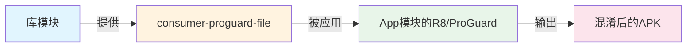
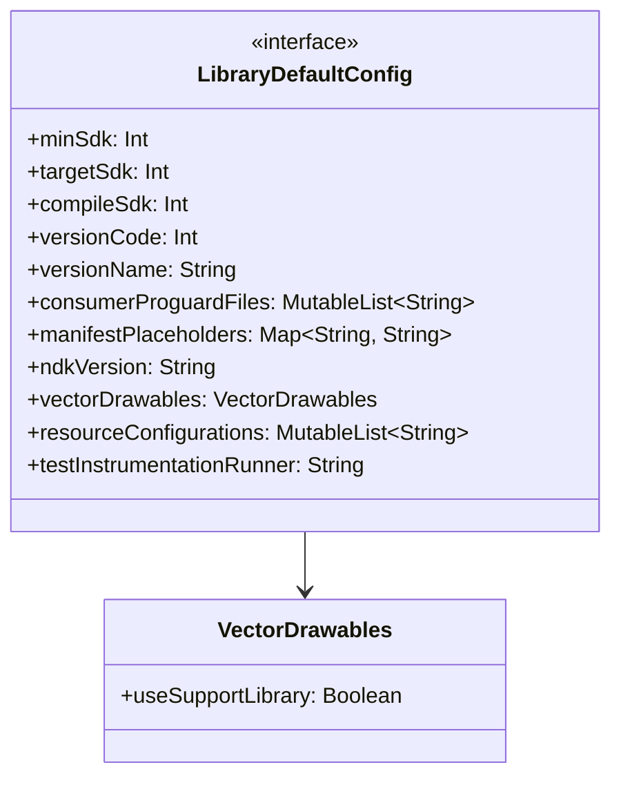
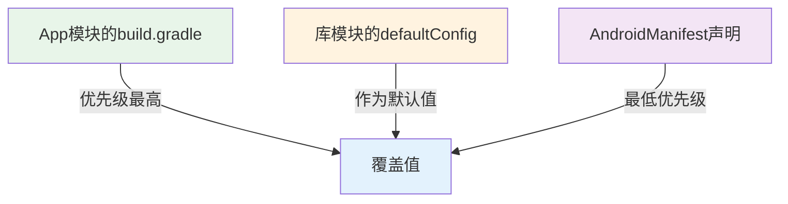
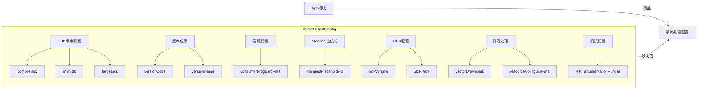

# 21.1.151 LibraryDefaultConfig

夜色渐深，湖面上的薄雾越来越浓，像给整个露营地盖上了一层轻纱。洛芙裹紧了自己的外套，看着黛琳从背包里又掏出了一个文件夹。

"等等，"洛芙眼睛一亮，"昨天我们学了LibraryBuildFeatures，今天是不是该学怎么配置库的具体行为了？"

黛琳微笑着点点头："聪明。今天我们要学的，是LibraryDefaultConfig——库默认配置。"她打开文件夹，里面是一张画着各种开关和滑块的图纸，"如果说BuildFeatures是控制库模块有哪些功能开关，那DefaultConfig就是设置这些功能的默认参数。"

"就像......"伊莎歪着头想了想，"就像是露营装备的清单？帐篷要多大、睡袋要多厚、炉头要用哪种规格——这些是基本配置？"

"比喻得漂亮！"黛琳打了个响指，"在Android库模块里，我们要配置的默认参数包括：最小SDK版本、目标SDK版本、混淆文件、NDK版本、资源处理方式等等。这些配置会作为库模块的默认值，传递给它所有的消费者。"

希尔已经迫不及待地打开了笔记本："那我们就开始吧！先从最基础的SDK版本配置开始——这可是每个Android项目都会遇到的问题。"

---

### SDK版本三兄弟：compileSdk、minSdk、targetSdk

"在讲DefaultConfig之前，我们得先弄清楚Android SDK的三个版本概念，"黛琳在白板上画了三个阶梯状的方框，"compileSdk、minSdk、targetSdk，它们三个各司其职。"

"我记得这个！"洛芙举手，"compileSdk是编译时用的SDK对吧？就像是......我们去图书馆查资料，能查到的最齐全的资料库？"

"这个比喻很形象，"黛琳笑了，"compileSdk决定了你在编译时能使用哪些API——它就像是你能查阅的图书上限，版本越高，能用的新API越多，但相应的编译环境要求也越高。"

"minSdk呢？"洛芙追问。

"minSdk是最小支持版本，"黛琳在最低的那个方框上画了一条线，"就像是你的露营营地最低海拔要求——低于这个海拔的地方，你的装备就不一定能正常工作。在Android里，如果用户的设备系统版本低于minSdk，你的应用可能无法运行或者会出现兼容问题。"

伊莎补充道："那targetSdk就是中间的那个——目标版本？像是我们计划这次露营要达到的海拔高度？"

"对的，"黛琳点点头，"targetSdk是一个'目标'概念，它告诉系统：我主要是为这个版本设计的。系统会根据targetSdk来调整一些兼容行为。比如在Android 12上，如果你的targetSdk是31及以下，某些新特性可能不会启用；如果升级到32或更高，就会启用对应的行为变更。"

希尔在笔记本上敲了几行代码：

```kotlin
// 在build.gradle (module级别) 中配置
android {
    compileSdk = 34  // 编译时使用的SDK版本
    
    defaultConfig {
        minSdk = 24  // 最小支持版本（用户设备必须>=24才能安装）
        targetSdk = 34  // 目标版本（主要兼容这个版本的行为）
        
        // 版本号和版本名
        versionCode = 1
        versionName = "1.0.0"
        
        // 测试 instrumentation runner
        testInstrumentationRunner = "androidx.test.runner.AndroidJUnitRunner"
    }
}
```

"这段代码看起来好眼熟！"洛芙凑过去看，"这不就是我们之前在项目里经常见到的配置吗？"

"没错，"黛琳说，"这就是LibraryDefaultConfig的核心部分。在库模块的build.gradle里，我们用defaultConfig来设置这些默认参数。这些值会成为库的默认配置，但app模块可以覆盖它们。"

---

### consumerProguardFiles：谁该背这个锅？

"接下来我们聊聊混淆文件，"黛琳翻到新的一页白板，"这个问题在库模块里特别有意思。"

"混淆？"洛芙眨眨眼，"是把代码变得面目全非的那个混淆吗？"

"对，"黛琳点点头，"ProGuard/R8混淆可以把你的代码缩短、加密、重命名，让逆向工程更困难。但在库模块里，谁来负责混淆规则，可就是个问题了。"

希尔解释道："这里有个'消费者'的概念——consumer ProGuard files。库模块的混淆规则，应该由使用这个库的app来应用，还是库自己来提供？答案是：库提供规则，消费者应用规则。"

"就像是......"伊莎组织着语言，"露营时的垃圾分类？每个人产生的垃圾自己带走处理？但库这个'公共设施'产生的垃圾，要交给使用它的app来处理？"

"这个比喻虽然有点......"希尔忍不住笑了，"但意思对了！库模块的代码会被混淆，但它不知道使用它的app会有什么样的混淆规则，所以库应该提供一份默认的混淆规则文件（proguard-rules.pro），而实际的混淆工作由app模块的构建系统来完成。"

黛琳在白板上画了一个简单的流程图：



"看这张图，"黛琳指着说，"库模块通过consumerProguardFiles把自己编写好的混淆规则提供给app模块。App模块在构建时会自动使用这些规则——前提是app模块没有自己覆盖这个配置。"

希尔又在笔记本上写了起来：

```kotlin
android {
    defaultConfig {
        // 库模块提供的混淆规则文件
        // 这些规则会在app模块构建时自动被应用
        consumerProguardFiles("consumer-proguard-rules.pro")
        
        // 也可以指定多个规则文件
        consumerProguardFiles("proguard-rules.pro", "proguard-android-optimize.txt")
    }
}
```

"等等，"洛芙举手提问，"如果app模块也想加自己的混淆规则呢？"

"好问题！"黛琳笑了，"app模块可以用自己的proguardRules来添加额外规则，或者直接覆盖consumerProguardFiles。优先级是：app自己的规则 > 库的consumer规则。"

---

### manifestPlaceholders：注入的魔法药水

"接下来是一个很有用的功能——manifestPlaceholders，"黛琳神秘地笑了笑，"你可以把它理解为在构建时向AndroidManifest注入变量的魔法。"

"变量？像环境变量一样？"洛芙好奇地问。

"差不多道理，"黛琳点点头，"manifestPlaceholders允许你在build.gradle里定义一些键值对，然后在AndroidManifest.xml中通过占位符来使用它们。这在库模块里特别有用——比如库需要知道使用它的app的名字、或者需要动态配置的权限等。"

希尔举了个例子："比如你的库需要知道app的应用ID（applicationId），就可以这样配置："

```kotlin
android {
    defaultConfig {
        // 定义manifest占位符
        manifestPlaceholders += [
            appName: "MyApp",
            appIcon: "@mipmap/ic_launcher",
            // 库可以从这里读取app的applicationId
            applicationId: "${applicationId}"
        ]
    }
}
```

"然后在AndroidManifest.xml里这样用："

```xml
<!-- AndroidManifest.xml -->
<application
    android:name="${appName}"
    android:icon="${appIcon}">
    
    <!-- 库中的组件可能需要知道app的ID -->
    <meta-data
        android:name="CONSUMER_APP_ID"
        android:value="${applicationId}" />
</application>
```

伊莎轻拍手掌："这就像是我们在露营前给每个帐篷贴上标签——帐篷的名字、里面住的是谁、有什么特殊需求。这样等大家到了营地，不用再口头说明，标签就一目了然了！"

"而且最棒的是，"黛琳补充道，"不同的build variant可以有不同的placeholder值。比如debug版本用一套配置，release版本用另一套——这在多渠道打包时特别方便。"

---

### vectorDrawables和其他资源处理

"还有几个配置也很重要，"黛琳翻到白板的新页，"比如vectorDrawables的使用支持。"

"矢量图？"洛芙问。

"对，"黛琳解释说，"矢量图可以缩放不失真，能减少APK体积。但早期的Android系统不支持矢量图，需要额外库的支持。通过defaultConfig，我们可以统一设置库模块对矢量图的支持策略。"

```kotlin
android {
    defaultConfig {
        // 是否支持矢量Drawable
        // 设为true时，系统会自动处理兼容性问题
        vectorDrawables.useSupportLibrary = true
        
        // 资源版本（用于多版本资源的区分）
        resourceConfigurations += listOf("en", "zh-rCN", "zh-rTW")
    }
}
```

"这里的vectorDrawables.useSupportLibrary = true特别有意思，"希尔补充道，"它告诉构建系统：'嘿，这个库用了矢量图，如果系统版本不支持，你要帮我用support library来处理啊！'这样就不需要库的使用者额外添加依赖了。"

黛琳点点头："没错！这就是库模块的体贴之处——它把兼容性问题都处理好了，使用它的人只需要专注于自己的业务逻辑。"

---

### ndkVersion与ABI筛选

"最后我们聊聊NDK相关的配置，"黛琳的语气变得稍微严肃了一些，"NDK允许我们用C/C++编写部分代码，在性能敏感的场景下很有用。"

"我听说游戏开发经常用NDK！"洛芙说。

"对，"黛琳说，"在库模块里，我们可以通过defaultConfig设置默认的NDK版本和ABI筛选器。"

```kotlin
android {
    defaultConfig {
        // NDK版本
        ndkVersion = "26.1.10909125"
        
        // ABI筛选器：指定库支持哪些CPU架构
        //常见值：armeabi-v7a, arm64-v8a, x86, x86_64
        ndk {
            abiFilters += listOf("armeabi-v7a", "arm64-v8a")
        }
        
        // 外部Native库
        // 如果库自带.so文件，可以这样指定
        ndk {
            ldLibs += listOf("log", "android", "OpenSLES")
        }
    }
}
```

"ABI这个概念怎么理解呢？"伊莎问道。

"ABI是Application Binary Interface的缩写，"黛琳解释道，"你可以理解为CPU指令集的'方言'。不同的手机CPU用不同的方言：有的用armeabi（32位ARM），有的用arm64-v8a（64位ARM），还有的用x86（Intel/AMD的移动处理器）。"

"所以abiFilters就是......"

"对，就是告诉构建系统：这个库支持哪些'方言'。如果你只设置了armeabi-v7a和arm64-v8a，那x86架构的手机就无法使用这个库的原生代码部分——可能会导致崩溃，也可能会回退到Java实现（如果有的话）。"

洛芙若有所思："那是不是支持的ABI越多越好？"

"理论上是这样，"希尔接过话题，"但每个ABI都会增加APK体积。一个arm64-v8a的.so文件可能比armeabi-v7a的大一倍。所以通常我们会根据目标用户的设备分布来选择——比如只支持arm64-v8a，因为现在主流手机都是64位了。"

---

### 完整的LibraryDefaultConfig示例

黛琳把白板整理了一下，画出一个完整的配置结构：



"这张图展示了LibraryDefaultConfig的主要成员，"黛琳解释道，"记住这个结构，你在阅读任何库的build.gradle时都能快速理解它的默认配置。"

希尔把完整的示例代码打了出来：

```kotlin
android {
    // 编译SDK版本
    compileSdk = 34
    
    // 库模块的默认配置
    defaultConfig {
        // 基础SDK配置
        minSdk = 24
        targetSdk = 34
        
        // 版本信息
        versionCode = 100
        versionName = "1.2.3"
        
        // 混淆规则（由消费者应用）
        consumerProguardFiles("proguard-rules.pro")
        
        // Manifest占位符
        manifestPlaceholders += [
            appName: "@string/app_name",
            channel: "default_channel"
        ]
        
        // NDK配置
        ndkVersion = "26.1.10909125"
        ndk {
            abiFilters += listOf("armeabi-v7a", "arm64-v8a")
        }
        
        // 矢量图支持
        vectorDrawables.useSupportLibrary = true
        
        // 资源语言筛选
        resourceConfigurations += listOf("en", "zh-rCN")
        
        // 测试配置
        testInstrumentationRunner = "androidx.test.runner.AndroidJUnitRunner"
        
        // 测试应用ID（库模块的测试app）
        testApplicationId = ".test"
        testVersionCode = 1
        testVersionName = "1.0-test"
    }
}
```

"这段代码好长啊！"洛芙感叹道，"但看起来每个部分都很清晰。"

"这就是DefaultConfig的意义——把所有默认配置集中在一起，"黛琳说，"而且因为是DSL接口，代码写起来非常直观。就像是给露营列清单一样，每一项都写得明明白白。"

---

### 库与App的 配置优先级

"最后我要强调一个重要概念，"黛琳的表情变得认真起来，"库模块的defaultConfig只是'默认值'，app模块可以覆盖它们。"

她画了一个简单的优先级图：



"优先级顺序是：App模块的显式配置 > 库模块的defaultConfig > AndroidManifest中的默认值。"黛琳总结道，"这意味着库模块应该提供合理的默认值，但不要假设这些值不会被覆盖。"

洛芙长舒一口气："感觉学到了好多！原来一个简单的库配置里有这么多门道。"

"这就是Android构建系统的魅力，"希尔合上笔记本，"它把复杂的构建过程抽象成了优雅的DSL，让我们能像写配置文件一样轻松管理项目。"

夜已经深了。湖面上的雾气渐渐散去，露出了满天繁星。伊莎仰头看了一会儿，轻声说："星星也是分层次的——有的亮有的暗，有的远有的近。就像我们学的这些配置，有的必须，有的可选，有的可以被覆盖。"

"好了，今天就到这里吧，"黛琳收拾着白板，"明天我们继续深入，看看还有什么有趣的构建知识。"

---

> 技术总结

**LibraryDefaultConfig** 是 Android Gradle DSL 中用于配置库模块默认设置的接口。它允许开发者统一管理库模块的 SDK 版本、混淆规则、资源处理、NDK 配置等关键参数。这些默认值会传递给库的使用者（消费者 app），但可以被 app 模块的配置覆盖。

#### 结构图



#### 反模式与陷阱

1. **minSdk设置过低**  
   - 陷阱：为了覆盖更多用户，将minSdk设得很低，导致无法使用新API，只能写兼容代码，增加维护成本  
   - 修复：根据目标用户分布合理设置，优先使用support library处理兼容性问题

2. **混淆规则未分离**  
   - 陷阱：库模块没有提供consumerProguardFiles，导致使用时需要手动配置规则，容易出错  
   - 修复：库模块应主动提供proguard-rules.pro，并通过consumerProguardFiles声明

3. **ABI筛选不当**  
   - 陷阱：设置了过多ABI导致APK体积过大，或设置了不支持目标用户设备的ABI导致崩溃  
   - 修复：根据目标市场选择合适的ABI，主流手机可只支持arm64-v8a

4. **vectorDrawables未启用兼容支持**  
   - 陷阱：使用了矢量图但未设置useSupportLibrary = true，在低端设备上无法正常显示  
   - 修复：在defaultConfig中设置 vectorDrawables.useSupportLibrary = true

5. **manifestPlaceholders未考虑多渠道**  
   - 陷阱：占位符值写死， 不同build variant需要不同值时需要手动修改  
   - 修复：使用buildConfigField或productFlavors来动态设置占位符

#### 设计哲学

库模块的默认配置设计遵循以下原则：

1. **提供合理的默认值**  
   - 库应该设置保守的minSdk（如21或24），确保大多数设备兼容  
   - 提供完整的consumerProguardFiles，让使用者无需关心混淆细节

2. **不假设消费者行为**  
   - 默认配置应该可以被覆盖  
   - 关键参数（如applicationId）可以通过占位符让app动态注入

3. **兼容性与性能平衡**  
   - NDK版本和ABI筛选需要权衡兼容性和APK体积  
   - 矢量图支持应该启用library support，避免低端设备显示问题

4. **测试友好**  
   - 提供testInstrumentationRunner等测试相关配置  
   - 确保库的测试用例可以在消费者环境中正常运行

#### 动手练习

**目标**：理解并实践LibraryDefaultConfig的配置

**你需要做的事**：

1. 创建一个新的Android库模块（File → New → New Module → Android Library）
2. 打开库的build.gradle文件
3. 在defaultConfig块中添加以下配置：
   - 设置minSdk = 26，targetSdk = 34
   - 添加consumerProguardFiles配置（创建proguard-rules.pro文件并添加简单规则）
   - 添加manifestPlaceholders配置
   - 设置vectorDrawables.useSupportLibrary = true
4. 创建一个app模块来使用这个库
5. 观察app模块如何继承或覆盖库的配置

**验收标准**：

- [ ] 库模块的defaultConfig包含至少5个配置项
- [ ] 创建了proguard-rules.pro文件并在consumerProguardFiles中引用
- [ ] manifestPlaceholders可以正确传递到AndroidManifest
- [ ] app模块可以成功引用库模块
- [ ] 构建产物（aar）包含正确的配置信息

**提示代码**：

```kotlin
// 库模块的build.gradle
android {
    namespace = "com.example.mylibrary"
    compileSdk = 34
    
    defaultConfig {
        minSdk = 26
        targetSdk = 34
        versionCode = 1
        versionName = "1.0"
        
        consumerProguardFiles("proguard-rules.pro")
        
        manifestPlaceholders += [channel: "library_channel"]
        
        vectorDrawables.useSupportLibrary = true
        
        testInstrumentationRunner = "androidx.test.runner.AndroidJUnitRunner"
    }
}
```

#### 面试热身

1. 请解释minSdk、targetSdk、compileSdk三者的区别和作用
2. 为什么库模块需要consumerProguardFiles？它和app模块自己的混淆规则是什么关系？
3. manifestPlaceholders有什么实际应用场景？请举例说明
4. 如果你想让库支持所有主流CPU架构，应该如何配置abiFilters？需要考虑哪些因素？
5. vectorDrawables.useSupportLibrary = true的作用是什么？什么时候需要启用？

#### 参考实现要点

1. **SDK版本选择**：优先设置保守的minSdk（如24或26），targetSdk跟随最新的稳定版，compileSdk通常与targetSdk一致
2. **混淆规则**：库模块应提供基础的混淆规则（如保留R类、viewbinding类、native方法等），但不要添加应用特定的规则
3. **ABI筛选**：根据目标用户设备分布选择ABI，主流可只保留arm64-v8a以减小体积
4. **资源处理**：使用矢量图时务必启用useSupportLibrary = true，避免兼容问题
5. **测试配置**：确保testInstrumentationRunner正确配置，以便库的测试用例可以在app环境中运行

> 学习建议

学习LibraryDefaultConfig时，建议结合实际的Android项目来理解。可以先创建一个包含app模块和库模块的多模块项目，观察不同配置如何影响最终的构建产物。理解"库提供默认值、app可以覆盖"这个核心原则非常重要。

---

## 洛芙的小小日记本

今天学到了LibraryDefaultConfig！原来库模块的build.gradle里有这么多配置——SDK版本、混淆规则、manifest占位符、NDK版本......黛琳说这些都会作为默认值传递给使用库的app，但app可以自己覆盖。突然觉得构建系统好温柔啊，就像一个贴心的学姐，把能帮我们想到的都想到了。

---

## 今日关键词

- **LibraryDefaultConfig**：Android Gradle DSL接口，用于配置库模块的默认设置
- **compileSdk**：编译时使用的SDK版本，决定可用API的上限
- **minSdk**：最小支持版本，低于此版本的设备无法安装应用
- **targetSdk**：目标版本，主要兼容行为参考此版本
- **consumerProguardFiles**：库提供的混淆规则，由消费者app应用
- **manifestPlaceholders**：构建时注入到AndroidManifest的占位符变量
- **vectorDrawables**：矢量图支持，useSupportLibrary用于兼容处理
- **abiFilters**：ABI筛选器，指定支持的CPU架构
- **ndkVersion**：NDK工具链版本
- **testInstrumentationRunner**：Android测试框架运行器
- **resourceConfigurations**：资源语言/配置筛选器
