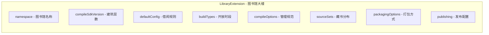
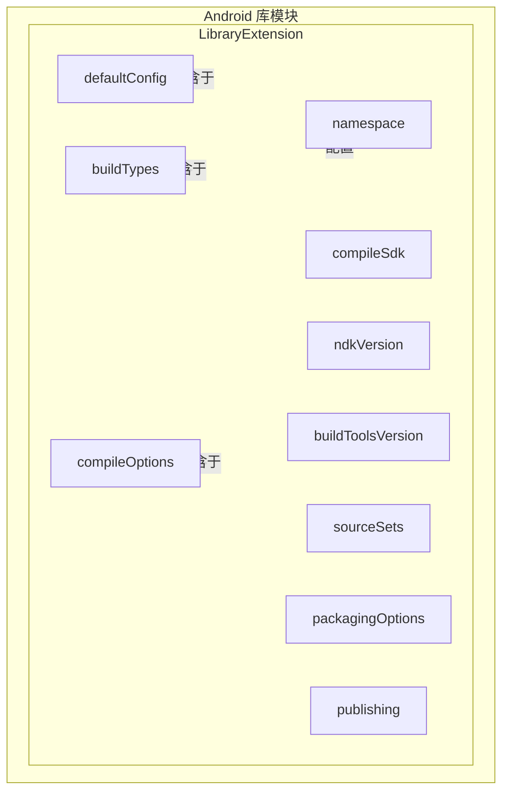

清晨的第一缕阳光穿过薄雾，懒懒地落在帐篷顶上。

洛芙是被鸟叫声叫醒的。她钻出睡袋，揉了揉眼睛，发现其他三人已经起来了。黛琳坐在一块平整的大石头上，膝盖上放着笔记本电脑；伊莎正在整理她的背包，把里面的东西一件件拿出来又放回去；希尔则在湖边弯腰不知道在干什么。

“洛芙！起来了！”希尔朝她挥手，“昨天那个配置还没讲完呢，黛琳说LibraryExtension还有好多东西要教我们。”

洛芙伸了个懒腰，清晨的空气凉丝丝的吸进肺里，让人精神一振。她走过去在黛琳旁边坐下，发现屏幕上还是昨天的build.gradle文件。

“我把整个模块配置想成一座图书馆，”黛琳轻轻敲了敲键盘，“LibraryDefaultConfig是图书馆的借阅规则——规定了谁能进来、能借什么书。而LibraryExtension呢？它是图书馆本身，是包含借阅规则的那栋楼。”

“图书馆本身？”洛芙歪着头想了想，“那里面除了借阅规则，还有什么？”

“多了去了，”黛琳把笔记本转过来，指着屏幕上的代码，“你看，这是我们昨天写的defaultConfig，但它只是LibraryExtension里的一个子块。”

```groovy
android {
    // LibraryExtension 的根配置块
    namespace 'com.example.mylibrary'
    
    // 编译 SDK 版本——图书馆建在几层楼
    compileSdk 34
    
    // 默认配置块——借阅规则
    defaultConfig {
        minSdk 21
        targetSdk 34
        testInstrumentationRunner "androidx.test.runner.AndroidJUnitRunner"
    }
    
    // 构建类型——图书馆的不同开放时段
    buildTypes {
        release {
            minifyEnabled true
            proguardFiles getDefaultProguardFile('proguard-android-optimize.txt'), 'proguard-rules.pro'
        }
        debug {
            applicationIdSuffix ".debug"
            debuggable true
        }
    }
    
    // 编译选项——图书管理员的工作规范
    compileOptions {
        sourceCompatibility JavaVersion.VERSION_17
        targetCompatibility JavaVersion.VERSION_17
    }
    
    // 资源配置——图书馆的藏书分类
    sourceSets {
        main {
            java.srcDirs += 'src/main/kotlin'
            resources.srcDirs += 'src/main/res'
        }
    }
}
```

伊莎把一缕被晨风吹乱的头发拨到耳后，“我以前学建筑的时候，老师说设计一座图书馆要考虑很多方面：有多少藏书、开放时间多长、采用什么管理系统……这些都像LibraryExtension里的不同配置。”

“Exactly！”希尔从湖边走回来，裤腿还沾着水珠，“我就说伊莎最会打比方了。洛芙，我问你，如果我们要去图书馆借书，需要知道哪些事情？”

洛芙想了想，“嗯……图书馆在哪儿，开门了吗，我要借什么书，最多能借几本，借多久？”

“对了！”希尔打了个响指，“图书馆在哪儿——这就像compileSdkVersion，告诉我们要用哪个版本的API来编译。开门了吗——这是buildTypes，是debug还是release模式。要借什么书——这是defaultConfig里的targetSdk，决定我们的库能运行在哪些设备上。”

“原来是这样……”洛芙点头，“那剩下的buildTypes、compileOptions、sourceSets都是图书馆的不同方面？”

黛琳露出赞许的微笑，“对。LibraryExtension就像一个容器，把所有这些配置项装在一起。我们可以把它想象成一座图书馆，而defaultConfig、buildTypes、compileOptions都是图书馆的不同部门。”

她打开一个新的标签页，画出一个结构图：



“原来有这么多部门啊……”洛芙感叹道。

“还不止呢，”黛琳继续往下翻，“这只是常用的几个，还有很多可以配置的项目。”

她指着屏幕上一个新出现的代码块：

```groovy
android {
    // 命名空间——图书馆的名称
    namespace 'com.example.mylibrary'
    
    // NDK 版本——图书馆用的特殊建筑材料
    ndkVersion "26.1.7913441"
    
    // 构建工具版本——图书馆的建造工具包
    buildToolsVersion "34.0.0"
    
    // 打包选项——书籍如何装箱
    packagingOptions {
        resources {
            excludes += '/META-INF/{AL2.0,LGPL2.1}'
        }
    }
    
    // 源集配置——藏书分布在哪些书架
    sourceSets {
        main {
            manifest.srcFile 'src/main/AndroidManifest.xml'
            java.srcDirs += 'src/main/kotlin'
            aidl.srcDirs += 'src/main/aidl'
            res.srcDirs += 'src/main/res'
            assets.srcDirs += 'src/main/assets'
        }
    }
    
    // 发布配置——图书馆如何对外开放
    publishing {
        singleVariant("release")
    }
}
```

洛芙看着这些配置，有些晕，“这么多东西，都要记住吗？”

“不需要一次记住全部，”伊莎温柔地说，“就像我们去图书馆借书，也不需要知道图书馆是怎么管理的，只需要知道怎么找书、怎么借就好了。这些配置也是一样的——先用最基础的，需要的时候再深入。”

希尔点点头，“对，先把defaultConfig、buildTypes、compileOptions这三个常用的配好，其他的需要什么再加什么。黛琳说得对，这就像图书馆的不同部门，我们先了解最常用的几个就行。”

黛琳指着代码，继续讲解compileOptions的作用，“这个是编译选项，就像图书馆的工作规范——用什么语言写借书卡、采用什么分类法。它主要影响我们写的代码如何被编译成机器能读懂的形式。”

```groovy
compileOptions {
    // 源代码兼容性——使用什么版本的Java编写
    sourceCompatibility JavaVersion.VERSION_17
    
    // 目标代码兼容性——编译成什么版本的字节码
    targetCompatibility JavaVersion.VERSION_17
    
    // 是否启用核心库desugaring（让旧版Android也能用新API）
    coreLibraryDesugaringEnabled true
}
```

“这个coreLibraryDesugaringEnabled是做什么的？”洛芙好奇地问。

“这个问题问得好，”黛琳赞许地说，“你知道为什么有些新API在旧版Android上不能用吗？”

“因为旧版Android没有这些API？”

“对，就像一个旧图书馆没有电脑管理系统。但如果我们想让旧图书馆也能用上电脑管理系统，怎么办？”

伊莎接口道，“在旧图书馆里放一套模拟系统？”

“对！coreLibraryDesugaring就是给旧版Android提供的一套'模拟系统'，”黛琳解释，“它允许我们在minSdk 21的设备上使用minSdk 24才有的API，比如java.time里的时间处理类。”

“原来是这样！”洛芙恍然大司，“那我们写库的时候就可以用最新的API，同时还能支持旧的Android版本？”

“Exactly！”希尔兴奋地说，“这就是库模块的好处——我们可以在这里用一些新特性，然后通过desugaring让旧的设备也能跑。”

黛琳又打开另一个标签页，展示buildTypes的配置：

```groovy
buildTypes {
    // 发布构建——正式的借书流程
    release {
        // 是否启用混淆
        minifyEnabled true
        
        // 混淆规则文件
        proguardFiles getDefaultProguardFile('proguard-android-optimize.txt'), 'proguard-rules.pro'
        
        // 是否签名（库模块通常不签名）
        signing null
        
        // 生成的APK名称后缀
        archiveSuffix ".release"
    }
    
    // 调试构建——试运行阶段
    debug {
        // 应用ID后缀（让调试版本和正式版本共存）
        applicationIdSuffix ".debug"
        
        // 是否可调试
        debuggable true
        
        // 是否包含调试信息
        jniDebugBuild true
    }
}
```

洛芙注意到一个问题，“为什么release里没有applicationIdSuffix？”

“因为库模块不生成APK，”黛琳解释，“库模块最终会被打包成AAR文件，供其他app使用。所以release构建主要是用来发布到Maven仓库的，不需要applicationIdSuffix。”

“原来是这样！”洛芙点头。

希尔突然想到了什么，“对了，我们昨天学的LibraryDefaultConfig其实是LibraryExtension的一部分，对吧？”

“对，你理解得很准确，”黛琳微笑着说，“LibraryDefaultConfig是LibraryExtension里的一个子配置块，专门用来设置库的默认配置。它们的关系就像……”

“图书馆和图书馆的借阅规则！”伊莎笑着说。

“对！图书馆包含借阅规则，借阅规则是图书馆的一部分。”黛琳总结道。

洛芙看着屏幕上的结构图，若有所思地说，“所以我们学完了LibraryDefaultConfig，现在又在学LibraryExtension，感觉就像从借阅规则开始，然后了解整个图书馆是怎么运作的。”

“完全正确！”希尔说，“来，我给你画一个更完整的图！”



“原来defaultConfig、buildTypes、compileOptions都是LibraryExtension的一部分啊！”洛芙感叹道。

黛琳点点头，“对，LibraryExtension是整个库模块配置的根入口，它把所有的配置项组织在一起。我们可以通过android{}块来访问它的所有属性。”

她又在屏幕上敲了几个代码，展示了sourceSets的配置：

```groovy
sourceSets {
    // 主源码集
    main {
        // AndroidManifest 位置
        manifest.srcFile 'src/main/AndroidManifest.xml'
        
        // Java/Kotlin 源码目录
        java.srcDirs += 'src/main/kotlin'
        
        // AIDL 源码目录
        aidl.srcDirs += 'src/main/aidl'
        
        // 资源目录
        res.srcDirs += 'src/main/res'
        
        // assets 目录
        assets.srcDirs += 'src/main/assets'
        
        // JNI 库目录
        jniLibs.srcDirs += 'src/main/jniLibs'
    }
    
    // 测试源码集
    androidTest {
        java.srcDirs += 'src/androidTest/kotlin'
    }
    
    // 单元测试源码集
    test {
        java.srcDirs += 'src/test/kotlin'
    }
}
```

“这个sourceSets是做什么的？”洛芙问。

“想象一下，”伊莎轻声说，“图书馆有不同的藏书区——小说区、科普区、儿童区……每类书放在不同的地方。sourceSets就是告诉构建系统：我们的代码、資源、JNI库都放在哪里。”

“原来是这样！”洛芙恍然，“那我们就能把代码分门别类地放好，构建系统也能准确地找到它们。”

“对，”黛琳说，“而且sourceSets还支持自定义测试源码集，让我们能把单元测试和集成测试的代码分开存放，这样就不容易搞混。”

希尔补充道，“更重要的是，这样可以让我们的项目结构更清晰。main是给用户用的代码，androidTest是集成测试代码，test是单元测试代码——各司其职，互不干扰。”

洛芙看着湖面，太阳已经完全升起来了，金色的阳光洒在水面上，波光粼粼。她忽然意识到一个问题：

“黛琳，那我有一个问题——如果我们在一个大项目里有多个库模块，每个库模块都需要这些配置吗？”

“这是个好问题！”黛琳点点头，“在多模块项目中，每个库模块确实都有自己的LibraryExtension配置。但是有些配置是可以继承的——比如compileSdkVersion，如果我们统一设置在根项目的gradle里，子模块就可以直接使用。”

“也就是说，图书馆可以统一规定'建筑层数'，下面的各部门就不用重复设置了？”洛芙问。

“对就是这个意思，”黛琳笑着说，“而且这样还有个好处——如果我们要改建筑层数，只需要改一个地方，所有图书馆都能自动更新。”

伊莎轻轻补充道，“这就像中央图书馆统一管理所有分馆的规则，既高效又不会出错。”

黛琳最后展示了一个完整的库模块build.gradle示例：

```groovy
plugins {
    id 'com.android.library'
    id 'org.jetbrains.kotlin.android'
}

android {
    namespace 'com.example.awesomelibrary'
    compileSdk 34
    
    defaultConfig {
        minSdk 21
        targetSdk 34
        testInstrumentationRunner "androidx.test.runner.AndroidJUnitRunner"
        
        // 消费者配置——告诉使用这个库的app需要什么
        consumerProguardFiles 'consumer-rules.pro'
    }
    
    buildTypes {
        release {
            minifyEnabled true
            proguardFiles getDefaultProguardFile('proguard-android-optimize.txt'), 'proguard-rules.pro'
        }
        debug {
            debuggable true
        }
    }
    
    compileOptions {
        sourceCompatibility JavaVersion.VERSION_17
        targetCompatibility JavaVersion.VERSION_17
    }
    
    kotlinOptions {
        jvmTarget = '17'
    }
    
    sourceSets {
        main {
            java.srcDirs += 'src/main/kotlin'
        }
    }
}

dependencies {
    implementation 'androidx.core:core-ktx:1.12.0'
    testImplementation 'junit:junit:4.13.2'
    androidTestImplementation 'androidx.test.ext:junit:1.1.5'
}
```

“哇，终于看到一个完整的例子了！”洛芙说。

“对，这就是一个典型的库模块配置，”黛琳总结道，“从namespace到dependencies，所有东西都配置好了。我们以后写库模块的时候，都可以参考这个结构。”

希尔打了个哈欠，“好了，知识点讲完了！接下来我们去吃早餐吧，我带的压缩饼干还有好几包呢！”

伊莎笑着收拾起白板，“希尔就知道吃。不过洛芙，今天学的这些都记住了吗？”

洛芙点点头，又摇摇头，“记住了大概，但这么多配置项，肯定需要的时候再查。”

“这就对了，”黛琳温柔地说，“我们不需要一次记住所有东西，只需要知道它们在哪里就可以了。就像图书馆，我们不需要记住每一本书在哪里，但需要知道怎么找书。”

晨风吹过湖面，带来一阵清爽的气息。远处的山轮廓清晰，天空蓝得像被水洗过一样。洛芙深吸了一口气，感觉学到了好多新东西。

---

> 学习建议：LibraryExtension是Android库模块配置的根DSL，理解它与子配置块（defaultConfig、buildTypes、compileOptions等）的关系是关键。建议先掌握最常用的三个配置块，其他配置可以在需要时再查阅官方文档。

## 洛芙的小小日记本

今天黛琳讲完了图书馆（LibraryExtension）！原来defaultConfig、buildTypes、compileOptions都是它里面的不同部门。伊莎打的比方好棒——图书馆的借阅规则、借书时间、管理规范……一下子就记住了！希尔说明天要教我们怎么发布自己的库到Maven，好期待呀～

---

## 今日关键词

**LibraryExtension**：Android Gradle插件中用于配置库模块（android.library）的DSL根接口，包含namespace、compileSdk、defaultConfig、buildTypes、compileOptions、sourceSets等配置块。

**namespace**：库的包名标识，类似于图书馆的名称，用于唯一标识这个库。

**compileSdkVersion**：编译目标SDK版本，决定库能使用哪些API，相当于图书馆的建筑层数。

**defaultConfig**：库的默认配置块，设置最小SDK、目标SDK等默认属性，是LibraryExtension的子配置块。

**buildTypes**：构建类型配置块，定义debug和release两种构建变体，相当于图书馆的开放时段。

**compileOptions**：编译选项配置块，指定Java版本兼容性等编译规范。

**sourceSets**：源集配置块，定义源码和资源的目录结构，相当于图书馆的藏书分布。

**publishing**：发布配置块，控制库如何发布到Maven仓库。

**packagingOptions**：打包选项配置块，控制AAR文件的打包方式。

**coreLibraryDesugaring**：核心库desugaring，允许在旧版Android上使用新API的技术。

**ndkVersion**：NDK版本配置，指定使用哪个版本的Native Development Kit。

**buildToolsVersion**：构建工具版本，指定使用的Android构建工具包版本。

**minifyEnabled**：是否启用代码混淆，用于release构建类型。

**applicationIdSuffix**：应用ID后缀，用于debug构建类型以区分正式版本。

**debuggable**：是否可调试，指示生成的APK是否包含调试信息。
