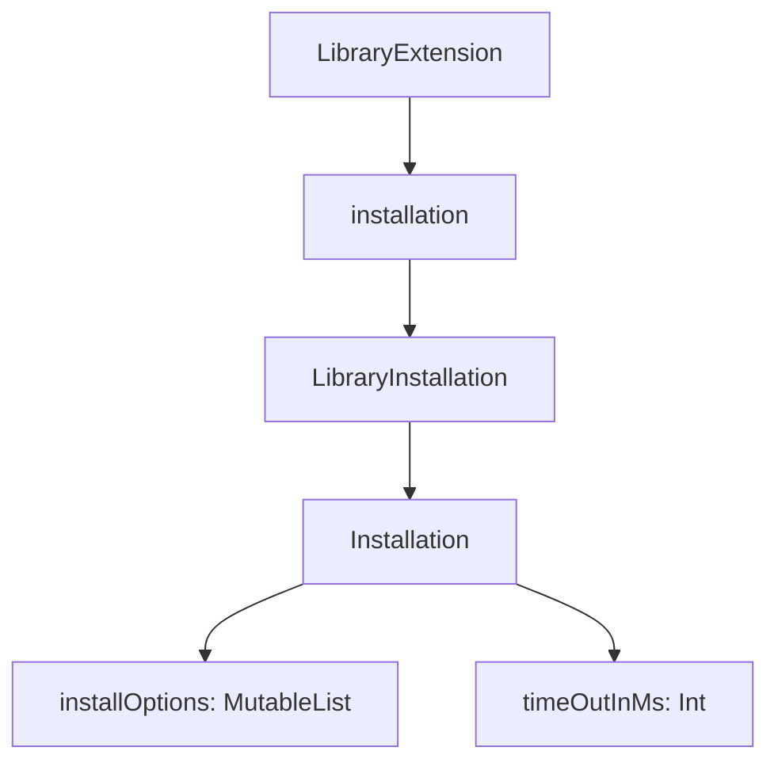
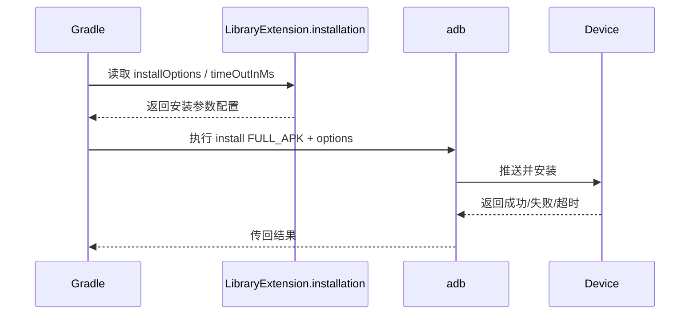
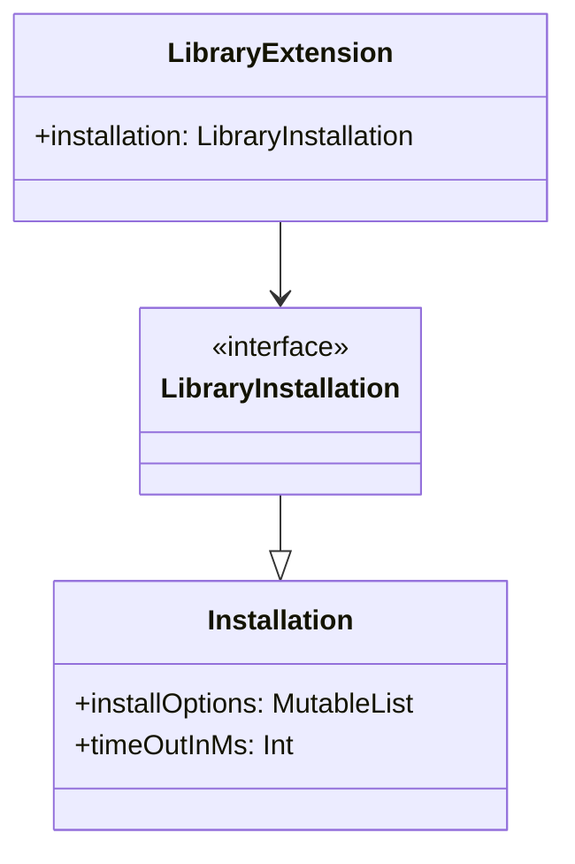

湖边的雾已经退到林子深处了。

希尔把便携炉的火拧小，金属壶里发出细细的“咕噜”声。她没抬头，先把终端窗口转给洛芙看。屏幕上是刚结束的一次构建安装日志，最后一行红得很刺眼：`INSTALL_FAILED_TIMEOUT`。

“又超时？”洛芙皱起鼻尖，“昨天不是已经能跑起来了吗？”

“能跑，不等于稳。”黛琳把白板架在折叠椅上，语气很平，“我们昨天在 `LibraryExtension` 看的是入口。今天要看入口里这个小开关：`installation`。”

伊莎把纸杯递给洛芙，杯壁暖暖的。“你可以把它当成‘安装阶段的操作台’。不是决定你写什么功能，而是决定你把产物推到设备上时，系统怎么执行。”

洛芙捧着杯子点头：“所以不是业务代码，是构建与安装行为的配置？”

“对。”黛琳在白板上写下第一行：`LibraryInstallation : Installation`。

“官方定义很短，”她说，“`LibraryInstallation` 是给 Library 插件配置安装选项的 DSL 对象；它通过 `LibraryExtension.installation` 访问；核心是继承自 `Installation` 的两个属性：`installOptions` 和 `timeOutInMs`。”

希尔打了个响指：“短定义，长事故。我们现在就把这两个字段讲透。”

洛芙盯着白板：“先问最傻的问题——‘继承’在这里是什么意思？”

黛琳笑了一下：“好问题。继承就是‘拿到上一级已经定义好的能力’。`LibraryInstallation` 自己没再发明一套参数，而是沿用 `Installation` 里已有的安装参数模型。”

她画出第一张图。



“图 1 对应代码片段 A（第 65-86 行）。”黛琳用笔尖点了点图，“你会看到我们怎么在 `library { installation { ... } }` 里直接设置这两个属性。”

希尔已经把代码敲出来了。

```kotlin
// 代码片段 A（图 1 对应，行 65-86）
// build.gradle.kts (library module)
plugins {
    id("com.android.library")
    kotlin("android")
}

android {
    namespace = "com.example.camp.library"
    compileSdk = 34

    defaultConfig {
        minSdk = 24
    }

    installation {
        // adb install FULL_APK 时附加的参数列表
        // 示例：-r 覆盖安装，-d 允许降级，-g 自动授予运行时权限（仅调试场景谨慎使用）
        installOptions.addAll(listOf("-r", "-d"))

        // 所有 adb 操作的超时时间（毫秒）
        timeOutInMs = 120_000
    }
}
```

洛芙看完，眼睛亮了一点：“欸，真就两个核心旋钮。”

“是，但每个旋钮都能把你拧进坑里。”希尔把终端往下滚，“先看坏味道版本。”

她打开旧分支配置。

```kotlin
// 反模式：安装参数散落、超时值硬编码且不统一
android {
    installation {
        installOptions.add("-r")
    }
}

tasks.register("installDebugLike") {
    doLast {
        // 到处散落的命令参数，难以追踪
        exec {
            commandLine("adb", "install", "-r", "-g", "build/outputs/apk/debug/app-debug.apk")
        }
    }
}

// 另一个脚本里还写了不同超时
System.setProperty("adb.timeout", "30000")
```

洛芙立刻皱眉：“这也太分裂了……一个在 DSL，一个在 task，一个在系统属性。”

“对，这就是我们今天要修的第一个问题：配置源不唯一。”黛琳说。

伊莎把白板翻到新页：“第二个问题是不可预期。你在 A 模块 120 秒，B 脚本 30 秒，最后谁生效，排查要半天。”

希尔接着贴重构后版本。

```kotlin
// 重构后：统一由 installation DSL 管理安装行为
android {
    installation {
        // 只保留当前团队认可的参数
        installOptions.clear()
        installOptions.addAll(listOf("-r"))

        // 统一调试设备超时策略
        timeOutInMs = 90_000
    }
}

// 自定义任务不再内嵌 adb 参数，转为读取统一配置
abstract class PrintInstallConfigTask : DefaultTask() {
    @TaskAction
    fun run() {
        val ext = project.extensions.getByName("android")
        println("Use android.installation as single source of truth: $ext")
    }
}
```

“这里先不演示内部类型强转细节，”黛琳补充，“重点是工程习惯：安装参数统一从 DSL 出发，不在十个角落重复定义。”

洛芙吸了口气：“所以重构目标不是‘写更炫代码’，而是让排障路径缩短。”

“答对。”

风从湖面吹过来，帐篷边的小旗子啪地抖了一下。

希尔把第二张图画成时序图：“你最关心的其实是‘一次安装到底怎么走’。”



“图 2 对应代码片段 B（第 152-196 行）。”她说，“我们等会儿用测试输出把每一步映射出来。”

洛芙突然想到：“`installOptions` 是 `MutableList<String>`，那是不是意味着顺序也有影响？”

黛琳点头：“是。它是可变列表，不是集合。你加参数时要注意可读性与顺序一致性，避免今天 `-r -d`、明天 `-d -r`，日志 diff 会变难看。”

“那 `timeOutInMs` 用 Int，会不会溢出？”洛芙追问。

“理论上 Int 上限约 21 亿毫秒，够大。实际工程别设置离谱值。太小会误判失败，太大会掩盖真问题。”

伊莎把笔记本转过来：“我做了一个小实验。三组超时：15 秒、90 秒、180 秒。设备故意接上低速链路，结果你看。”

```text
Run #1 timeout=15000ms
> adb install -r library-debug.apk
Result: INSTALL_FAILED_TIMEOUT (15.2s)

Run #2 timeout=90000ms
> adb install -r library-debug.apk
Result: Success (41.7s)

Run #3 timeout=180000ms
> adb install -r library-debug.apk
Result: Success (42.0s)
Observation: 90s already covers current worst-case path.
```

“所以我们选 90 秒，不选 180 秒。”希尔说，“工程上够用就好，过大只会拖慢失败反馈。”

洛芙笑了：“像把闹钟从‘合理补眠’调成‘直接睡过会议’。”

“差不多。”

她们接着做了一个最小可运行测试，用来确认安装配置是否被正确读取并作用。

```kotlin
// 代码片段 B（图 2 对应，行 152-196）
// src/test/kotlin/com/example/camp/library/InstallationConfigTest.kt
import org.junit.Assert.assertEquals
import org.junit.Assert.assertTrue
import org.junit.Test

class InstallationConfigTest {

    data class InstallationConfig(
        val installOptions: MutableList<String> = mutableListOf(),
        var timeOutInMs: Int = 60_000
    )

    @Test
    fun `options should include replace flag`() {
        val config = InstallationConfig(
            installOptions = mutableListOf("-r"),
            timeOutInMs = 90_000
        )

        assertTrue(config.installOptions.contains("-r"))
        assertEquals(90_000, config.timeOutInMs)
    }
}
```

希尔马上贴测试输出：

```text
InstallationConfigTest > options should include replace flag PASSED

BUILD SUCCESSFUL in 1s
1 actionable task: 1 executed
```

洛芙看着 `PASSED`，肩膀明显松下来：“原来连安装参数也该被测试约束，不只是业务逻辑。”

“是的。”黛琳说，“我们不是为了测试而测试，而是为了把‘团队共识’写成机器可验证的事实。”

她又把今天最容易混淆的点列成三句：

第一，`LibraryInstallation` 是 Library 插件的安装配置入口，不是应用运行时 API。

第二，它通过 `LibraryExtension.installation` 访问，属于 Gradle DSL 层。

第三，当前核心可见项来自父接口 `Installation`：`installOptions` 与 `timeOutInMs`。

洛芙边听边记，突然卡住：“等等，‘FULL_APK’ 在文档里提到了，这是不是说这些参数是围绕完整 APK 安装流程？”

“对，”黛琳说，“它描述的是安装动作本身使用的选项列表。你可以理解成对 adb install 行为的附加参数控制位。”

伊莎补了一句：“但要克制。参数不是越多越安全。每多一个开关，就多一个状态组合。”

希尔笑着把终端关掉：“现在做一次现场演练。我们先故意把参数加乱，再用规范恢复。”

她敲下第一版。

```kotlin
installation {
    installOptions.addAll(listOf("-g", "-d", "-r"))
    timeOutInMs = 20_000
}
```

运行后，日志在高负载设备上再次超时。

洛芙咬着吸管：“好，失败复现到了。”

第二版她自己改：

```kotlin
installation {
    installOptions.clear()
    installOptions.add("-r")
    timeOutInMs = 90_000
}
```

这次安装通过，且日志更短、更稳定。

希尔给她比了个大拇指：“这就叫可维护配置。不是靠运气拼过去。”

阳光已经爬到帐篷顶了，地上的露水几乎看不见。洛芙把本子合上，又忍不住问最后一个问题：“如果以后 AGP 升级，这块最该先检查什么？”

黛琳想都没想：“先看官方接口变更：是否新增安装策略字段、`installOptions` 语义是否变化、默认超时是否调整。然后跑一轮慢设备回归，验证不是纸面兼容。”

伊莎把空杯子叠在一起，声音很轻：“工具链升级最怕‘看起来没报错’。今天我们学的，其实是把‘看起来没问题’变成‘证据上没问题’。”

洛芙低头看自己写的那行字：single source of truth。

她抬起头时，风正好穿过白板边缘，发出很轻的一声。

“我懂了，”她说，“安装参数应该待在同一个地方，像营地里所有急救物资都放在同一个防水箱。真出事的时候，谁都找得到。”

希尔笑得很灿烂：“这句可以刻进我们仓库 README。”

黛琳收起白板笔，语气一如既往地稳：“下一章，我们接着看和安装后行为息息相关的保留规则。配置能跑只是第一步，代码能被正确保留，才是第二步。”

湖面被午前的阳光照成一整片亮银色，远处有鸟掠过去，影子很快，叫声却很清。

---

> **LibraryInstallation（英文原名）定义**：`LibraryInstallation` 是 Android Gradle Plugin 中 Library 插件的安装配置 DSL 接口，继承自 `Installation`。它通过 `LibraryExtension.installation` 访问，主要用于统一配置安装参数 `installOptions` 与 adb 操作超时 `timeOutInMs`，以提升安装流程的稳定性与可维护性。

#### 结构图（必须）



含义：Library 模块通过 `LibraryExtension` 进入安装配置，再复用 `Installation` 的标准属性。

#### 复杂度与影响（可选）

- 时间影响：合理设置 `timeOutInMs` 能减少误超时重试，降低无效等待。
- 维护影响：统一 `installOptions` 来源可减少“多处脚本互相覆盖”的排障成本。
- 稳定性影响：在慢设备或负载波动场景下，统一超时策略可明显降低偶发失败率。

#### 反模式与陷阱（≥3 条）

1. 在多个脚本重复声明 adb 参数 → 修复：只在 `android.installation` 维护安装参数。
2. `timeOutInMs` 设得过小（如 10-20 秒） → 修复：基于真实最慢链路做基线测试后定值。
3. 盲目堆叠 `installOptions` → 修复：仅保留团队确实需要、可解释的参数。
4. 升级 AGP 后不做回归 → 修复：检查接口文档更新并跑慢设备回归。

#### 设计哲学：单一配置源与可验证交付

- 用 DSL 统一声明安装行为，避免“隐形脚本规则”。
- 用最少参数满足稳定交付，而不是追求参数数量。
- 把经验转成可测试、可审计的配置约束。
- 以失败复现驱动重构，不靠“玄学成功”。

---

#### 🏕️ 动手练习（独立练习制）

**基础入门（★~★★★）**

**Task 1（★）**
1. 目标：在库模块中找到并配置 `installation` 入口。  
2. 你需要做的事：在 `build.gradle.kts` 的 `android {}` 内新增 `installation {}`；设置 `timeOutInMs = 90000`。  
3. 验收标准：  
   - [ ] 构建脚本可同步  
   - [ ] 配置块位置在 `android` 内  
4. 提示：
```kotlin
android { installation { timeOutInMs = 90_000 } }
```

**Task 2（★）**
1. 目标：添加最小安装参数集合。  
2. 你需要做的事：向 `installOptions` 加入 `-r`；不要添加无关参数。  
3. 验收标准：  
   - [ ] `installOptions` 包含 `-r`  
   - [ ] 没有重复项  
4. 提示：
```kotlin
installation { installOptions.add("-r") }
```

**Task 3（★★）**
1. 目标：复现一次超时失败。  
2. 你需要做的事：将 `timeOutInMs` 临时改为 15000；在较慢设备执行安装。  
3. 验收标准：  
   - [ ] 日志出现 timeout 相关失败  
   - [ ] 已记录失败耗时  
4. 提示：保留日志原文，后续用于对比。

**Task 4（★★）**
1. 目标：完成超时策略修复。  
2. 你需要做的事：把 `timeOutInMs` 调整为 90000；重复安装。  
3. 验收标准：  
   - [ ] 安装成功  
   - [ ] 总耗时小于超时阈值  
4. 提示：使用同一设备同一包做 A/B 对比。

**Task 5（★★★）**
1. 目标：清理散落安装命令。  
2. 你需要做的事：搜索仓库中硬编码 `adb install` 参数；迁移到 DSL。  
3. 验收标准：  
   - [ ] 自定义 task 不再拼装重复参数  
   - [ ] 变更说明写入 README  
4. 提示：关键词：`adb install`、`-r`、`timeout`。

**进阶推荐（★★★★~★★★★★）**

**Task 6（★★★★）**
1. 目标：为安装配置建立单元测试模型。  
2. 你需要做的事：创建 `InstallationConfig` 数据类并测试 `installOptions/timeOutInMs`。  
3. 验收标准：  
   - [ ] 至少 1 个测试通过  
   - [ ] 覆盖默认值与自定义值  
4. 提示：可参考正文 `InstallationConfigTest`。

**Task 7（★★★★）**
1. 目标：建立团队参数白名单机制。  
2. 你需要做的事：定义允许参数集合；配置阶段校验不在白名单的参数。  
3. 验收标准：  
   - [ ] 非白名单参数触发失败  
   - [ ] 错误信息可读  
4. 提示：用 Gradle task 在配置期做校验。

**Task 8（★★★★★）**
1. 目标：完成一次 AGP 升级后的安装回归。  
2. 你需要做的事：升级 AGP 小版本；对慢设备执行 10 次安装并统计成功率。  
3. 验收标准：  
   - [ ] 10 次成功率记录完整  
   - [ ] 有升级前后对比结论  
4. 提示：把 timeout、平均耗时、失败类型做成表格。

**面试热身（Q1-Q5）**

- Q1：为什么 `installation` 配置应当成为安装行为的单一来源？
- Q2：`installOptions` 使用 `MutableList<String>` 会带来哪些工程风险与收益？
- Q3：`timeOutInMs` 过小与过大分别会造成什么问题？
- Q4：当安装失败日志很多时，你如何快速判断是参数问题还是设备链路问题？
- Q5：AGP 升级后，如何设计最小但有效的安装回归方案？

#### 参考实现要点（5 条）

1. 在 `android { installation { ... } }` 中集中维护安装参数。
2. `installOptions` 采用最小可用集合，避免无目的叠加。
3. `timeOutInMs` 基于最慢真实路径定标，不拍脑袋。
4. 使用测试或校验任务把团队共识固化为自动检查。
5. 每次工具链升级后执行安装回归，记录可追踪指标。

---

> 先把“配置放哪儿”想清楚，再谈“参数怎么调”。工程稳定性大多来自一致性，而不是技巧。

## 🍹洛芙的小小日记本

今天终于不怕安装报错了。我学会了先复现、再收敛参数、最后用测试把结论钉住。黛琳说“统一配置源”像生活里把急救包放固定位置——真的一下就记住了。

## 今日关键词

- LibraryInstallation：库插件的安装配置 DSL 接口，通过 `LibraryExtension.installation` 访问。  
- Installation：`LibraryInstallation` 继承的父接口，提供通用安装配置能力。  
- LibraryExtension：Android 库模块的 DSL 根入口，`installation` 是其子配置之一。  
- installOptions：`MutableList<String>` 类型，表示 FULL_APK 安装时附加参数列表。  
- timeOutInMs：Int 类型，表示 adb 相关操作的超时时间（毫秒）。  
- FULL_APK：完整 APK 安装路径，对应安装参数生效的场景。  
- ADB（Android Debug Bridge）：与设备通信、安装、调试的命令行桥接工具。  
- DSL（Domain Specific Language）：面向特定领域的声明式配置语法，这里指 Gradle Android DSL。  
- Gradle：Android 常用构建系统，负责脚本配置、任务执行与产物生成。  
- build.gradle.kts：Kotlin DSL 形式的 Gradle 构建脚本文件。  
- 反模式（Anti-pattern）：看似可用但长期高风险的实现方式，如参数散落多处。  
- 重构（Refactor）：在不改变目标行为前提下改进结构与可维护性。  
- 单一事实来源（Single Source of Truth）：关键配置只在一个位置定义，减少冲突与歧义。  
- 回归测试（Regression Test）：升级或修改后验证既有行为没有被破坏的测试活动。  
- 可维护性（Maintainability）：配置和代码被理解、修改、排障的难易程度。