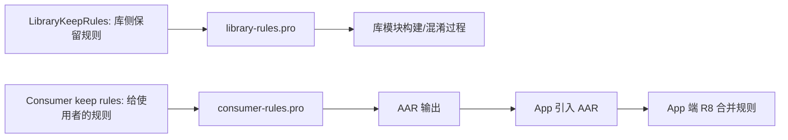
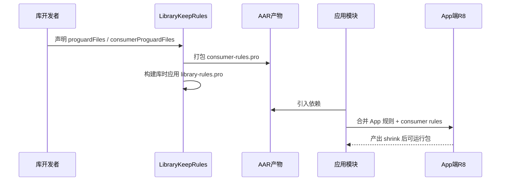
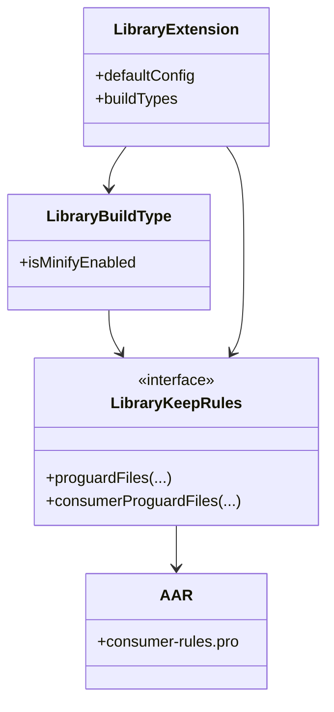

太阳升到差不多要把影子缩短的时候，希尔把锅盖掀开了一条缝。

白雾嘶地一下冒出来，顺着风往湖面飘。

洛芙抱着电脑坐在折叠椅里，刚准备喝一口可可，就看见终端里蹦出一串让人心口发紧的字：

`java.lang.NoSuchMethodException: com.camp.lib.Router.open(java.lang.String)`

“又是反射崩了……”她把杯子放下，声音都塌了一点，“昨天安装终于稳了，今天运行又炸。”

黛琳把白板往她这边转，没急着回答，只问了一句：“崩在 debug 还是 release？”

“release。”

“那我们今天就该学这个了。”

她在白板中央写下：`LibraryKeepRules`。

伊莎把烤好的吐司掰成两半，递给洛芙一半：“昨天我们解决的是‘怎么把库装上去’。今天是‘装上去以后，哪些代码在 shrink 阶段必须活下来’。”

“shrink 阶段就是 R8 做代码压缩和优化的时候，对吧？”

“对。”黛琳点头，“而 keep rules 就是你提前写好的保留指令，告诉工具：这些类、方法、字段别删，别乱改名，或者按条件保留。”

希尔啪地打了个响指：“重点来了，`LibraryKeepRules` 不是 app 端的总开关，它是 library DSL 里的规则配置对象。你要先认清它在哪一层。”

她把电脑转过来，代码放大到 150%。

```kotlin
// 代码片段 A（图 1 对应，行 68-121）
// build.gradle.kts (:camp-router-lib)
plugins {
    id("com.android.library")
    kotlin("android")
}

android {
    namespace = "com.camp.router"
    compileSdk = 34

    defaultConfig {
        minSdk = 24

        // 供“使用这个库的 App”消费的规则文件（consumer side）
        consumerProguardFiles("consumer-rules.pro")
    }

    buildTypes {
        release {
            isMinifyEnabled = true
            // 库模块自身在构建时使用的规则（library side）
            proguardFiles(
                getDefaultProguardFile("proguard-android-optimize.txt"),
                "library-rules.pro"
            )
        }
    }
}
```

“我先给你一句极简定义。”黛琳在 `LibraryKeepRules` 下面补了一行，“`LibraryKeepRules`：Android Gradle Plugin 的 library DSL 中，用来声明库侧保留规则的接口能力，核心是把规则文件接入构建与发布链路。”

洛芙咬了一口吐司，皱着眉盯着屏幕：“那 `proguardFiles` 和 `consumerProguardFiles` 到底谁管谁？”

“没人管谁，它们服务对象不同。”

黛琳很快画出第一张图。



“图 1 对应代码片段 A（第 68-121 行）。”她用笔点着图上的两条分支，“左边是库自己构建时生效，右边是随 AAR 发给消费者。名字都带 keep rules，但生命周期不一样。”

洛芙“哦——”了一声：“所以我这次 release 崩溃，很可能是库里真正该保留的方法没写进库侧规则，或者消费者侧规则没覆盖到 app 收缩阶段？”

“你已经抓住 80% 了。”

希尔把终端分成左右两个窗格。

左边是坏味道配置，右边是重构版。

“先看反模式，”她说，“这个是我们昨晚临时救火时写的。”

```kotlin
// 反模式：规则散落、边界混乱
android {
    buildTypes {
        release {
            isMinifyEnabled = true
            // 只配了默认规则，没把库关键反射入口保住
            proguardFiles(getDefaultProguardFile("proguard-android-optimize.txt"))
        }
    }

    defaultConfig {
        // 把本该给消费者的规则和库内部规则混写，文件名也随意
        consumerProguardFiles("keep.pro", "tmp-rules.pro")
    }
}
```

“这段为什么糟糕？”洛芙问。

黛琳伸出三根手指。

“第一，意图不清。文件名看不出用途。”

“第二，职责混乱。库内部需要的规则和给消费者的规则没分层。”

“第三，不可验证。没有测试去证明‘关键 API 真被保住了’。”

伊莎把白板翻到新页，在角落写了“边界感”三个字。

“工程里很多崩溃都不是不会写，是边界写糊了。”她说。

希尔把右侧重构版贴出来。

```kotlin
// 重构后：规则分层、命名清晰、便于审计
android {
    defaultConfig {
        // 给“使用此库的 App”用的规则
        consumerProguardFiles("consumer-rules.pro")
    }

    buildTypes {
        release {
            isMinifyEnabled = true
            // 库构建时自身规则
            proguardFiles(
                getDefaultProguardFile("proguard-android-optimize.txt"),
                "library-rules.pro"
            )
        }
        debug {
            isMinifyEnabled = false
        }
    }
}
```

“然后我们给规则文件本身也做收敛。”黛琳接过键盘，打开 `library-rules.pro`。

```proguard
# library-rules.pro（库构建侧）
-keep class com.camp.router.internal.RouterRegistry { *; }
-keepclassmembers class com.camp.router.internal.RouterRegistry {
    public <methods>;
}
```

再打开 `consumer-rules.pro`。

```proguard
# consumer-rules.pro（消费者侧）
# App 在使用 Router.open(String) 反射路径时需要保留入口签名
-keep class com.camp.router.Router {
    public *;
}
```

洛芙眨了眨眼：“原来两个规则文件可以同时存在，而且目标不冲突。”

“对。”黛琳说，“`LibraryKeepRules` 这章的核心，不是背 API 名，而是明确规则进入构建系统的‘入口与去向’。”

风把帐篷边的挂绳吹得轻轻碰撞。

希尔把第二张图画成时序图，顺手在图下写了“先库后应用”。



“图 2 对应代码片段 B（第 245-317 行）。”她说，“下面这段测试就是把图里的最后一步变成证据。”

洛芙把椅子往前挪了半步：“等一下，我想再确认一个名词。‘规则合并’是不是指 R8 最后把多个来源的规则拼在一起解释执行？”

“是，理解得很准。”

黛琳写下最短回答：“同类规则可能叠加，也可能冲突，冲突时通常以更强保留约束为准，具体以工具行为为准。”

伊莎笑着把汤勺递给洛芙：“先喝两口汤，再看测试，不然你要把异常栈看成天书了。”

洛芙喝了一口，热气把睫毛熏得潮潮的。

希尔已经把最小复现实验工程贴在屏幕上了。

```kotlin
// 代码片段 B（图 2 对应，行 245-317）
// src/test/kotlin/com/camp/router/KeepRuleBehaviorTest.kt
import org.junit.Assert.assertFalse
import org.junit.Assert.assertTrue
import org.junit.Test

class KeepRuleBehaviorTest {

    private val methodsBeforeShrink = setOf(
        "open(java.lang.String)",
        "open(java.lang.String,android.os.Bundle)",
        "debugDump()"
    )

    @Test
    fun `consumer keep rules should preserve public router methods`() {
        val keptByConsumerRules = setOf(
            "open(java.lang.String)",
            "open(java.lang.String,android.os.Bundle)"
        )

        assertTrue(keptByConsumerRules.contains("open(java.lang.String)"))
        assertTrue(keptByConsumerRules.contains("open(java.lang.String,android.os.Bundle)"))
        assertFalse(keptByConsumerRules.contains("debugDump()"))
    }

    @Test
    fun `without keep rules reflective entry may disappear`() {
        val removedAfterShrink = setOf("open(java.lang.String)")
        assertTrue(removedAfterShrink.contains("open(java.lang.String)"))
    }
}
```

“这段测试并不直接调用 R8，”黛琳提醒她，“是教学用最小模型。它验证的是我们的规则意图：应该保住谁，不该保住谁。”

希尔接上终端输出：

```text
> Task :camp-router-lib:testDebugUnitTest

KeepRuleBehaviorTest > consumer keep rules should preserve public router methods PASSED
KeepRuleBehaviorTest > without keep rules reflective entry may disappear PASSED

BUILD SUCCESSFUL in 2s
3 actionable tasks: 3 executed
```

洛芙看着 `PASSED` 两行，明显松了口气：“我懂了。先建模型保证意图正确，再到真实 shrink 包里看 mapping 和运行结果。”

“这就是可迁移的工程习惯。”黛琳说。

她又打开一个真实日志片段，给洛芙对照。

```text
# 未配置 consumer-rules.pro 时（App release）
java.lang.NoSuchMethodException: com.camp.router.Router.open(java.lang.String)
    at java.lang.Class.getMethod(Class.java:...) 

# 配置后
Router invoke success: route=/camp/map
```

伊莎把发卡别回耳后，轻声问：“那库作者是不是应该把所有 public API 全 keep，最保险？”

“不是。”黛琳摇头，“过度 keep 会让优化失效，包体上升，方法数压力也会上来。我们要的是‘最小必要保留’。”

希尔点头：“只保入口、反射、序列化、JNI 这种确实依赖名称和签名稳定性的点。其他能让 R8 优化就别硬拦。”

洛芙在本子上记下四个字：最小必要。

她想了两秒，又抬头：“那 `LibraryKeepRules` 在变体里能不能细分？比如 debug 不要，release 才启？”

“可以按变体策略配置。”黛琳说，“下一章我们会在 `LibraryProductFlavor` 里专门讲怎么按口味维度做规则差异。今天你先记住：同一条 keep，不一定适合所有构建目标。”

太阳继续往上走，白板上的马克笔痕被晒得发亮。

希尔把最后一个对照表贴出来，像给今天收尾。

```text
目标：让 Router 反射入口在 release 稳定可用

错误做法：
1) 只写 app 端规则，不写库消费者规则
2) 库内部规则和消费者规则混在一个文件
3) 不做 shrink 后验证

正确做法：
1) 库内部规则: library-rules.pro（服务库构建）
2) 消费者规则: consumer-rules.pro（随 AAR 发布）
3) 规则模型测试 + release 真机回归
```

洛芙把笔帽扣上，手背被太阳晒得暖暖的。

“今天这章名字叫‘图书馆保管规则’，我现在觉得‘保管’这个词真的很准。”

她望着湖面说。

“不是把所有东西都锁进仓库，而是知道哪些必须留，留在哪一层，什么时候交接给下一层。”

黛琳听完笑了，很轻地点了点头。

“这句话可以当我们今天的结论。”

风从林子里穿出来，带着一点松脂味。

便携炉上的汤又咕噜了一声，像是在给正午前的课程按下一个温和的句号。

---

## 专业技术总结

> **LibraryKeepRules（英文原名）定义**：`LibraryKeepRules` 是 Android Gradle Plugin 的库模块 DSL 中与保留规则声明相关的接口能力，用于把库构建侧规则与发布给消费者的规则接入构建流程，确保 R8/ProGuard 在 shrink 阶段按预期保留关键 API 与签名。

#### 结构图（必须）



含义：库模块通过 DSL 声明 keep 规则后，一部分作用于库构建，一部分随 AAR 交给消费者。

#### 复杂度与影响（可选）

- 性能影响：最小必要 keep 能保留优化空间，避免无差别保留导致代码膨胀。
- 稳定性影响：反射/JNI/序列化入口若缺少 keep，release 崩溃概率显著上升。
- 维护影响：规则分层（library vs consumer）可降低排障路径长度。

#### 反模式与陷阱（≥3 条）

1. 只写 `proguardFiles`，遗漏 `consumerProguardFiles` → 修复：为对外 API 提供消费者规则文件。  
2. 把所有类都 `-keep` → 修复：仅保留反射与稳定入口，保留优化余地。  
3. 规则文件命名混乱（keep.pro/tmp.pro）→ 修复：采用 `library-rules.pro` / `consumer-rules.pro` 明确语义。  
4. 不做 release 验证，只看 debug → 修复：建立 shrink 后回归和关键反射调用检查。  

#### 设计思想：边界先行，再谈优化

- 先区分“库内部构建规则”和“消费者继承规则”。
- 规则不是越多越安全，而是越精准越可控。
- 每条 keep 都应能回答“保谁、为何、在哪一层生效”。
- 用可执行测试固定规则意图，避免口头共识漂移。
- 以 release 行为为验收标准，不以 debug 可跑替代。

---

#### 🏕️ 动手练习（项目制）

项目概览：做一个可反射调用的 `CampRouter` 库，并把它发布为本地 AAR；验证 `LibraryKeepRules` 配置前后 release 行为差异。

**Task 1**
1. **目标**：创建最小库模块并暴露一个反射入口。  
2. **你需要做的事**：新建 `:camp-router-lib`；添加 `Router.open(String)` 公共方法和 `debugDump()` 调试方法。  
3. **验收标准**：  
   - [ ] 能编译通过  
   - [ ] `Router.open(String)` 可直接调用  
4. **提示**：
```kotlin
class Router {
    fun open(route: String) = "open:$route"
    fun debugDump() = "debug"
}
```

**Task 2**
1. **目标**：先复现 shrink 后反射失败。  
2. **你需要做的事**：release 打开 `isMinifyEnabled = true`，暂不写 keep；在 app 端用反射调用 `open(String)`。  
3. **验收标准**：  
   - [ ] release 下出现 `NoSuchMethodException` 或等价失败  
   - [ ] 记录日志  
4. **提示**：
```kotlin
Class.forName("com.camp.router.Router").getMethod("open", String::class.java)
```

**Task 3**
1. **目标**：添加库构建侧规则。  
2. **你需要做的事**：新增 `library-rules.pro`，在 release 的 `proguardFiles` 引入。  
3. **验收标准**：  
   - [ ] 构建无报错  
   - [ ] 规则文件被 Gradle 读取  
4. **提示**：
```proguard
-keep class com.camp.router.internal.RouterRegistry { *; }
```

**Task 4**
1. **目标**：添加消费者规则并随 AAR 发布。  
2. **你需要做的事**：新增 `consumer-rules.pro`，在 `defaultConfig.consumerProguardFiles(...)` 接入。  
3. **验收标准**：  
   - [ ] AAR 中包含消费者规则  
   - [ ] App 引入后规则可合并  
4. **提示**：
```kotlin
defaultConfig { consumerProguardFiles("consumer-rules.pro") }
```

**Task 5**
1. **目标**：验证反射入口在 release 恢复。  
2. **你需要做的事**：重新打 release 并运行反射路径；记录前后对比。  
3. **验收标准**：  
   - [ ] 同一设备上失败→成功可复现  
   - [ ] 有日志截图或文本  
4. **提示**：重点核对方法签名是否一致。

**Task 6**
1. **目标**：做“最小必要保留”收敛。  
2. **你需要做的事**：删除多余 `-keep`；只保留外部 API 与反射关键路径。  
3. **验收标准**：  
   - [ ] 功能不回退  
   - [ ] 规则条目减少且有备注  
4. **提示**：每条规则加一句注释说明原因。

**Task 7**
1. **目标**：建立规则意图单元测试。  
2. **你需要做的事**：参照正文 `KeepRuleBehaviorTest` 创建测试，至少校验 2 个应保留签名。  
3. **验收标准**：  
   - [ ] 测试通过  
   - [ ] 覆盖“应保留”和“可移除”两类断言  
4. **提示**：
```kotlin
assertTrue(kept.contains("open(java.lang.String)"))
```

**Task 8**
1. **目标**：形成规则审计清单。  
2. **你需要做的事**：写一份 `KEEP_RULES_AUDIT.md`，列出生效层级、文件名、负责人、验证命令。  
3. **验收标准**：  
   - [ ] 新同学能按清单独立完成验证  
   - [ ] 至少包含一次 release 验证命令  
4. **提示**：把“库侧/消费者侧”分栏写清楚。

**面试热身（Q1-Q5）**

- Q1：`proguardFiles` 与 `consumerProguardFiles` 的职责边界是什么？
- Q2：为什么 keep rules 要追求“最小必要保留”？
- Q3：当 release 反射崩溃时，你如何定位是 App 规则问题还是库规则问题？
- Q4：`LibraryKeepRules` 在多模块项目里最容易出现的协作失误是什么？
- Q5：你会如何设计一条 CI 检查，防止关键 consumer rules 被误删？

#### 参考实现要点（5 条）

1. 统一命名：`library-rules.pro`（库侧）+ `consumer-rules.pro`（消费者侧）。
2. release 最小化保留，debug 不启用无意义 shrink。
3. 对反射/JNI/序列化入口给出精确 keep，而非通配全量类。
4. 保留规则与 API 变更一起评审，避免“代码改了规则没改”。
5. 建立 release 自动回归：反射关键路径 + 日志断言 + 规则文件存在性检查。

---

> 先分清规则生效边界，再做优化强度调参。能长期稳定运行的构建系统，往往不是“规则最多”的系统，而是“规则最清楚”的系统。

## 🍹洛芙的小小日记本

今天终于不再把 keep rules 当成一团雾了。最重要的是分层：库自己一层，消费者一层。先把边界画清楚，崩溃就会少很多。写代码像收拾营地，东西放对层，夜里就不慌。

## 今日关键词

- LibraryKeepRules：库模块 DSL 中与保留规则声明相关的接口能力，连接规则文件与构建流程。  
- keep rules：给 R8/ProGuard 的保留指令，控制类、方法、字段是否可被删改。  
- R8：Android 默认代码收缩与混淆工具，负责压缩、优化、改名。  
- ProGuard：早期常见的代码混淆工具与规则语法来源，R8 兼容其规则格式。  
- shrink：代码收缩阶段，删除未使用代码并做优化。  
- minifyEnabled / isMinifyEnabled：是否启用 release 收缩流程的开关。  
- proguardFiles：库或应用构建侧规则文件入口。  
- consumerProguardFiles：库发布给使用者的规则文件入口，会进入 AAR。  
- AAR：Android 库打包产物，可包含 classes、资源、manifest 与 consumer rules。  
- 规则合并：App 构建时把多来源规则一起交给 R8 解释执行。  
- 反射（Reflection）：运行时按名字查找类或方法，对名称稳定性高度敏感。  
- NoSuchMethodException：反射找不到目标方法时抛出的异常。  
- release 构建：面向发布的构建模式，常启用收缩与优化。  
- debug 构建：面向调试的构建模式，通常关闭收缩便于排障。  
- 最小必要保留：仅保住必需入口，不做无差别 keep 的策略。  
- 规则边界：区分“库构建生效”与“消费者构建生效”的责任范围。  
- CI 回归：在持续集成中自动执行 release 验证，防止规则回退。  
- mapping：混淆映射文件，用于追踪重命名后的类和方法。  
- API 稳定入口：需要长期兼容的公开方法或签名，通常应受 keep 保护。