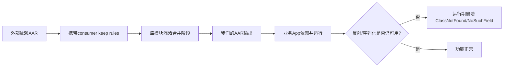
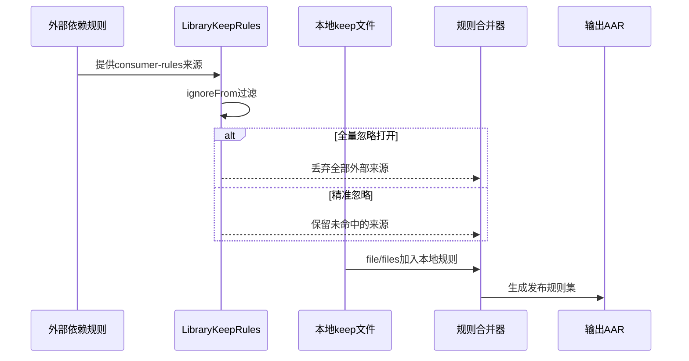
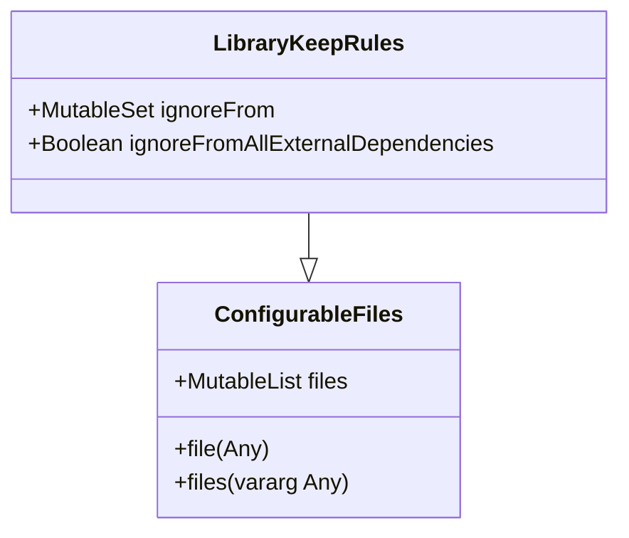

# 21.1.154 图书馆保管规则

正午的太阳刚好爬到树梢最高处时，希尔把昨晚写满 TODO 的便签贴在器材箱外壳上。

便签角被风吹得轻轻抖，像在提醒她：今天不能再“先跑通再说”了。

洛芙蹲在折叠桌边，手里捧着半杯温可可，盯着终端里那串让人头皮发麻的类名。

“我以为昨天已经把 installation 这段链路救回来了，”她叹气，“怎么一发布库，业务方一跑反射，就又炸？”

黛琳把白板擦干净，笔尖敲了两下板面。

“因为我们昨天解决的是安装行为，”她说，“今天坏掉的是保留规则来源控制。不是同一个层面。”

伊莎把烤好的吐司分成四片，轻轻放到纸盘里，没有马上接话。

风从湖面吹来，带着一点潮湿的凉意，和午后的松针味混在一起。

过了两秒，她才抬眼：“你们把不同依赖塞进图书馆时，没先看清哪一箱书自带‘请永久保管这几本’的纸条。”

洛芙眨了眨眼：“你是说……consumer-rules？”

“对。”黛琳点头，“更准确地说，是外部依赖带来的 keep rules。”

希尔把电脑转过来，打开 `build.gradle.kts`。

“AGP 8.2 起这个接口就有了，官方页今天就两条最关键属性。短，但很要命。”

她指着屏幕念得很快，又放慢给洛芙听。

`LibraryKeepRules` 是个 `@Incubating` 接口，继承 `ConfigurableFiles`。

它有两个公开属性：

1) `ignoreFrom: MutableSet<String>`：按坐标精确忽略指定外部依赖的 keep rules，支持 `group:artifact:version`，也支持 `group:artifact`。

2) `ignoreFromAllExternalDependencies: Boolean`：一键忽略全部外部依赖 keep rules。

洛芙立刻皱眉：“第二个听起来很爽，但为什么你说它危险？”

黛琳笑了笑：“因为‘爽’经常等于‘失去分辨率’。”

她在白板上写下今天的故障链。



她把笔帽扣上：“图 1 对应代码片段 A 第 9-20 行。我们现在要决定，C 这一步到底收谁的规则，不收谁的规则。”

洛芙凑近看：“那之前我们的坏味道，是不是直接把 `ignoreFromAllExternalDependencies = true` 了？”

“是。”希尔咳了一声，“我干的。”

她没躲，直接在旁边贴出“坏味道实现”。

```kotlin
// 代码片段 A（bad smell）
// build.gradle.kts of :camp-library
plugins {
    id("com.android.library")
    kotlin("android")
}

android {
    // 9
    publishing {
        singleVariant("release")
    }
    // 13
    libraryPublishing {
        // 问题：一刀切忽略所有外部依赖规则
        keepRules {
            ignoreFromAllExternalDependencies = true
        }
    }
}
```

“这段能编译，发布也成功，”希尔说，“但业务方接入后，`Moshi` 反射适配器和我们位置缓存的序列化通道同时挂掉。”

洛芙抿着嘴：“因为外部依赖原本给我们的保护规则全没了。”

“正解。”黛琳写下 `precision > convenience`。

她开始带洛芙重构。

“第一步，不要全忽略。先只忽略已知会污染体积、又与我们无关的依赖规则。第二步，在我们自己的 consumer-rules 里补上真正必须暴露给下游的约束。”

希尔把“重构后实现”敲出来。

```kotlin
// 代码片段 B（refactor）
// build.gradle.kts of :camp-library
plugins {
    id("com.android.library")
    kotlin("android")
}

android {
    namespace = "com.yuru.camp.library"

    libraryPublishing {
        keepRules {
            // 12-13: 精准忽略，支持 group:artifact 或 group:artifact:version
            ignoreFrom += "com.legacy:huge-legacy-runtime"
            ignoreFrom += "org.example:debug-helper:1.4.2"

            // 16: 不做全量忽略，避免误杀关键反射链
            ignoreFromAllExternalDependencies = false

            // 19-20: 利用继承自 ConfigurableFiles 的 file/files 增补本地规则文件
            file("proguard/keep-public-api.pro")
            files("proguard/keep-reflection.pro", "proguard/keep-serialization.pro")
        }
    }
}
```

“图 1 对应代码片段 B 第 12-20 行。”黛琳补了一句，“你看，决定点都落在这里。”

洛芙盯着 `file/files`：“等一下，这俩不是普通文件 API 吗？”

“对，但它来自 `ConfigurableFiles`。”黛琳说，“`LibraryKeepRules` 继承它，所以你可以把规则文件清单作为配置的一部分汇入。”

伊莎把另一块白板拉过来，画了第二张图。



她在角落写下：图 2 对应代码片段 B 第 16、19、20 行。

洛芙点点头，随即又冒出一个担心。

“那我们只讨论了库发布。运行时问题怎么验证？万一我看着规则很漂亮，App 里还是崩呢？”

希尔啪地打了个响指。

“所以我们要把发布链和运行链绑在一起测。”

她打开示例 App，快速指给洛芙看三层结构：

- `MainActivity` 负责入口与权限请求；
- `TrailFragment` 负责采集与展示；
- `CampSyncService` 负责后台打点上传；
- `SyncWorker` 做延迟重试；
- Room 存本地轨迹，SharedPreferences 存开关。

“我知道你在想什么，”希尔笑，“这不是偏题，这是验证 keep rules 有没误杀。只要其中一个反射入口、序列化入口、组件重建入口断掉，问题就会暴露。”

黛琳接过话：“先把生命周期梳理清楚。生命周期本身不是 today 的主题，但它决定你在哪个回调触发哪些代码，关系到‘是不是被混淆后才显错’。”

她在本子上给洛芙列了最小运行链：

- Activity `onCreate`：注册 UI，读取 SharedPreferences；
- Fragment `onViewCreated`：观察 Room 数据并更新列表；
- Service `onStartCommand`：收 Intent Extra，触发上传；
- Worker `doWork`：离线时重试。

“如果你把耗时网络请求直接塞 `onCreate`，”黛琳说，“你会把生命周期问题和 keep 问题搅在一起，根本定位不准。”

洛芙举手：“那就是先把线程模型干净化。”

“对。”

希尔把“错误示例与修复”摆出来。

```kotlin
// 错误示例：在 Activity.onCreate 直接做耗时请求
class MainActivity : AppCompatActivity() {
    override fun onCreate(savedInstanceState: Bundle?) {
        super.onCreate(savedInstanceState)
        setContentView(R.layout.activity_main)

        // 反模式：阻塞主线程，且与生命周期恢复纠缠
        val result = URL("https://example.com/config").readText()
        findViewById<TextView>(R.id.tv).text = result
    }
}
```

```kotlin
// 修复示例：生命周期安全 + 后台执行
class MainActivity : AppCompatActivity() {
    override fun onCreate(savedInstanceState: Bundle?) {
        super.onCreate(savedInstanceState)
        setContentView(R.layout.activity_main)

        lifecycleScope.launch {
            val result = withContext(Dispatchers.IO) {
                URL("https://example.com/config").readText()
            }
            findViewById<TextView>(R.id.tv).text = result
        }
    }
}
```

洛芙看完长出一口气：“这样我至少能把‘线程阻塞’和‘规则误杀’分开看。”

“没错。”黛琳说。

午后的阳光往帐篷里斜了一点，白板边缘亮得发白。

伊莎把一根铅笔放在洛芙手边：“继续。你刚问运行验证，我们再补数据链。”

她让洛芙先写 Intent 与 Bundle 传递，再把结果落到 SharedPreferences 与 Room。

```kotlin
// Activity -> Service: Intent Extra
val intent = Intent(this, CampSyncService::class.java).apply {
    putExtra("track_id", 42L)
    putExtra("trigger", "manual")
}
startService(intent)

// Fragment 参数：Bundle
val fragment = TrailFragment().apply {
    arguments = bundleOf("initial_tab" to "history")
}
```

```kotlin
// SharedPreferences: 轻量键值配置
val sp = getSharedPreferences("camp_prefs", MODE_PRIVATE)
sp.edit().putBoolean("sync_over_metered", false).apply()
val syncOverMetered = sp.getBoolean("sync_over_metered", false)
```

```kotlin
// Room: 结构化轨迹数据
@Entity(tableName = "trail")
data class TrailEntity(
    @PrimaryKey val id: Long,
    val lat: Double,
    val lng: Double,
    val ts: Long
)

@Dao
interface TrailDao {
    @Insert(onConflict = OnConflictStrategy.REPLACE)
    suspend fun upsert(entity: TrailEntity)

    @Query("SELECT * FROM trail ORDER BY ts DESC LIMIT 50")
    suspend fun latest(): List<TrailEntity>
}
```

“这些和 keep rules 的关系是什么？”洛芙问。

希尔把手指点在 `TrailEntity` 上：“序列化框架、反射框架、甚至某些生成代码的运行入口，都可能依赖类名和成员不被过度收缩。你的 keep 策略若乱了，这里最先出现‘看不懂的运行期错误’。”

黛琳补刀：“所以 keep rules 不是‘给 ProGuard/R8 的礼节性文件’，它是发布契约。”

洛芙把这句抄进笔记本。

接下来是后台任务链。

希尔说：“Service 不是万能后台。短任务可以 Service，约束重试和系统友好要交给 WorkManager。”

```kotlin
class CampSyncService : Service() {
    override fun onStartCommand(intent: Intent?, flags: Int, startId: Int): Int {
        val trackId = intent?.getLongExtra("track_id", -1L) ?: -1L
        if (trackId > 0) {
            val req = OneTimeWorkRequestBuilder<SyncWorker>()
                .setInputData(workDataOf("track_id" to trackId))
                .build()
            WorkManager.getInstance(this).enqueue(req)
        }
        return START_NOT_STICKY
    }

    override fun onBind(intent: Intent?) = null
}
```

```kotlin
class SyncWorker(
    appContext: Context,
    params: WorkerParameters
) : CoroutineWorker(appContext, params) {
    override suspend fun doWork(): Result {
        val id = inputData.getLong("track_id", -1)
        if (id <= 0) return Result.failure()
        // 模拟上传
        delay(120)
        return Result.success()
    }
}
```

“Handler 呢？”洛芙问。

“Handler 适合进程内短调度，不替代持久化后台任务。”希尔写了个最小例子。

```kotlin
private val handler = Handler(Looper.getMainLooper())

fun debounceRefresh(action: () -> Unit) {
    handler.removeCallbacksAndMessages(null)
    handler.postDelayed({ action() }, 300)
}
```

伊莎笑着把吐司盘推过去：“该到权限和硬件了。你不把权限链走通，传感器和位置根本不给你数据，测试也就失真。”

洛芙点开权限请求代码。

```kotlin
private val reqPermission =
    registerForActivityResult(ActivityResultContracts.RequestMultiplePermissions()) { result ->
        val fine = result[Manifest.permission.ACCESS_FINE_LOCATION] == true
        val coarse = result[Manifest.permission.ACCESS_COARSE_LOCATION] == true
        if (fine || coarse) startLocationSampling() else showPermissionRationale()
    }

fun ensureLocationPermission() {
    reqPermission.launch(arrayOf(
        Manifest.permission.ACCESS_FINE_LOCATION,
        Manifest.permission.ACCESS_COARSE_LOCATION
    ))
}
```

她又把传感器、相机、位置三个入口都接上。

```kotlin
// 传感器：加速度
val sensorManager = getSystemService(Context.SENSOR_SERVICE) as SensorManager
val accel = sensorManager.getDefaultSensor(Sensor.TYPE_ACCELEROMETER)

// 相机：CameraX 初始化（示意）
val cameraProviderFuture = ProcessCameraProvider.getInstance(this)

// 位置：FusedLocationProviderClient
val fused = LocationServices.getFusedLocationProviderClient(this)
```

“网络通信也补一段，”黛琳说，“让你在失败时看到是网络、权限，还是 keep。”

```kotlin
interface CampApi {
    @POST("sync")
    suspend fun sync(@Body payload: Map<String, Any>): Response<Unit>
}

val retrofit = Retrofit.Builder()
    .baseUrl("https://api.example.com/")
    .addConverterFactory(MoshiConverterFactory.create())
    .build()

val api = retrofit.create(CampApi::class.java)
```

“Intent Filter 不要忘。”希尔补上。

```xml
<activity android:name=".ShareReceiverActivity" android:exported="true">
    <intent-filter>
        <action android:name="android.intent.action.SEND" />
        <category android:name="android.intent.category.DEFAULT" />
        <data android:mimeType="text/plain" />
    </intent-filter>
</activity>
```

洛芙一边抄一边嘟囔：“今天像把半本 Android 体检表跑了一遍。”

“是故意的。”黛琳说，“因为 keep rules 的问题不长在一个文件里，它会在系统边界全线冒头。”

为了让结论可验证，希尔拉了一个最小测试。

```kotlin
// testImplementation("junit:junit:4.13.2")
class KeepRuleBehaviorTest {

    @Test
    fun reflection_should_work_when_required_rules_present() {
        val clazz = Class.forName("com.yuru.camp.library.model.TrackPayload")
        val ctor = clazz.getDeclaredConstructor()
        ctor.isAccessible = true
        val instance = ctor.newInstance()
        assertNotNull(instance)
    }
}
```

然后她给出两组运行输出。

```text
[Case A] ignoreFromAllExternalDependencies=true
java.lang.ClassNotFoundException: com.yuru.camp.library.model.TrackPayload
at java.lang.Class.classForName(Native Method)
...

[Case B] ignoreFrom 精准配置 + 本地 keep 文件补位
BUILD SUCCESSFUL in 18s
1 test, 1 passed
SyncWorker result=success, track_id=42
```

洛芙看着 `1 passed` 那行，终于笑出来。

“所以今天真正的‘图书馆保管规则’就是：谁的保管条款该带进馆，谁该在门口拦下，要写成机器能执行的清单。”

“而且清单要可回归测试。”黛琳说。

风把帐篷门帘掀起一点，湖面的光晃进来，照在白板上 `ignoreFrom` 那一行。

伊莎慢慢把空杯子叠在一起：“你们发现没有，‘全部忽略’和‘全部接受’其实是同一种懒。”

希尔“嗯”了一声：“真正工程化是有选择地承担复杂度。”

洛芙把最后一段注释写完，向后靠在折叠椅里，肩膀终于松下来。

“我以前总想找一把万能开关，”她说，“现在更像在做版本化的约定：我知道我为什么留，为什么不留。”

黛琳把笔收进盒子，声音很轻。

“数据该活多久、规则该保到哪一层，都不是靠感觉。写清楚，测出来，才算数。”

湖对岸传来一声很短的鸟鸣。

洛芙抬头看了一眼午后发亮的天空，又低头把 `keep-reflection.pro` 保存，文件名后面的星号终于消失。

---

> LibraryKeepRules（Android Gradle Plugin DSL）是用于控制 Android Library 在发布阶段如何处理外部依赖 keep rules 的配置接口。它通过 `ignoreFrom` 与 `ignoreFromAllExternalDependencies` 管理规则来源，并可借助继承自 `ConfigurableFiles` 的 `file/files` 注入本地规则文件，核心目标是让 AAR 的混淆契约可控、可追踪、可验证。

#### 结构图（必须）



上图说明：`LibraryKeepRules` 本身只定义“过滤来源”的核心能力，文件注入能力来自其父接口 `ConfigurableFiles`。

#### 复杂度与影响（可选）

- 精准忽略（`ignoreFrom`）会增加配置维护成本，但可显著降低运行期反射/序列化崩溃概率。
- 全量忽略（`ignoreFromAllExternalDependencies=true`）配置简单，但风险集中，通常导致“构建成功、运行失败”的隐蔽问题。
- 本地 keep 文件拆分（按 API、反射、序列化）提升可维护性，便于回归测试定位。

#### 反模式与陷阱（≥3 条）

1. 直接打开 `ignoreFromAllExternalDependencies=true` 后不补本地规则 → 修复：改为 `ignoreFrom` 精准配置并补齐关键 keep 文件。
2. 把线程阻塞问题和 keep 问题混在 `onCreate` 调试 → 修复：先清理生命周期与线程模型，再验证规则策略。
3. 只看 `BUILD SUCCESSFUL` 不做运行期反射测试 → 修复：增加 `Class.forName` 或序列化回归用例。
4. 规则文件单体巨大、无边界 → 修复：按用途拆分 `keep-public-api.pro` / `keep-reflection.pro` / `keep-serialization.pro`。

#### 名词小传（可选）

- `@Incubating` 表示该 DSL 仍在演进期，未来 AGP 版本可能调整行为或 API 细节。
- `consumer-rules` 是库向下游应用暴露的“混淆契约”，本质是发布文档的一部分。

#### 设计哲学：发布契约优先于“看起来更省事”

1. 先定义库的稳定公开 API，再写 keep。
2. 只忽略可证明无关的外部规则来源。
3. 保持规则配置可审计：每条忽略都能说明原因。
4. 运行验证覆盖组件生命周期关键路径。
5. 用自动化测试守护反射与序列化入口。

---

#### 🏕️ 动手练习（项目制）

项目概览：构建一个 `camp-track-lib` 库模块，发布到本地 Maven，验证不同 keep 策略下业务 App 的运行稳定性。

**Task 1（★）初始化库模块与发布配置**
- 目标：创建可发布的 Android Library。
- 你需要做的事：
  1. 新建 `:camp-track-lib`，应用 `com.android.library` 与 Kotlin Android 插件。
  2. 配置 `publishing { singleVariant("release") }`。
  3. 准备最小 API 类 `TrackPayload`。
- 验收标准：
  - [ ] `./gradlew :camp-track-lib:assembleRelease` 成功。
  - [ ] 产出 `release` AAR。
- 提示：
```kotlin
android { publishing { singleVariant("release") } }
```

**Task 2（★）制造可复现的反射入口**
- 目标：让业务 App 通过反射实例化库类。
- 你需要做的事：
  1. 在库中创建无参构造类 `TrackPayload`。
  2. 在 App 中调用 `Class.forName("...")`。
- 验收标准：
  - [ ] Debug 可运行并打印实例化成功日志。
- 提示：
```kotlin
val obj = Class.forName("com.yuru.camp.library.model.TrackPayload")
```

**Task 3（★★）应用“全量忽略”并观察失败**
- 目标：理解 `ignoreFromAllExternalDependencies` 风险。
- 你需要做的事：
  1. 在 `keepRules` 设置 `ignoreFromAllExternalDependencies = true`。
  2. 重新发布并在 App Release 构建运行。
- 验收标准：
  - [ ] 记录至少一条运行期失败栈。
- 提示：
```kotlin
keepRules { ignoreFromAllExternalDependencies = true }
```

**Task 4（★★）重构为精准忽略**
- 目标：用 `ignoreFrom` 替代一刀切策略。
- 你需要做的事：
  1. 列出确实应忽略的依赖坐标。
  2. 使用 `group:artifact` 与 `group:artifact:version` 各写一条。
- 验收标准：
  - [ ] 配置中不再出现全量忽略。
  - [ ] 反射链恢复。
- 提示：
```kotlin
ignoreFrom += "com.legacy:huge-legacy-runtime"
ignoreFrom += "org.example:debug-helper:1.4.2"
```

**Task 5（★★★）拆分本地 keep 文件**
- 目标：提升规则可维护性。
- 你需要做的事：
  1. 新建 `keep-public-api.pro`、`keep-reflection.pro`。
  2. 使用 `file/files` 注入。
- 验收标准：
  - [ ] 两个文件都被合并进发布规则。
- 提示：
```kotlin
file("proguard/keep-public-api.pro")
files("proguard/keep-reflection.pro")
```

**Task 6（★★★）串联生命周期路径回归**
- 目标：验证 Activity/Fragment/Service 关键路径不受误伤。
- 你需要做的事：
  1. `Activity` 发 `Intent Extra` 给 `Service`。
  2. `Fragment` 从 Room 读取并渲染。
- 验收标准：
  - [ ] `onCreate`、`onViewCreated`、`onStartCommand` 三段路径日志完整。
- 提示：
```kotlin
Log.d("Life", "onStartCommand track_id=$trackId")
```

**Task 7（★★★★）加入权限与硬件采样**
- 目标：确认权限链、位置链与规则配置共存。
- 你需要做的事：
  1. 请求位置权限。
  2. 采集一次定位并写入 Room。
- 验收标准：
  - [ ] 拒绝权限时有降级提示。
  - [ ] 允许权限时能写入轨迹。
- 提示：
```kotlin
reqPermission.launch(arrayOf(Manifest.permission.ACCESS_FINE_LOCATION))
```

**Task 8（★★★★★）自动化回归测试**
- 目标：建立“规则变更即回归”的守护。
- 你需要做的事：
  1. 添加 JUnit 反射测试。
  2. 在 CI 中执行 release 构建 + 单测。
- 验收标准：
  - [ ] 规则变更导致反射失败时 CI 红灯。
- 提示：
```kotlin
assertNotNull(Class.forName("com.yuru.camp.library.model.TrackPayload"))
```

**面试热身（Q1-Q5）**
1. 用自己的话解释 `ignoreFrom` 与 `ignoreFromAllExternalDependencies` 的取舍逻辑。
2. 为什么 keep rules 议题要和生命周期、线程模型分开定位？
3. 发布库时，`consumer-rules` 为什么属于“契约”而不是“实现细节”？
4. `ConfigurableFiles` 继承能力如何帮助你管理 keep 文件？
5. 如果线上出现 `ClassNotFoundException`，你会如何设计最短排障路径？

#### 参考实现要点（5 条）

1. 默认优先“精准忽略”，避免全量忽略。
2. 规则来源与规则文件分层管理，便于审计。
3. 运行验证必须覆盖反射、序列化、组件重建。
4. 生命周期回调内避免阻塞，先保证可定位性。
5. keep 策略变更必须绑定自动化回归。

---

> 先把问题切开，再把规则写小。能解释每一条 keep 的来历，你的发布链路才真正可维护。

## 🍹洛芙的小小日记本

今天我终于不再迷信“一键开关”了。规则不是越多越安全，也不是全关最干净。写得明白、测得出来，心里就不慌。原来工程感就是这样一点点长出来的。

## 今日关键词

- LibraryKeepRules：AGP 中用于控制库发布阶段 keep rules 来源的接口。
- ignoreFrom：按依赖坐标精确忽略外部 keep rules 的集合属性。
- ignoreFromAllExternalDependencies：是否忽略所有外部依赖 keep rules 的布尔开关。
- ConfigurableFiles：提供 `file/files` 等文件配置能力的父接口。
- consumer-rules：库发布给下游 App 的混淆保留规则契约。
- AAR：Android Library 的发布产物格式。
- AGP：Android Gradle Plugin，负责 Android 构建流程。
- @Incubating：表示 API 仍在演进期，未来可能变化。
- GAV：`group:artifact:version` 依赖坐标格式。
- ProGuard/R8：代码压缩、优化、混淆工具链。
- Reflection（反射）：运行时按类名/成员名动态访问代码的机制。
- ClassNotFoundException：运行时找不到类时抛出的异常。
- Activity 生命周期：如 `onCreate` 等回调，决定界面组件状态转换。
- Fragment 生命周期：如 `onViewCreated`，决定视图绑定与释放时机。
- Service 生命周期：如 `onStartCommand`，用于后台组件处理入口。
- Intent Extra：通过键值对在组件间传递轻量数据。
- Bundle：跨组件传递参数的容器对象。
- SharedPreferences：保存轻量键值配置的本地存储。
- Room：基于 SQLite 的结构化持久化方案。
- WorkManager：可约束、可重试、可持久的后台任务框架。
- Handler：用于线程消息与短延迟调度的机制。
- Runtime Permission：Android 运行时权限请求模型。
- SensorManager：访问设备传感器的系统服务。
- CameraX：相机开发高级库，简化拍摄流程。
- FusedLocationProviderClient：融合定位客户端，提供位置能力。
- Retrofit：类型安全的 HTTP API 客户端。
- MoshiConverterFactory：Retrofit 的 JSON 序列化/反序列化转换器。
- Intent Filter：声明组件可接收的隐式 Intent 条件。
- JUnit：Java/Kotlin 单元测试框架。
- CI：持续集成流程，用于自动构建与测试。
- 发布契约：库对下游行为做出的稳定约定集合。