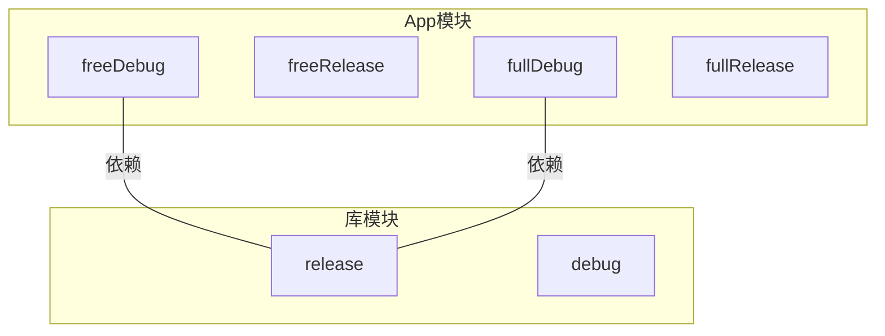

# 21.1.155 库产品风味

午后的阳光懒懒地铺在草地上，洛芙打了个小哈欠。

她正盯着黛琳刚画好的流程图发呆——上午解决了 LibraryKeepRules 的误伤问题，现在白板上新增了一排新概念，她得花点时间消化。

“黛琳，我有个想法，”伊莎的声音从身后传来，她正用树枝在地上画着圈圈，“既然我们能控制哪些 keep rules 能穿透到下游——那能不能更进一步，让库本身也能有‘不同的版本’？”

黛琳笔尖一顿。

“你是说……像 App 一样，给库也配上 product flavor？”

“对呀，”伊莎点点头，树枝点在地面上，激起一小撮尘土，“比如说，我们的库可以有一个‘基础版’和一个‘完整版’，让用的人自己选要哪个。”

希尔刚好从帐篷里钻出来，怀里抱着她的笔记本。

“哇，你们在说 LibraryProductFlavor？”她眼睛亮了一下，“这个我知道！AGP 3.0 之后就支持了，但坑特别多，很多人踩过。”

洛芙来了精神：“product flavor 我熟啊！之前做 App 的时候，配过‘free’和‘premium’两种版本。但库也能这么玩？”

“能是能，”黛琳把白板擦出一块新区域，“但行为和 App 不太一样。库模块的 flavor 会影响它发布出去的 AAR，而且——”

她顿了顿：“有些配置在库里是受限的。”

洛芙眨了眨眼：“受限？比如哪些？”

黛琳没有直接回答，而是把笔递给希尔。

“与其我说，你不如自己试试看。”

---

希尔把电脑架在折叠桌上，打开了一个新的库模块项目。

“先建一个最基础的库，”她手指飞快地敲着键盘，“然后我们在 android{} 块里尝试加 flavor。”

洛芙凑过去看屏幕。

```kotlin
// 代码片段 A：库模块 build.gradle.kts
plugins {
    id("com.android.library")
    kotlin("android")
}

android {
    namespace = "com.yuru.camp.library"
    
    defaultConfig {
        minSdk = 24
    }
    
    // 尝试添加 product flavor
    flavorDimensions += "version"
    productFlavors {
        create("free") {
            dimension = "version"
            // 这里能写什么？
        }
        create("full") {
            dimension = "version"
        }
    }
}
```

希尔按下同步按钮。

洛芙屏住呼吸看着——没有报错，同步成功了。

“看，能跑，”希尔说，“但问题在于，你在这里写了之后，库里会发生什么。”

她打开 Build Variants 面板。

“你看，App 模块会有‘freeDebug’、‘freeRelease’、‘fullDebug’、‘fullRelease’，对吧？但库模块……”

洛芙探头过去。

库模块只有两个选项：‘release’和‘debug’，完全没有受到 flavor 的影响。

“诶？flavor 去哪了？”

黛琳在白板上画了一个简图。



“这就是第一个坑，”黛琳说，“库模块默认不生成 flavor variant。flavor 对库的影响，不是直接生成新的 AAR，而是改变了——”

她用笔尖点了点白板上半部分。

“——库的配置方式和发布行为。”

伊莎歪着头：“能不能说得再具体一点？”

“比如说，”黛琳看向希尔，“你在这个 flavor 里写的 `buildConfigField`，下游 App 能不能读到？”

希尔立刻动手试。

```kotlin
// 代码片段 B：在 flavor 中添加 buildConfigField
productFlavors {
    create("free") {
        dimension = "version"
        buildConfigField("String", "API_BASE_URL", "\"https://api.free.example.com\"")
        buildConfigField("Boolean", "IS_PREMIUM", "false")
    }
    create("full") {
        dimension = "version"
        buildConfigField("String", "API_BASE_URL", "\"https://api.full.example.com\"")
        buildConfigField("Boolean", "IS_PREMIUM", "true")
    }
}
```

同步完成。

“现在我们在 App 模块里依赖这个库，”希尔新建了一个 App 模块做测试，“然后尝试访问 BuildConfig。”

```kotlin
// App 模块 MainActivity.kt
class MainActivity : AppCompatActivity() {
    override fun onCreate(savedInstanceState: Bundle?) {
        super.onCreate(savedInstanceState)
        setContentView(R.layout.activity_main)
        
        // 尝试读取库的 BuildConfig
        Log.d("FlavorTest", "API: ${BuildConfig.API_BASE_URL}")
        Log.d("FlavorTest", "Premium: ${BuildConfig.IS_PREMIUM}")
    }
}
```

希尔切换到 freeDebug variant，运行。

Logcat 输出：

```
D/FlavorTest: API: https://api.free.example.com
D/FlavorTest: Premium: false
```

“能读到！”洛芙惊喜地说。

“能读到是因为——”

黛琳的话还没说完，希尔已经把 variant 切换到 fullRelease，再运行一次。

```
D/FlavorTest: API: https://api.full.example.com
D/FlavorTest: Premium: true
```

洛芙来回看着两段输出，若有所思。

“所以，flavor 的配置能生效，但库本身不生成 variant？”

“对，”黛琳点头，“这是 LibraryProductFlavor 最重要的事实——flavor 配置会传递给依赖它的 App，而不是在库里生成独立的构建产物。”

伊莎问：“那这种设计的意义是什么？”

“差异化配置的能力，”黛琳说，“你可以让同一个库，在不同的 App variant 下，展现出不同的行为。”

---

洛芙托着腮帮子，想了几秒。

“能不能举个实际例子？”

黛琳笑了。

“你记得我们之前做的定位缓存库吗？”

洛芙点头：“记得，LiteLocation。”

“假设这个库要发布给两个不同的合作方，”黛琳在白板上画起来，“一方只需要基础定位，另一方需要高精度定位。我们可以这样做：”

```kotlin
// 代码片段 C：LibraryProductFlavor 实际应用
android {
    flavorDimensions += "tier"
    
    libraryVariants.all { variant ->
        // 根据 flavor 配置不同的行为
        when (variant.flavorName) {
            "basic" -> {
                // 基础版：只提供低精度定位
                variant.buildConfigField("Int", "LOCATION_ACCURACY", "100")
                variant.buildConfigField("Boolean", "ENABLE_GPS", "false")
            }
            "premium" -> {
                // 高级版：全功能定位
                variant.buildConfigField("Int", "LOCATION_ACCURACY", "5")
                variant.buildConfigField("Boolean", "ENABLE_GPS", "true")
            }
        }
    }
}

productFlavors {
    create("basic") {
        dimension = "tier"
    }
    create("premium") {
        dimension = "tier"
    }
}
```

伊莎眨了眨眼：“所以合作方用的是我们的库，但如果他们的 App 选了 'basic' 这个 flavor，就会自动拿到低精度定位的配置？”

“Exactly，”希尔打了个响指，“这就是库模块 flavor 的真正用法——不是给自己用，而是给下游的 App 提供差异化的配置注入。”

洛芙突然想到一个问题。

“那……dimension 呢？我看官方文档说，product flavor 必须有 dimension，但我们之前在 App 里都是手动写的。库需不需要先声明 dimension？”

黛琳欣赏地看了她一眼。

“好问题。”

她把白板翻到新的一页，写下 `dimension` 的作用原理。

“在 App 模块里，你可以直接写 `flavorDimensions += "tier"`，AGP 会自动帮你创建这个 dimension。但在库模块里——”

黛琳顿了一下。

“——AGP 3.0 之前的版本不支持 flavor dimension，必须升级到 AGP 3.0+ 才行。”

希尔补充道：“而且库模块的 flavor dimension 有个特殊规则：如果你不写 `dimension = "xxx"`，flavor 会默认使用第一个声明的 dimension。”

她演示了一遍。

```kotlin
// 代码片段 D：dimension 的默认行为
flavorDimensions += "tier"

productFlavors {
    create("basic") {
        // 没有写 dimension，会自动继承第一个 dimension
    }
    create("premium") {
        dimension = "tier"  // 显式指定，和上面等价
    }
}
```

洛芙歪着头：“那如果我声明了多个 dimension 呢？”

“那就必须指定了，”黛琳说，“否则会报错。”

她在白板上画出多 dimension 的情况。

```mermaid
flowchart LR
    A[flavorDimensions<br/>+= "tier"<br/>+= "environment"] --> B{指定dimension?}
    B -- 否 --> C[报错:必须指定]
    B -- 是 --> D[可以编译]
    
    D --> E[basic + dev]
    D --> F[basic + prod]
    D --> G[premium + dev]
    D --> H[premium + prod]
```

“这就是多维 flavor 的组合，”黛琳说，“在库里也能用，但同样——不会生成新的 variant，只会传递给 App。”

---

天边的云彩开始染上橘红色，日头明显低了很多。

伊莎伸了个懒腰，打量着远处的湖面。

“那……有没有办法让库自己也能发布带 flavor 的 AAR？”

“有，”黛琳说，“用 `libraryVariants.all{}` 或者 `publishing{}` 来控制。”

她转向希尔：“你上次配置的 `singleVariant` 还能用吗？”

希尔点头：“能用，但只能发布一个 variant。如果想发布多个，需要把 `singleVariant` 去掉，然后手动指定。”

黛琳在白板上写下完整的配置。

```kotlin
// 代码片段 E：库模块发布多个 flavor AAR
android {
    flavorDimensions += "tier"
    
    publishing {
        // 不使用 singleVariant，允许发布多个 variant
        // 如果不配置，默认只发布 release
    }
    
    libraryPublishing {
        // 可以针对不同的 flavor 配置不同的发布选项
        multipleVariants("release") {
            // 这里配置要发布哪些 flavor 的 release
            // 如果不指定，默认只发布默认 flavor
        }
    }
}

productFlavors {
    create("basic") {
        dimension = "tier"
    }
    create("premium") {
        dimension = "tier"
    }
}
```

洛芙看着白板，喃喃自语：“所以，库模块的 flavor 其实是个‘配置注入器’，不是‘构建产物生成器’……”

“对，”黛琳微笑，“这是最核心的理解。”

她把笔放下，夕阳把她的侧脸染成了金色。

“LibraryProductFlavor 的本质，是让库能够为下游 App 的不同 variant，提供不同的编译期配置。这种配置可以是 buildConfigField，可以是依赖替换，甚至可以是资源文件的差异化。”

伊莎好奇地问：“资源文件也可以？”

“可以，”希尔说，“比如你在 src/basic/res/ 和 src/premium/res/ 放不同内容的 strings.xml，App 依赖哪个 flavor，就会拿到对应的资源。”

洛芙眼睛亮了。

“那是不是说，我们的库可以——”

“可以做一个‘付费版功能开关’，”黛琳接话，“免费版 App 依赖 basic flavor，只能用基础功能；付费版 App 依赖 premium flavor，能用完整功能。”

她停顿一下，补充道：“而且这个切换完全在编译期完成，不会有运行期的性能损耗。”

---

希尔把笔记本转过来，展示一个更完整的示例。

```kotlin
// 代码片段 F：完整的 LibraryProductFlavor 配置
plugins {
    id("com.android.library")
    kotlin("android")
}

android {
    namespace = "com.yuru.camp.lib"
    
    defaultConfig {
        minSdk = 24
        consumerProguardFiles("consumer-rules.pro")
    }
    
    // 声明 flavor dimension
    flavorDimensions += "tier"
    
    // 自动化配置：为每个 flavor 设置不同的 BuildConfig
    libraryVariants.all { variant ->
        val flavor = variant.flavorName
        when (flavor) {
            "basic" -> {
                variant.buildConfigField("String", "FEATURE_SET", "\"basic\"")
                variant.buildConfigField("Boolean", "HAS_PREMIUM_FEATURE", "false")
                // 基础版依赖轻量级网络库
                variant.addDependency("implementation", "com.squareup.okhttp3:okhttp:4.12.0")
            }
            "premium" -> {
                variant.buildConfigField("String", "FEATURE_SET", "\"premium\"")
                variant.buildConfigField("Boolean", "HAS_PREMIUM_FEATURE", "true")
                // 高级版依赖完整版网络库
                variant.addDependency("implementation", "com.squareup.retrofit2:retrofit:2.9.0")
                variant.addDependency("implementation", "com.squareup.retrofit2:converter-gson:2.9.0")
            }
        }
    }
    
    // 发布配置
    publishing {
        multipleVariants("release") {
            includeFlavorDimension("tier")
            // 同时发布 basic 和 premium 的 release
        }
    }
}

productFlavors {
    create("basic") {
        dimension = "tier"
    }
    create("premium") {
        dimension = "tier"
    }
}
```

“这里有几个关键点，”黛琳指着代码说，“第一，`libraryVariants.all{}` 让我们可以在构建过程中动态修改 variant 的配置；第二，`addDependency()` 可以在不同 flavor 下注入不同的依赖；第三，`publishing{}` 可以控制发布哪些 variant。”

洛芙仔细看着代码：“这个 addDependency……是加在 variant 上的，那会不会影响 App？”

“会，”黛琳说，“这就是它的用途——让 App 在依赖你的库时，自动带上 flavor 指定的额外依赖。”

伊莎轻声说：“这好像……给库装了个‘变形金刚’。”

“变形金刚？”洛芙愣了一下，然后笑了，“确实挺形象的。不同的 flavor 组合，库就会展现不同的面貌。”

---

天色暗了下来，星星开始在天幕上闪烁。

黛琳把白板上的内容收进帐篷，伊莎去准备今晚的晚餐，希尔还在笔记本上敲敲改改。

洛芙坐在草地上，看着湖面上倒映的星光。

“所以，总结一下，”她自言自语，“LibraryProductFlavor——”

1. 库模块默认不生成 flavor variant
2. flavor 配置会传递给依赖它的 App
3. 可以通过 buildConfigField、依赖替换、资源差异化等方式实现“编译期功能开关”
4. 需要 AGP 3.0+ 且声明 flavorDimensions
5. 多维度 flavor 需要显式指定 dimension
6. 发布多个 flavor AAR 需要配置 publishing{}

她掰着手指头数完，笑了。

“好像也没有那么复杂嘛。”

远处传来烤棉花糖的香味，希尔探过头来。

“明天要继续吗？我们还有 LibraryPublishing 可以聊——那是完整发布配置的终极形态。”

洛芙点头。

“那明天见。”

---

> 学习建议：LibraryProductFlavor 的核心价值在于为库提供"编译期差异化配置"的能力。建议先在 App 模块中熟悉 product flavor 的使用，再迁移到库模块中理解其"配置传递"而非"产物生成"的特殊行为。

---

🍹 洛芙的小小日记本

今天学会了给库配 product flavor！原来库里的 flavor 不是给自己用的，是帮下游 App 配不同的"套餐"。黛琳说这就好像自助餐厅的调料台——库是调料台，App 是来盛饭的人，想加辣还是加甜自己选。晚霞好美，棉花糖好甜，明天继续加油！

---

今日关键词

**LibraryProductFlavor**：Android Gradle Plugin 提供的 DSL 接口，用于在库模块中配置 product flavor。与 App 模块不同，库模块的 flavor 不会生成独立的 variant，而是将配置传递给依赖它的 App 模块。

**flavorDimensions**：product flavor 的维度声明。在库模块中必须先声明 `flavorDimensions += "xxx"`，才能创建对应的 flavor。

**libraryVariants.all{}**：AGP 提供的扩展块，允许在构建过程中遍历并修改库的所有 variant，包括动态添加 buildConfigField 和依赖。

**multipleVariants()**：库发布配置方法之一，用于指定发布多个 variant 的 AAR，配合 `includeFlavorDimension` 使用。

**BuildConfig**：编译期生成的配置类，flavor 中定义的 `buildConfigField` 会传递给下游 App，通过 `BuildConfig.XXX` 访问。

**compile-time dependency**：编译期依赖，与 flavor 关联的依赖会在 App 编译时被自动引入。

**Consumer rules**：消费方 ProGuard/R8 规则，由库提供并被 App 模块消费的混淆保留规则。

**variant**：构建变体，由 build type（debug/release）和 product flavor 组合而成的具体构建目标。

**dimension**：flavor 维度，用于对 flavor 进行分组的属性，如 "tier"、"environment" 等。

**AGP**：Android Gradle Plugin，Android 官方构建系统。
