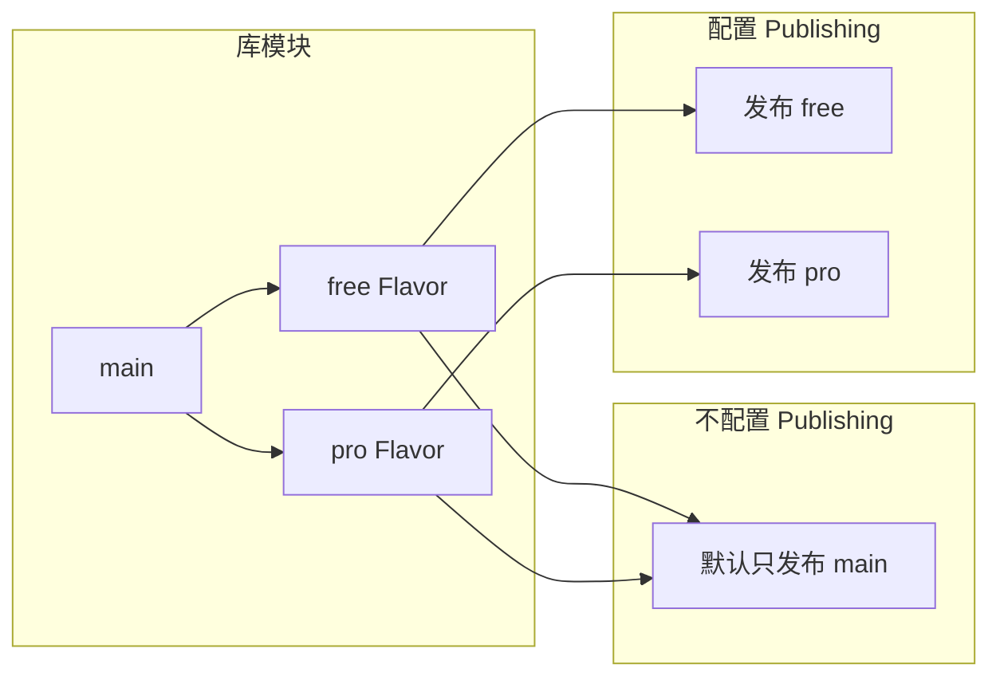
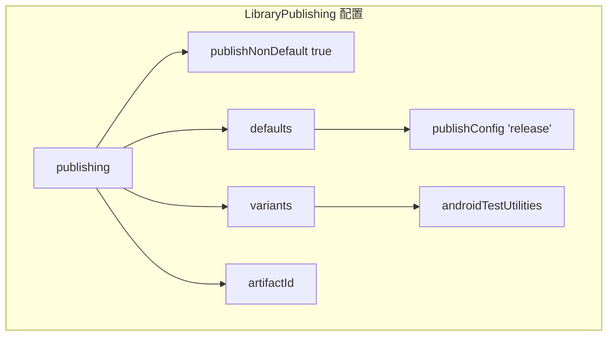
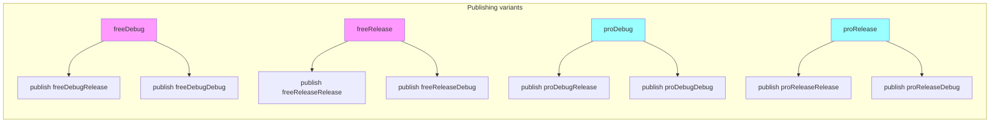
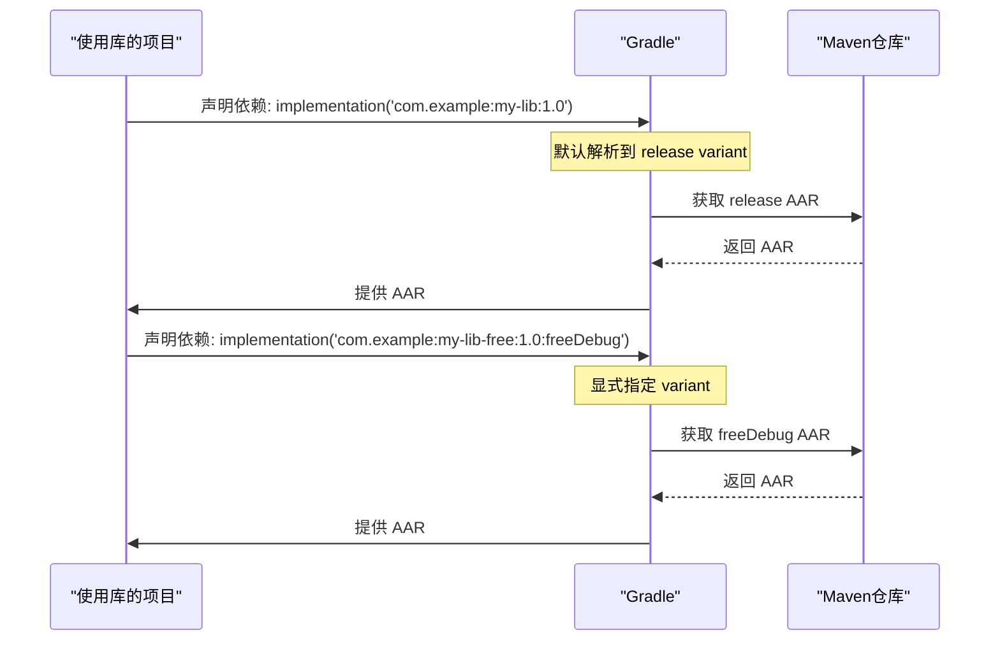
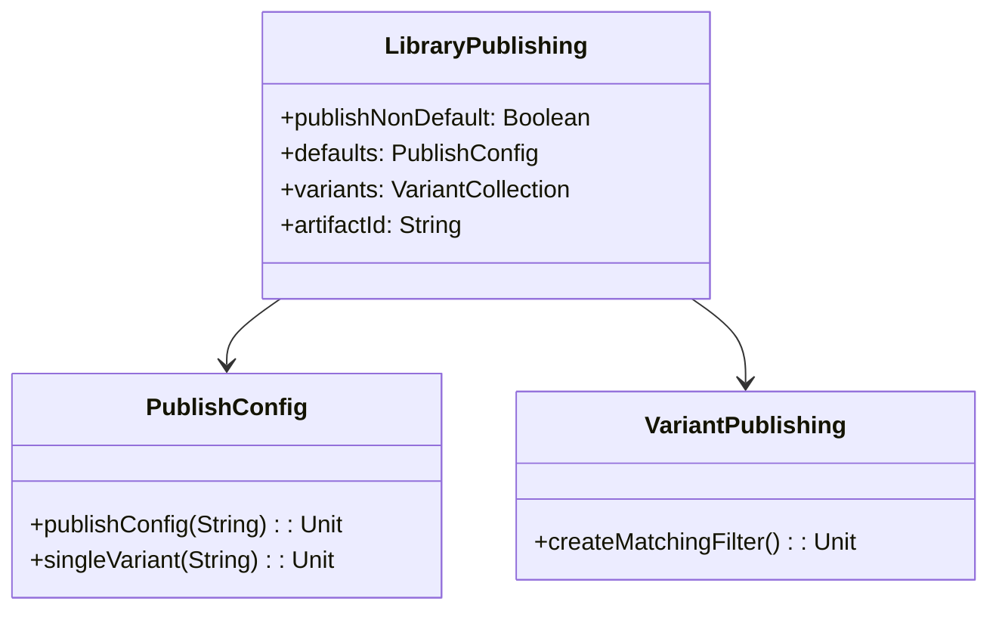

# 21.1.156 图书馆出版

太阳快要沉到山的那一边去了。

洛芙托着腮帮子，盯着白板上刚刚画好的 Product Flavor 配置图发呆。黛琳写的那些 `productFlavors` 代码她看懂了，但总觉得自己漏掉了什么。

"总觉得……好像缺了点什么？"洛芙喃喃自语。

希尔正好从器材箱里翻出一根烤肉串，咬了一口，含糊不清地说："你漏的是 publishing。Flavor 就像给库模块穿上不同的衣服，但衣服做好了，得有人来收、走秀、发货啊。"

"发货？"洛芙眨眨眼，"库模块也要'发货'的吗？"

伊莎笑着把垂到眼前的发丝拨到耳后："当然啦。库模块最终是要被其他项目引用的，这个过程就像把书出版一样——要让别人能读到你的'书'，就得做好出版发行的工作。"

黛琳点点头，适时地举起白板笔："所以今天我们要学的，就是 LibraryPublishing——图书馆出版配置。它决定了你的库模块会以什么样的'版本'、'面貌'出现在别人的项目里。"

---

## 问题发现：库模块的"出版困境"

洛芙皱起鼻子："可是……库模块直接 publish 不就好了吗？为什么要配置这么多东西？"

"问得好。"黛琳在白板上画了一个简单的对比图，"假设我们有一个库模块，配置了 free 和 pro 两个 Flavor——"



"你看，如果不配置 publishing，默认情况下库模块只会发布 `main` source set 的内容。"黛琳点了点图，"也就是说，你辛辛苦苦配置的 Flavor，根本不会被发布出去！"

"啊！"洛芙惊呼，"那别人用我们的库，岂不是永远只能用免费版？"

"对，就是这么残酷。"希尔已经从背包里拿出笔记本，"所以我们需要在 build.gradle 里配置 publishing，让不同的 Flavor 都能被发布出去。"

---

## 解决方案：配置 LibraryPublishing

黛琳把白板擦干净，画出一个完整的 publishing 配置结构：



"这是基本的配置结构。"黛琳边画边解释，"核心是 `publishNonDefault(true)`，它告诉 Gradle：我要发布非默认的 variant，不只是 main。"

"等等，"洛芙举手，"'默认的'是指什么？"

"默认的就是 release variant。"伊莎接话，"如果不特别配置，Gradle 只会在发布时使用 release 版本。但我们配置了 Flavor，就希望能发布 Flavor 相关的版本。"

希尔敲开笔记本，调出一个实际的配置示例：

```kotlin
// build.gradle (library module)
android {
    // ... Flavor 配置
    flavorDimensions += "version"
    productFlavors {
        create("free") {
            dimension = "version"
            buildConfigField("Boolean", "IS_PREMIUM", "false")
        }
        create("pro") {
            dimension = "version"
            buildConfigField("Boolean", "IS_PREMIUM", "true")
        }
    }
    
    // 这里是 Publishing 配置！
    publishing {
        // 关键配置：发布非默认 variant
        publishNonDefault(true)
        
        // 配置默认发布的 variant
        defaults {
            // 指定默认发布 release variant
            publishConfig("release")
        }
        
        // 为每个 Flavor-variant 组合配置发布
        // freeDebug, freeRelease, proDebug, proRelease
    }
}
```

"等等，"洛芙又发现问题了，"我只看到了 `defaults`，但每个 Flavor 怎么分别发布呢？"

黛琳笑了："这个问题问得好。实际上，当我们设置 `publishNonDefault(true)` 后，Gradle 会自动为每个 variant 创建对应的发布 variant。比如 `free` Flavor + `debug` Build Type = `freeDebug` variant，会自动发布为 `freeDebug` artifact。"

"这么智能？"洛芙瞪大眼睛。

"但我们需要指定用哪个 buildConfig。"希尔补充道，"看代码里的 `publishConfig('release')`，它表示默认情况下发布的配置是 release。如果我们想改变这个行为——比如让 free Flavor 默认发布 release 版本，pro Flavor 默认发布 debug 版本——就需要更精细的配置。"

---

## 深入配置：为不同 Flavor 指定发布配置

黛琳重新画了一个更复杂的配置图：



"每个 Flavor-variant 组合都会生成对应的 publish variant。"黛琳解释道，"比如 `freeDebug` variant 会生成 `freeDebugRelease` 和 `freeDebugDebug` 两个 publish variant——前者使用 release buildConfig，后者使用 debug buildConfig。"

洛芙挠挠头："所以我可以指定某些 Flavor 只能发布特定的 buildConfig？"

"对，就是这个意思。"希尔打开另一个示例，"来看更精细的配置："

```kotlin
android {
    publishing {
        // 为特定的 variant 组合配置发布
        singleVariant("freeRelease") {
            // 这个 variant 只发布 release 配置
            // 不会生成 freeReleaseDebug publish variant
        }
        
        // 或者批量配置
        variants {
            // 匹配所有 free 开头的 variant
            createMatchingFilter { it.name.startsWith("free") }
        }
    }
}
```

"这个 `singleVariant` 很实用。"希尔补充道，"它告诉 Gradle：这个 variant 只发布一种配置，不需要生成两个 publish variant。"

"我明白了！"洛芙兴奋地说，"这就像出版社只出一版书，不需要分精装版和平装版！"

伊莎温柔地笑了："这个比喻不错。不过实际用途是——减少发布的 variant 数量，让依赖你库的项目更容易选择。"

---

## 配置artifactId和groupId

黛琳在白板上写下新的配置项：

"除了发布哪些 variant，有时候我们还需要配置发布的 artifact 信息——比如 artifactId。"

```kotlin
android {
    publishing {
        // 为每个 variant 设置不同的 artifactId
        // 这样在依赖管理中就能区分
        
        // 如果不设置，默认使用 module name 作为 artifactId
        
        // 还可以设置 groupId（通常在项目根目录的 gradle.properties 中统一设置）
    }
}

// gradle.properties 中
# android.defaults.buildfeatures.groupid=com.example.mygroup
```

"等等，"洛芙突然想到一个问题，"如果我发布了多个 variant，别人怎么知道用哪个？"

"好问题。"黛琳画了一个依赖示意图：



"默认情况下，Gradle 会自动解析到 release variant。"黛琳解释道，"但如果你想使用特定 variant，可以在依赖声明中显式指定，比如 `freeDebug` 或 `proRelease`。"

"原来如此！"洛芙连连点头，"那这样的话，如果我只发布了某些 variant，就必须告诉用我们库的人要用哪个 variant？"

"对，这就是为什么合理配置 publishing 很重要。"希尔说，"要不然别人用错了 variant，运行时会出很奇怪的问题。"

---

## 反模式：Publishing 配置常见错误

黛琳的表情变得严肃起来："接下来我们要讲几个常见的错误配置，这是很多人会踩的坑。"

### 反模式一：忘记设置 publishNonDefault

```kotlin
// ❌ 错误示例
android {
    flavorDimensions += "version"
    productFlavors {
        create("free") { ... }
        create("pro") { ... }
    }
    
    // 没有配置 publishing！
    // 结果：只发布 main source set 的内容
}
```

"这样配置后，free 和 pro Flavor 的代码根本不会被发布出去！"黛琳严肃地说。

```kotlin
// ✅ 正确示例
android {
    // ... flavor 配置
    
    publishing {
        publishNonDefault(true)
    }
}
```

### 反模式二：dimension 未设置导致 flavor 无法工作

```kotlin
// ❌ 错误示例
android {
    productFlavors {
        create("free") {
            // 忘记设置 dimension！
            buildConfigField("Boolean", "IS_PREMIUM", "false")
        }
    }
    
    publishing {
        publishNonDefault(true) // 这时候就会报错或警告
    }
}
```

"Flavor 必须指定 dimension，否则 product flavor 无法正常工作。"黛琳补充。

```kotlin
// ✅ 正确示例
android {
    flavorDimensions += "version"
    productFlavors {
        create("free") {
            dimension = "version"
            buildConfigField("Boolean", "IS_PREMIUM", "false")
        }
    }
}
```

### 反模式三：同时发布太多 variant 导致依赖冲突

```kotlin
// ❌ 错误示例 - 发布所有 variant
android {
    // 所有 variant 都被发布
    // freeDebug, freeRelease, proDebug, proRelease
    // debug, release ... 
    
    publishing {
        publishNonDefault(true)
    }
}
```

"有时候variant太多也不是好事。"希尔说，"当心别人在依赖时出现选择困难，甚至选错 variant。"

```kotlin
// ✅ 正确示例 - 只发布必要的 variant
android {
    publishing {
        // 只发布 release 相关的 variant
        // 减少发布数量，降低复杂度
        singleVariant("freeRelease")
        singleVariant("proRelease")
    }
}
```

---

## 实践：配置一个完整的库发布

希尔把笔记本转过来，面向大家："现在我们来完整配置一个库模块的 publishing，确保每个部分都理解到位。"

```kotlin
// Library module: my-lib/build.gradle.kts

plugins {
    id("com.android.library")
    id("org.jetbrains.kotlin.android")
}

android {
    namespace = "com.example.mylib"
    compileSdk = 34

    defaultConfig {
        minSdk = 21
        // ... 其他配置
    }

    buildTypes {
        release {
            isMinifyEnabled = true
            proguardFiles(
                getDefaultProguardFile("proguard-android-optimize.txt"),
                "proguard-rules.pro"
            )
        }
        debug {
            isMinifyEnabled = false
        }
    }

    // 1. 定义 Flavor dimension
    flavorDimensions += "version"

    // 2. 配置 Product Flavor
    productFlavors {
        create("free") {
            dimension = "version"
            // 免费版配置
            buildConfigField("Boolean", "IS_PREMIUM", "false")
            buildConfigField("Int", "MAX_ITEMS", "10")
        }
        create("pro") {
            dimension = "version"
            // 专业版配置
            buildConfigField("Boolean", "IS_PREMIUM", "true")
            buildConfigField("Int", "MAX_ITEMS", "Integer.MAX_VALUE")
        }
    }

    // 3. 配置 Publishing
    publishing {
        // 关键：发布非默认 variant
        publishNonDefault(true)

        // 配置默认发布行为
        defaults {
            // 默认发布 release 配置
            publishConfig("release")
        }

        // 4. 配置 artifactId
        // 默认使用 module name（my-lib）作为 artifactId
        // 可以在这里覆盖：
        // artifactId = "my-lib-custom"

        // 5. 为特定 variant 配置单一发布
        // 这样只发布 release 配置，不生成 debug 版本
        singleVariant("freeRelease") {
            // 可以在这个 block 里进一步配置
        }
        singleVariant("proRelease") {
            // pro Release 也只发布一种配置
        }
    }
}

// 依赖配置
dependencies {
    // ...
}
```

"这个配置看起来好复杂。"洛芙缩了缩脖子，"但好像每一步都有道理。"

"其实一步一步来就清楚了。"伊莎安慰道，"先想清楚你要发布哪些 variant，然后再逐个配置。"

黛琳补充："而且很多配置是有默认值的，我们只需要在需要特别处理的时候才写。比如 artifactId 大多数时候不需要改。"

---

## 验证：发布配置是否生效

希尔打开终端，展示了如何验证 publishing 配置：

```bash
# 查看所有可发布的 variants
./gradlew my-lib:projects

# 或者使用更详细的命令
./gradlew my-lib:tasks --group=publishing
```

输出示例：

```
> Task :my-lib:projects
Group: Publishing
Description: Publishes the build artifacts.
----------------------------------------------
publishFreeDebugPublicationToMavenLocal
publishFreeReleasePublicationToMavenLocal
publishProDebugPublicationToMavenLocal
publishProReleasePublicationToMavenLocal
publishDebugPublicationToMavenLocal
publishReleasePublicationToMavenLocal

BUILD SUCCESSFUL
```

"看到这些任务就说明配置成功了。"希尔解释道，"每个 variant 都对应一个 publish 任务。"

"原来如此！"洛芙连连点头，"这样就能看到哪些 variant 被发布了。"

"如果使用 `singleVariant` 配置了某些 variant，"黛琳补充，"对应的 debug publish 任务就会消失——这正是我们想要的结果。"

---

夜已经完全降临了。

帐篷边点起了篝火，萤火虫在草丛中一闪一闪地飞着，像天上的星星落到了地上。湖面上倒映着月光，轻轻地摇晃着。

洛芙靠在枕头上，手里还拿着黛琳打印的配置清单："今天学的 publishing 比 Flavor 还复杂一点——不过核心思想是一样的：让正确的内容出现在正确的地方。"

"对。"黛琳把白板收起来，"Flavor 决定了库有哪些'版本'，Publishing 决定了这些版本怎么'发行'。两者配合，才能让库模块真正发挥作用。"

伊莎轻轻拨弄着吉他弦："所以下次别人要用我们的库，我们就可以告诉他们：想要免费版用 `my-lib-free:1.0`，想要专业版用 `my-lib-pro:1.0`，很清楚！"

希尔打了个响指："就是这样。好啦，今天辛苦了，明天我们继续看 Publishing 还有哪些高级玩法！"

---

## 专业技术总结

> LibraryPublishing 是 Android Gradle Plugin 提供的 DSL，用于配置 Android 库模块的发布行为。它决定了哪些 variant 会被发布到依赖管理器（如 Maven）中供其他项目使用。

#### 结构图



#### 反模式与陷阱

1. **未设置 publishNonDefault**：Flavor 配置了但不会发布，必须显式设置 `publishNonDefault(true)`
2. **Flavor 未指定 dimension**：会导致 flavor 无法正常工作，publishing 配置也会受影响
3. **发布过多 variant**：增加依赖选择的复杂度，建议使用 `singleVariant` 限制
4. **混淆 variant 和 publish variant**：每个 variant 会生成两个 publish variant（debug/release），需理解对应关系

#### 设计哲学

- **按需发布**：只发布需要的 variant，避免不必要的复杂性
- **显式优于隐式**：通过配置明确指定发布行为，Gradle 默认行为往往不符合预期
- **版本隔离**：不同 Flavor 作为独立 artifact 发布，避免版本冲突

#### 🏕️ 动手练习

**目标**：为一个库模块配置完整的 publishing，使其支持 free 和 pro 两个 Flavor 的差异化发布。

**步骤**：

1. 在 Android 项目中创建一个新的 library module：`my-lib`
2. 配置 `flavorDimensions` 和两个 product flavors：`free` 和 `pro`
3. 在 `android` block 中添加 `publishing` 配置
4. 设置 `publishNonDefault(true)`
5. 使用 `singleVariant` 配置只发布 release variant
6. 运行 `./gradlew my-lib:tasks --group=publishing` 验证配置
7. 尝试发布到本地 Maven：`./gradlew my-lib:publishFreeReleasePublicationToMavenLocal`

**验收标准**：

- [ ] 库 module 成功创建并编译
- [ ] 配置了 `free` 和 `pro` 两个 Flavor
- [ ] `publishNonDefault(true)` 已设置
- [ ] 使用 `singleVariant` 限制了发布 variant
- [ ] 执行验证命令可以看到预期的 publish 任务
- [ ] 发布成功后在 `~/.m2/repository` 下可以看到 AAR 文件

**提示**：

```kotlin
// 关键配置结构
android {
    flavorDimensions += "version"
    productFlavors {
        create("free") {
            dimension = "version"
            // ...
        }
        create("pro") {
            dimension = "version"
            // ...
        }
    }
    
    publishing {
        publishNonDefault(true)
        
        // 只发布 release variant
        singleVariant("freeRelease")
        singleVariant("proRelease")
    }
}
```

#### 面试热身

1. 为什么要设置 `publishNonDefault(true)`？不设置会发生什么？
2. 解释 variant 和 publish variant 的关系。
3. `singleVariant` 的作用是什么？什么场景下需要使用？
4. 如果想让不同 Flavor 发布到不同的 artifactId，怎么配置？
5. 发布多个 variant 有什么潜在问题？如何避免？

#### 参考实现要点

1. 始终显式设置 `publishNonDefault`，即使 Gradle 可能会推断
2. 使用 `singleVariant` 减少不必要的 variant 发布，降低依赖复杂度
3. Flavor 必须指定 dimension，否则 product flavor 无法正常工作
4. 在库模块的 build.gradle 中配置 publishing，而非 app 模块
5. 验证配置后，使用 `publishToMavenLocal` 任务测试实际发布行为
6. 文档化库的 variant 选择方式，方便依赖方正确使用

> 学习建议：LibraryPublishing 是库模块发布的关键配置，理解它才能让自定义的 Flavor 真正被其他项目使用。建议先从简单的单 Flavor 开始，验证发布行为后再增加复杂度。

---

## 洛芙的小小日记本

今天学 Publishing 的时候，我想到书店里的书架——不同出版社、不同系列的书摆在一起，但每本书都有自己独特的位置。Flavor 就像书的不同版本，Publishing 则是决定把它们放到哪个书架上。配置好了，开发者就能像在书店里一样轻松地找到并"买走"他们需要的版本！

---

## 今日关键词

- **LibraryPublishing**：Android Gradle Plugin 的 DSL，用于配置库模块的发布行为
- **publishNonDefault**：设置为 true 时，发布非默认 variant（即除 main 外的 variant）
- **variant**：Android 构建变体，由 Build Type 和 Product Flavor 组合而成
- **publish variant**：每个 variant 对应的发布产物，如 freeDebug 会生成 freeDebugRelease 和 freeDebugDebug 两个 publish variant
- **singleVariant**：配置某个 variant 只发布单一配置，减少生成的 publish variant 数量
- **artifactId**：发布到 Maven 仓库时的标识符，用于在依赖中唯一识别
- **buildConfig**：Build Type 的配置对象，决定了 debug 或 release 的构建行为
- **Maven 本地仓库**：本地缓存构建产物的仓库，通过 `publishToMavenLocal` 任务发布
- **dimension**：Product Flavor 必须指定的维度，用于区分不同维度的 flavor