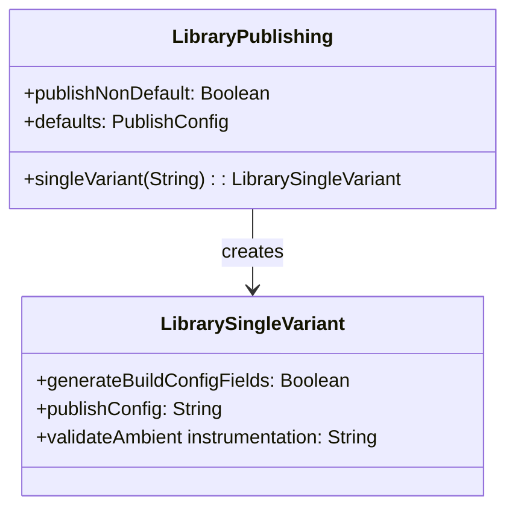
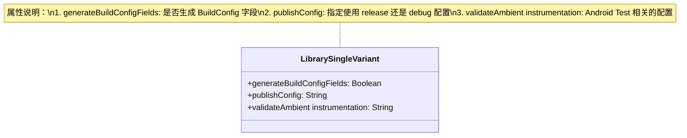
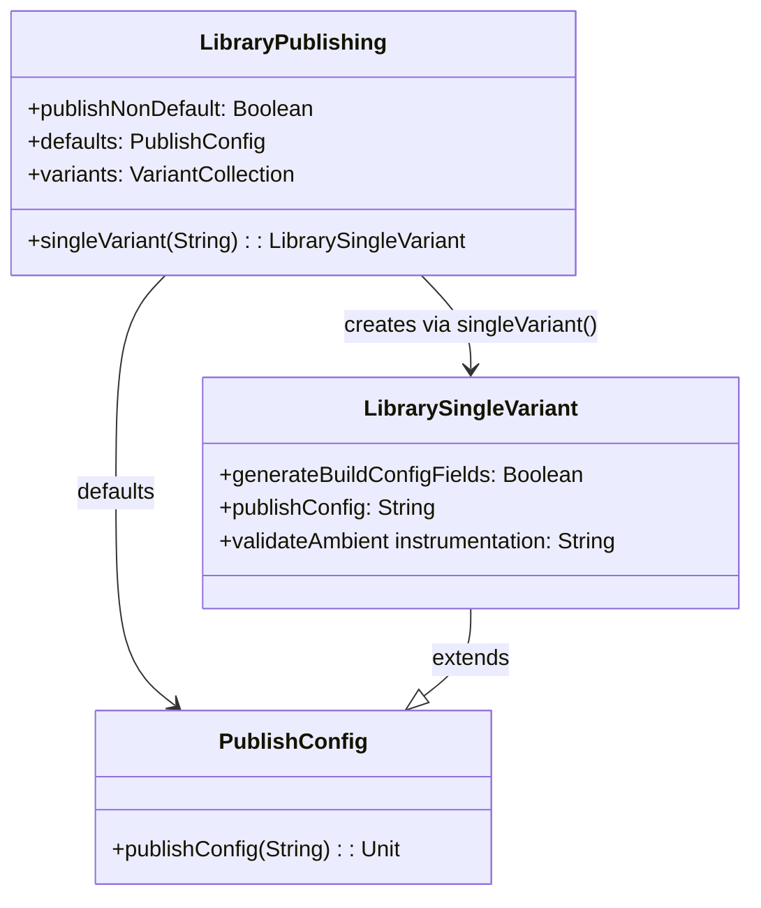

# 21.1.157 库单一变体

夜已经深了。

湖面像一块黑色的绸缎，静静地铺展在帐篷前方。偶尔有鱼跃出水面的声音，清脆地"啪"一声，然后一切又归于平静。篝火的火苗在夜风中轻轻摇曳，把四个女孩的影子拉得很长很长。

洛芙靠在枕头上，膝盖上放着黛琳的笔记本电脑。屏幕上显示着刚才配置好的 publishing 任务列表，她数了一遍又一遍。

"黛琳，"洛芙抬起头，"我发现一个问题——我们配置了 free 和 pro 两个 Flavor，每个 Flavor 会生成 debug 和 release 两个 Build Type，那是不是要发布 2 × 2 = 4 个 variant 啊？"

黛琳正在往篝火里添木柴，听到这话回过头来："理论上是这样的。freeDebug、freeRelease、proDebug、proRelease，四个 variant 都会生成对应的 publish 任务。"

"四个？"洛芙瞪大眼睛，"这么多！那别人用我们的库，岂不是要挑花眼？"

伊莎轻轻笑了笑，从口袋里摸出一根烤棉花糖："所以咯，今天白天我们学的 `singleVariant` 就是来解决这个问题的。它能让每个 Flavor 只发布一种 Build Type，少一半呢。"

"可是 `singleVariant` 到底怎么用啊？"洛芙追问道，"白天希尔演示的时候，我有点跟不上节奏。"

希尔正好从背包里翻出她的移动硬盘："就知道你会问！来，我们今晚就着篝火，来仔细看看这个 LibrarySingleVariant 到底是何方神圣。"

---

## 问题发现：variant 太多也有烦恼

希尔把移动硬盘接上笔记本电脑，屏幕上出现了一个项目结构。她调出一个库模块的 build.gradle：

"看，这是我们之前的配置。设置了 `publishNonDefault(true)` 之后，Gradle 会为每个 variant 生成对应的 publish 任务。"

```kotlin
android {
    flavorDimensions += "version"
    
    productFlavors {
        create("free") {
            dimension = "version"
            buildConfigField("Boolean", "IS_PREMIUM", "false")
        }
        create("pro") {
            dimension = "version"
            buildConfigField("Boolean", "IS_PREMIUM", "true")
        }
    }
    
    publishing {
        publishNonDefault(true)
    }
}
```

希尔敲了一条命令 `./gradlew :my-lib:tasks --group=publishing`，屏幕上刷出一长串任务：

```
publishFreeDebugPublicationToMavenLocal
publishFreeReleasePublicationToMavenLocal
publishProDebugPublicationToMavenLocal
publishProReleasePublicationToMavenLocal
publishDebugPublicationToMavenLocal
publishReleasePublicationToMavenLocal
```

"你看，六个任务！"希尔数给她们看，"其实这里还没算 main source set 的默认发布，就已经是六个了。"

洛芙捂住了嘴巴："六个……那如果以后我们再加 Build Type，或者再加 Flavor，这数量不是要爆炸？"

"对，就是这个问题。"黛琳不知什么时候已经坐了过来，"当 variant 数量爆炸的时候，依赖你库的人会很困惑——到底该用哪个？而且有些 variant 根本没必要发布，比如 debug 版本通常只用于开发测试。"

伊莎把烤好的棉花糖递给洛芙："所以我们需要一种方式，能够精确控制每个 Flavor 只发布一种配置。这就是 LibrarySingleVariant 发挥作用的地方。"

---

## 解决方案：认识 LibrarySingleVariant

希尔把白板搬了过来，就着篝火的光画起图来：

"首先，我们要理解一个概念——什么是 LibrarySingleVariant？"

她在白板上写下几个大字，然后画了一个简单的类图：



"看这个图。"希尔指着图解释道，"当我们调用 `singleVariant('freeRelease')` 时，Gradle 会创建一个 `LibrarySingleVariant` 对象来管理这个特定 variant 的发布行为。"

洛芙歪着头看图："所以 LibrarySingleVariant 就是用来描述'我要发布哪个 variant、怎么发布'的对象？"

"对，就是这个意思。"希尔打了个响指，"它里面有四个主要属性——"

黛琳补充道："我來在白板上标註每一个屬性的作用吧。"



"第一个 `generateBuildConfigFields` 很有意思。"希尔解释道，"如果你设置为 `true`，Gradle 会为这个 variant 生成 BuildConfig.java 文件，里面包含你在 build.gradle 里定义的 `buildConfigField`。如果是 `false`，就不会生成。"

"那第二个呢？"洛芙问。

"第二个 `publishConfig`，它决定了发布时使用哪个 build configuration——release 还是 debug。"黛琳接话，"第三个 `validateAmbient instrumentation` 是关于测试的，通常保持默认就行。"

---

## 深入配置：singleVariant 的用法

希尔调出具体的代码示例：

"来看实际怎么用。刚才我们不是有四个 variant 吗？如果我们只想发布 release 版本，就可以这样配置："

```kotlin
android {
    // ... flavor 和 buildType 配置
    
    publishing {
        publishNonDefault(true)
        
        // 使用 singleVariant 配置单个 variant
        singleVariant("freeRelease") {
            // 这个 block 的类型就是 LibrarySingleVariant
            // 配置这个 variant 的发布行为
            
            // 是否生成 BuildConfig 字段
            // 默认 true
            generateBuildConfigFields = true
            
            // 指定使用哪个 buildConfig
            // 默认是 'release'
            // 可以显式指定
            publishConfig = "release"
        }
        
        singleVariant("proRelease") {
            generateBuildConfigFields = true
            publishConfig = "release"
        }
    }
}
```

洛芙凑近屏幕看："所以这两个 `singleVariant` 调用，就只发布 freeRelease 和 proRelease 两个 variant？"

"对！"希尔笑道，"现在你再跑一次那个 tasks 命令，看看输出有什么变化。"

洛芙兴奋地敲下命令，屏幕上立刻显示出精简后的任务列表：

```
publishFreeReleasePublicationToMavenLocal
publishProReleasePublicationToMavenLocal
```

"哇！从六个变成两个了！"洛芙欢呼起来，"这也太神奇了吧！"

伊莎轻轻拍了拍手："这样一来，别人在依赖我们的库时，就只能看到 release 版本，不用纠结该选哪个了。"

---

## 进阶用法：批量配置与过滤

黛琳看着洛芙兴奋的样子，笑着说："不过有时候一个个写 `singleVariant` 也很麻烦——如果你有很多 variant 的话。Gradle 还提供了更方便的批量配置方式。"

"批量？"洛芙眨眨眼，"怎么批量？"

黛琳在白板上画了一个新的流程图：

```mermaid
graph TD
    subgraph "批量配置方式"
        A[单个配置] --> B[singleVariant('variantName')]
        A --> C[variants matching filter]
        A --> D[all]
    end
    
    style A fill:#f9f,color:#333
    style B fill:#9ff,color:#333
    style C fill:#9ff,color:#333
    style D fill:#9ff,color:#333
```

"第一种是单个配置，我们已经看过了。"黛琳解释道，"第二种是 `variants` 方法，它接受一个过滤器函数，可以批量匹配符合条件的 variant。"

希尔敲出一段代码示例：

```kotlin
android {
    publishing {
        publishNonDefault(true)
        
        // 批量配置：只发布所有 release variant
        variants {
            createMatchingFilter { variant ->
                // 匹配所有名字以 Release 结尾的 variant
                variant.name.endsWith("Release")
            }
        }
        
        // 或者另一种写法：使用 all
        all {
            // 对所有发布的 variant 都应用这个配置
            // generateBuildConfigFields = true (默认)
        }
    }
}
```

洛芙歪着头看："这个 `variants` 和 `all` 好像都挺方便的，它们有什么区别吗？"

黛琳点点头："好问题。`variants` 配合 `createMatchingFilter` 让你能够精确地选择哪些 variant 要发布，哪些不要。而 `all` 会对所有被发布的 variant 应用相同的配置。"

"我明白了！"洛芙举手，"就好比——`variants` 是挑出特定的几个 Flavor 来发布，`all` 是给所有 Flavor 统一着装！"

伊莎被这个比喻逗笑了："这个比喻很形象！所以如果你想让所有 Flavor 都穿一样的衣服（使用相同的配置），就用 `all`；如果想分别穿不同的衣服，就用 `singleVariant` 或 `variants` 配合过滤器。"

---

## 反模式：singleVariant 配置常见错误

黛琳的表情变得认真起来："不过，用 singleVariant 的时候也有几个常见的坑，大家要注意。"

她竖起一根手指："第一个坑：variant 名字写错。"

```kotlin
// ❌ 错误示例
android {
    publishing {
        singleVariant("free") {
            // 注意：这里只写了 "free"
            // 但实际 variant 名字是 "freeRelease" 或 "freeDebug"
            // 这样配置不会生效！
        }
    }
}
```

"variant 的全名是 Flavor + BuildType 的组合。"黛琳强调，"比如 `freeRelease`、`proDebug`，只写 `free` 是不行的。"

洛芙赶紧记笔记："那怎么知道正确的 variant 名字呢？"

"看 Tasks 输出。"希尔说，"之前我们跑 `./gradlew :my-lib:tasks --group=publishing` 时，任务名就是 variant 名字。比如 `publishFreeReleasePublicationToMavenLocal`，去掉前面的 `publish` 和后面的 `PublicationToMavenLocal`，中间就是 `FreeRelease`。"

黛琳竖起第二根手指："第二个坑：在 singleVariant 块里设置冲突的配置。"

```kotlin
// ❌ 错误示例
android {
    publishing {
        // 同时对同一个 variant 设置了冲突的配置
        singleVariant("freeRelease") {
            // 这里设置 publishConfig = "debug"
            publishConfig = "debug"
            // 但 variant 名字本身就是 release
            // 这会导致不一致！
        }
    }
}
```

"这个一定要小心。"黛琳说，"如果你配置的是 `freeRelease`，那 `publishConfig` 最好保持默认的 `release`，或者显式写成 `release`。写成 `debug` 虽然不会报错，但会让代码变得难以理解。"

伊莎补充道："第三个坑：忘记先设置 `publishNonDefault(true)`。"

```kotlin
// ❌ 错误示例
android {
    publishing {
        // 没有设置 publishNonDefault
        // 单个 variant 配置可能会被忽略
        singleVariant("freeRelease") { ... }
    }
}
```

"必须先告诉 Gradle：我要发布非默认的 variant！"黛琳强调，"然后才能用 singleVariant 来精细控制。"

---

## 实践：配置完整的 singleVariant

希尔把笔记本转过来，面向大家："来，我们一起配置一个完整的例子，把今天学的所有知识都用上。"

```kotlin
// my-lib/build.gradle.kts

plugins {
    id("com.android.library")
    id("org.jetbrains.kotlin.android")
}

android {
    namespace = "com.example.mylib"
    compileSdk = 34

    defaultConfig {
        minSdk = 21
    }

    buildTypes {
        release {
            isMinifyEnabled = true
            proguardFiles(
                getDefaultProguardFile("proguard-android-optimize.txt"),
                "proguard-rules.pro"
            )
        }
        debug {
            isMinifyEnabled = false
        }
    }

    // 1. 定义 Flavor dimension
    flavorDimensions += "version"

    // 2. 配置 Product Flavor
    productFlavors {
        create("free") {
            dimension = "version"
            buildConfigField("Boolean", "IS_PREMIUM", "false")
            buildConfigField("Int", "MAX_ITEMS", "10")
        }
        create("pro") {
            dimension = "version"
            buildConfigField("Boolean", "IS_PREMIUM", "true")
            buildConfigField("Int", "MAX_ITEMS", "Integer.MAX_VALUE")
        }
    }

    // 3. 配置 Publishing
    publishing {
        // 关键：发布非默认 variant
        publishNonDefault(true)

        // 4. 配置默认行为
        defaults {
            publishConfig("release")
        }

        // 5. 使用 singleVariant 精简发布列表
        // 只发布 release variant，不发布 debug variant
        singleVariant("freeRelease") {
            generateBuildConfigFields = true
            publishConfig = "release"
        }

        singleVariant("proRelease") {
            generateBuildConfigFields = true
            publishConfig = "release"
        }

        // 6. 也可以使用批量配置作为替代
        // variants {
        //     createMatchingFilter { it.name.endsWith("Release") }
        // }
    }
}
```

"这个配置看起来好干净！"洛芙感叹道，"从六个 publish 任务减到两个，而且清楚地标明了每个 Flavor 只发布 release 版本。"

黛琳点点头："而且关键的是，依赖我们库的项目现在只会看到两个选择：freeRelease 和 proRelease，不会再有选择困难。"

---

## 验证：检查 singleVariant 配置

希尔打开终端，演示如何验证配置：

```bash
# 查看发布任务
./gradlew :my-lib:tasks --group=publishing

# 查看生成的 Publication
./gradlew :my-lib:help --task=publishFreeReleasePublication
```

输出示例：

```
> Task :my-lib:help --task=publishFreeReleasePublication

Publication: freeRelease
Properties:
    name = freeRelease
    buildType = release
    flavor = free
    publishConfig = release
    generateBuildConfigFields = true
```

"看！这个输出清楚地显示了我们配置的所有属性。"希尔说，"name、buildType、flavor、publishConfig、generateBuildConfigFields，一目了然。"

洛芙盯着输出看了一会儿："我有个问题——如果我们同时配置了 `singleVariant` 和 `defaults`，它们会冲突吗？"

"好问题！"希尔说，"其实不会冲突。`defaults` 是全局默认配置，`singleVariant` 是针对特定 variant 的精细配置。如果某个属性在 singleVariant 里没设置，就会用 defaults 里的值；如果设置了，就会覆盖 defaults。"

"原来如此！"洛芙点头，"就像公司章程和员工手册——员工手册更具体，就按员工手册来；没有的规定，就按公司章程来。"

伊莎温柔地笑了："这个比喻很贴切。"

---

夜更深了。

湖面上飘着一层薄薄的雾气，把远处的山轮廓衬托得更加朦胧。萤火虫的数量好像更多了，它们在草丛中穿梭，像一粒粒会发光的小星星。

洛芙打了个哈欠，揉了揉眼睛："今天学的 LibrarySingleVariant 真是太有用了——以后再也不怕 variant 爆炸了。"

"对。"黛琳把白板收起来，"记住这个核心思路：Publishing 决定'发行什么'，singleVariant 决定'精简发行列表'。两者配合，才能让库模块的发布既完整又简洁。"

希尔把笔记本电脑合上："而且用 singleVariant 还有个好处——减少发布的 AAR 文件大小。因为 debug 版本通常会包含一些调试信息，不发布它们也能节省空间。"

伊莎轻轻拨弄着吉他弦："所以下次别人问我们，怎么控制库模块只发布特定版本——就把这个配置方法告诉他们。"

"晚安啦！"洛芙钻进了睡袋，"明天继续探索 publishing 的更多玩法！"

星空依旧璀璨，湖水轻轻拍打着岸边。夜晚的湖畔，四个女孩的帐篷里散发出温暖的光。

---

## 专业技术总结

> LibrarySingleVariant 是 Android Gradle Plugin 提供的 DSL，用于配置单个 variant 的发布行为。它是 `LibraryPublishing.singleVariant()` 方法的返回值，允许开发者精确控制每个 variant 是否发布、使用哪个 buildConfig、是否生成 BuildConfig 字段等。

#### 结构图



#### 复杂度与影响

- 使用 `singleVariant` 可以将发布的 variant 数量减半（从 4 个减到 2 个），简化依赖管理
- 减少发布 artifact 数量可降低 Maven 仓库存储空间占用
- 避免下游开发者选择错误的 variant，减少运行时问题

#### 反模式与陷阱

1. **variant 名字写错**：必须使用完整的 variant 名称（如 `freeRelease`），不能只写 Flavor 名称（如 `free`）
2. **冲突的 publishConfig**：在 `freeRelease` variant 中设置 `publishConfig = "debug"` 会造成混淆
3. **忘记设置 publishNonDefault**：在调用 `singleVariant` 之前必须先设置 `publishNonDefault(true)`
4. **过度精简**：如果库需要支持多版本调试，可能不适合使用 singleVariant

#### 设计哲学

- **按需发布**：只发布必要的 variant，避免给下游开发者造成选择负担
- **显式优先**：通过 singleVariant 明确指定每个 variant 的发布行为，而不是依赖隐式默认
- **配置一致性**：确保 variant 名称和 publishConfig 配置保持一致

#### 🏕️ 动手练习

**目标**：为一个库模块配置 singleVariant，实现精细化的发布控制。

**步骤**：

1. 创建一个 Android library module（如果没有的话）
2. 配置至少两个 product flavors（如 free、pro）
3. 配置 buildTypes（debug、release）
4. 在 publishing block 中设置 `publishNonDefault(true)`
5. 使用 `singleVariant` 配置只发布 release variant
6. 在 singleVariant 块中设置 `generateBuildConfigFields = true`
7. 运行 `./gradlew :your-lib:tasks --group=publishing` 验证
8. 查看 Publication 属性：`./gradlew :your-lib:help --task=publishFreeReleasePublication`

**验收标准**：

- [ ] 库 module 成功创建并编译
- [ ] 配置了至少两个 product flavors
- [ ] `publishNonDefault(true)` 已设置
- [ ] 使用 `singleVariant` 精减了发布列表
- [ ] 发布任务从 4+ 个减少到 2 个
- [ ] 可以通过 help task 查看 Publication 属性

**提示**：

```kotlin
android {
    flavorDimensions += "version"
    productFlavors {
        create("free") { dimension = "version" }
        create("pro") { dimension = "version" }
    }
    
    publishing {
        publishNonDefault(true)
        
        singleVariant("freeRelease") {
            generateBuildConfigFields = true
            publishConfig = "release"
        }
        
        singleVariant("proRelease") {
            generateBuildConfigFields = true
            publishConfig = "release"
        }
    }
}
```

#### 面试热身

1. LibrarySingleVariant 的主要作用是什么？为什么要使用它？
2. `singleVariant("freeRelease")` 和 `singleVariant("free")` 有什么区别？
3. 如果不设置 publishNonDefault 直接调用 singleVariant，会发生什么？
4. generateBuildConfigFields 属性有什么用？什么时候需要设置为 false？
5. 如何批量配置多个 variant 的发布行为？

#### 参考实现要点

1. **先配置 Publishing 基础**：先设置 publishNonDefault(true) 和 defaults，再配置 singleVariant
2. **variant 名称要完整**：使用 Flavor + BuildType 组合名称，如 freeRelease、proDebug
3. **保持配置一致性**：variant 名称和 publishConfig 值保持对应，避免混淆
4. **考虑下游开发者体验**：只发布必要的 variant，减少依赖选择的复杂度
5. **灵活使用过滤器**：当 variant 数量很多时，使用 variants + createMatchingFilter 批量配置

> 学习建议：在实际项目中，建议为库模块配置 singleVariant，只发布 release 版本。除非有特殊需求（如需要调试版本的库），否则不推荐发布 debug variant——这既简化了依赖管理，也避免了因选错 variant 导致的运行时问题。

---

## 洛芙的小小日记本

今天好累但是好开心！学会了用 singleVariant 控制库模块的发布——从六个任务精简到两个，再也不怕 variant 太多让人选花眼了。黛琳说得很对：想清楚用户需要什么，再给什么，这样才是最好的设计呀～

---

## 今日关键词

- **LibrarySingleVariant**：Android Gradle Plugin 提供的 DSL，用于配置单个 variant 的发布行为
- **singleVariant**：LibraryPublishing 的方法，用于创建 LibrarySingleVariant 对象
- **generateBuildConfigFields**：决定是否为该 variant 生成 BuildConfig.java 的布尔属性
- **publishConfig**：指定发布时使用哪个 build configuration（release 或 debug）
- **publishNonDefault**：必须设置为 true 才能发布非默认的 variant
- **variant**：Android 构建中的 Flavor + BuildType 组合，如 freeRelease、proDebug
- **publish variant**：用于发布的 variant 名称，比构建 variant 名称更长
- **createMatchingFilter**：variants 方法使用的过滤器函数，用于批量匹配 variant
