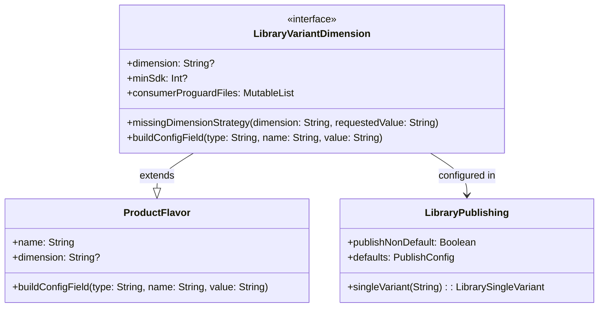
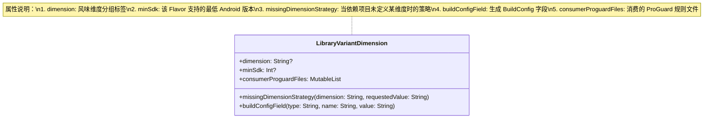
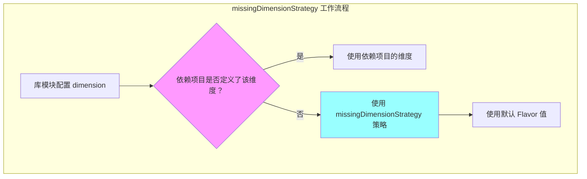
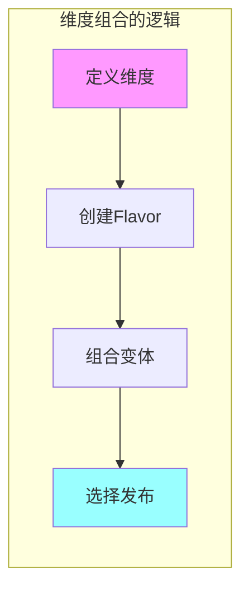
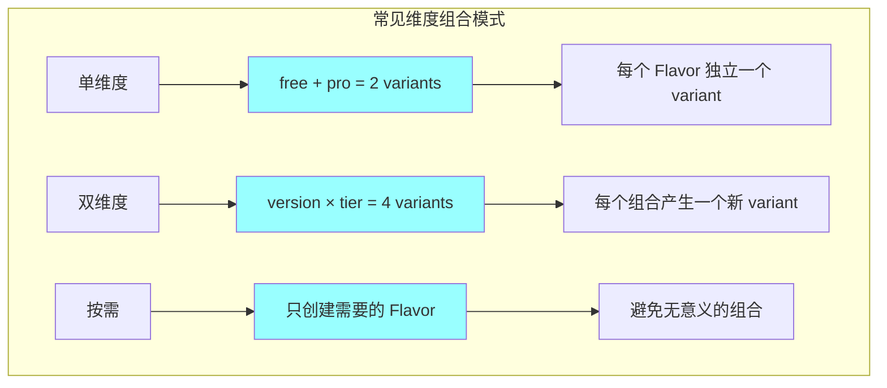
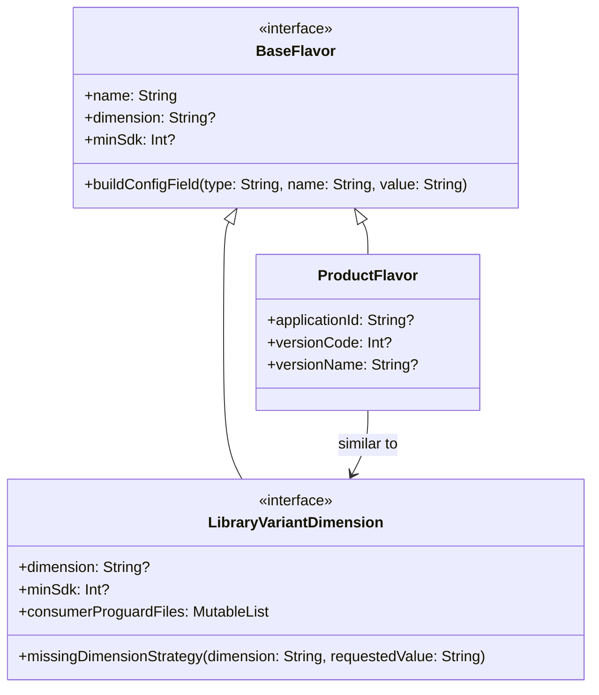

# 21.1.158 库变体维度

夜已经深了。

湖面像一块黑色的绸缎，静静地铺展在帐篷前方。偶尔有鱼跃出水面的声音，清脆地"啪"一声，然后一切又归于平静。篝火的火苗在夜风中轻轻摇曳，把四个女孩的影子拉得很长很长。

洛芙靠在枕头上，手里翻着黛琳给她的那本Gradle API手册。翻到某一页时，她的动作突然停住了。

"黛琳，"洛芙抬起头，"我看到有一个叫LibraryVariantDimension的东西……这个是不是和之前学的singleVariant有什么关系？"

黛琳正在往篝火里添木柴，听到这话回过头来："好问题！其实 LibrarySingleVariant 就是在 LibraryVariantDimension 的基础上构建的。今天我们学的就是这个dimension本身——它决定了你的库模块支持哪些'口味'的变体。"

"口味？"洛芙对这个比喻很感兴趣，"又是露营用品的比喻吗？"

希尔正好从背包里翻出她的移动硬盘："比那个更直接！来，我们今晚就着篝火，来仔细看看这个LibraryVariantDimension到底是何方神圣。"

---

## 问题发现：库模块也需要 Flavor 吗？

希尔把移动硬盘接上笔记本电脑，屏幕上出现了一个项目结构。她调出一个库模块的 build.gradle：

"看，这是一个库模块的配置。我们之前学的都是主App的 productFlavor，但其实库模块也可以有自己的 Flavor！"

```kotlin
android {
    namespace = "com.example.mylib"
    compileSdk = 34
    
    defaultConfig {
        minSdk = 21
    }
    
    // 库模块的 productFlavor
    flavorDimensions += "version"
    
    productFlavors {
        create("free") {
            dimension = "version"
            buildConfigField("Boolean", "IS_PREMIUM", "false")
        }
        create("pro") {
            dimension = "version"
            buildConfigField("Boolean", "IS_PREMIUM", "true")
        }
    }
}
```

洛芙歪着头看："库模块也可以有 free 和 pro？这不和主App重复了吗？"

"问得好！"黛琳坐了过来，"库模块的 Flavor 和主App的 Flavor 有本质区别。主App的 Flavor 是给最终用户看的，而库模块的 Flavor 是给依赖这个库的开发者看的。"

伊莎轻轻笑了笑，从口袋里摸出一根烤棉花糖："你可以这样理解——主App的 Flavor 像是餐厅的菜单（套餐A、套餐B），而库模块的 Flavor 更像是食材的等级（普通食材、有机食材）。用什么样的食材，决定了最后做出什么样的菜。"

"原来如此！"洛芙点头，"那 LibraryVariantDimension 就是用来配置这些'食材等级'的？"

"对，"希尔说，"而 dimension（维度）就是给这些 Flavor 分组的标签。"

---

## 解决方案：认识 LibraryVariantDimension

希尔把白板搬了过来，就着篝火的光画起图来：

"首先，我们要理解一个概念——什么是 LibraryVariantDimension？"

她在白板上写下几个大字，然后画了一个简单的类图：



"看这个图。"希尔指着图解释道，"LibraryVariantDimension 本质上是 ProductFlavor 的一个扩展接口，专门用于库模块。它定义了库模块在发布时如何处理 variant 维度。"

洛芙歪着头看图："所以它和普通的 ProductFlavor 差不多，但专门针对库模块？"

"对，就是这个意思。"希尔打了个响指，"不过它有几个独特的属性——"

黛琳补充道："让我来在白板上标注每一个属性的作用吧。"



"第一个 `dimension`，就是风味维度。"希尔解释道，"当你有多个 Flavor 时，需要用 dimension 来给它们分组。比如 free 和 pro 都属于 'version' 维度。"

"那第二个呢？"洛芙问。

"第二个 `minSdk`，它决定了当前 Flavor 支持的最低 Android 版本。"黛琳接话，"这很有用——比如你的库有一个高级功能需要 API 26，你可以创建一个 dimension 为 'high' 的 Flavor，minSdk 设为 26，而其他 Flavor 保持 minSdk 为 21。"

"原来如此！"洛芙兴奋地说，"这样就可以让不同的 Flavor 支持不同的 Android 版本！"

---

## 深入配置：missingDimensionStrategy

希尔调出具体的代码示例：

"第三个属性 `missingDimensionStrategy` 是最有趣的。来看实际怎么用。"

```kotlin
android {
    // 定义 Flavor 维度
    flavorDimensions += "version"
    flavorDimensions += "tier"
    
    productFlavors {
        // 第一组：version 维度
        create("free") {
            dimension = "version"
        }
        create("pro") {
            dimension = "version"
        }
        
        // 第二组：tier 维度
        create("basic") {
            dimension = "tier"
        }
        create("premium") {
            dimension = "tier"
        }
    }
}
```

洛芙数了一下："四个 variant——freeBasic、freePremium、proBasic、proPremium？"

"对！"希尔说，"这就是维度组合。但问题来了——如果依赖你这个库的主App没有定义 'tier' 这个维度怎么办？"

"这……会报错吗？"洛芙担心地问。

"不一定报错，但可能会有奇怪的行为。"黛琳说，"这时候 `missingDimensionStrategy` 就派上用场了。"

她在白板上画了一个新的流程图：



"missingDimensionStrategy 的作用就是在依赖项目没有定义某个维度时，提供一个默认值。"黛琳解释道，"它的参数有两个——第一个是维度名，第二个是默认使用的 Flavor 名。"

希尔敲出一段代码示例：

```kotlin
android {
    flavorDimensions += "version"
    flavorDimensions += "tier"
    
    productFlavors {
        create("free") { dimension = "version" }
        create("pro") { dimension = "version" }
        create("basic") { dimension = "tier" }
        create("premium") { dimension = "tier" }
    }
    
    // 配置 missingDimensionStrategy
    // 如果依赖项目没有定义 'tier' 维度，默认使用 'basic'
    missingDimensionStrategy = "tier", "basic"
}
```

洛芙歪着头看："这个配置的意思是——如果用我们库的那个人没有定义 tier 维度，就默认用 basic 这个 Flavor？"

"对！"希尔笑道，"这样即使依赖项目没有定义这个维度，库也能正常工作，不会出现奇怪的组合。"

伊莎轻轻拍了拍手："这就像露营时的备用方案——如果天气预报说天晴，但你准备了雨衣；如果下雨，你就用雨衣。missingDimensionStrategy 就是这个'雨衣'。"

---

## 反模式：dimension 配置常见错误

黛琳看着洛芙兴奋的样子，笑着说："不过，用 dimension 的时候也有几个常见的坑，大家要注意。"

她竖起一根手指："第一个坑：dimension 名字拼写错误。"

```kotlin
// ❌ 错误示例
android {
    // 注意：这里写的是 "tier"（层级）
    flavorDimensions += "tier"
    
    productFlavors {
        create("basic") {
            // 但这里写的是 "tiers"（复数）
            dimension = "tiers"
        }
    }
}
```

"dimension 的名字必须完全匹配。"黛琳强调，"'tier' 和 'tiers' 是两个不同的维度，这样配置会导致 Gradle 报错或者产生意外的行为。"

洛芙赶紧记笔记："那怎么知道正确的 dimension 名字呢？"

"看 build.gradle 中 flavorDimensions 的定义。"希尔说，"你定义了几个维度，就只能用这几个名字。"

黛琳竖起第二根手指："第二个坑：忘记在 flavorDimensions 中声明维度。"

```kotlin
// ❌ 错误示例
android {
    // 没有声明 tier 维度
    // flavorDimensions += "tier"  // 这行被注释掉了
    
    productFlavors {
        create("basic") {
            dimension = "tier"  // 但这里试图使用它
        }
    }
}
```

"必须先声明维度，才能使用它！"黛琳强调，"这是 Gradle 的硬性要求。"

伊莎补充道："第三个坑：在库模块中使用 applicationId。"

```kotlin
// ❌ 错误示例
android {
    // 库模块不应该设置 applicationId！
    defaultConfig {
        applicationId = "com.example.mylib"  // 错误！
    }
}
```

"库模块不是独立的应用，不需要 applicationId。"伊莎说，"如果你设置了，可能会导致构建冲突。"

---

## 实践：配置完整的 LibraryVariantDimension

希尔把笔记本转过来，面向大家："来，我们一起配置一个完整的例子，把今天学的所有知识都用上。"

```kotlin
// my-lib/build.gradle.kts

plugins {
    id("com.android.library")
    id("org.jetbrains.kotlin.android")
}

android {
    namespace = "com.example.mylib"
    compileSdk = 34

    // 1. 声明 Flavor 维度（必须！）
    flavorDimensions += "version"
    flavorDimensions += "tier"
    
    defaultConfig {
        minSdk = 21
        // 库模块不需要 applicationId
    }

    buildTypes {
        release {
            isMinifyEnabled = true
            proguardFiles(
                getDefaultProguardFile("proguard-android-optimize.txt"),
                "proguard-rules.pro"
            )
        }
        debug {
            isMinifyEnabled = false
        }
    }

    // 2. 配置 Product Flavor（LibraryVariantDimension 的核心）
    productFlavors {
        // version 维度：免费版 vs 付费版
        create("free") {
            dimension = "version"
            // 免费版配置
            buildConfigField("Boolean", "IS_PREMIUM", "false")
            buildConfigField("Int", "MAX_ITEMS", "10")
        }
        create("pro") {
            dimension = "version"
            // 付费版配置
            buildConfigField("Boolean", "IS_PREMIUM", "true")
            buildConfigField("Int", "MAX_ITEMS", "Integer.MAX_VALUE")
        }
        
        // tier 维度：基础版 vs 高级版
        create("basic") {
            dimension = "tier"
            // 基础版配置
            buildConfigField("Boolean", "HAS_ADVANCED_FEATURES", "false")
            minSdk = 21  // 基础版支持更老的系统
        }
        create("premium") {
            dimension = "tier"
            // 高级版配置
            buildConfigField("Boolean", "HAS_ADVANCED_FEATURES", "true")
            minSdk = 26  // 高级版需要更新的系统
        }
    }
    
    // 3. 配置 missingDimensionStrategy
    // 如果依赖项目没有定义 tier 维度，默认使用 basic
    missingDimensionStrategy = "tier", "basic"
    
    // 4. 配置 Publishing
    publishing {
        publishNonDefault(true)
        
        // 使用 singleVariant 精简发布列表
        singleVariant("freeRelease") {
            generateBuildConfigFields = true
        }
        
        singleVariant("proRelease") {
            generateBuildConfigFields = true
        }
        
        singleVariant("basicRelease") {
            generateBuildConfigFields = true
        }
        
        singleVariant("premiumRelease") {
            generateBuildConfigFields = true
        }
    }
}
```

洛芙盯着屏幕看了半天："这……会产生多少个 variant 啊？"

"我们来分析一下。"希尔掰着手指算，"version 维度有 2 个（free、pro），tier 维度有 2 个（basic、premium），buildType 有 2 个（debug、release）。所以总共是 2 × 2 × 2 = 8 个 variant！"

"8 个！"洛芙惊呼，"这么多！"

"对，所以我们在 publishing 里用 singleVariant 精简到只发布 4 个 release variant。"黛琳说，"这样既保留了 Flavor 的灵活性，又不会让下游开发者选择困难。"

---

## 验证：检查 dimension 配置

希尔打开终端，演示如何验证配置：

```bash
# 查看所有 variant
./gradlew :my-lib:tasks --group=android

# 查看具体的 variant
./gradlew :my-lib:variants
```

输出示例：

```
> Task :my-lib:variants

Variants:
  freeBasicDebug
  freeBasicRelease
  freePremiumDebug
  freePremiumRelease
  proBasicDebug
  proBasicRelease
  proPremiumDebug
  proPremiumRelease
```

"看！这个输出清楚地显示了所有 8 个 variant。"希尔说，"而且每个 variant 的名字都包含了它所属的维度。"

洛芙盯着输出看了一会儿："我有个问题——如果我们只想要一部分 variant，该怎么过滤？"

"好问题！"希尔说，"除了用 singleVariant，还可以在依赖项目那一边过滤。来看这个——"

她调出主App的配置：

```kotlin
// app/build.gradle.kts

android {
    // 主App也可以有自己的 Flavor
    flavorDimensions += "version"
    
    productFlavors {
        create("free") { dimension = "version" }
        create("pro") { dimension = "version" }
    }
    
    dependencies {
        // 依赖库模块的特定 variant
        // 使用 @\{variantName\} 来指定
        implementation(project(":my-lib", "freeRelease"))
    }
}
```

"原来可以用这种方式来指定依赖哪个 variant！"洛芙眼睛一亮，"这就好比点菜的时候说'我要套餐A加套餐C的配料'！"

伊莎被这个比喻逗笑了："这个比喻很形象！"

---

## 变体维度的组合艺术

黛琳看着洛芙兴奋的样子，笑着说："其实 dimension 的组合是有规律的，掌握了这个规律就能玩转库模块的变体。"

她在白板上画了一个新的图表：



"首先，你要把 dimension 理解为'分类标签'。"黛琳解释道，"每个 Flavor 必须属于一个 dimension，而 dimension 的组合决定了最终的 variant 数量。"

希尔补充道："常见的组合模式有三种——"



"第一种是单维度——最简单的情况。"希尔说，"free 和 pro 两个 Flavor，一个 dimension，产生 2 × 2 = 4 个 variant（加上 debug/release）。"

"第二种是双维度——进阶情况。"黛琳接话，"比如 version（免费/付费）× tier（基础/高级），产生 2 × 2 = 4 个 Flavor 组合，再乘以 buildType，就是 8 个 variant。"

"第三种是按需——最佳实践。"伊莎说，"不要为了多而多，要考虑实际需求。如果免费版和付费版的功能差异不大，就不需要 dimension 分离。"

洛芙若有所思："所以 dimension 不是越多越好？"

"对！"三个人异口同声。

---

夜更深了。

湖面上飘着一层薄薄的雾气，把远处的山轮廓衬托得更加朦胧。萤火虫的数量好像更多了，它们在草丛中穿梭，像一粒粒会发光的小星星。

洛芙打了个哈欠，揉了揉眼睛："今天学的 LibraryVariantDimension 真是太有用了——原来库模块也可以有自己的 Flavor，而且 dimension 的组合这么灵活！"

"对。"黛琳把白板收起来，"记住这个核心思路：dimension 是 Flavor 的分组标签，missingDimensionStrategy 是备用方案，而单Variant 是发布时的精简工具。三者配合，才能让库模块既灵活又简洁。"

希尔把笔记本电脑合上："而且关键的是，通过合理使用 dimension，你可以让库模块适配不同的使用场景——比如有些功能需要高版本 API，有些功能可以兼容老版本。"

伊莎轻轻拨弄着吉他弦："所以下次别人问我们，怎么让库模块支持不同版本、不同级别——就把这个 dimension 配置方法告诉他们。"

"晚安啦！"洛芙钻进了睡袋，"明天继续探索 Gradle API 的更多玩法！"

星空依旧璀璨，湖水轻轻拍打着岸边。夜晚的湖畔，四个女孩的帐篷里散发出温暖的光。

---

## 专业技术总结

> LibraryVariantDimension 是 Android Gradle Plugin 提供的 DSL 接口，专门用于库模块的产品风味配置。它继承自 ProductFlavor，添加了库模块特有的属性，如 missingDimensionStrategy、consumerProguardFiles 等。通过 dimension（维度）概念，开发者可以精细控制库模块的变体组合。

#### 结构图



#### 复杂度与影响

- 使用多维度可以产生 2^n 个 variant 组合（n 为维度数量），需要谨慎规划
- 不同的 minSdk 配置可以让 Flavor 适配不同版本的 Android 系统
- missingDimensionStrategy 提供了维度缺失时的优雅降级方案

#### 反模式与陷阱

1. **dimension 名字拼写不一致**：flavorDimensions 中声明的名字必须与 productFlavor 中使用的 dimension 完全一致
2. **忘记声明维度**：使用 dimension 前必须先在 flavorDimensions 中声明
3. **库模块设置 applicationId**：库模块不应该设置 applicationId，这会导致构建冲突
4. **过度使用维度**：维度越多，variant 组合呈指数增长，会造成维护困难

#### 设计哲学

- **按需分层**：根据实际需求选择是否使用多维度，不要为了"多"而多
- **优雅降级**：使用 missingDimensionStrategy 提供默认方案，避免依赖项目配置缺失导致的错误
- **明确分组**：dimension 是分组的标签，应该有明确的业务含义（如 version、tier、environment）

#### 🏕️ 动手练习

**目标**：为一个库模块配置多维度 variant，实现按需组合。

**步骤**：

1. 创建一个 Android library module（如果没有的话）
2. 配置至少两个 flavorDimensions（如 version、tier）
3. 为每个维度创建至少两个 productFlavor
4. 为不同的 Flavor 设置不同的 minSdk 值
5. 配置 missingDimensionStrategy 作为备用方案
6. 在 publishing block 中配置 singleVariant 精简发布
7. 运行 `./gradlew :your-lib:variants` 验证 variant 组合
8. 创建主App依赖库模块的特定 variant

**验收标准**：

- [ ] 库 module 成功创建并编译
- [ ] 配置了至少两个 flavorDimensions
- [ ] 每个维度至少有 2 个 productFlavor
- [ ] 不同 Flavor 有不同的 minSdk 配置
- [ ] missingDimensionStrategy 已设置
- [ ] singleVariant 已配置用于发布
- [ ] 主App可以依赖特定 variant

**提示**：

```kotlin
android {
    flavorDimensions += "version"
    flavorDimensions += "tier"
    
    productFlavors {
        create("free") { 
            dimension = "version"
            buildConfigField("Boolean", "IS_PREMIUM", "false")
        }
        create("pro") { 
            dimension = "version"
            buildConfigField("Boolean", "IS_PREMIUM", "true")
        }
        create("basic") { 
            dimension = "tier"
            minSdk = 21
            buildConfigField("Boolean", "HAS_ADVANCED", "false")
        }
        create("premium") { 
            dimension = "tier"
            minSdk = 26
            buildConfigField("Boolean", "HAS_ADVANCED", "true")
        }
    }
    
    missingDimensionStrategy = "tier", "basic"
}
```

#### 面试热身

1. LibraryVariantDimension 和普通的 ProductFlavor 有什么区别？
2. 为什么要使用 missingDimensionStrategy？它的工作原理是什么？
3. 如何避免 variant 数量爆炸？有哪些最佳实践？
4. 如果库模块的某个 Flavor 需要高版本 API，应该如何配置？
5. 如何在依赖项目中指定使用库模块的哪个 variant？

#### 参考实现要点

1. **先规划维度**：在配置前思考需要哪些维度，每个维度的业务含义是什么
2. **谨慎使用多维度**：维度越多，variant 组合越多，维护成本越高
3. **设置备用方案**：missingDimensionStrategy 是库模块的好伙伴，可以避免依赖项目的配置问题
4. **注意 minSdk 差异**：不同 Flavor 可以有不同的 minSdk，但要确保不会导致运行时问题
5. **发布时精简**：用 singleVariant 减少发布的 variant 数量，降低下游开发者的选择负担

> 学习建议：在实际项目中，建议先从单维度开始，只有当确实需要区分不同场景时才添加新维度。库模块的 Flavor 应该服务于库的灵活性和适配性，而不是为了"功能多"。记住：简单才是最好的设计。

---

## 洛芙的小小日记本

今天好累但是好开心！学会了用 LibraryVariantDimension 配置库模块的 Flavor——原来库也可以有自己的"口味"！维度组合好神奇，missingDimensionStrategy 就像备用雨衣一样靠谱。黛琳说得对：先想清楚需要什么，再加什么维度——这才是最好的设计呀～

---

## 今日关键词

- **LibraryVariantDimension**：Android Gradle Plugin 提供的 DSL，用于库模块的产品风味配置
- **flavorDimensions**：声明 Flavor 维度的列表，必须先声明才能使用
- **dimension**：风味维度标签，用于分组不同的 ProductFlavor
- **missingDimensionStrategy**：当依赖项目未定义某维度时使用的默认策略
- **minSdk**：ProductFlavor 属性，指定该 Flavor 支持的最低 Android 版本
- **buildConfigField**：在 BuildConfig.java 中生成静态字段
- **consumerProguardFiles**：库模块消费的 ProGuard 规则文件
- **singleVariant**：用于精简发布的 variant 数量
- **variant**：Flavor + BuildType 的组合，如 freeRelease、proDebug
