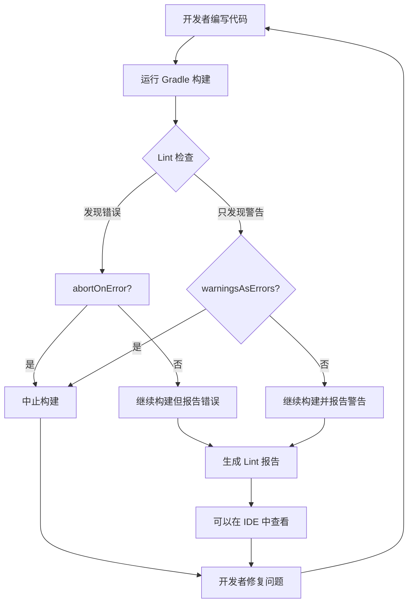
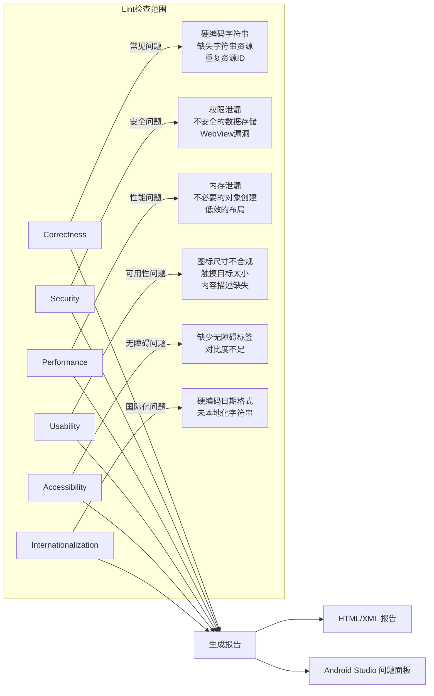
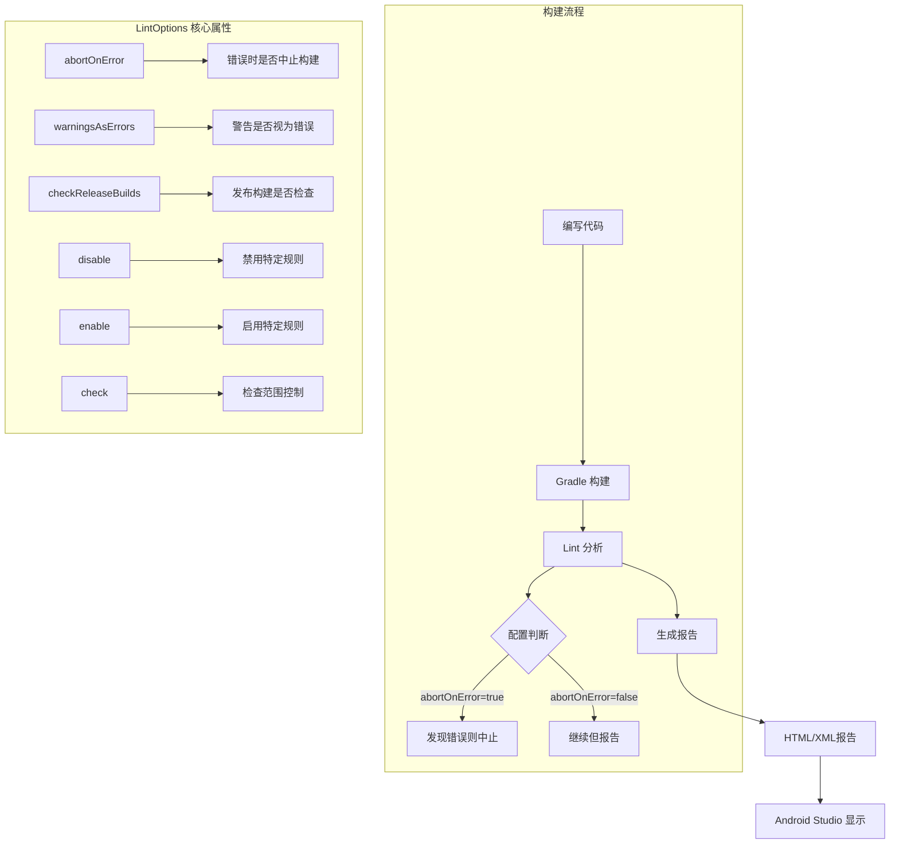

# 21.1.159 皮棉

清晨的第一缕阳光透过帐篷的缝隙，轻轻落在洛芙的眼皮上。

她睁开眼，发现其他三人已经不在帐篷里了。拉开帐篷拉链，清新的晨风带着露水的气息扑面而来——

"洛芙！起来了！"

希尔的声音从外面传来。洛芙钻出帐篷，看見黛琳、伊莎和希尔正坐在草坪上的折叠桌旁，桌上摆着笔记本和热腾腾的早餐。清晨的雾气正在慢慢散去，湖面像镜子一样平静，倒映着渐渐亮起来的天空。

"睡得好吗？"伊莎递过来一杯热可可，"昨天那么晚还在讨论，今天居然起这么早。"

"还好啦，"洛芙揉了揉眼睛，"学东西的时候兴奋嘛。哎，你们在聊什么？"

黛琳把笔记本转过来给她看："我们在聊一个叫 Lint 的东西——它是 Android 开发中非常重要的代码质量工具。"

"Lint？"洛芙接过笔记本，"是那个每次编译时都会跳出来说'这行代码有问题'的东西吗？"

"对，就是它！"希尔笑了起来，"不过可别小看它，Lint 就像露营时的安全检查员——它会帮你发现潜在的危险，让你的代码更加健壮。今天我们就来深入了解一下怎么配置它。"

---

## 问题发现：Lint 到底是什么？

黛琳打开一个项目的 build.gradle 文件，指着其中一段配置给洛芙看：

"看，这里有一个 lint { } 的配置块。这就是 Lint 的 DSL 配置入口。"

洛芙看到这样一段代码：

```kotlin
android {
    lint {
        abortOnError = false
        checkReleaseBuilds = true
        warningsAsErrors = false
    }
}
```

"这些选项都是什么意思？"洛芙问道。

伊莎递过来一盘切好的水果："先别急着问配置项，我们先来说说 Lint 本身是什么——你想象一下，你在一个陌生的山林里露营，有一位经验丰富的护林员，他会在你出发前检查你的装备，告诉你哪些可能会有危险。Lint 就是这样的'护林员'。"

"护林员？"洛芙对这个比喻很感兴趣。

"对，"伊莎继续说，"Lint 会扫描你的代码，找出潜在的问题——比如你忘记释放资源、可能会导致内存泄漏的代码、有安全漏洞的用法、或者性能不佳的实现。它就像一个自动化的代码审查员，全年无休地帮你盯着代码质量。"

希尔补充道："而且 Lint 检查的是源代码本身，不需要实际运行程序，所以叫'静态分析'。它能在你打包发布之前就发现问题，省得用户遇到 bug 来投诉。"

黛琳调出 Lint 的官方文档页面："我们来看看 Lint DSL 到底能配置哪些东西。"

---

## 解决方案：深入Lint配置

黛琳把笔记本放在桌上，四个人围坐在一起。清晨的阳光渐渐强烈起来，雾气已经完全散去了。

"LintOptions 提供了一系列配置项，"黛琳指着屏幕解释道，"我们一个一个来看。"

### abortOnError：是否在发现错误时停止构建

"第一个是 `abortOnError`。"黛琳调出一段代码，"它决定了当 Lint 发现错误时，是否中止构建过程。"

```kotlin
android {
    lint {
        // true = 发现任何错误都停止构建
        // false = 报告错误但继续构建
        abortOnError = true
    }
}
```

"通常在调试阶段，我们设置为 false，这样即使有问题也能先看看完整的报告。"希尔说，"但在正式发布时，应该设为 true，确保不带着错误发布。"

洛芙点头："就像露营时的安全检查——如果发现帐篷有破洞，当然要修好才能继续住，不能假装没看到对吧？"

"对！"伊莎微笑着说，"不过有时候一些小问题不一定非要停止构建，所以可以根据项目情况灵活设置。"

### warningsAsErrors：警告是否被视为错误

"接下来是 `warningsAsErrors`。"黛琳继续说，"这个选项决定了 Lint 的警告（warnings）是否被视为错误（errors）。"

```kotlin
android {
    lint {
        // true = 警告被视为错误，构建会失败
        // false = 警告只是警告，不阻止构建
        warningsAsErrors = false
    }
}
```

希尔补充了一个实际例子："假设你的代码里有一个未使用的变量。Lint 会报告一个 'Unused variable' 的警告。如果你把 warningsAsErrors 设为 true，那这个警告就会导致构建失败。"

"这有点严格啊，"洛芙说。

"对的，"黛琳表示同意，"有些团队可能对代码质量要求很高，就会开启这个选项。但对于快速迭代的项目，可能更倾向于宽松一些。"

### checkReleaseBuilds：发布构建是否检查

"第三个是 `checkReleaseBuilds`。"黛琳调出新的代码，"它决定了发布构建（release build）是否要运行 Lint 检查。"

```kotlin
android {
    lint {
        // true = release 构建时会运行 Lint
        // false = release 构建时跳过 Lint
        checkReleaseBuilds = true
    }
}
```

"这个通常应该保持 true，"希尔说，"因为发布到市场的版本不应该有 Lint 报告的问题。"

"就像登山前要检查装备一样，"伊莎补充道，"越是要出远门，越要仔细检查。"

### disable：禁用特定规则

"接下来是一个很实用的选项——`disable`。"黛琳说，"它可以禁用特定的 Lint 规则。"

```kotlin
android {
    lint {
        // 禁用特定的 Lint 规则
        disable += "UnusedImports"
        disable += "LongMethod"
        disable += "FieldSite"
    }
}
```

"为什么需要禁用某些规则？"洛芙好奇地问。

希尔解释道："有时候项目的代码风格或者特殊需求，会导致某些 Lint 规则不太适用。比如你用的某个库可能确实需要使用某些看起来'不安全'的 API，或者你的代码风格和 Lint 的默认规则不完全一致。"

"我懂了，"洛芙说，"就像露营规则——有些地方禁止用火，但如果你在指定的安全区域，就可以例外。"

"Exactly!"希尔打了个响指。

### enable：启用特定规则

"相反的，`enable` 可以启用某些默认关闭的规则。"黛琳继续演示：

```kotlin
android {
    lint {
        // 启用特定的 Lint 规则
        enable += "UseCheckPermission"
        enable += "UseParallelCollections"
    }
}
```

"有些规则默认是关闭的，因为它们可能比较严格，或者只适用于特定场景。"希尔说，"如果你想强制开启某些检查，就可以用这个选项。"

### check：精确控制检查范围

"还有 `check`，它可以更精细地控制要检查哪些问题。"黛琳调出代码：

```kotlin
android {
    lint {
        // 只检查特定类别
        check += "Security"
        check += "Performance"
        check += "Correctness"
    }
}
```

"Lint 将问题分类为不同的类别——Security（安全）、Performance（性能）、Correctness（正确性）等等。"希尔解释道，"你可以只关注某些特定的类别。"

"就像体检时可以选择只检查某些项目，"伊莎打了个比方，"不是所有人每年都要做全部检查的。"

---

## 可视化：Lint的工作流程

黛琳在白板上画了一幅图，展示 Lint 在构建过程中的位置：



"看这个流程图，"黛琳解释道，"Lint 是在 Gradle 构建过程中运行的。它会分析源代码，然后根据配置决定如何报告发现的问题。"

洛芙看着图点头："原来 Lint 是在这个环节工作的！那它具体会检查哪些内容呢？"

希尔调出另一个图：



"哇，有这么多类别！"洛芙惊讶地说。

"对，Android Lint 是一个非常全面的工具，"黛琳说，"它覆盖了代码质量、安全、性能等多个方面。"

---

## 反模式与重构：Lint配置的错误示范

希尔调出一个有问题的配置示例：

```kotlin
// ❌ 反模式：过于宽松的 Lint 配置
android {
    lint {
        abortOnError = false
        warningsAsErrors = false
        checkReleaseBuilds = false
        // 禁用太多规则
        disable += "All"
    }
}
```

"这个配置几乎关闭了所有的 Lint 检查！"希尔说，"这就像露营时不带任何安全装备——看似省事了，但风险很大。"

洛芙问："这样会有什么后果？"

"代码中的问题不会被及时发现，"希尔解释道，"可能到了生产环境才暴露出来，那时候修复的成本就高多了。而且随着代码库变大，技术债务会越来越多。"

黛琳展示了更好的做法：

```kotlin
// ✅ 重构后：合理的 Lint 配置
android {
    lint {
        // 严格模式：发现任何错误都停止构建
        abortOnError = true
        
        // 警告也视为错误（可选，根据团队需求）
        // warningsAsErrors = true
        
        // release 构建必须检查
        checkReleaseBuilds = true
        
        // 只禁用确实不需要的规则，并说明原因
        disable += "UnusedImports"  // 项目风格允许下划线开头
        disable +="HardcodedText"   // 测试代码中可接受
        
        // 确保没有完全禁用
        check += "Correctness"
        check += "Security"
    }
}
}

```

"好的配置应该平衡严格性和实用性。"黛琳解释道，"既不能太宽松（等于没检查），也不能太严格（影响开发效率）。"

---

## 运行示例：Lint 报告的实际输出

希尔运行了一个简单的 Lint 检查，给大家看实际的输出：

```bash
$ ./gradlew lint

> Task :app:lint
Lint found 3 issues in module app:

ISSUE 1:
  Category: Correctness
  Severity: Error
  Message: [HardcodedText] Hardcoded string "Hello World", should use @string resource
  File: app/src/main/java/com/example/app/MainActivity.kt:42

ISSUE 2:
  Category: Security  
  Severity: Warning
  Message: [SetJavaScriptEnabled] Consider whether it is safe to enable JavaScript on this WebView
  File: app/src/main/java/com/example/app/WebViewActivity.kt:15

ISSUE 3:
  Category: Performance
  Severity: Warning
  Message: [ViewTag] Avoid using setTag with integer keys, use setTag(int, Object) instead
  File: app/src/main/java/com/example/app/ListAdapter.kt:28
```

"看，每一条 issue 都会告诉你问题类别、严重程度、具体消息和文件位置。"希尔指点着输出说。

"第一个是错误级别，必须修复。"黛琳说，"第二、三个是警告级别，建议修复。"

洛芙好奇地问："那这些报告在哪里可以看到？"

"在 build/reports/lint-results.html，"希尔说，"打开那个文件，可以看到完整的 HTML 报告，还有颜色标注呢。"

---

## 深入配置：自定义Lint规则

"除了内置的检查，Android Lint 还支持自定义规则。"黛琳调出新的代码：

```kotlin
android {
    lint {
        // 引入自定义 Lint 规则
        // 需要在 dependencies 中添加自定义规则的 jar
    }
}

// build.gradle (project level)
dependencies {
    lintChecks 'com.example:custom-lint-rules:1.0'
}
```

"有些公司会编写自己的 Lint 规则，"希尔解释说，"比如检查是否正确使用了公司的 SDK，或者是否遵循特定的代码规范。"

"就像露营营地有自己的规则一样，"伊莎说，"有些是通用的安全规则，有些是特定营地的特殊规定。"

---

## 章节收尾：清晨的领悟

太阳已经完全升起来了，金色的光芒洒在湖面上，泛起粼粼波光。鸟儿的歌声更加欢快了，仿佛在为她们的讨论伴奏。

洛芙伸了个懒腰，看着远处的湖面："原来 Lint 就像露营时的安全检查员——虽然有时候它会罗嗦，但真的很有用呢！"

"对，"黛琳微笑着说，"好的工具不是限制你，而是帮助你写出更好的代码。"

伊莎轻轻搅动着她的那杯热可可："而且配置好 Lint 之后，它就会一直默默帮你盯着，不需要你每次都去检查。"

希尔收拾着笔记本："没错！自动化才是效率的关键。好啦，今天的 Lint 课程就到这里——我们去吃早餐吧！"

四人站起身来，走向露营餐桌。清晨的微风拂过，带来青草和湖水的清新气味。新的一天开始了，而她们的知识又增加了一点。

---

> **Lint -- Android 静态代码分析工具**，可以在不运行程序的情况下扫描源代码，发现潜在的 bug、安全问题、性能问题等，并提供修复建议。通过 LintOptions DSL 可以配置检查行为、检查范围、错误处理方式等。

---

#### 结构图



---

#### 复杂度与影响

使用 Lint 的复杂度较低，主要是配置工作。但它对代码质量的提升是显著的：
- **时间成本**：每次构建多增加几秒，但能避免生产环境的问题
- **维护成本**：随着项目变大，Lint 能帮你发现人为疏忽的问题
- **收益**：提前发现 bug、漏洞、性能问题，节省后期修复成本

---

#### 反模式与陷阱

1. **禁用所有检查** `disable += "All"` — 完全失去了 Lint 的意义，就像不检查装备就出发登山
2. **只在 CI 配置 Lint** — 本地开发时也应该运行，建议在 IDE 中实时看到警告
3. **忽略警告** — 警告通常是潜在问题的信号，应该逐一审视是否需要修复

---

#### 名词小传

**Lint** 一词来源于 Unix 工具 `lint`，是最早的 C 代码静态分析工具之一。Android Lint 基于 Java 的 Lint 工具发展而来，现在已经成为 Android 开发的标准质量检查工具。

---

#### 设计哲学

**自动化代码质量检查**的核心思想是：
1. **预防优于修复**：在编写代码时就发现问题，成本最低
2. **一致性好**：自动检查不会疲劳，不会遗漏
3. **可配置**：不同项目有不同的质量标准，配置应该灵活
4. **持续集成**：每次构建都检查，确保代码质量不退化

**实践建议：**
- 开发阶段设置 `abortOnError = false`，方便快速迭代
- CI/CD 环境中设置 `abortOnError = true`，确保发布质量
- 根据项目规模逐步增加检查规则
- 定期审视 Lint 报告，逐步提高代码质量
- 对于误报，可以适当禁用但要记录原因

---

## 🏕️ 动手练习

**目标**：掌握 Android Lint 的配置和使用，能够为项目配置合适的 Lint 选项。

**方式 A：项目制**（适合完整流程练习）

---

**Task 1：配置基础 Lint 选项**

**目标**：为 Android 项目配置基础的 Lint 选项，理解各选项的作用。

**步骤**：
1. 打开一个 Android 项目的 build.gradle (app level)
2. 在 android { } 块中添加 lint { } 配置块
3. 分别设置 abortOnError、warningsAsErrors、checkReleaseBuilds
4. 运行 ./gradlew lint 查看效果

**验收标准**：
- [ ] build.gradle 中包含 lint { } 配置块
- [ ] 配置了至少 3 个 Lint 选项
- [ ] 运行 Lint 检查成功

**提示**：
```kotlin
android {
    lint {
        abortOnError = false
        checkReleaseBuilds = true
    }
}
```

---

**Task 2：禁用特定规则**

**目标**：学习如何禁用不需要的 Lint 规则，理解场景选择的重要性。

**步骤**：
1. 运行 Lint 查看完整报告
2. 选择几个不需要修复的警告类型
3. 在 lint { } 中添加 disable 配置
4. 重新运行 Lint 验证效果

**验收标准**：
- [ ] 添加了 disable 配置
- [ ] 至少禁用了 2 个规则
- [ ] 验证禁用生效

**提示**：
```kotlin
android {
    lint {
        disable += "UnusedImports"
        disable += "HardcodedText"
    }
}
```

---

**Task 3：配置规则启用与检查范围**

**目标**：学习启用特定规则和限制检查范围。

**步骤**：
1. 添加 enable 配置，启用某个默认关闭的规则
2. 添加 check 配置，限制只检查特定类别
3. 运行 Lint 观察差异

**验收标准**：
- [ ] 配置了 enable 选项
- [ ] 配置了 check 选项
- [ ] 理解配置的效果

**提示**：
```kotlin
android {
    lint {
        enable += "UseCheckPermission"
        check += "Security"
        check += "Performance"
    }
}
```

---

**Task 4：生成并查看 Lint 报告**

**目标**：掌握如何查看 Lint 报告，理解报告内容。

**步骤**：
1. 运行 ./gradlew lint
2. 找到生成的报告文件
3. 在浏览器中打开 HTML 报告
4. 理解报告中每个字段的含义

**验收标准**：
- [ ] 成功运行 Lint
- [ ] 生成了报告文件
- [ ] 理解了报告内容

**提示**：
报告文件通常在 `app/build/reports/lint-results.html`

---

**Task 5：配置 CI 环境下的 Lint**

**目标**：理解开发环境和 CI 环境的不同配置需求。

**步骤**：
1. 在 build.gradle 中为 debug 和 release 配置不同的 Lint 选项
2. 创建 lintOptions 用于 release 构建的严格配置
3. 理解为什么 CI 环境需要更严格的配置

**验收标准**：
- [ ] 为不同构建类型配置了不同选项
- [ ] release 构建的检查更严格
- [ ] 理解了配置差异的原因

**提示**：
```kotlin
android {
    lintOptions {
        abortOnError false  // debug 允许继续
    }
    
    buildTypes {
        release {
            // release 构建的额外配置
        }
    }
}
```

---

**面试热身**（用自己的话回答）

Q1：Android Lint 是什么？它和单元测试有什么区别？

Q2：abortOnError 和 warningsAsErrors 有什么区别？应该在什么场景下使用？

Q3：如果 Lint 报告了一个误报，你应该怎么处理？

Q4：如何在团队中推广 Lint 的使用？

Q5：Lint 检查发现的错误和警告，哪个更应该优先处理？

---

#### 参考实现要点

1. **本地开发环境**：建议设置 `abortOnError = false`，避免频繁中断开发流程
2. **CI/CD 环境**：建议设置 `abortOnError = true`，确保发布的代码没有 Lint 错误
3. **增量检查**：对于大型项目，可以只检查修改的文件，提高效率
4. **规则定制**：根据项目需求，可以编写自定义 Lint 规则
5. **与 IDE 集成**：Android Studio 实时显示 Lint 警告，建议保持开启

---

> 清晨的露营地上，Lint 就像是那位默默守护的护林员。虽然它不会替你走路，但会在出发前帮你检查装备，确保旅途安全。配置好 Lint，让它成为你开发过程中的得力助手吧！

---

## 洛芙的小小日记本

今天学到了 Lint！原来每次编译时跳出来的那些警告都是它在帮忙呢～配置一下就能让它更严格或更宽松，还挺有趣的。明天要把这个配置到我们的项目里试试看！

---

## 今日关键词

**Lint** — Android 静态代码分析工具，扫描源代码发现潜在问题

**LintOptions** — Gradle 中配置 Lint 行为的 DSL

**abortOnError** — 发现错误时是否中止构建

**warningsAsErrors** — 警告是否被视为错误

**checkReleaseBuilds** — 发布构建是否运行 Lint 检查

**disable** — 禁用特定的 Lint 规则

**enable** — 启用特定的 Lint 规则

**check** — 限制检查的问题类别范围

**静态分析** — 不运行程序，分析源代码发现问题

**技术债务** — 由于快速开发而积累的代码质量问题