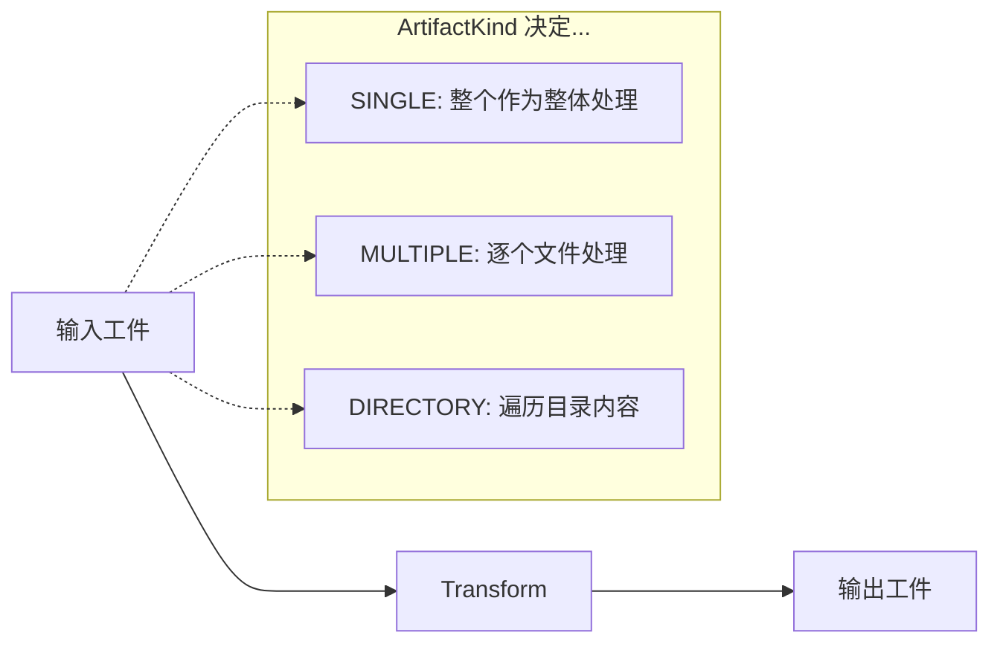
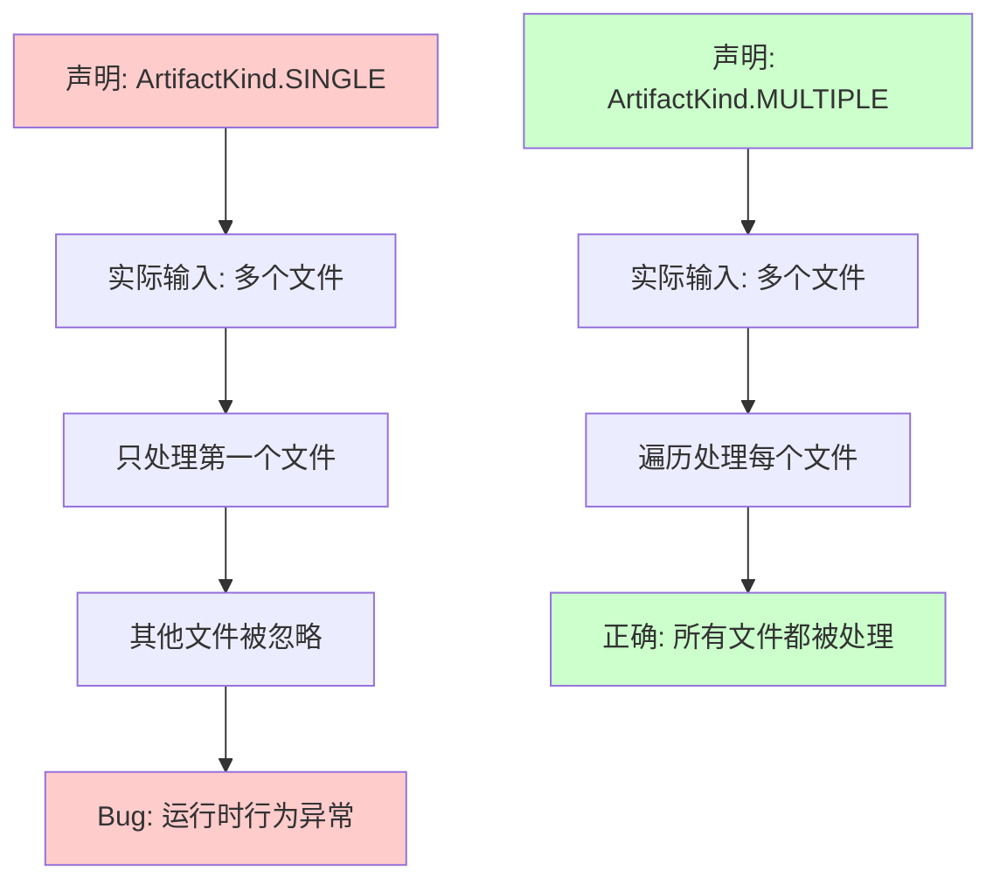
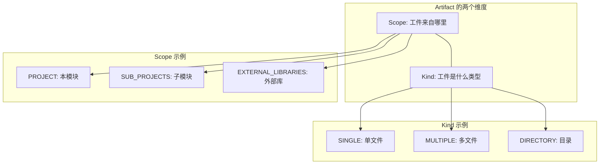

# 21.1.16 神器种类

夜已经深了。

帐篷里的夜灯投下暖黄色的光晕，在帆布上摇曳出温柔的影子。黛琳盘腿坐在睡袋上，手里把玩着一枚小小的金属书签——那是她平时标记技术文档用的。此刻她正用它有一下没一下地戳着便携式白板的边缘，像是在组织语言。

洛芙靠在折叠枕头上，笔记本电脑搁在曲起的膝盖上。屏幕的蓝光映在她眼睛里，映出还没完全消化的困惑。刚才黛琳讲的 Artifact.Transformable 还在她脑海里转圈—— transforms、 Artifacts、作用域，这些概念像一团缠在一起的线，她理顺了一点，但总觉得自己漏掉了什么关键的东西。

“黛琳，”洛芙犹豫了一下，还是开口了，“刚才那个 Transformable……它.transform() 之后，返回的到底是什么类型啊？我看文档里写什么 ArtifactKind 的…… kind，这个词是种类的意思吧？”

希尔正好从背包里翻出一包草莓味饼干，撕包装的声音清脆作响。她抬起头：“哦？你注意到 Kind 了？那个很重要的——”

“等一下，”伊莎轻声打断，她正倚在帐篷门口往外看，夜风把她额前的碎发轻轻吹起，“先让黛琳把话说完嘛。你们看，外面的星星好亮啊。”

确实亮。今晚的夜空清澈得像被水洗过一样，银河像一条淡淡的光带横贯天际。帐篷外的草叶上凝结着露水，在星光下微微闪烁。蝉鸣已经几乎听不见了，只有偶尔一两声蟋蟀的鸣叫点缀着夜的寂静。

黛琳点了点头，她总是这样——不会一口气说完，而是等大家都准备好。

“洛芙问得很好，”她把金属书签轻轻放在白板边缘，发出“嗒”的一声轻响，“Transformable 处理完以后，返回的是一个 Artifact——但这个 Artifact 到底是什么类型的文件，就需要用 ArtifactKind 来定义了。”

她拿起白板笔，在白板上画了一个简单的分类：

“你们看，如果我们把构建过程中的所有'产出'叫做工件——也就是 Artifact——那这些工件可以分成三种基本类型。”

白板上出现了三个圆圈，每个圆圈里写着不同的词。黛琳一边写一边继续：

“第一种，单一文件——SINGLE。想象一下，你从背包里拿出来的东西：一张地图、一封信、一把钥匙。它就是一个独立的东西，不会再分成好几份。”

她画了一个小方块代表 SINGLE。

“第二种，多个文件——MULTIPLE。就像你的露营餐具套装：刀、叉、勺子、筷子，装在一个盒子里。你需要它们全部一起用，但它们是分开的个体。”

这次她画了一排小方块。

“第三种，文件夹——DIRECTORY。就像你的整个背包：里面分层、分格，放着各种东西。你需要的不是某一件具体的东西，而是整个这个'空间'，里面有组织好的内容。”

黛琳画了一个大框，里面套着小框。

“这三种类型，就是 ArtifactKind 枚举定义的三种 Kind——种类。”她在白板上写下：ArtifactKind = SINGLE | MULTIPLE | DIRECTORY

洛芙眨了眨眼：“所以……之前我们讲的那个 Transform，假设是把一组图片缩小的那种，它处理的是哪种 Kind？”

“问得好。”黛琳微微一笑，“你想啊——你有一堆图片文件，经过 Transform 之后，输出的还是一堆图片文件，只是尺寸变小了。所以输入是 MULTIPLE，输出也是 MULTIPLE。这种 Transform 处理的工件类型，就是 MULTIPLE。”

“那 SINGLE 呢？”希尔插嘴道，她已经放弃了饼干，开始在笔记本上敲代码，“比如说……打包好的 APK？那个是单一文件吧？”

“对。APK 就是一个单独的二进制文件。所以当你写一个处理 APK 的 Transform 时，它的输入输出都是 SINGLE。”黛琳点头。

“DIRECTORY……”伊莎轻声说，“我想想……是指 res 文件夹那样的一整个目录吗？”

“没错。”黛琳看向伊莎，“Android 的资源目录——res、assets，这些都是以目录形式存在的。你可以对整个目录做处理，比如 AAPT 优化资源、合并多个资源目录——这些操作的输入输出都是 DIRECTORY。”

帐篷里安静了一会儿，只有键盘的敲击声。希尔正在写一个示例代码，她的笔记本电脑发出轻微的嗡嗡声。

“希尔，”洛芙探头过去看她的屏幕，“你在写什么？”

“喏，”希尔把屏幕转过来一点，让洛芙也能看到，“我在想，如果我们要自己写一个 Transform，怎么声明自己处理的是哪种 Kind 对吧？”

```kotlin
abstract class MyTransform : Transform() {
    
    // 这个属性告诉 Gradle：我处理的是什么类型的工件
    override fun getInputTypes(): Set<QualifiedContent.ScopeType> {
        // 返回 CONTENT_CLASS 表示处理的是 .class 文件
        return setOf(QualifiedContent.ScopeType.PROJECT)
    }
    
    // 这里声明输出的 Kind —— 依然是 CLASSES，所以是 SINGLE
    override fun outputTypes(): Set<ArtifactKind> {
        return setOf(ArtifactKind.SINGLE)
    }
}
```

“等等，”洛芙皱起眉头，“QualifiedContent.ScopeType 又是啥？”

“哈，这个问题问得好。”希尔 grinned（露出灿烂的笑容），“Scope 是另一个概念——它说的是这个工件来自哪个'作用域'。比如说——”

她正准备解释，黛琳轻轻拍了拍白板：“这个我们后面会讲到。先回到 Kind。洛芙，你还记得我们之前说的 Transformable 吗？它的作用域和类型，都是在注册 Transform 的时候决定的。”

洛芙点了点头。确实，Transformable 是 Transform 的输出嘛。

“那……Kind 到底有什么用呢？”她问，“我知道它是三种类型了，但……为什么需要分这么细？”

黛琳没有直接回答，而是反问：“你记得我们之前露营的时候，你把东西分三类放吗？你的背包、你的衣物包、还有你的工具盒——它们都是装东西的容器，但用法完全不同，对吧？”

洛芙回想了一下——确实，她当时就是把东西按使用场景分开放的。背包是随身背的，衣物包是放在营地帐篷里的，工具盒是做饭的时候才拿出来的。

“对……”她迟疑地说，“可是……这和 Kind 有什么关系？”

“Gradle 也是一样的。”黛琳在白板上画了一个简化的流程图：



“你看，”黛琳指着图说，“当 Gradle 知道你的工件是哪种 Kind 的时候，它就知道该怎么'喂'给你了。”

“如果Kind 是 SINGLE，”她继续说，“Gradle 就会把整个文件作为一个整体传给你——你直接拿到一个完整的 InputStream 或 File 对象。你想怎么处理都可以：改名、加密、压缩——随你。”

“如果 Kind 是 MULTIPLE，”希尔补充道，她还在敲代码，“Gradle 会把每个文件单独拿出来交给你。你拿到的是一个 Collection<File>——一堆文件。你可以遍历它们，对每个文件做同样的处理。比如批量压缩图片、批量重命名——”

“批量”这个词让洛芙眼睛一亮：“啊！就是那种——把所有图片缩放成统一尺寸的 Transform，对吧！”

“对。那种就是典型的 MULTIPLE 处理。”希尔打了个响指。

“如果 Kind 是 DIRECTORY 呢？”伊莎好奇地问。

黛琳指了指白板上的第三种类型：“DIRECTORY——你拿到的是一个文件夹路径。你需要自己决定要怎么处理里面的内容：是要递归遍历所有子文件夹？还是只处理第一层？是要过滤某些文件类型？还是全部一视同仁？”

她顿了顿：“Android 的 AAPT 工具处理资源的时候，就是把整个 res 目录作为 DIRECTORY 输入的——它需要知道整个目录结构，才能做资源合并和优化。”

洛芙若有所思地点了点头。她想起之前学的 Room 数据库——啊，不对，那是另一个话题了。

“那……”她犹豫着举起手，像是在课堂上提问的小学生，“如果我写了一个 Transform，但是我搞错了 Kind——比如说，我明明要处理多个文件，但我声明成了 SINGLE——会怎么样？”

希尔的表情变得有点微妙：“会报错的。Gradle 会告诉你类型不匹配。因为如果你的输入声明是 SINGLE，但实际传给 Transform 的是多个文件——Gradle 不知道该怎么办了。”

“报错还是好的，”黛琳补充，“更糟糕的是运行时的奇怪行为——如果你声明的是 SINGLE，但实际处理的时候你按 SINGLE 的方式写了，结果输入的其实是 MULTIPLE——你可能会只处理了第一个文件，其他的全部忽略。这种 bug 最难发现。”

她说着，在白板上画了一个"×"：



“原来如此……”洛芙赶紧在自己的笔记本上记了下来。错误的 Kind 声明会导致严重的问题。

伊莎一直安静地听着，这时候轻声说：“我觉得……这三种 Kind 就像是露营时的三种整理方式呢。”

大家都看向她。

“SINGLE 就像是……你把最重要的东西放在一个密封盒子里随身带着——只有一件，但很珍贵，你不会把它拆开。MULTIPLE 就像是……你的急救包里的每一样东西：创可贴、碘伏、纱布、止血带——每样都是独立的，但放在一起成为一个整体。DIRECTORY 就像是……你的整个营地：帐篷、炊具、食物、椅子——它们各自的位置很重要，但你需要把它们当作一个整体来规划。”

“真有你的。”希尔笑了，“这么一说确实很清楚。”

夜风轻轻吹过帐篷的门帘，带进来一丝夜晚特有的凉意。远处的山轮廓模糊，只能看到黑黢黢的剪影。星空依旧明亮，偶尔有流星划过——虽然很快，但那短暂的光芒让洛芙想起了什么。

“黛琳，”她突然说，“那 Transformable 里的 Scope——作用域——和 Kind 到底是什么关系啊？我老是把它们搞混。”

黛琳指了指白板上半边没写的地方：“这个问题问得好。简单来说——”

她在白板上画了一个十字坐标轴：



“Scope 回答的是'这个工件从哪里来'的问题——是本项目的？还是子项目的？还是外部依赖的？”

“Kind 回答的是'这个工件是什么形式'的问题——是单个文件？多个文件？还是一个目录？”

“所以当你注册一个 Transform 的时候，”希尔又补充，“你需要同时声明两端：输入的 Scope + Kind，以及输出的 Scope + Kind。Gradle 会根据这些声明，去找到匹配的工件，然后交给你处理。”

洛芙长长地“噢”了一声。她觉得自己终于把这两个概念分清楚了。

“那……”她正想再问什么，打了个大大的哈欠。没办法，连续学习了好几个小时，即使是在深夜的星空下，困意还是不受控制地涌上来。

“今天就到这里吧，”伊莎温柔地说，“已经很晚了。星星都在提醒我们该休息了。”

确实，再抬头看，银河已经移动了一些位置，夜色愈发深沉。露水一定结得更重了，洛芙想，明天早上草地一定是湿漉漉的。

黛琳轻轻合上白板，把白板笔收进笔袋：“明天我们继续——接下来会讲 ArtifactType，那个是更具体的东西。”

“ArtifactType？”洛芙的好奇心又被勾起来了，但她已经困得睁不开眼睛，“那又是什么……”

“简单说，”希尔已经收拾起笔记本电脑，“Kind 是大类——单文件、多文件、目录——Type 是更细的分类——比如 CLASSES、JAR、AAR、APK……之类的。”

“听起来好复杂……”洛芙嘟囔着，把枕头调整了一个更舒服的角度。

“慢慢来，”黛琳的声音在黑暗中响起，很轻很温柔，“先把这个晚上学的记住就好。晚安。”

“晚安。”

四个女孩的声音依次响起，夜灯被轻轻调暗。帐篷里安静下来，只有呼吸声和偶尔的布料摩擦声。外面的星空依然闪烁，照亮着这片安静的露营草地。

洛芙闭上眼睛，脑海里还回响着 ArtifactKind.SINGLE、MULTIPLE、DIRECTORY——三种类型，三种整理方式，三种处理逻辑。她翻了个身，把这些知识轻轻放进梦乡。

明天又是新的一天。

---

> 学习建议：理解 ArtifactKind 的关键是区分"文件的形式"和"文件的来源"。Kind 回答的是形式问题（是单个文件还是多个文件还是目录），Scope 回答的是来源问题（在哪个模块、是否来自外部库）。写 Transform 时，必须正确匹配输入输出的 Kind，否则 Gradle 会报错或产生难以发现的运行时 bug。

---

## 洛芙的小小日记本

今天黛琳教我们认识了 ArtifactKind——就是工件的三种类型：SINGLE（单文件）、MULTIPLE（多文件）、DIRECTORY（目录）。就像露营时整理东西一样，不同类型要不同的处理方式。希尔说如果搞错了 Kind 就会报奇怪的 bug——好可怕，要记住！晚安～⭐

---

## 今日关键词

- **ArtifactKind**：Android Gradle Plugin 中定义工件类型的枚举类，包含 SINGLE、MULTIPLE、DIRECTORY 三种基本类型
- **SINGLE**：单一文件类型，整个文件作为整体处理，如 APK、JAR
- **MULTIPLE**：多文件类型，逐个文件处理，如 .class 文件集合、图片集合
- **DIRECTORY**：目录类型，以整个文件夹作为处理单元，如 res、assets 目录
- **Transform**：Android Gradle Plugin 的转换任务，用于处理构建过程中的工件
- **Scope**：作用域概念，决定工件来自哪里（PROJECT、SUB_PROJECTS、EXTERNAL_LIBRARIES）
- **QualifiedContent**：包含 Scope 和 Kind 信息的接口，用于描述工件的特征
- **InputStream**：Java 输入流，用于读取文件内容
- **ArtifactType**：比 Kind 更细粒度的类型分类，如 CLASSES、JAR、AAR、APK 等
- **Gradle Build**：Android 项目的构建系统，负责编译、打包、生成输出
