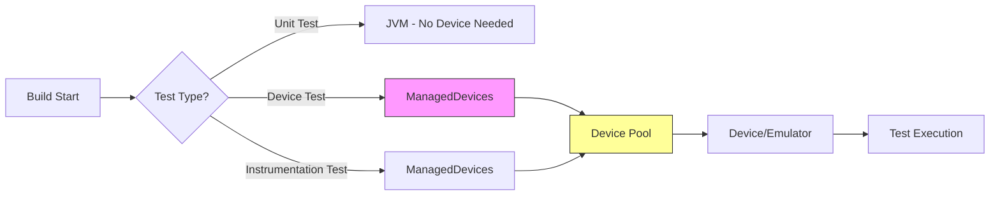
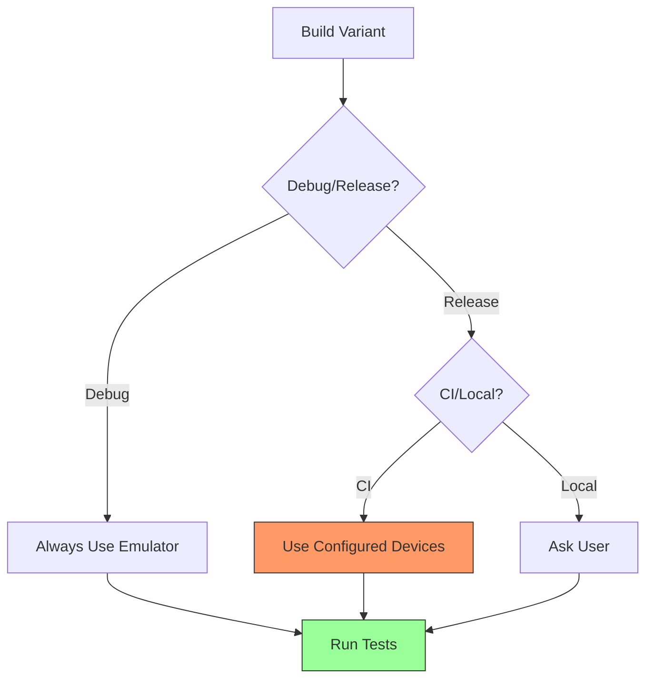
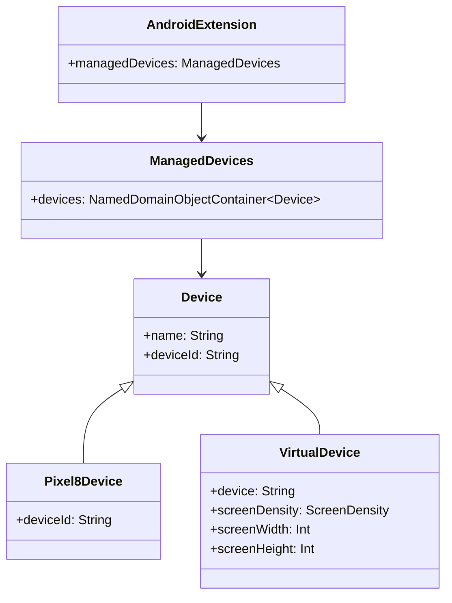

# 21.1.161 受管设备

太阳已经爬到了头顶。

洛芙仰头看了看从树叶间漏下来的光斑，又低头看了看手机——已经十二点了。她蜷缩了一下腿，把下巴搁在膝盖上，感受着身下野餐垫微微发烫的温度。

“我们是不是该吃点东西了？”她小声问道。

希尔正盘腿坐在野餐垫的另一角，膝盖上放着她的笔记本电脑，手指在键盘上飞快地敲着什么。听到这话，她头也不抬地说：“先把这个搞完嘛，洛芙。黛琳说今天要讲很重要的东西。”

“什么呀？”洛芙好奇地凑过去看希尔屏幕上的代码。

“ManagedDevices，”黛琳的声音从旁边传来。她正坐在一棵大树的树荫下，手里拿着一本看起来很旧的技术手册，“就是用来配置测试设备的。在Android构建系统里，你可以声明哪些设备用来跑测试。”

“设备？测试？”洛芙眨了眨眼，“就像……手机吗？”

“对，”伊莎笑着接过话。她正把头发扎成一条松松的麻花辫，有一搭没一搭地绕着发梢，“不只是真机哦，还包括模拟器。黛琳，你说是不是就像露营的时候，我们要先决定谁去提水、谁去捡柴、谁去搭帐篷一样？”

“差不多是这个意思，”黛琳翻开手册，指着上面的代码示例说，“在Gradle里配置ManagedDevices，就是告诉构建系统：‘嘿，我要用这些设备和模拟器来跑测试。’”

希尔把电脑转过来，让大家都看得见屏幕：“看，这是官方文档里的基本用法。”

```kotlin
android {
    // 配置设备测试
    managedDevices {
        devices {
            create<Pixel8Device>("pixel8") {
                // 设备配置
            }
            create<VirtualDevice>("emulator") {
                // 模拟器配置
            }
        }
    }
}
```

洛芙盯着代码看了几秒钟：“所以……这个就是声明我要用哪些设备来测试的意思？”

“对的，”黛琳点点头，“不过实际使用的时候，你会需要指定deviceTests或instrumentationTests的目标设备。我们来一步一步看。”

---

## 问题的发现：测试也需要规划

伊莎把最后一缕头发别到耳后，歪着头问：“可是，我们之前跑单元测试的时候，好像没有专门配置过设备啊？”

“对，单元测试不需要设备，”黛琳解释道，“单元测试运行在JVM上，跟Android设备无关。但是deviceTests和instrumentationTests不一样——它们需要在真实的Android设备或模拟器上运行。”

“那它们有什么区别？”洛芙问。

黛琳从地上捡起一根小树枝，在泥土上画了起来。她画了两个方框，又在下面画了一个Android设备的简笔画。

“Device tests，”她用树枝点了点左边那个方框，“也叫单元测试的设备版本，但实际上更接近集成测试。它会在设备上启动一个独立的进程运行测试代码。”

“instrumentation tests，”她点了点右边那个方框，又点了点下面的Android设备简笔画，“则是把测试代码和你的App运行在同一个进程里，可以访问App的内部状态和组件。”

希尔补充道：“简单来说，device test是'在设备上跑'，instrumentation test是'作为App的一部分跑'。前者更适合测试独立的组件，后者更适合测试UI和交互。”

洛芙“哦”了一声，表示理解。她又问道：“那ManagedDevices就是用来管理这些测试可以跑在哪些设备上的？”

“对，”黛琳说，“你可以指定具体的真机型号，或者特定的模拟器配置。这样在CI/CD流水线里，你就能精确控制测试环境。”

---

## 图示：ManagedDevices在构建中的位置

伊莎把手指向远方，指着湖面说：“我想到一个比喻！”

“什么？”其他三人一起看向她。

“如果把整个Android项目的构建过程想象成一条河流，”伊莎说，“那么测试就是河流里的不同支流。”

她用手指在空中比划着：“有些支流是单元测试，它们直接从源头流出来，不需要经过设备检查站。但是device tests和instrumentation tests这两条支流，它们需要通过设备检查站——也就是我们的ManagedDevices配置。”

黛琳忍不住笑了：“这个比喻还挺形象的。”

希尔立刻在电脑上画了一个流程图：



“这就是整个测试流程，”希尔说，“ManagedDevices就是那个决定测试可以在哪些设备上跑的配置层。”

洛芙看着图，若有所思地说：“所以如果我不配置ManagedDevices，device test和instrumentation test就跑不了？”

“对，默认情况下它们会在所有可用的设备上跑，”黛琳说，“但如果你的CI环境里只有特定的设备，你就需要显式配置。”

---

## 代码演示：完整的设备配置

希尔把代码往下翻，展示了一个更完整的例子：

```kotlin
android {
    // 配置托管设备
    managedDevices {
        devices {
            // 物理设备 - Pixel 8
            create<Pixel8Device>("pixel8") {
                // 设备Id，通常从设备列表或环境变量获取
                deviceId = "pixel8_14"
            }
            
            // 虚拟设备 - API 34模拟器
            create<VirtualDevice>("emulator34") {
                // 模拟器配置
                device = "pixel_8_api_34"
                // 可以指定屏幕密度和尺寸
                screenDensity = ScreenDensity.NORMALLY_HIGH
                screenWidth = 1080
                screenHeight = 2340
            }
            
            // 另一个API级别的模拟器
            create<VirtualDevice>("emulator33") {
                device = "pixel_7_api_33"
            }
        }
    }
    
    // 配置测试目标
    testOptions {
        unitTests {
            includeAndroidResources = true
        }
        managedDevices {
            // 为device tests指定设备
            devices {
                "pixel8"
                "emulator34"
            }
        }
    }
}
```

洛芙指着代码问：“这个Pixel8Device和VirtualDevice是什么呀？”

黛琳解释道：“Pixel8Device是Google提供的设备类型，代表Pixel 8真机。VirtualDevice则是模拟器。它们都是Gradle DSL里预定义的设备类型。”

“那……如果我想用其他品牌的手机呢？”洛芙又问。

“可以用GenericDevice，”希尔说，“它更通用，可以适配任何Android设备。不过Google官方建议尽量使用Pixel设备，因为它们的驱动和兼容性最好。”

---

## 反模式：忽视设备配置的后果

黛琳的表情变得严肃了一些：“这里有一个很常见的误区，很多人觉得不需要配置ManagedDevices，让测试自动跑就行。但实际上……”

她停顿了一下，从地上站起来，走到湖边，看着远处的山。

“在CI环境里，如果没有明确指定设备，测试可能会在任何可用的设备上跑。这会导致几个问题。”

“什么问题？”洛芙问。

“第一，测试结果不稳定，”黛琳说，“有时候在Pixel 8上通过了，但在某个低端设备上失败了。第二，无法复现问题——你没办法知道测试到底是在哪个设备上失败的。第三，也是最严重的——资源浪费。每次构建都可能触发所有设备的测试，耗时长而且成本高。”

伊莎补充道：“就像露营的时候，如果不说清楚谁负责什么，大家可能会做重复的工作，或者遗漏重要的事情。”

希尔立刻说：“所以正确的做法是——先规划，再执行。”

“对，”黛琳点点头，“这就是为什么我们要学习ManagedDevices。”

---

## 解决方案：分环境配置设备

黛琳走回来，重新坐好。她从背包里拿出一张纸，画了一个表格。

“我们可以用 flavors 来区分不同的测试环境，”她说。

```kotlin
android {
    flavorDimensions += "environment"
    
    productFlavors {
        create("dev") {
            dimension = "environment"
            // 开发环境 - 使用模拟器
        }
        
        create("qa") {
            dimension = "environment"
            // QA环境 - 使用真机
        }
        
        create("prod") {
            dimension = "environment"
            // 生产环境 - 全部设备
        }
    }
    
    managedDevices {
        devices {
            create<VirtualDevice>("devEmulator") {
                device = "pixel_8_api_34"
            }
            
            create<Pixel8Device>("qaDevice") {
                deviceId = "QA_Pixel_8_01"
            }
        }
    }
    
    testOptions {
        managedDevices {
            devices {
                // 根据flavor选择设备
                when (variant.flavorName) {
                    "dev" -> include("devEmulator")
                    "qa" -> include("qaDevice")
                    else -> include("devEmulator", "qaDevice")
                }
            }
        }
    }
}
```

“这个例子好复杂啊，”洛芙吐了吐舌头。

“是有点，”黛琳笑着说，“但它展示了真实场景中如何管理多环境测试。初期不需要这么复杂，先从简单的配置开始就好。”

---

## 另一个图示：设备变体的选择

希尔又在电脑上画了一个图，这次是关于如何根据构建变体选择设备的：



“在本地开发的时候，通常我们用模拟器就够了，”希尔解释道，“但是在CI环境里，特别是发布前的测试，我们需要确保在目标设备上都能通过。”

洛芙点了点头：“所以 ManagedDevices 就是一个…… 中央控制塔？告诉测试应该去哪些设备上报到？”

“这个比喻不错，”伊莎笑着说。

---

## 实战：让希尔演示一下

希尔把笔记本转回去，快速敲了几行代码，然后运行了一个命令。

“看，我现在有一个 Gradle 项目，里面配置了ManagedDevices。”

她展示了构建配置：

```kotlin
// build.gradle.kts (app)
plugins {
    id("com.android.application")
}

android {
    namespace = "com.example.testdevice"
    compileSdk = 34
    
    defaultConfig {
        applicationId = "com.example.testdevice"
        minSdk = 24
        targetSdk = 34
    }
    
    managedDevices {
        devices {
            create<VirtualDevice>("testEmulator") {
                device = "pixel_8_api_34"
                screenDensity = ScreenDensity.NORMALLY_HIGH
            }
        }
    }
}
```

希尔运行了 `./gradlew tasks --group=verification` 命令，输出显示：

```
> Task :app:tasks
...
Verification tasks
-----------------
deviceDebugUnitTest - Run unit tests on the configured devices
deviceReleaseUnitTest - Run unit tests on the configured devices
deviceDebugAndroidTest - Run instrument tests on the configured devices
deviceReleaseAndroidTest - Run instrument tests on the configured devices
...
```

“看，”希尔说，“配置好ManagedDevices之后，Gradle会自动生成deviceDebugAndroidTest这样的任务。你可以直接运行它们在指定的设备上跑测试。”

洛芙眼睛亮了起来：“所以我只需要运行这个命令，测试就会在配置好的设备上跑？”

“对，”黛琳说，“不过前提是你有可用的设备。模拟器需要先启动，真机需要通过USB连接并且打开了开发者选项里的USB调试。”

---

## 总结：测试设备的规划与管理

伊莎把头发上的叶子摘下来，随手扔在地上。她伸了个懒腰说：“所以 ManagedDevices 的核心思想就是——在跑测试之前，先想好要在哪些设备上跑，对吧？”

“对，”黛琳说，“这其实是一种规划能力。就像露营之前要规划谁带帐篷、谁带炊具、谁带食物一样。”

洛芙若有所思地点了点头。她低头看了看手中的面包，突然意识到自己已经饿了。

“对了，”她举起面包，含糊不清地说，“那……instrumentation test 和 device test 到底有什么区别？我还是有点 confuse。”

黛琳耐心地解释道：“instrumentation test是作为App的一部分运行的，测试代码和App运行在同一个进程里。它可以访问App的Context、组件和资源。Device test则是独立的进程，更像传统的单元测试，但运行在Android设备上。”

“简单说就是，”希尔补充道，“instrumentation test管的是'App的行为对不对'，device test管的是'独立的模块功能对不对'。”

洛芙“噢”了一声，表示理解。她咬了一口面包，含糊地说：“那……就像检查帐篷本身（instrumentation）vs 检查帐篷的每个部件（device test）？”

“有点那个意思，”伊莎笑着说。

---

时间一分一秒地过去，树荫下的野餐垫上，四个人围坐在一起，时不时有笑声从那里传来。远处的湖面上，有几只水鸟正在悠闲地游弋。

黛琳低头看了看手表：“差不多了，我们去吃点东西吧。”

“好！”洛芙第一个响应。她爬起来，拍了拍裙子上的草屑，蹦蹦跳跳地朝存放食物的背包走去。

希尔合上笔记本电脑，抬头看了看天空。阳光正好，不刺眼，温度也刚刚好。

“洛芙，等等我！”她喊道。

伊莎笑着站起来，手里还拿着那根用来画图的树枝。她把树枝插在地上让它继续当“图画的框架”，然后转身跟上大家的步伐。

---

## 专业技术总结

> Android构建系统中的ManagedDevices DSL用于配置测试设备和模拟器，为deviceTests和instrumentationTests提供运行环境。通过声明设备池，开发者可以精确控制测试在哪些真机或模拟器上执行，确保测试结果的稳定性和可复现性。

---

#### 结构图



#### 复杂度与影响

* 使用ManagedDevices配置设备后，Gradle会自动生成`deviceDebugAndroidTest`等任务，测试执行时间取决于可用设备数量。
* 在CI环境中，建议使用设备池或矩阵来并行执行测试，以缩短构建时间。

#### 反模式与陷阱

1. **不配置设备导致测试随机失败**：未指定设备时，测试可能在任何可用设备上运行，导致结果不稳定。*修复：明确在managedDevices中声明目标设备。*
2. **混淆device test和instrumentation test**：两者运行机制不同，device test是独立进程，instrumentation test与App同进程。*修复：根据测试目标选择正确的测试类型。*
3. **使用不支持的设备类型**：某些设备类型需要特定插件或版本支持。*修复：查阅官方文档确认设备类型的可用性。*

#### 设计哲学

Android构建系统通过ManagedDevices实现测试设备的可配置性，体现了以下设计原则：

1. **设备无关性**：开发者可以通过DSL声明设备，而不必关心底层驱动细节。
2. **环境隔离**：不同构建variant可以使用不同的设备配置，实现测试环境的隔离。
3. **可复现性**：明确的设备配置确保测试结果可复现，便于问题定位。
4. **灵活性**：支持物理设备和模拟器，满足不同场景需求。

#### 动手练习

**项目目标**：为一个Android项目配置ManagedDevices，实现多设备测试。

**Task 1：创建基础项目配置**

*目标*：在现有Android项目中添加managedDevices配置。

*步骤*：
1. 打开app模块的build.gradle.kts文件
2. 在android块中添加managedDevices配置
3. 创建一个VirtualDevice设备，指定API 34的Pixel 8模拟器

*验收标准*：
- [ ] 项目可以正常sync
- [ ] 运行`./gradlew tasks`能看到device相关的测试任务

*提示*：
```kotlin
android {
    managedDevices {
        devices {
            create<VirtualDevice>("testDevice") {
                device = "pixel_8_api_34"
            }
        }
    }
}
```

**Task 2：添加多设备配置**

*目标*：配置多个测试设备，覆盖不同API级别。

*步骤*：
1. 在Task 1的基础上添加第二个VirtualDevice
2. 使用API 33的设备配置
3. 运行Gradle任务确认配置成功

*验收标准*：
- [ ] 配置两个不同API级别的模拟器
- [ ] Gradle能识别两个设备

*提示*：
```kotlin
create<VirtualDevice>("api33Device") {
    device = "pixel_7_api_33"
}
```

**Task 3：运行设备测试**

*目标*：在配置的设备上运行测试。

*步骤*：
1. 启动模拟器（或连接真机）
2. 运行`./gradlew deviceDebugAndroidTest`
3. 查看测试结果

*验收标准*：
- [ ] 测试在指定设备上成功执行
- [ ] 能看到设备相关的日志输出

*提示*：确保模拟器已启动且可被ADB识别。

**Task 4：配置测试目标设备**

*目标*：在testOptions中指定device test的目标设备。

*步骤*：
1. 在android块中添加testOptions配置
2. 配置managedDevices的devices闭包
3. 只对特定variant启用设备测试

*验收标准*：
- [ ] 配置后只有指定variant会运行设备测试
- [ ] 其他variant保持原有行为

*提示*：
```kotlin
testOptions {
    managedDevices {
        devices {
            "testDevice"
        }
    }
}
```

**Task 5：实现分环境设备选择**

*目标*：根据flavor选择不同的测试设备。

*步骤*：
1. 创建dev和qa两个flavor
2. 在testOptions中根据flavorName选择设备
3. 构建并验证

*验收标准*：
- [ ] dev flavor使用模拟器
- [ ] qa flavor使用真机配置
- [ ] 构建成功且设备选择正确

*提示*：使用`variant.flavorName`判断当前构建的flavor。

---

**面试热身**（用自己的话回答）

Q1：为什么需要配置ManagedDevices？不配置会怎样？
Q2：device test和instrumentation test有什么区别？各适用于什么场景？
Q3：如何为不同的构建variant配置不同的测试设备？
Q4：在CI环境中使用ManagedDevices有什么优势？
Q5：如果测试在某些设备上失败但在其他设备上通过，可能的原因是什么？

---

#### 参考实现要点

1. 优先使用Google官方推荐的Pixel设备进行测试，兼容性最好。
2. 在本地开发时使用模拟器以加快迭代速度，CI环境使用真机确保兼容性。
3. 根据App的目标用户群体选择测试设备，覆盖主流屏幕尺寸和Android版本。
4. 定期更新模拟器镜像，确保测试环境与生产环境一致。
5. 结合flavor和buildType灵活配置测试设备，实现环境隔离。

> 学习建议：ManagedDevices是Android测试基础设施的重要组成部分，建议在实际项目中尽早配置，以便在CI/CD流程中实现稳定的自动化测试。从简单的单设备配置开始，逐步扩展到多设备和多环境配置。

---

## 洛芙的小小日记本

今天学的是ManagedDevices，就是配置测试设备用的！之前跑测试从来没想过设备的问题，原来测试也是需要规划的。黛琳说的对——像露营一样，先想好谁做什么，效率才高。不能偷懒哦！

---

## 今日关键词

- **ManagedDevices**：Android Gradle DSL中用于声明和管理测试设备的配置类。
- **deviceTest**：运行在独立进程中的设备测试，适用于测试独立模块功能。
- **instrumentationTest**：与App运行在同进程的测试，适用于测试UI和组件交互。
- **VirtualDevice**：模拟器设备类型，用于配置Android模拟器测试环境。
- **Pixel8Device**：Google官方提供的Pixel设备类型，代表Pixel系列真机。
- **testOptions**：Gradle中配置测试选项的DSL块，包括unitTests和managedDevices。
- **deviceId**：设备标识符，用于指定具体连接的真机设备。
- **screenDensity**：屏幕密度配置，用于模拟器的显示参数。
- **flavorDimension**：产品维度，用于创建不同的构建flavor实现环境隔离。
- **CI/CD**：持续集成/持续部署，自动化构建和测试的流程。