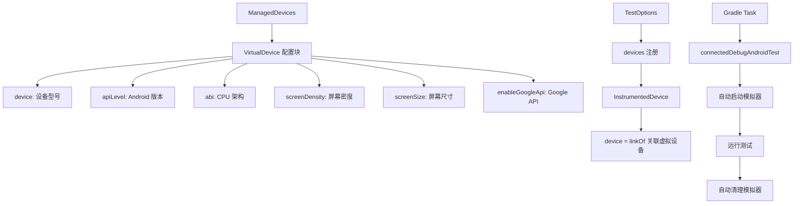

# 21.1.162 托管虚拟设备

太阳已经微微偏西。

洛芙伸了个懒腰，发现自己刚才不知不觉枕着黛琳的背包睡着了。她揉了揉眼睛，阳光透过树叶的缝隙，在草地上投下斑驳的光影。湖面上波光粼粼，偶尔有鱼跃出水面，溅起一圈圈涟漪。

“醒啦？”希尔的声音从旁边传来，“你这一觉睡得还挺香的，黛琳讲的东西你可都错过了。”

“哎呀……”洛芙赶紧坐起来，脸有点红，“讲到哪儿了？”

“讲完 ManagedDevices 了，”伊莎笑着递过来一瓶水，“现在要讲 ManagedVirtualDevice 了。说起来，这个我之前在项目里用过，就是配置模拟器的。”

“模拟器？”洛芙眼睛一亮，“就是那个可以在电脑上跑的手机模拟器吗？”

“对，”黛琳翻开新的一页手册，“VirtualDevice 就是虚拟设备。在 Android 开发中，我们不可能人手一台真机来跑测试，所以模拟器就成了很重要的工具。”

“那这个 ManagedVirtualDevice 是什么呢？”洛芙问道。

“ManagedVirtualDevice 是用来配置虚拟设备的具体参数，”黛琳指着手册上的代码说，“你可以把它想象成——伊莎，上次你说的那个比喻还记得吗？”

伊莎想了想：“就像露营的时候，我们要根据参加的人数来决定帐篷的大小和类型？有的帐篷是小型的，有的是大型的，有的可以住四个人，有的只能住两个人。”

“差不多，”黛琳笑了，“ManagedVirtualDevice 就是用来决定你的模拟器长什么样子的。你可以指定它用哪个 Android 版本、什么 CPU 架构、多大的屏幕、什么分辨率。”

希尔把电脑拿过来：“看，这就是 ManagedVirtualDevice 的基本用法。”

```kotlin
android {
    managedDevices {
        devices {
            // 创建一个虚拟设备（模拟器）
            create<VirtualDevice>("pixel8Emulator") {
                // 指定设备 ID
                device = "Pixel 8"
                // 指定屏幕密度
                screenDensity = ScreenDensity.QHD
                // 指定屏幕尺寸
                screenSize = ScreenSize.NORMAL
            }
        }
    }
    
    // 指定测试使用的设备
    testOptions {
        devices {
            // 为 instrumentedTest 指定设备
            register<InstrumentedDevice>("pixel8Emulator") {
                // 关联到上面创建的虚拟设备
                device = linkOf("pixel8Emulator")
            }
        }
    }
}
```

“等等，”洛芙举手问道，“那个 ScreenDensity.QHD 是什么呀？”

“屏幕密度，”希尔解释道，“QHD 就是 1440x2560 的分辨率，就像你的手机屏幕一样。还有很多其他的选项，比如 LDPI、MDPI、HDPI、XHDPI、XXHDPI、XXXHDPI 之类的。”

“这么多？”洛芙有点晕。

“其实不难记，”伊莎轻声说，“你想啊，L、M、H、X、XX、XXX 其实就是 Low、Medium、High、eXtra、eXXtra、eXXXtra 的缩写。越高越清晰，但也更占内存。”

黛琳点点头：“而且这些屏幕密度和真实的设备是对应的。比如 QHD 通常用在高端手机上，HD 用在中低端手机上。”

“那这个 device = 'Pixel 8' 又是怎么回事？”洛芙又问。

“这就要说到设备配置文件了，”黛琳调出另一段代码，“Android 模拟器提供了很多预定义的设备配置，比如 Pixel 系列、Nexus 系列、三星 Galaxy 系列等等。”

```kotlin
create<VirtualDevice>("pixel8ProEmulator") {
    // 使用预定义的设备配置
    device = "Pixel 8 Pro"
    // 指定系统镜像（API 级别）
    // 这是一个关键配置，决定了模拟器运行什么版本的 Android
    apiLevel = 34
    
    // 指定 ABI（应用程序二进制接口）
    // 这决定了模拟器使用什么 CPU 架构
    // 常用选项：armeabi-v7a, arm64-v8a, x86, x86_64
    abi = "arm64-v8a"
    
    // 是否启用 Google API（如果需要使用 Google Play 服务）
    // enableGoogleApi = true  // 默认 false
}
```

“API Level我知道！”洛芙高兴地说，“就是 Android 版本嘛！API 34 就是 Android 14，API 33 是 Android 13……”

“对，”黛琳笑了，“API Level 就是 Android 的版本号。34 对应 Android 14，33 对应 Android 13，以此类推。”

“那 ABI 是什么呢？”洛芙又问。

“ABI 是 Application Binary Interface 的缩写，”希尔解释道，“你可以理解为 CPU 的指令集。不同的手机用不同的 CPU，就需要不同的 ABI 来匹配。”

“比如呢？”洛芙眨眨眼。

“比如现在的手机大多数用 arm64-v8a，这是 ARM 架构的 64 位版本，”希尔掰着手指头数，“以前的老手机用 armeabi-v7a，是 32 位的。x86 和 x86_64 主要是给模拟器用的，因为大多数电脑是 x86 架构。”

伊莎补充道：“如果你的 App 需要在各种设备上都能跑，最好多配置几种 ABI。但如果你只想要最小的安装包，那就只选 arm64-v8a 就够了。”

黛琳点点头：“而且不同的 ABI 组合会影响模拟器的启动速度。x86 的模拟器在 x86 电脑上运行是最快的，因为不需要做指令翻译。”

“那如果我想同时测试不同的设备怎么办？”洛芙问道。

“这就涉及到多设备配置了，”黛琳调出新的代码示例，“你可以创建多个虚拟设备，每个有不同的配置，然后用 testTarget 来指定哪些测试在哪些设备上跑。”

```kotlin
android {
    managedDevices {
        devices {
            // 创建多个虚拟设备，覆盖不同的配置
            create<VirtualDevice>("pixel8Api34") {
                device = "Pixel 8"
                apiLevel = 34
                abi = "arm64-v8a"
                screenDensity = ScreenDensity.QHD
            }
            
            create<VirtualDevice>("pixel8Api33") {
                device = "Pixel 8"
                apiLevel = 33
                abi = "arm64-v8a"
                screenDensity = ScreenDensity.QHD
            }
            
            create<VirtualDevice>("pixel4Api34X86") {
                device = "Pixel 4"
                apiLevel = 34
                abi = "x86_64"  // x86 模拟器在电脑上运行更快
                screenDensity = ScreenDensity.XHDPI
            }
            
            // 低配置设备，测试兼容性
            create<VirtualDevice>("lowEndApi28") {
                device = "Pixel 3a"
                apiLevel = 28  // Android 9
                abi = "armeabi-v7a"
                screenDensity = ScreenDensity.HDPI
            }
        }
    }
    
    testOptions {
        devices {
            // 为每种测试类型指定运行设备
            
            // unitTest 在本地 JVM 运行，不需要设备
            // 但可以指定特定的 instrumentedTest 设备
            register<InstrumentedDevice>("pixel8Api34Test") {
                device = linkOf("pixel8Api34")
            }
            
            register<InstrumentedDevice>("pixel8Api33Test") {
                device = linkOf("pixel8Api33")
            }
            
            register<InstrumentedDevice>("pixel4X86Test") {
                device = linkOf("pixel4Api34X86")
            }
            
            register<InstrumentedDevice>("lowEndTest") {
                device = linkOf("lowEndApi28")
            }
        }
    }
}
```

“好复杂……”洛芙看着代码有点头疼。

“其实不复杂，”伊莎安慰道，“你想啊，这就像露营的时候，你要把不同的人安排到不同的帐篷里。有的人喜欢睡大帐篷，有的人喜欢睡小帐篷；有的人怕冷要睡厚的睡袋，有的人怕热要睡薄的。你得把这些都安排好，大家才能都舒服。”

“所以，”黛琳总结道，“ManagedVirtualDevice 就是帮你安排这些‘帐篷’的。你要告诉构建系统：我要用这个 API 级别的模拟器，我要用这种 CPU 架构，我要用这种屏幕配置。然后测试就会在相应的模拟器上运行。”

希尔补充道：“而且这样做的好处是，你可以在 CI/CD 流水线上自动跑这些测试。比如你配置了 API 28、33、34 三个级别的模拟器，每次提交代码后，系统会自动在三个版本的 Android 上跑测试，确保你的 App 向前向后都兼容。”

洛芙似懂非懂地点点头：“那……我可以试试自己配置一个吗？”

“当然可以，”黛琳把电脑递给洛芙，“来，试着用我们刚才学的知识，配置一个你自己的虚拟设备。”

洛芙深吸一口气，在键盘上敲了起来：

```kotlin
create<VirtualDevice>("myFirstEmulator") {
    device = "Pixel 7"
    apiLevel = 34
    abi = "arm64-v8a"
    screenDensity = ScreenDensity.FHD  // 1080x1920
}
```

“等等，FHD 是什么？”洛芙突然停下来。

“Full HD，”希尔说，“就是 1080p 分辨率，比 QHD 低一点，但大多数手机都是这个分辨率。”

洛芙修改了一下代码：

```kotlin
create<VirtualDevice>("myFirstEmulator") {
    device = "Pixel 7"
    apiLevel = 34
    abi = "arm64-v8a"
    screenDensity = ScreenDensity.FHD
}
```

“看起来不错，”黛琳点点头，“不过我建议再加一个 enableGoogleApi，因为很多 App 依赖 Google Play 服务。”

洛芙又补充了一行：

```kotlin
create<VirtualDevice>("myFirstEmulator") {
    device = "Pixel 7"
    apiLevel = 34
    abi = "arm64-v8a"
    screenDensity = ScreenDensity.FHD
    enableGoogleApi = true
}
```

“很好！”伊莎笑着说，“这就像你第一次自己搭帐篷，虽然可能没那么完美，但最重要的是动手去做了。”

洛芙开心地笑了。她抬头看了看天空，太阳已经偏西不少，湖面上泛起了金色的波光。远处的山峦轮廓依旧清晰，但色调似乎变得更柔和了。

“对了，”洛芙突然想到一个问题，“如果我想在模拟器上运行测试，要怎么跑呢？”

“这个啊，”希尔操作了一下电脑，“用 Gradle 的任务就可以了。”

```bash
# 运行 instrumentedTest 在指定的虚拟设备上
# 格式：connectedDebugAndroidTest<设备名>
# 例如：
./gradlew connectedDebugAndroidTestPixel8Api34

# 运行所有 instrumentedTest
./gradlew connectedDebugAndroidTest

# 或者用 testDebugUnitTest 运行单元测试
./gradlew testDebugUnitTest
```

“这么简单？”洛芙有点意外。

“对，就是这么简单，”黛琳说，“你配置好了 ManagedVirtualDevice，Gradle 会自动帮你管理模拟器的生命周期。启动、运行测试、停止、清理，全部自动化。”

“那如果我想同时跑多个设备的测试呢？”洛芙又问。

“那就用 Gradle 的并行执行，”希尔调出另一段配置，“配合 testOptions，你可以让测试在多个模拟器上同时跑。”

```kotlin
// 在 build.gradle 中启用并行测试执行
tasks.withType<Test> {
    // 允许并行执行测试
    // 注意：这需要在 testOptions 中正确配置多个设备
    maxParallelForks = 4
}
```

伊莎补充道：“不过并行跑测试会占用很多系统资源。如果你的电脑内存不够，最好还是一个个跑。”

洛芙似懂非懂地点点头。她把电脑还给希尔，抬头看向湖面。几只白鹭从湖面上飞过，留下一串倒影。

“我觉得，”洛芙慢慢地说，“这个 ManagedVirtualDevice 就像……就像露营装备清单一样。你要提前想好需要什么装备，然后一件件准备好。这样真正开始露营的时候，才不会手忙脚乱。”

“有道理，”黛琳微笑着说，“而且这个清单是可以复用的。这次露营用了这些装备，下次还可以用，还可以根据需要增减。”

“对！”洛芙眼睛亮了起来，“而且配置好的虚拟设备可以一直用，下次开发新功能的时候，直接跑测试就行了。”

“没错，”希尔说，“这就是自动化的力量。你配置一次，然后每次提交代码都可以自动跑测试，省时又省力。”

伊莎站起身，伸了个懒腰：“好了，今天学了很多东西了。我们是不是该准备晚饭了？”

“对哦，”洛芙也站起来，“今天吃什么？”

“当然是烤肉！”希尔兴奋地说，“我带了秘制的腌制五花肉！”

四个女孩收拾好东西，朝着露营区的烧烤台走去。夕阳把他们的影子拉得很长，湖面上倒映着金色的晚霞。

---

> 托管虚拟设备（ManagedVirtualDevice）是 Android Gradle DSL 中用于配置 Android 模拟器的核心 API。通过它可以指定设备型号、系统镜像（API 级别）、CPU 架构（ABI）、屏幕密度和尺寸等参数，实现自动化设备测试。

---

#### 结构图



---

#### 反模式与陷阱

1. **API Level 配置过低**  
   - 陷阱：设置过低的 apiLevel（如 21）可能导致某些新 API 无法测试  
   - 修复：至少设置为 minSdkVersion 以上的版本，并根据需要测试最新特性

2. **ABI 选择不当**  
   - 陷阱：只在 x86 模拟器上测试，可能遗漏 ARM 设备上的兼容性问题  
   - 修复：至少测试 arm64-v8a 和 x86_64 两种 ABI

3. **忘记启用 Google API**  
   - 陷阱：未设置 enableGoogleApi 导致依赖 Google Play 服务的功能无法测试  
   - 修复：如果 App 依赖 GMS，明确设置为 enableGoogleApi = true

4. **并行测试耗尽资源**  
   - 陷阱：同时运行过多模拟器导致 OOM  
   - 修复：根据机器配置调整 maxParallelForks，通常 2-4 个较安全

---

#### 设计哲学

**设备测试的分层策略**：

1. **版本覆盖**：至少测试 minSdkVersion、targetSdkVersion、以及最新的稳定版本
2. **架构覆盖**：测试 ARM（arm64-v8a）和 x86（x86_64）两种主流 ABI
3. **屏幕适配**：测试至少一个高端密度（QHD/XXHDPI）和一个主流密度（FHD/XHDPI）
4. **CI 集成**：将多设备测试集成到 CI 流水线，确保每次提交都覆盖关键设备组合

---

#### 动手练习

**Task 1：配置你的第一个虚拟设备**

- **目标**：在 Gradle 项目中配置一个可用的虚拟设备
- **步骤**：
  1. 在 app 模块的 build.gradle 中添加 managedDevices 配置
  2. 创建一个 VirtualDevice，指定 device = "Pixel 8"，apiLevel = 34
  3. 在 testOptions 中注册 InstrumentedDevice 并关联该虚拟设备
- **验收标准**：
  - [ ] 代码无语法错误
  - [ ] 能够通过 ./gradlew tasks --all 看到新设备相关的任务
  - [ ] 配置了 screenDensity 参数

**Task 2：多版本覆盖测试**

- **目标**：配置多个 API 级别的虚拟设备，实现版本覆盖
- **步骤**：
  1. 创建三个 VirtualDevice：apiLevel 分别为 28、33、34
  2. 保持其他配置相同（device、abi、screenDensity）
  3. 为每个虚拟设备注册对应的 InstrumentedDevice
- **验收标准**：
  - [ ] 三个设备配置全部正确
  - [ ] 可以运行 ./gradlew connectedDebugAndroidTest 在所有设备上测试
  - [ ] 理解版本覆盖测试的意义

**Task 3：CI 集成配置**

- **目标**：了解如何在 CI 环境中运行多设备测试
- **步骤**：
  1. 阅读 Gradle 文档中关于 testOptions 的说明
  2. 创建一个 task（如 runAllDeviceTests）组合多个设备的测试任务
  3. 了解如何配置 GitHub Actions 或 GitLab CI 运行这些任务
- **验收标准**：
  - [ ] 能够解释如何并行运行多个设备的测试
  - [ ] 了解 CI 配置的基本要素

**Task 4：设备配置优化**

- **目标**：根据实际需求优化虚拟设备配置
- **步骤**：
  1. 分析自己的 App 兼容哪些 Android 版本
  2. 确定需要测试的最低版本和目标版本
  3. 选择合适的 ABI 和屏幕密度组合
- **验收标准**：
  - [ ] 给出的配置方案有明确的理由说明
  - [ ] 能够解释为什么不配置某些 ABI 或 API 级别

---

#### 面试热身

1. **Q: 请解释 ManagedVirtualDevice 的主要配置参数及其作用**  
   - 提示：从 device、apiLevel、abi、screenDensity 四个维度回答

2. **Q: 如何在 CI/CD 中实现多设备自动化测试？**  
   - 提示：结合 Gradle 任务和 CI 平台配置回答

3. **Q: 为什么需要测试多个 ABI？只测试一个不行吗？**  
   - 提示：从 ARM 和 x86 架构差异、NDK 原生代码兼容性角度回答

4. **Q: 模拟器测试和真机测试各有什么优缺点？**  
   - 提示：从成本、覆盖率、执行速度、真实性几个方面对比

5. **Q: 如何选择合适的 API Level 进行测试？**  
   - 提示：结合 minSdkVersion、targetSdkVersion、市场分布考虑

---

#### 参考实现要点

1. **优先测试真机**：模拟器测试无法完全替代真机测试，特别是涉及硬件特性的场景
2. **版本覆盖策略**：至少覆盖最低支持版本、目标版本、最新的稳定版本
3. **ABI 选择**：现代 App 建议至少包含 arm64-v8a，如需兼容老设备可加上 armeabi-v7a
4. **屏幕密度**：主流设备通常使用 FHD/XHDPI，测试配置应覆盖这两种
5. **Google API**：如果 App 依赖 GMS，务必启用 enableGoogleApi = true

---

> 学会配置虚拟设备，就等于拥有了一个可以随时复用的测试环境。下次写新功能的时候，就不用担心没有设备测试了。

---

## 洛芙的小小日记本

今天学会了配置模拟器！原来在电脑上就可以跑 Android 测试，还可以同时跑好几个版本的测试。黛琳说这就跟露营前准备装备一样，提前准备好，到时候就不慌了。希尔烤肉的技术好棒啊！

---

## 今日关键词

- **ManagedVirtualDevice**：Android Gradle DSL 中用于配置虚拟设备（模拟器）的 API
- **VirtualDevice**：虚拟设备类型，用于创建模拟器配置
- **apiLevel**：Android 系统版本号，如 34 代表 Android 14
- **abi**：应用程序二进制接口，决定 CPU 架构（arm64-v8a、x86_64 等）
- **screenDensity**：屏幕像素密度（QHD、FHD、XHDPI 等）
- **enableGoogleApi**：是否启用 Google Play 服务 API
- **InstrumentedDevice**：设备测试注册对象，用于关联虚拟设备和测试任务
- **connectedDebugAndroidTest**：Gradle 任务，用于在连接设备上运行 instrumented 测试
- **ScreenDensity**：屏幕密度枚举类，包含 LDPI 到 XXXHDPI 等选项
- **device**：设备配置文件名，对应 AVD Manager 中的预定义设备
