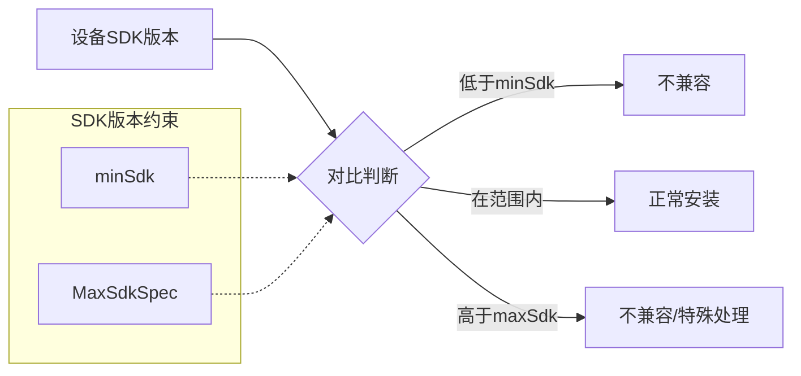
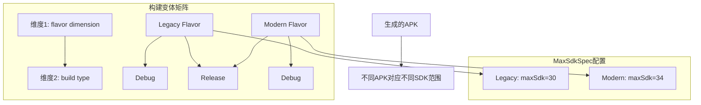
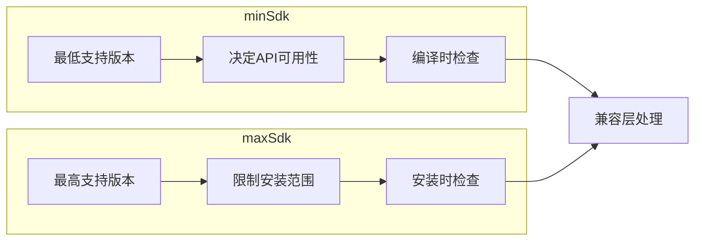

# 21.1.163 最大SDK规格

金色的阳光渐渐西斜，把湖畔的树影拉得越来越长。洛芙惬意地伸了个懒腰，发现黛琳又从背包里抽出了一本新的技术手册。

"这本书又讲什么呀？"洛芙凑过去看封面上烫金的标题——虽然她一个词也看不懂。

"MaxSdkSpec。"黛琳翻开书页，"今天我们学习怎么给应用的SDK版本设上限。"

"上限？"洛芙眨眨眼，"就是不能超过某个版本的意思吗？"

"对。"黛琳点点头，"有时候你的应用只能在某些SDK版本以下才能正常工作，或者你想针对不同版本的设备提供不同的构建配置这时候就需要用到MaxSdkSpec了。"

伊莎正在整理她散开的发带，希尔则已经把笔记本打开了。晚风轻轻吹过，带来湖水和青草的香气。

---

**为什么需要设SDK上限？**

"我先问一下，"洛芙举起手，"之前我们学的minSdk、targetSdk都是最低要求，为什么还需要一个最高限制呢？"

黛琳微微一笑，把白板笔拿在手里转了一圈："好问题。你想啊，如果Google发布了一个新版本的SDK，里面某个API的行为发生了变化，甚至被废弃了，你的应用在那个版本上可能会出现奇怪的问题。"

"就像有些手机游戏在新系统上闪退一样？"洛芙联想到自己的经历。

"Exactly。"希尔接话，"比如某个库在新版SDK里API签名变了，如果你没更新依赖就会编译失败。但有时候我们暂时不想升级整个项目架构，这时候就可以用MaxSdkSpec限制一下。"

伊莎轻柔地把垂落的发丝别到耳后："还有一种情况是，有些特性只在特定版本范围内有效。比如你想让应用在Android 12到14之间运行，那就需要同时设置minSdk和maxSdk来限定范围。"

黛琳在白板上画了一个简单的图示：



"这个图展示了SDK版本检查的基本逻辑。"黛琳解释道，"当你设置了MaxSdkSpec之后，系统会在安装时检查设备的SDK版本，如果超过了你设定的上限，就会阻止安装或者触发特殊处理。"

---

**MaxSdkSpec的基本用法**

希尔在笔记本上敲了一段代码：

```kotlin
android {
    defaultConfig {
        // 设置最小SDK版本
        minSdk = 24
        // 使用MaxSdkSpec设置最大SDK版本
        maxSdk = 33
    }
    
    // 也可以在productFlavors中针对不同风味设置不同的限制
    productFlavors {
        create("legacy") {
            maxSdk = 30  // 这个风味的版本只支持到Android 11
        }
        create("modern") {
            // 不设置maxSdk，表示没有上限
        }
    }
}
```

"这个代码展示了两种常见用法。"希尔说，"第一种是在defaultConfig里全局设置；第二种是在不同的productFlavor中设置不同的上限，这样你可以为不同用户群提供不同版本支持的构建。"

洛芙歪着头看代码："可是这个maxSdk我好像在别的地方见过类似的？"

"你说的是android:maxSdkVersion属性吧？"黛琳点点头，"那个是在AndroidManifest.xml里用的，功能类似，但MaxSdkSpec是Gradle DSL层面的配置，更灵活，而且能参与构建变体的逻辑。"

---

**版本范围的实际应用场景**

伊莎捧起她的热可可杯，轻声说："我想到一个很实际的例子。"

"什么例子？"洛芙好奇地问。

"有些银行或者企业应用，它们需要兼容特定的安全标准。"伊莎解释道，"比如某个版本的Android系统有已知的安全漏洞，或者某个设备厂商的特定版本有问题这时候就可以用MaxSdkSpec来限制应用只能安装在安全的版本范围内。"

黛琳补充道："还有一个场景是测试新特性。你可能有一个功能只在Android 14上才能用，但你想先在内部测试，这时候可以创建一个构建变体，maxSdk设为14，等测试通过后再放宽限制。"

希尔调出另一段代码示例：

```kotlin
android {
    defaultConfig {
        // 针对不同设备配置不同的SDK范围
        // 平板设备
        resConfigs("tablet") {
            minSdk = 21
            maxSdk = 34
        }
        // 手机设备  
        resConfigs("phone") {
            minSdk = 24
            // 不设上限，支持最新系统
        }
    }
}

// 使用SDK版本条件依赖
dependencies {
    // 只有在SDK版本不超过30时才添加这个依赖
    implementation("com.example:legacy-support:1.0") {
        if (project.hasProperty("maxSdkVersion") && maxSdkVersion <= 30) {
            // 条件依赖逻辑
        }
    }
}
```

"这段代码展示了更复杂的场景。"希尔解释道，"你可以根据设备类型（平板vs手机）设置不同的SDK范围，或者根据maxSdk的条件来调整依赖关系。"

---

**构建变体与MaxSdkSpec的配合**

"那MaxSdkSpec和构建变体到底怎么配合呢？"洛芙抛出新问题。

黛琳重新画了一幅图来解释：



"每个构建变体都可以有自己独立的MaxSdkSpec配置。"黛琳说，"比如你想发布两个版本的APP：一个面向老用户（maxSdk=30，兼容性好），一个面向新用户（maxSdk不设限或者更高），就可以通过构建变体来实现。"

希尔补充了一个实际案例：

```kotlin
// 在android块中配置
android {
    // 启用构建版本号
    namespace = "com.example.app"
    
    defaultConfig {
        minSdk = 21
        // 默认不设上限
    }
    
    // 为特定构建类型添加限制
    buildTypes {
        release {
            // 正式发布的构建可以设一个安全上限
            // 防止在最新系统上出现未知问题
            maxSdk = 34
        }
        debug {
            // 调试构建不设限，方便测试新系统
        }
    }
    
    // 为不同渠道设置不同限制
    flavorDimensions += "version"
    productFlavors {
        create("stable") {
            dimension = "version"
            maxSdk = 33  // 稳定版限制到Android 13
        }
        create("beta") {
            dimension = "version"
            maxSdk = 34  // 测试版可以到Android 14
        }
    }
}
```

"这个例子展示了三种设置MaxSdkSpec的方式。"希尔说，"defaultConfig设置默认全局值，buildType针对发布类型调整，productFlavor针对渠道定制。三个层次可以叠加或者覆盖。"

---

**版本检查的运行时行为**

"说了这么多，那运行的时候会发生什么呢？"洛芙好奇地问。

黛琳收起白板笔："这个问题很好。MaxSdkSpec的检查分为两个时机：编译时和安装时。"

"编译时？"洛芙问。

"对的。"黛琳解释道，"Gradle在构建时会读取你的MaxSdkSpec配置，然后决定是否包含某些资源、代码或者依赖。如果某个API只在特定版本以上可用，但你的maxSdk低于那个版本，Gradle会提示你或者自动排除那些代码。"

伊莎补充："安装时的检查是Google Play或者系统应用市场做的。如果用户的设备SDK版本超过了你的maxSdk，安装就会被拒绝。"

希尔补充了一个重要的细节：

```kotlin
// 在代码中也可以动态检查SDK版本
fun checkSdkCompatibility(): Boolean {
    val currentSdk = Build.VERSION.SDK_INT
    val maxSupportedSdk = 33  // 这个值可以从BuildConfig读取
    
    return currentSdk <= maxSupportedSdk
}

// 在应用启动时提醒用户
fun onAppStart() {
    if (Build.VERSION.SDK_INT > BuildConfig.MAX_SDK_VERSION) {
        // 显示兼容性警告
        showCompatibilityWarning()
    }
}
```

"不过要注意，"希尔补充道，"MaxSdkSpec的安装时检查只在通过Google Play等官方渠道安装时才会生效。直接从APK文件安装的话，系统不会执行这个检查。"

---

**版本范围的最佳实践**

伊莎轻声总结道："其实对于大多数应用来说，设置minSdk就够了，不需要特意设置maxSdk。"

"那什么时候才需要设呢？"洛芙问。

"三种情况。"黛琳伸出三根手指，"第一，你的应用依赖的某个库或者SDK有已知问题，只能在特定版本以下工作；第二，你想为不同用户群提供不同版本支持的产品；第三，你在测试新特性，需要限定测试范围。"

"还有一点很重要。"希尔补充道，"设置maxSdk要谨慎，因为随着Android系统不断更新，你会需要定期维护这个值。如果设得太低，可能会导致大量用户无法更新你的应用。"

洛芙似懂非懂地点点头："所以MaxSdkSpec就像是一把双刃剑，用得好可以保护应用，用得不好反而会限制用户？"

"比喻得不错。"黛琳微笑着说。

---

**代码验证与测试**

希尔把笔记本转过来给大家看："我写了一个简单的验证脚本，可以测试MaxSdkSpec是否生效。"

```kotlin
// build.gradle.kts 示例
plugins {
    id("com.android.application")
}

android {
    namespace = "com.example.test"
    compileSdk = 34
    
    defaultConfig {
        applicationId = "com.example.test"
        minSdk = 24
        maxSdk = 33  // 限制最高支持到Android 13
        
        versionCode = 1
        versionName = "1.0"
    }
    
    buildTypes {
        release {
            isMinifyEnabled = false
        }
    }
}

// 在代码中读取配置
object BuildConfig {
    const val MIN_SDK_VERSION = 24
    const val MAX_SDK_VERSION = 33
}

// 测试用例
@Test
fun testSdkVersionConstraint() {
    val deviceSdk = Build.VERSION.SDK_INT
    val maxSupported = BuildConfig.MAX_SDK_VERSION
    val minSupported = BuildConfig.MIN_SDK_VERSION
    
    assertTrue("设备SDK版本 $deviceSdk 低于最小支持版本 $minSupported", 
               deviceSdk >= minSupported)
    assertTrue("设备SDK版本 $deviceSdk 超过最大支持版本 $maxSupported",
               deviceSdk <= maxSupported)
}
```

"这个测试展示了如何验证SDK版本约束。"希尔说，"在实际项目中，你可以通过BuildConfig来读取这些配置值，然后在代码中做兼容性检查。"

---

**与minSdk的区别对比**

洛芙举手提问："我有点混乱了，minSdk和MaxSdkSpec到底有什么区别？"

黛琳画了一个对比表：



"minSdk告诉你'最低需要什么版本才能运行'，MaxSdkSpec告诉你'最高支持到哪个版本'。"黛琳简洁地解释，"minSdk更常用，因为大多数应用需要尽可能广泛的兼容性。MaxSdkSpec是特殊场景下才用的。"

---

金色的夕阳已经完全沉入湖面，天边只剩下最后一道霞光。四人收拾好野餐垫，准备回帐篷。

"今天的MaxSdkSpec感觉比之前的ManagedVirtualDevice难懂一点。"洛芙说。

"因为它涉及到更多的构建逻辑。"黛琳回答，"不过不要紧，多实践几次就熟悉了。"

伊莎轻声说："其实仔细想想，这个设计和露营也很像——有些路只能走特定的季节，有些地方只能到达特定的高度。"

"你这比喻也只有你能想出来了。"希尔笑着说。

晚风渐起，湖畔的灯笼开始亮了起来。

---

> 学习建议

1. **理解使用场景**：MaxSdkSpec不是必需的，只有在特定场景下才需要使用。优先考虑minSdk的兼容性设置。

2. **构建变体配合**：MaxSdkSpec可以与productFlavors和buildTypes配合，实现不同渠道或版本的不同支持策略。

3. **定期维护**：如果设置了MaxSdkSpec，记得定期检查和更新，因为Android系统版本在不断推进。

4. **测试验证**：使用模拟器测试不同SDK版本的设备，确保配置正确生效。

5. **文档参考**：查阅Android官方Gradle DSL文档了解最新的API变化。

---

## 洛芙的小小日记本

今天是关于MaxSdkSpec的一天～黛琳说这个可以给APP设置最高能用的系统版本，就像露营时有些路线有海拔上限一样。虽然现在大多数APP不需要设上限，但了解这个可以帮助我理解Android的版本兼容性机制。希尔说以后如果做企业级应用可能会用到，感觉离我还很远，但还是很有收获！(99字)

---

## 今日关键词

- **MaxSdkSpec**：Android Gradle DSL中用于设置应用最高支持SDK版本的配置对象
- **minSdk**：应用最低支持的SDK版本，决定API可用性
- **targetSdk**：应用瞄准的SDK版本，影响运行时行为
- **compileSdk**：编译时使用的SDK版本
- **productFlavors**：构建变体维度，用于创建不同版本的应用
- **buildTypes**：构建类型，如debug和release
- **BuildConfig**：自动生成的构建配置类，包含版本信息
- **ABI**：Application Binary Interface，应用二进制接口
- **SDK版本检查**：系统在安装和运行时检查设备SDK版本是否符合应用要求
- **构建变体**：不同维度组合产生的应用变体